

아, 여기가 상류였어? 꽤 멀리까지 올라왔네. 저 멀리 잔상들이 바글바글 모여있는 곳이 보인다.





마치 소리가 모여 만들어진 것처럼 생긴 노란색 구체에선 '같이 시합하러 가자'와 같은 말이 흘러나오고 있고, 그 주변에 작은 잔상들이 모여 둥글게 돌며 춤추고 있다. 방랑자의 말처럼, 기괴하면서도 귀여운 장면이다.

기염과 방랑자를 발견한 조금 큰 잔상들이 방랑자와 기염 때문에 흥이 다 깨져버렸으니까 책임지라며 덤벼온다. 역행비 때문에 잔상이 더 몰려올 수 있으니, 서둘러 잔상들을 처리했다.



이게 대체 무슨 말을 하고 싶어 하는 건지 도저히 알 수가 없네.





음, 여기서 리듬 게임을 하게 될 줄은 몰랐는데.

보통 리듬 게임은 배경에 음악이 깔리고, 음악의 박자에 맞춰 노트가 나오는데, 이 리듬 게임은 배경 음악이 전혀 들리지 않는다. 일부러 다른 음량을 줄였는데도 음악이 들리지 않은 걸 보면, 배경 음악이 없는 게 맞다.





레이싱 대회 때의 외침과 구조 요청 소리가 겹쳐 있다. 기염이 누군가가 이 영역에 갇혀 있을 수도 있다고 말하는데... 그게 가능한 일인가? 새어 나오는 소리 중, '뒤엉킨 잔상'도 적잖이 신경 쓰인다.

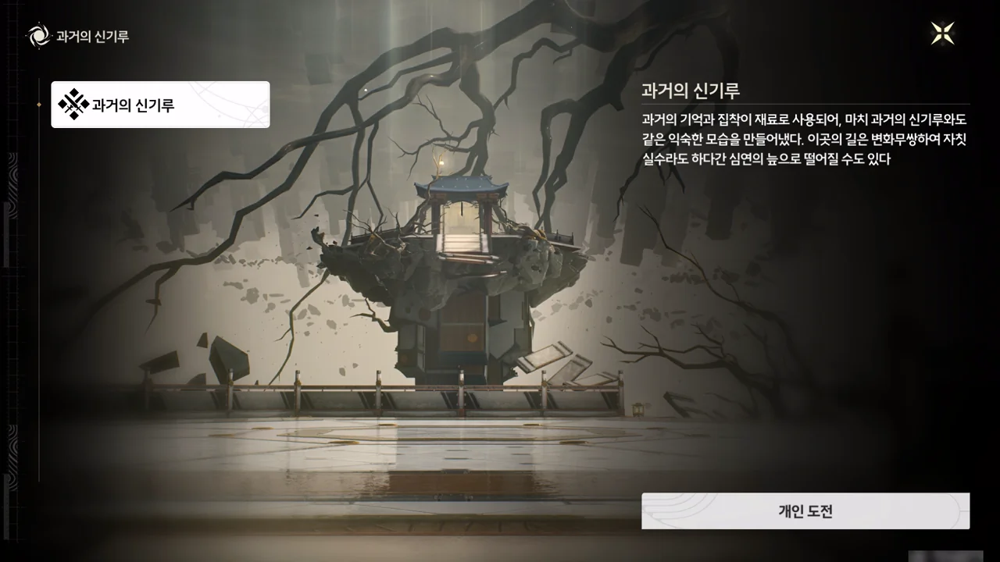

> **과거의 신기루**
> ***
> 과거의 기억과 집착이 재료로 사용되어, 마치 과거의 신기루와도 같은 익숙한 모습을 만들어냈다. 이곳의 길은 변화무쌍하여 자칫 실수라도 하다간 심연의 늪으로 떨어질 수도 있다.
{.bq}

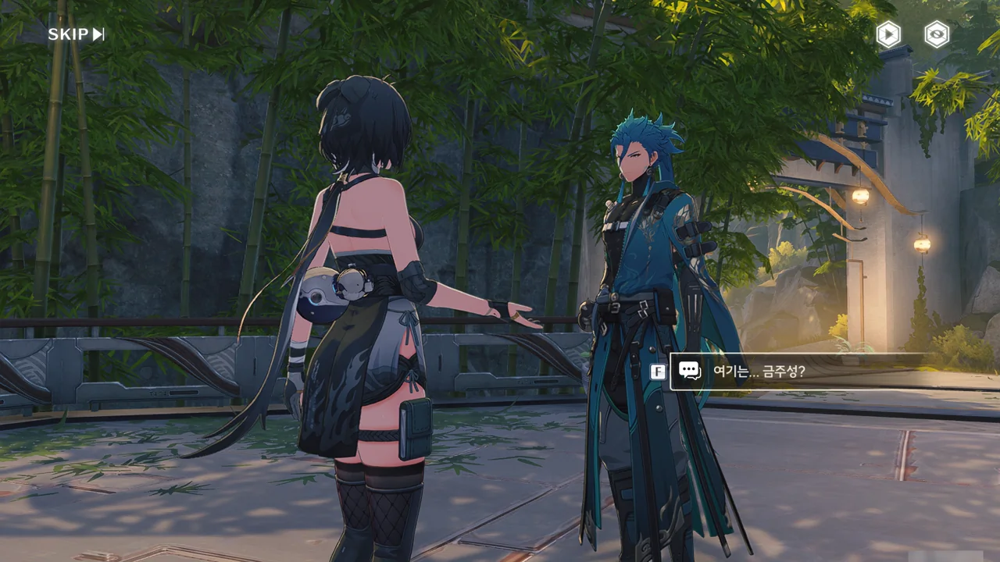



기억과 집념 등의 주파수로 형성된  내부의 모습이 금주성과 닮았다고 말하는데, 정작 난 이곳과 비슷한 장소를 금주성에서 보지 못했다.



금주성 내부에 이런 대나무 숲이 있었던가?

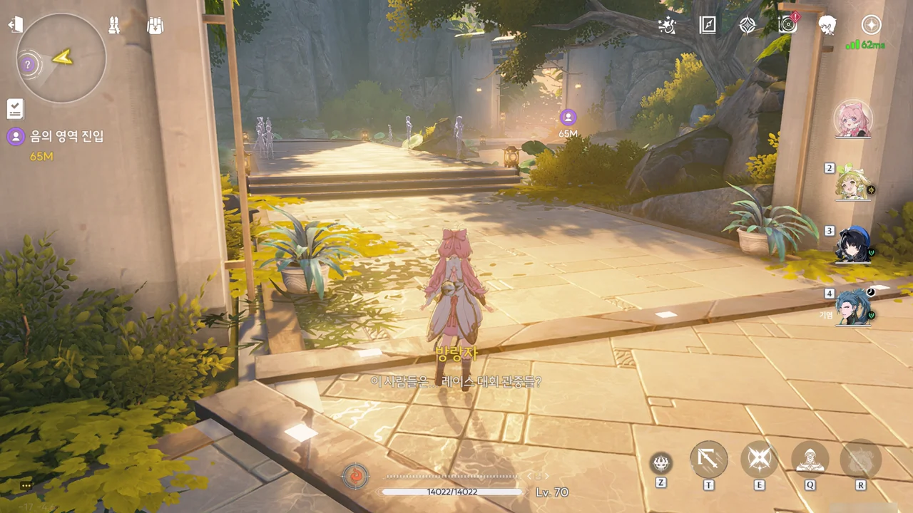





대회에 대한 기억이 투영되어 '껍데기만 남은 유령' 같은 레이스 대회 관중을 만들어냈다.





> 꾹꾹복어를 타봐도 될까?

설마 꾹꾹복어가 폭주할 때 사람을 태운 게 이것 때문이었나?

> 임시 소대가... 배턴을 넘겨주는 데 실수를...

이상하다. 10년 전 임시 소대는 분명 신기록을 세웠다고 들었는데... 설마 배턴을 떨어트리는 실수를 하고도 신기록을 세운 건가?

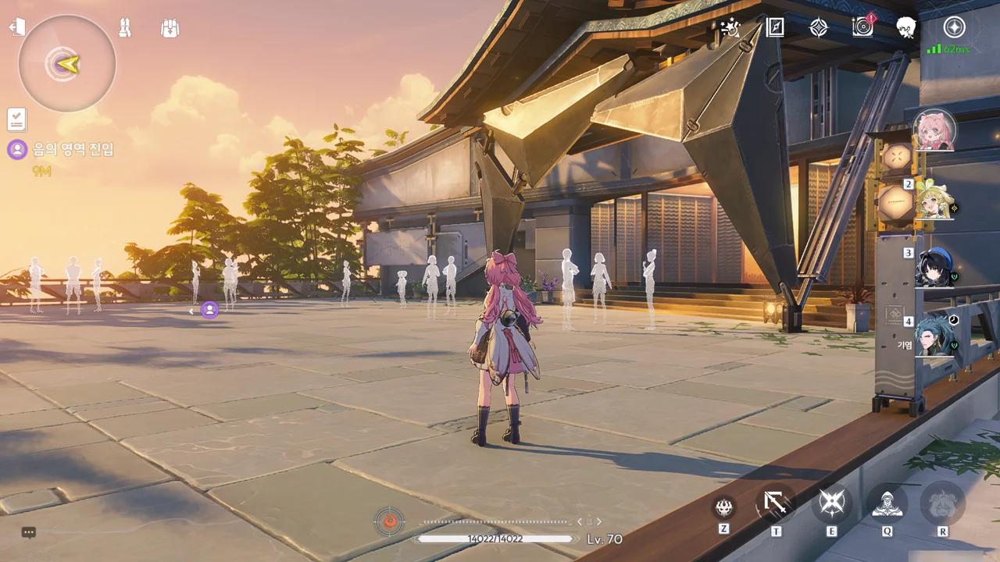

대회 관중의 유령이 바글바글 모여있다.





10년 전 임시 소대의 협동력은 그리 좋지 않았던 건지, 경기 도중 실수가 잦았던 것으로 보인다. 그리고 분명 기염은 10년 전 레이싱 대회에 참여했다. 아마 임시 소대의 일원으로 참여했겠지.





갑자기 기괴한 소리와 함께 주변에 있던 관중의 유령이 방랑자와 기염을 인식했다. 분명 유령은 외부를 전혀 인식하지 못하고 앵무새처럼 과거 있었던 일을 되풀이하기만 하는 것 아니었어?



대체 어떻게 된 건지 잘 모르겠지만, 앞에 있던 유령이 잔상으로 변해 덤비길래 전부 처리했다.





대체 왜 잔상이 10년 전의 레이스 대회를 모방하고 있는 걸까? 가면 갈수록 의문이 풀리긴커녕 의문이 더해져만 간다.

드디어 기염이 자기 입으로 자신이 10년 전 임시 소대에 있었다고 밝혔다.





어디선가 타종 광장의 종소리가 들려온다. 대체 왜 타종 광장의 종소리가 여기서 들리는 거지?

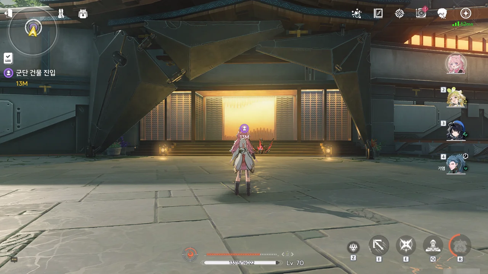

대충 이렇게 생긴 건물은 금주성에서 많이 보긴 했다. 그런데 이게 '군단 건물'이라고?

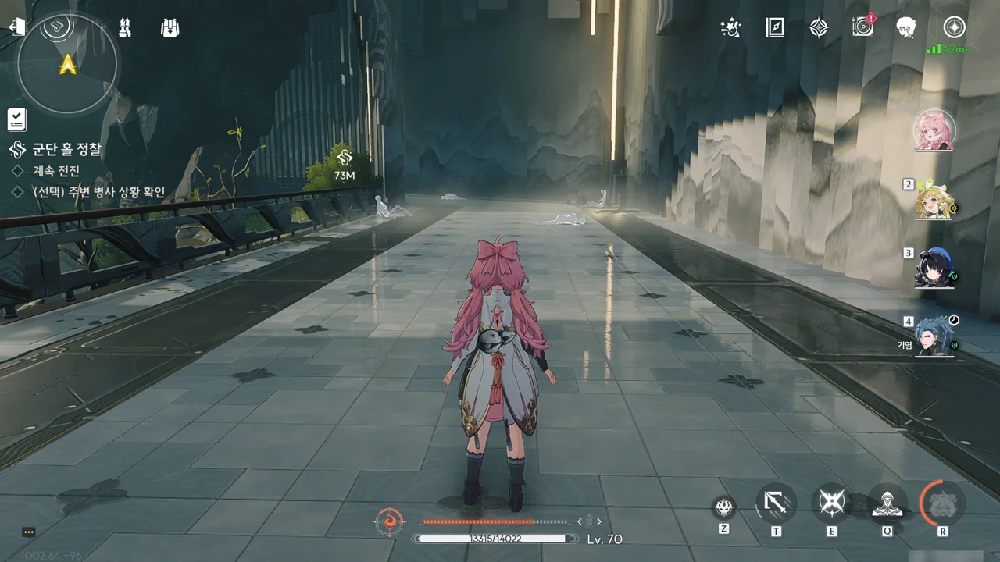

곳곳에 유령인지 잔상인지 모를 것이 바닥이나 벽에 기대 쓰러져 있다.

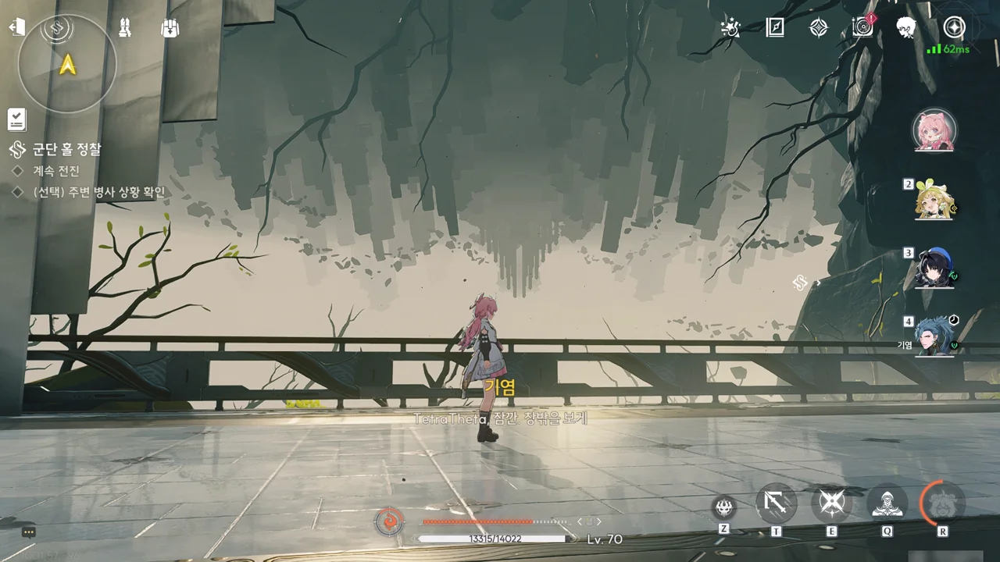





통로 바깥엔 뒤집힌 *도시* --- 도시가 맞긴 한건지조차 의심스럽게 생긴 --- 가 있다.

기염이 통로 곳곳에 쓰러져 있는 야귀 병사는 유령이 아닌 잔상이라고 알려준다.

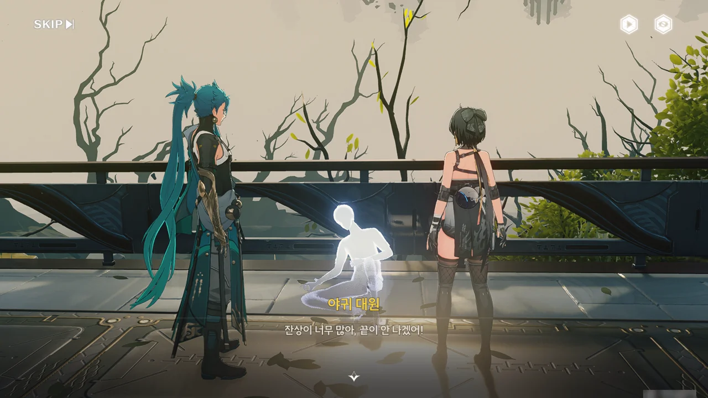





이 잔상은 흡수한 야귀군의 기억에 먹힌 건지, 마치 유령처럼 전쟁터에서의 기억을 끊임없이 재생하고 있다.

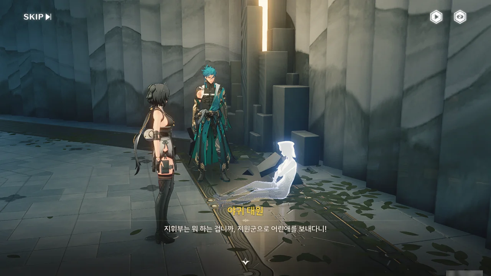





이 잔상 역시 흡수한 야귀군의 기억에 먹혀 유령처럼 기억을 무한히 재생하고 있다. 분명 적일 텐데, 이 정도면 조금은 불쌍해진다.

10년 전, 잔상류가 여러 방어선을 동시에 습격하자, 병력이 턱없이 부족해진 야귀군은 이제 막 훈련을 마친 신병마저 전선에 지원군으로 보내야 했다. 숙련도가 떨어지는 신병이 최전선에 무턱대고 투입되었으니, 수많은 사람들이 죽어나갈 수밖에 없었다.

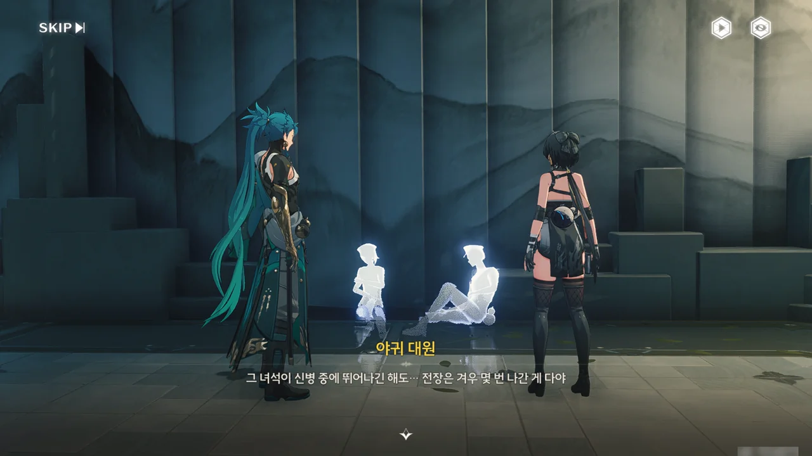







이 이야기는 10년 전의 이야기가 아니라, 3년 전 「곡도 전쟁」 당시의 일 같은데...? 이 유령-잔상이 말하는 이야기가 10년 전 이야기인지, 3년 전 이야기인지 확신이 들지 않는다.

장군 --- 3년 전 이야기라면, 분명 가서림 장군일 것이다 --- 은 떠나기 전, 전장에 겨우 몇 번 나간 게 전부인 신병 --- 아마 기염이겠지 --- 에게 지휘권을 넘기고 떠났다. 한 발짝만 물러나도 곧바로 금주성인 상황에, 신병은 후퇴하지 않고 단호히 방어선 --- 그리고 그 뒤에 있는 더 많은 사람들 --- 을 지키는 걸 선택했고, 그 덕분에 잡석고지가 함락되지 않고 버틸 수 있었다. 하지만 그 대가로 수많은 야귀군이 목숨을 잃어야 했다.

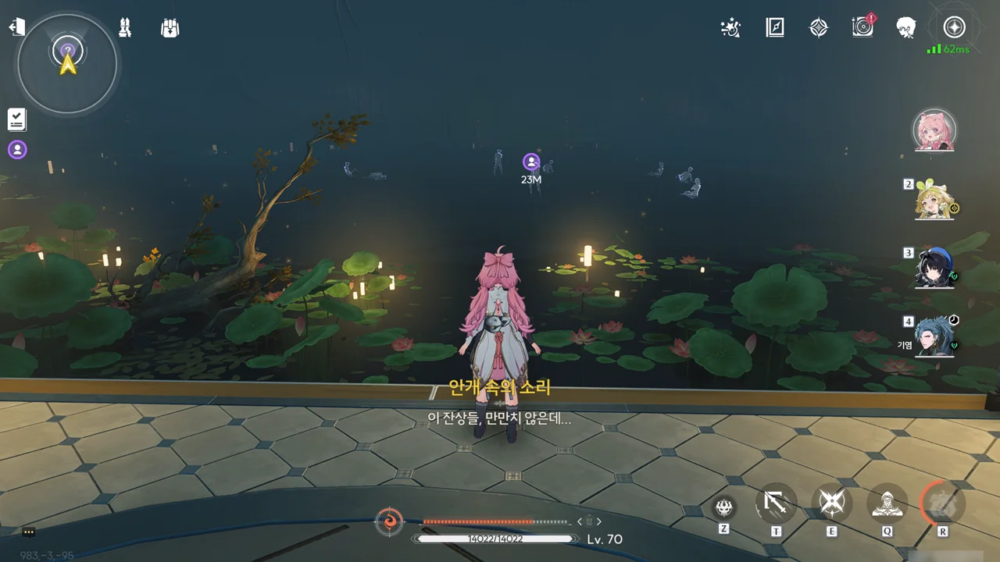





광장처럼 넓은 방 안에 전쟁터에서 전사한 야귀군의 기억에 먹힌 유령-잔상이 잔뜩 있다. 설마 저 잔상들이 한꺼번에 덤비는 건 아니겠지?





그럼 그렇지. 기염이 주위를 잘 살피라는 말을 하자마자 유령-잔상이 싸악 사라지더니, 정신을 차린 잔상들이 떼거지로 덤벼왔다.









10년 전, 레이스 대회가 끝난 후, 잡석 고지에 예상치 못한 잔상류가 발생해 여러 방어선을 동시에 습격했다. 상황이 급박한 탓에, 야귀군은 이제 막 훈련을 마친 신병까지 방어선에 투입해야 했다. 결국 잔상류를 막아내는 데에는 성공했지만, 그 대가로 수많은 이들이 싸늘한 주검으로 잡석 고지에 남겨졌으며, 이는 레이싱 대회에서 기염과 함께한 임시 소대 역시 마찬가지였다.

우리가 여태껏 보아온 유령-잔상은 잔상이 전사한 야귀군의 주파수를 계속 흡수 · 융합하다가, 흡수한 야귀군의 기억에 역으로 먹혀, 자신을 야귀군으로 여기게 된 모습이라고 한다. "What You Are Is What You Eat"이라는 말이 있는데, 딱 그 꼴이다.

주파수가 잔상에 흡수된다는 건 주파수가 잔상의 주파수로 변한다는 말과 같다. 잔상에 먹힌 야귀군의 주파수는 잔상이 되기 싫어 무의식적으로 이에 저항했고, 그게 우리가 음의 영역 바깥에서 본 다양한 현상으로 나타났다.

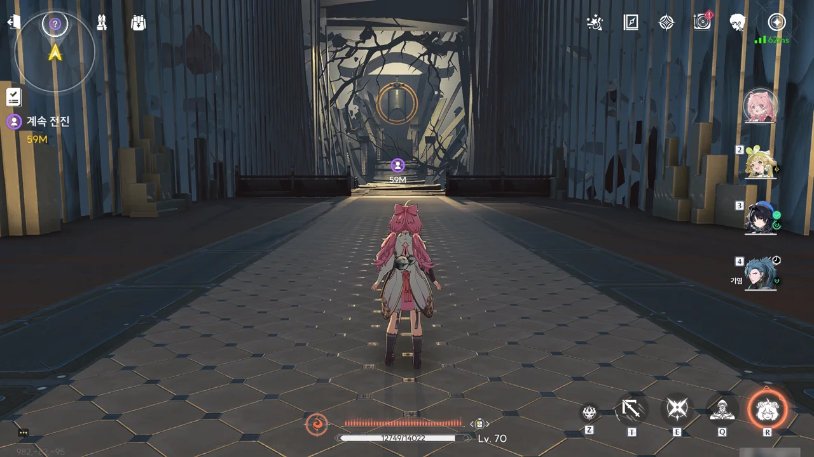

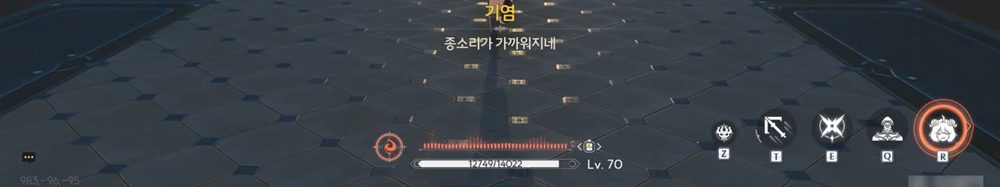

저기 앞에 타종 광장에 걸린 종이 보인다.

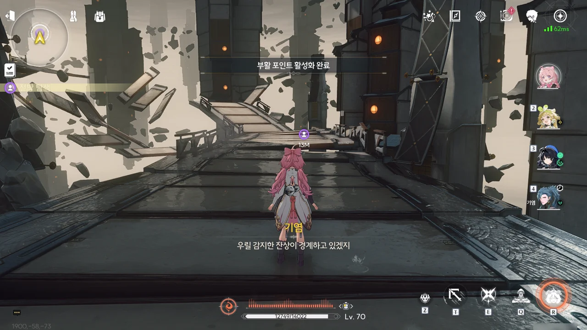

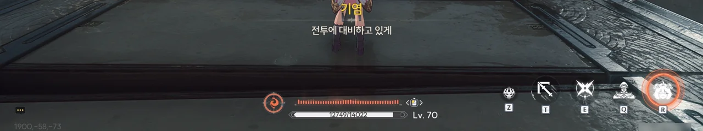

하지만 몇 걸음 걷지도 않았는데 갑자기 주변 환경이 뒤바뀌며, 이상한 공간으로 이동되었다.



바닥에 무음구역 성흔도 없는데, 잔상이 무음구역에서처럼 하늘에서 떨어져 내린다.

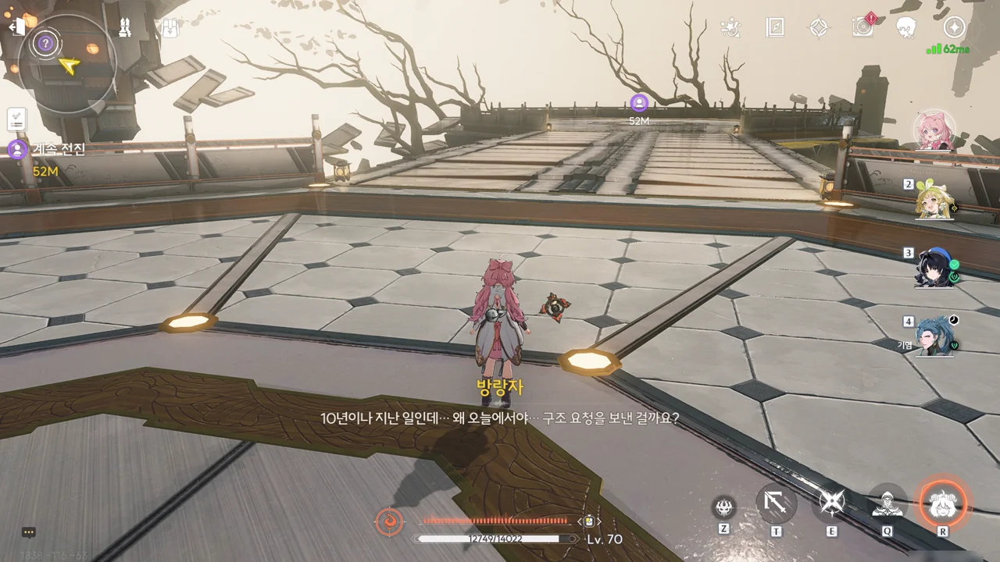











그런데 10년이나 지난 일을 왜 이제야 신호를 보낸 걸까? 거기에 대해 기염은 이번 레이싱 대회에서 일어난, '기염이 임시 소대에 초대받고, 아무도 기대하지 않았던 임시 소대의 마지막 주자가 선두로 치고 올라오는' 상황이 10년 전 '임시 소대'의 일과 놀랍도록 똑같아서 생긴 일이라고 추측한다.

잡석 고지에 폭발적인 잔상류를 만들어내기 위해 잔상들에게 흡수되던 야귀군들의 주파수가 10년 전과 동일한 상황에 자극받아, 마지막으로 구조 요청을 보낸 것이다.



이번엔 좀 큰 놈이 나왔다. 주변에 있는 1코짜리 잔상은 응원단인가?

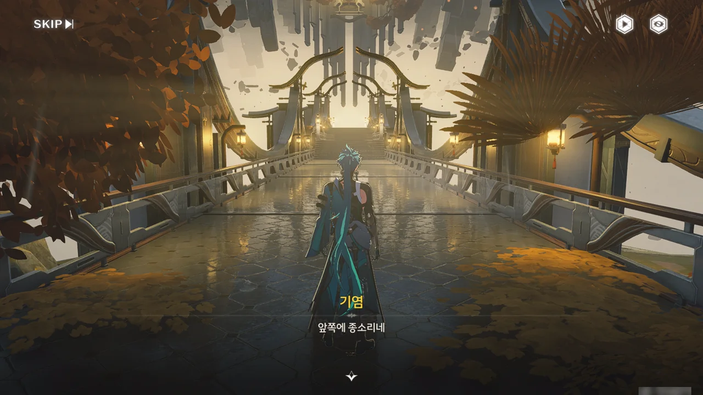

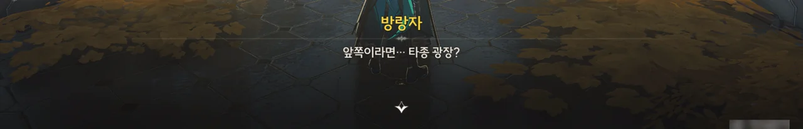

드디어 타종 광장 앞까지 도착했다.







오... 이 연출, 마음에 든다.

기염이 앞으로 걸어 나가면서 점차 세계가 뒤집어진다. 기염이 타종 광장 앞에 도착하자, '뛰어내리기'라는 프롬프트가 나타나고, 그걸 누르자 기염이 거꾸로 된 천장에서 타종 광장으로 뛰어내린다.





타종 광장 앞에는 유령-잔상들이 오와 열을 지어 종을 바라보고 서있다. 대체 뭘 하려는 거지?







놀랍게도, 이 유령-잔상들은 야귀군 신입 수업을 따라 하고 있었다.

모든 야귀군은 타종 광장에서 열리는 잡석 고지 전투 기념식에 참석해야만 전투에 나설 수 있다. 타종 광장에 열리는 기념식에 참석해야만 전투에 나설 수 있으니, 야귀의 생은 여기서 시작한다 할 수 있고, 전사한 야귀군의 이름이 타종 광장에 새겨지니, 야귀의 생은 여기서 끝난다고 할 수 있다. 이것이 '모든 야귀의 생은 이곳에서 시작해 이곳에서 끝난다'의 의미이다.

그래서 기염은 단순히 주파수 속 기억을 따라 할 뿐인 잔상이 이 의미를 이해할 리 없다며 분노하고 있다.





기억 속 기념식이 끝난 건지, 유령-잔상이 마치 길을 안내하듯 어디론가 걸어 나간다.





죽은 야귀군의 주파수인지, 그걸 너무 많이 먹어 자신을 야귀군으로 착각하게 된 잔상인지 모를 것들이 뇌운의 비늘에게 강제로 흡수되고 있다.

다른 잔상들은 야귀군 주파수를 과식한 탓에 자길 야귀군으로 착각하게 되었는데, 이 녀석은 위장이 좀 많이 큰 모양이다.







그래서 배때지를 터트려 주었다. 먹었으면 토해낼 줄도 알아야지?





뇌운의 비늘이 그동안 흡수한 야귀군의 주파수가 내부에서 단체로 반발을 일으키고 있는 듯, 뇌운의 비늘이 제대로 몸을 가누지 못하고 있다.







뇌운의 비늘이 마지막 발악으로 기염을 할퀴려 손을 뻗지만, 야귀군 주파수의 반발 때문에 공중에서 그대로 굳어버렸다. 이를 잠시 바라보던 기염은 눈을 질끈 감고 뇌운의 비늘을 단칼에 베어버렸다.







&nbsp;

&nbsp;

&nbsp;





10년 동안 음의 영역에 붙들려 있었던 수많은 야귀군들의 넋은 이제야 안식을 찾을 수 있게 되었고, 기염 역시 10년 전 미처 못다 한 작별을 늦게나마 할 수 있었다.
