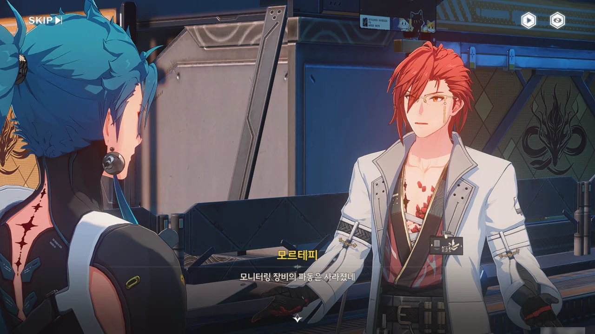
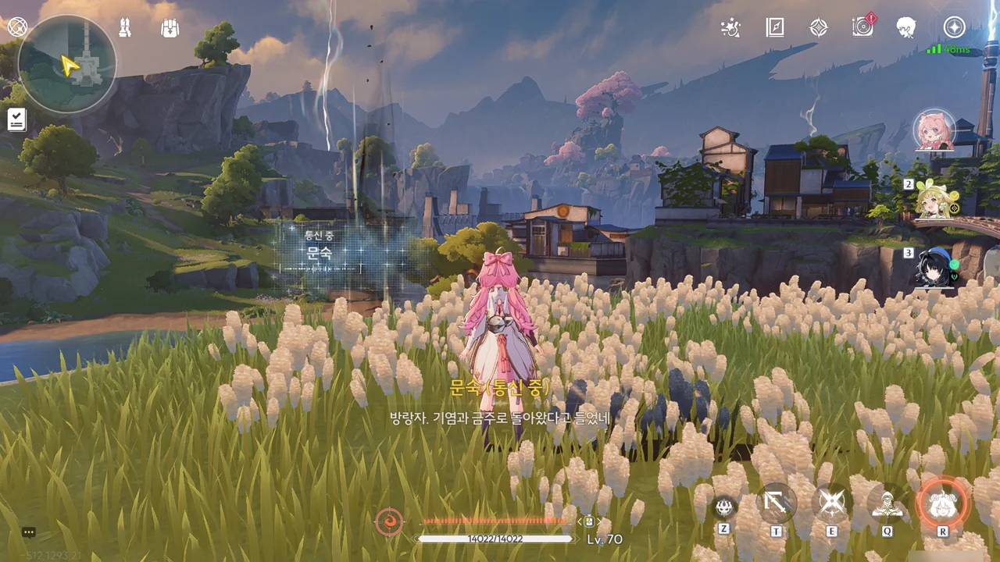
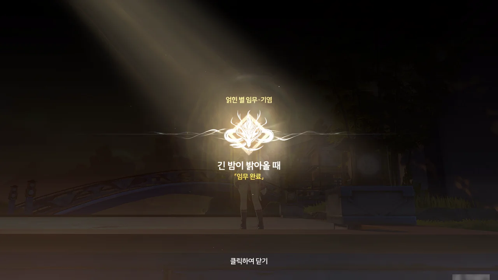









에서 나와 연구원으로 돌아왔다.

모르테피가 나와, 모니터링 장비에 잡혔던 파동이 사라진 걸 보니 잔상류 폭증의 위험을 막은 것으로 보인다고 말한다. 이번에 감지한 파동과 10년 전 잔상류의 파동의 주파수 스펙트럼이 거의 비슷하다는 걸 보면, 10년 전 일어난 잔상류 역시 그 천둥의 비늘이 일으킨 게 분명하다.

기염이 음의 영역 주파수 샘플을 건네주며 자기에게 있어 의미가 큰 샘플이니 잘 보관해 달라고 말하지만 일의 내막을 모르는 모르테피는 그저 귀중한 샘플이라 그런 말을 한 것이라 생각할 뿐이다.

와, 그나저나 설지의 이름을 듣는 게 대체 얼마만이지?





레이싱 대회 조직 위원회에서 이번 레이싱 대회를 다시 개최할 수 있을지에 대해 기염과 상의하고 싶어 한다는 소식을 전해준 후, 모르테피는 다시 연구소로 돌아갔다.

기염이 방랑자에게 잠시 시간을 내달라며, 타종 광장으로 와달라고 말한다.

여기서 '아니요' 선택지를 대체 왜 준거야? 여기서 '아니요'를 고르면 피도 눈물도 없는 괴물처럼 보일 것 같은데.



타종 광장에 갔더니 기염이 보이지 않았다. 알고 보니, 기염은 타종 광장이 아니라 그 옆에 있는, 흐드러지게 핀 꽃밭 한가운데에 서있었다.



한참 동안 말이 없던 기염은 방랑자에게 씨앗을 같이 심고 싶다고 말한다.

"이건 뭐예요?"라니... 그렇게 말하니까 방랑자가 눈치 없게 기염이 꽃밭에서 고백이라도 할 줄 기대한 것으로밖에 보이지 않잖아... 차라리 "그게 뭔데요?"라고 번역했으면 좋았을 텐데.





기염이 먼저 떠난 전우들을 기리기 위해 연구원에 부탁해 만든 꽃의 이름은 「여고()이며, 그 꽃말은 '떠나간 자의 귀향'이라는 의미를 가진 「떠나고, 또 태어난다」이다. 기염은 전우들이 목숨으로 지켜낸 아름다운 금주성의 모습을 한눈에 내려다볼 수 있게, 금주성 전체가 내려다보이는 곳에 「여고」를 심었다.





방랑자 덕분에 희생된 야귀 전사들을 보낼 수 있었으니, 방랑자가 직접 「여고」 씨앗을 심어달라고 부탁한다.





기염이 하릴없이 금주성을 바라보고 있다.

기염은 장군으로써 야귀군이 입대하기 전, 전장에서 죽을 수 있다는 걸 각오하고 들어온다는 걸 잊어서는 안되며, 「여고」를 심는 건 죽은 이들의 넋이 고향으로 돌아갈 수 있게 그가 할 수 있는 몇 안 되는 일이라고 말한다.





기염은 만약 자신이 고향으로 돌아오지 못하는 날이 오면 자신을 위해 「여고」를 여기 심어달라고 방랑자에게 부탁한다.

안 돼. 어딜 죽을 생각을 하려고.



문숙이 이전에 깜빡하고 주지 못한 게 있다며, 자신을 찾아와 달라는 통신을 남겼다.









> 이 작은 연못의 물고기가 얼마나 즐겁고 자유로운지 보게.
> 물고기든 사람이든... 자유에는 대가가 따르지. 그런데 때론... 일부 사람들만 대가를 부담하기도 하네.

10년 전 열린 레이스 대회 역시 문숙이 책임을 맡았었다. 그때에는 참가 팀이 많아, 경기가 저녁까지 계속되었다고 한다.

기염이 참가한 '임시 소대'는 말 그대로 임시로 모인 소대였으며, 첫 주자가 교대 실수를 할 정도로 협동이 잘 되지 않았다고 한다. 하지만 마지막 주자를 맡은 기염이 대역전극을 벌인 것은 물론이요, 여태껏 깨지지 않은 신기록을 세우기까지 했다.





그때 그들의 모습이 방랑자의 '임시 소대'와 같았다며, 문숙이 사진 한 장을 건네준다. 이 사진... 설마 저번에 만난, 사진 찍기 좋아하는 소녀가 찍은 건가? 그게 이렇게 돌아올 줄은 몰랐네.

문숙은 만약 대회를 다시 열게 된다면 다시 한번 대회에 참석해 달라는 말을 남겼다.

얽힌 별 임무 · 기염 \[긴 밤이 밝아올 때\] 끝!

정말 오랜만에 본 감동적인 이야기였다.
