사실 음림 얽힌 별 임무를 끝낸 건 7월 초순이었다. 하지만 금희를 뽑기 위해 너무 열을 올린 탓일까, 아무리 용을 써도 글이 손에 잡히지 않았다.

음림 얽힌 별 임무 이후에 찍은 조수 임무나 위험한 임무 사진이 한참 많이 남아 있었지만, 여기서 글쓰기가 턱 하고 막혀버리니, 다른 임무에 대해 글을 쓸 수조차 없었다.

그러던 어느 날, 문득 음림 얽힌 별 임무가 생각나 달력을 보니, 벌써 한 달이라는 시간이 지나 있었다. 시간 참 빠르기도 해라.

***

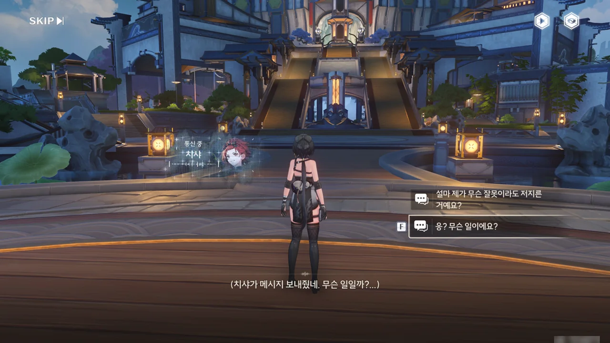







치샤가 최근 금주성 내에 목격자 없는 실종자 신고가 많아졌다며, 이에 대해 조사하는 걸 도와달라고 한다. 일반인뿐만 아니라 실력 있는 공명자, 군 전역자 등도 실종된 것으로 보아, 단순한 사건은 아닌 것 같다.

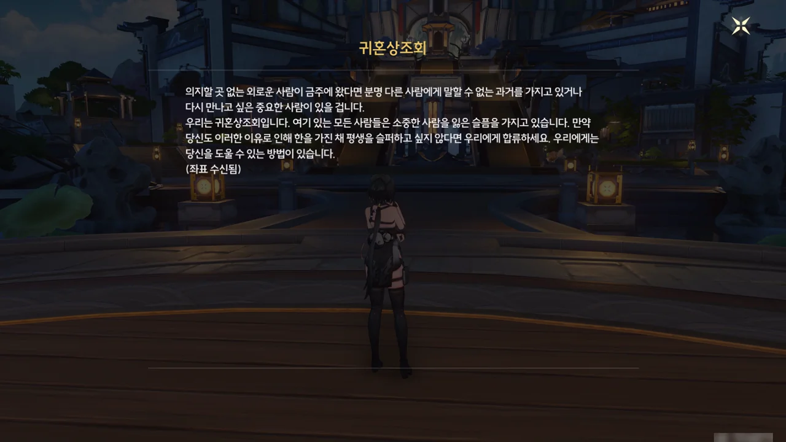

치샤와의 통신이 종료된 후, 이상한 메일이 한 통 도착했다. 치샤가 조사에 참고하라고 보낸 메일은 아닌 것 같은데...

그나저나 상조회의 이름이 너무 신경 쓰인다. 귀혼상조회? 그 귀혼이 설마 歸魂인 건 아니겠지?

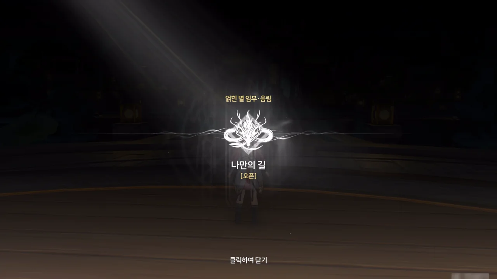

얽힌 별 임무 · 음림 \[나만의 길\] 오픈!

&nbsp;

음림의 얽힌 별 임무에 관한 이야기가 하나 있다. 바로 명조 1.0 버전 픽업인 기염과 음림의 픽업 순서가 출시 직전 갑작스레 바뀌었다는 추측이다.

기염의 얽힌 별 임무 해금 시점은 '조수 임무 황룡 제1장 제6막 완료'인데 반해, 음림의 얽힌 별 임무 해금 시점은 그보다 한참 이전인 '연각 레벨 11 달성'이다. 나중에 나온 캐릭터의 얽힌 별 임무는 이전에 나온 캐릭터의 얽힌 별 임무보다 나중에 열리는 게 일반적인데 말이다.

이를 이상하게 생각하던 사람들은 한 가지 가설을 내놓았다. 원래 쿠로 게임즈가 의도한 건 황룡 제1장 제3막을 완료한 플레이어가 음림 얽힌 별 임무와 기타 활동을 통해 연각 레벨 경험치를 쌓아, 황룡 제1막 제4장이 요구하는 연각 레벨 14를 자연스럽게 달성하는 것이었지만, 출시 직전 음림과 기염의 픽업 순서가 갑자기 바뀐 탓에 얽힌 별 임무 해금 시점이 이를 반영하지 못해 서로 꼬였다는 것이다.

그래서 음림 얽힌 별 임무를 할 때에는 방랑자에 대한 주변인물의 평가나 묘사가 조금 어색할 거란 이야기를 들었다.



그래. 의심스러우면 일단 확인해 보면 되는 것이다.

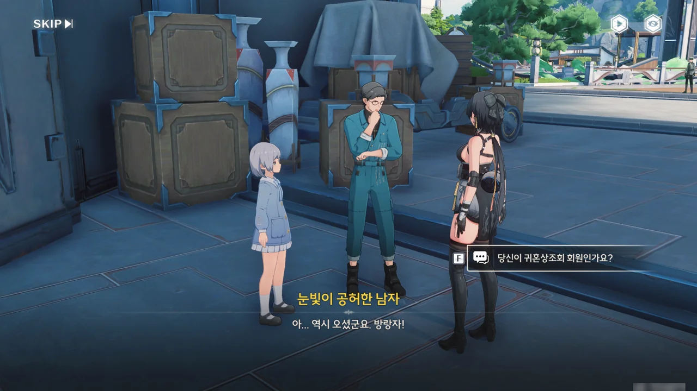









방랑자에게 귀혼상조회 메일을 보낸 건 예영이라는 이름의 남자였다.

"상조회에 가입만 하면 소중한 사람을 다시 만날 수 있다"라니, 다단계에서나 들어볼 말을 여기서 듣게 될 줄은 몰랐다. 일단 수상쩍음 1 스택 적립.

예영의 말에서 짐작할 수 있는, 그의 딸 원원이 한 번 죽었다 *다시 되돌아온* 사람이라는 것 역시 귀혼상조회가 수상쩍은 조직임을 알려준다. 죽은 사람이 어떻게 다시 살아 돌아와? 그건 시간이라도 돌리지 않는 이상 불가능한 일이라고.

그걸 지적하니 예영이 불같이 화를 낸다. 저 반응은 마치 머릿속으로는 죽은 사람이 살아 돌아올 리 없다는 걸 알고 있으면서도 눈앞에 있는 '딸'의 존재를 부정하고 싶지 않아 하는 것 같아 보이는데... 대체 뭘까?

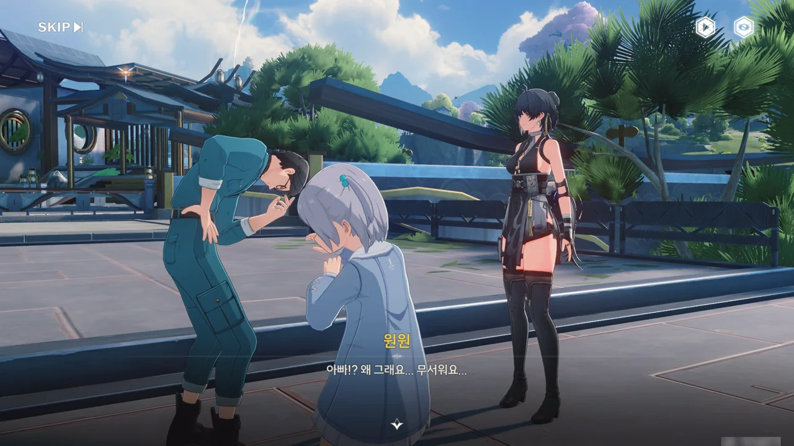





아, 이게 오버클럭의 징조인 건가? 공명 어빌리티가 마음의 상태에 영향을 받는다고는 들었지만, 이런 식일 줄은 몰랐는데. 지금 예영의 모습은... 곱게 말해 불안장애나 PTSD의 모습을 보이고 있고, 나쁘게 말하면 그냥 미친 것 같다.



예영을 가만히 뒀다간 아이를 해칠 수 있겠다 판단한 방랑자가 원원을 예영에게서 떼어놓자, 예영이 극도의 공격성을 보이고 있다. 애 앞에서 참 잘하는 짓이다, 그렇지?







귀혼상조회에서 온 것으로 보이는 다른 누군가가 끼어들어, 예영에게 아직 할 일이 남아있으니 원원은 자신에게 맡기고 이만 가보라고 명령한다.

예영을 진정시킨 건 좋지만, "원원이를 다시 볼 수 없기를 바라는 건 아니지?"라고 협박하듯 말하는 걸 보면, 역시 귀혼상조회는 이전에 예영이 메일에서 말한 '소중한 사람을 잃은 사람을 돕는 조직'이기만 한 게 아님이 틀림없다. 어떤 수를 쓴 건진 몰라도, 상조회에 찾아온 사람이 '죽은 사람이 살아 돌아왔다'라고 믿게 만든 다음, 그걸 빌미로 그 사람을 원하는 대로 부리는 범죄조직이 아닐까?





도대체 왜 원원이 저 사람 곁으로 아무런 저항 없이 간 거지? '다시 살아 돌아왔다'는 원원의 정체를 알 수 없으니, 원원이 왜 저 사람 곁으로 간 건지에 대해 고려해야 할 가짓수가 너무 많다.





상관없는 사람은 빠지라며, 그녀가 쏘아 보낸 무언가를 방랑자가 고개를 까딱이는 것만으로 가볍게 피한다.

뭐지? 다짜고짜 사람을 공격하다니? 이거, 방랑자가 저 사람을 공격해도 정당방위인 거 맞지?





아까 병이 깨지는 소리를 듣기라도 한 걸까, 순찰관이 여기로 오고 있다. 방랑자나 자신이나 서로 귀찮은 일에 휘말리고 싶지 않은 건 마찬가지일 테니, 자길 도와 여기서 싸움이 일어난 흔적을 지우는 걸 도와달라고 한다.

음... 이건 귀혼상조회와 원원의 정체를 알기 위해서니까... 내키진 않아도 할 수밖에 없다.

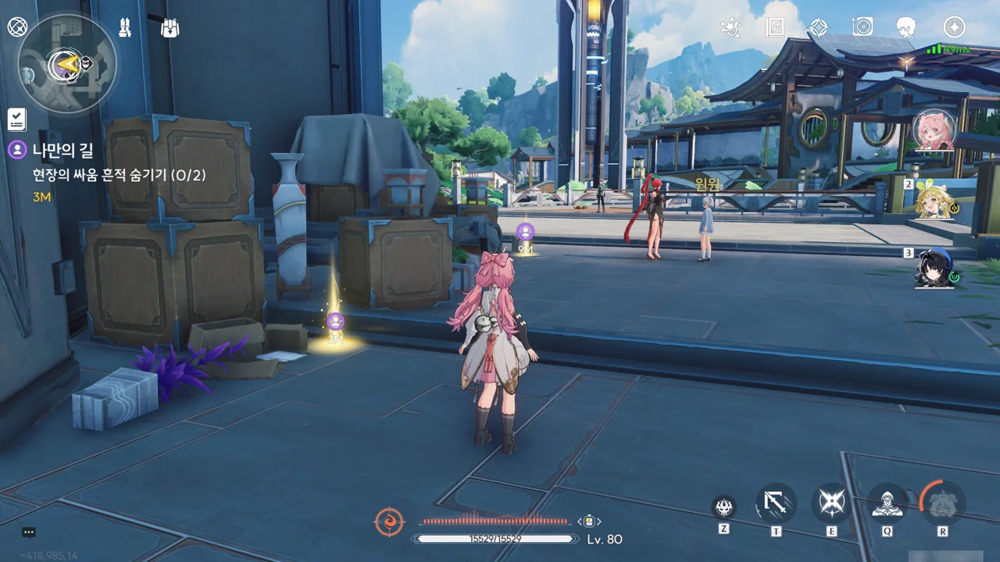

말은 도와달라 해놓고서, 정작 현장을 치우는 건 방랑자 혼자 뿐이다. 정말 보면 볼수록 마음에 안 들어...



나무 상자에서 주은 예영의 거래 명세서에는 오늘 '귀혼 인형' 4구를 거래한다는 내용이 적혀있었다. 이름을 보면 분명 귀혼상조회와 연관이 있는 것 같은데...

여러 게임을 하며 키워온 내 직감이 속삭이고 있다. 분명 저 인형은 죽은 사람이 다시 살아 돌아온 것처럼 보이게 하는 데 쓰이는 인형이라고. 죽은 사람이 살아 돌아올 리 없지.









정체를 알 수 없는 여자 --- 라고 말하지만, 우리 모두 이 여자가 음림임을 알고 있다 --- 가 산책 도중, 너무 빨리 달리다 넘어져 울고 있던 아이를 발견했고, 아이가 아빠를 잃어버렸다는 걸 알게 되어 도와주려 했다는 이야기를 순식간에 지어낸다.

거짓말임이 명백함에도 원원이 거기에 장단을 맞춰주는 걸 보면, 음림이 어떤 수를 써서 원원을 조종하고 있는 게 틀림없다. 어쩌면 원원의 정체가 아까 명세서에 적힌 '귀혼 인형'일 수도 있고. 사람이 아닌 인형이라면 조종하기 쉬울 테니 말이다.



순찰관들이 아이의 아빠를 대신 찾아주겠다고 하자, 원원이 겁을 먹은 듯 움츠러든다. 연기 참 잘하네...









드디어 이름을 밝히는구나, 음림.

음림이 금주에는 잠시 휴가차 놀러 왔다며, 순찰관들이 바쁜 건 자신 역시 순찰관이라 아주 잘 아니, 아이 아빠 찾는 건 자신에게 맡겨달라고 한다.





본래 여기서 순찰관 신분을 노출시키고 싶지 않았던 음림이지만, 이대로 갔다간 자신은 물론 원원까지 의심받을까 봐 하는 수없이 자신의 신분을 드러냈다고 한다.

그런데 순찰관이라고? 하는 행동은 전혀 순찰관답지 않았는데?





예상대로 예영의 딸 원원의 정체는 인형에 불과했다. 이미 어느 정도 예상하고 있었기에 그리 놀랍진 않았지만, 대체 이 인형을 만든 사람이 어떤 수를 썼길래 죽은 사람의 아버지인 예영을 감쪽같이 속여 넘길 수 있었던 건지는 아직 잘 모르겠다.

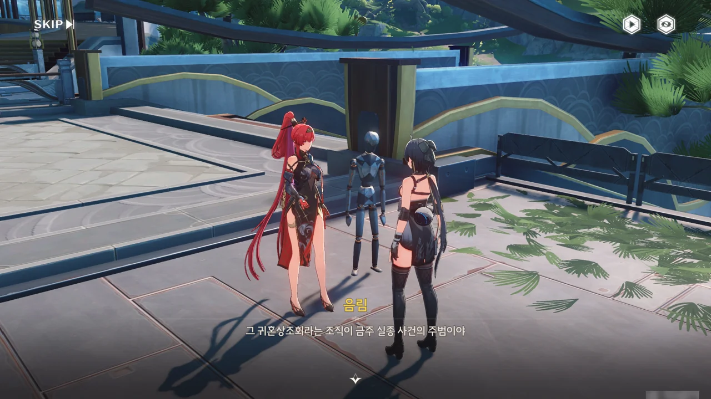











알고 보니, 치샤가 말했던 금주 실종 사건의 주범이 바로 귀혼상조회라고 한다. 귀혼상조회는 가족과 애인을 잃은 사람들에게 죽은 이들의 인격과 기억을 완벽하게 재현할 수 있는 인형을 보내주는 대신, 속세의 모든 것을 버리고 조직에 가입할 것을 요구한다.

인형 자체에도 심각한 문제점이 있는데, 인형을 지나치게 가까이할 경우, 오버클럭의 위험성이 크게 증가한다고 한다. 오버클럭은 정신 건강과 밀접한 관계가 있으니, 인형과 가까울수록 정신병에 걸릴 가능성이 커진다는 말이다.

뭐야, 그러면 귀혼상조회는 죽은 넋을 되돌아오게 하는 것(歸魂)도 아니고, 사람들을 돕는 것(相助)도 아니잖아. 거짓으로 가득 찬 이름이네.

예영이 방랑자에게 귀혼상조회 가입 메일을 보낸 것은 그가 귀혼상조회에서 신규회원 모집을 담당하고 있었기 때문이다. 금주성 외부에서 온 방랑자는 혼자이니, 다른 금주성 사람보다 쉽게 포섭할 수 있을 거라 생각해서라고.

조직의 행태도 불량하기 짝이 없고, 그 회원인 예영의 속셈도 검기 그지없으니, 음림 말처럼 여기서 손을 떼는 게 좋을지도 모르겠다. 하지만 궁금한걸. 여기에 얽힌 이야기가.

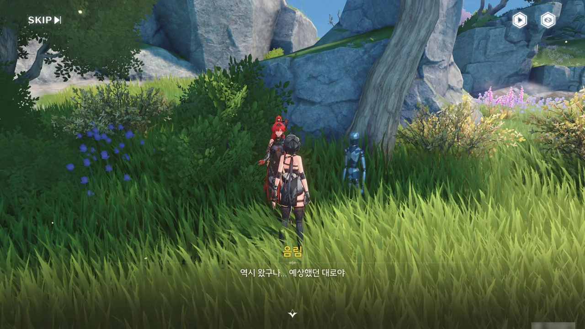

음림이 말해준 곳으로 갔다.

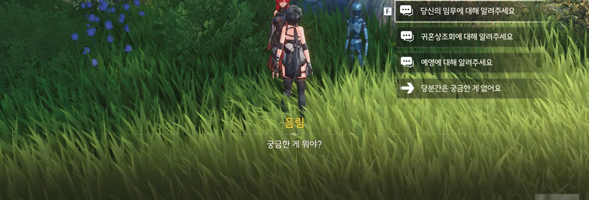





음림이 귀혼상조회에 들어온 목적은 귀혼상조회의 범죄 증거를 수집하고 그들의 진짜 배후를 찾는 것이라고 한다. 하지만 아직 귀혼상조회의 최고위층과는 접촉하지 못했고, 지금은 그저 예영을 돕는 역할만 하고 있다.









귀혼상조회는 명목상 공익단체이며, 가족을 되살릴 수 있다는 말로 수많은 사람들을 몰래 끌어모으던 조직이었다. 하지만 최근 무슨 바람이 분 건지, 예영 같은 사람을 내세워 금주에서 회원을 대거 모집하기 시작했다고 한다.

귀혼상조회가 어쩌면 잔성회와 관련이 있을 수 있다고 하는데... 잔성회, 또 너야? 이젠 놀랍지도 않네.









예영은 본래 야귀군의 일원이었지만, 뜻밖의 사고로 딸 원원을 잃게 된 후, 딸을 되살리기 위해 귀혼상조회에 가입했다.

자신의 딸 원원이 사실 인형인 걸 알고 있는지는 잘 모르겠지만, 그것이 상조회 회원들에게 기적과 구원을 가져다준다고 철석같이 믿는 그는 적극적으로 다른 사람들을 귀혼상조회에 끌어들이는 역할을 맡게 되었다.







오늘 예영과 음림이 맡은 임무는 금주에서 신입 회원을 모집하는 것뿐만이 아니라고 한다. 잔성회가 귀혼상조회에서 인형을 구매했고, 예영과 음림은 이를 잔성회에 전달하는 역할을 맡게 되었다.

음림의 말을 들어 보면, 잔성회가 개입하기 전부터 귀혼상조회가 인형을 만들었던 모양이다. 그러면 잔성회는 자금을 지원하는 식으로 귀혼상조회에 개입한 건가?

음림의 목적은 인형을 조사해 인형 제작자에 대한 정보를 얻는 것이지만, 예영이 워낙 조심스러워 인형을 보관한 곳에 음림을 들여보내주지 않았다고 한다.





죽은 사람에 대한 기억을 읽는 것만으로 그 가족마저 감쪽같이 속아 넘어갈 수준의 인형을 만들 수 있는 사람이라면 자신의 잃어버린 기억을 되찾는 데에도 도움을 줄 수 있을 것이라 생각해, 방랑자는 음림을 돕기로 한다.







음림과 예영이 잔성회 사람들과 거래를 한 다음, 예영이 혼자 인형을 보관한 장소로 가 인형을 옮길 때, 방랑자가 예영을 미행해 인형을 보관한 장소의 좌표를 음림에게 보내주면 된다고 한다.





예영이 근처에 없음에도 원원을 모방하는 걸 보면, 주변 인물을 세뇌해 착각하도록 만드는 부류의 인형은 아닌 것으로 보인다.





누가 보면 가슴 뭉클한 가족 상봉의 모습이겠지만, 원원이 인형, 그것도 주변 사람들에게 정신병을 유발할 수 있는 인형임을 생각하면 입맛이 떫다.



갑자기 나타난 잔성회 멤버가 대놓고 원원은 그저 인형일 뿐이라며 초를 친다. 잔상과 융합한 탓인가, 공감 지능이 0에 수렴하는 모습을 보이고 있다.

이래서 잔성회가 안 되는 거야. 새로운 세상은 무슨, 개뿔이 새로운 세상이다.



> 인형이라고 한들 너희 같은 잔성회 놈들보다는 더 사람답지!

음림이 당당하게 저 말을 하는 걸 보면, 잔성회가 귀혼상조회에 깊게 개입하진 않은 것 같다. 하늘 같은 물주에게 저런 말을 할 수 있을 리 없잖아? 그냥 서로 거래만 하는 정도인 것 같다.









잔성회 멤버들의 거듭되는 폭언을 참지 못한 예영은 결국 거래를 파투내고 아즈즈를 소환해 연막을 치고 달아난다.

그러게 평소에 말 좀 잘하지 그랬어? 입은 재앙을 여는 문이라는 말이 괜히 나온 게 아니지.



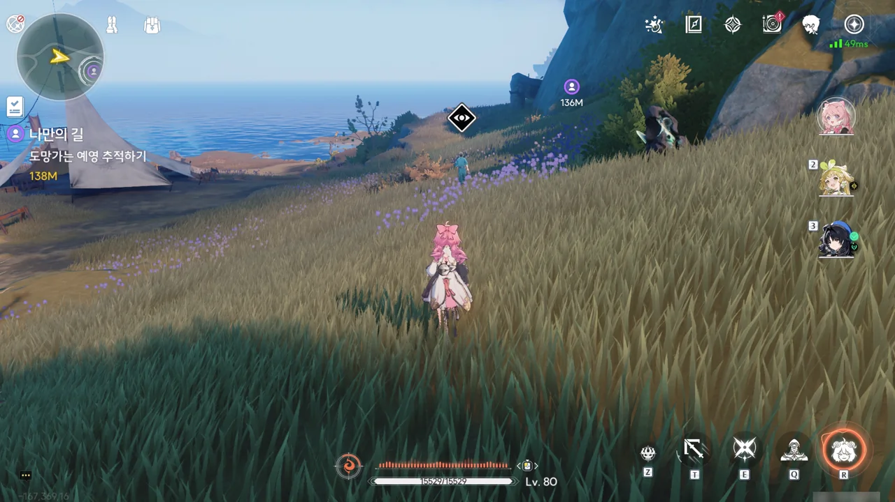

예영을 들키지 않고 미행해야 한다. 그런데 시작할 때부터 거리가 제법 벌어져 있어서, 오히려 들키기보다 너무 거리가 떨어져 미행에 실패하는 것을 걱정해야 할 지경이다.



예영이 인형을 보관해 둔 곳은 어느 한 동굴 안이었다. 이런 곳에 인형을 보관해도 되는 거야? 누가 여기 와서 인형을 훔쳐가면 어쩌려고?





> 이 인형들은 그들을 필요로 하는 가족에게 가야 돼! 잔성회의 실험체가 되게 놔둘 순 없어!

설마 귀혼상조회는 회원들에게 가야 할 인형을 잔성회에 팔고 있었던 건가? 좋아, 귀혼상조회의 죄목에 사기죄도 넣으면 되겠네.





귀혼상조회의 수장의 이름은 '언사'라고 하는 것 같다. 예영이 언사를 "우리에게 희망을 주시는 은인"이라고 지칭한 걸 보면, 회원들에게 인형을 만들어 제공한 사람이 바로 언사인 모양이다.

다만 언사가 앞장서서 귀혼상조회의 이념을 왜곡한다는 말이 나온 것으로 보아, 잔성회와 거래하면서 언사의 행보가 이전과 달라진 모양이다.





키 큰 놈이 원원 인형까지 데려가야 한다고 말하는 걸 볼 때, 잔성회는 애당초 제대로 된 값을 치르고 인형을 받아갈 생각이 없었던 것 같다. 아마 거래 도중 방심한 예영을 죽이고 원원 인형까지 모조리 가져갈 속셈이었겠지.

잔성회가 하는 일이 다 그렇다. 한결같이 쓰레기 같은 모습을 보여줘서, 필드에서 아무런 가책 없이 잔성회를 썰어버릴 수 있어.



원원을 데려가겠다는 잔성회 멤버의 말을 들은 예영이 아까처럼 감정을 추스르지 못하고 있다.





예영이 오버클럭에 빠질 걸 염려한 방랑자가 개입했고, 때마침 도착한 음림 역시 합류했다.

> 겨우 한 명 더 늘었을 뿐이야

지금까지 마주친 잔성회 멤버들도 다 그런 말을 했던 것 같은데... 지금은 다 주파수가 되어 흩어졌지만.







음림이 인형을 넘겨줄 테니, 오늘 일은 없었던 것으로 하자며 잔성회 멤버들을 설득하려 하지만, 잔성회 멤버들은 애당초 여기 있는 모든 인형은 잔성회의 것이었다며 생떼를 부린다. 잔성회에게 있어 귀혼상조회는 한낱 쥐새끼에 불과하다는 망언도 포함해서 말이다.

쥐새끼는 지금 방랑자 앞에 있는 것 같은데.





대화 도중 잔성회 멤버가 기습을 시도하나, 이를 눈치챈 방랑자가 이를 맞받아친다.

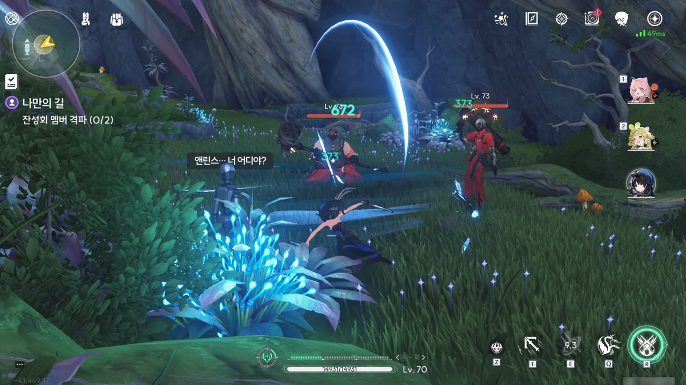

어휴... 또 나만 싸우지?

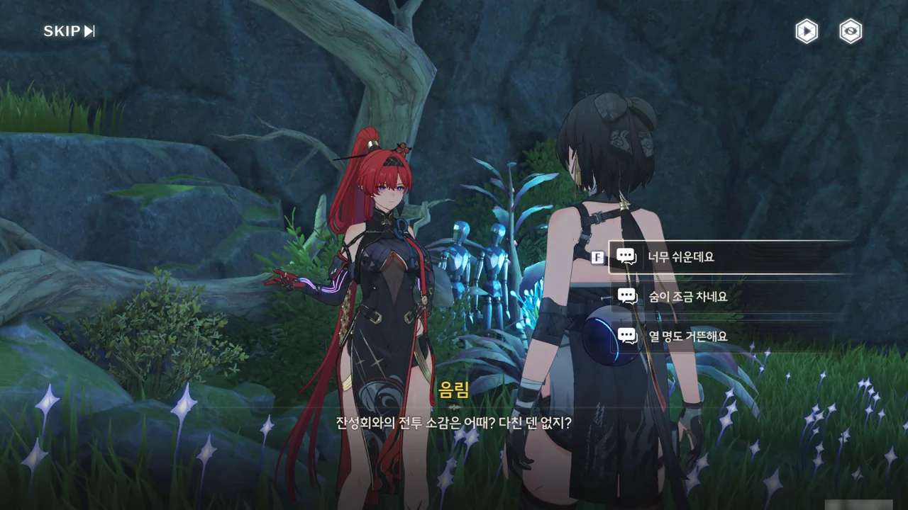

잔성회 정도는 앙코의 불꽃놀이 하나로 깔끔하게 정리할 수 있다.







방랑자가 음림의 순찰관 신분이 귀혼상조회에 노출될까 걱정하지만, 음림은 만약 상조회가 자신을 추궁하면 모든 잘못을 이미 죽은 잔성회 멤버들에게 떠넘기겠다고 여유롭게 말한다.







알고 보니, 음림은 방랑자를 처음 만났을 때부터 방랑자의 등 뒤에 위치 추적 기능이 있는 도청기를 붙여뒀었다. 방랑자가 예영을 놓아줄지, 아니면 상조회의 일원이 되어 음림의 정체를 까발릴지 확신할 수 없어 한 것이라고는 하지만, 기분이 조금 나빠지는 건 어쩔 수 없다.





예영이 혼수상태에 빠지며 원원 역시 인형으로 돌아간 탓에, 예영이나 원원을 통해 정보를 수집할 수 없게 되었다. 혹시 인형에서 뭔가 찾을 수 있지 않을까 싶어, 인형을 조사하기로 했다.

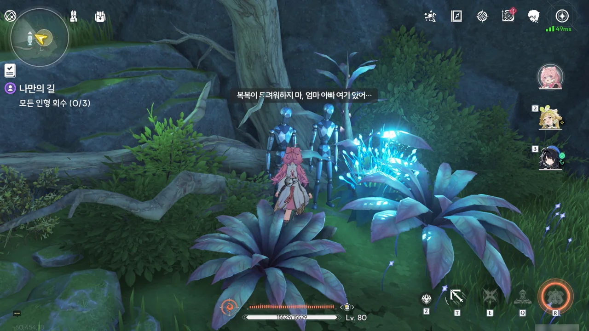



'복복'은 잔상류로 인해 죽은 부모님을 다시 보기 위해 귀혼상조회에 들어갔다. "다시는 장난치지 않을 테니까"라는 말이 있는 것으로 보아, 복복은 나이가 어린것 같다.

귀혼상조회는 성인만 목표로 한다 생각하고 있었는데, 어린애까지 끌어들이다니...





'푸제'는 병으로 사망한 아내 때문에 귀혼상조회에 들어갔다. "그녀가 고통받는 것을 지켜만 봐야 합니까?"라는 말로 보아, '급병'이 '갑자기 앓는 병'이 아니라 '위급한 병'이었나 보다.

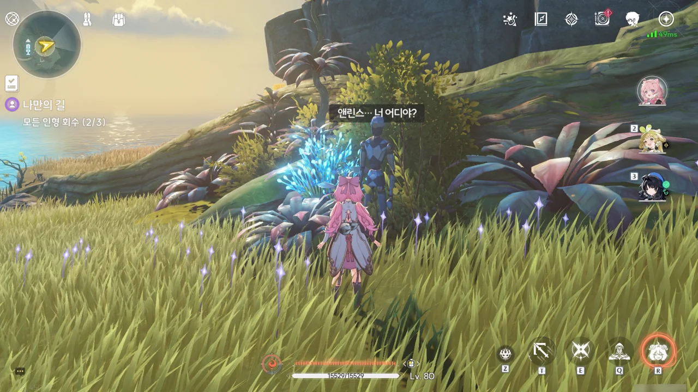





귀혼상조회는 황룡 지역에서만 활동한 게 아니었던 모양인지, '앤린스'라는 서양식 이름을 가진 사람 역시 회원으로 두고 있었다. 앤린스의 언니는 10년 전 노는데 정신이 팔린 동생을 찾기 위해 나섰다가 그대로 실종되었다고 한다.

귀혼상조회를 금주 지역에 국한된 작은 공동체라고 생각했는데, 신 연방 사람까지 여기에 온 걸 보면, 금주 지역에서 주로 활동할 뿐 그 활동 범위는 꽤 넓은 게 아닐까 생각된다.
