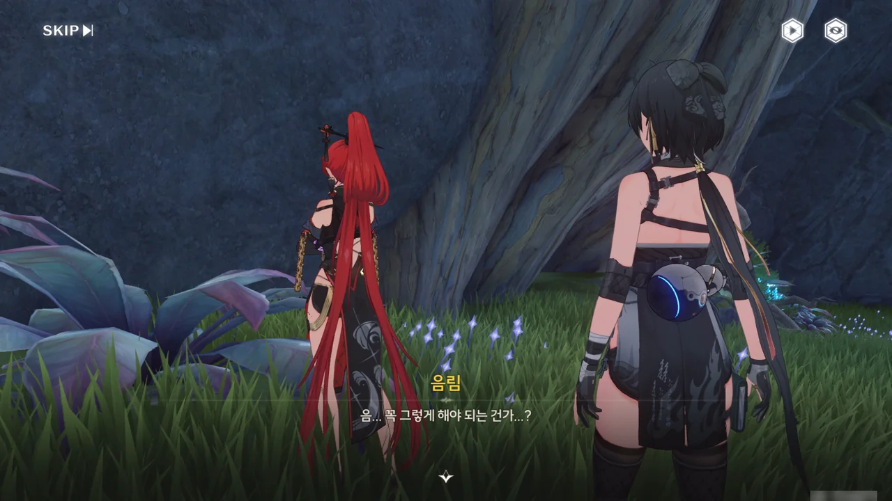





음림이 누군가와 통화하고 있다.

'처리'라고? 뭔가 좀 불안한데... 음림이 보안서 연락원과 통화한 거라고 말하지만, 뭔가 찜찜한 기분이 든다.





여기서 멀지 않은 곳에 비밀 수사관이 사용할 수 있는 안전가옥이 있다면서, 인형을 거기로 가져가 자세히 조사해보자고 한다.

안전가옥으로 가는 길은 '길을 안내하는 늑대 모양 암호'를 따라가면 된다.



평소에는 아무것도 그려져 있지 않은 돌이지만, 스캔을 하면 이렇게 늑대 모양 그림이 나타난다. 이게 음림이 말한 '길을 안내하는 늑대 모양 암호'겠지?

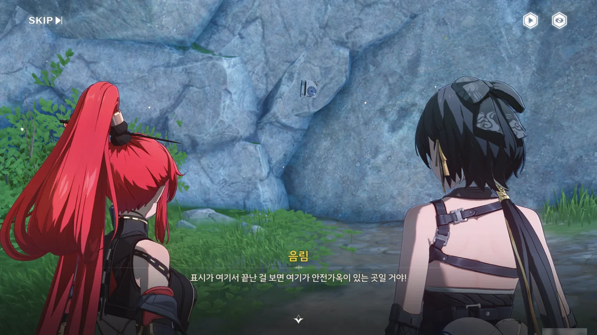





늑대 모양 암호가 최종적으로 안내한 곳은 막다른 돌벽이었다.

돌에 무슨 장치 같은 것이 붙어있는데, 아마 저 장치에 비밀번호를 입력하면 돌벽의 일부로 위장했던 입체 영상이 꺼지고 그 뒤에 숨겨져 있던 공간이나 통로가 드러날 것 같다.

그런데 그럴 거면 그냥 돌벽을 더듬어 어디서부터 어디까지가 입체 영상인지 확인해 보면 되는 일 아냐? 설마 그 뒤에 레이저 트랩 같은 추가적인 보안 장치 같은 것이 있는 걸까?

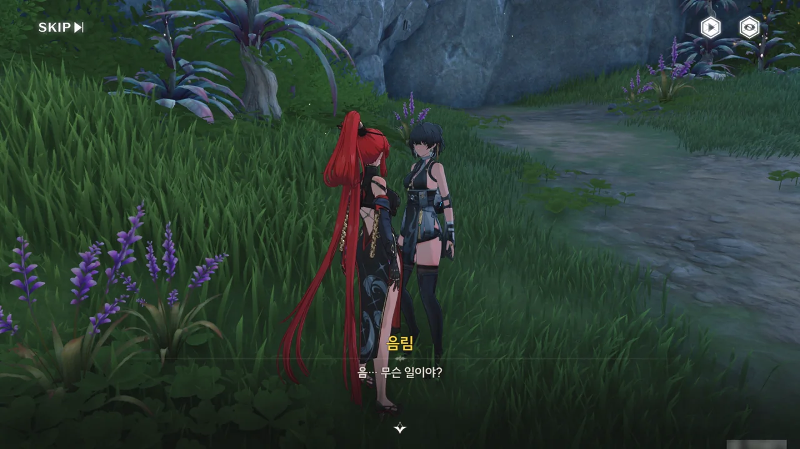



플레이어가 비밀번호를 찾지 못할 걸 걱정한 걸까, 아니면 꽃이 몇 송이인지 세지 못할 걸 걱정한 걸까? 음림에게 말을 걸면 아예 대놓고 비밀번호가 4123이라고 알려준다.

음림에게 힌트만 듣고 직접 비밀번호를 찾아볼 생각이었는데, 난데없이 음림에게 비밀번호를 스포일러 당했다.





여기서 그냥 얌전히 비밀번호를 입력하고 들어가기에는 묘하게 자존심이 상해서, 직접 주변에 핀 꽃의 개수를 세어보았다. 네 송이, 한 송이, 두 송이, 세 송이. 음, 4123 맞네.

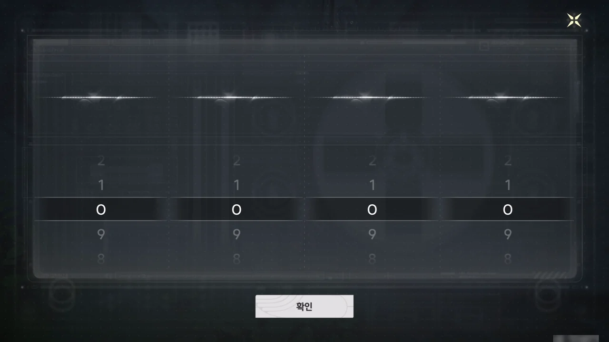

마우스로 직접 다이얼을 돌려야 해? 으으, 그냥 키보드 키패드로 비밀번호를 입력할 수 있게 해 줘!





> 그래, 정말 안전하지!
> 밖에 있는 사람은 여기를 찾을 수 없고 여기 있는 사람도 외부와 연락할 수 없거든.

어어? 왜 말을 그렇게 해? 내 머릿속의 경종이 위험하다고 땡땡땡 울리는데?





아니나 다를까, 음림이 순식간에 방랑자를 실로 묶어 구속한다. 젠장, 또 속인 거냐?





겨우 손을 칼에 뻗었나 싶었는데, 음림이 '아무도 믿지 말라고 내가 말했었지?'라고 말한 후, 방랑자를 번개로 지져버린다.



> 아주 특별한 인형이군... 좋은 데이터를 얻을 수 있겠어.

'인형'이라고? 설마 내가 지금껏 보아온 귀혼 인형의 재료가 사람이었던 건 아니겠지?



기껏 방랑자를 납치해 놓고 방랑자의 무기나 단말기를 압수하지 않았다. 대체 무슨 꿍꿍이인 거지? 설마 방랑자의 단말기에 몰래 백도어를 설치해 둔 건가? 방랑자 등 뒤에 몰래 위치 추적기를 붙인 걸 보면, 충분히 가능한 일이긴 한데...

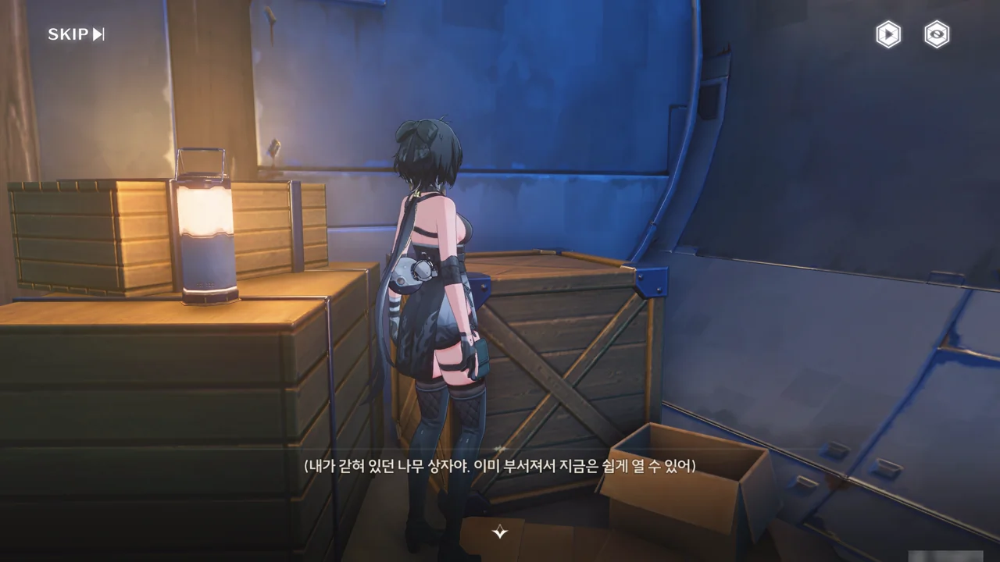



심지어 방랑자가 갇혀있던 상자 안에는 암호화 통신 패드가 들어 있어, 원한다면 아무에게도 들키지 않고 몰래 다른 사람과 연락해 도움을 요청할 수 있다.

대체 음림의 속셈이 뭐지? 방랑자의 납치가 계획적인 건지, 아니면 충동적인 건지 도저히 판단할 수 없다.

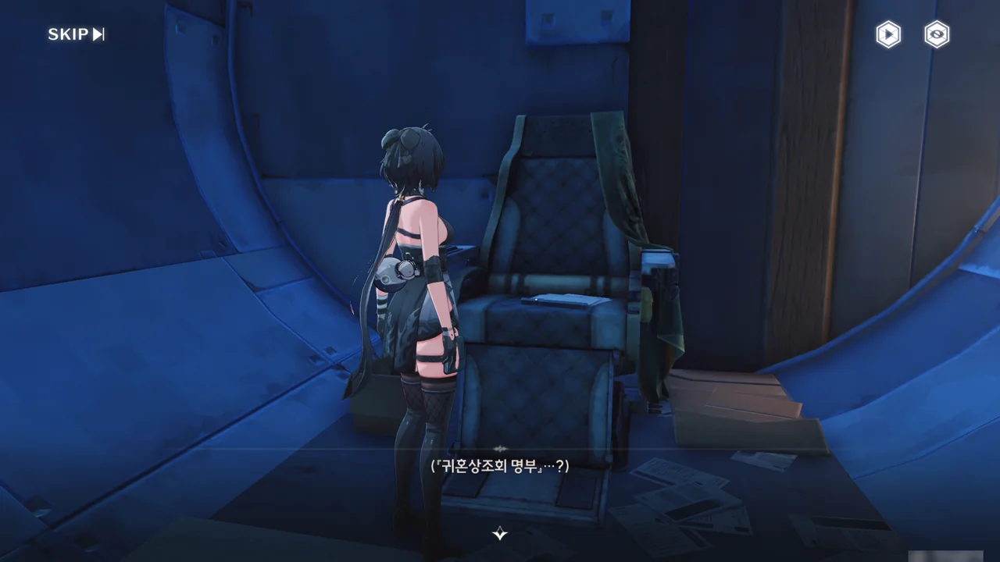





같은 방 안에 있는 의자 위에는 귀혼상조회 회원의 이름이 적힌 「귀혼상조회 명부」가 놓여 있었다.

이거, 너무 일이 너무 공교로운데... 이 모든 게 전부 함정인 건 아니겠지?







아까 입수한 암호화 통신 패드를 이용해 치샤에게 현재 좌표와 상황을 전달했다.

명조 리듬 게임은 BGM이라고 할 음악이 없어서, 정말 눈에 보이는 대로 입력해야 한다는 게 좀 불편하다.



언제 온 건지, 음림이 불러 밖으로 나올 수 있었다.



최근 돼서야 알게 된 건데, NPC와 대화를 나눌 수 있을 때 곧바로 달려가서 말을 거는 것보다, 이렇게 시간을 조금 들여서 그들이 무슨 말을 하는지 조금 지켜보는 게 좋다.

음림이 여기 온 목적이 방랑자를 데려가기 위해서라는 정보를 얻었잖아? 게다가 음림이 '아가씨'라고 불리는 걸 보아, 귀혼상조회에서의 음림의 지위가 꽤 높을지도 모른다는 추측을 할 수 있고.

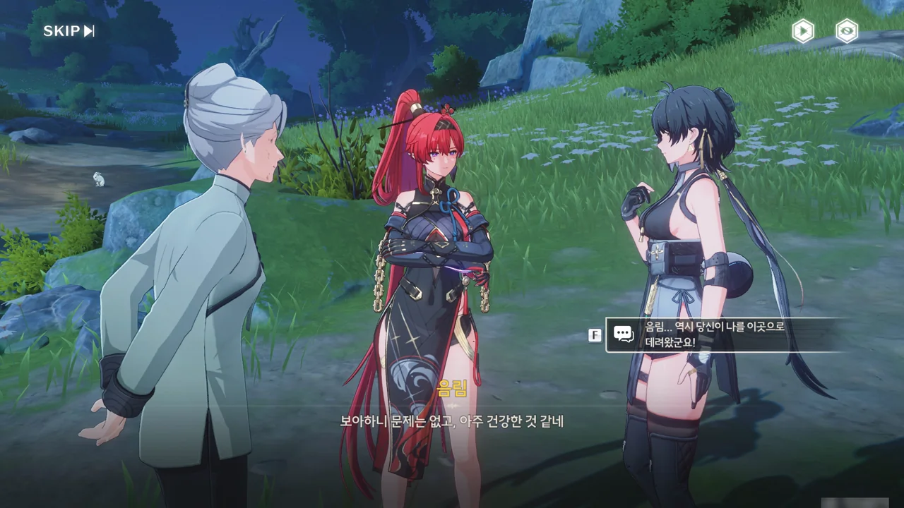



음림이 만약 방랑자가 깨어나지 않았다면 의사인 우성에게 데려가려 했다고 말한다.

이 상황이 달갑지 않은 건 당연한지라, 방랑자가 할 수 있는 대답 모두가 비아냥대는 대답이다.





이 할머니는 또 무슨 헛소리야? 이보세요, 당신 아가씨지, 내 아가씨가 아니거든요?

> 자네 「가족」은?
> 자네 같은 젊은이들은 가족을 버리고 밖으로 뛰쳐나오곤 하지.
> 오늘은 캠프의 「가족 상봉일」이니, 그 누구도 여길 떠나는 것이 허락되지 않을 게야.

마치 이런 일이 예전에도 몇 번 있었다는 듯이 말하는 걸 보면, 귀혼상조회에 가입한 모든 사람이 귀혼 인형에 *만족*한 건 아니었나 보다. 그중 일부는 자신 앞에 놓인 것이 다시 살아 돌아온 **사람**이 아닌, 단순히 죽은 사람을 흉내 낼 뿐인 **인형**임에 불과하다는 걸 깨닫고 귀혼상조회를 탈출하려 했으나, 음림 등에 의해 다시 잡혀 들어온 모양이다.

게다가 그놈의 「가족 상봉일」이 뭔진 몰라도, 그 누구도 이 캠프를 떠날 수 없다고 한다.

어떻게 된 게 머리부터 발끝까지 전부 음험한 범죄조직인 거지, 이 단체는? 아, 그래서 잔성회랑 같이 놀던 건가?





음림은 아까 방랑자가 기절해 있을 때, 우성이 지연성 독을 주사해 두었다며, 죽기 싫다면 얌전히 따라오라고 말한다.

마음 같아선 그냥 뛰쳐나가고 싶은데, 음림의 말이 진짜인지 가짜인지 아직 알 수가 없으니 얌전히 따라갈 수밖에 없다.





이미 예상했던 거지만, 여긴 귀혼상조회의 본거지라고 한다.

음림에게 귀혼상조회 가입을 권유받았지만, 당연히 거절했다. 음림 역시 거절당할 줄 알고 그냥 던져본 말이라고 한다.

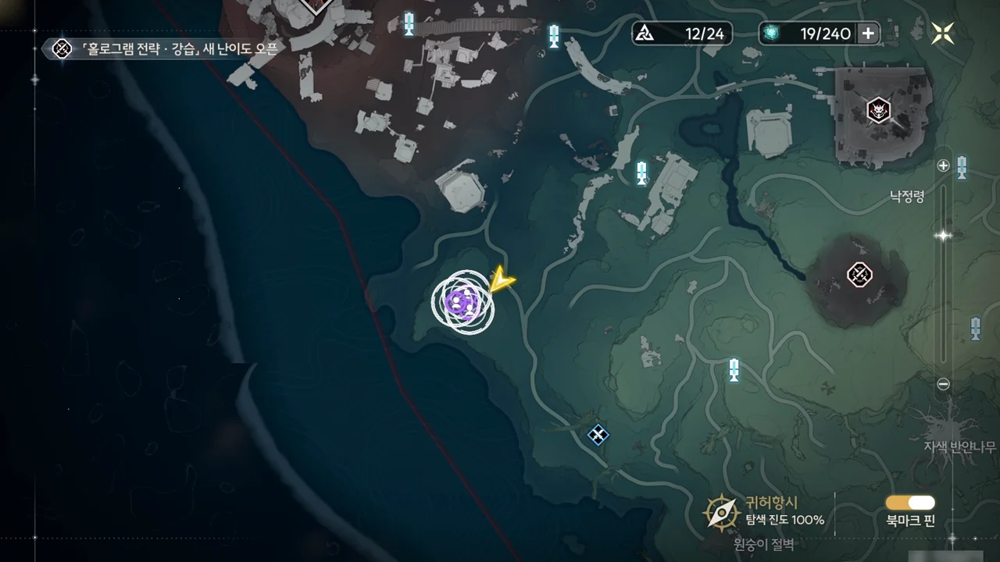

뭐야, 여기 귀허항시 밑이었잖아? 금주성과는 제법 떨어진 거리이긴 하다만, 그래도 금주성에서 오려고 하면 못 올 거리는 아닌데?

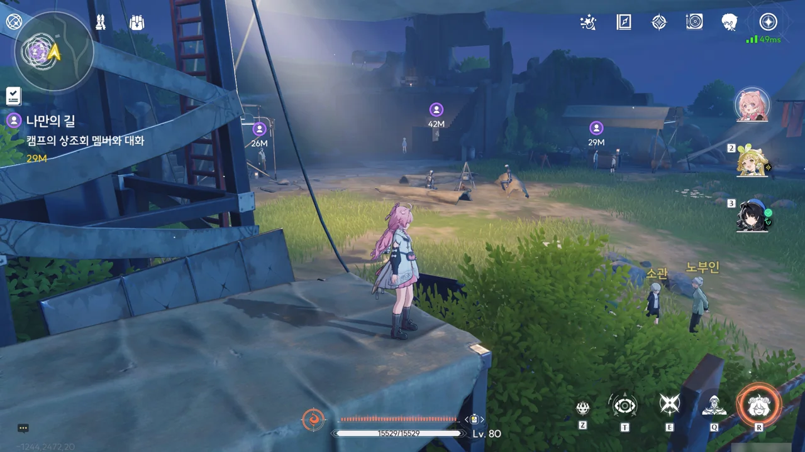

'캠프'라는 말이 허언은 아니었는지, 허름한 폐허에 다들 모여 살고 있다.

멀쩡히 살던 집을 버리고 이런 허름한 폐허에서 살 만큼 이들은 죽은 사람을 인형으로나마 다시 보고 싶었던 걸까?

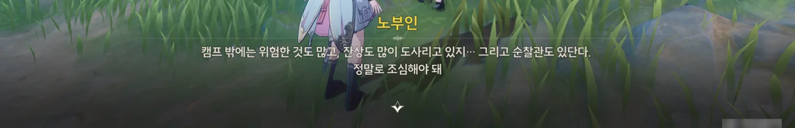

순찰관을 조심하라는 걸 보면, 자신들이 범죄 조직의 일원임은 이미 잘 알고 있는 모양이다.

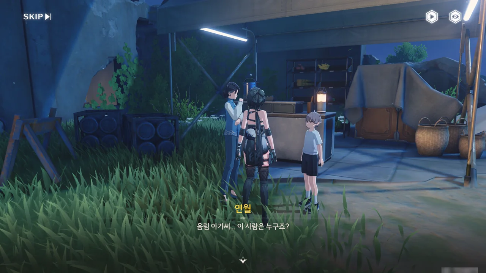





연월은 자신의 *아들*이 인형임을 지적하자 예영처럼 극도로 민감하게 반응한다.



> 제가 엄마랑 얼마나 같이 있을진 모르겠지만

설마 이 인형은 자신이 인형이란 사실을 알고 있는 걸까? 단순히 죽은 사람을 따라 하고 있을 뿐이라면 이런 말은 하지 않을 것 같은데...







인형인 허창과 함께 캠프의 안전을 책임지고 있는 진륙은 한때 예영과 함께 야귀군에 있었던 공명자다. 그는 인형과 함께하면 오버클럭에 걸릴 위험성이 커진다는 걸 알고 있지만, 자신을 구하려다 심각한 오버클럭에 걸려 죽은 파트너, 허창에게 은혜를 갚기 위해서라면 어떤 대가라도 치르겠다는 각오로 그 위험을 감수하고 있다.

방랑자가 이를 어떻게 생각할지는 모르겠지만, 난 정말 이들의 행동을 이해할 수 없다. 죽은 사람을 재현할 뿐인 인형을, 그것도 오버클럭의 위험성을 감수하면서까지 자기 곁에 두고 위안 삼는 건 아무리 봐도 미친 짓이다.



이 허창 인형은 자신이 실제 사람이 아닌 인형임을 아주 잘 알고 있다. 뭐랄까, 기분이 정말 묘하네...

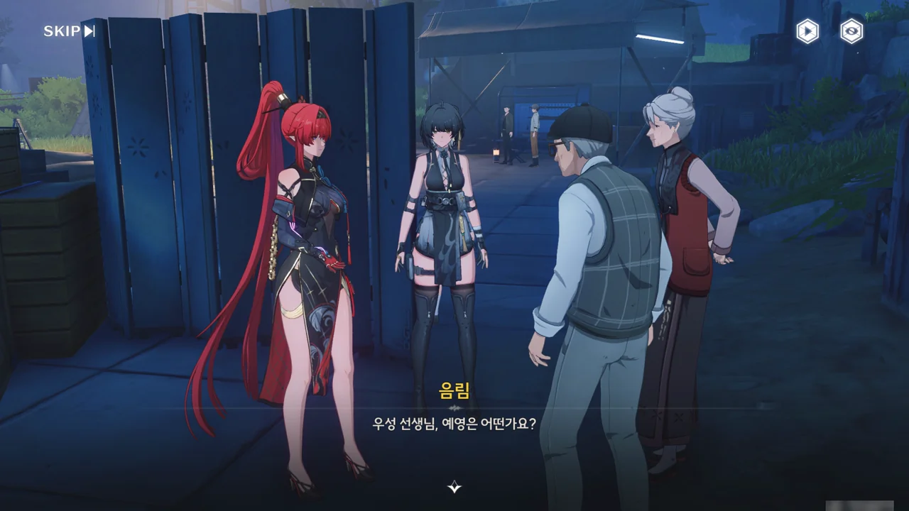



> 언사 대인의 명령에 맞서 도망치려 하지 말았어야 했어요

음림의 이 말을 듣고, 처음에는 귀혼상조회가 회원을 통제하기 위해, 회원에게 오버클럭을 유발하는 독을 먹인 다음, 명령에 따르지 않으면 해독제를 주지 않는 방식을 쓴다고 생각했다.

그런데 한참을 다시 읽어보니, 음림의 말은 예영이 잔성회와의 계약을 멋대로 깨고 도망친 후, 잔성회의 말에 오버클럭을 일으킨 걸 이야기하는 것이었다.



우성에게 독을 먹였냐 따지자, 의외로 우성은 방랑자가 귀혼상조회에 가입할 생각이 없어 보였기에 독을 먹이는 하책을 썼다고 순순히 인정한다.

여긴 제네바 선언 같은 거 없나? 난 도저히 이 사람을 의사로 인정할 수 없다.

> ...
> 나는 환자의 건강과 생명을 첫째로 생각하겠노라.
> ...
> 나는 인종, 종교, 국적, 정당관계 또는 사회적 지위 여하를 초월하여 오직 환자에 대한 나의 의무를 지키겠노라.
> ...
> 나는 비록 위협을 당할지라도 나의 지식을 인도에 어긋나게 쓰지 않겠노라.
{.bq}

사람에게 의도적으로 치료 목적이 아닌 통제 목적으로 독을 먹인 이상, 이 사람은 의사가 아니다. 의사일 수 없다. 의사여서는 안 된다.







> 마음이 막막하다면 다른 사람과 많은 이야기를 나누게! '상조회'는 서로를 돕기 위해 존재하는 것이니까.

이 말을 들으니, 완벽하지는 않아도 제일 좋은 해결책을 이미 알고 있음에도 언사가 *하사한* 인형에 마음을 빼앗겨 의사로서의 책임을 내던진 것으로밖에 보이지 않아, 부아가 치민다.



음림이 가야 할 곳이 있다며 방랑자를 어디론가 데려가려 한다.

그전에 잠깐 다른 NPC와 대화 좀 하고.

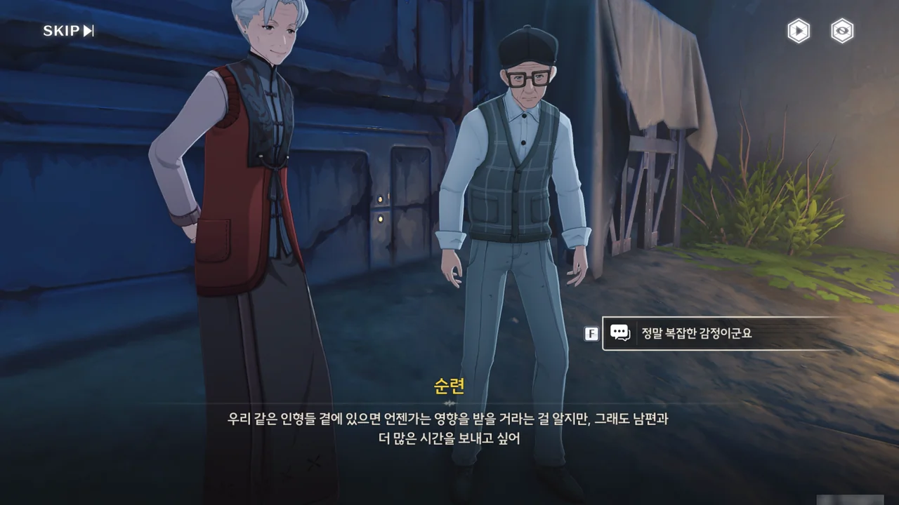

이 인형 역시 자신이 인형임을 알고 있다.

난 정말 모르겠다. 이 인형들이 사람과 함께 있고 싶어 하는 건 원래 사람이 그래서일까, 아니면 언사가 일부러 그렇게 생각하도록 조종한 결과일까? 그래서 내가 이 인형에 본능적인 혐오를 느끼는 것일지도 모르겠다.

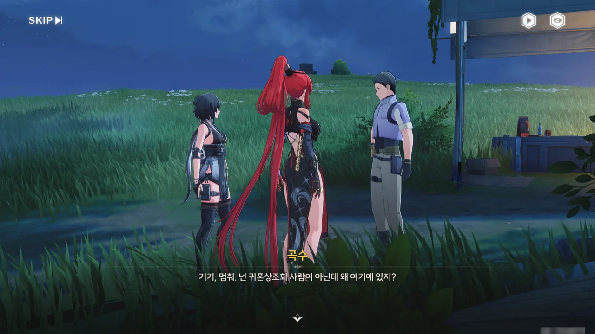









귀혼상조회의 회원이 아닌 방랑자를 경계하는 곡수에게 음림이 방랑자는 언사의 손님이라며 안심시킨다.

대체 어디서 뭘 하다가 다친 건진 모르겠지만, 곡수는 적잖은 부상을 입은 상태. 이곳을 지키는 것이 자신의 임무라며, 상처를 치료하기 위해 자리를 벗어나길 거부하는 곡수에게 음림은 곡수가 여기서 죽는 것이야말로 자기 본분을 내치는 것이라며, 언사 역시 곧 숙원을 이룰 것이라 다시는 여기에 오지 않을 것이라고 말해준다.

언사가 숙원을 곧 이룰 거라고? 그 숙원이 대체 뭐지?

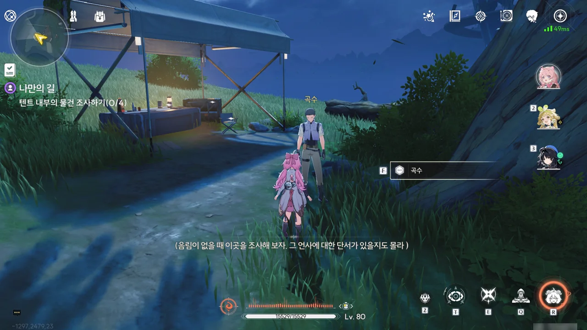

어차피 음림이 여기 있는 물건들을 곧 정리할 거라 말했으니, 방랑자가 그전에 먼저 들여다봐도 괜찮을 것이다.

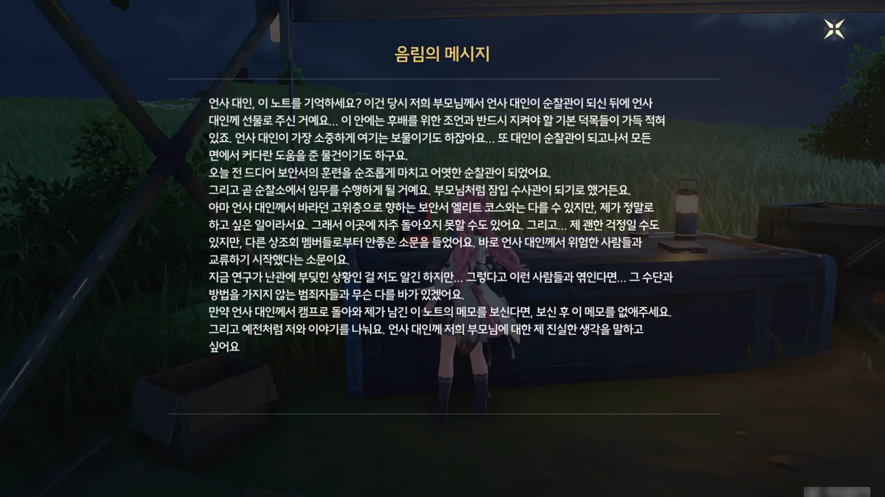



음림이 언사에게 남긴 메시지이다.

* 음림은 잠입 수사관이다.
* 음림의 부모님은 잠입 수사관이었으며, 언사의 선배이다.
* 언사의 연구는 난관에 부딪혔고, 그걸 타개하기 위해 잔성회와 교류하기 시작했다.
* 음림은 언사가 잔성회와 교류한다는 것을 걱정하고 있다.
* 언사는 음림이 남긴 메시지를 읽지 않았다.

이상한데. 메시지에서의 음림은 언사가 잔성회와 어울리는 걸 걱정하고 있는데, 지금의 음림은 언사가 잔성회와 교류하든 말든 전혀 신경 쓰지 않고 있다.

헛생각이긴 한데, 설마 언사가 음림까지 인형으로 대체해 버린 건 아니겠지?

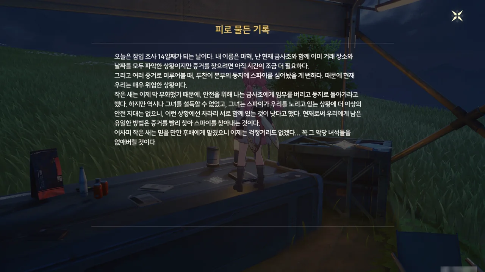



피로 물든 기록이다. 내용으로 미루어보아, 이 피의 주인은 기록을 쓴 사람의 것으로 보인다.

'작은 새를 믿을 만한 후배에게 맡겼다'라는 말을 보면, 이 일지를 쓴 사람은 음림의 아버지로 추측된다. 음림이 자신과 전혀 관계없는 사람의 기록을 여기에 두었을 리는 없을 테니까.

* '마혁'(음림의 아버지)는 '금사조'(음림의 어머니)와 함께 어떤 조직에 스파이로 잠입했다.
* 조직의 일원, '두찬'은 보안서 본부에 스파이를 심어두었다.
* '마혁'은 이제 막 태어난 음림을 위해 '금사조'에게 임무를 포기하고 집으로 돌아갈 것을 설득했으나 '금사조'는 이를 거절했다.

그러니까 음림의 부모님은 어떤 범죄 조직의 뒤를 캐다가 역으로 범죄 조직에게 제거당했고, 졸지에 천애고아가 된 음림을 언사가 대신 키운 모양이다.

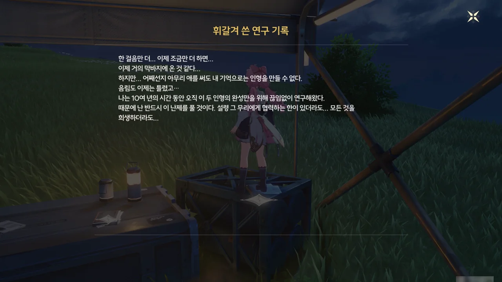



언사의 것으로 추정되는 연구 기록에 따르면, 언사는 여태껏 음림의 부모님을 재현한 인형을 만드는 데에 몰두해 온 것으로 보인다. 하지만 자신이나 음림의 기억으로는 음림의 부모님을 재현할 수 없었기에, 잔성회에 협력해 도움을 구하려 했다.







이건... 아마 음림이 어릴 적에 그렸던 그림일기겠지?

> 두 사람은 정말로 인형이 되고 싶으실까? 정말로 복수를 원하실까?

그래, 내가 계속 생각하고 있던 게 바로 이거였어.

죽은 사람을 다시 되살려내는 것이라면 모를까, 이렇게 산 사람의 기억에 의존해 만들어내는 인형은 절대로 그 사람이 될 수 없다. 그 인형이 보여주는 건 오직 기억을 제공한 사람이 기억하고 있는 사람의 모습밖에 없을 테니까.

> [나는 단수가 아니다](https://namu.wiki/w/나는%20단수가%20아니다)
{.bq}

내 생각을 가장 잘 표현하는 말이 바로 이 대사가 아닐까 한다. 내가 보는 그 사람의 모습과 네가 보는 그 사람의 모습이 다를 텐데, 어찌 내 기억만으로 재현한 인형이 그 사람일 수 있겠느냐는 말이지.

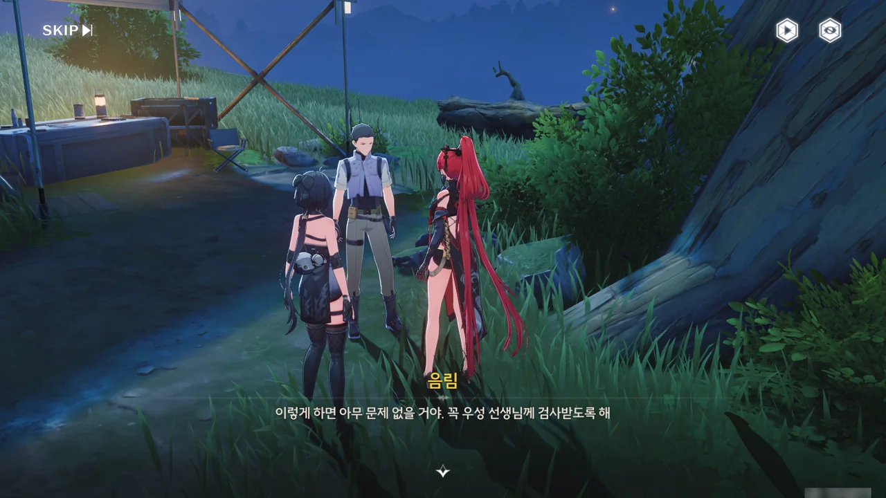





여기 있는 걸 모두 태워버리려 하는 음림에게 방랑자가 '그러면 후회할 텐데'라고 말하며 음림의 물건을 봤다고 실토하자, 음림이 "남의 일에 끼어들지 마..."라고 분노한다.

음, 이건 음림이 화를 내도 어쩔 수 없지. 하지만 자기 물건을 제대로 간수하지 못한 음림의 책임도 있는 것 아닐까? (뻔뻔)





방랑자가 자신의 물건을 본 걸 알고 힘이 빠진 걸까, 여기서 섣불리 불을 붙였다간 잔상을 끌어들일 수도 있다며 음림이 물건 태우기를 포기한다.

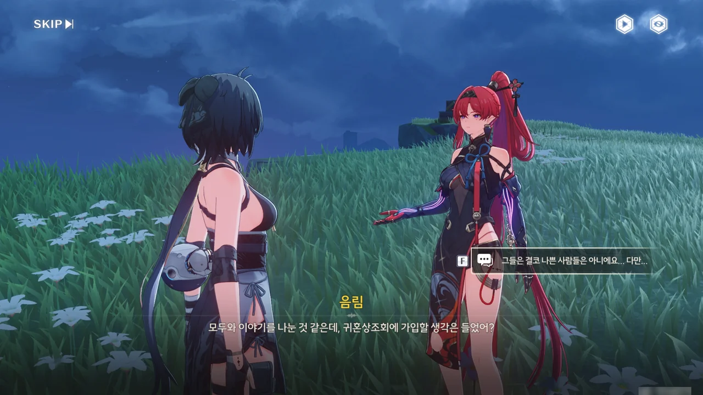



귀혼상조회의 대다수의 사람들은 나쁜 사람이 아니다. 인형이 오버클럭을 유발할 수 있다는 걸 알면서도 죽은 사람을 다시 보고 싶어 하는 그 마음 하나로 어리석다면 어리석은 길을 택한 불쌍한 사람들일 뿐이다. 그야말로 '불쌍하고 비참한 사람들(Les Misérables)'인 셈이다.

나쁜 게 있다면, 언사, 음림, 우성 같은 사람들이겠지.







아까 음림의 물건을 보면서 추측했던 것이 정말이었네. 하지만 언사가 귀혼상조회를 만든 목적이 음림의 부모님 인형을 만들기에 앞서 필요한 실험체를 확보하기 위해서라는 건 처음 듣는다. 여기 온 사람들 역시 언사가 자신들을 실험체로 보고 있다는 걸 알면서도 자신의 소중한 사람을 다시 보기 위해 기꺼이 상조회에 가입해 실험체가 되었다고 한다.

정말 불쌍하기 짝이 없는 사람들이다.







예영을 돕고 인형들을 단순한 물건이나 괴물 취급하지 않은 방랑자는 자신에게 특별한 존재라고 말하며, 음림은 방랑자가 정의로움을 타고난 게 아니냐며, 자신보다 순찰관에 더 적합할 거라고 말한다.

... 과연 음림이 한 말 중에 그녀의 진심은 얼마나 담겨있는 걸까?







곡수가 아까 다친 이유가 잔상의 습격 때문이었나 보다.

여기 있는 사람들 대부분은 전투력이 없는 일반인에 불과하기 때문에, 방랑자는 이들을 도와 잔상을 내쫓기로 한다.



잔상이 쳐들어오고 있는데요.

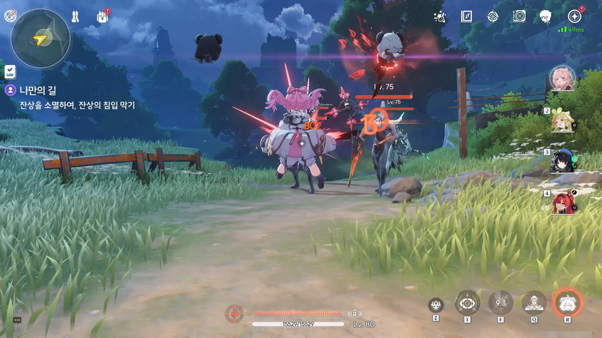

없었습니다.



그리고 타이밍 좋게 치샤를 포함한 순찰관 역시 도착했다.







하지만 어느새 다가온 음림이 방랑자를 인질로 잡은 탓에, 치샤를 비롯한 순찰관은 무기를 내려놓을 수밖에 없었다. 방랑자가 '금주의 손님'인 걸 알면서도 인질로 잡은 거야? 정말 대단하네...





음림이 방랑자 등 뒤에서 자신을 믿고 따라와 달라고 한다.

이전에 한 짓이 있어서 그리 내키진 않지만...
