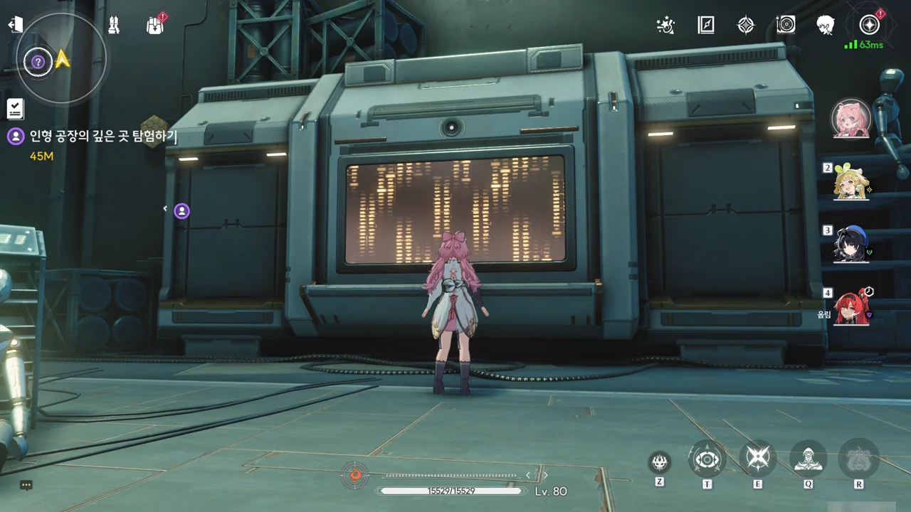
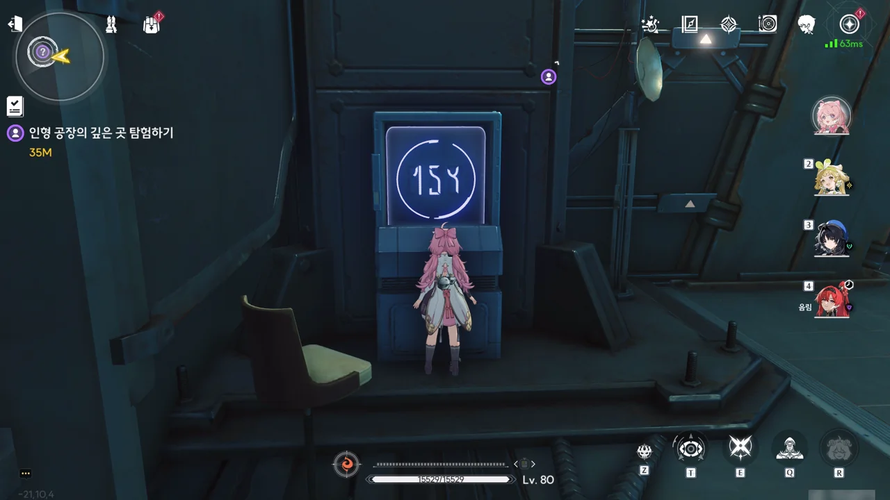
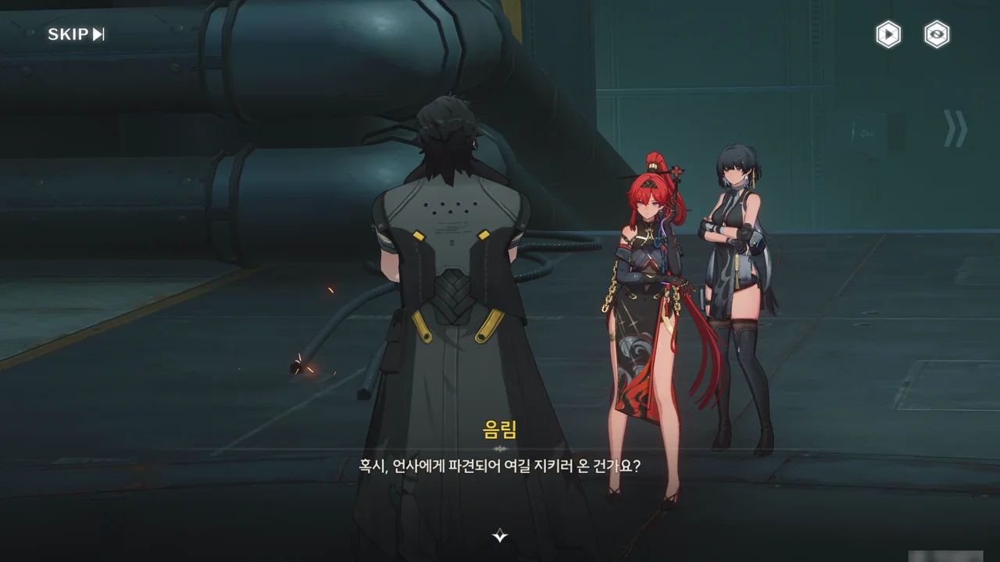
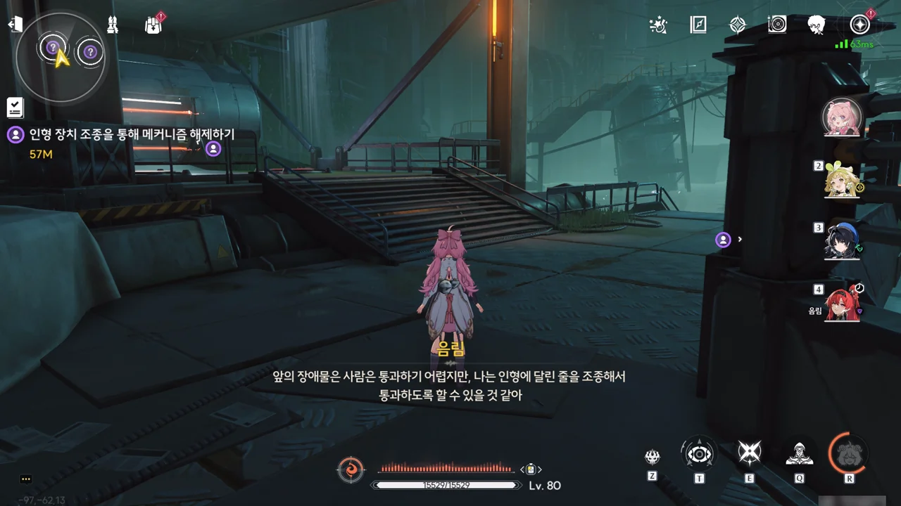

원래 이렇게 글 쓰기가 어려웠었나...? 어째 음림 얽힌 별 임무는 글을 쓰려해도 손이 잘 가지 않는다. 아직 써야 할 글이 한참 많이 남아 있는데...







방랑자를 납치(?)한 음림은 언사의 본거지인 공장으로 도망쳐 들어왔다. 하지만 그 과정에서 일부 잔상이 공장 안으로 침입했고, 캠프와 공장 역시 순찰관에 둘러싸여 탈출할 수 없게 되었다.

언사가 방랑자를 공장 암실로 데려오라고 말하며, 어차피 방랑자 몸에 감청 및 위치추적 기능이 있는 장치를 달아두었으니, 설사 방랑자가 탈출한다 하더라도 여기서 도망칠 수 없을 거라고 말한다.

그런데... 그런 거라면 그냥 장치를 떼면 되는 거 아냐? 수술 같은 걸 통해 방랑자 몸 안에 장치를 심어둔 게 아니라면, 그냥 몸에서 장치를 떼면 될 일이잖아. 그 이후엔 방랑자를 어떻게 잡을 건데?









방랑자가 암호화된 통신 패드를 이용해 순찰관을 귀혼상조회 캠프로 불러들였다고 추측한 음림이 방랑자가 숨겨두고 있던 통신 패드를 자신의 기계인형 「현사」를 이용해 압수한다.

갑자기 든 생각인데, 방랑자는 저 커다란 통신 패드를 어디에 숨겨두고 있었던 걸까...?









음림이 「현사」를 이용해 방랑자에게서 압수한 통신 패드에 글을 써 방랑자에게 보여준다. 언사가 방랑자 몸에 감청 장치를 달아두었기 때문에, 언사에게 들키지 않는 방식인 필담으로 메시지를 전달하는 것이다.

음림의 메시지에 따르면, 여기는 언사가 인형을 생산하는 공장이며, 곳곳에 기관 장치와 언사의 부하가 포진해 있어 위험한 장소라고 한다.

이미 알고 있는 바와 같이, 언사는 잔성회와 결탁해 자원과 소재를 공급받는 대신 잔성회에게 오버클럭을 유발할 수 있는 귀혼 인형을 제공하고 있다. 음림은 언사가 잔성회와 결탁했다는 증거를 수집 중이며, 이를 위해 방랑자의 협조가 필요하다고 한다.

&nbsp;

음림이 저번처럼 또 거짓말을 하고 있는 게 아니냐고 의심할 수 있지만, 만약 음림의 말이 진짜라면 방랑자가 납치된 직후의 일이 모두 설명이 된다.

> 음림은 방랑자가 외부에 지원 요청을 할 수 있도록 일부러 방랑자를 가둔 상자에 암호화 통신 패드를 끼워 넣었고, 귀혼상조회 조사에 도움이 될 수 있게 귀혼상조회 명부도 방랑자를 가둬둔 방에 놓아두었다.
{.bq}

물론 이것 역시 방랑자가 음림에게 순순히 협조하도록 만들기 위해 꾸민 일이라고 생각할 수 있지만, 그럴 거라면 굳이 귀혼상조회 캠프를 순찰관에게 노출시킬 이유가 없다. 다른 방법을 써서라도 방랑자가 음림을 믿게 만들 수 있지 않겠는가.

이거... 합성대 아닌가? 이게 왜 여기에 있는 거지?

'여기는 지구와 다른 곳입니다!'라고 말하고 싶은 건지, 명조의 배경인 솔라리스에는 지구의 것과는 다른 문자 체계가 존재한다. 그래봤자 알파벳과 숫자의 모양을 조금 바꾼 것에 불과하지만...

예를 들어 이 문자는 그냥 보이는 대로 '154'이다. 저게 정확히 뭘 뜻하는지는 아무도 모르지만, 저게 154라는 건 널리 퍼져있다.



기계 장치를 누르면 인형을 조작할 수 있게 되는데, 인형을 조종해 발판 위에 올려놓으면 길을 막고 있는 레이저가 사라진다. 이후 인형의 조작을 끊으면 자유로이 움직여 레이저 너머로 넘어갈 수 있고.





언사의 부하로 보이는 추방자가 가족을 돌려달라며 다짜고짜 음림을 공격한다. 가뜩이나 인형에 오래 노출되어 정신이 불안정해진 상태에서, 순찰관과 잔상의 침입 때문에 정신이 무너져내려 오버클럭에 빠진 것이다.

귀혼 인형이 이렇게나 위험합니다, 여러분. 뭐? 귀혼 인형이 구원이라고? 사람을 미치게 만드는 게 설마 구원이라고 말하고 싶었던 거야, 우성? 쯧, 돌팔이가 그럼 그렇지, 뭐.

이 녀석 말고도 다른 추방자가 덤비긴 했는데, 별문제 없이 모두 처리할 수 있었다.

여기도 인형 조종 장치가 있다. 인형으로 발판을 대신 눌러, 꺼진 레이저 뒤로 넘어가면 된다.







언사의 연구에 필요할지도 모른다는 핑계를 대며, 곳곳에 놓인 인형들을 증거자료로 쓰기 위해 사진을 찍는다.

언사가 정말 도청 장치로 방랑자와 음림의 대화를 듣고는 있는 건지 의심이 간다. 여기에 인형을 둔 건 다름 아닌 언사일 텐데, 여기 사진을 찍는 게 어딜 봐서 언사의 연구에 도움이 된다는 거야? 내가 언사이고, 음림의 말을 듣고 있었다면 벌써 음림을 의심하기 시작했을 거다.



대체 여기에 왜 군용 기계가 놓여 있는 거야? 설마 금주 순찰관과 전쟁이라도 하려는 건가?

설사 언사가 다른 혐의를 다 벗더라도, 불법으로 유통된 군용 기계를 보유한 것에 대해서는 쉽게 빠져나가기 힘들 것 같다.



> 인형이 너무 많은데... 전부 작동한다면 어떻게 될지 상상도 못 하겠어.

어어, 그런 말 하면 안 돼! 그런 말을 하면 나중에 꼭 그런 상황이 벌어진다고. 말이 씨가 된다는 말, 몰라?



본래 언사가 만든 인형은 공명자만 쓸 수 있지만, 별도의 동력원을 장착하면 비공명자도 인형을 사용할 수 있다고 한다.





오버클럭 때문에 미치긴 했어도 비교적 곱게 미친 건지, 언사의 부하 추방자가 분명 같은 편일 음림마저 적으로 여기고 공격한다.

설마 언사가 음림의 배신을 눈치채고 음림을 제거하기 위해 추방자를 보낸 건 아니겠지?



진짜 곳곳에 추방자가 널려 있다.





여기가 언사의 본거지인 공장 암실인 건가? 생각보다 깔끔한데?

그런데 언사는 왜 가면을 쓰고 있는 걸까?





여기까지 오며 마주친 추방자에게 오버클럭 증세가 나타나 죽일 수밖에 없었다고 음림이 말하자, 그들은 어차피 버려질 운명이었으며, 온갖 나쁜 짓을 저지른 집 없는 유민이니 죽든 말든 아무도 신경 쓰지 않는다고 언사가 차갑게 말한다.





사람들을 오버클럭에 빠트리는 치명적인 단점만 해결한다면 언사의 인형은 나름 괜찮은 치유 수단이 될 수 있었을 것이다. 사람들이 거기에 집착하지만 않는다면 말이지...

언사가 말하는 '목적'이라는 게 음림의 부모님을 인형으로 재현하는 거겠지?









저번에 했던 추측이 전부 맞았네.

언사의 목적은 모두가 자신을 괴물 취급할 때 자신을 진심으로 받아준 음림의 부모님을 인형으로나마 재현하는 것이었으나, 자신이나 음림의 기억만으로는 음림의 부모님을 재현할 수 없었다.

대체 방랑자의 어떤 점에서 실마리를 찾은 건지는 알 수 없지만, 언사는 잔성회의 자원과 방랑자의 몸에서 뽑아낸 실험 데이터가 있다면 음림의 부모님을 재현할 수 있을 거라 생각하고 있다.

의도는 좋아 보여도, 그 방법이 이미 글러먹었다. 영혼을 팔아서라도 음림의 부모님을 부활시킬 거라고 하거나, 음림의 부모님을 부활시키기 위해서라면 다른 사람들이 얼마나 죽든 전혀 관심 없다고 하는 걸 보면 이미 인성이 파탄 났다.

설사 언사가 음림의 부모님을 재현하는 데 성공하더라도, 그들의 성격이 원래 음림의 부모님의 성격과 확연이 다를 것이 눈에 불을 보듯 뻔하다.









언사가 자신의 신원과 행적을 들켜선 절대 안 된다며, 공장의 폭약을 써서라도 이곳을 은폐하라고 명령한다. 여기 있는 사람 중 자신에게 중요한 건 음림과 자신 둘 뿐이라며, 방랑자 역시 이전처럼 안전하게 기절시키지 않고 실험에 쓸 수 있을 정도의, 최소한의 의식만 남겨두어도 좋다고 말하는 언사. 심지어 음림과 방랑자 인형을 만들어 순찰관과 인질극을 벌이는 척 협상하게 만든다는 계획까지 세운다.

그런 주제에 '자기 목숨보다 더 중요한' 인형 자료에 대해선 까맣게 잊고 있다가 음림이 그걸 지적하고서야 '아차차' 하면서 손바닥에 주먹을 가볍게 내려치는 우스꽝스러운 모습도 보인다.





언사가 방심한 순간 방랑자가 언사에게 칼을 휘두르나, 놀랍게도 언사는 방랑자의 칼질을 두 팔만으로 막아낸다.

이 녀석, 이미 인간을 그만둔 건가? 보통 팔로 칼을 막았으면 팔이 잘리는 게 정상 아냐? 그런데 왜 불꽃이 튀겨?







이게 무슨 짓이냐고 따지는 언사에게 음림은 이제 다 끝났다며, 더 이상 잔성회와 결탁하지 말 것을 요구하나, 음림이 배신한 것에 분노할 뿐인 언사 귀에는 전혀 들어가지 않았다.

음림은 이전부터 다른 사람을 실험체나 소모품 취급하는 언사의 태도나, 죽은 사람을 재현한 인형에 집착할 뿐인 귀혼상조회 사람들의 행보가 옳지 않다고 느꼈다. 그래서 언사의 악행을 증명할 자료를 몰래 모아 왔었고.

하지만 궁지에 몰린 언사가 자신이 느꼈던, 음림의 부모님이 준 따뜻함을 위해 공장에 있는 여러 사람들의 목숨을 내버리려 하자, 자신이 무고한 사람들을 보호하고 죄악과 싸우는 보안서 순찰관임을 다시금 떠올린 음림이 거기에 환멸을 느끼고 언사를 직접적으로 배신하기로 결심한 것이다.





마지막 반항이라도 하려는 건지, 언사가 미친 추방자를 공장 암실로 들여보냈다.



추방자를 모두 물리치고 나니, 흰색으로 빛나던 방은 간데없고, 우중충한 공장 지하실이 눈앞에 나타났다. 알고 보니 우리가 지금껏 보고 있었던 방안의 풍경은 모두 홀로그램 투영이었고, 이게 공장 암실의 진짜 모습이었던 것이다.





*직정* --- 진짜 직정이 아닌, 추방된 과학자 무리지만 --- 실험실에만 있는 줄 알았던 조립식 로봇이 여기에도 있는 걸 보면, 이미 잔성회가 조립식 로봇을 추가로 만들 수 있을 정도로 그들의 연구 자료를 회수해 학습한 모양이다. 과학자 녀석들, 죽어서까지 도움이 안 되네.

언사는 자신이 잔성회를 이용하고 있는 거라고 말하지만, 이건 누가 봐도 언사가 잔성회에게 조종당하고 있는 모습이다. 방랑자 말대로, 불쌍하기 짝이 없는 모습이다.

물론, 조립식 로봇은 1분도 안되어 철거당했다.





> 이곳은... 내가 만들어낸 낙원이다! 이 사람들은 모두 인형 덕분에 구원을 받았고, 난 그들의 구세주란 말이다!

이건 진짜 중증인데? 게다가 저 말을 하는 언사 뒤에 놓인, 꼭두각시를 조종하는 듯한 두 손의 모습이, 마치 내가 처음 예상했던 귀혼상조회의 모습인 '인형을 빌미로 사람들을 마음대로 조종하는 악의 조직'을 연상시킨다.





음림은 이미 죽은 목숨은 편히 쉬어야 한다는 걸 깨달았으며, 자신이 할 일은 그저 자기 사욕을 위해 힘을 남용하여 자신의 부모님을 죽인 범죄자들을 벌하는 것이라고 말한다.

저 말은 음림의 부모님을 죽인 범죄 조직을 향한 것이기도 하지만, 언사를 향한 것이기도 하다. 둘 다 자기 사욕을 위해 힘을 남용한 건 똑같으니까.

거기에 대고 언사는 "힘이란 행복을 얻기 위해 존재하는 것이고, 법과 도리는 더 강한 자가 만드는 것일 뿐"이라고 말하는데, 정작 그 논리에 순응하지 않는 건 언사라는 게 참 웃기다.

지금 음림과 방랑자가 언사보다 더 강하니, 언사는 자신의 논리에 따라 방랑자와 음림의 말에 순응하여 순찰관에게 항복하고 이 모든 일을 그만두어야 한다. 하지만 지금 언사는 그러지 않고 음림에게 자신의 정당성을 설파하고 있지. 하! 이렇게나 설득력 없는 설득이 있다니.





계속 정의를 주장하는 음림에게 언사가 보안서에 있는 음림의 서류를 이미 모두 없앴다며, 이제 음림이 누구인지 증명할 방법이 그 어디에도 없다고 쏘아붙이지만, 음림은 전혀 아랑곳 않고 자기 방식대로 자기가 하고 싶은 일을 할 거라고 대꾸한다.

그리고 그 대답을 들은 언사는 울화통이 터진 건지, 고통에 찬 신음을 내뱉는다.

이 녀석, 의외로 개그맨 소질이 있는 거 아닐까? 처음에 보여준, '자기 목숨보다 더 중요한' 인형 자료에 대해선 까맣게 잊고 있다며 주먹을 손바닥에 가볍게 내리치는 모습부터 해서, 제 분에 못 이겨 신음을 내뱉는 것까지. 아주 보는 재미가 쏠쏠하단 말이야.



음림은 나머지는 방랑자에게 맡긴다며, 자신의 일은 순찰관에게 비밀로 해주었으면 한다는 부탁을 남기고 사라진다.



결국 돌파에 성공한 건지, 순찰관들이 몰려와 언사를 에워싼다.





캠프에 있던 귀혼상조회 사람들은 치료를 위해 금주로 이송되었으며, 그들이 가족처럼 여기던 인형 역시 원래의 모습으로 돌아갔다. 다만 눈앞에서 *가족*이 인형으로 되돌아간 충격 탓인가, 다들 넋이 나간 모습이었다고 한다.





음림의 부탁대로, 방랑자는 음림에 대해 '더는 추적할 필요가 없다'라고 말해주었다. 뭐, 어차피 다시 만날 때가 되면 다시 만날 수 있겠지.

> 왠지 모르게 나쁜 사람 같진 않은... 아냐, 인상만으로 용의자를 판단할 수는 없지!

이건 너무 작위적인 대사다...
