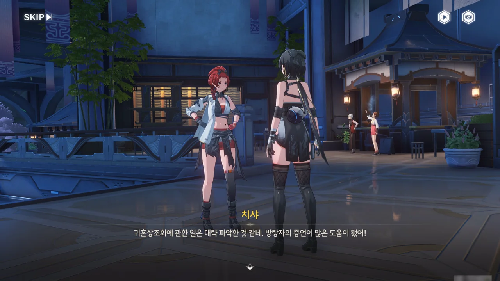
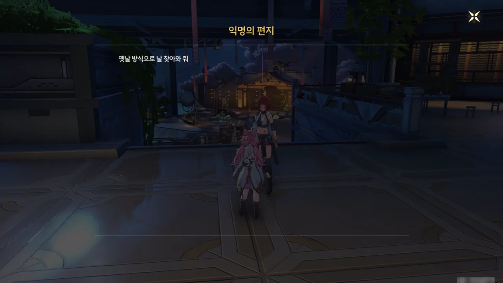
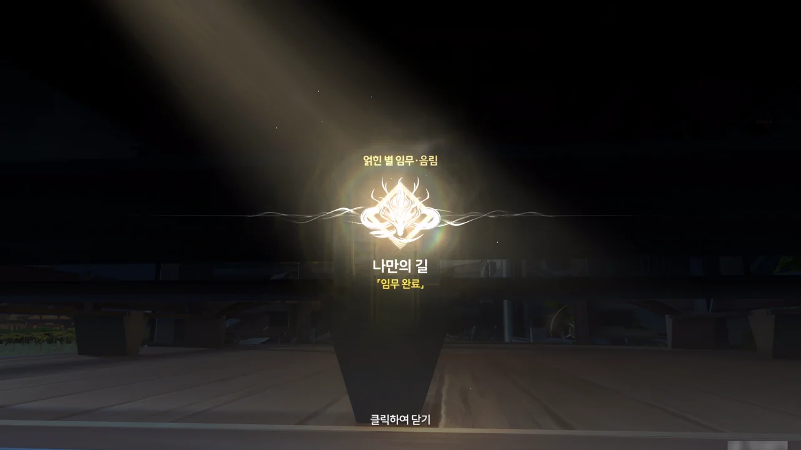





귀혼상조회가 잔성회와 연관된 건 보안서에서도 모르고 있었던 일이기에, 이번 일로 한시름 놓았다고 치샤가 말한다. 다만 언사가 자신은 물론이고 음림에 관한 것까지 아예 말을 하지 않고 있기 때문에, 수사에 진전은 없다고 한다.



방랑자가 '어둠 속에 숨은 정의의 사도', '정과 의리를 중시하는 동반자', '적인지 아닌지 구분하기 어려운 사람'에게 도움을 받았다고 말하자, 그런 사람이 있다면 순찰관이 되기 정말 좋은 사람일 것 같다고 치샤가 말한다.

다른 사람에게서도 순찰관으로 인정받았으니, 그래도 음림의 마음이 조금은 편안해지려나?



> 옛날 방식으로 날 찾아와 줘
{.bq}

음림이 늑대 모양 표식으로 방랑자를 부르고 있다.



출발하기 전, 치샤에게 잠입 수사관에 대해 묻자, 잠입 수사관에 대해 간략히 설명해 주며, 자신이라면 3분도 안 되어 들통날 거라고 답한다.



이 늑대 표식은 대체 또 언제 남긴 거래? 저 멀리 정자에 음림의 모습이 보인다.







음림이 방랑자에게 말을 편하게 해 달라며, 자신이 방랑자를 만난 건 우연의 일치였다고 말해준다.

원래 음림은 언사의 부탁으로 예영과 잔성회의 거래를 감독하러 간 것이었지만, 방랑자를 만나게 되자 방랑자를 이용해 예영이 인형을 모아둔 곳을 찾으려 했다.





하지만 언사가 방랑자에게서 공명자로서의 특수성을 발견했고, 그래서 음림은 방랑자 포획을 위해 안전가옥으로 방랑자를 안내했다.

음림의 전기 충격이 따끔했다고 말할 때의 방랑자가 너무 귀엽다! 거기에 대고 "어쩐지 언사가 네 몸을 연구하고 싶어 하더라니!"라고 음림이 말하는데, 음림의 표정 때문일까, 멀쩡한 문장이 자꾸만 섹드립으로 읽힌다.





하지만 언사 역시 방랑자의 잃어버린 기억을 읽는 데에는 실패했다. 언사 말에 따르면, 언사의 이해를 뛰어넘는 힘이 방랑자의 기억을 잠근 것 같다고 한다. 방랑자의 기억을 엿보는 것만으로도 심연에 떨어지는 느낌이라고 했다는데... 대체 방랑자의 정체가 뭘까?

게임을 시작하고 나서 제일 처음 만난 그 흰 머리인지 검은 머리인지 알 수 없는 그 여자가 관계된 것은 확실한데...





음림은 이 세상을 홀로 살아간다는 점에서 자신과 방랑자는 서로 닮았다며, 앞으로 이 외로움을 받아들일 수 있도록 노력하며 계속 살아가자고 말한다.

그러면서 아마 언사도 이 외로움에 압도되어 자신의 부모님을 살리는 데에 집착했을 거라고 말한다. 하지만 언사는 거기에 매몰되어 새로운 인연을 모두 뿌리쳤으니, 자업자득이라고 할 수밖에.









음림의 부모님이 돌아가시고, 언사는 자기 계획을 실현하기 위해 음림을 보안서 순찰관으로 훈련시켰다. 결국 음림은 순찰관이 되는 데에는 성공했지만, 언사가 바라던 대로 언사의 바둑알이 되지는 않았다.

음림이 언사의 계획을 처음부터 막지 않은 건 음림 역시 귀혼상조회의 사람들처럼 부모님을 다시 만나 점차 가까워진 끝에 진정한 가족이 되는 걸, 그게 진정한 행복이 아님을 알면서도 내심 바랐기 때문이라고 말한다.

하지만 자신과 아무런 상관이 없는 일에 필사적으로 매달리는 방랑자의 모습을 보고, 이 일이 옳지 않음을 깨달은 음림은 언사에게 반기를 들었다.





아직 잔성회의 일이 남아있다고 말하는 음림에게 태연스럽게 "우리?"라고 방랑자가 묻자, 이제 와서 발을 빼려고 하면 물리적인 방법으로 기억을 지우는 수밖에 없다고 음림이 나지막이 위협한다.

잔성회와의 악연이 조금 질긴 방랑자가 여기서 발을 뺄리는 없고, 그래서 장난스레 "자비를 베풀어주십시오 아가씨!"라고 대답한다. 방랑자가 장난치는 걸 눈치챈 음림 역시 진심으로 방랑자를 위협하진 않았다.





다음에 어떤 모습으로 만나게 될지 기대하라며, 방랑자라면 무조건 믿어도 될 것 같다는, 진심인지 아닌지 모를 말을 남기고 음림이 떠난다.

얽힌 별 임무 · 음림 \[나만의 길\] 임무 완료!

아, 정말 긴 시간이었어... 이거 끝나면 또 조수 임무 이야기를 적어야 하긴 하지만...
