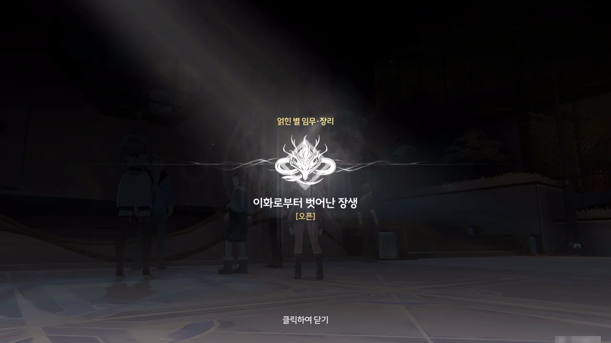
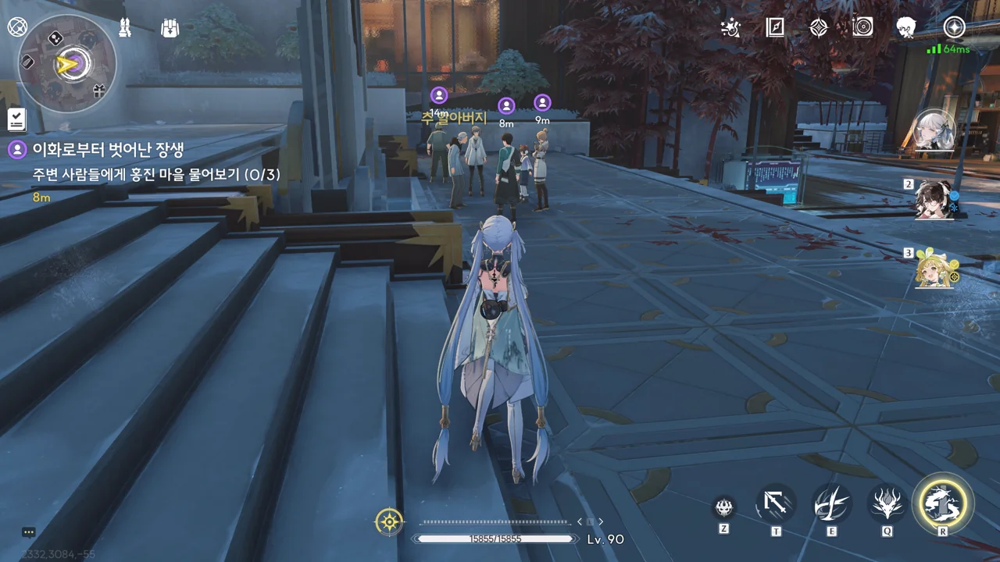
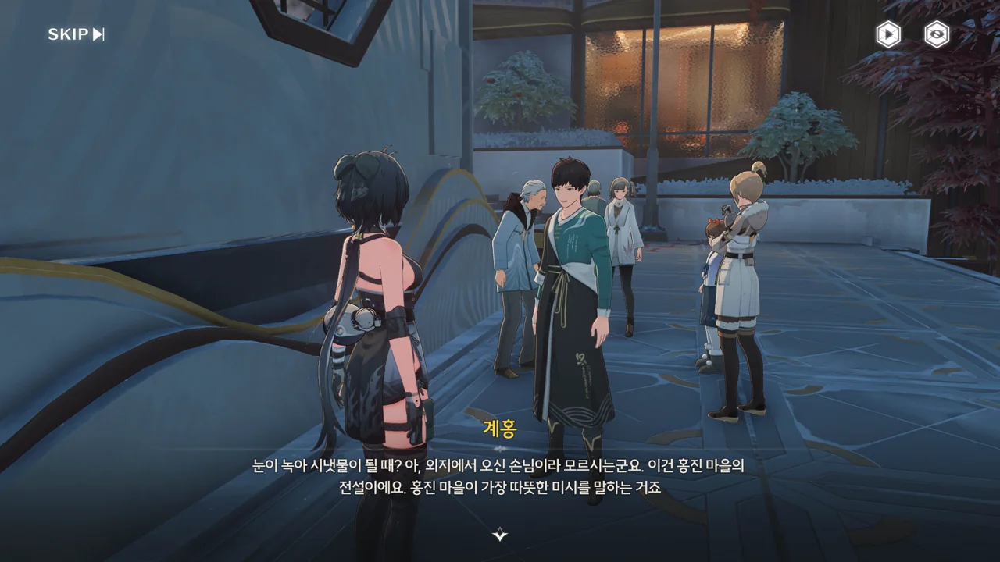
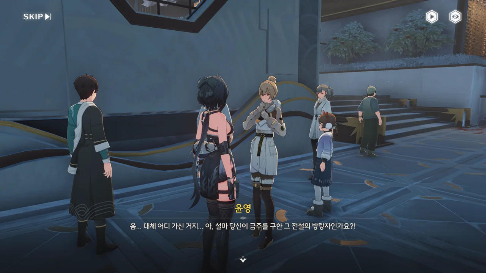
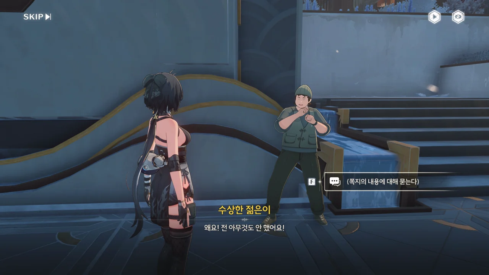
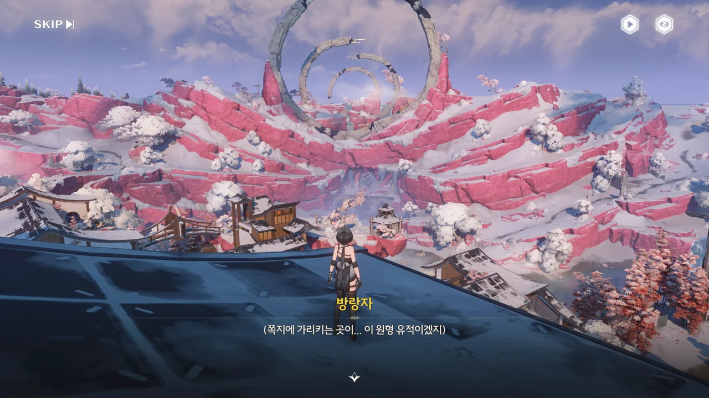
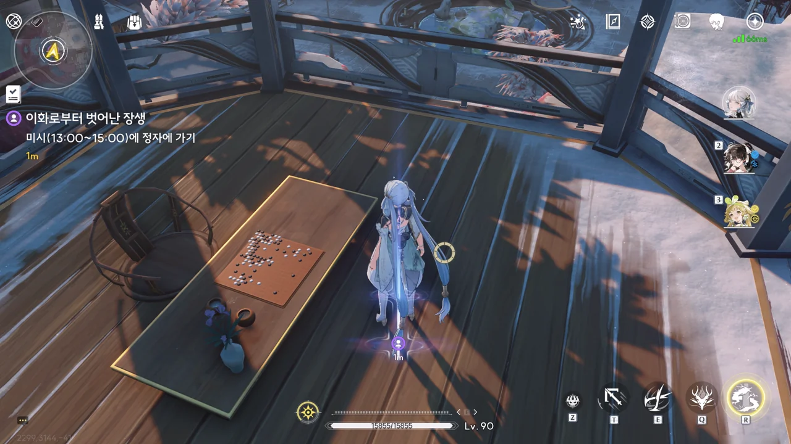







한 노인이 전설 이야기를 사람들에게 들려주고 있다.

이야기의 줄거리가 '신선놀음에 도끼 자루 썩는 줄 모른다'라는 속담의 근원이 된 민담의 것과 매우 유사하다. 궁금해 찾아보니, 그 민담은 원래 중국에서 유래한 전설이 한국에 민담으로 퍼진 것이라고 하더라.

하지만 홍진 마을 사람들은 이 이야기가 거짓 혹은 과장된 것이라 생각하고 있다. 바깥에서 수백 년이라는 시간이 흐를 동안 시간 결계 안에 있었으니, 하산한 나무꾼은 그동안 미뤄뒀던 시간을 즉시 일시불로 되돌려 받아 썩은 해골로 변해야 하는 것이 이곳 사람들의 '상식'이니까.





그 말에 노인은 사람 말을 끝까지 들어보라며, 승소산의 숨겨진 「장생 비법」이 앞서 말한 전설 이야기 속 노인이 두던 바둑에 있었다고 이야기한다.

그러고 보니, 용의 머리 모양을 하고 있는 산이 왜 저렇게 생긴 건지에 대해 여태껏 단 한 번도 생각해 본 적이 없다. 어디서 들은 건지는 전혀 기억나지 않지만, 저 산은 절대로 자연적인 이유로 저런 모습이 된 게 아니다. 마을 사람이나 「용의 뿔」이 저런 모습으로 깎고 빚은 거지.





사람들이 이야기를 더 자세히 듣기 위해 노인에게 가까이 다가가는 와중, 장리가 어느새 방랑자 곁에 서있는 걸 발견했다. 대체 언제 온 거야?





장리는 방랑자 손에 무언가를 쥐여준 후, 나중에 보자는 말만 남기고 다시 사라졌다. 생긴 걸 볼 때, 둘 중 하나는 쪽지가 분명하다.









음식 냄새도 풍기지 않았는데 쪼꼬미가 튀어나왔다. 아니나 다를까, 장리가 낸 수수께끼 풀이에 전혀 도움이 되지 않는다.

여태껏 여러 게임을 해보았지만, 쪼꼬미만큼 도움이 안 되는 '주인공의 동반자' 혹은 '마스코트'는 처음인 것 같다. 이래서야 그냥 귀여움 원툴밖에 안되잖아...

> 홍진 마을의 경치가 펼쳐지고 유적이 바라보는 처마 끝, 눈이 녹아 시냇물이 될 때, 당신이 오기를 기다리겠습니다.

'홍진 마을의 경치가 펼쳐지고 유적이 바라보는 처마 끝'은 홍진 마을 어딘가, '눈이 녹아 시냇물이 될 때'는 시간을 의미한다.

그런데 이게 '전과 비슷한 방식'이라고? 여태껏 풀었던 수수께끼가 다 거기서 거기로밖에 생각되지 않기 때문에, 이런 수수께끼를 푼 게 대체 언제였는지 도저히 기억이 나질 않는다.

얽힌 별 임무 · 장리 \[이화로부터 벗어난 장생\] 오픈!



> **깃털 장식품**
> ***
> 장리가 남긴 깃털 장식품
> ***
> 따뜻한 온기를 남기며, 무게 없이 손바닥에 사뿐히 내려앉는다.  
> 무슨 용도가 있는지 알 수 없다.
{.bq}

> **장리의 편지**
> ***
> 장리가 남겨준 편지. 전해주고 싶은 메시지가 담겨 있다.
> ***
> 은은한 향기를 풍기며, 「홍진 마을의 경치가 펼쳐지고 유적이 바라보는 처마 끝, 눈이 녹아 시냇물이 될 때, 당신이 오기를 기다리겠습니다.」라는 내용이 적혀 있다.
> 왠지 초청인 것 같다.
{.bq}

번역 찐빠는 잠시 넘어가도록 하자. 쿠로가 쿠로 한 게 어디 하루이틀인가.

장리가 물건을 건네줄 때 깃털은 못 본 것 같은데, 아마 검은 봉투 안에 넣어서 준 모양이다.



그런데 이 깃털, 어째서인가 두 개가 되어버렸다.

아까 그 노인이 '추 할아버지'였구나.









마을의 젊은이, 계홍은 '눈이 녹아 시냇물이 될 때'는 홍진 마을이 가장 따뜻한 미시(오후 1시 ~ 3시)를 의미한다고 알려준다. 에이, 설마 계홍이 말해준 전설 속 기인의 정체가 방랑자겠어? 하지만 방랑자, 오만데 안 끼는 곳이 없는 사람이잖아...

홍진 마을 사람을 선조로 둔 추 할아버지는 여태껏 승소산 바깥에서 살다가, 최근 홍진 마을이 방랑자 덕분에 큰 위기를 넘겼다는 말을 듣고 자신의 핏줄을 찾아 승소산에 온 것이라 한다.

승소산과 바깥의 시간 흐름 속도가 10배나 차이 났으니, 승소산 바깥에서 온 추 할아버지와 홍진 마을의 친척의 촌수가 얼마나 꼬여 있을지 도저히 상상이 가질 않는다.









윤영은 홍진 마을의 새로운 풍물을 기록하기 위해 홍진 마을에 왔다고 하는데, 아무리 봐도 장리를 덕질하려고 찾아온 게 분명하다.

그래도 덕분에 '유적이 바라보는 처마 끝'이 홍진 마을의 제일 높은 건물 위로 올라가면 찾을 수 있다는 정보와, 장리에 대한 배경 지식을 얻을 수 있었다. 여전히 '진인'이 무엇인지, '장사(長史)'가 얼마나 높은 직위인지는 모르지만.











수상한 젊은이에게서 유용한 정보를 얻을 수는 없었다.

열심히 장리를 까내리는데, 정작 제일 중요한 '주장의 근거'가 심증 혹은 억지에 가까워, 불쾌감이 느껴질 정도이다. 마지막에 급한 일이 생각났다는 같잖은 이유를 들며 도망치는 모습까지 불쾌했다.

> If somebody hates you for no reason, give that motherfucker a reason.
> 만일 누군가 너를 아무 이유 없이 존나 싫어하면 그 좆같은 이유를 하나 만들어줘라.

자꾸만 이 문장이 생각나더라고.





뭐, 장리에 대한 평가가 극과 극으로 나뉜 건 이미 알고 있었으니까. 돌이켜 생각해 보면, 처음 금주에 왔을 때부터 상반된 평가와 함께 자신의 존재를 은현듯 드러낸 게 바로 장리였다.















홍진 마을의 촌장 --- 정확히는 지도자, 책임자이지만 별반 차이가 없다 --- 인 신이와 만나 그동안 있었던 일에 대해 물어보았다.

신이는 장리가 심보가 나쁘다는 평가를 듣는 건 그녀가 자신의 의도를 쉬이 내비치지 않아서이며, 깃털 같이 '자신을 알리는 소중한 물건'을 남에게 쉽게 주지도 않는다고 알려준다. 또한 장리는 자신을 둘러싼 소문을 전혀 신경 쓰지 않는 --- 혹은 않는 것처럼 보이는 --- 사람이니, 자세한 건 직접 만나 알아보라는 조언도 남겨준다.





여기서 바라보니, 원형 바위 유적이 마치 다중 렌즈처럼 늘어서있다. 여기서 보이는 건 작은 정자. 아마 저기가 장리가 말한 '장소'일 것이다.

내가 바둑에 조예가 깊지 않아 잘은 모르지만, 지금 바둑판에 놓인 기보는 실제 있었던 기보라고 한다. 기보의 형세가 이번 얽힌 별 임무의 스토리와도 어느 정도 연관성이 있다는 이야기도 같이 들은 것 같은데, 그 부분에 대해선 정확히 기억나지 않는다.







드디어 장리가 도착했다. 수수께끼 풀이는 정답이었던 모양이네.









아하, 일전의 망고스틴 역시 장리가 기획한 수수께끼였구나. 어째서인지는 몰라도, 머리 쓰는 모양이 금희와 어울리지 않는다고 생각했었는데, 그게 이제야 설명이 되네.

> 그러니까... 방랑자가 와주셔서 정말 기뻐요.

저번에 장리 캐릭터 스토리에서 말했듯이, 장리는 방랑자를 만난다는 목표 하나를 위해 높은 지위까지 올랐다가 그 지위를 버리고 금주로 내려온 사람이다. 한마디로 장리는 방랑자를 평생 덕질하고 있는 중이란 말이다. 그러니까 지금 상황은 '최애가 지금 내 눈앞에!'라는 상황인 거지.



흠... 느닷없이 기보를 보여주며 뭔가 생각나는 게 없냐고 묻는 걸 보면... 정말로 추 할아버지가 말해준 전설 속 기인이 방랑자인 걸까?









장리가 들려주는 「장생 비법」의 전설의 내용은 아까 추 할아버지가 말해준 것과 조금 달랐다. 두 이야기가 사실 하나였다니. 게다가 전설 속 '기인'의 정체가 바로 방랑자였다. 아니라고? 대놓고 실루엣이 방랑자인데?

백 년 전, 한 수행자 --- 아마 장리의 스승, 현묘 진인일 것이다 --- 가 승소산을 오르던 중 기인 --- 방랑자임이 분명하다 --- 을 만나 바둑을 두게 되었다. 길을 잃은 나무꾼 --- 추 할아버지의 조상이 아닐까? --- 은 우연찮게 이 둘이 바둑을 두는 모습을 구경하다 산속에 너무 오래 있게 되었다. 그 모습을 본 기인은 나무꾼이 뒤틀린 시간에 영향을 받지 않도록 산 아래까지 나무꾼을 데려다주었다고 한다. 승소산 결계의 영향을 받지 않는 건 방랑자와 「용의 뿔」, 그리고 그녀의 공명자인 금희밖에 없으니, 기인의 정체는 방랑자일 수밖에 없다. 시간이 지나 덕망 높은 은사 대가가 된 수행자는 노년에 승소산에 다시 돌아가 다시 만난 기인과 바둑을 두었고, 기인은 「장생 비법」을 마지막 바둑판에 숨겨 두었다고 한다.

수행자의 정체가 현묘 진인일 것이라 추측하는 것 역시 장리의 캐릭터 스토리에 적혀 있다. 거기서도 장리의 스승이 바둑을 언급했거든.















장리가 미완성 기보를 보고 '사부님의 추억'이라 한 걸 보면, 정말 전설 속 수행자의 정체가 장리의 스승, 현묘 진인이었던 모양이다.

장리가 방랑자를 찾을 수 있었던 건 스승이 남긴 전언 덕분이었다. 그렇기에, 장리는 스승이 기보에 남긴 메시지, 「바둑판은 뒤틀린 시간을 해소할 수 있다」, 「승소산이 세상에 나타날 때에야 바둑판을 볼 수 있다」 역시 진실일 거라 생각하고 있다.

그 이야기에 따르면 바둑판을 통해 시간을 제어할 수 있으니, 「장생 비법」 기보를 복원하면 「용의 뿔」이 입은 손상 역시 치유할 수 있을지도 모른다는 것이다.

「용의 뿔」이 회복할 수 있을지도 모른다니, 시도해 봐서 나쁠 건 없을 것이다.
