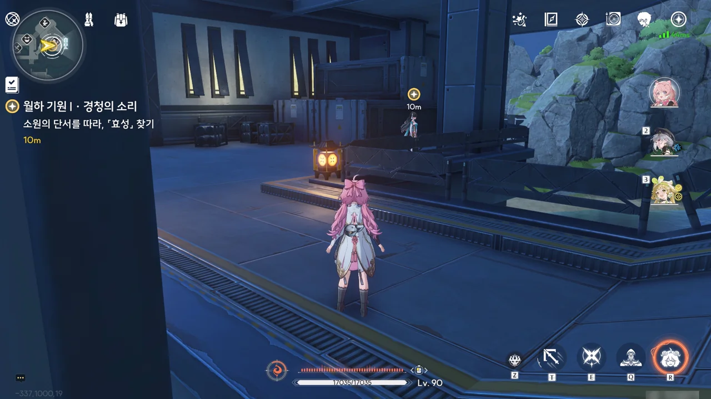



왜 소원을 열어보기 위해 퍼즐을 풀어야 하는 걸까?

그나저나 첫 소원부터가 자살 희망이라니... 아스칼이 오류를 내뿜는 게 이제야 이해가 되네.







소원을 해석하는 아스칼의 파트너이자, 소원을 실현하는 역할을 맡은 '상리'가 나타나, 해당 소원은 원칙상 실현할 수 없다고 말한다.

원래 이 녀석의 코드명은 따로 있는데, 동료 연구원들이 편의상 '상리'라고 부르다가 그게 이름이 되어버렸다고 한다. 한국식으로 따지면 '김삿갓'이 만든 로봇을 '김'이라고 부르는 격이니, 상리요 입장에선 상당히 당혹스러웠을 것이다.







> 분석 결론: 자기 부정과 자기 파괴 경향이 강하고 위험한 소원이므로 배려와 적절한 심리적 개입을 권장합니다.

그래, 나도 저 소원을 보자마자 '정신과 상담이 필요하겠네'라고 생각했거든.

아스칼이 이 소원을 분석할 수 없는 이유가 바로 여기에 있었다. 효성이 빈 '사라지고 싶다'라는 소원은 사람을 해칠 수 없다는 아스칼과 상리의 기본 원칙에 위배되기 때문이다.

여기도 설마 로봇 3원칙 같은 게 있는 건 아니겠지?

> 제 개인적인 생각으로는... 정말 포기하고 싶은 게 아니라 포기하고 싶지 않아서 괴로워하는 것 같네요.

응, 나도 그렇게 생각해. 사람의 말은 마치 종이장과 같아, 앞면과 뒷면이 다를 수 있거든. 이번 소원도 아마 그런 경우일 것이다.







그래서 이 효성이라는 사람의 '진짜 소원'을 이뤄주기로 했다.

화서연구원의 연구원이 한둘이 아닐텐데, "연구원 중 효성이라는 사람은 없었다"라고 말하는 것으로 보아, 상리요의 기억력이 비상하다는 걸 알 수 있다.









상리요는 연구원에 비상 사태가 생겨 거기로 가봐야 하기 때문에, '효성'이 과연 누구인가에 대해 조사하는 건 방랑자가 맡게 되었다.

조사에 도움이 될 거라며, 상리요가 상리를 붙여준다.

임무 마커가 화서연구원에 찍혀 있길래, '효성이 연구원이라 했으니 화서연구원을 조사하는 건 당연하지'라고 생각했었다. 그런데 왜 마커가 연구원 아래층에 찍혀 있니?

그리고 그 곳엔 절지가 서 있었다. 아니, 절지가 여기서 나온다고?





난간 근처에 서서 뭔갈 열심히 그리고 있는 절지. 방랑자가 상당히 가까이 왔음에도 눈치채지 못한 걸 보면, 작업에 꽤 몰두한 모양이다.





아니 ㅋㅋㅋㅋㅋㅋ 조사의 방향이 뭔가 좀 이상하지 않아? '절지의 행동 패턴이 효성과 유사하니, 절지에게 효성의 정체에 대해 물어보자'라니... 이거, '야, 찐따는 찐따가 잘 알지 않을까?'라고 말하는 것과 다름 없잖아 ㅋㅋㅋㅋㅋㅋ

상리요. 이 녀석, 정말 조사에 도움 되는 게 맞아? 추론 엔진 알고리즘에 문제가 있는 것 같은데? ㅋㅋㅋ...





방랑자가 다가오는 걸 눈치챈 절지가 그리던 걸 황급히 숨긴다. 대체 뭘 그리고 있었길래?





방랑자가 "실례합니다"라고 말했지만, 귀여운 상리의 모습을 발견한 절지의 머릿속이 온통 상리로 가득차버린 터라, 가볍게 무시당했다.

음, 방금 한 말 취소. 조사에 도움 되는 것 맞네! 방랑자가 무시당하긴 했지만, 뭐 그럴 수도 있지.







다시금 방랑자가 "안녕하세요"라고 말하자, 그제야 방랑자와 인사를 나누는 절지. 절지가 '오늘 날씨가 참 좋다'는 판에 박힌 인사말을 하자, 상리가 '곧 비가 올 예정'이라며 묵직하게 팩트를 꽂아버렸다.

절지 일러스트를 처음 봤을 때 눈이 흐리멍텅해보인다 생각했는데, 지금 이렇게 보니 또 나쁘지 않네. 얼굴 붉히며 당황해하는 절지가 정말 귀엽다.

그래서 뽑았지만. 꺼흐흑 내 별소리.









상리의 분석대로, 절지는 내향적인 사람이라 다른 사람과 대화하는 것에 익숙하지 않아 이러는 것이다.

다음 그림에 대한 소재를 찾고 있었다는 말로 미루어보아, 절지는 화가나 삽화가로 추정되니, 절지는 연구원인 '효성'이 아니다.



별 기대는 하지 않지만, '효성'이라는 이름을 쓰는 내성적인 사람을 찾고 있다는 말을 했다.

내성적인 사람이 교우관계가 얼마나 넓겠는가. 게다가 그림을 그리는 사람이니, 연구원과의 접점도 적을테고. 절지에게서 효성에 대한 이야길 듣는 건 거의 불가능에 가깝지.







자리를 황급히 뜨려다 기둥에 머리를 박은 절지가 얼굴이 잔뜩 붉힌 채 호다닥 뛰쳐나간다.

미식이네.





절지의 반응으로 미루어 보아, 절지는 '효성'을 알지 못한다. 이렇게 된 이상, 직접 화서연구원으로 가 물어보는 수밖에.

상리가 너무 무거운 주제를 다루게 되면 적당히 재미있는 질문으로 넘어가겠다고 말하는데... 아까 절지에게 묵직한 팩트를 꽂아넣은 걸 보면 조금 걱정된다.
