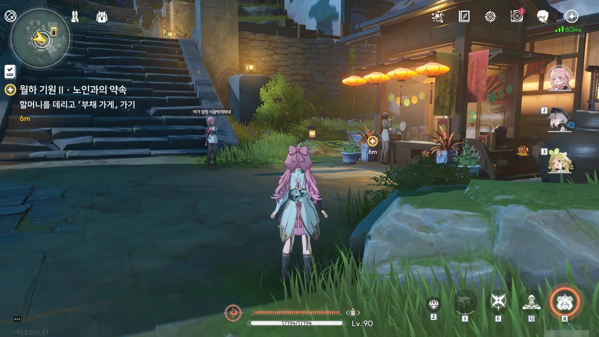









이번 소원은 아들을 잃은 부모의 소원이다. 이번 소원 역시 이전 소원처럼 자살을 암시하고 있다.

&nbsp;

'저쪽 세상' 같은 표현을 볼 때마다 생각나는 것이 하나 있다. '과연 사후세계는 존재할까?'

이 질문은 필연적으로 '영혼은 존재하는가?'나 '신은 존재하는가?' 같은 질문으로 연결되지만, 그러한 질문들을 제쳐놓고 사후세계 하나에만 집중한다면, 내 결론은 항상 동일하다.

**사후세계는 존재하지 않는다.**

> 지구와 화성 사이에 도자기 찻주전자 하나가 타원형 궤도로 돌고 있으며, 그 크기가 너무 작아 최첨단 망원경으로도 이를 관측할 수 없다.
> ***
> 러셀의 찻주전자 ― 버트런드 러셀 『신은 존재하는가?』 中 일부
{.bq}

우리는 '러셀의 찻주전자'에서 무언가가 존재한다고 주장하는 사람에게 그것의 존재를 증명할 책임이 있다는 것을 알 수 있으며 ― 현대 법학에서의 '증명책임'과 동일하다 ―

> 내 차고 안에는 보이지도 않고 항상 하늘을 날고 있으며 보이지 않는 불을 뿜고 물질로 되어 있지 않은 등, 어떠한 관찰 방법을 사용해도 관찰할 수 없는 '불을 뿜는 용'이 살고 있다.
> ***
> 내 차고 안의 용 ― 칼 세이건 『악령이 출몰하는 세상: 과학, 어둠 속의 촛불』 中 일부
{.bq}

'내 차고 안의 용'에서 존재를 확인할 수 없는 것의 존재를 확실한 증거가 쌓이기 전까지 일단 부정함이 현명한 접근법임을 알 수 있다.

사후세계가 실존함을 확실히 증명할 수 있는 증거가 아직 나오지 않았으니, 사후세계의 존재를 일단 부정하는 것이다. 꼬우면 사후세계가 존재함을 명백히 증명할 수 있는 증거를 가져오던가.







방랑자가 가족과 이별하여 고통을 겪고 있는 사람에게 잠깐 나서는 것만으로 과연 충분할지 걱정하자, 상리요가 그렇다고 이렇게 마음의 슬픔을 내버려 두는 것은 좋은 방법이 아니라고 말한다.

이전 소원과 마찬가지로, 이번 소원 역시 심리 상담 비슷한 것이 될 예정이다.













화영 할머니의 아들은 어머니가 평화로운 금주에서 안전하게 살기를 바랐기에, 언젠가 명식을 꺾고 모두가 평화로운 삶으로 돌아가게 하겠다는 말과 함께 야귀군에 들어갔다. 하지만 그는 잔상류에서 탈출하는 사람들을 보호하다 목숨을 잃고 말았다.

여태까지는 아들이 마지막으로 남긴, 명식을 물리치는 날을 꼭 봐달라는 부탁 하나로 버틸 수 있었지만, 방랑자가 명식을 물리치고 나니 저세상에 혼자 있을 아들이 혹여나 자신처럼 외로운 건 아닐까 하는 생각이 들어 자살을 생각하고 있었다고 한다.









상리요가 소원에 대한 답은 달나무집 앞에서 알려줘야 더 좋은 결과가 나온다며, 달나무집으로 가는 김에 도원향에 열린 달맞이 야시장도 한번 구경하자고 제안한다.







상리요가 갑자기 왜 거짓말을 하나 했네. 그의 목적은 화영 할머니를 달맞이 야시장에 모셔와, 그녀의 아들이 어머니에게 진정으로 보여주고 싶었던, 명식을 물리치기 위한 모두의 노력과 자신이 지켜온 행복의 결실을 보여주기 위해서였다.

화영 할머니는 아들이 죽고 난 후, 여태껏 시끌벅적한 곳을 가지 않았다고 하니, 어쩌면 효과가 있을 지도...





야시장에 온 화영 할머니는 억지로 웃으며 방랑자와 상리요에게 맞춰주고 있다. 뭔가 할머니에게 삶의 희망을 줄 만한 무언가를 찾아야 할 텐데...

부채 가게 옆에 도기가 서있는 걸 보고 도기 역시 이벤트 스토리에 등장하는 건가 생각했었다. 하지만 알고 보니, 그냥 다양한 캐릭터가 각기 다른 시간과 장소에 나타나는 것뿐이었다.

혹시나 해서 말을 걸어보니, 그냥 같이 사진을 찍는 게 전부였다. 대화 내용에서도 딱히 건질 만한 내용이 없었고...







달맞이 축제를 표현한 그림부채의 그림은 절지가 그렸다. 달맞이 축제가 열릴 수 있었던 건 야귀군의 희생 덕분이기에 이를 기리고자 달맞이 축제 그림에 야귀군을 상징하는 망토를 그려 넣었으며, 이 축제의 열기와 즐거움이 지금 전선에서 금주를 지키고 있는 야귀군에게 닿기를 바라는 마음으로 불꽃을 뒷면까지 튀어 넘치게 그렸다고 한다.



할머니의 아들이 어릴 적 가장 잘했던 것이 과녁 맞히기라는 말을 들으니, 이걸 그냥 넘길 수 없게 되었다.

이번 업데이트와 함께 「보조기·사격」 탐사 도구가 추가되었기 때문에, 과녁 맞히기를 수월하게 진행할 수 있었다. 이게 없었을 적에는 치샤 같은 권총 캐릭터를 무조건 꺼내야 했거든...









비싼 물건 대신, 실용적인 소품을 도전 보상으로 받았다. 초아가 도전 보상으로 이런 소품을 내놓은 건 이게 따뜻함을 전달한다는 달맞이 야시장의 취지에 더 걸맞을 것이라 생각해서이다.

그런데 알고 보니, 이 물건들은 화영 할머니의 아들, 수원 교관이 남긴 수첩에 적힌 방법대로 만든 물건들이었다. 초아를 비롯한 여러 야귀군이 이 소품들의 도움을 많이 받았다고 한다.

평소 어머님의 보살핌과 가르침에 대해 말했던 수원 교관이 죽고 난 후, 초아를 비롯해 그의 도움을 받은 여러 야귀군이 화영 할머니를 위로하기 위해 찾아갔으나, 화영 할머니가 끝내 만나기를 거절한 탓에 제대로 만나는 건 이번이 처음이라고 한다.







수원에게 큰 도움을 받은, 문현을 비롯한 여러 야귀군에게서 자신이 모르는 수원의 이야기를 듣게 된 화영 할머니.





화영 할머니는 달나무집에 가 소원의 답을 듣기 전, 자신의 힘으로 수원이 남긴 뜻을 좀 더 돌아보겠다고 말하며, 방랑자와 상리요에게 감사를 표한다.





이것 하나만으로 화영 할머니가 의욕을 다시 찾을 수 있을지는 알지 못한다. 하지만 아들의 도움을 받은 야귀군과 함께 아들 이야기를 나누며, 그가 진정으로 원했던 게 무엇이었는지 알아갈 계기를 얻었으니 아마 괜찮을 것이다.
