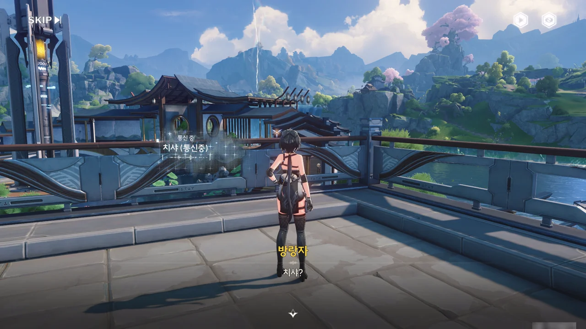
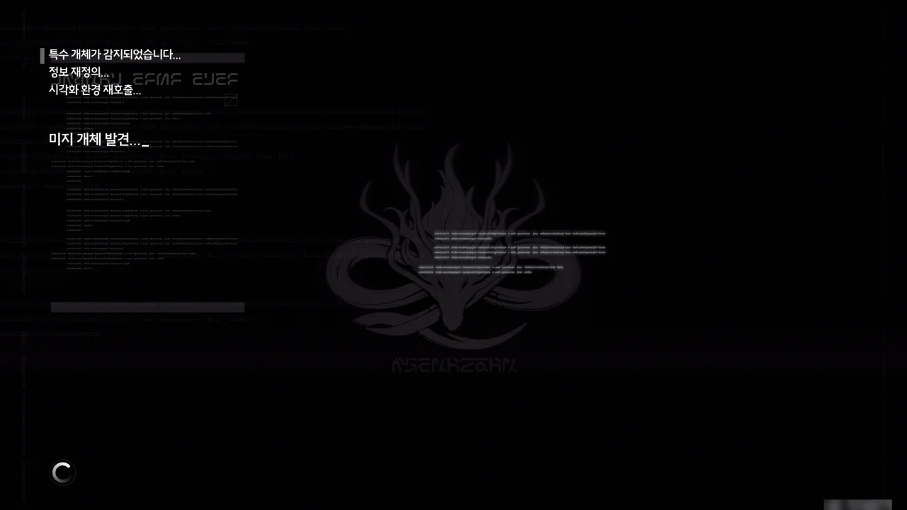
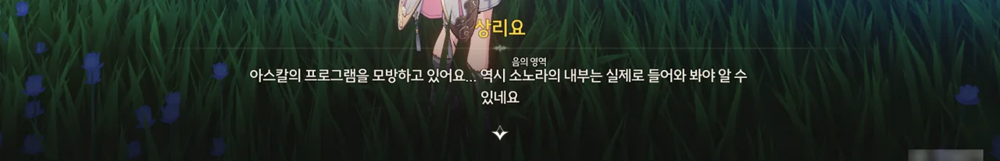



이 녀석, 또 배가 고프다고 하네.

사실 따지고 보면 이번 이벤트에서 본격적으로 등장한 게 이번이 처음이니, '또'라고 하는 건 조금 무리일지도 모르겠다.

















치샤, 양양, 설지는 여전히 초아를 도와 달병 맞히기 노점을 준비하고 있나 보다. 그런데 금희를 본 거 같다고? 금희 역시 축제를 즐기러 온 건가? 우리 귀여운 ~~*찐따*~~ 절지 역시 달병 맞히기 노점을 돕고 있나 보다.

저녁에 있을 '용의 춤'이 무엇인지 궁금해지네.











설지가 일찍 와달라고 했으니, 쪼꼬미가 원하던 판화반점 스페셜 메뉴는 물건너갔다.

더 맛있어 보이는 음식을 먹으려 했으나, 상리요가 급하게 부르는 바람에 그것마저도 물건너갔다.











아스칼이 여태껏 모았던 주파수가 공명을 일으켜 이 만들어졌고, 아스칼이 그 입구가 되어버렸다.

방랑자가 명식을 물리친 지 얼마 되지 않은 시점이기에, 소노라가 열렸다는 소식이 퍼지면 또다시 전쟁이 일어나는 게 아니냐는 오해를 줄 수 있다. 마침 상리요 역시 이 소노라를 우리끼리 처리하고 싶어 하니, 그렇게 하면 좋을 것 같다.







아스칼이 계속 중얼거리는 단어 중 '파스칼'은 비명 이상 현상으로 인해 목숨을 잃은 상리요의 친구 이름이라고 한다.

상리요는 이 소노라를 구성하는 주파수에 파스칼의 주파수가 섞여 있을 것이라 생각해 소노라를 개인적으로 처리하고 싶어 했던 것이었다.

> 특수 개체가 감지되었습니다...
> 정보 재정의...
> 시각화 환경 재호출...
> &nbsp;
> 미지 개체 발견...
{.bq}

소노라가 아스칼의 프로그램을 모방할 수 있다는 건 처음 들어보는데...

하기야, 여태껏 본 소노라는 무언가를 매개로 열린 게 아니라 그냥 허공에 둥둥 뜬 채로 열렸으니, 이런 유형의 소노라는 처음 보는 것이긴 하다.





... 이거 설마, 방랑자와 상리요가 서로 떨어지는 전개인 건가?
