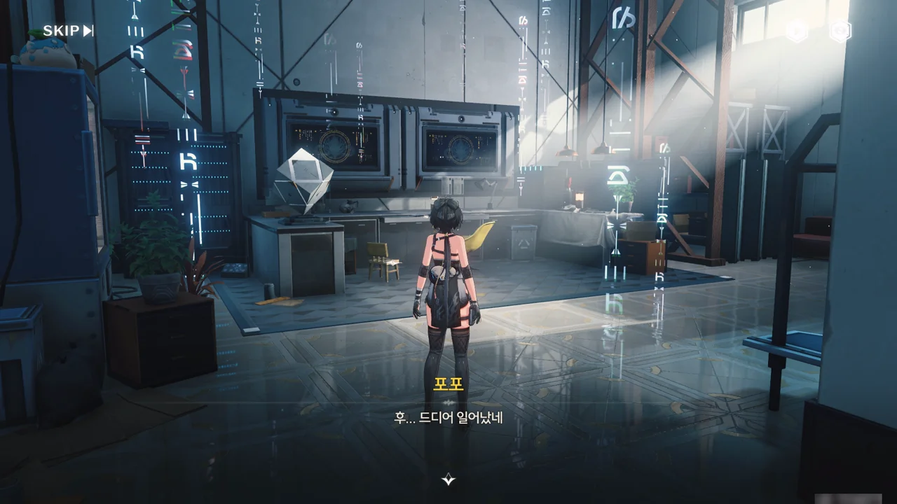





의 안에 들어오니 낯이 익은 공간이 반겨준다. 여기, 상리요의 작업실이잖아.

대체 무엇 때문에 상리요와 갈라진 건지 모르겠지만, 일단 앞으로 나아가는 수밖에 없다.



일기 하나와 잡지 인터뷰 기사 하나를 발견했다. 일기의 주인은 상리요로 보이고, 기사의 면담자는 상리요의 아버지로 보인다.

> 방에서 나와 막막함을 느낄 때
{.bq}

이 언급으로 보아, 어릴 적 상리요는 방 바깥으로 잘 나가지 않는 소극적인 성격이었던 것으로 추측된다.

상리요의 어머니, 상리효는 금주화서연구원 의료과 수석 연구원으로 약 20년 전 유행한 '피열' 백신을 개발한 사람이라 기억하고 있다. 자신과 아들, 상리요를 백신 임상 실험체로 쓸 정도로 절박한 상황이었지.

상리요의 아버지에 대해서는 아는 것이 별로 없는데, 인터뷰 기사를 보면 연구원이거나 최소 과학에 종사하는 사람인 것 같다.

























상리요와 파스칼이 처음 만난 건 파스칼이 친구들과 놀다 상리요네 집 문에 실수로 콩주머니를 던진 일 때문이었다. 파스칼과 모디 --- 호환 광산에 주재 중인 연구원 --- 이 친구 사이였다는 건 제법 의외의 정보이다. '서안'이 누구인지는 잘 모르지만, 어쩌면 나중에 등장할지도 모르겠네.

어릴 적 파스칼의 친화력은 대단했던 것 같다. 처음 만난 사람에게 대장 자리를 주려 하거나, 같이 달맞이 야시장에 가자고 하는 걸 보면 말이다.

어릴 적 상리요는 1년 치 수업을 고작 1주일 만에 전부 듣거나, 백 년 동안 풀리지 않은 난제를 풀어낼 정도로 천재였다고 한다.

상리요의 아버지는 발명가였으며, 상리요가 어릴 적 실종되었다고 한다. 그래서 상리요 아버지에 대한 정보가 적었던 거구나.



명조 세계관에서의 '주파수'는 일종의 무안단물, 데우스 엑스 마키나와 같은 취급이라, 나는 소노라에서 본 것이 100% 진실이라고 도저히 생각할 수 없다. 설정의 개연성 자체는 충분하지만, 내게 있어 핍진성이 떨어진다고 해야 할까...

그래서 소노라에서 본 것은 아무래도 '진실에 기반했으나 100% 진실은 아닌' 무언가로밖에 보이지 않는다.



마지막에 상리요가 다른 아이들을 쫓아간 걸 보면, 상리요와 파스칼이 어울리기 시작한 건 이때가 처음이었던 것으로 보인다.

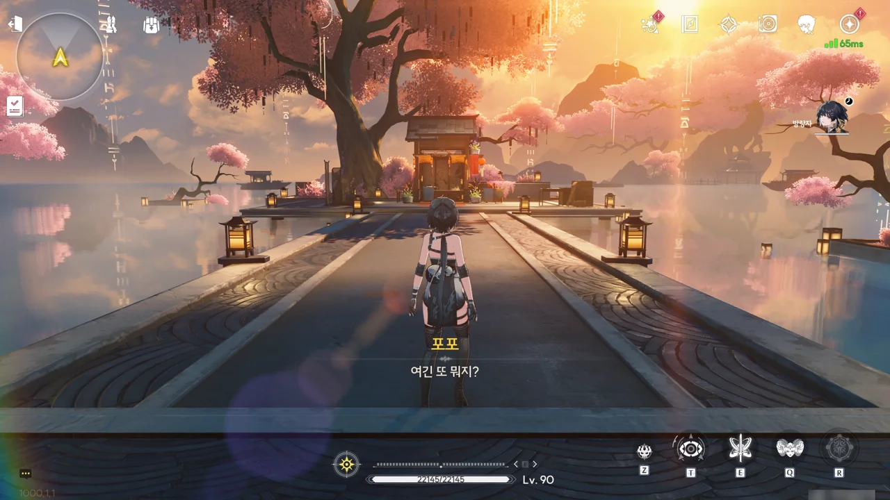



문 밖으로 나가자, 이상한 공간에 도착했다. 달맞이 축제 장소의 일부 같은데...







방랑자가 여태껏 해결한 소원의 '숨은 본심'과 함께 다른 두 사람의 '본심'이 적혀 있다.

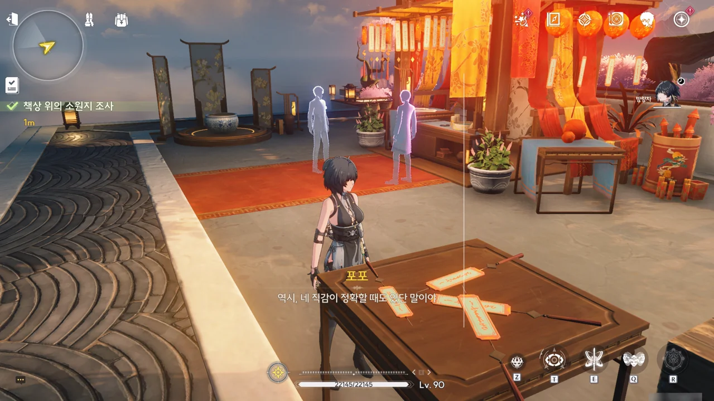

두 사람의 '본심'을 확인하자, 달맞이 축제 노점 앞에 두 사람의 환영이 나타났다.

























시험을 언급한 것으로 보아 학창 시절 때의 상리요와 파스칼의 모습으로 보이지만, 연구자라고 하는 걸 보면 일반 연구원 시절의 모습으로 보이기도 한다. 학생이 관측소를 세워 비명 이상 현상을 관찰할 리가 없으니, 아무래도 연구원 시절이라 보는 게 더 합당하겠지만...

파스칼은 이 세상의 궁극적인 해답인 진리를 얻기 위해선 자신이 가진 모든 걸 내놓아야 한다 생각하며, 이를 위해 '자신을 따라오지 못하는', 즉 낙제한 친구들까지 멀리하기 시작했다.  
인간 교류가 편협해지면 외골수라는 말을 듣기 딱 좋아질 텐데, 그것마저도 '참새가 봉황의 뜻을 어찌 알랴'라고 무시할 것 같은 성격이다.

상리요는 달나무집에서 아버지가 설계한 기관을 발견하고 아버지가 여태껏 몰래 사람들의 소원을 이뤄주던 「달나무집 뒤에 숨은 영웅」이었음을 깨달았다. 아버지가 했던 것처럼 자신 역시 사람들의 소원을 이뤄주고 있지만, 정작 자신이 정말 하고 싶은 일이 무엇인지는 알지 못한다.

뭐랄까, 꽤 복잡한 일이네. 그나저나 파스칼이 하는 말을 들어보면, 분명 나중에 한번 크게 일을 벌일 것만 같단 말이지...









> | | |
> |:--|:--|
> | 쪼꼬미 | 그럼 나도 방랑자와 연결고리가 있는 거네! |
> | 방랑자 | 넌 나한테 붙어있는 거잖아. 고리보다는 귀신이 더 맞는 것 같은데. |
> | 쪼꼬미 | 귀신? 귀신같이 척하면 척하는 사이라는 건가? |
> {_borderless=true,_thead=false}

아 ㅋㅋㅋ 이런 만담 너무 좋다! ㅋㅋㅋ

이 소노라의 주인이 대체 누구길래, 상리요가 간 길로만 따라갈 수 있는 건지 궁금하긴 하다. 아스칼이 모았던 이상 데이터에서 만들어진 소노라이니, 그 주인은 상리요일 수가 없을 텐데...

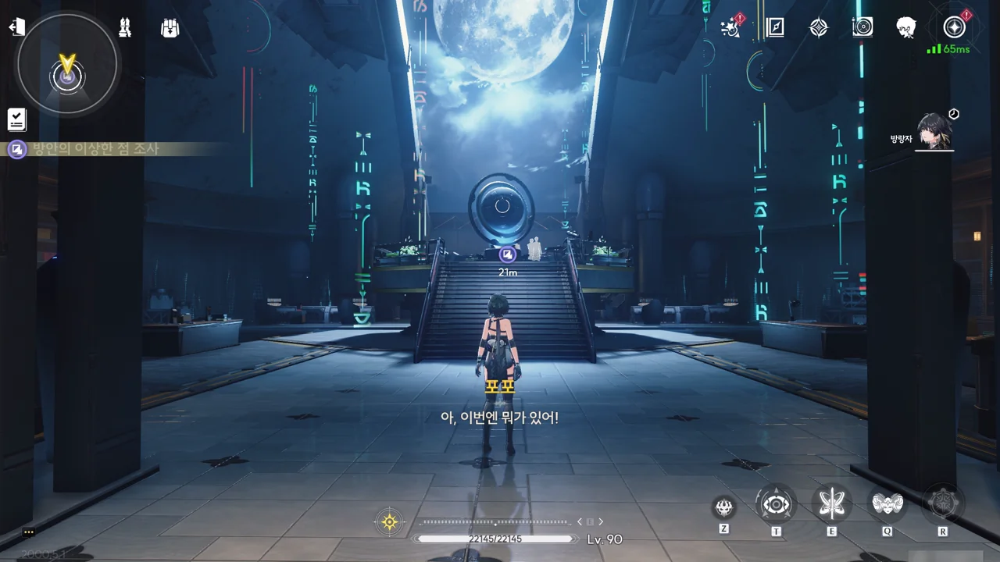

이번엔 뭔가 연구소 같은 장소에 도착했다.







파스칼이 언급했던, 비명 이상 현상 중 하나인 무음구역을 예측하고 분석하기 위한 실험으로 보인다. 일지의 주인은 파스칼로 보이고.







비명 이상 현상을 분석할 수 있을 거라는 처음 기대와 달리, 변화무쌍하게 변화하는 무음구역 때문에 기존의 모든 이론이 박살 난 상황.







급기야는 데이터 분석 대신 '모든 것이 무의미하기 때문이다'라는 절망적인 의견까지 적을 정도로 모든 연구원이 탈력 상태에 빠졌다.

결국 무음구역 연구에서 탈퇴하는 연구원이 점차 늘어남에 따라 무음구역 연구는 중단될 수밖에 없었다.

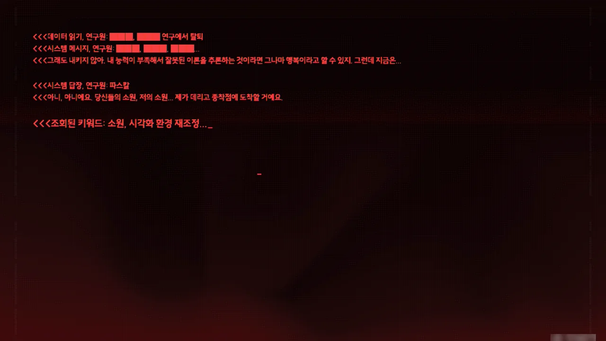

다만 파스칼은 끝까지 포기하지 않고 무언가를 이루어내려 했던 것으로 보인다.

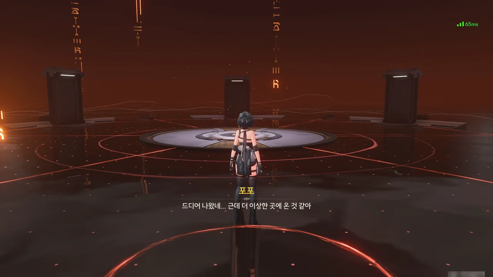

이번엔 다섯 개의 문이 있는 공간에 도착했다.

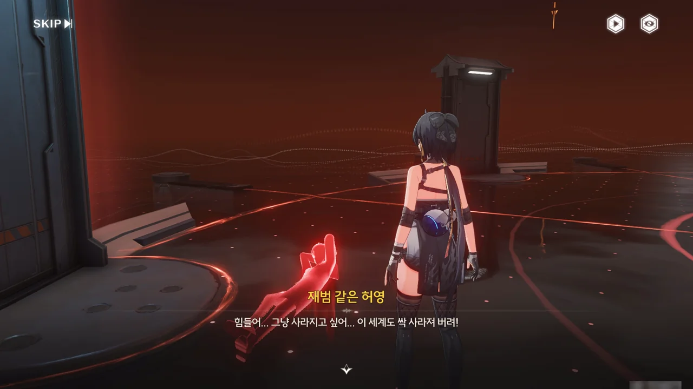



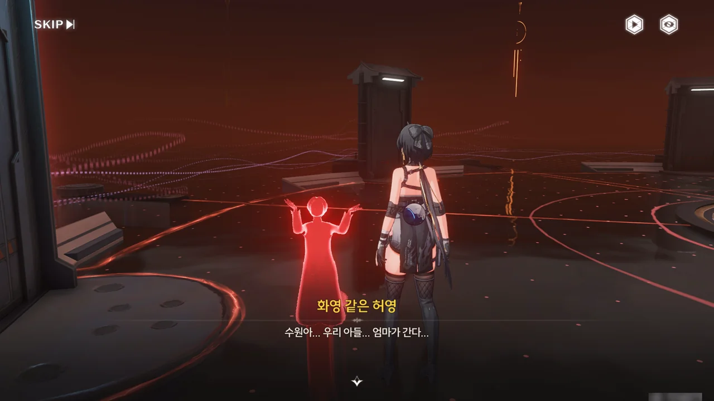







방랑자가 지금껏 해결해 온 소원의 부정적인 면이 드러나있다.

재범과 화영은 자기 파괴적 면모가 강해졌고, 지만은 세계를 위험에 빠트려서라도 영웅이 되겠다고 외치고 있다. 내가 걱정했던 게 바로 저거였는데.

곰곰이 생각해 보면, 저것 역시 그들의 '소원'이다. 도미노를 어느 쪽으로 밀어 넘어트릴 거냐의 차이인 거다.

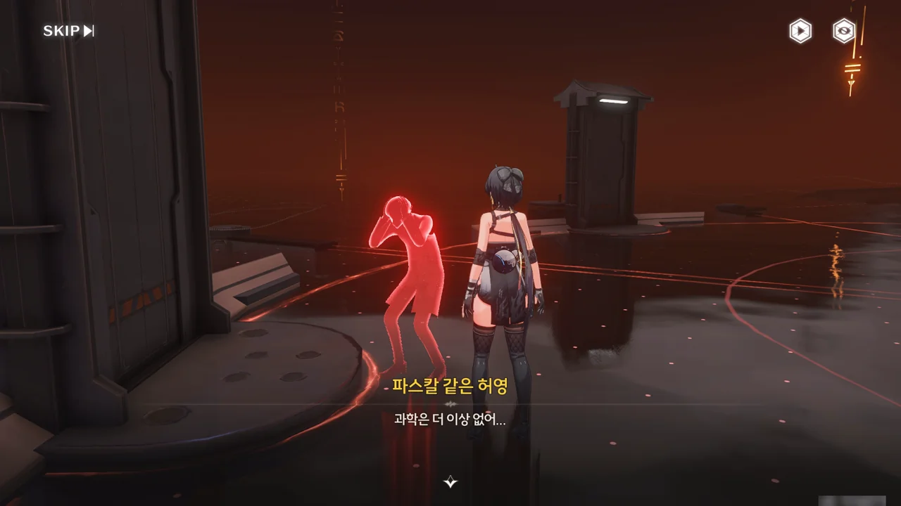









소원의 부정적인 면이 부각되는 이 공간 특성상, 무음구역을 연구하기 위해 고의로 무음구역을 만든 것으로 보이는 파스칼의 모습은 실제 있었던 일이 아닐 것이다. 아마 진짜 소원은 '무음구역의 법칙을 알고 싶다' 정도겠지.

파스칼이 비명 이상 현상으로 세상을 떠났다는 상리요의 말과, 가까이 오지 말라는 파스칼의 비명을 보았을 때, 파스칼은 무음구역에 나타난 잔상에 목숨을 잃은 게 아닐까 생각된다.

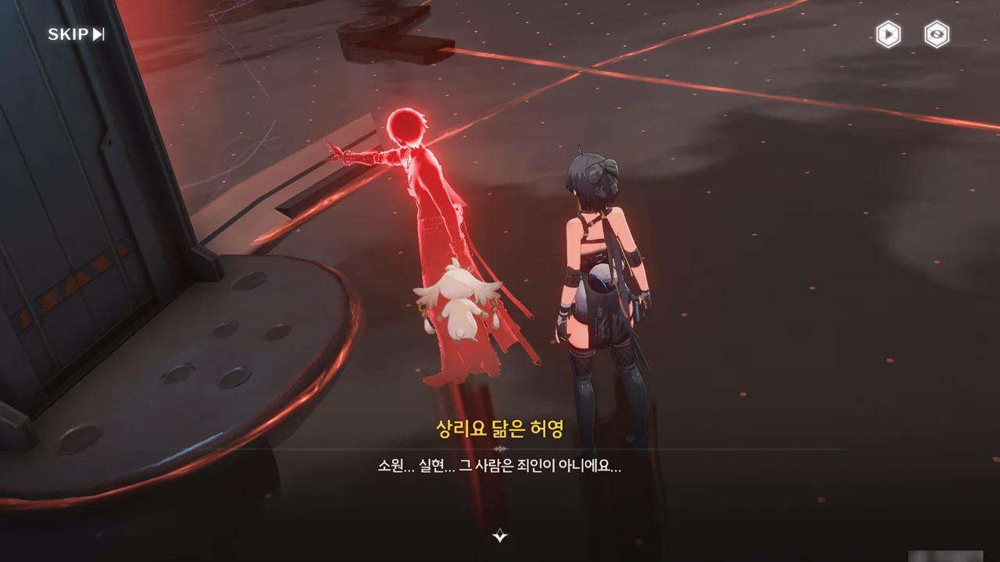







상리요의 허영이 마치 파스칼의 허영이 했던 말처럼 비명 이상 현상을 재현하려는 모습을 보이는 것과 달리, 문 너머에서 들려오는 상리요의 목소리는 파스칼의 소원을 왜곡한다면 가만두지 않겠다고 외치고 있다.

거 봐. 내 말이 맞지?





어허. 예로부터 브루트 포스는 정확도 100%를 자랑하는 알고리즘이었다고. 고르디우스의 매듭도 칼로 자르면 풀 수 있잖아?





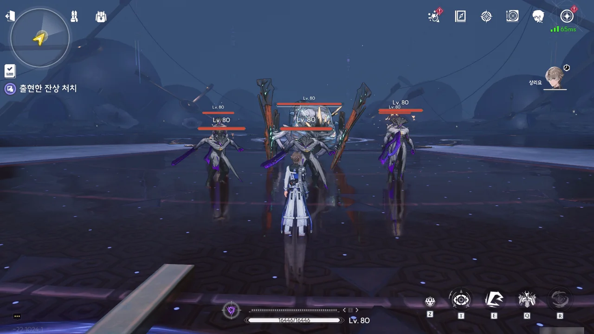

갑자기 상리요의 시점으로 전환되었다.

마주 보고 대화하자니까 대뜸 잔상부터 꺼내드는 _파스칼_ 인성.





왜 이런 스토리에서 나오는 무음구역이나 소노라 보스는 항상 조립식 로봇인 걸까? 그게 설정상 제일 잘 들어맞는 보스인 건 맞지만, 항상 조립식 로봇만 보니 너무 식상하다.

아무튼, 저게 이 소노라의 주인인 것 같다. 파스칼의 망집을 중심으로 뭉친 주파수 덩어리 말이다.











상리요가 혼자서 보스를 때려잡다 위기에 빠졌을 때, 방랑자가 공간을 찢고 나타나 상리요를 도와준다.





상리요가 미리 잘 깎아 둔 보스의 체력을 방랑자와 상리요가 함께 잘 요리한다.











마지막은 상리요와 방랑자의 멋들어진 합동 공격으로 마무리.





조립식 로봇을 쓰러트리고 나니, 파스칼의 유령이 나타났다.

비명 이상 현상에 삼켜지고 남은 주파수라고 하니, 저건 비명 이상 현상에 영향을 받지 않은 파스칼의 순수한 주파수일 거다. 그러면 유령 맞네.





























파스칼은 무음구역 연구 프로젝트에서 탈퇴함과 동시에 금주화서연구원 역시 그만두었다. 연구원을 그만두며 챙겨 온 실험 설비와 연구 자료를 기반으로 혼자 연구를 계속한 끝에 무음구역의 특수 주파수와 무음구역 발생 위치를 예측할 수 있는 실험 장치를 만들어낸 파스칼은 성공의 기쁨에 취해 무작정 실험 장치가 예견한 무음구역 발생 위치로 달려갔으나, 무음구역의 발생 시간과 규모 예측에 실패한 탓에 실험 장치와 함께 비명 이상 현상에 삼켜졌다.

자신을 구하기 위해 달려온 상리요의 모습을 마지막으로 자신은 비명 이상 현상을 일으킨 죄인이 될 거라 생각한 파스칼이었지만, 상리요가 밝힌 이후의 일은 정반대였다.

비록 파스칼이 만든 실험 장치를 재현하지는 못했지만, 파스칼이 남긴 연구 노트에 적힌, 무음구역 특수 주파수를 산출해 내는 「파스칼 주파수 스펙트럼」 이론은 현재 무음구역을 연구하는 모든 연구소가 기본 이론으로 쓸 만큼 그 정확성을 입증해 냈다. 그와 함께 파스칼이 죽을 당시 정확히 어떤 일이 있었는지 밝혀졌기에, 파스칼은 비명 이상 현상을 일으킨 죄인이 아닌, 비명 이상 현상을 연구하다 안타깝게 사망한 연구원으로 남게 되었다.





소원나무의 전설은 진짜였다는 말을 남기고 파스칼이 성불한다.







마지막 소원, 파스칼의 소원 역시 해결되었다. 그와 함께 상리요의 *소원* 역시 해결된 것 같고.
