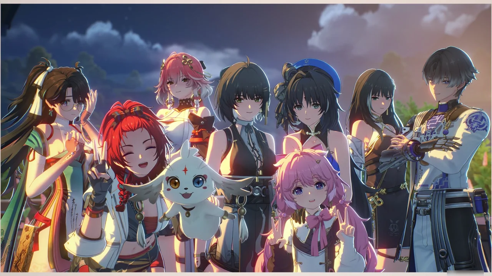





무사히 에서 빠져나왔다.

친구와의 일도 있고, 아스칼의 검사도 필요하니, 잠시 자리를 비켜주기로 했다.











드디어 화해한 재범과 국진은 새로운 작업실에서 에코 연구 프로젝트를 다시 시작했다. 덕분에 발 디딜 틈도 없이 물건이 작업실에 잔뜩 쌓여 있다고 한다.

둘이 달맞이 야시장에 나온 건 에코가 나오는 행사여서도 있지만, 다른 연구원에게 프로젝트 참여를 권유하기 위함도 있다. 물론 그러면서 겸사겸사 놀기도 할 거고.

















달맞이 야시장에 도착해 방랑자를 기다리던 아이들은 방랑자가 소노라로 사라지는 걸 목격했다. 자리를 지키고 있던 상리로부터 걱정하지 말라는 말을 들었지만, 영웅극도 아닌데 멀쩡한 사람이 갑자기 없어질 리 없다고 생각한 아이들은 서로 역할을 나눠 자리를 지키기로 했다.

만약 방랑자가 위험한 상황에 빠진 것 같으면, 달리기가 빠른 지만과 한묵이 언덕 아래로 달려가 어른들을 불러오고, 소배는 자리를 계속 지키며 상황을 보는 것이다.

여전히 대영웅이 되려면 공명 능력이 필요하다고 생각하는 지만에게 방랑자는 모두가 이미 대영웅의 자질을 모두 갖추었다고 이야기해 준다. 제일 좋아하는 달맞이 야시장 영웅극을 놓치더라도 다른 사람을 도우려는 마음가짐과 결단력을 가졌으며, 모두가 힘을 모아 각자 잘할 수 있는 역할을 맡았으니 말이다. 영웅이 별 건가. 이런 게 영웅이지.











화영 역시 아들에게 가르침을 받은 병사들이 만든, 아들이 군영에서 배운 달맞이 축제 간식을 함께 먹으며 아들이 남긴 것을 보고 느끼고 있다.

비록 아들은 이미 세상을 뜨고 없지만, 아들의 가르침을 받은 병사들과 추억을 함께 나눌 수 있으니, 이전처럼 외롭지는 않겠지.









아, 그러고 보니 절지에게 '효성'을 찾아달라고 부탁했었지. '효성'의 일은 잘 끝났으니, 이제는 찾아다닐 필요가 없다.

절지는 도원향이 한눈에 내려다 보이는 곳에서 그림을 그리고 있었다. 자신이 붓을 들었을 때처럼, 사람들이 즐거워하는 모습을 보면 마음이 따뜻해진다며, 그 모습을 그림에 담고 싶어 한다.

절지는 좀 더 자신감을 가졌으면 좋겠는데... 쉽진 않겠지.







상리요가 달맞이 야시장에서 추억을 간직하는 데 도움이 될 거라며, 여태껏 자신의 일을 도와준 것에 대한 감사 인사로 캠코더를 건네주었다.

아스칼에 아직 특수 주파수가 남아있지만, 소노라의 영향 때문인지 아닌지 확신할 수 없어 잠깐 넣어두었다고 한다.





















상리요의 말처럼, 사람들은 자신을 도와달라는 소원을 적어 달나무집에 보냈다. 방랑자나 상리요가 나서지 않았다면 소노라 안에서 본 것처럼 최악의 상황이 일어났을지도 모른다.

상리요는 진리를 위해 모든 것을 내던진 아버지 --- 그리고 어쩌면 파스칼 ---, 남을 위해 모든 걸 바친 어머니의 그림자를 따라잡기를 갈망했다. 생전 뚜렷한 목표를 보여준 부모님이 없는 지금, 상리요는 그 두 가지 목표의 균형을 맞추는 것이 자신에게 남겨진 숙제라고 생각하고 있다.

상리요에게 가장 큰 영향을 끼친 건 아무래도 파스칼일 것이다. 상리요를 밖으로 데리고 나와 그의 아버지가 달나무집의 숨은 영웅이었음을 알게 되는 계기를 만든 것이 파스칼이며, 상리요 역시 속으로는 파스칼이 그랬던 것처럼 세상과의 연결고리를 끊고 진리만을 추구하고 싶어 했으니 말이다. 상리요가 그러지 않았던 건 부모님의 모습을 포함한 세상과의 연결고리 때문이었다.

그렇기에 상리요는 자신 역시 언젠가 파스칼처럼 세상과의 인연을 끊고 진리만을 목표로 달려 나갈 수 있을지도 모른다고 고백한다. 그런 그에게 방랑자는 설사 그런 일이 일어난다 할지라도, 누군가는 상리요가 돌아오기를 기다릴 거라고 말해준다.

상리요에게 진실을 알려주려는 파스칼의 마음과 파스칼의 명예를 위해 포기하지 않은 상리요의 마음이 합쳐져 소노라의 열쇠가 되었던 것처럼, 사람 사이의 연결고리는 쉬이 끊어지지 않을 것이다.











치샤가 방랑자를 마중 나왔다. 방랑자는 달맞이 축제는 다 같이 모이는 날이니, 상리요 역시 예외는 아니라며 상리요를 같이 데리고 간다.





오, 이게 그 '용의 춤'인 건가?

이유는 잘 모르겠지만, 서릿땅거북의 춤은 게임 내외로 선풍적인 인기를 자랑하나 보다. 명조 관련 글을 둘러볼 때도 제일 먼저 본 것이 엘리베이터 안에서 서릿땅거북 에코를 발동하면 엘리베이터 바닥을 뚫고 떨어지는 버그 영상이었고, 달맞이 야시장에서도 서릿땅거북의 춤을 사람들이 유심히 보고 있다.









> 평소에도 설지가 사진처럼 웃었으면 좋겠다

설지의 원래 이름은 '백지(白芷)'인데, 어째 로컬라이징된 이름인 '설지' 이름에 더 걸맞은 모습을 보여주고 있다. 무표정 얼음미녀 설지!









그림을 그리다 실수로 붓을 놓쳐 허둥대는 절지, 귀엽다!



자신만의 방식으로 축제를 즐기는 걸까, 장리는 축제에 참여하지 않고 그저 바라만 보고 있다.

이건 장리를 영입하는 경영 일화를 보고 와야 대충 어떤 느낌인지 알 수 있는 거라, 여기서 더 뭐라 표현할 방법이 없다.





불꽃놀이 하는 앙코가 너무 귀엽다. 쪼꼬미 저 녀석은... 앙코랑 정신 연령이 비슷한 거로 하자.

















달맞이 야시장의 피날레, 용의 춤이 시작된다. 이거, 상리요가 「용의 뿔」 홀로그램을 조종하는 거였구나.







오전에 설지가 금희를 본 것 같다고 말한 게 바로 이걸 말하는 거였나.







홀로그램이 밝게 빛나는 달을 배경으로 폭죽으로 화해 터지는 것으로 용의 춤이 마무리되었다.

저 구름이 모양 폭죽, 분명 앙코가 만든 거겠지...





축제에 참가하지 못하고 최전선에서 열심히 부하들을 훈련하던 기염 역시 밝게 터지는 폭죽을 보고 슬쩍 웃으며 훈련을 마무리한다.







모두와 함께 기념사진을 찍는 것으로 '달빛의 소원' 스토리는 일단 마무리를 찍는다.

사실 경영 일화와 에필로그가 남긴 했는데, 이 정도면 엔딩이라 불러도 손색이 없을 거다.
