이번 이벤트는 기본적으로 두 부분으로 이루어져 있다. '가게 제작'과 '소원 의뢰'인데, 가게를 제작하면 열리는 스토리나 메인 스토리를 진행하면 '소원 의뢰'에서 쓸 수 있는 캐릭터를 해금할 수 있다. 캐릭터마다 특화 스탯이 다르기 때문에, 캐릭터를 최대한 확보해 육성해야 의뢰에서 '가게 제작' 등에 쓸 수 있는 재화를 더 많이 얻을 수 있다.

아쉽게도 경영 일화 스토리에는 더빙이 없다. 여기까지 더빙이 있었으면 정말 좋았을 것 같은데, 아쉽다.

# 산화 - 잠시의 여유{id="sanhua"}

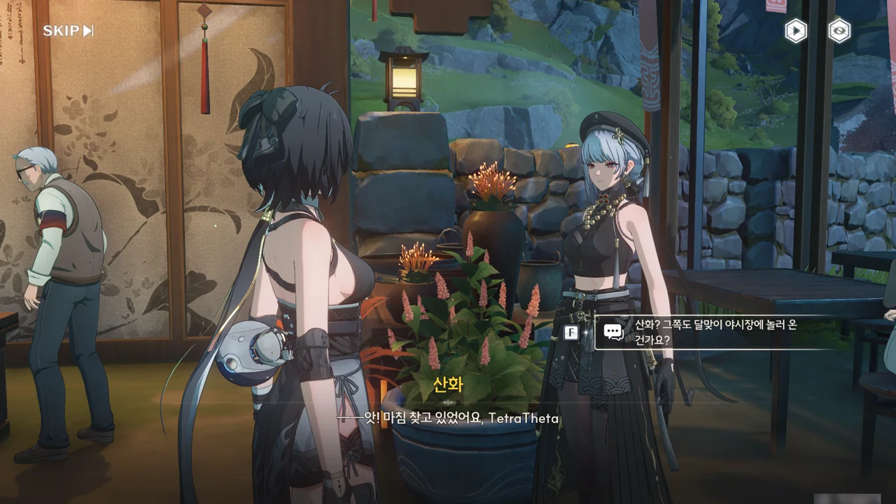





변정의 업무를 전부 혼자 도맡아 처리하는 산화를 걱정한 금희가 방랑자와 긴히 의논할 일이 있으니 편지를 전달해 달라는 핑계를 대며 산화를 방랑자에게 맡겼다.

... 산화는 혹시 워커홀릭인 걸까?





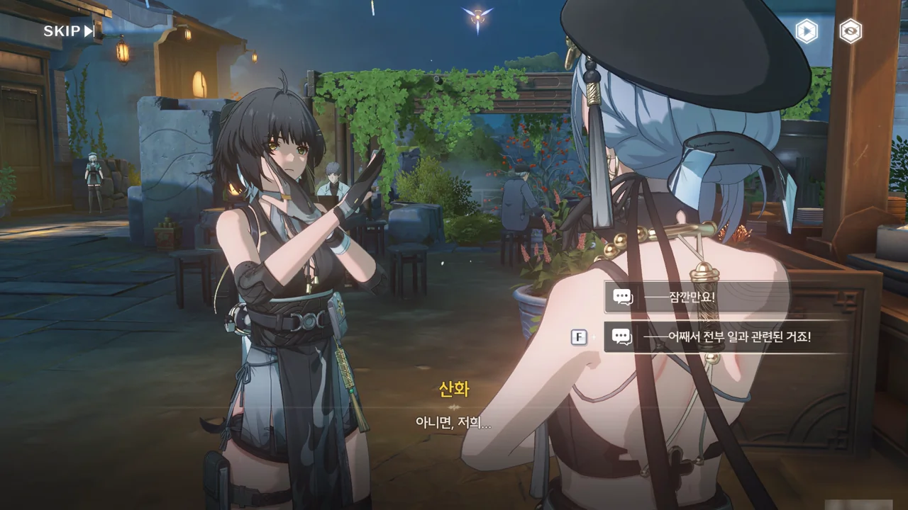

금희의 부탁대로, 산화에게 뭔가 하고 싶은 게 있냐고 물어보자 주변 순찰이나 관람객 동향 조사 같은 일 이야기만 꺼낸다. 아니, 정말 워커홀릭이었던 거야?

두 팔을 들어 크게 X자를 그리는 방랑자가 몹시 귀엽다.







산화는 계란과자와 비슷하지만 특별한 속과 틀을 사용하는 「단란 과자」를 만들어보고 싶어 한다. 단란 과자를 만드는 걸 잠깐 본 것만으로도 단란 과자 요리법을 대충 알 것 같다고 말하는 산화. 이 정도는 되어야 변정의 그 많은 업무를 혼자 감당할 수 있는 건가...

그나저나 단란 과자의 맛이 어떨까 조금 궁금해진다. 계란과자와 비슷하다고 했으니, 맛도 어느 정도 비슷할 거 아냐.





산화가 「단란 과자」에 들어가는 재료 중 하나인 연자육 대신 울음새 늪에서 자라는 「쌍둥이 연자육」을 넣으면 더 맛있는 단란 과자가 될 것 같다고 말한다.

울음새 늪은 잔상이 돌아다니는 위험한 곳이지만, 방랑자나 산화는 잔상 정도는 수월하게 잡을 수 있으니 아무런 문제가 없다.



잔상이 있었는데요. 없었습니다.











연자육이 뭔가 했는데, 찾아보니 껍질 깐 연꽃 씨앗이라고 한다. 그래서 저게 연꽃처럼 생겼던 거구나.

방랑자가 일부러 "일 외에는요?"라고 물어야 평소 화주를 마시거나 이야기를 즐겨 듣는다는 대답이 나올 정도면, 산회의 머릿속은 이미 일로 가득 차있다고 할 수 있다. 아니, 화주를 마신다고 할 때에도 호위업무에 지장을 줄 수 있으니 좋은 습관이 아니라고 하잖아...

금희가 왜 방랑자에게 산화를 맡겼는지 알 것 같다.

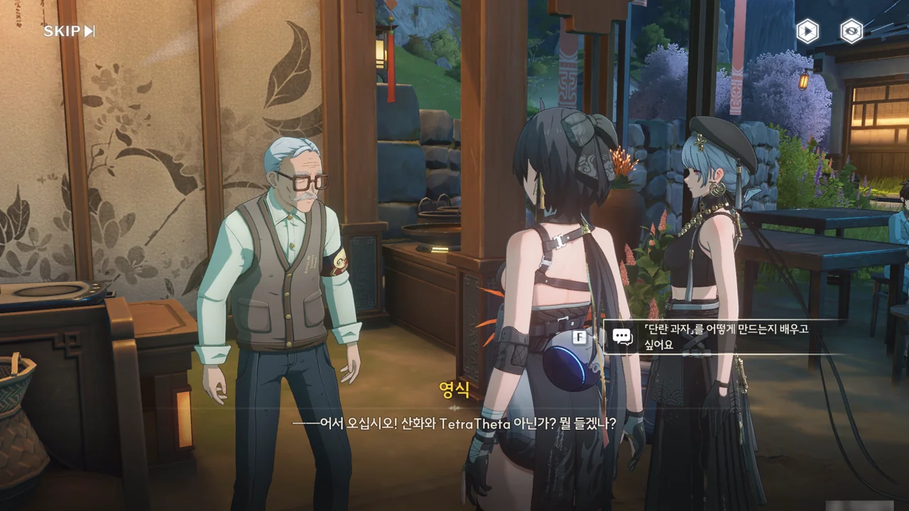







「모두의 가게」를 운영하는 영식에게 「단란 과자」 만드는 법을 배우고 싶다고 하자, 제대로 된 과자를 만들려면 적어도 일 년 반은 걸릴 거라고 겁부터 준다.

하지만 우리에겐 초엘리트 산화가 있으니 어떻게든 될 것이다.

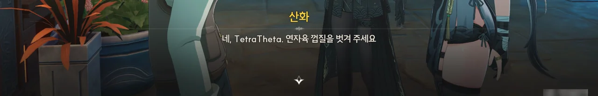





처음 산화가 「쌍둥이 연자육」을 넣으면 과자가 더 맛있어질 거라고 말했을 때, 나는 단순히 고급 재료를 쓰면 맛이 더 좋아지는 정도로 생각했었다. 쌍둥이 연자육을 넣는 요리법이 있을 거라 생각하진 않았다는 말이다.

그런데 영식이 쌍둥이 연자육을 알아보는 걸 보면, 단란 과자를 만들 때 쌍둥이 연자육을 넣는 요리법 역시 있었나 보다.



... 아니 잠깐 본 것만으로도 이게 가능하다고? 제대로 된 과자를 만들려면 일 년 반이나 걸릴 거라고 말한 영식이 보면 굉장히 뻘쭘해하겠네...

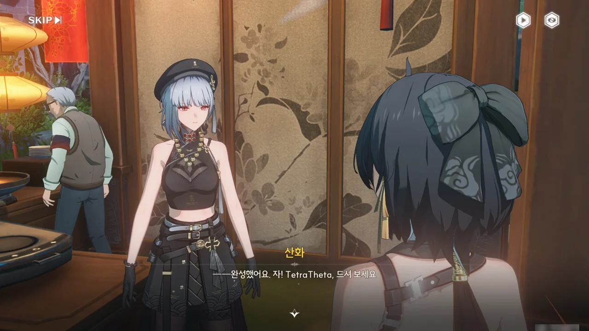







기껏 만든 과자의 절반은 방랑자에게 주고, 나머지 절반은 금희에게 주겠다는 산화. 이래서는 산화가 달맞이 축제를 즐길 수 있게 해 달라는 금희의 부탁을 제대로 들어줄 수가 없는데...

결국 금희가 보낸 편지 내용을 산화에게 말할 수밖에 없었다.

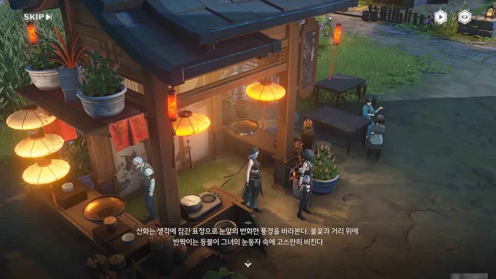





"일이 인생의 전부는 아니잖아요"라는 방랑자의 말을 들은 산화는 달맞이 야시장의 모습을 바라보며 잠시 생각에 빠졌다.

잠시 생각한 끝에, 산화는 어차피 변정에 급한 일은 없을 테니, 소중한 사람과 함께 지금의 즐거움을 마음껏 누리라는 달맞이 축제의 의미에 따라 달맞이 시장을 계속 즐기겠다고 답한다.

지독한 워커홀릭이자 일밖에 몰랐던 산화가 드디어 워라밸을 깨달았어...!

# 치샤 - 궁극의 총잡이 도전!{id="chixia"}





치샤가 초아의 부탁을 받아, 개인 기록을 경신할 겸 달병 맞히기 게임을 하려 한다. 마침 이번 버전에 새로운 탐색 도구, 「보조기・사격」이 추가되었으니, 이걸 쓰라는 의미겠지?

총알 한 발로 여러 개의 과녁을 맞혔다는 건 관통 혹은 도탄을 활용했다는 의미인데, 어느 쪽이던 대단한 일이다.





마침 이번 축제에는 달병 맞히기 프로들을 위한 초고난도 게임이 준비되어 있다고 한다. 다만 안전 문제 때문에 달맞이 야시장 상가 구역이 아닌 그 근처의 공터에 게임이 설치되었다.

가게에 있는 것과는 차원이 다르다고 하는데, 내가 본 건 필드에 있는 사격 게임이 전부인지라, 과연 그 난이도가 어떨지 조금 기대가 된다.



일단 생긴 건 기존의 사격 게임과 별반 다를 게 없는데...



첫 번째 게임은 매우 쉬웠다. 그냥 드르륵 긁으니까 끝난 것 같은데.



두 번째 게임 역시 이전 것보다 조금 더 어려운 정도에 불과했다.

초아가 야귀군 신병 훈련을 맡았다는 건 그녀의 성격이 꽤 깐깐하다는 의미이다. 그런데 왜 게임 난이도는 쉬운 거지...?

물론 여기에는 게임 외적인 이유가 있다. 캐릭터 영입 스토리 중에 등장한 미니 게임 난이도가 지나치게 높으면 하는 사람 입에서 욕이 절로 나올 테니까. 원래 스토리는 쉽게 쉽게 해야 하는 법이다.





이번 건 조금 어려웠다. 과녁이 잘 안보이더라고. 설마 과녁 가시성도 난이도에 포함인 건가?

아무튼, 모든 도전을 성공적으로 끝마쳤다.

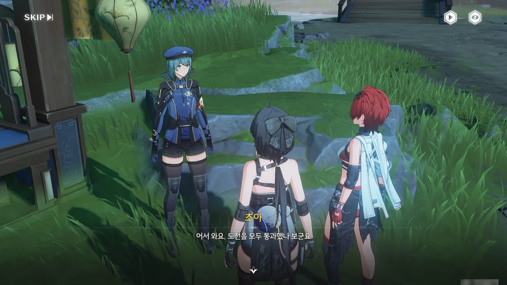







초아가 말하는 '추가 도전'이 정말로 존재하는지에 대해선 잘 기억이 나지 않는다. 최근 들어 명조에 흥미가 적잖게 떨어진 터라, 이벤트를 적당 적당히 플레이했거든.

내가 알기로, 플레이어블 캐릭터는 전부 설정상 강력한 힘을 지닌 공명자이다. 게임 외적으로 보면 약한 캐릭터는 팔아치울 수 없으니 그런 것이고, 게임 내적으로 보면 어떤 캐릭터라도 키우기에 따라 '이 캐릭터가 이런 게 가능했었나?' 수준까지 끌어올릴 수 있기 때문이다.

치샤 역시 예외는 아니다. 잊을만하면 나오는 영상 중 하나가 바로 치샤가 강력한 위력의 탄환을 기관총처럼 퍼부어 보스를 삭제시키는 영상이거든. 대체 어떻게 한 것인진 잘 모르지만, 그걸 보면 치샤는 강력한 공명자임이 틀림없다.

그러니까 치샤가 '나한테는 상대가 안 돼'라고 해도 고개를 끄덕일 수밖에 없다.







초아가 치샤의 훈련법을 야귀군 훈련에 적용시킬 수 있을지도 모른다며 치샤의 훈련 비법을 묻자, 치샤는 '노력과 「영웅이 되고 싶은 마음」'이라고 답한다. 굉장히 치샤다운 대답이었지만, 초아는 이걸 찰떡같이 알아들어 '노력과 동기부여'로 잘 해석했다.

절대 틀린 말은 아니다. 동기부여가 되지 않는다면 실력을 늘릴 이유를 찾지 못해 노력을 하지 않을 것이고, 노력을 하지 않는다면 실력이 늘지 않을 것이니 말이다.





> 오~ 매운 어묵이라... 이름만 들어도 군침이 절로 나오네!

이 대사는 한 번 수정된 대사이다. 원래 대사가 어땠냐고?



이 대사 하나 때문에 모든 커뮤니티가 뒤집어졌다. 정확히는 중국어 원문에 없던 '군침이 싹도노' 밈 부분 때문에. 위 사진은 당연히 누군가가 원본 밈에 합성한 사진이다.

해당 밈의 원본이 '군침이 싹도노'였던 건 맞지만, '군침이 싹도네'라고 바꿔도 될 것을 굳이 원본 그대로 쓰는 바람에 명조 번역팀에 ■■가 있는 게 아니냐는 의혹부터, 케케묵은 밈을 굳이 썼어야 했냐는 비판까지 아주 난리도 아니었다.

하루도 채 되지 않아 번역이 수정되긴 했지만, 그렇지 않아도 지속적으로 비판받아온 번역 품질 때문에 명조의 이미지는 한차례 더 추락했다. 이젠 더 내려갈 곳이 있긴 한 건지 모르겠네.

# 절지 - 이 풍경이 영원히 당신의 마음에 남기를{id="zhezhi"}







정확히 무슨 일이 일어나고 있는 건진 잘 모르겠지만, 아무래도 절지가 달성하기 어려운 그림 의뢰를 받아들인 것 같다.

이번 일은 풍경 자료 조사 때문에 이곳저곳을 돌아다녀야 해서 체력소모가 다른 일에 비해 훨씬 큰데, 절지는 불과 며칠 전만 해도 마감 기한을 지키기 위해 여러 날밤을 새어가며 그림을 그렸다. 그때 고갈된 체력이 벌써 회복되었을 리가 만무한데...

절지는 스스로의 몸을 혹사시켜 가면서까지 일을 하고 싶어 하는 성격인 걸까? 적어도 산화는 머릿속에 온통 일 생각밖에 없어서 그렇지, 제 몸을 망쳐가면서까지 일을 하는 것 같지는 않았는데...

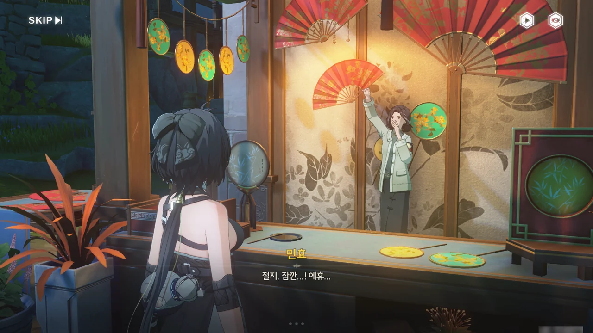





이번 달맞이 야시장에서 부채 가게를 열게 된 민효의 원래 계획은 친분이 있는 여러 화가들에게 부채 그림을 부탁하는 것이었다. 하지만 원래 부탁하려던 화가들 모두가 일정이 밀린 탓에 민효에게 그림을 그려줄 수 없게 되어 난감한 터에 절지가 나타나 그 모든 그림들을 혼자 도맡았다고 한다.

아까 보았듯이, 민효는 절지를 말리려 했지만 절지가 워낙 완고한 터라 절지를 말리지 못했다. 그렇기에 민효는 절지가 무리해서 그림을 그리다 몸을 망칠까 걱정하고 있다.







금주성 최고의 심부름꾼 방랑자는 절지를 도와 풍경 자료 사진을 대신 찍어주기로 했다. 방랑자가 타종 계곡 폭포와 금주성 풍경을 찍어오면 민효가 그걸 절지에게 건네주는 것이다.

갑자기 든 생각이 하나 있다. 절지가 밤을 새워 가며 의뢰를 완수한 게 고작 며칠 전이라고 했다. 그럼 '효성'을 찾을 때 만난 절지는 의뢰받은 그림을 그리고 있었던 걸까?



타종 계곡의 폭포 사진을 찍었다.



금주성 사진도 찍었다.



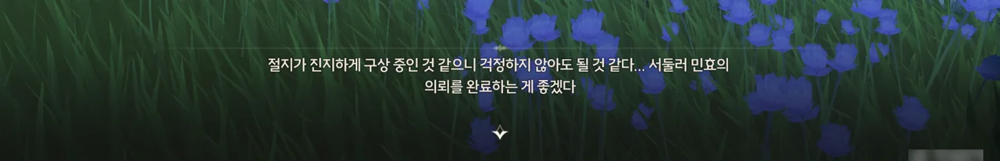

방랑자가 뒤에 있는지도 모른 채 절지가 엄지와 검지로 프레임을 만들어가며 어떤 구도로 그림을 그리는 게 좋을지 열심히 고민하고 있다.

... 굳이 방해하지 않는 게 좋을 것 같다.



어라, 눈치챈 건가. 하지만 여러 밤을 새운 탓인지 판단력이 흐려져, 방금 자신의 뒤에 있던 사람이 저번에 만난 방랑자인지조차 알지 못하고 있다.

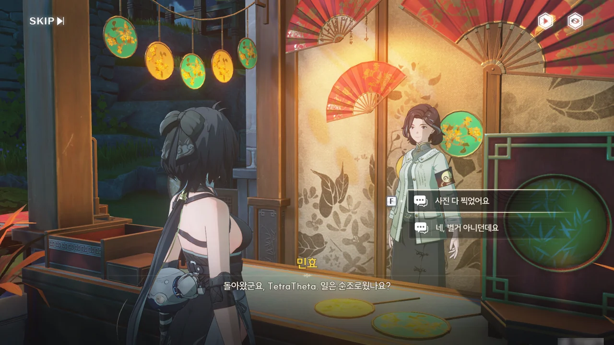



민효에게 풍경 사진을 건네주었다. 이 정도면 절지가 풍경 자료를 수집하느라 체력과 시간을 낭비하지 않아도 될 것이다.









... 이상하네. 절지와 민효의 대화를 들어보면 절지는 사진을 찍어준 게 방랑자임을 눈치채지 못한 것 같은데, 어째서 달나무집에 합류한 거지?

아무튼 절지가 매우 귀여웠다. 그럼 된 거지, 뭐.

# 감심 - 비전 점술{id="jianxin"}

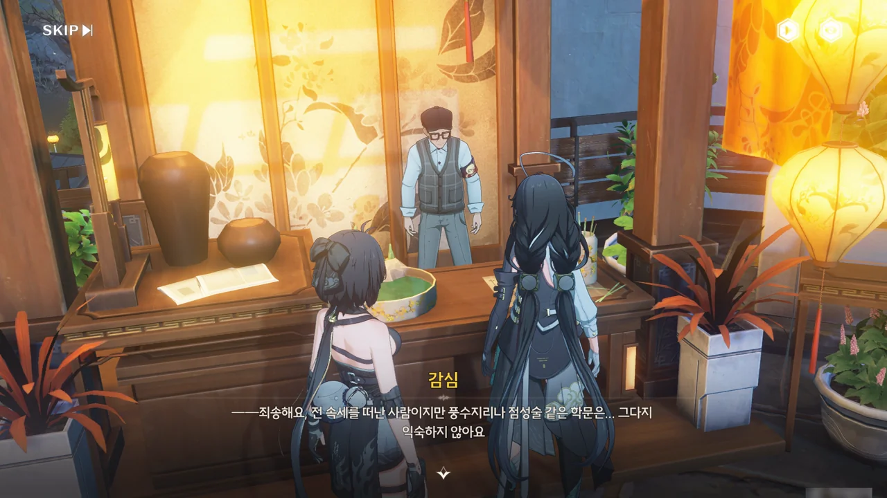





감심이 점집 앞에서 점집을 운영하고 있는 동현 할아버지와 대화 중이다. 보아하니 할아버지가 도사인 감심에게 제비 뽑기 점괘 풀이를 부탁한 모양이다.

> 게다가 이런 일은 기연과 관련이 있으니 억지로 강요할 수 없네요.

... 번역이 조금 이상한 거겠지? 감심의 저 말만 보면 오히려 감심이 동현 할아버지에게 무언가 부탁한 모양이 되잖아.









오래전, 금주에 용하기로 소문난 떠돌이 점성술사가 찾아왔다. 그가 치던 점은 도자기 그릇에 채운 물에 비친 달의 모양을 보며 길흉을 점치는 달점이었는데, 점을 칠 때면 그릇 안의 물이 황금빛으로 빛나고 비친 달빛 역시 선계처럼 아련하게 빛났다고 한다.

하지만 금주에서 기인을 만나 대화를 나눈 후 자신의 부족함을 깨달아 점성술에서 손을 씻기로 결심한 점성술사는 인연이 있는 사람이 언젠가 그릇을 다시 찾아주길 바라며 그릇을 어딘가에 숨긴 후, 편지 한 통과 점괘 한 개를 남기고 금주를 떠났다고 한다.

점성술사가 남긴 그릇을 동현이 찾고 싶어 하는 건 그 그릇에 영험한 기운이 깃들어 있을 테니, 가게에 두면 믿음직스러울 것 같다는 이유 때문이었다. 현실적인 이유 같으면서도 비현실적인 이유네.







점성술사가 남긴 점괘는 이러했다.

> 자아를 찾으려면 전망대에 올라 호수를 보라. 어린아이의 마음으로, 의심 없이 행하라.
{.bq}

'호수가 내려다 보이는 전망대'를 의미하는 힌트임은 알겠는데... 거기서 대체 뭘 해야 그릇의 위치를 알 수 있다는 걸까? '어린아이의 마음으로'가 그 단서임은 알겠는데...



'어린아이의 마음으로'를 그대로 어린아이를 찾는 것으로 해석한 방랑자. 어린아이의 마음은 어린아이가 제일 잘 알 테니, 합리적인 결론이다.

그런데 이건 점괘잖아. 여기 붙여도 저기 붙여도 전부 말이 되는 게 바로 점괘 아냐? 이래도 되는 걸까...













전망대에서 호수를 내려다보고 있는 소녀에게 근처에서 이상한 물건을 본 적 없냐고 물어보자, 고양이들이 모여 꼼짝도 하지 않는 곳이 있다는 정보를 얻었다.

햇볕이 잘 드는 곳이 아닌 한, 고양이가 자발적으로 모일 리가 없다. 거기에 뭔가 있는 게 틀림없네.







나무 상자 속에 고양이들이 좋아하면서도 오랫동안 썩지 않는 약재를 넣어두었다.

... 그래서 '어린아이의 마음으로'라고 한 건가. 어른들은 고양이들이 모여있는 걸 보고도 '물고기를 잡으려고 그러는 거겠지', '햇볕이 잘 드는 곳이라 그런 거겠지'라고 적당히 넘겨버릴 테니 말이다.

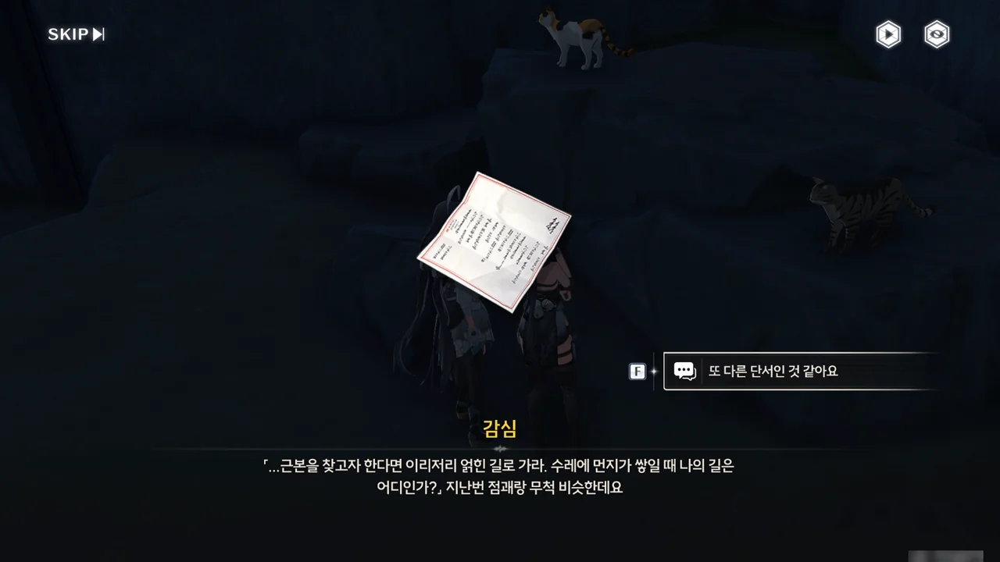



그릇을 곱게 줄 생각은 없었던 모양인지, 또 다른 점괘가 나왔다.

> 근본을 찾고자 한다면 이리저리 얽힌 길로 가라. 수레에 먼지가 쌓일 때 나의 길은 어디인가?
{.bq}

이건 좀 점괘다운 문장이네.

방랑자는 벌써부터 감을 잡은 모양이다. 난 모르겠는데.



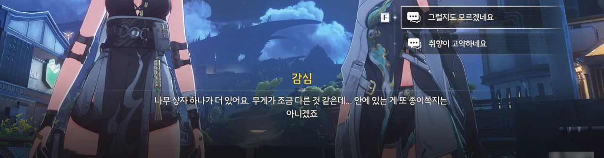

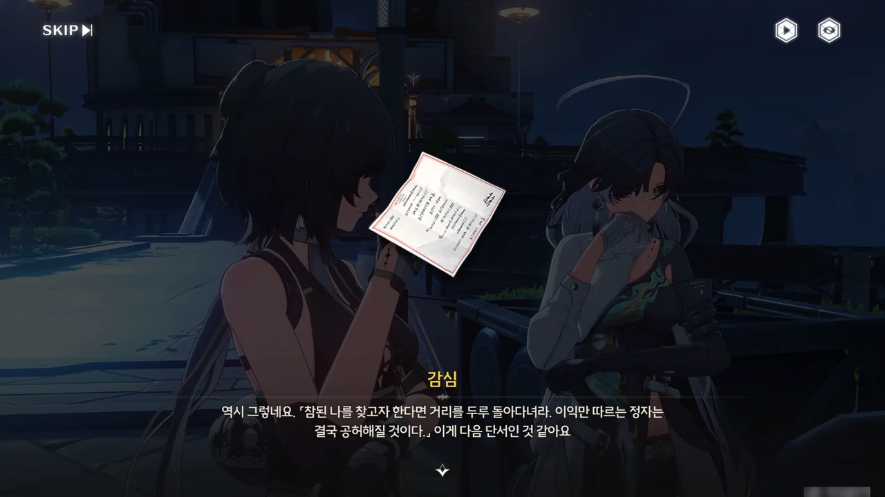

'수레에 먼지가 쌓일 때'를 '오랫동안 유지보수를 하지 않은 낡은 수레'로 해석해 또 다른 나무 상자를 찾아냈지만, 거기에는 또 다른 점괘만이 들어 있었다.

> 참된 나를 찾고자 한다면 거리를 두루 돌아다녀라. 이익만 따르는 정자는 결국 공허해질 것이다.
{.bq}

&nbsp;

음... 어딘가 번역이 잘못된 것 같다.

동현 할아버지는 점성술사가 금주를 떠난 게 '**오래전**'이라고 했다. 방랑자는 수레가 '**몇 년**'동안 버려졌다고 말했다. 점성술사가 이 수레를 서술할 때 '수레에 먼지가 쌓일 때'라고 했다면, 수레는 '오래전'보다 한참 이전에 버려졌어야 한다.

그러니까 '오래전' 혹은 '몇 년' 둘 중 하나는 잘못된 서술이다. '몇 년'보다 '오래전'이 더 이전의 시점이니까.

아니, 그전에 금주에 수레가 그렇게 많은데 이 수레 하나만 오랫동안 방치되어 있었다고? 너무 속 편한 설정 같은데, 이거...









이번엔 감심이 '이익만 따르는 정자'가 상가를 의미하는 것이라고 추측한다. 거기에 '정자'라고 말했으니 대형 상점이 아닌 소형 상점일 것이라고 방랑자가 추측한다. 이번 추론 역시 합리적이야.

그리고 정말로 작은 상점 중 한 곳에 쌓인 나무 상자 중에서 점성술사가 남긴 상자를 찾을 수 있었다.

&nbsp;

뭔가 이상한데. 점성술사가 금주를 떠난 건 '오래전'이 아닐지도 모른다.

실제로도 자동차나 자전거가 주차장이나 거치대에 몇 년 동안 방치되어 버려지는 사례가 자주 있으니, 금주성 한복판에 몇 년 동안 수레가 제대로 관리되지 않은 채 버려지는 건 이해할 수 있다. 하지만 이런 가게가 몇 년 동안 버려져 있다고는 생각할 수 없다.

여기는 금주성 안이다. 위치 또한 상점가와 가까우니, 유동 인구가 없다고 할 수도 없다. 그런 자리에 있는 상점이 '오랫동안' 버려져 있을 확률이 과연 몇이나 될까?

내가 봤을 때, 동현이 말한 점성술사 이야기는 기껏해야 몇 달 전 이야기다. 먼지가 쌓이는 데에는 그리 오랜 시간이 필요하지 않으니까.





나무 상자 안에 있던 건 평범해 보이는 검은색 도자기 그릇이었다. 감심 말처럼, 점을 쳐야만 그 진가를 알 수 있을지도 모르니 일단 동현 할아버지에게 가져다 드리자.





짜잔--- 아무런 일도 일어나지 않았습니다!







다른 그릇을 잘못 가져온 게 아닐까 생각했지만, 동현 할아버지가 이 그릇이 맞다고 인정했다.

입에서 입으로 이야기가 전해져 오며, 이야기에 살이 붙어 변해버린 것 같다고 동현 할아버지가 말한다. 음, 그러면 황금빛이니 선계니 뭐니 하는 건 죄다 가짜였다는 거네.







하지만 점성술사가 썼음이 분명한 이 그릇에는 이야기 그 자체가 가져다주는 믿음직스러운 기운이 있다며, 가게에 큰 도움이 되었다고 고마워한다.

뭐라고 해야 할까, 마치 아인슈타인의 뇌조각을 보는 느낌이다. 아인슈타인의 뇌 역시 240개로 잘게 잘라진 나머지 학술적인 의미를 전혀 갖지 못하게 되었지만, 무슨 부적 대하듯이 너도나도 탐을 냈거든.





감심이 괜히 방랑자를 헛수고하게 만든 것 같다며 미안해한다.

방랑자는 어떻게 생각할지 몰라도, 난 그냥 감심이랑 같이 다니는 게 좋았다. 음, 어쩌면 이것도 아인슈타인의 뇌조각을 모으고 다녔던 사람들의 심정인 걸까?





감심이 괘념치 말라는 방랑자의 말에도 뭔가 보답을 해야겠다며, 다관에서 받은 급여로 맛있는 걸 사주겠다고 말한다.

감심이 고심할 때 살랑살랑 흔들리는 바보털이 무척이나 귀여웠다.

***

어휴, 원래 계획은 모든 경영 일화를 글 하나에 몰아 쓰는 것이었는데, 사진을 정리하다 보니 이건 글 하나로 끝날 일이 아니다. 글 세 개 정도로 나눠야겠는데...?
