여태껏 모은 경영 일화가 총 11개니까, 글 하나당 4명 정도로 잘라서 글을 써야겠다. 이거, 너무 분량이 많아...

# 앙코 - 앙코의 뜨거운 대모험!{id="encore"}





앙코가 영식 할아버지와 단란 과자로 이야기를 나누고 있다. 보고만 있어도 흐뭇해지는 장면이다. 앙코는 언제 봐도 귀엽다니까.

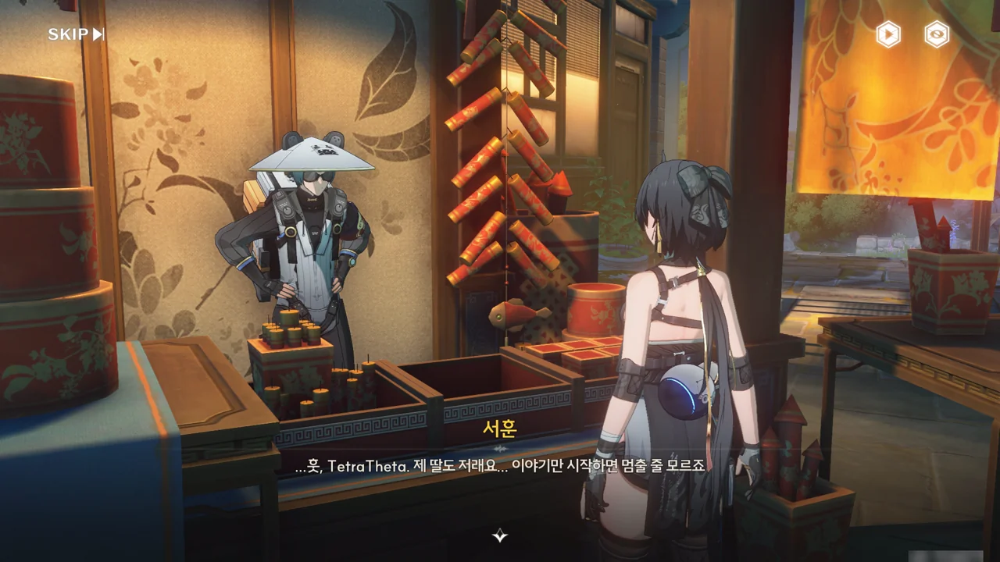









불꽃놀이 가게를 운영하는 서훈 --- 복장을 봐선 무무물류에서 일하는 사람 같다 --- 은 이야기에 사족을 못쓰는 앙코의 모습을 보며 자기 딸 역시 앙코처럼 이야기를 굉장히 좋아한다고 말한다.

서훈은 최근 불꽃에 관심을 보인 딸아이의 재촉에 못 이겨, 마침 재주도 조금 있겠다, 딸을 위해 불꽃놀이 가게를 차렸다. 힘들긴 하지만, 불꽃을 보며 환하게 웃는 딸의 얼굴을 보면 힘든 것도 잊을 수 있다고 말하는 서훈을 보니, 내 아버지도 과연 그랬을까 하는 생각이 문득 든다.

서훈의 딸은 '가장 크고 예쁜 불꽃'을 보고 싶어 했지만, 서훈이 파는 폭죽은 그녀의 마음에 들지 않았다고 한다. 그러던 와중, 오래된 불꽃놀이용 폭죽 제조법을 구한 서훈은 제조법에 드는 재료가 몹시 희귀하고 희한하니 분명 그 모습도 대단할 거라 생각해 한 번 그 폭죽을 만들어보려 한다. 재료 중 굉명 유황 결정은 구했지만 나머지 두 재료를 구할 수 없어 방랑자에게 대신 재료를 구해다 줄 것을 부탁한다.

제조법을 보면 불꽃놀이용 폭죽이라기보다 일반 폭죽에 가깝다는데... 이거 설마 나중에 문제 생기는 건 아니겠지?


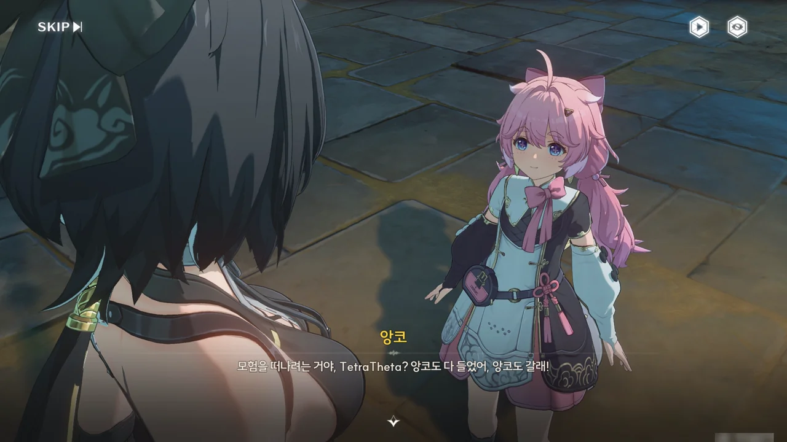





어느샌가 다가와 이야기를 듣고 있던 앙코가 방랑자와 함께 모험을 떠나겠다고 주장한다.

아직 어린아이임에도 불구하고 테티스 시스템이 검은 해안에 필요한 인재라고 판단했을 정도면, 앙코는 강한 게 맞다. 기염과 듀오로 명식을 격퇴한 방랑자가 더 대단하지만!





'폭발용 질산칼륨'... 폭죽에는 반드시라고 해도 좋을 정도로 질산칼륨이 꼭 들어가니까.

낯설어할 것도 없다. 과거엔 질산칼륨을 염초(焰硝)라 불렀고, 질산칼륨의 광물 형태를 초석(硝石, Niter)라 불렀으니까. 흑색화약의 배합비도 질산칼륨 75%, 숯 15%, 황 10%이다. 참고로 무연화약의 주재료는 니트로글리세린이나 니트로셀룰로오스이다.

처마 밑에서 질산칼륨을 구하는 이유도 제법 과학적이다. 해조류를 이용한 염초밭 제조법이 개발되기 전까지의 염초 채집법은 물에 잘 녹는 질산칼륨의 성질을 이용해 질산칼륨이 모이거나 잘 쓸려나가지 않는 초가지붕, 처마 밑, 마루 밑, 아궁이의 흙 등에서 염초를 추출하는 것이었거든. 앙코가 평범한 흙 같다고 하는 것에도 다 이유가 있는 것이다.





'저주파수 숯'이 뭔가 했는데, 그냥 모닥불 숯이었다. 명조는 '주파수'라는 단어를 너무 무안단물처럼 써먹는다니까...

그나저나 아까 유황 결정을 구했다 했으니... 이거 흑색화약 제조법이네? 염초, 숯, 유황 셋이 전부 있잖아. 서훈이 불꽃놀이용 폭죽이라기보다 일반 폭죽에 가깝다고 말한 게 그냥 한 게 아니었군.








폭죽을 다 만든 서훈이 뭔가 이상하다며, 사람이 없는 곳에서 먼저 폭죽의 성능을 시험해 달라고 부탁한다.

서훈이 불안해하는 것도 어느 정도 이해가 간다. 그야, 이거 흑색화약 제조법이잖아. 폭죽에도 흑색화약을 쓰긴 하지만, 폭죽용 흑색화약은 색깔을 위해 불순물을 첨가하거든. 그런데 아까 서훈이 말한 제조법에는 불순물이 없었지, 아마?

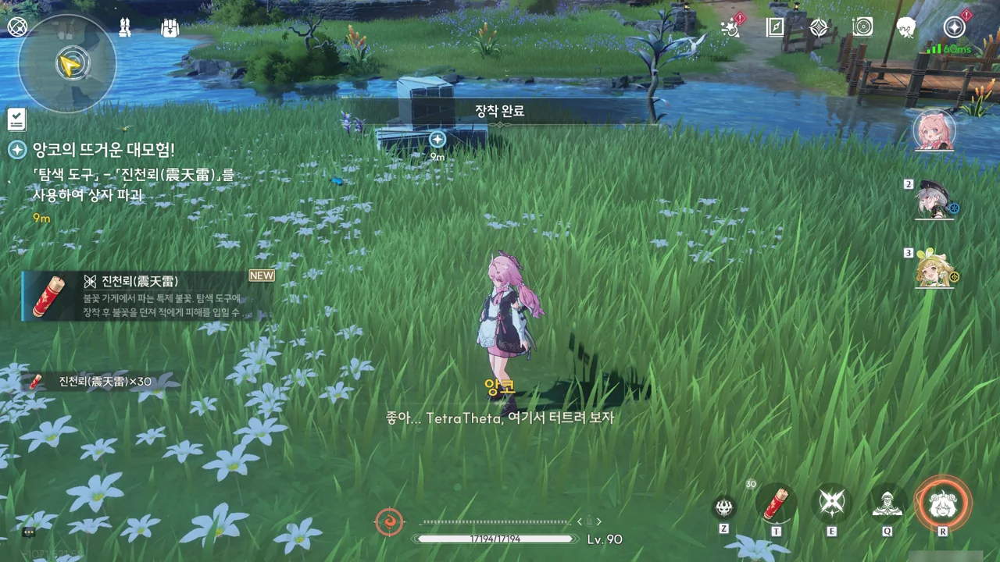

조금 멀리 떨어진 곳에서 「진천뢰」라고 이름 붙은 폭죽을 시험해 보기로 했다. 이름부터가 벌써 불안한데, 이거...



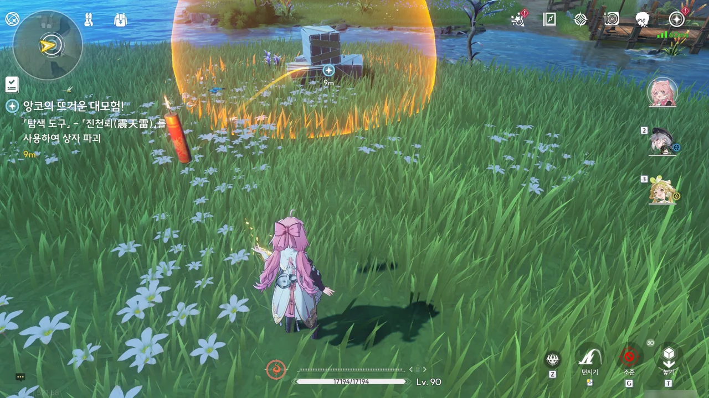

응, 이럴 것 같았어... 폭죽이 아니라 폭약을 만들었잖아!





> 서훈 아저씨, 자기 집에 있는 여동생에게 제대로 된 해명을 들려주진 못하겠네.

'여동생'은 아마 딸을 오역한 거겠지. 그래도 뭔가 서훈이 불쌍해 보인다. 음, 그래도 그녀가 원했던 '가장 크고 예쁜 불꽃' 중에서 '가장 크고' 부분은 일단 맞지 않았는가?







폭발 소리를 듣고 잔상이 몰려왔다. 앙코가 하라는 대로 폭약을 던졌는데, 대미지가 고작 500밖에 나오지 않는다. 이거, 내 앙코가 평타 한 대 때리는 것보다 약해!














비록 서훈이 원하던 폭죽은 아니지만, 무무물류 택배원이 이걸 가지고 다니다 잔상을 만났을 때 써먹으면 나름 괜찮을 거다. 이걸로 잔상을 처치하지는 못하겠지만, 잔상을 잠시 주춤하게는 만들 수 있겠지.

새로운 폭죽 제조법을 찾아보겠다는 서훈의 말을 마지막으로 앙코 스토리가 끝난다.

앙코가 귀여웠어.

# 장리 - 난해한 수수께끼{id="changli"}



장리가 사람들이 추첨하는 걸 구경하고 있다. "훗..."이라고 한 걸 보면, 아마 장리는 원하는 걸 마음대로 뽑을 수 있는 재주가 있는 게 아닐까?




> 룰렛 결과는 운에 맡기는 거니까 머리를 써봤자 소용없거든요.

그렇게 말하는 사람이 계속 당첨을 뽑는다고? 말도 안 되는 소리.

장리 캐릭터 스토리를 읽어 보면, 장리가 평생 동안 찾아다닌 사람이 바로 방랑자이니, 방랑자 앞이라서 내숭 떠는 게 분명하다.







뽑기 당첨 상품으로 뭔가 대단한 걸 줄줄 알았는데 1등 경품을 찾을 수 있는 단서 같은 걸 준다고 한다.

선행 공약 탐험가가 직정이 만든 것으로 추측되는 기관을 발견했는데, 탐험가들이 아무리 머리를 굴려봐도 기관에 얽힌 수수께끼를 풀지 못하자, 운빨 좋은 사람이라면 수수께끼도 잘 풀 거로 생각한 건지, 여우 로또 경품에 그 수수께끼를 끼워 넣었다고 한다.





장리와 함께 하는 거라면 분명 재미있을 거다. 같이 가지 않을 수 없지.

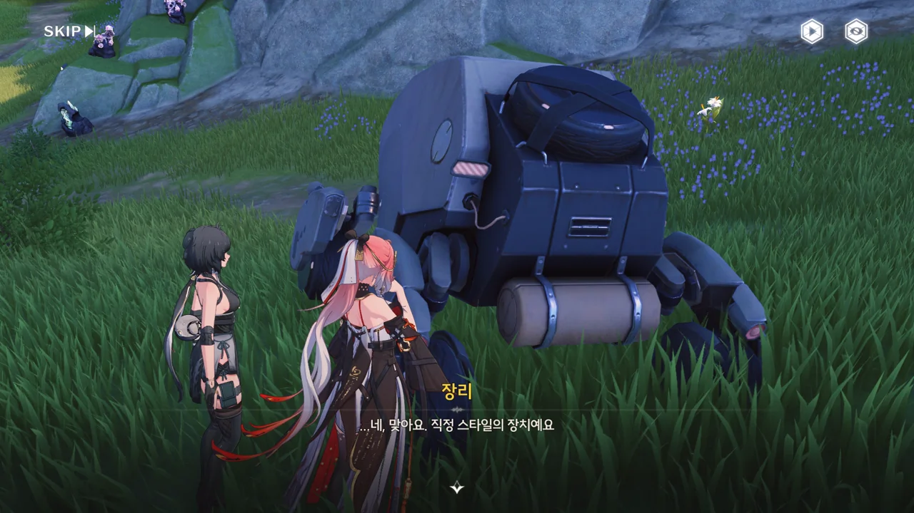





장리가 무슨 말을 하는 건지는 잘 모르겠지만, 무언가를 정해진 순서에 따라 작동시켜야 한다는 것으로 이해했다. 일종의 비밀번호 같은 거네.

선행 공약 탐험가들이 여러 번 시도해 봤다고 했으니, 이 기관은 실패해도 안전한 부류의 기관이다. 무한한 재도전의 기회가 있는 것이다.





장리가 배열 방법이 24가지나 된다고 말하지만, 내게는 *고작* 24가지이다. 만약 비밀번호 자릿수가 5자리만 되었어도 배열 방법이 120가지가 되었을 걸?

가짓수가 24가지면 브루트 포스로 풀기 적당하다.



빨강, 보라, 파랑, 노랑 네 가지 색상의 프리즘을 순서대로 처리해야 하는 전형적인 비밀번호 퍼즐이다.

열심히 풀어보려 했는데... 안되더라고. 그래서 그냥 브루트 포스로 풀었다. 정답은 \[노랑-파랑-보라-빨강\]이었다.

머리가 나쁘면 몸이 고생한다지만, 몸이 좋으면 머리가 고생할 일이 없는 거 아닐까?







「수수께끼 마스터 D의 최신 미스터리 수수께끼 전집」이라는 암호화된 기관술 책 하나가 보상의 전부였다.

어디서 많이 본 상황 같은데. 분명... 조금 전에도 '와! 수수께끼를 풀었더니 수수께끼가 또 나왔어요!' 상황이 있지 않았나?








그런데 그 「수수께끼 마스터 D의 최신 미스터리 수수께끼 전집」이라는 책이 기관 연구자들에게는 보물과 같은 존재였나 보다. '수수께끼 마스터 D'를 그저 수수께끼에 미친 사람이라 생각했는데, 수수께끼뿐만 아니라 기관술에도 미친 사람이었던 거다.




선영이 수수께끼 전집을 선행 공약에 양도해 줄 수 있냐고 묻자, 장리도 동의했겠다, 흔쾌히 넘겨주었다. 어차피 저런 책, 갖고 있어도 방랑자에겐 전혀 쓸모가 없을 게 분명하다.

조금 돌아가긴 했지만, 당첨 상품으로 '보수'라는 이름의 재화를 받긴 했네.







장리는 수수께끼 마스터 D라는 사람에 대해 이미 알고 있었다. 어째 별로 감정의 기복이 없더라.

> 하지만 전 소위 보물 같은 데 그다지 관심 없어요.
> 오늘 제게 있어서 가장 큰 수확은 금은보화도, 수수께끼 마스터 D의 저서도 아니에요.

... 이거, 말하는 게 너무 속보이잖아! ㅋㅋㅋ...

장리 입장에선 이번 일을 계기로 그토록 좋아하던 <i>아이돌 --- 아니면 최애 ---</i>과 하루종일 돌아다닐 수 있었으니, 그것이야말로 최고의 수확이었을 거다.

# 양양 - 다 같이 모일 시{id="yangyang"}







어쩌다 보니 양양과 함께 초롱 수수께끼를 풀게 되었다. 두 사람이 함께 풀어도 될 정도로 난이도가 높다 하니, 과연 어떤 수수께끼가 나올까 궁금하다.



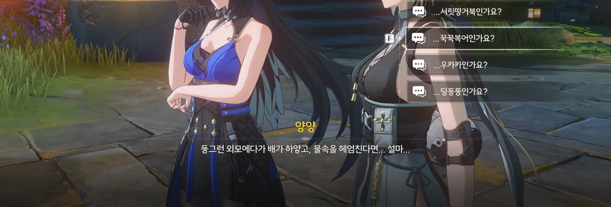





> 둥근 보름달, 새하얀 뱃가죽. 이따금 하늘 위로 뛰어오르기도 하고 물속을 자유자재로 헤엄치기도 해요. 잔상의 일종이에요!
{.bq}

이건 뭐... 꾹꾹복어일 수밖에 없네. 몸풀기로 낸 쉬운 문제라고 했으니, 앞으로 이런 방식의 문제가 나올 거라는 의미이다.









> 닭과 토끼가 같은 우리에 있어요. 모두 합쳐서 머리는 14개, 다리는 38개. 그렇다면 닭과 토끼는 각각 몇 마리일까요!
{.bq}

갑자기 문제가 수학 문제로 바뀌었다. 양양이 여기에 이의를 제기하지만, "꽃등 아래서 문제를 풀고 있으니 초롱 수수께끼가 맞다"는 해괴한 논리에 설득되고 말았다.

```katex
\begin{cases}
  x+y=14\\
  2x+4y=38
\end{cases}
```

대충 이런 연립방정식이 나오니까, 닭()은 9마리, 토끼()는 5마리가 된다.

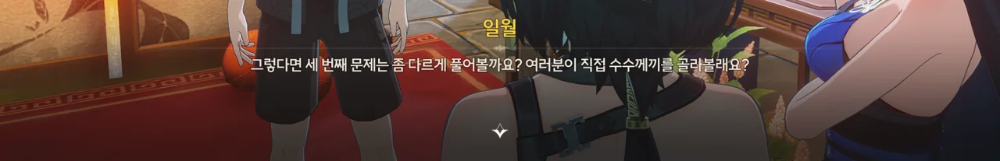

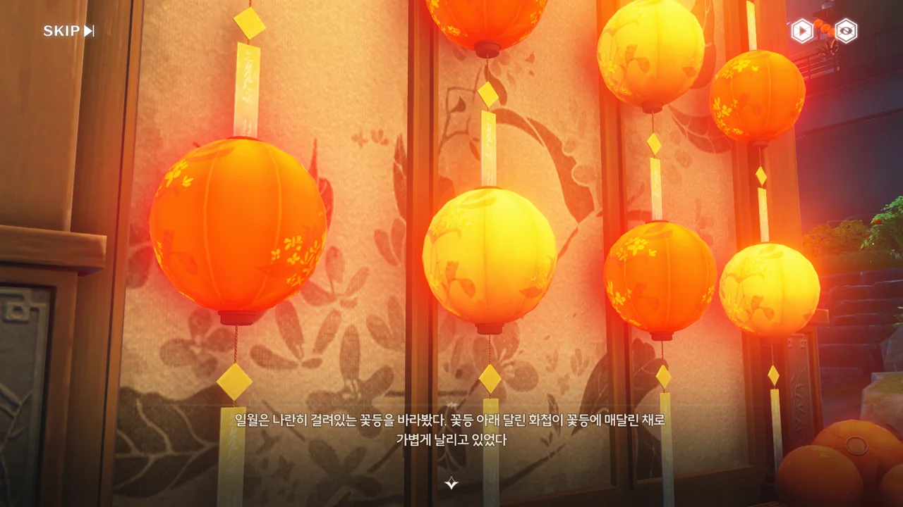





세 번째 문제는 직접 골라 보라는데, 꽃등 위쪽 화첩 부분에 적힌 수수께끼가 보이지 않는다. 특수 먹물을 써서 꽃등에 가까이 가져다 대야 글씨가 보인다는데... 그러면 대체 어떻게 수수께끼를 고르란 거야?

결국 양양이 '아무거나'를 시전 했다.







> 밝은 달이 둥근 벽을 비추고, 화려한 등이 금주성을 둘러싸네. 온 가족이 둘러앉아 웃으며, 머리를 맞댄 채 재회를 축하하네.
{.bq}

이 문제의 정답이 대체 왜 「모두」인지 나는 도저히 이해할 수 없다. 명조 번역이 또 명조 번역한 모양이다.

아무튼 양양도 정답을 맞혔으니, 아무튼 좋았쓰!

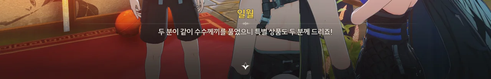






여우 달맞이 문양이 그려진 이 꽃등은 「여우의 별자리」 --- 위키를 찾아보니, 중국어 원문을 살려 번역하면 「용의 심장」 정도가 될 것 같다 --- 가 직접 만들어 숨겨둔 것인데, 이걸 찾은 사람은 일 년 내내 축복을 받을 수 있다고 한다. 특별 상품으로 온 이것은 꽃등을 찾은 수집가가 달맞이 축제를 위해 특별히 보낸 거라고 하고.

그런데 축복을 받는 조건은 꽃등을 '찾는 것'이지, '소지하는 것'이 아니지 않나? 설마 또 번역이 번역한 거야?



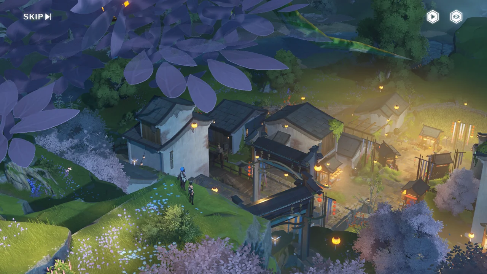









양양의 "지금 가족과 만날 수 없다"는 말이 대체 무슨 말인가 싶어서 위키를 찾아보았다.

양양은 본래 유서 깊은 상인 가문의 둘째 딸이었다. 하지만 그녀가 11살이 되던 해, 추방자 무리가 가문으로 쳐들어와 사람들을 죽이고 약탈했다. 추방자로부터 도망치는 과정에서 양양은 가족과 헤어지게 되었고, 홀로 떠돌던 끝에 야귀군 행정부대에 입대하게 되었다.

... 그래서 어릴 적 이야기를 그렇게 말한 거였구나.

&nbsp;

양양에 붙은 밈 중 하나가 바로 '정실'이다. 다른 캐릭터에 비해 방랑자와 함께할 때 얼굴을 붉히는 일이 잦아, 방랑자를 <i>사랑 --- 어쩌면 흠모일지도 모르겠다 ---</i> 하는 게 아니냐는 말이 많이 나오는 캐릭터이다.

그런 의미에서, 오늘도 양양은 '정실'다웠다.

# 능양 - 같은 달빛 아래에서{id="lingyang"}



> 8월 보름달을 보는 사람, 복을 많이 받으세요!

응? 대체 이게 무슨 말이지? 덕담이라고?











알고 보니 능양과 명추가 달맞이 축제 기간에 맞춰서 새로운 덕담을 개발 중이었다. 혼자서 생각하는 것보다 둘이서 생각하는 게 더 나을 거라고 생각해, 둘이 서로 덕담을 주고받으며 새로운 덕담을 만들고 있던 것이다.

그리고 얼떨결에 방랑자 역시 여기에 끼게 되었다.

한 사람이 운을 띄우면 다른 사람이 그다음 말을 이어받으면 되는데, 꼭 음률과 대구법을 지킬 필요 없이, 들었을 때 즐겁고 축복해 주는 느낌이 드는 말로 이어받으면 된다고 한다. 갑자기 문학 시간이 된 줄 알고 긴장했는데, 다행이네.

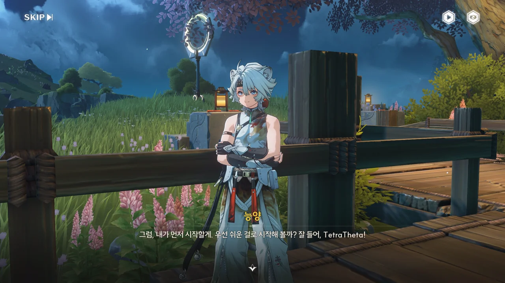



> 고생 끝에, 낙이 오길!

고진감래(苦盡甘來)라는 사자성어 그대로이다. 현대 중국에서는 고진감래 대신 선고후첨(先苦后甜)을 더 많이 쓴다고 한다.





> 풀어도 정답, 찍어도 정답!

이걸 과연 수험생들이 어떻게 생각할까? 덕담이라고는 하지만, 시험 문제의 정답은 정해져 있으니까 말이다.





> 밀가루 장사 하면 바람이 멈추고, 소금 장사 하면 비가 그치기를 바래요!

바람이 불면 밀가루가 흩날릴 거고, 비가 오면 소금이 젖어 녹아버릴 테니, 이게 제일 어울리는 문장이다.





> 사자 울음소리에 천지가 흔들리니, 화를 쫓아내고 복을 불러요!

이 문제는 조금 시간이 걸렸다. '화를 쫓아내고 복을 불러요'는 능동적으로 복을 불러오는 느낌이고, '행운이 사방팔방에서 절로 찾아와요'는 수동적으로 복이 찾아오는 느낌이라, 능동적인 단어인 '사자 울음소리'에 맞춰서 능동적 선택지인 전자를 골랐다.

어째 잘 된 모양이네.











능양이 생각하는 덕담의 비결은 상대방의 상황에 자신이 처했을 때 가장 듣고 싶을 말을 전해주는 것이라 한다. 그 말대로라면, 능양이 덕담을 잘하는 건 자신 역시 여러 사람들로부터 축복을 받고 싶어서인 걸까? 본인은 지금도 많이 행복하다고는 하지만, 내가 보기에 남들에게 쉬이 말할 수 없는 외로움은 분명 있을 것 같거든. 능양 얽힌 별 임무에서 보았듯이, 능양은 한 종족의 마지막 생존자이니까.

방랑자가 센스 있게 능양과 처음 만났을 때 들었던 덕담을 되돌려준 건 정말 멋졌다.
