어휴, 이거 정리하려니 분량이 정말 많다. 이거 다 정리하고도 에필로그가 남는데, 그건 또 언제 한담?

# 기염 - 무엇을 위해 싸우는가{id="jiyan"}

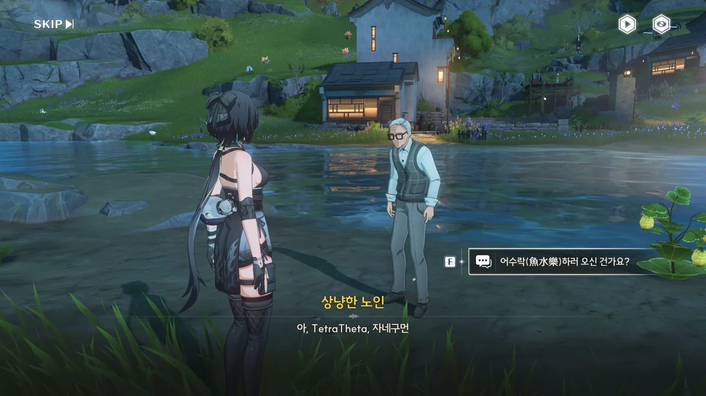





한 할아버지가 야귀군에서 복무하다 이번에 휴가를 받고 돌아올 아들을 기다리고 있다.

기염은 야귀군 장군이니까... 이번 이야기는 야귀군과 관련한 이야기가 되는 걸까?









방랑자가 기염과 함께 명식의 부화를 막은 덕에 한동안은 잔상이 금주에 위협이 될 정도로 세력을 형성하지 못할 거라고 한다. 전방이 어느 정도 숨을 돌릴 수 있게 되자, 기염은 그곳에서 근무하던 야귀군들에게 달맞이 축제를 즐기고 오라며 며칠 간의 휴가를 줬다.

기염은 잔상의 침입 때 가족을 잃은 병사들이 휴가를 어떻게 지내고 있나 살펴보고 싶었지만, 자신은 만일의 사태에 대비해 전방을 지키고 있어야 하기에, 대신 방랑자에게 그들을 살펴봐달라고 부탁한다.

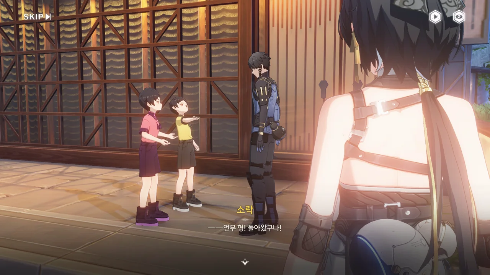







야귀군 병사 언무가 용띠찐빵을 동생인 소락과 아진에게 사 갖고 왔다.

... 기염이 부탁한 건 분명 잔상 때문에 가족을 잃은 야귀군 병사였지? 그리고 '아주머니'라는 말로 미루어보아, 소락과 아진은 언무의 '가족' --- 좁은 의미의 가족 --- 이 아닌 것 같다.











알고 보니, 언무나 소락, 아진 모두가 복지원 출신이었다. 복지원 원장 아주머니는 언무, 소락, 아진처럼 부모를 잃은 아이들을 보살피고 있으며, 그렇기에 언무에게 복지원은 또 하나의 집이다.

기염이 야귀군 병사들에게 휴가를 준 이유가 '가족들과 좋은 시간을 보내길' 바라서였으니, 휴가 때마다 집(복지원)으로 돌아가 가족들(복지원 사람들)과 좋은 시간을 보내는 언무는 기염의 바람대로 휴가를 잘 즐기고 있는 것이다.

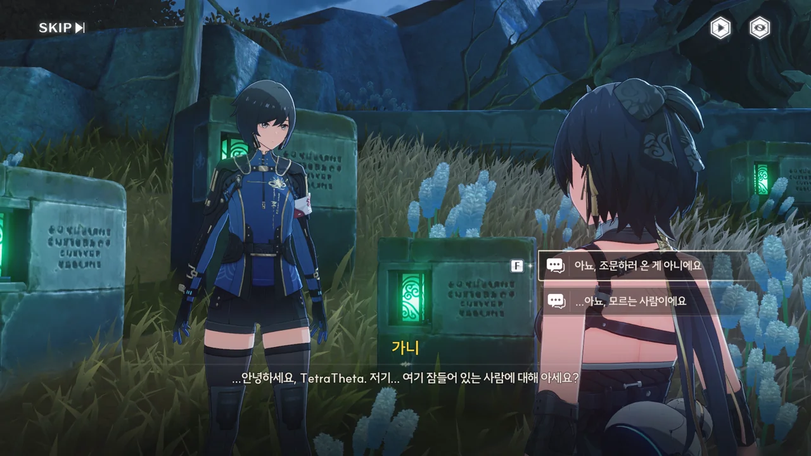









그다음은 전사한 오빠의 묘비에 찾아온 가니. 그녀의 오빠가 있던 부대는 수송 임무 중 대량의 잔상과 마주하자, 수송 차량만이라도 안전하게 보낼 수 있도록 스스로의 몸으로 방어선을 세워 맞서 싸웠지만, 결국 수송 차량과 함께 전사했다고 한다.

오빠가 라임그라스향을 무척 좋아했다는 걸 기억한 가니는 방랑자에게 라임그라스를 따다 줄 것을 부탁한다.

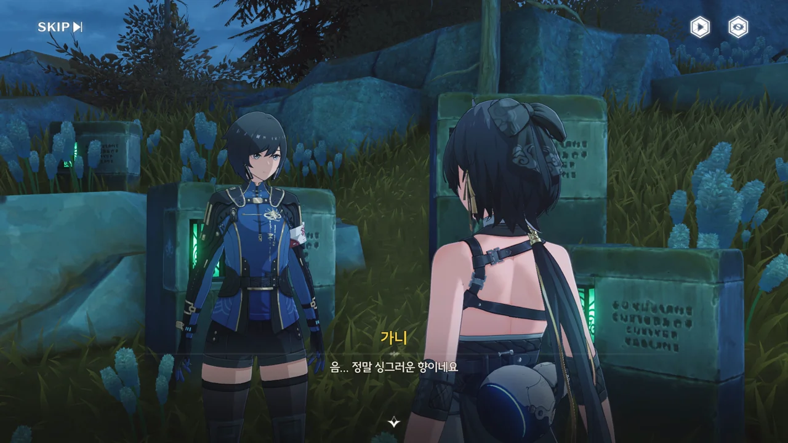







가니는 오빠가 라임그라스향을 좋아했던 건 정말 라임그라스 향기가 좋아서가 아니라, 가족이 다 함께 모여 라임그라스 매운탕을 먹던 그 시절이 그리웠기 때문일지도 모른다며, 이번에 한번 라임그라스 매운탕을 끓여 먹어보겠다고 말한다.

'혼자'라고 말하는 걸 보면, 가니와 그녀의 오빠가 야귀군에 입대한 건 부모님이 돌아가신 이후일지도 모른다. 정말 그렇다면, 가니는 부모에 이어 유일하게 남은 가족인 오빠까지 잃어버린 셈이다. 그래서 "혼자서 먹으면... 맛이 더 없을 것 같지만요..."라고 말한 거겠지.

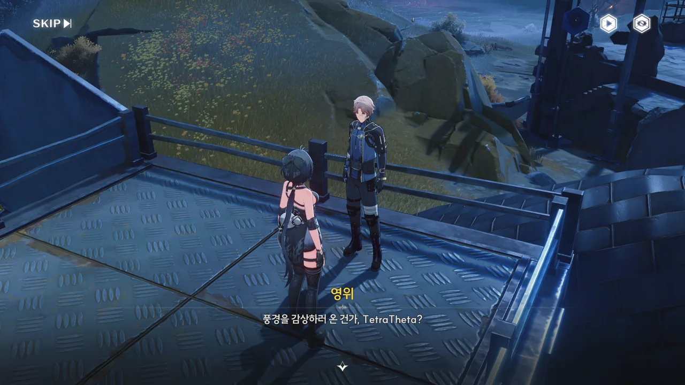















영위의 고향은 비명 이상 현상으로 인해 고향에 있던 친구들과 가족들과 함께 흔적도 없이 사라져 버렸다. 순식간에 모든 걸 잃어버려 뭘 어찌해야 할지 몰라 방황하던 영위에게 기염이 찾아와 야귀군에 입대해 금주를 위협하는 잔상류에 맞서 싸울 것을 권유하자, 밖에서 굶어 죽는 것보다 금주를 지키다 명예롭게 죽는 게 더 가치 있을 거라 생각한 영위는 그 권유를 받아들여 야귀군에 들어갔다.

영위와 같은 병사들은 달리 갈 곳이 없었기에, 휴가를 받았어도 부대를 떠나지 않고 잔상에 맞서 싸웠다고 한다. 모든 걸 잃어버렸기에, 잔상에 맞서 싸우는 것만이 그들의 유일한 삶의 목표가 된 것이다.

영위는 다른 병사들은 휴가를 보낸 주제에 자신은 끼니조차 거를 정도로 쉬지 않고 일하는 기염에게 가져다 주라며, 직접 부대 근처에서 얻은 재료로 만든 찜 요리를 기염에게 가져다 달라고 부탁한다.

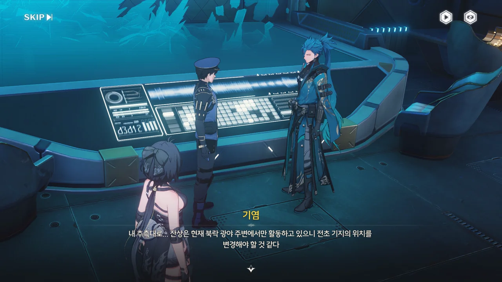



영위의 말처럼, 기염은 달맞이 축제 기간임에도 여전히 바쁘게 일하고 있다.

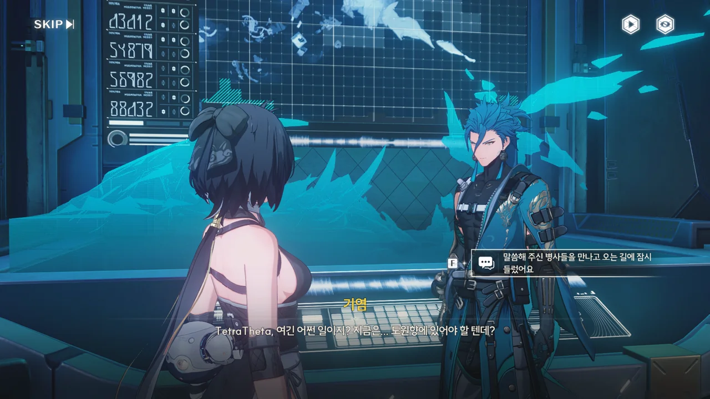





그런 그에게 영위를 비롯한 병사들이 만든 찜 요리를 건네준다.









왜 하필 찜 요리인가 내심 궁금해했는데, 기염이 그때 일을 자세히 알려준다.

아직 장군 자리에 오르기 전, 후방부대에서 근무하던 기염은 변방에서 임무를 수행하고 복귀하던 중 야영을 하게 되었다. 이런저런 재료를 적당히 넣고 찌던 중, 비명 이상 현상으로 모든 걸 잃어버린 영위와 만나게 된 기염은 살아갈 동력을 찾지 못하던 영위에게 야귀군 입대를 제안했다. 그 후 야귀군에 입대한 영위는 휴가를 나갈 때마다 그때의 찜 요리를 흉내 내어 기염에게 보냈다고 한다.

비록 정해진 요리법 없이 적당히 찐 요리였지만, 영위에게 있어 그 요리는 그 어느 요리보다 더 기억에 남는 요리였을지도 모르겠다. 마치 어둠 속 한줄기 빛과 같았겠지.

# 음림 - 작전명: 월하쌍웅{id="yinlin"}

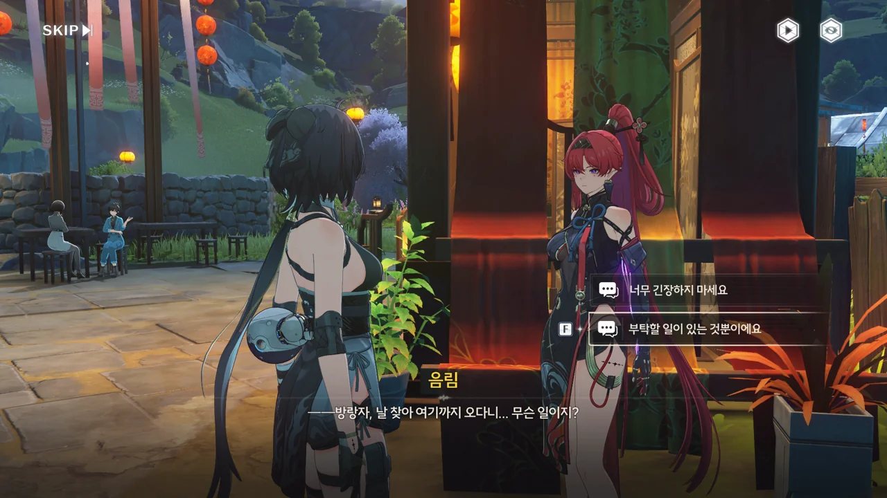







원래 달맞이 야시장에서 인형극을 연기하기로 한 배우가 갑작스레 일이 생겨 나오지 못하게 되었기에, 인형 조종에 매우 능한 음림에게 인형극을 부탁하게 되었다. 음림 역시 출연료만 제대로 챙겨준다면 나쁠 것 없다며 긍정적인 반응이다.

'명식과 싸우는 방랑자 인형극'을 고를 정도로 뻔뻔하지 않아 '토끼를 쫓는 여우 인형극'을 골랐는데, 그게 황룡 전설이라고 한다. 다만 그 인형극에 필요한 인형이 없어, 인형을 따로 구하러 가야 한다.

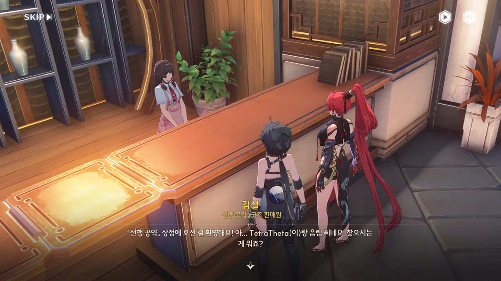





선행 공약에서 인형도 판다는 건 처음 듣네. 음림이 '금주에서는 연줄만 있으면 뭐든 구할 수 있다'라고 하길래 무슨 암시장에서 인형을 구하는 건 줄 알았는데, 평범하게 가게에서 사는 거였다.

음림이 농담한 거라고? 음림이라면 분명 암시장이 어디에 있는지, 거기서 뭘 파는지 알고 있을걸?

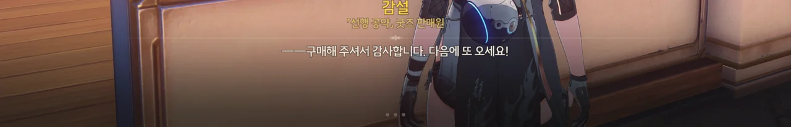







음림이 누군갈 발견하고 "여기 나타나면 안 되는 사람"이라고 하길래 따라가 보았다.

그 사람의 정체는 레이. 과거 음림의 정보원이었지만 중요한 순간에 음림을 배신하고 혼자 내뺀 과거가 있는 사람이다. 손버릇이 나빠 감옥에 갇혔다가 얼마 전 출소한 모양인데, 그래서인가 추방자가 되었다고 한다.

추방자가 제복처럼 입고 다니는 옷 대신 다른 옷을 입고 금주성에 들어온 이유가 과연 무엇일까?









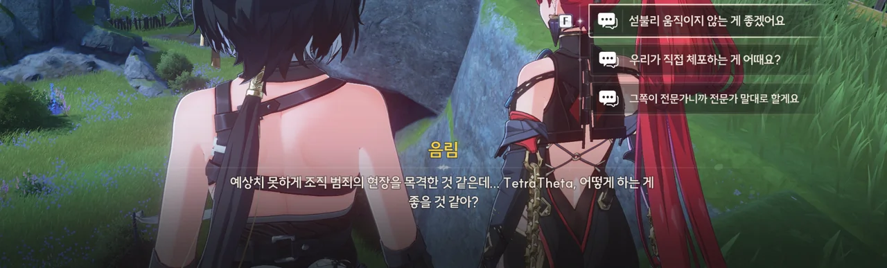



마자와 레이 둘이 말하는 걸 보면, 달맞이 야시장에서 뭔가 크게 한탕하려는 것 같다. 설마 달맞이 야시장에 온 사람들을 대상으로 강도짓이라도 하려는 걸까?



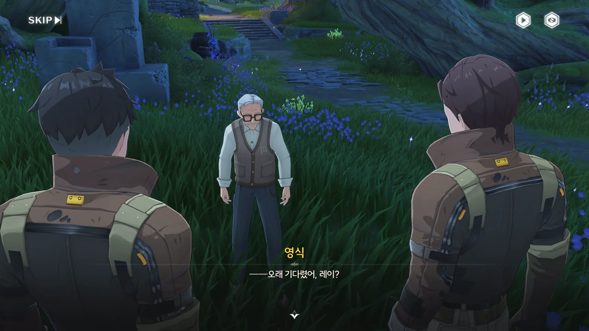











놀랍게도, 마자와 레이가 말한 '형님'은 바로 「단란 과자」를 파는 노점의 영식 할아버지였다. 추방자로 이루어진 야수 패거리까지 언급된 것으로 보아, 정말 보통 일은 아닌 것 같은데...

화살곰이 물건 냄새를 맡고 다가왔기에 일단 화살곰을 격퇴하기로 했다.

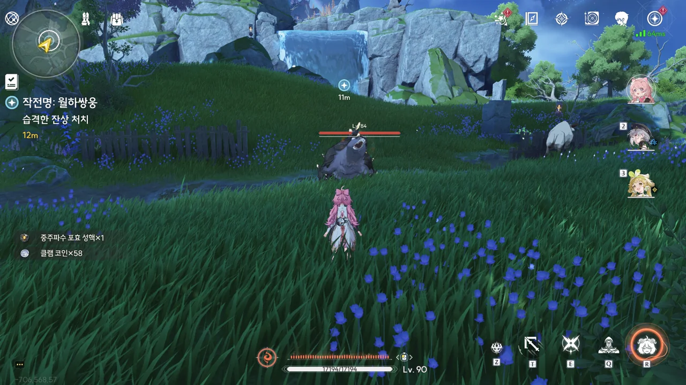

So goddamn easy.

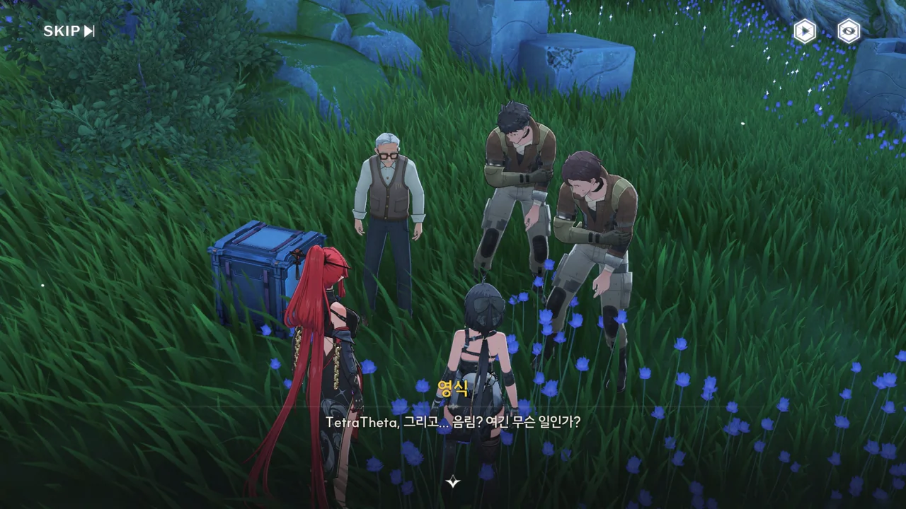





하지만 마자와 레이가 가져온 상자 안에는 아무런 이상 없는 짐승고기만 가득 들어 있었다.

이게 대체 어떻게 된 일이지?

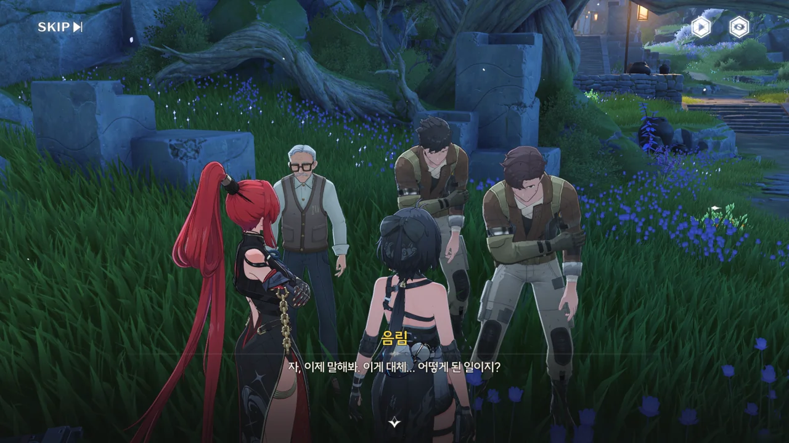





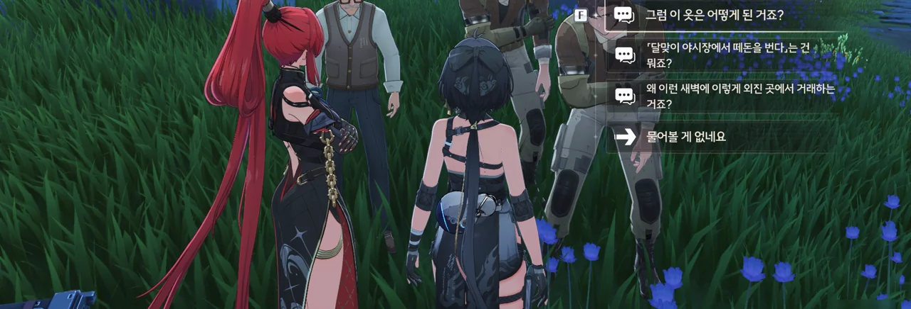







알고 보니, 노점에서 팔 「특제 금주 꼬치구이」에 쓸 신선한 짐승고기를 원하던 영식 할아버지가 야수 패거리에 있다 감옥에 갇히고 얼마 전 출소한 레이가 야수 패거리에 몸담은 덕택에 사냥에 능하다는 걸 알고 레이에게 사람을 모아 신선한 짐승고기를 모아다 달라고 의뢰한 것이었다.

레이가 추방자 옷을 입고 있던 건 그가 추방자여서가 아니라 단순히 추방자 '제복'이 사냥할 때 좋기 때문이었다.

그러니까 결과적으로 레이와 마자가 말을 '추방자스럽게' 말한 탓에 생긴 오해였던 거다. 아아, 낯 뜨겁다...

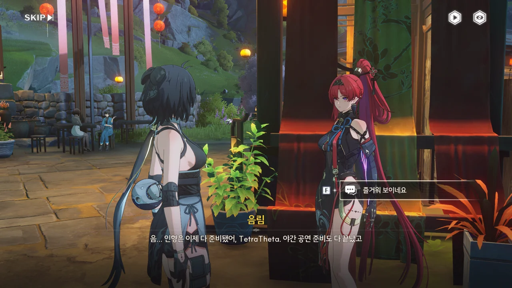





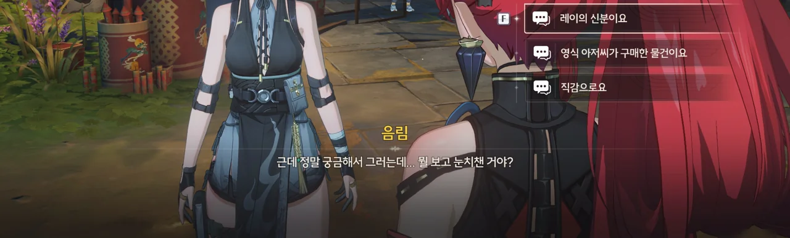











'방랑자'는 음림이 이 일의 진상을 이미 알고 있었음을 알고 있었다. 그래? 난 감옥에서 옥살이를 하면 더 이상 추방자가 아니라는 걸 조금 전에서야 알게 되었는데 말이다.

방랑자와 음림의 대화가 뭔가 부자연스럽게 '음림은 역시 대단한 잠입 수사관이야!'라는 결론으로 흘러가는 것 같다.

제발, 내가 이해할 수 있는 스토리를 내놓아줘...

# 금희 - 잊을 수 없는 오늘 밤의 달빛{id="jinhsi"}

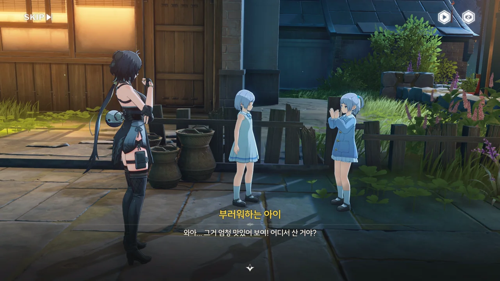



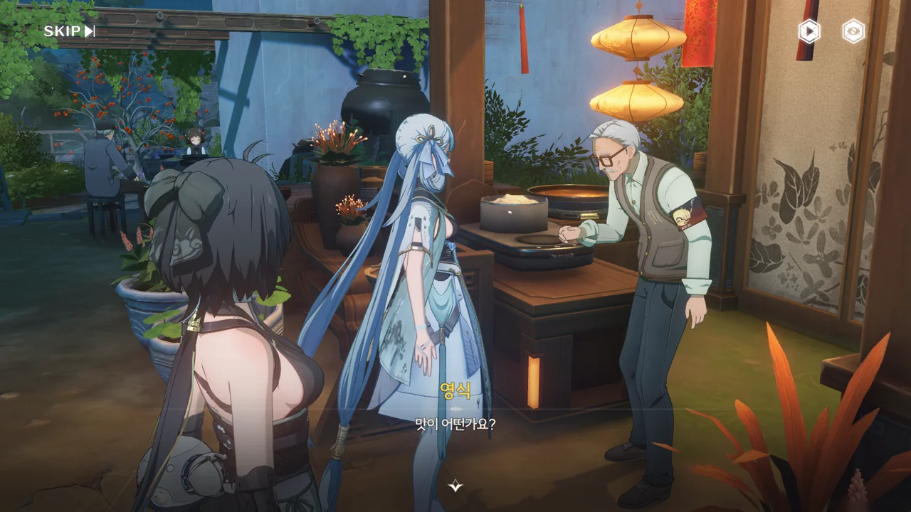



한 아이가 영식 할아버지의 가게에서 새로 개발한 간식을 먹으며 금희 역시 맛있다고 했다기에 가게로 가보니 정말 금희가 있었다.

그런데... 죽? 죽의 단맛? 죽이 간식처럼 들고 다니며 먹을 수 있는 음식이었던가?

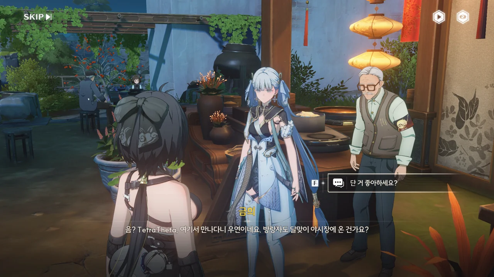











금희는 달맞이 야시장에 뭔가 도움이 필요한 게 있는지 알아보려 왔다가, 영식 할아버지에게 새로 개발한 간식 맛을 평가해 달라는 부탁 때문에 여기 있는 것이었다.

\[죽\], \[꿀\], \[간식\] 이 세 키워드로 엮을 수 있는 간식이 대체 뭐가 있지?



워낙 바쁜 탓에 이제야 시간이 나 달맞이 야시장을 보러 온 금희는 이렇게 만난 것도 인연인데 함께 달맞이 야시장을 돌아다니자고 권유했다. 당연히 같이 가야지!











서훈이 폭죽이 상하는 일 없이 무사히 폭죽가게를 열 수 있었던 것은 금희가 폭죽을 보관할 수 있는 장소를 마련해 줘서라고 한다.

서훈이 감사의 의미로 폭죽을 선물로 주었다.











일월의 초롱 수수께끼 가게 역시 금희의 손길이 닿은 곳이다. 노점 신청 명단에 초롱 수수께끼 가게가 있는 걸 보고 예전에 풀었던 퀴즈 몇 개를 특별 상품과 함께 적어주었는데, 여태껏 그 수수께끼를 풀어낸 사람이 없었다고 한다.

> 다른 사람을 웃게 한다면 내 뼈가 부러지고 추위에 떤다 한들 무슨 상관이랴.
{.bq}

문제의 정답은 '폭죽'이었지만, '금희'라고 해도 틀린 답은 아닌 것 같다. 금희가 승소산에서 그 고생을 한 것 역시 금주 사람들을 위한 것이었으니까.













명식의 위협이 일단은 마무리된 후 처음 열리는 달맞이 축제라 그런지, 성황리에 펼쳐진 야시장의 풍경에 감동한 금희. 자신에게 있어 달맞이 야시장의 진정한 즐거움은 달맞이 야시장을 마음껏 즐기고 있는 사람들의 모습이라고 말한다.

금희가 자신의 바람은 이미 이루어졌으니 이제 방랑자가 하고 싶은 걸 같이 하자고 하지만, 나나 방랑자나 금희가 가는 대로 따라가기만 해도 기분 좋은가 보다.

***

모든 경영 일화 끝! 이제 에필로그만 쓰면 된다.
