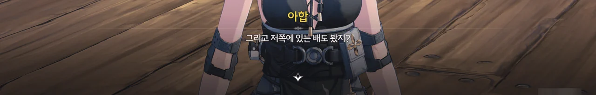
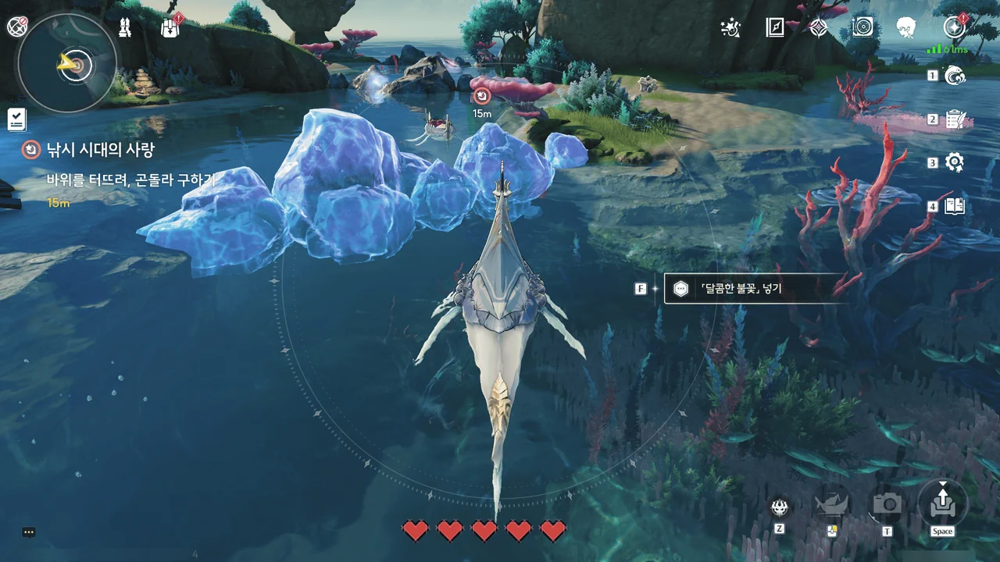
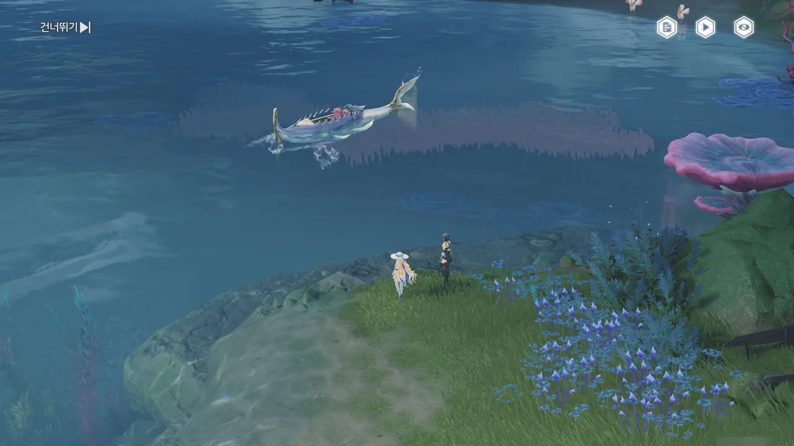

이번 이벤트, '노인, 물고기와 바다'는 기묘한 위치에 있다고 할 수 있다.

지금까지의 이벤트는 전부 기간 한정 이벤트였고, 따라서 조수 임무와 큰 연관점이 없었다.
하지만 이번 이벤트인 '노인, 물고기와 바다'는 '레귤러 이벤트'이다. 이벤트 기간이 끝나면 이벤트 목록에서 영구히 사라지는 대신, '레귤러 이벤트' 탭으로 이동해 조건을 만족하는 한 언제나 플레이할 수 있도록 바뀐다.

그래서인지, '노인, 물고기와 바다' 이벤트는 마치 조수 임무처럼 더빙이 완벽하게 되어 있고, 그 스토리조차 조수 임무와 제법 밀접하게 연관되어 있다.
이번 이벤트는 바로 직전 조수 임무인 '슬펐던 내가 지금은 노래를 부르기로 했다'에서 직접적으로 이어지는 이야기이다.

자, 그러면 레귤러 이벤트는 무엇으로 간주해야 할까? 조수 임무? 이벤트 임무?
다른 기간 한정 이벤트와 같이 두기에는 스토리 내용의 중요성이 기간 한정 이벤트보다 높다고 볼 수 있다.
하지만 조수 임무와 같이 두기에는 게임 내에서 엄연히 '이벤트 임무'로 분류되어 있다.

그래서 결과는 뭐... 보다시피.
글 자체는 이벤트 임무로 분류했지만, 시리즈는 다른 조수 임무와 동일하게 처리했다.

***







이슈마이어라는 사람에게서 바다낚시를 해보지 않겠냐는 제안을 받았다.



바다낚시를 하려면 차가운 해류와 따뜻한 해류가 서로 만나는, 라군나 북쪽의 '리졸리 군도'에서 배낚시를 하는 게 좋을 거라는 추천을 받았다. 마지막으로 '아합'이라는 선장을 찾아가 보라는 권유까지.

... 나, 설마 영업당한 거야?

&nbsp;

널리 알려진 대로, 이번 이벤트는 오마주가 굉장히 많다.
당장 이벤트의 제목인 「노인, 물고기와 바다」는 헤밍웨이의 소설, 《노인과 바다》를 오마주한 것이고, 이벤트의 주요 등장인물과 스토리는 멜빌의 소설, 《모비 딕》에서 가져온 것이다.

하지만 명조의 번역은... 말해 무엇할까. 개판이다, 개판.
일단 이벤트 제목인 「노인, 물고기와 바다」의 경우, 다른 언어는 제법 괜찮은 번역을 내놓았다.

| 한국어 | 중국어 | 영어 |
|:---:|:---:|:---:|
| 노인, 물고기와 바다 (노인과 바다) | 老人鱼海 (老人與海) | Old Man and the Whale (The Old Man and the Sea) |
{style="table-layout: fixed"}

《노인과 바다》를 은유하고 싶었다면 '노인과 바다와 물고기'처럼 번역했으면 좋았을 것을...

약간의 스포일러가 되겠지만, 등장인물 및 사물의 이름 번역 역시 좋지 않다.

| 한국어 | 오마주 원본 |
|:---:|:---:|
| 스타바커스 | 스타벅 |
| 아합 | 에이해브 |
| 이슈마이어 | 이스마엘 |
| 퀴그 | 퀴케그 |
| 페쿼드호 | 피쿼드호 |
{style="table-layout: fixed"}

... 이제는 대충 '그래... 대충 알아들을 수 있으면 되는 거지...'라고 반쯤 체념했다.
저 이름들이 이탈리아에 많은 영향을 받은 리나시타 문화권에 어울리지 않는 이름이긴 해도!!!





오... 제법 이쁜데...











보통 사람들과는 조금 다를 것이라는 뱃사공의 말처럼, 아합 선장과의 첫 만남은 참으로 기묘했다.

대체 무슨 물고기가 걸렸길래 방랑자가 공명의 힘까지 써가며 끌어올려야 했던 거야? 물고기가 낚싯줄을 끊고 도망가는 바람에 확인할 수 없게 되었다만...









이슈마이어와 아합 선장이 서로를 알고 있는 걸 보면, 정말 영업당한 건가 보다.
큿, 교묘한 말로 날 낚다니! 이게 그 '사람을 낚는 어부'라는 건가?



하지만 금세 괜찮아졌다.
왜냐면 아합 선장이 고기잡이배가 없는 방랑자에게 자신이 은퇴하기 전에 쓰던 「라젤호」를 그냥 줬거든! 빌려주는 게 아니라!
와! 고마워요!

이걸 방랑자가 직접 돈 주고 샀으면 과연 얼마가 필요했을까?





정작 방랑자와 아합 선장이 놓친 그 물고기로 추정되는 걸 낚는 건 정말 쉬웠지만...

아무리 이게 「바다낚시」라는 신규 콘텐츠를 소개하는 용도의 이벤트이긴 해도, 처음 낚는 물고기가 이렇게 쉬우면 아까 공명의 힘까지 써서 물고기를 낚으려 했던 방랑자가 조금 바보가 되는 것 같다고 생각하는데...

뭐, 상관없나.



















아합 선장의 권유대로 시장에 가보니, 한 상인이 페비에게 잔뜩 성을 내고 있었다.

페비는 라군나에서 부상을 입은 회유의 고래의 행방을 찾기 위해 리졸리 군도에 찾아왔다.
하지만 페비가 세금을 걷기 위해 리졸리 군도에 온 것이라 착각한 수산물 상인이 페비에게 대뜸 꺼지라고 성을 낸다.
심지어 직전에 페비가 그 상인의 인형을 고쳐줬음에도 말이다.

거, 나이 먹고 추하게 왜 그러실까.

결국 아합 선장이 나서 그 상인을 따끔하게 꾸짖고 나서야 일이 해결되었다.

> 여기 은혜를 원수로 갚는 사람도 있었군그래!

나도 이야기를 들으며 '물에 빠진 놈 건져 놓으니까 내 봇짐 내라 한다'라는 속담을 생각했는데 말이다.













아까 그 상인이 수도회 성직자인 페비에게 아무 이유 없이 성을 낸 건 아니었다.
리졸리 군도는 수도회가 묵인한, 수도회의 인도를 받지 않는 지역이기 때문이다. 아까 상인이 말했던 것처럼, 여기 사람들은 수도회의 인도를 받지 않으니 수도회에 세금을 낼 필요도 없다.

수도회가 간섭하지 않는 지역에 수도회를 싫어하는 사람들이 몰리는 건 당연한 일. 리졸리 군도 사람들이 수도회 사람들을 싫어하는 건 당연한 결과라고 할 수 있겠다.
그렇다고 아까 그 상인의 행동이 정당화되는 건 아니겠지만.

페비는 카니발에서 있었던 일을 통해 회유의 고래의 상태가 이상하다는 걸 느꼈다. 그래서 회유의 고래를 만나 상태를 확인하기 위해 리졸리 군도로 온 것이고.

그런 페비에게 아합 선장은 리졸리 군도에 있는 네 개의 등대를 모두 밝히면 회유의 고래를 만날 수 있을 것이라고 알려준다.
다만 얼마 전 회유의 고래가 사라진 이후, 네 개의 등대 중 세 개의 불이 꺼졌기에, 이를 다시 켜야만 한다.

> 방랑자, 저 어르신은 왜 「모자」 얘기를 하시는 거야? 내 모자... 이상해?

나도 아합 선장이 말하는 '모자'에 어떤 뜻이 있는 건지는 잘 모르겠더라고.







> 다리... 내 다리가 어디 갔지? 창을 가지고 오게...
> 일등 항해사... 기름...! 내 기름은 어디에 있나...?

나이가 많아서 그런 걸까, 아합 선장의 상태가 조금 이상하다.

조타륜 마을의 스타바커스가 얼마 전 회유의 고래를 목격한 후 미쳐버렸다고 하니, 그를 찾아가 보라고 한다.











아합 선장이 「대어」를 잡기 위해선 저 배를 수리해야 한다고 한다.

그런데 배의 수리를 맡은 선원, 퀴그가 말하는 게 조금 아니꼽다.

> * 나무가 필요해요. 배를 고쳐야죠.
> * 저한테 뭘 주시려고요?
> * 근데 나무가 없어요. 재료가 있어야 수리를 하죠.

기껏 나무와 설계도, 수산업 코인을 가져다준 사람에게 이렇게 말해도 되는 거야? 감사인사라고는 단 하나도 없이?

하지만 내가 뭘 할 수 있지? 난 그저 퀘스트가 시키는 대로, 퀴그가 아니꼽게 말하든 말든, 그에게 나무와 설계도, 코인을 가져다 바쳐야 하는 처지인걸...







어... 음...

스타바커스의 상태가 매우 좋지 않다.
웬 파란 생선 하나를 끌어안고 악혼녀라고 부르질 않나, 페비에게 대뜸 생선과의 결혼 주례를 서 달라고 하질 않나...
얼씨구. 이젠 생선 입에 꽃까지 물려주고 있다.





하지만 페비의 '깡!'은 만능이다.
사람이든 에코든 일단 머리에 '깡!' 한 대면 다 고쳐진다고.







스타바커스가 제정신으로 돌아온 것도 잠시, 파란 생선의 눈을 바라본 순간 또다시 정신을 놓고 말았다.
으음... 한 대 더 때리면 될 것 같은데. 한 대 더 때려 보죠.











스타바커스의 머리를 곧바로 한 대 더 때리려는 페비를 어부 인형 하나가 가로막는다.
페비가 시장에서 고쳐줬다는 인형이 바로 이 어부 인형이었다.

어부 인형은 스타바커스가 2주 전 미쳤을 때 타고 있던 곤돌라가 근처 암초에 갇혀 있으니, 폭탄을 이용해 암초를 깨부수어 곤돌라를 구출한 뒤, 곤돌라에게 당시 상황을 물어보라고 알려준다.

페비의 방식대로 계속 스타바커스의 머리를 내리쳤다간 스타바커스의 뇌가 돌아올 수 없는 강을 건널 수도 있으니, 그게 최선의 방법일 것 같다.



어... 음...
마음 같아선 그냥 '예쁜 사랑 하세요' 하고 지나치고 싶지만, 스타바커스가 회유의 고래의 행방에 대한 단서를 쥐고 있으니 어떻게 해서든 스타바커스의 정신을 제자리에 돌려놔야만 한다.



> **「달콤한 불꽃」**
> ***
> 특정 암초를 파괴하는 데 사용되는 펑펑복어
> ***
> 스타바커스가 어떤 물고기와 결혼할 때 불꽃으로 사용하려고 했던 펑펑복어로, 폭발의 위력이 너무 강해서 암초를 파괴하는 데 사용되기도 한다.
{.bq}

... 뭐요?



공기 중에 달콤한 냄새가 난다고? 설마 스타바커스를 미치게 한 무언가와 연관이 있는 걸까?











스타바커스의 곤돌라 말에 따르면, 스타바커스는 사람 몸에 물고기 꼬리를 가진 「바다 요괴」를 만난 후 미쳐버리고 말았다고 한다.
물 밖으로 나온 지 2주나 되었음에도 썩지 않고 있는 그 파란 생선도 그것과 연관이 있는 것 같고...

그러면 일단 스타바커스가 갖고 있는 그 생선을 뺏어야 할 것 같다.
어차피 스타바커스는 지금 제정신이 아니라서, 대충 비슷한 크기의 다른 생선을 쥐여줘도 눈치채지 못할 테니까.

&nbsp;

아, 그리고 여기서 말하는 「바다 요괴」는 오역이다. 중국어 원문을 따져봐도 '세이렌'이라고 번역해야 한다고 하더라고.
이전 버전에서 더빙을 녹음할 때 이미 '바다 요괴'라고 더빙을 한 탓에 오역인 '바다 요괴'를 그대로 밀고 가는 것 같은데...

그럴 바에는 차라리 지금 새로 '세이렌'이라고 녹음하고, 이전 더빙을 차차 바꾸는 게 맞지 않아?
