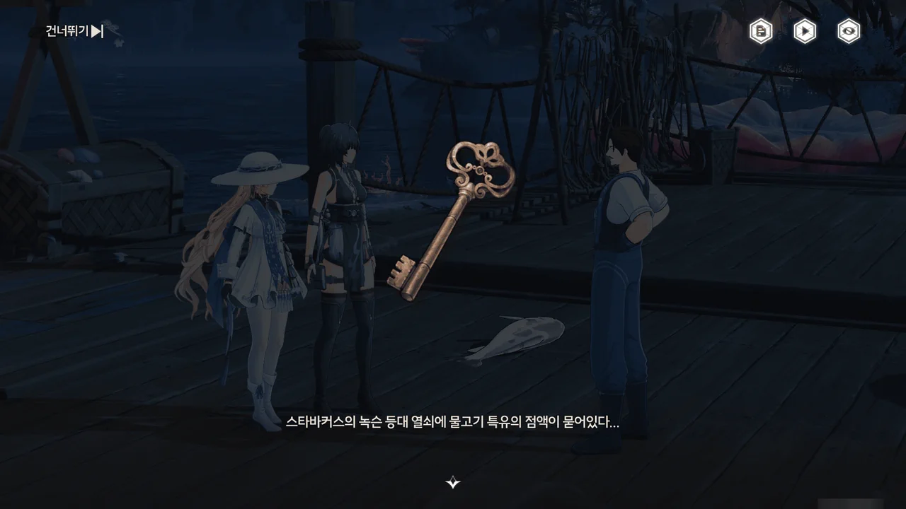
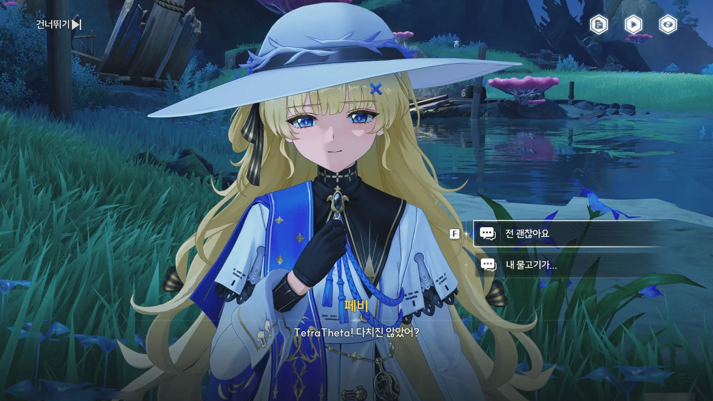











파란 생선에 정신을 빼앗긴 스타바커스를 일단 두들겨 팬 뒤, 그가 들고 있던 파란 생선 대신 방랑자가 낚아온 평범한 생선을 들려주었다.
예상대로 스타바커스는 다시 매혹당하는 일 없이 제정신을 차릴 수 있었다.









물고기를 잡으러 바다로 나간 스타바커스는 어떤 노랫소리를 듣고 마치 홀린 듯 회유의 고래가 잠을 자는 「고요한 만」으로 향했다.
바다 밑에서 회유의 고래와는 또 다른 큰 물고기의 그림자를 본 스타바커스는 갖고 있던 모든 걸 미끼로 써 그 물고기를 낚으려 했다.
물고기를 낚은 스타바커스는 점점 더 크게 들려오는 노랫소리를 듣고 그만 정신을 잃고 말았다.

그나저나 저거... 팔레스 스왑 한 로렐라이 아냐?









자신이 아합 선장이 맡긴 열쇠까지 미끼로 썼다는 걸 깨달은 스타바커스는 파란 생선의 배를 갈라 열쇠를 꺼냈다.
파란 생선에 손을 댈 때 또다시 매혹에 걸리는 게 아닐까 걱정했는데, 다행스럽게도 그런 일이 일어나지는 않았다.

스타바커스로부터 회유의 고래가 얼마 전 고요한 만에 나타났다는 정보를 드디어 얻었다.









어휴... 마흔일곱이나 나이를 먹고 저런 주책이라니...

커뮤니티를 돌아다니다 보면 저렇게 눈살이 찌푸려지는 글이 종종 보인다.
나이가 마흔이나 쉰 살이 될 동안 결혼을 하지 못한 남자가 회사에 새로 입사한 20대 젊은 여성들에게 치근대고, 여성들이 자신의 직책과 나이 때문에 그걸 단호하게 쳐내지 못하는 걸 보며 '이 여자도 분명 내게 마음이 있는 게 틀림없다'라고 생각하는 그런 글 말이다.

저런 걸 뭐라 부르더라... '영포티'? 아무튼 극혐이야, 정말.



> **조타륜 마을 등대의 열쇠**
> ***
> 조타륜 마을 등대의 열쇠. 조타륜 마을 등대를 작동시키는 데 사용할 수 있다.
> ***
> 「아, 이거 말씀하시는 거죠? 아합이 저한테 보존해 달라고 부탁한 물건인데, 그가 어디서 얻었는지 잘 모르지만... 어쩌면 그 고래와 관련이 있을지도 모르죠?」
{.bq}

아합이 왜 이 열쇠를 갖고 있었던 걸까?







조타륜 마을의 등대를 밝히자, 페쿼드호 설계도를 얻을 수 있었다.

> **「페쿼드호 설계도 · 상」**
> ***
> 「페쿼드호」 건조 작업을 지도하는 데 사용되는 기본 설계도
> ***
> 사실 섬의 어민들은 직접 눈으로 「페쿼드호」를 본 적이 없으며, 아합 선장에게서 그것이 바다에 가라앉은 배라는 말만 들었다.
> 현재의 설계도는 아합 선장이 라군나 선박 설계도를 참고하여 그린 것뿐이다.
{.bq}

그러니까 지금 아합 선장이 만들고 있는 페쿼드호는 원래 「페쿼드호」에서 이름만 계승한 새로운 배인 거네.







설계도를 포함한 각종 선박 건조 재료들을 퀴그에게 가져다주었다.
음, 이제 퀴그가 말을 좀 듣기 좋게 하네. 또 저번처럼 말을 싹수없게 했으면 정말 기분이 나빴을 텐데 말이다.

> 그 「대어」는 바로 고요한 만에 있어요.
> 저흰 이미 실패했지만요...

음... 그러니까 아합 선장을 비롯한 페쿼드호의 선원들이 한때 회유의 고래를 잡으려 했다는 건가? 왜?



> 배가 괜찮아지니까, 아합의 창이 사라졌어.
> 아합이 배가 수리되기만 하면 우리 모두 집으로 돌아갈 수 있댔어.
> 선장인 아합의 말이니 틀림없어.

음... 뭔가 좀 불안한데.















고요한 만에 도착하자, 회유의 고래가 방랑자와 페비가 타고 있던 「라젤호」를 뒤집어 버렸다.
이 망할 놈이... 리나시타에 처음 왔을 때에도 그러더니만, 제 버릇 개 못 준다더니, 아주 딱 그 짝이네.

그런데 정작 방랑자와 페비가 잃어버린 물건은 없고, 오히려 방랑자의 소지품에 눈이 이상한 빛으로 빛나는 물고기가 하나 생겼다.
설마 회유의 고래가 이걸 의도한 건 아니겠지?

바다에 대해 잘 알고 있을 「플랑크 씨」에게 이 물고기의 정체를 물어보려 했다.
하지만 「플랑크 씨」는 고요한 만의 등대 열쇠는 바닷속에 빠져 잃어버린 지 오래이며, 자신 역시 이 이상한 물고기에 대해 조사하고 있다는 아합의 전갈만을 전해주었다.









이상한 물고기를 잔뜩 잡아 잃어버린 등대 열쇠를 찾은 후, 등대를 다시 밝혔다.

회유의 고래가 서쪽 섬으로 향하는 걸 확인했다.
페비가 걱정하던 대로, 상처가 다 낫지 않은 모양이다.





페쿼드호의 수리가 모두 완료되었다.
이렇게 배 수리가 금방 끝날 것이다면 왜 아합 선장은 여태껏 배를 수리하지 못한 걸까?
그리고 왜 아합 선장이 페쿼드호의 선장을 맡지 않는다는 거야?



> 아합, 페쿼드는 이미 다 고쳤어요.
> 아합, 이제 우리 모두를 데려가실 수 있어요.
> 이제 돌아가요...

아까도 느꼈던 거지만, 페쿼드호의 선원들에겐 내가 아직 알지 못하는 비밀이 있나 보다.
예전에 아합 선장이 중얼거렸던 내용이나 퀴그의 말이 마치 성불하지 못한 원령(怨靈)이 말하는 것만 같다.

그리고 '이리야의 예언'은 대체 무슨 뜻일까?









> 난 늙었어... 스타바커스... 난 늙었네...
> 「알바트로스」도 침몰시키세... 이번에 내가...

거 봐. 진짜 뭔가 유령이 말하는 것만 같다니까?

회유의 고래가 향한 '서쪽 섬'은 「레예스 유적」이라 불리는 곳으로, 거친 폭풍이 섬 주위를 둘러싸고 있어 접근이 불가능하다고 한다.
하지만 스타바커스가 찾은 방법을 이용하면 그 폭풍을 잠재울 수 있는 모양이다.
그런데 그게 세이렌과도 관련이 있다고...?







레예스 유적을 바라보고 있는 섬에는 다음과 같은 내용이 적힌 비석이 세워져 있었다.

> 리졸리, 등불로 바다의 별을 비춰라.
> 레예스의 아래에서 깊이 잠든 찬탈자여, 레예스의 후예들과 바닷속 불멸의 물고기들에게 사랑을 선사하라.

'바다의 별'은 리나시타 전체에서 가장 깊은 해저 구역이 있는 리졸리 군도를 뜻한다고 한다.

하지만 그다음 줄은 페비도 잘 모르겠다고 하네.

















아합 선장과 방랑자가 비석에 대고 어색하기 짝이 없는 사랑을 읊어보지만, 전혀 효과가 없었다.
하지만 스타바커스가 ~~[만년동정](https://i.imgur.com/7Oynji4.png)의 힘을 담아~~ 진심으로 사랑을 노래하자, 정말로 폭풍이 사그라들고 섬으로 향하는 길이 열렸다.
이게 바로 동정의 힘인 건가?







페비 역시 아합 선장이 이상하다고 생각했구나.

아합 선장이 숨기고 있는 건 그의 과거와 관련한 일 같은데, 그가 순순히 입을 열 것 같지는 않다.











이유는 잘 모르겠지만, 아합 선장은 수리가 끝난 페쿼드호의 선장을 맡지 않았다.
대신 다른 선장을 부른 모양인데... 대체 누굴까?

지금 아합 선장은 세이렌을 잡을 생각인 것 같다.
저번에 퀴그가 이야기하길, 페쿼드호는 회유의 고래를 잡으려다 실패했다고 한다.
꿩 대신 닭이라고, 회유의 고래 대신 세이렌이라도 잡으려는 걸까?





바다에서 세 가지 선물을 찾아내 바치면 이 섬의 등대에 걸린 봉인을 풀고 등대를 밝힐 수 있는 모양이다.
