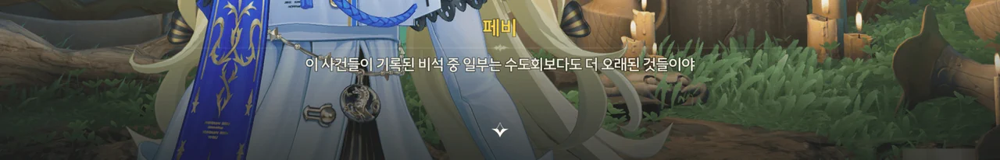
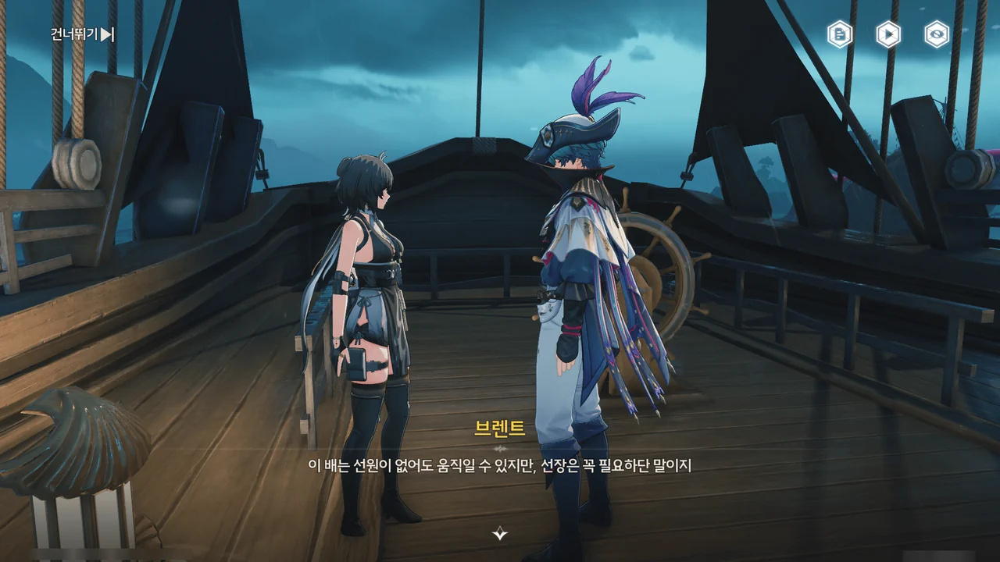
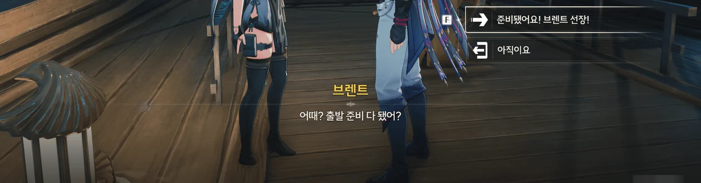









... 설마 했는데 정말 유령이 있었을 줄이야.
레예스 유적의 유령들에게 물고기를 가져다 바치니, 등대의 봉인이 하나씩 풀린다.
설마 다들 맛있는 생선을 못 먹어서 성불하지 못한 건 아니겠지.

그리고 마지막 봉인을 풀자, 등대에 다시 불이 밝혀졌다.
대체 등대에 어떤 기능이 붙어 있길래 회유의 고래가 더 이상 아파하지 않는 걸까?









페비가 레예스 유적의 비석에 적힌 이야기를 들려준다.

> 바다 밑에 묻힌 배와 선원들을 후세로 이끄는 건 회유의 고래의 일이었지만 불안정한 성격 탓에 슬픔과 분노를 담은 노래가 폭풍과 어둠을 불러왔대.
> 임페라토르의 등불로 정신을 차리고 나서야 물고기 떼와 바다를 지킨 거야.
{.bq}

그러니까 회유의 고래는 임페라토르가 바다에서 죽은 망자들의 잔향을 잘 처리하라고 보낸 것이었지만, 더러운 성격 탓에 오히려 폭풍으로 사람들을 죽이고 다녔다는 거네.
그러다가 임페라토르의 '받아랏, 최면 비이임!'으로 성격이 얌전해진 거고.

해야 할 일과 정반대의 일을 벌이고 다닌 회유의 고래나, 그걸 최면 빔으로 얌전하게 만든 임페라토르나... 다들 제정신이 아냐...









스타바커스를 홀린 세이렌의 정체 역시 비석에 적혀 있었다.

그 세이렌은 로렐라이와 같은 종류의 울림 생물로, 아직 작고 약한 미성숙 개체라 회유의 고래와 공생 관계를 맺고 있었다고 한다.
하지만 회유의 고래가 리졸리 군도를 떠난 탓에 바다의 망자의 잔향이 세이렌의 몸에 누적되었고, 그 탓에 사람들을 홀리게 된 것이라고 한다.
하지만 공생 관계가 거짓은 아니라는 듯이, 회유의 고래가 입은 부상을 치유해 준 것도 세이렌이었다.

그러니까 회유의 고래가 할 일을 하지 않고 놀러 다녀서 생긴 일이라는 거네. 네 탓이군, 회유의 고래!







아합 선장이 감쪽같이 사라졌다. 그 자리에는 쪽지 한 장만이 덩그러니 놓여있었고.

"나를 죽였던 소용돌이"라고 한 걸 보면, 아합 선장과 페쿼드호 선원들은 정말 유령이었던 것 같은데?





페쿼드호가 수리되었다는 소식을 듣고 방랑자를 따라온 이슈마이어 역시 아합 선장을 보지 못했다.











음... 브렌트의 말을 들어 보면, 페쿼드호의 선장은 역시 아합 선장이 맞는 것 같다.
방랑자는 일등 항해사, 브렌트는 조타수 역할을 맡았고.

브렌트가 "보아하니 이 배도 너랑 인연이 꽤 있나 보네"라고 말한 걸 보면, 브렌트는 페쿼드호에 얽힌 이야기에 대해 뭔가 알고 있는 것 같다.

그리고 그 와중에 스타바커스는 방랑자의 「리젤호」를 타고 세이렌을 만나러 무작정 떠난 모양이다.
아니, 정말로 세이렌과 사랑에 빠진 거였어?

... 난 정말 모르겠다. 이 배의 선장이 대체 누구인 거야?







어째서 이 장면이 눈에 익은 것 같다고 생각한 건지 궁금해했는데, 캐리비안의 해적에서도 비슷한 장면이 나왔다.















거친 소용돌이에 휘말린 페쿼드호는 다시 *원래 상태*로 돌아가버리고 말았다. 산산이 조각났다는 말이다.
아니, 기껏 다시 만들어놨더니만! 내 재료! 내 코인!

페쿼드호에 탄 사람들이 도착한 곳은 바닷속의 한 공간.
회유의 고래와 세이렌이 벽을 타고 내려온다.
그나저나 저 세이렌의 이름이 '로렐라이의 권속 · 심해의 후손'이었구나. 로렐라이의 권속이라니, 괜히 로렐라이와 닮았던 게 아니었어.

방랑자에게 덤벼드는 세이렌을 흠씬 두들겨 패자, 세이렌이 비겁하게 다시 바다로 도망간다.
치졸하게 도망갈 때 벽을 무너뜨려 방랑자 일행을 통째로 수장시키려 한 것은 덤이다.







회유의 고래가 방랑자 일행을 뭍으로 옮겨준 덕분에 '졌다! 명조: 워더링 웨이브 끝!' 엔딩이 나는 일은 없었다.



"이번에도"? 그러면 페쿼드호가 이렇게 다시 만들어졌다 부서진 게 이번이 처음이 아니란 거야?







완전히 회복된 회유의 고래가 밝힌 일의 진상 역시 비석에 쓰인 그대로였다.

세이렌이 회유의 고래 대신 잔향을 흡수하다가 너무 많은 양을 흡수하는 바람에 정신을 잃고 난폭해졌다.
회유의 고래가 이를 타이르고 싶어도 세이렌이 자신의 부상을 치유해 준 터라 큰 소리를 낼 수 없었고.











역시나, 페비가 회유의 고래를 찾아다닌 건 수도회와 잔성회에게 고통받은 회유의 고래에게 사과하고 싶어서였다.

하지만 회유의 고래는 애당초 사람들을 미워하지 않았고, 오히려 페비가 자신을 쫓아다니며 어민들을 도운 것을 매우 좋게 보고 있었다.
그러면서 "주는 것이든 베푸는 것이든, 신념이든 희망이든, 스스로를 잃지 마세요"라는 덕담도 건네준다.











방랑자가 회유의 고래에게 "언젠가는 제가 당신을 낚아도 될까요?"라고 농담을 건네자, 회유의 고래는 한 번 해보라는 듯이 피식 웃으며 방랑자 ― 정확히는 아까부터 계속 깐족대던 포포 ― 를 향해 시원한 파도를 안겨주고 떠났다.

















회유의 고래가 정상으로 돌아오자, 아합 선장을 비롯한 페쿼드호의 선원 모두가 감쪽같이 사라졌다.
이슈마이어는 아합 선장이 남긴 수첩에 적힌 내용을 토대로 아합 선장의 행적을 되짚어보기로 한다.

한참이 지난 후, 이슈마이어는 아합 선장과 페쿼드호 선원들이 사실 수십 년 전 죽은 사람이란 걸 알게 되었다. 아마 회유의 고래가 직무유기를 하는 동안 쌓인 잔향 때문에 다시 세상 밖으로 나올 수 있었던 거겠지.
아합 선장의 수첩에 적힌, 페쿼드호의 선원들이 그토록 찾던 '마지막 항구'는 어쩌면 '안식'이 아니었을까.

그래도 모든 게 한여름밤의 꿈처럼 사라진 건 아니었다.
아합 선장이 방랑자에게 물려준 「리젤호」, 원래부터 리졸리 군도 토박이였던 이슈마이어, 그리고 모두와 함께 겪었던 추억이 남았으니까.

&nbsp;

잠깐만. 그러면 스타바커스는 죽을 때까지 47년 동안 동정이었고, 잔향이 되어서도 끝내 동정을 벗어나지 못했던 거야?
... 잠깐 눈물 좀 닦아야겠네.

아무튼, \[노인, 물고기와 바다\] 임무 끝!
