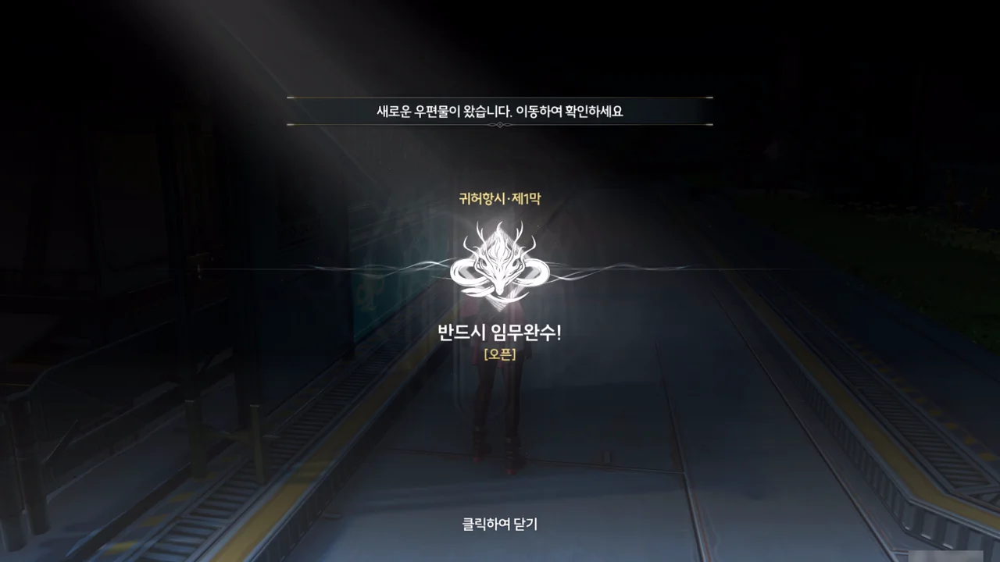
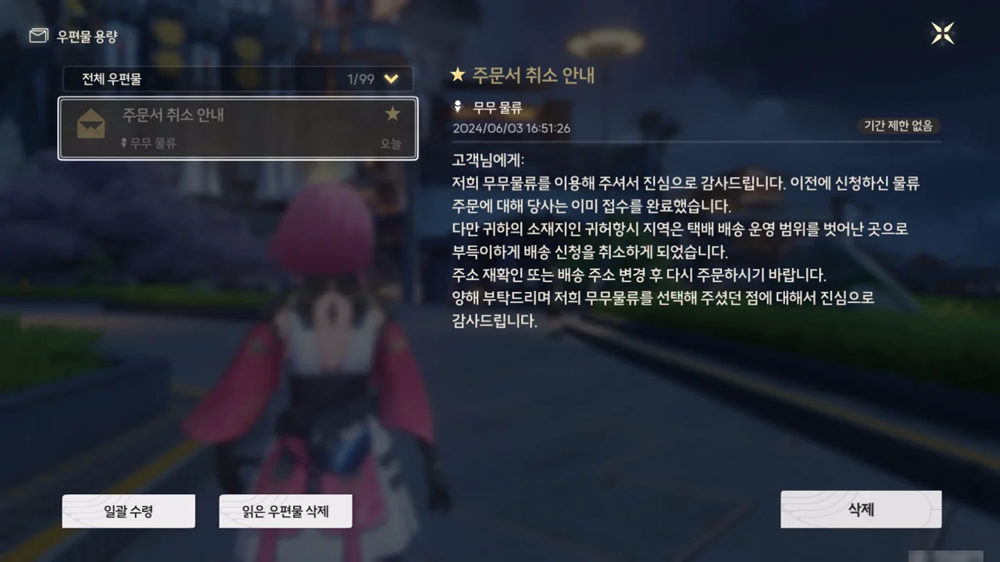
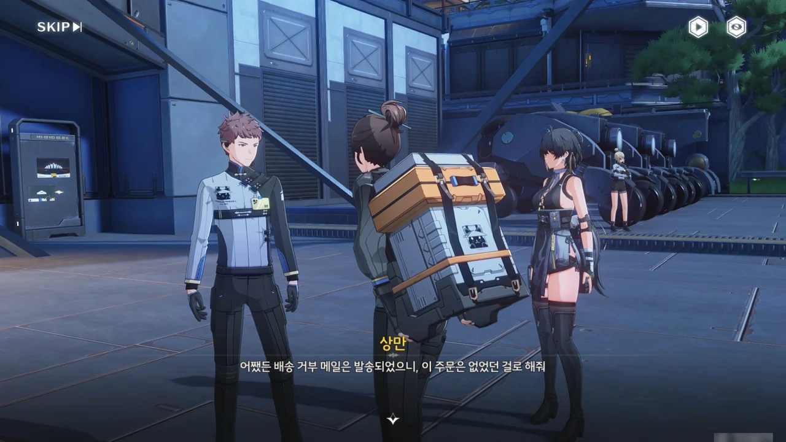
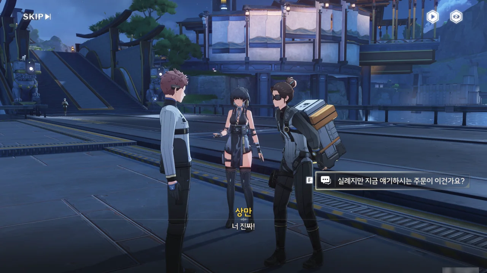
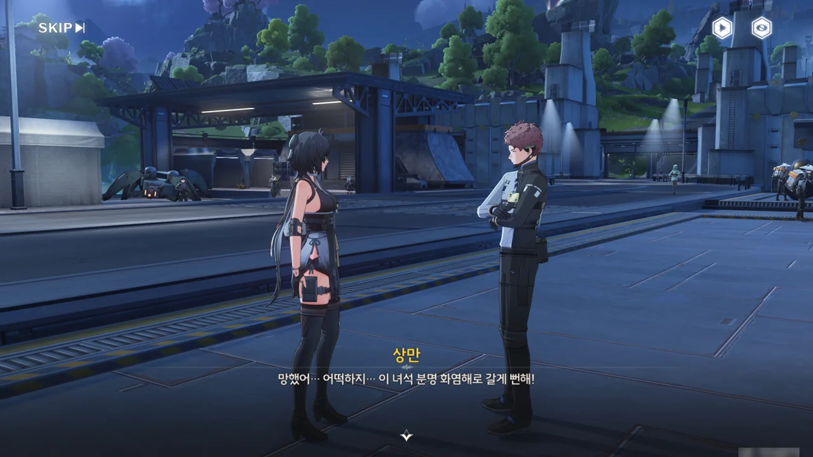



혹시 조사를 해야만 열리는 임무가 있을까 싶어, 금주성 곳곳을 들쑤시고 다니던 중, 기묘한 지명수배를 발견했다. 이거, 지옥불 기사잖아. 이걸 잡으라고?

앙코에게 5성 지옥불 기사 에코를 주기 위해 여태껏 수도 없이 지옥불 기사를 잡고 다녔으니, 저 10만 클램 코인은 내 것이나 다름없다.

지명수배를 다 읽고 나니, '우드로'라는 이름의 조수 기상 학자가 나타나 지명수배에 대한 이야기를 했다. 지명수배를 내건 것이 바로 우드로였던 모양이다.

이게 위험한 임무인지 모르고 사진을 찍지 않은 채 대화를 넘겼다가 '귀허항시 · 제1막'이라는 문구를 보고 이마를 탁 쳤다. 사진 찍어둘걸!

아무튼, 귀허항시 제1막 \[반드시 임무완수!\] 오픈!

그런데 웬 우편?



응? 무무물류에 뭔갈 주문한 적이 없는데 왜 주문 취소 메일이 온 거지?

일단 무무물류가 귀허항시 지역을 택배 배송 운영 범위에서 제외했다는 것만 담아두기로 했다.











상황을 보아하니, 귀허항시 화염해에서 음식 1인분과 약, 따뜻한 옷을 배달해 달라는 주문이 들어오자, 화염해가 위험한 곳임에도 기어이 의뢰를 수락하겠다는 미미카와, 위험한 곳에 직원을 보낼 수 없다는 상만이 서로 말싸움을 하다가, 상만이 일방적으로 주문을 취소한 모양이다.

그런데 상만이 보냈다는 그 메일, 주문자가 아닌 방랑자에게 왔다.







왜 배달 거부 메일이 주문자가 아닌 방랑자에게 왔냐면, 메일을 보내려는 상만과 이를 막으려는 미미카가 서로 몸싸움을 하던 도중, 메일이 방랑자에게 오발송 되었기 때문이다.

정보는 다양한 출처에서 들어두는 것이 좋으므로, 화염해에 대해 어느 정도 알고 있음에도 화염해에 대해 모른다고 말했다.



유독한 꽃가루를 뿜어내는 화염꽃으로 된 꽃바다가 화염해라고 한다. 음, 이미 알고 있던 정보라, 큰 소득은 없네.

지도를 봤을 때, 물이 아님에도 火炎海라는 지명이 붙어 이상하다 생각했는데, 화염해에 흐드러지게 핀 화염꽃을 밟으면 틱 단위로 체력이 사정없이 깎여나간다. 그래서 화염해를 무사히 돌아다니려면 곳곳에 놓인 건물과 차량 잔해를 밟고 돌아다녀야 하니, 거길 '바다'라고 부르는 것도 무리는 아니다.

거기에 한술 더 떠서, 잔상은 꽃가루의 영향을 받지 않는다. 그래서 꽃바다 한가운데에 있는 잔상과 싸우게 되면 난 꽃가루 때문에 실시간으로 체력이 깎여나가지만, 잔상의 체력은 내가 때리지 않는 한 변화가 없다. 더럽지.





미미카는 주문자가 무무물류에게 주문한 건 무무물류 말고는 화염해까지 물품을 배송할 수 있는 업체가 없다고 생각해서일 거라며 배달을 가겠다고 계속 고집을 부린다.





그놈의 「반드시 임무완수!」 슬로건이 대체 뭔지, 미미카는 상만의 태블릿을 빼앗고 그대로 화염해로 향했다.

기업의 슬로건을 곧이곧대로 믿는 사람이 있나?















귀허항시 화염해를 배송 운영 범위에서 제외한 건 무무물류 금주 지부의 독단적인 결정이 아니라, 무무물류 본사 차원의 정책이라고 한다.

귀허항시 지역을 침식해 그곳에 살던 사람들을 강제로 내쫓은 화염꽃의 꽃가루가 귀허항시에 발생한 중력 폭풍을 타고 높은 곳의 구름에 섞일 시, 금주 전역과 인근 지역에 피해를 줄 것이라는 조석 기상 연구센터의 조사 결과가 나오자, 화염꽃의 핵심 성흔을 파괴해 꽃가루 확산을 막는 작전이 수립되었다. 이를 위해 화서연구원은 성흔을 파괴할 수 있는 폭발 장창을 개발했다.

하지만 때마침 들이닥친 잔상류 때문에 거의 모든 야귀군 병력과 흑석 차량이 최전선에 배치되었던 탓에, 폭발 장창을 화염해를 넘어 운송할 수 있는 흑석 차량은 무무물류의 것밖에 없었다.

야귀군과 무무물류 직원들이 최선을 다했음에도 불구하고, 목적지에 제시간 안에 도달한 건 폭발 장창 한 자루뿐이었다. 이후 대부분의 야귀군은 철수하는 무무물류 직원들을 보호하기 위해 투입되었고, 나머지 야귀군은 릴레이 방식으로 장창을 직접 운반하며 성흔으로 돌진했다. 이 과정에서 많은 야귀군이 꽃가루를 너무 많이 흡입한 탓에 오버클럭을 일으켰다.

겨우 장창을 성흔에 꽂는 데 성공했지만, 장창이 운반 도중 손상된 탓에, 장창의 끝이 성흔에 박히고도 폭발하지 않아, 성흔을 완전히 파괴하는 데에 실패했다. 하지만 성흔에 심각한 손상을 줘, 화염꽃의 확장이 멈추고 꽃가루 농도도 심각한 수준에서 떨어졌다고 한다.

살아남은 무무물류 직원들은 자신들의 실수로 야귀군 병사들이 목숨을 바쳤다고 생각하며 아직도 후회하고 있으며, 무무물류 역시 큰 주문에는 강한 전투력을 가진 공명자를 반드시 배치하도록 했다.





지나간 일은 지나간 거고, 일단은 화염해로 무작정 떠난 미미카를 찾아 나서기로 했다.
