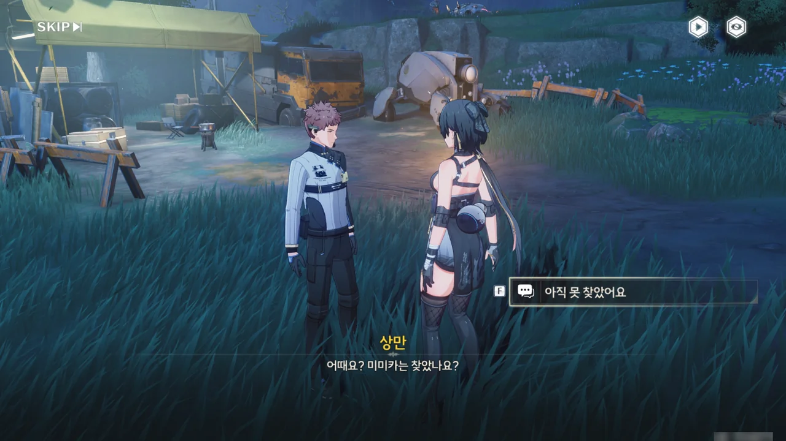







주변을 뒤져보았지만, 미미카를 아직 찾지 못했다.

비록 공명자가 화염꽃 꽃가루의 독성을 짧은 시간 정도는 견딜 수 있다고는 하지만, 꽃가루에 장시간 노출되면 심각한 영향을 받을 거라며, 미미카의 위치를 찾을 방법을 고민하는 상만에게 혹시 미미카가 가져간 상만의 태블릿에 위치 추적 장치가 달려 있냐고 물어보았다.

위치 추적 장치의 정보에 따르면, 현재 태블릿은 화염해 가장 깊은 곳에 그대로 멈춰있다. 설마 미미카가 잔상이나 꽃가루 때문에 움직이지 못하게 된 걸까?

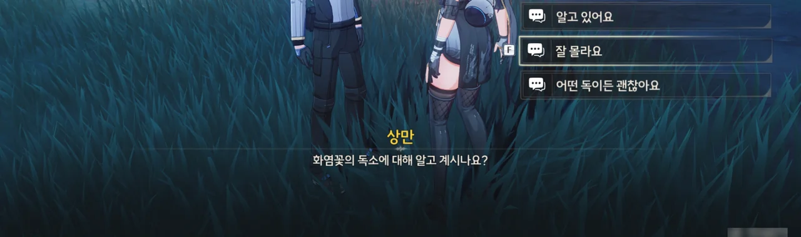

화염꽃 꽃가루의 독성에 대해 더 알아서 나쁠 건 없지. 일부러 모른다고 말했다.



화염꽃 꽃가루를 흡입하면 강한 작열통을 느낀다고 한다. 하지만 꽃가루가 지표면에 고여있기 때문에, 꽃밭에만 들어가지 않는다면 크게 위험하지 않다.

꽃가루의 온도가 실제로 그렇게 뜨겁지는 않을 테니, 꽃가루에 캡사이신 같은 화합물이 들어있는 모양이다. 캡사이신은 촉각 수용기 중 통증 수용 단백질인 TRPV1과 결합해 작열통을 주는 물질인데, 강한 통증 때문에 마음이 흐트러져 오버클럭이 일어나기 더 쉬워졌다고 생각하면 꽤 그럴듯해 보인다.





미미카가 다시 여기로 돌아올 가능성을 생각해, 상만은 여기에 남고 방랑자 혼자 화염해로 진입하기로 했다.

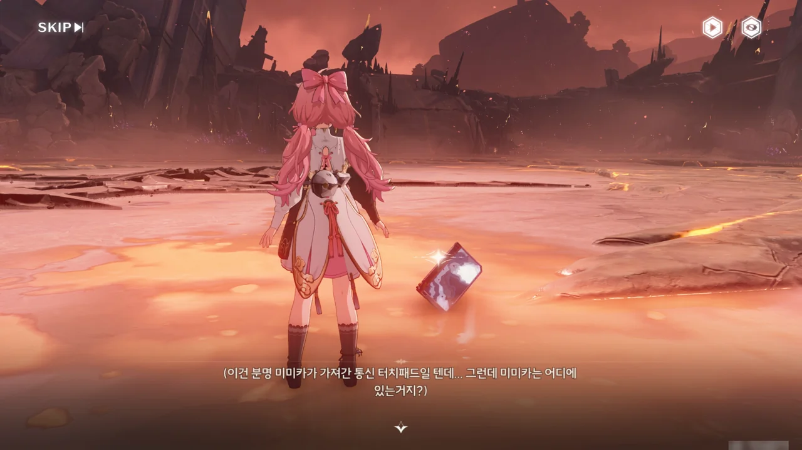

여긴 지옥불 기사가 나오는 곳인데... 대체 미미카는 어디 가고 태블릿만 덩그러니 놓여있는 걸까?

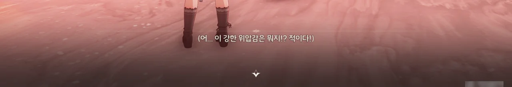

뭣.



대폭발을 일으키며 화려하게 등장하는 지옥불 기사. 너, 평소에는 안 이랬잖아.

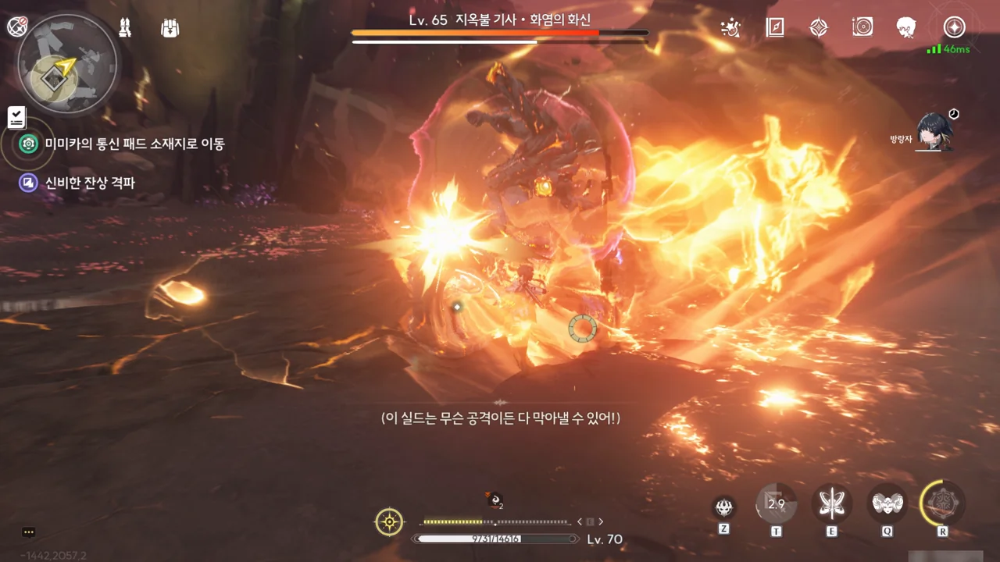

심지어 이 자식, 치사하게 무적 실드를 갖고 있다. 너, 원래 안 이랬잖아! 이게 뭔...

이건 사기야! 사기라고! 혼자 싸우는 것도 서러운데 보스가 무적 실드를 들이대는 건 선 넘었지!



방랑자 컷.



낯선 천장이다. 그런데 우드로 네가 왜 여기에 있니?

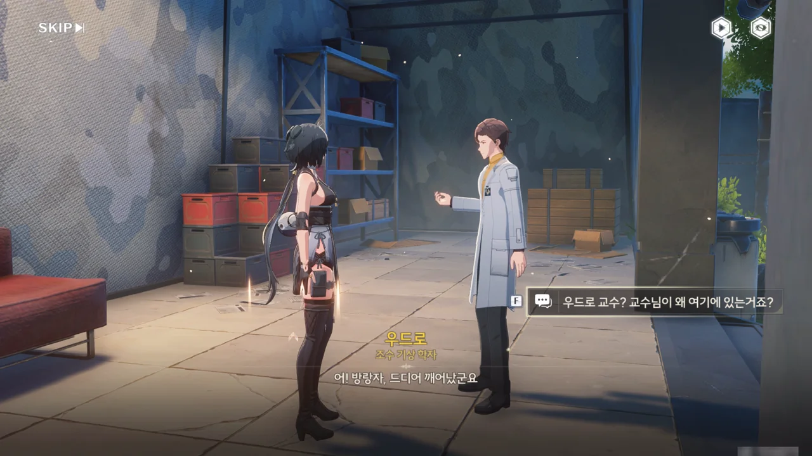



방랑자가 지옥불 기사와 전투 후 의식을 잃고 쓰러진 걸 무무물류 사람들이 귀허항시 기상 관측소로 데려왔다고 한다. '사람들'이라고 한 걸 보면, 미미카를 찾은 건가?

지옥불 기사가 왜 지옥불 기사인지 이제 알게 되었다. 잔상의 모습이 마치 오토바이를 탄 기사처럼 생겨서라고 한다. 우드로가 그 이름을 붙인 모양이다.







최근 우드로는 귀허항시의 중력 폭풍이 화염해의 꽃가루를 높은 곳의 구름까지 휘감아 올리는 현상을 관측했다고 한다. 꽃가루의 농도가 핵심 성흔의 손상 때문에 이전보다 약하다는 것 빼고는 몇 년 전의 상황과 동일하다.

우리가 보는 화염꽃은 핵심 성흔에서 생겨난 동물형 잔상의 말단에 불과하기 때문에, 꽃가루의 생성을 막기 위해선 화염꽃이 아니라 핵심 성흔 자체를 파괴해야 한다고 한다.

하지만 그렇지 않아도 가뜩이나 꽃가루와 잔상 때문에 핵심 성흔에 다가가기 어려운 상황에, 지난번의 작전 실패 이후 탄생한 지옥불 기사 때문에 성흔 공략이 더더욱 어려워지자, 우드로는 지명수배를 통해 지옥불 기사를 상대할 수 있는 공명자를 모집하려 했다고 한다.

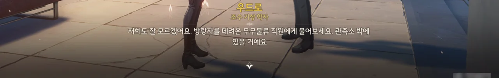

방랑자가 누가 자신을 구한 거냐고 묻자, 방랑자를 데려온 무무물류 사람들에게 직접 물어보라고 한다.

미미카를 만나면 한바탕 훈계를 하겠다는 저번 말대로, 상만이 미미카를 꾸짖고 있다.







우느라 정신없는 미미카를 대신해, 상만이 무슨 일이 있었는지 설명해 준다.

주문자를 찾던 미미카는 갑자기 불어온 중력 폭풍 때문에 태블릿을 놓쳤다고 한다. 태블릿은 중력 폭풍을 따라 화염해 중심부까지 날아갔고, 미미카는 길을 잃고 돌아다니다 상만을 만나 화염해에서 나올 수 있었다고 한다.

그런데 상만의 말을 들어보면, 다름 아닌 상만이 방랑자를 화염해에서 꺼내온 것 같다. 방랑자조차 이기지 못한 잔상을 대체 상만이 어떻게 이긴 거지?





상만은 그저 지옥불 기사 몰래 방랑자를 데리고 도망온 거라고 말하지만, 그것 역시 대단한 일이다. 방랑자가 쓰러진 곳이 지옥불 기사의 영역이었으니까.





귀허항시의 일을 너무 잘 알고 있어 이상하다고 생각하고 있었는데, 사실 상만은 핵심 성흔 공격 작전에서 폭발 장창을 운반하는 역할을 맡은 택배원 중 하나였다고 한다.

당시 무슨 일이 있었는지 두 눈으로 똑똑히 본 상만은 지옥불 기사가 핵심 성흔 공격에 참여한 야귀군들이 오버클럭을 일으킬 때 생겨난 무음구역에서 생겨난 거라고 보고 있다. 그의 말마따나, 당시 작전에 참여한 야귀군들의 강력한 의지가 되려 지금 핵심 성흔을 파괴하는데 큰 장애가 되고 있는 셈이다.









상만의 이야기를 들은 미미카는 그럼 이 일이 무무물류와 아무 상관이 없는 게 아니니, 핵심 성흔을 파괴하는데 도움을 줘서 과거의 아쉬움을 달래고 못다 한 「사명」을 다하자고 제안한다. 물론 상만은 수익성 없는 일에 직원의 생명과 안전을 내놓을 수 없다며 펄쩍 뛰며 반대한다.

하지만 미미카의 말처럼, 이대로 핵심 성흔을 방치했다간 화염꽃의 꽃가루가 금주 전체와 인근 지역에 퍼지게 생겼다.









상만과 미미카의 말을 잠자코 듣고 있던 방랑자가 묘책을 내놓는다. 바로 지옥불 기사를 잡고 얻을 10만 코인으로 무무물류를 고용하는 것이다.

10만 코인이면 배달원 한 명과 그 자식, 손자가 평생 일해도 벌지 못하는 거금이니, 수익성이 없다는 말은 절대 나올 수 없다. 이 정도면 꿩 먹고 알 먹고 도랑 치고 가재 잡고인 상황 아닐까?

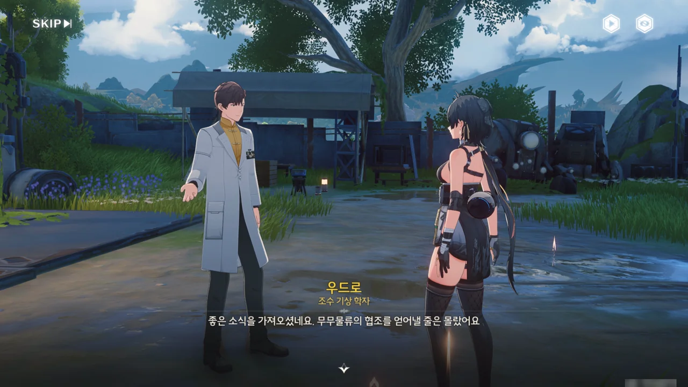





무무물류의 협력을 구하는 데는 성공했지만, 지옥불 기사의 무적 실드는 여전히 걸림돌이다. 명식을 상대할 수 있는 방랑자조차 지옥불 기사의 무적 실드를 뚫지 못하니, 골치가 아프다.

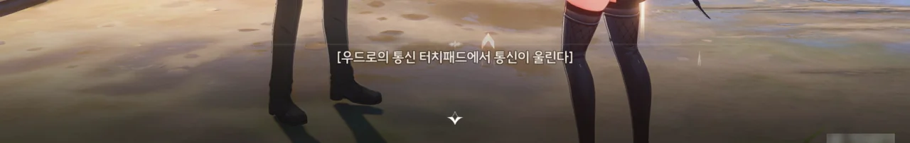

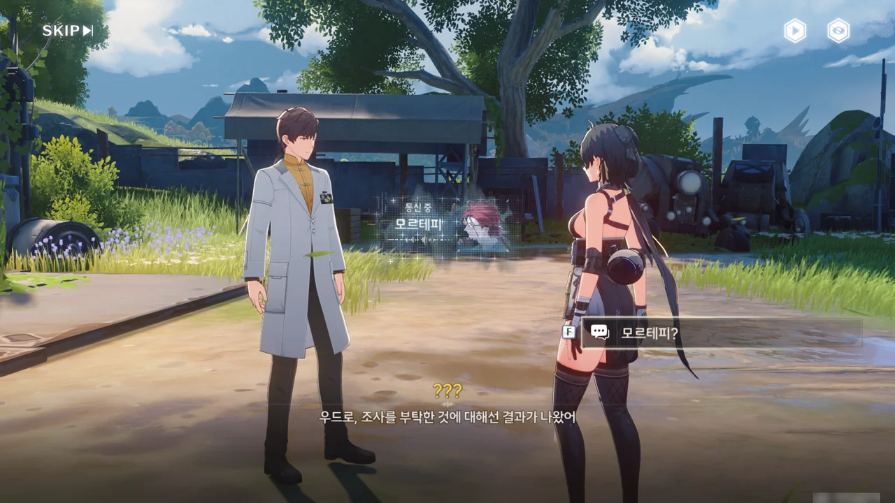

응? 모르테피? 네가 왜 여기서 나와?





모르테피의 말에 따르면, 귀허항시에는 예전 작전 때 사용한 폭발 장창의 예비 부품이 남아 있기 때문에, 이걸 조립해서 사용하면 지옥불 기사의 실드는 물론이요 화염해 핵심 성흔까지 파괴할 수 있을 거라고 한다.

그럼 남은 건 그 폭발 장창을 화염해까지 안전하게 수송하는 건가?





조수 임무를 할 때 '직정 유적'이라는 단어가 나와, 나는 직정이 지금은 없는, 역사가 오래된 연구 조직인 줄 알았다. 그런데 지금 모르테피의 말을 들어보면 직정은 여전히 존속 중인 조직으로 이해된다. 하... 번역이 진짜...

아무튼, 폭발 장창은 직정 「오렌지 박스」 소속 과학자가 화서연구원과 협력하여 만든 무기로, 오직 화력에만 집중해 실용성과 안전성은 내다 버렸다고 한다. 그러면 화력 하나는 확실하겠네.

> 직정 사람들은 상상력이 풍부하여 엉뚱한 생각들을 많이 하지. 그리고 그중에서도 「오렌지 박스」의 결과물이 가장 터무니없었고.

모르테피의 설명을 들어보면, 「오렌지 박스」의 모티브가 된 건 록히드 마틴의 '스컹크 웍스'와 DARPA가 아닐까 생각된다. 엉뚱한 생각이 무시당하지 않는다는 점에서 스컹크 웍스의 자율방임적인 느낌이 나고, 그걸 실제로 구현해 낸다는 점에서 DARPA가 연상된다.





당시 안전을 위해 세 개의 연구소에 나눠 보관했다는 폭발 장창의 부품을 회수하기로 했다.

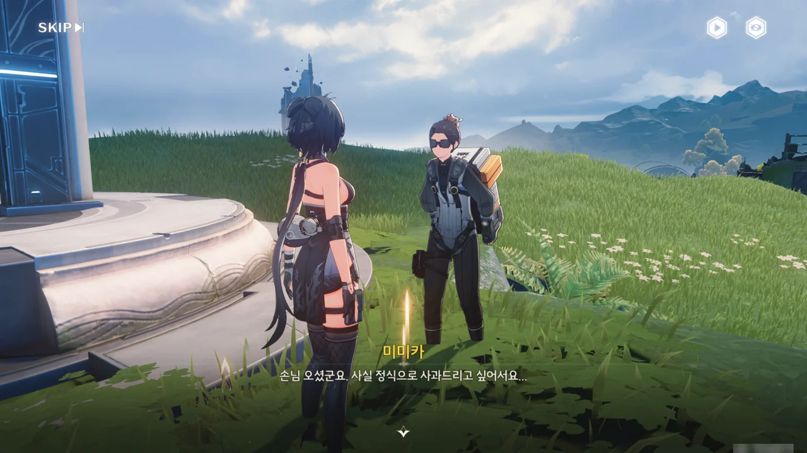











미미카가 자신의 제멋대로인 행동 때문에 방랑자가 하마터면 목숨을 잃을 뻔했다며 정식으로 사과한다.

그런데 미미카가 화염해에서 도움을 청하는 여자아이의 목소리를 들었다고 한다. 사람 목소리를 흉내 내는 잔상이 없는 건 아닌데... 일단 가보는 게 좋지 않을까. 설마 그게 잔상이라고 하더라도, 지옥불 기사처럼 무적 실드를 갖고 있진 않을 거 아냐.
