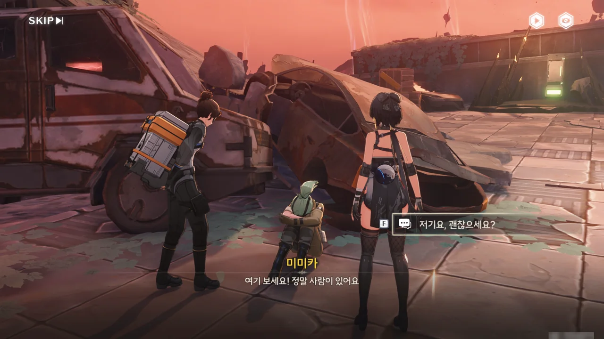



와, 정말 사람이 있었네? 그게 추방자일줄은 몰랐지만...

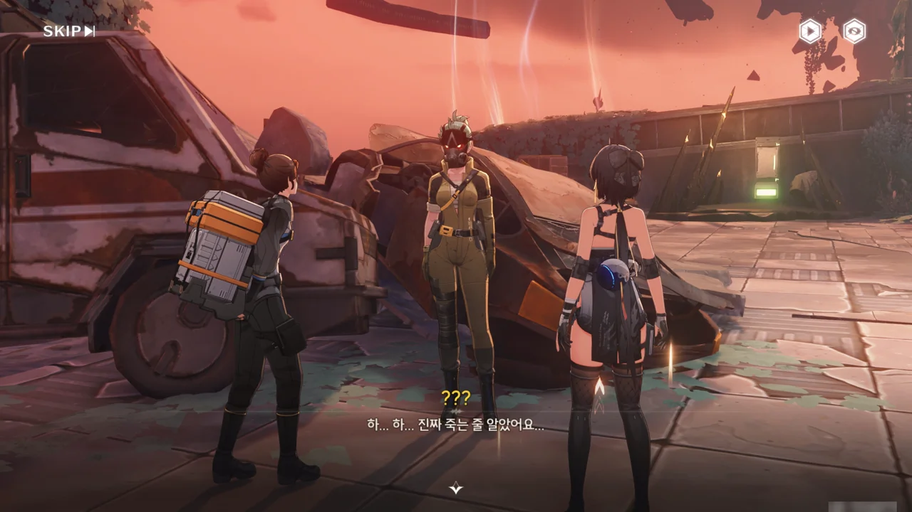









이 사람의 이름은 유니. 어쩌다 여기에 온 건진 기억이 나지 않지만, 일어나 보니 주변에 화염꽃이 가득해 나갈 수 없었다고 한다. 중력 폭풍의 영향 때문인지, 다른 사람들과 연락이 닿지 않는 와중에 오직 무무물류 배송 전화만 연결이 되어, 당장 필요한 물건만 자동 주문 서비스로 신청했고, 그게 상만과 미미카가 다투던 주문의 정체였다.

다행이네. 이 주문이 잔상의 속임수 같은 게 아니라서.

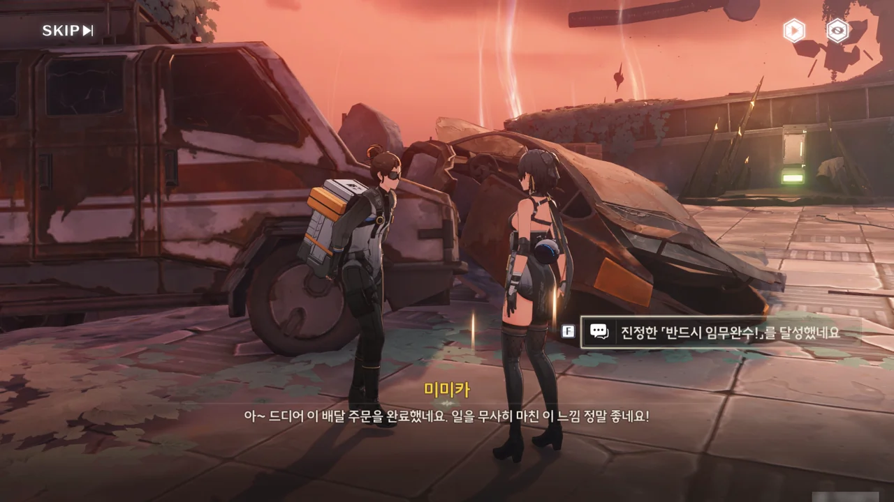













미미카 역시 한때 무무물류의 슬로건, 「반드시 임무완수!」를 단순한 홍보 슬로건일 뿐이라 생각했다고 한다.

하지만 그녀가 18번째 생일을 넘긴 지 얼마 되지 않았을 때, 이미 죽고 없는 아버지가 보냈다는 인형을 10번째 생일 선물로 받고 난 후, 「반드시 임무완수!」라는 슬로건은 그녀에게 특별한 의미를 가지게 되었다.

선물을 받기 8년 전, 그녀의 아버지는 잔상류와의 전투에서 동료를 엄호하다 계곡에 떨어져 중상을 입었다. 지나가던 무무물류 직원에게 발견되었지만, 이미 상처가 너무 깊어 가망이 없는 상태. 죽기 직전까지 딸을 걱정한 미미카의 아버지는 무무물류 직원에게 마지막 의뢰를 했다. 곧 열 살을 맞는 자기 딸에게 인형을 배달해 달라는 것이었다.

미미카의 아버지는 주소와 신원을 밝히지 못하고 죽었고, 몸에 있는 표식조차 모두 잃어버린 상태였기에 직원이 미미카에게 생일 선물을 배달하는 건 불가능에 가까웠다. 하지만 그 직원은 끝까지 포기하지 않고 일하는 내내 미미카의 아버지가 말한 '곧 열 살을 맞는 딸'을 찾으려 노력했고, 8년이란 긴 시간 끝에 그 의뢰를 완수하는 데 성공했다.

무무물류 직원에게 아버지의 생일 선물과 함께 아버지의 마지막 모습을 전해 들은 미미카는 끝까지 의뢰를 포기하지 않는 무무물류의 모습에 큰 감명을 받아, 무무물류에 입사해 회사의 슬로건대로 배달을 완료하겠다는 포부를 갖게 되었다고 한다.

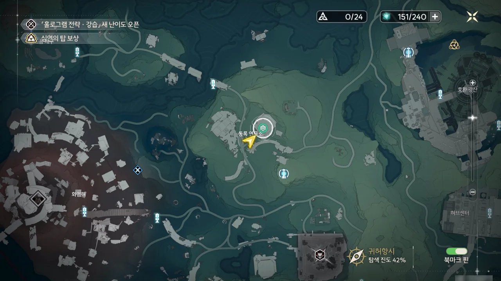

첫 번째로 가게 될 곳은 '동록 연구소'이다. 여기에 있는 건물만 동록 연구소로 부르는 건지, 아니면 이 주변에 있는 모든 건물을 통틀어 동록 연구소라 부르는지는 잘 모르겠다.

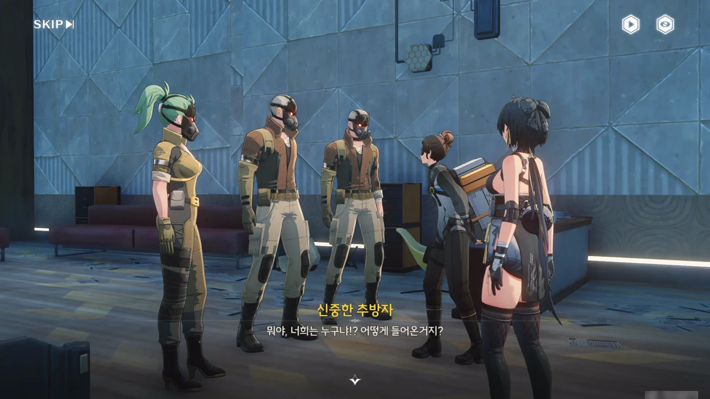







연구소 안에는 이미 추방자 무리가 먼저 자리 잡고 있었다. 이들이 방랑자와 미미카를 '새로운 망나니파'가 보낸 것이라 오해하고 다짜고짜 공격하려 하자, 유니가 자기 생명의 은인이라며 이들을 말린다.

와, 아까 의뢰를 기어코 완료한 게 이렇게 돌아올 줄은 몰랐는데...

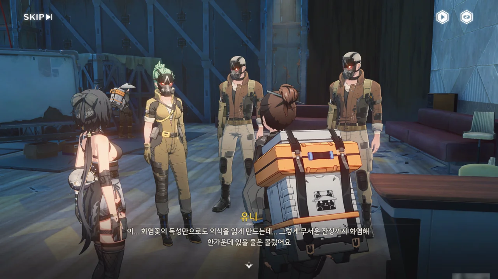





추방자가 폭발 장창 부품을 내주고 싶어도, 창고의 자물쇠가 일종의 테스트를 거쳐야 열 수 있도록 되어 있어 부품을 줄 수 없다고 말한다.

그런데 그 테스트가 그냥 황색 과녁을 다 맞히면 되는 거라고?



쉽네.

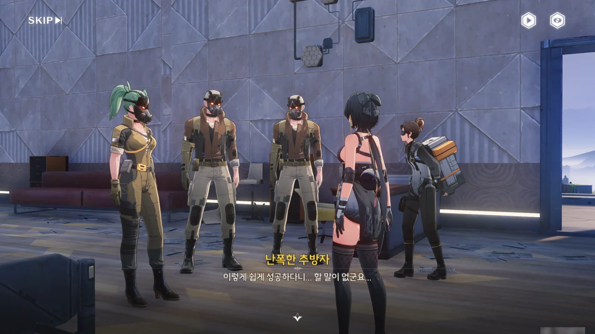



그런데 이 테스트에서 쓰인 탄환이 폭발 장창의 창끝과 비슷한 것 같다고 한다.

잘 모를 때에는 모르테피를 불러서 물어보면 된다. 도와줘, 테피에몽!

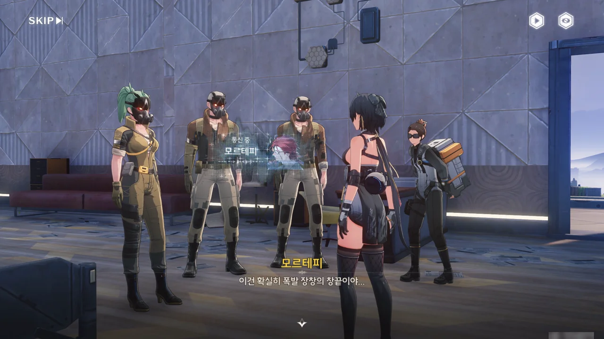



모르테피가 탄환을 살펴보니, 정말 폭발 장창의 창끝이었다.

직정 사람들이 폭발 장창을 개발하다 심심해서 이런 걸 만든 모양인데... 뭐, 스트레스 해소 하나는 제대로 할 수 있었겠다.









폭발 장창 예비 부품을 보관한 연구소는 모두 유니 쪽 추방자 일행의 영역이기에, 유니의 이름을 대면 귀찮게 하지 않을 거라고 한다.

하지만 새로 온 '망나니파'인지 뭔지 하는 녀석들은 유니 쪽 추방자 일행의 영역을 노리고 있으며, 방랑자 일행을 유니 쪽 추방자 일행으로 간주해 공격할지도 모른다고 한다.

추방자 사이에 최소한의 도리도 지키지 않고, 기습과 강탈을 한다는 걸 보면 조만간 방랑자와 충돌할 것 같은데... 그늘이와 구름이 먹이로 던져주면 되겠네.

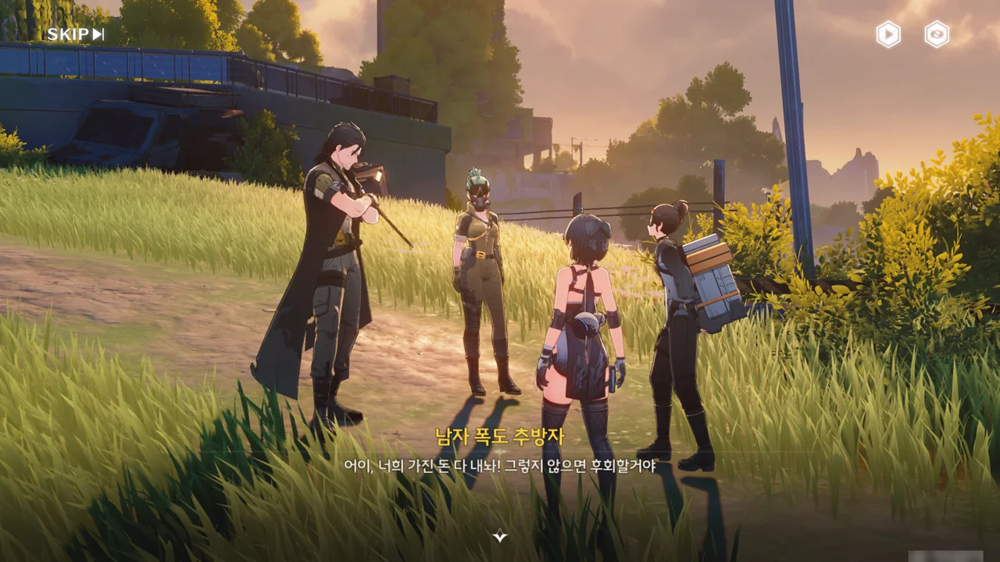







아니나 다를까, 연구소에서 나오자마자 망나니파 추방자를 만났다.

유니를 꾀어 화염해까지 유인한 후, 유니를 화염해 한가운데에 던져 넣어 미끼로 쓴 건 비열하긴 해도, 추방자끼리의 싸움이니 그런가 보다 할 수 있지만, 방랑자 일행을 애초에 살려둘 생각이 없었다는 건 눈살이 찌푸려진다.

&nbsp;

> 아무리 공명자가 대단하다고 해도, 우리가 한 번에 덤벼들면 너희가 과연 버텨낼 수 있을까?

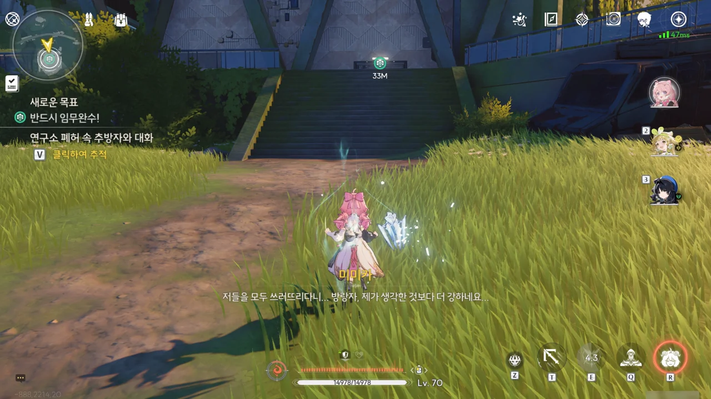

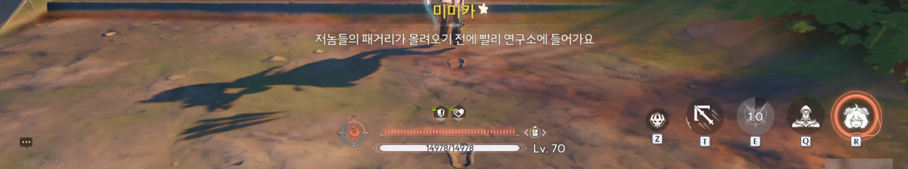

응, 허접.

전부 그늘이와 구름이 먹이로 던져줬다.

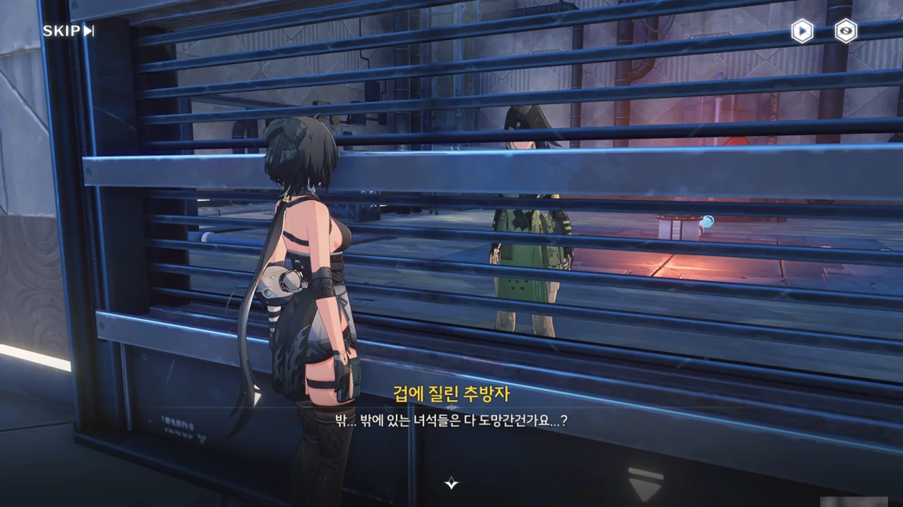



연구소 앞에 망나니파가 진을 치자, 겁을 먹고 문을 걸어 잠근 것 같다. 그게 현명한 방법이긴 하지.

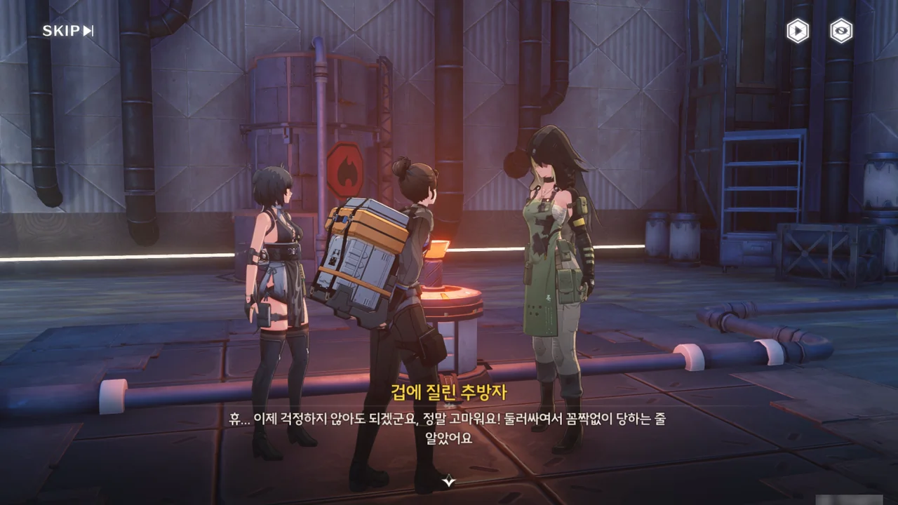

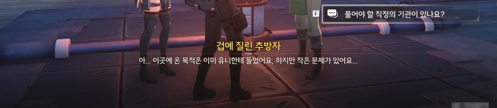

여기도 설마 직정의 기관이 있는 건가?



아까 전 잠금장치는 스트레스를 풀기 위해 겸사겸사 만들었다고 이해할 수 있지만, 이건 대체 무슨 생각으로 만든 건지 도저히 모르겠네...

아무튼 목표는 간단하다. 이 분화 장치에 세 개의 연료 탱크를 연결하는 것이다.



음, 심지어 연료 배관이 누군가에 의해 의도적으로 뜯겨 있다고 한다.



퍼즐 자체는 그리 어렵지 않다.

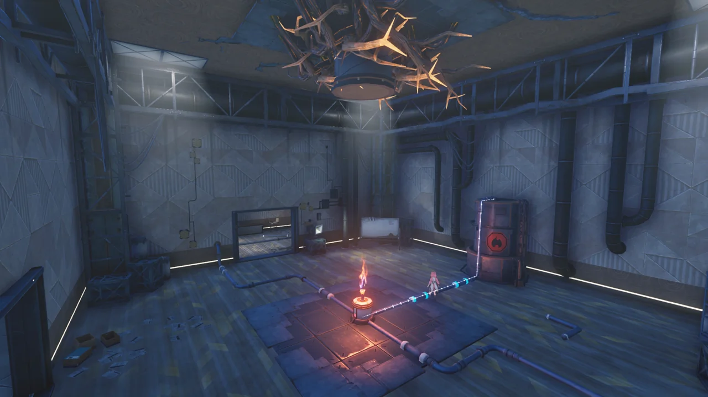

눈앞에 있는 연료 탱크를 연결하니, 분화 장치에 불이 붙었다.

하지만 연료의 양이 모자라, 위에 있는 가시덤불을 태울 정도로 충분한 높이의 불꽃이 나오지 않는다.

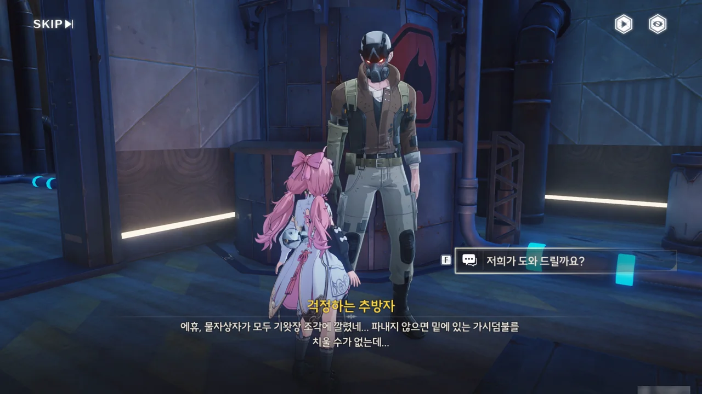

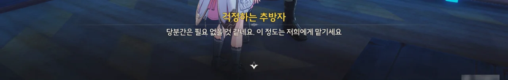

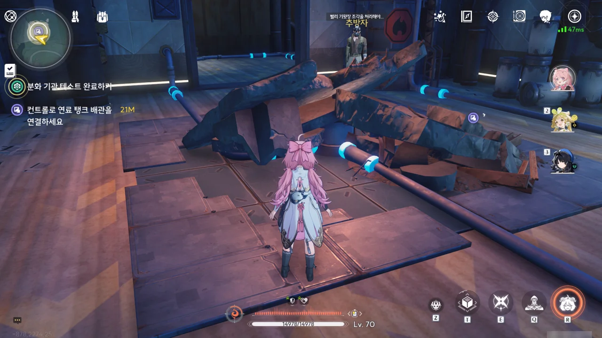

> 이 정도는 저희에게 맡기세요.

정말 이걸 다 혼자 치울 수 있어?

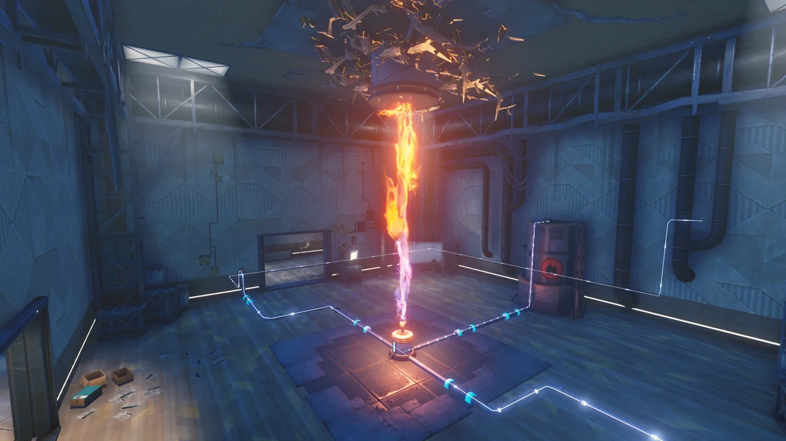

아무튼, 나머지 두 개의 연료 탱크도 모두 연결했다. 위의 가시덤불이 아주 잘 타오른다.

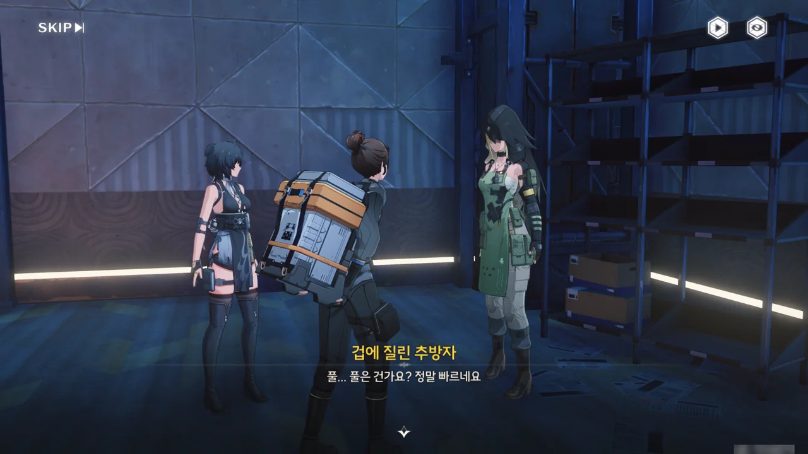







이제야 눈치챈 건데, 여기에서 보관하고 있던 폭발 장창의 부품이 바로 '분화 장치'였나 보다. 그러면 창 끝에 로켓 엔진 같은 걸 달고 던지는 거야? 와... 멋있다...

마지막 남은 창신 부품을 회수하기 위해 이동하려는 찰나, 망나니파 추방자 무리가 제3연구소 폐허를 습격해 꽃가루 필터 장치를 빼앗아갔다는 연락을 받았다.

제3연구소 쪽은 꽃가루 농도가 여기보다 심해, 필터 장치가 없다면 위험할 거라고 한다. 망나니파가 필터 장치를 가져간 것 역시 자기들이 쓰려고 가져간 거고.





설마 그 건물 잔해를 혼자서 다 치울 수 있을까 걱정했는데, 정말로 혼자서 건물 잔해를 다 치웠다. 하지만 그 밑에 있던 가시덤불은 치우지 못해, 연료 탱크 두 개를 연결해 태웠다.

물론 상자는 맛있게 먹었다.



필터 장치를 강탈해 쓰지도 않고 보물 상자에 꽁꽁 숨겨두기만 한 망나니파 추방자들은 필터 장치는 물론, 자신들의 목숨과 자원을 방랑자에게 자진 헌납하게 되었다.

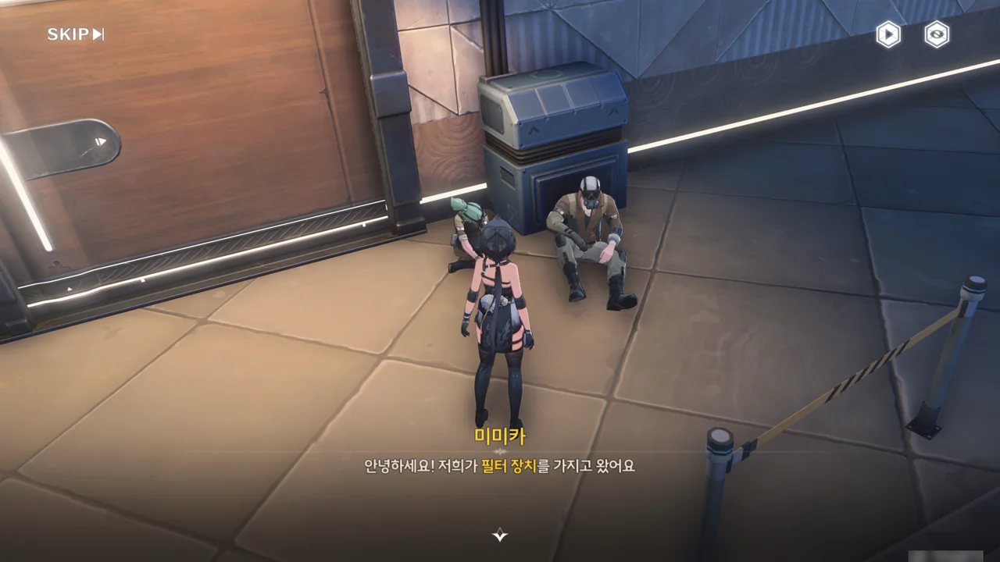

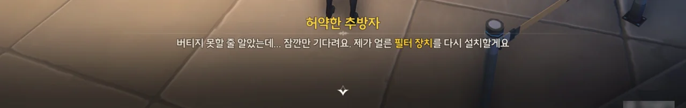

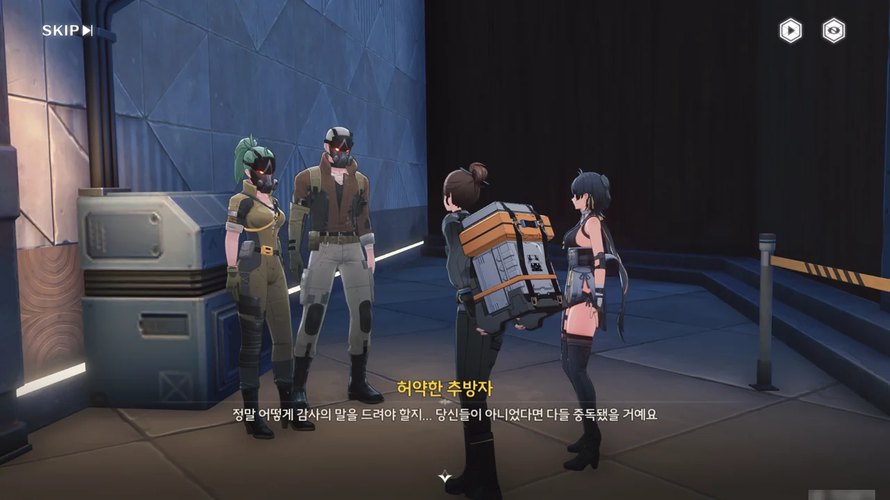



필터 장치를 다시 설치했다.

여기선 어떤 직정 퍼즐을 풀게 될까?





혹시 방랑자가 건물 안에서 퍼즐만 세 번 연속으로 푸는 걸 지겨워할까 봐 망나니파 추방자들이 장창 창신들을 전부 화염해에 흩뿌렸다고 한다. 고마워서 눈물이 날 것 같네.



대체 창신을 어떻게 뿌렸길래 저렇게 다닥다닥 줄지어서 창신이 바닥에 꽂혀 있는 걸까?

저걸 하나하나 옮기다간 저번처럼 꽃가루에 중독될 게 뻔하다.

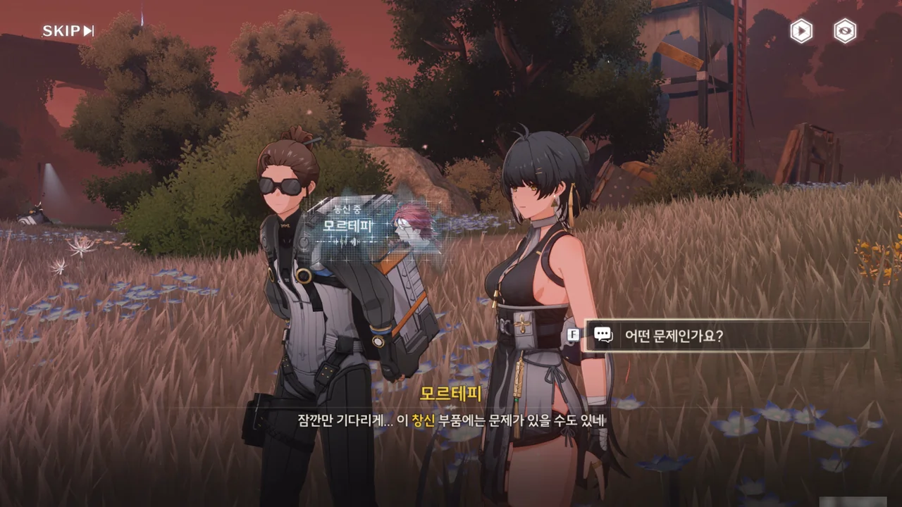







얼씨구. 모르테피가 조사한 바에 따르면, 화염해에 흩뿌려진 창신 부품에는 불량품이 다수 섞여 있다고 한다. 만약 불량품으로 폭발 장창을 만들면 그 자리에서 펑하고 터진다고 한다.

멀쩡한 창신을 찾기 위해선 직접 때려서 확인하는 수밖에 없다. 설사 불량품 창신을 때린다고 하더라도 창신 안에 있던 내용물이 흘러나와 꽃가루의 독소를 어느 정도 억제할 거라, 나쁜 일만 있는 건 아니다.



그냥 열심히 때리면 된다.





명조의 타겟팅 방식은 바로 눈앞에 거대한 잔상이 있음에도 화면 밖 오른쪽에 있는 염소를 때리는 등, 이해할 수 없는 방식으로 되어 있어 욕을 많이 먹고 있다.

그리고 난 지금 명조의 타겟팅 방식을 뼈저리게 체험하고 있다. 크아악! 잔상 그만 때리고 눈앞의 창신 먼저 때리라고! 지금 실시간으로 체력이 빠지고 있는데 잔상이 중요해?

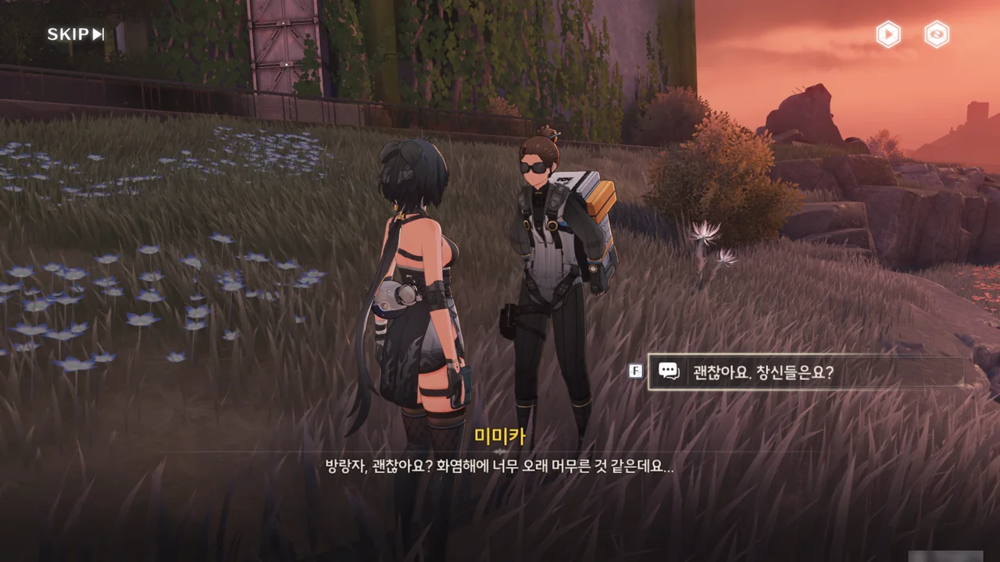



방랑자가 열심히 찾은 정상 창신은 이미 조립 현장으로 보냈다고 한다.

이제 창신을 조립하고 핵심 성흔으로 달려가면 되겠네.
