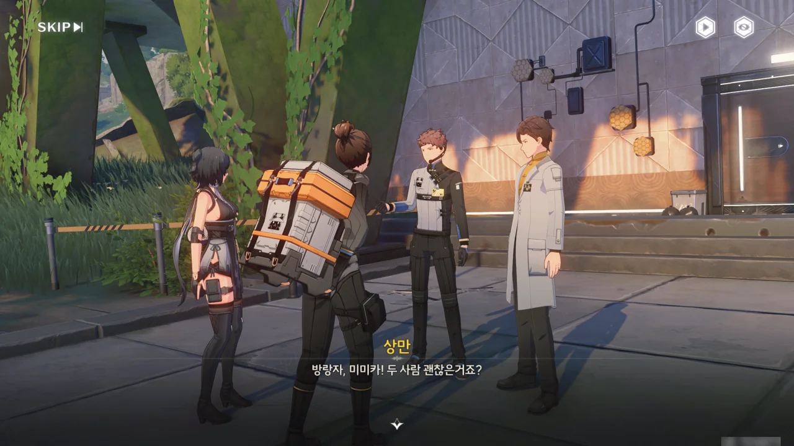



정말 일이 멋지게 잘 풀리고 있다. 원래 계획은 안전한 곳에서 폭발 장창을 조립하는 것이었는데, 시간이 촉박해 현장에서 폭발 장창을 조립해야만 한다고 한다.

가뜩이나 안전성을 내다 버렸다는 직정 「오렌지 박스」의 작품이라, 불안 요소는 최대한 줄여두고 싶었는데...

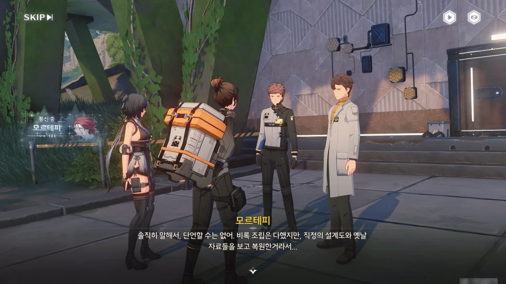



그래서 근처에 있던 잔상 소환기와 장창 생성 장치를 이용해 폭발 장창의 성능 테스트를 해보기로 했다.

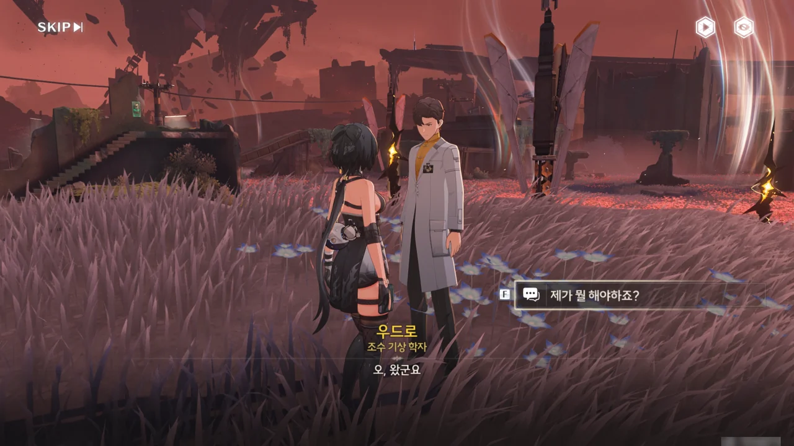





장창 발사 장치를 만들 시간이 없어, 장창의 발사는 방랑자의 반고 단말기에 있는 컨트롤 기능으로 대체하게 되었다.

아니, 오히려 좋은 거 아닌가? 이러면 방랑자가 원하는 위치에서 원하는 각도로 폭발 장창을 던질 수 있다는 말이잖아.



이야, 이거 정말 재미있다. 폭발 장창을 던지면 대부분의 잔상이 장창 한 방에 터져나가고, 조금 튼튼한 잔상은 장창 두 방만에 정리된다.

아, 이런 걸 일반 필드에서도 실컷 던지고 다닐 수 있었으면 참 좋을 텐데... 강한 화력을 싫어하는 사람이 누가 있겠어?





테스트 결과, 새로 조립한 폭발 장창은 위력 면에서 지옥불 기사가 두른, 화염꽃 꽃가루로 만들어진 실드를 부수기 충분하다고 한다.

다만 지옥불 기사의 실드를 부수기 위해선 폭발 장창을 외부 손상 없이 화염해 깊숙한 곳까지 운송해야만 한다. 당장 지난번의 작전이 실패한 것도 운송 도중 폭발 장창에 손상이 가해져, 폭발 장창이 충분한 위력을 발휘하지 못했기 때문 아닌가.

하지만 폭발 장창의 크기가 너무 커, 지옥불 기사를 포함한 잔상을 피해 화염해 깊은 곳까지 폭발 장창을 무사히 운송하기 힘들다고 한다.









미미카가 어떤 방책을 떠올린 모양이다. 상만이 혹시 이상한 방법인 거 아니냐며 묻지만, 지금으로선 별다른 방도가 없으니, 미미카의 말대로 하기로 했다.

무무물류 지부 사람들, 모르테피, 우드로 모두가 모여서 준비해야 하는 방법이라니, 대체 뭘까?

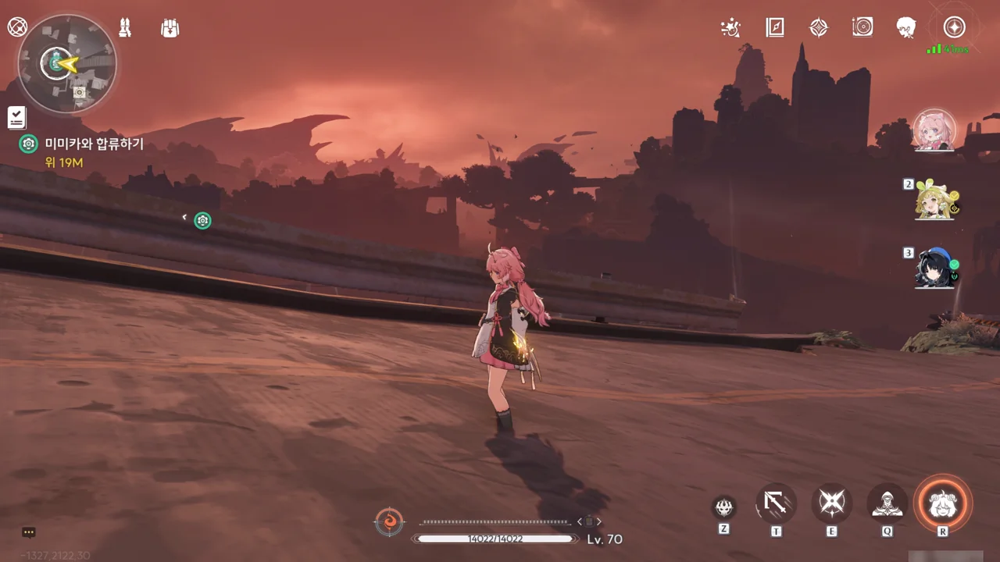

아까 폭발 장창을 테스트할 때, 손에 폭발 장창을 든 상태에서 테스트가 끝났다. 그랬더니 지금 손에 든 게 아무것도 없음에도 왼손에 이펙트가 그대로 남아있다. 다른 캐릭터로 바꿨다가 다시 돌아와도 이펙트가 여전히 남아있길래 사진을 한 장 찍었다.

무척이나 이쁘지만, 게임을 끄면 덧없이 사라질 버그 중 하나다.

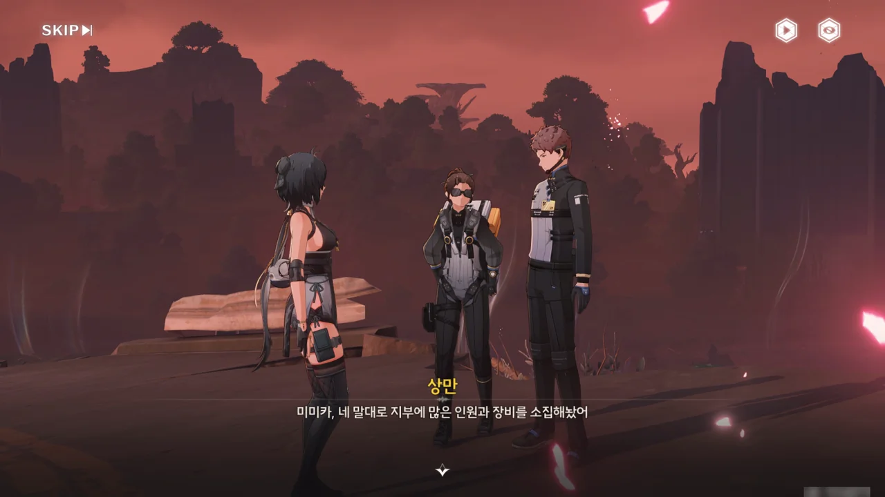









미미카가 왜 폭발 장창을 화염해가 아니라 무무물류 금주 지부로 옮긴 건가 했는데, 예전에 상만이 금주 지부에 설치한 화물 사출 장치를 이용해 공중으로 폭발 장창을 운송하기 위해서였다. 폭발 장창을 사출 장치의 최고 출력으로 발사하고, 화염해 상공에서 장창의 속도와 방향을 교정해 목적지에 폭발 장창을 내리꽂으면 된다는 말이다.

상만이 낙하 충격에 폭발 장창이 터지지 않을까 걱정하지만, 모르테피의 말에 따르면 미작동 상태의 장창은 터지지 않는다고 한다. 중력 폭풍 때문에 장창의 비행경로에 변동이 생기지 않을까 걱정되지만, 모르테피와 우드로가 장창의 발사 및 비행 궤도를 계산해 중력 폭풍의 영향이 없음을 확인했다고 한다.

그러면 그냥 사출 장치로 폭발 장창을 화염해 핵심 성흔에 꽂아 넣으면 되는 것 아닌가 생각했는데, 그러기에는 사출 장치의 출력이 모자라 핵심 성흔이 있는 곳까지 폭발 장창을 발사할 수 없다고 한다. 어찌어찌해서 폭발 장창을 핵심 성흔이 있는 높이까지 쏘아 올린다고 해도, 핵심 성흔을 감싼 중력 폭풍 때문에 폭발 장창의 궤도가 어긋날 것이기도 하고.

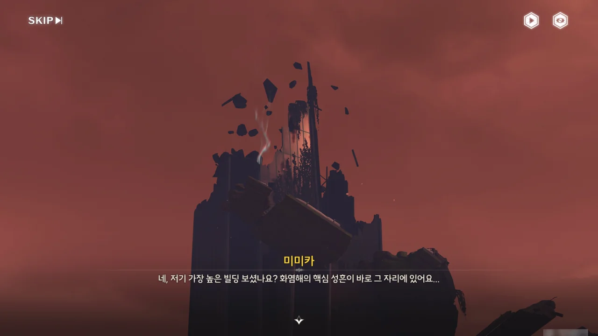

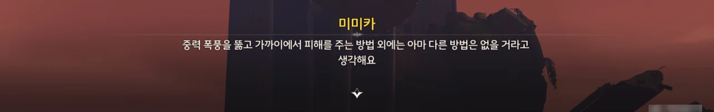

어우, 핵심 성흔이 저 꼭대기에 있는 거였어? 저기까지 어떻게 올라가지?



상만은 지옥불 기사에 야귀군 병사들의 숙원이 남아 있을지도 모른다며, 지옥불 기사를 격파하면 지옥불 기사를 이용해 핵심 성흔까지 질주할 수 있을 것 같다고 말한다.

그러니까 지옥불 기사의 에코를 흡수해서 지옥불 기사로 변신한 다음, 핵심 성흔까지 달릴 수 있을 거란 말이지?

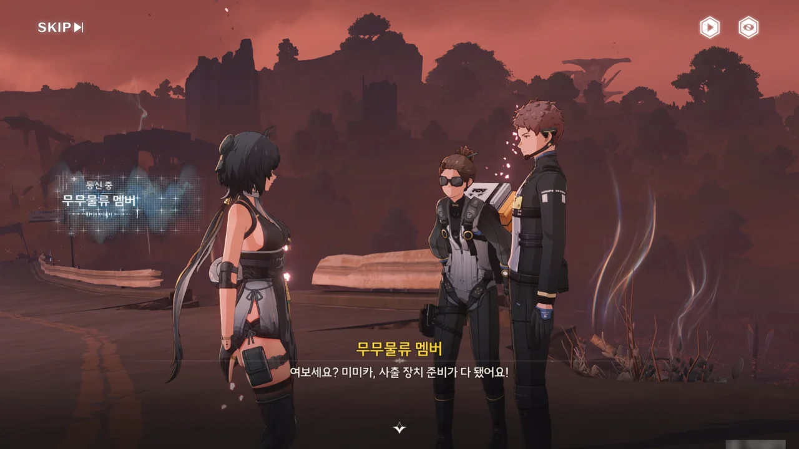

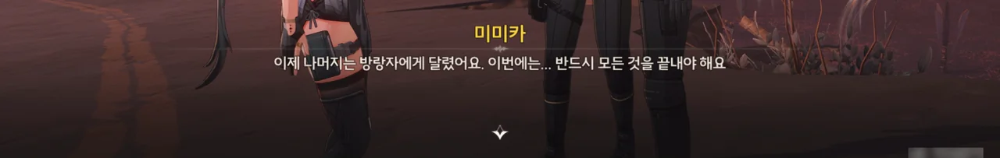

그래. 이제 갈 시간이다.





저번과 똑같이, 지옥불 기사가 체력이 조금 까진 것 갖고 대경실색하며 무적 실드를 두른다. 하지만 이번엔 다를 거야.



하늘에서 폭발 장창이 내리 꽂힌다. 공중에 둥둥 떠있는 건물 잔해가 폭발 장창이 내리 꽂히는 멋진 장면을 다 가려서 짜증 난다. 쿠로게임즈 이 녀석들은 QA를 안 하는 건가?



폭발 장창으로 지옥불 기사를 격파하고 그 에코를 흡수했다.





정말로 공중에 뜬 다리와 건물 잔해가 이리저리 재배치되며 핵심 성흔으로 가는 길을 열어준다.



오... 신나는 레이싱이다.

장애물을 어느 타이밍에 부서야 할지 몰라, 대부분을 그냥 다 얻어맞았다. 깎인 체력은 도로에 널린 폐차와 상자를 몸으로 부딪혀 얻은 아이템으로 보충했고.





지옥불 기사가 들고 있는 창이 바로 폭발 장창이었나 보다. 지옥불 기사로 변신한 방랑자가 들고 있던 창을 핵심 성흔에 내리꽂는다.



그러자 이제 끝이라는 듯, 붉던 하늘이 다시 푸른색으로 되돌아왔다.

그런데 하늘의 저 검은색 원은 대체 뭐지?

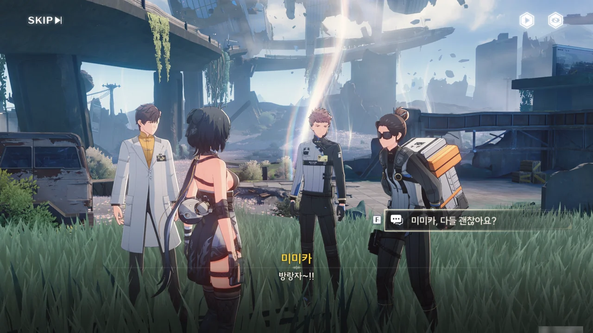







모든 게 잘 끝났다.

과거, 화염해 핵심 성흔을 파괴하려 했던 야귀군들의 숙원은 지옥불 기사 에코가 되어 성흔을 파괴하는데 큰 도움을 줬으며, 여태껏 마음의 짐을 짊어지고 있던 상만 역시 이제 그 짐을 덜 수 있게 되었다.

화염해 핵심 성흔이 파괴되어 화염꽃 꽃가루의 독성과 중력 폭풍이 사라졌기 때문에, 처음 우려한 대로 금주를 포함한 인근 지역에 화염꽃 꽃가루가 퍼질 걱정을 더는 하지 않아도 된다.

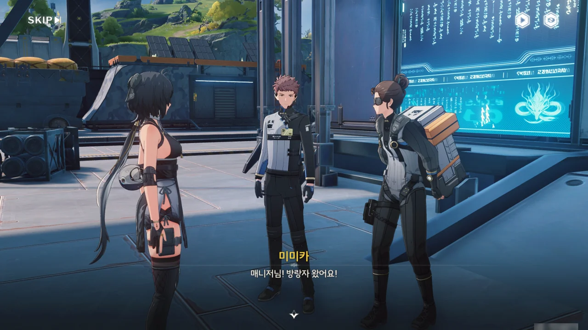





따지고 보면 이번 일은 미미카가 아니었으면 시작도 하지 않았을 테니, 미미카의 공이 크다고 할 수 있겠지.







이번엔 미미카의 고집 덕을 많이 봤다.

미미카가 화염해 배송을 끝까지 고집하지 않았더라면 유니는 화염해 속에 홀로 외로이 남겨져 죽었을 것이고, 미미카가 자신의 아이디어를 고집하지 않았더라면 폭발 장창을 무사히 화염해까지 운송하지 못했을 테니 말이다.

다만 상만 말처럼, 이번에 일이 잘 풀려서 망정이지, 미미카의 성격은 고칠 점이 많다.





상만은 방랑자 덕분에 무무물류가 평소 자랑스럽게 내걸던 「반드시 임무완수!」 슬로건 앞에서 다시 고개를 들 수 있게 되었다며 감사를 표한다.

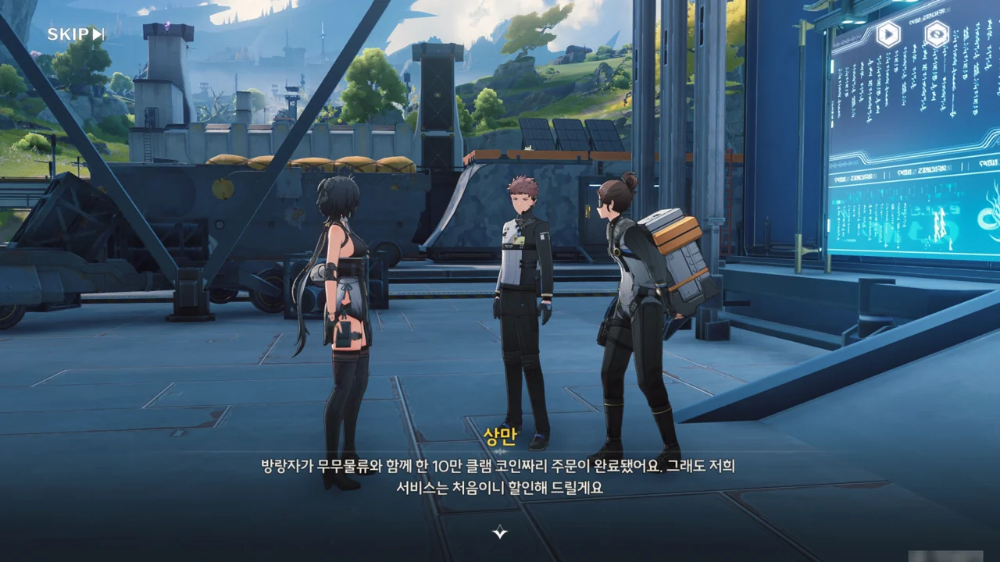



방랑자의 10만 코인짜리 주문을 첫 주문 할인이라며, 나머지 금액을 사례금으로 다시 되돌려준다.

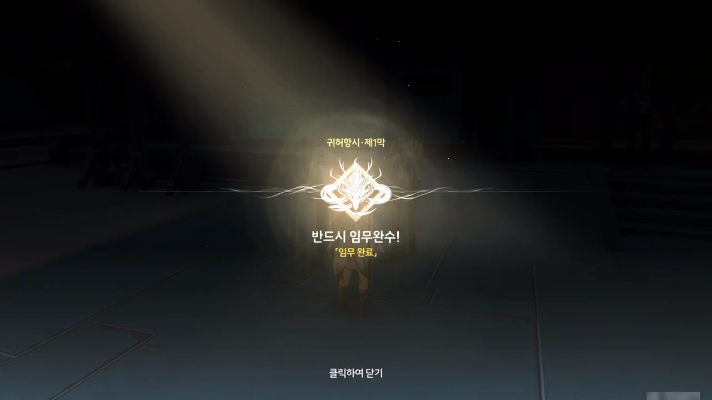

귀허항시 제1막 \[반드시 임무완수!\] 완료!
