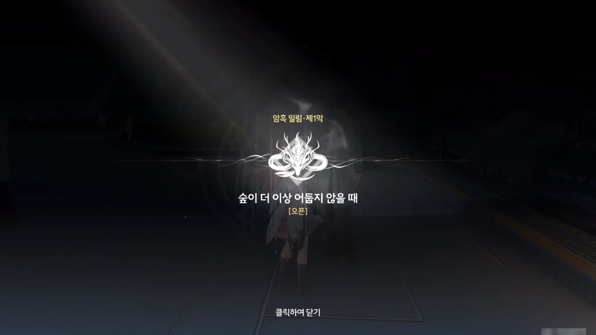

어... 음... 이 임무가 왜 열렸더라?

\[반드시 임무완수!\] 임무 때와 마찬가지로, 이 임무 역시 금주성 곳곳을 들쑤시던 중 열린 임무라, 대체 어떻게 이 임무가 열리게 된 건지 도통 기억이 나지 않는다.

&nbsp;

'위험한 임무'가 있다는 건 그 지역에 어떠한 형태로든 제약 사항이 있다는 의미이다. 귀허항시에는 밟으면 실시간으로 체력이 닳는 화염해가 있으며, 암흑 밀림에는 느리게 차오르는 중독 디버프가 존재한다. 이름이 기억나지 않는 다른 지역에는 안개 때문에 길을 잃었다는 설정 때문에 강제로 안전 지역으로 이동되는 특성이 있다.

그리고 그 제약 사항은 '위험한 임무'를 진행하여 해제할 수 있다. 이전에 \[반드시 임무완수!\] 임무를 완료했기 때문에, 이제 화염해에 들어가도 체력이 닳지 않는다. 아마 이번 임무를 완료하면 중독 디버프의 영향을 받지 않고 돌아다닐 수 있겠지...





임무 지역에 도착하자, 추방자들이 한 연구원을 잔상과 함께 철창에 가둬둔 모습을 발견할 수 있었다.

그러고 보면 이번 임무가 열렸을 때 실종된 연구원을 찾아달라는 말을 들었던 것 같기도 한데... 그게 바로 이 사람인 건가?

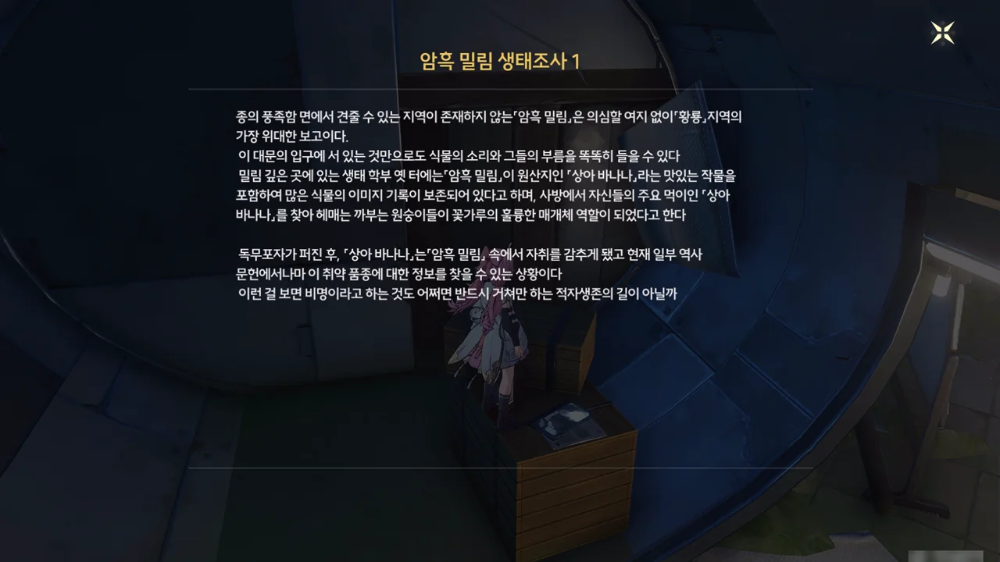

열쇠가 있는 방 안에는 '암흑 밀림 생태조사 1' 문서가 있었다. '독무포자'라는 단어가 나오는데, 이게 내가 겪었던 중독 디버프의 정체인가 보다.

「상아 바나나」 말이 나와서 하는 소리인데, 우리가 멸종했다고 알고 있는 '그로 미셸' 품종의 바나나는 사실 멸종하지 않았다고 한다. 그로 미셸 대신 캐번디시 품종을 기르게 된 건 그로 미셸 품종이 파나마병에 대타격을 입은 김에 생산성이 더 좋은 캐번디시 품종으로 갈아탔기 때문이다. 맛은 훨씬 떨어지지만 말이다.

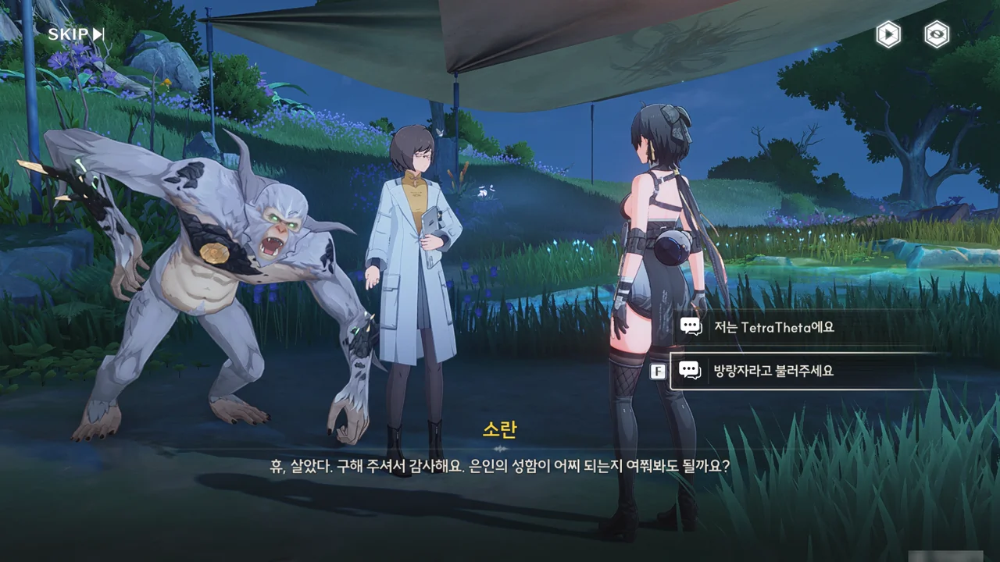



여자는 암흑 밀림 탐사팀의 멤버이며, 이름은 '소란'이라고 한다. 그 옆의 잔상은 '감염되지 않은' 까부는 원숭이, '우끼'라고 한다.

감염되었다는 게 대체 무슨 말일까? 설마 지금껏 내게 덤볐던 다른 원숭이들은 감염되었다는 뜻인가?









소란은 암흑 밀림의 상황에 대한 기본적인 조사를 하던 중, 다른 팀원인 '선민'이 오랫동안 돌아오지 않자 우끼와 함께 선민을 찾아 나섰다고 한다. 하지만 도중에 추방자를 만나, 어쩔 수 없이 연구원에 도움을 청했고, 연구원의 의뢰를 받은 방랑자가 여기에 오게 된 것이다.

소란은 평소 몸이 좋지 않은 선민이 암흑 밀림에서 봉변이라도 당한 게 아닐까 걱정하고 있다. 암흑 밀림에는 감염을 일으킬 수 있는 감염성 포자 먼지와, 여기에 감염되어 성격이 난폭하게 된 까부는 원숭이가 있어, 위험하기 짝이 없다.

소란이 단기간동안 감염 지역에서 버틸 수 있게 해주는 항체를 주는데, 이걸 받으면 정말 이전보다 독안갯속에서 잘 버틸 수 있게 되는 걸까? 이전에 느낀 바에 따르면, 중독 디버프가 차오르는 속도가 느리긴 해도, 무시할 수 있을 정도는 아니었거든.

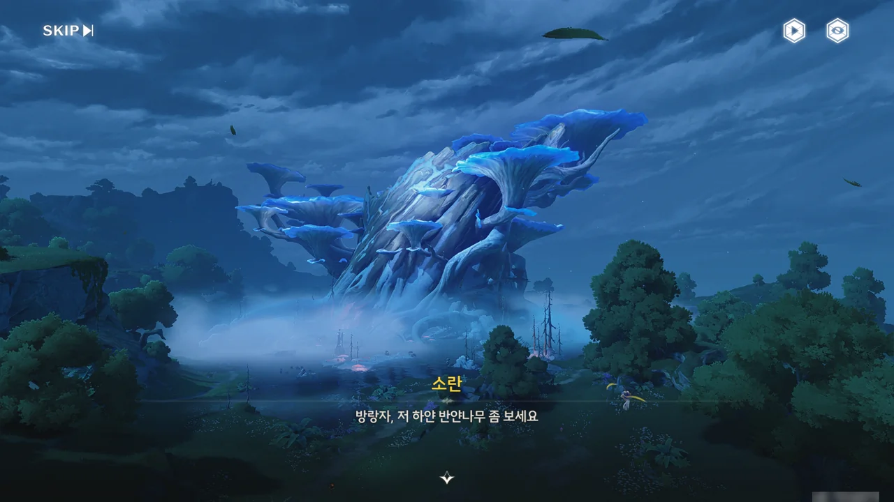





저 나무 이름이 반얀나무였구나. 음... 내가 반얀나무를 어디서 들었더라? 분명 어디서 들어본 이름인데...

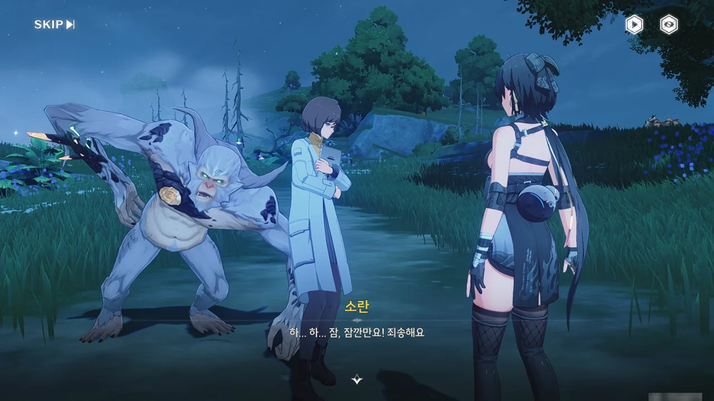

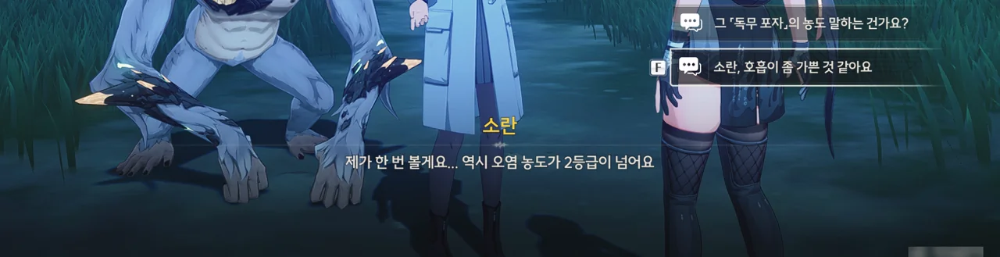

응? 감염 농도가 2등급? 독무포자의 농도를 말하는 것 같은데... 설마 포자의 농도가 2등급이 넘으면 위험한 걸까?

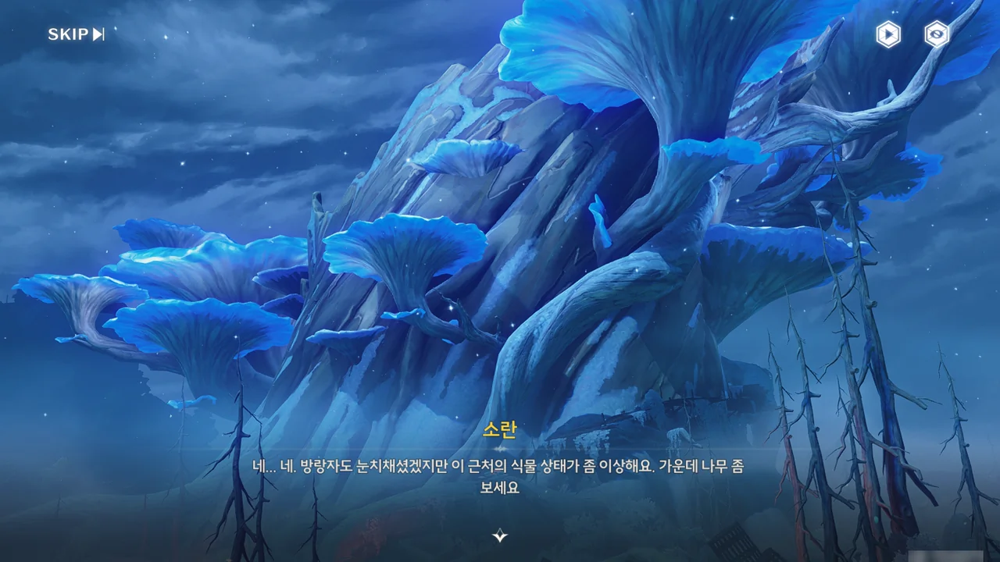



나무에 흰색 무언가가 좀 끼긴 했는데... 그게 독무포자인 건가?



공명자인 방랑자는 높은 독무포자 저항력을 갖고 있어 별다른 이상을 느끼지 못하지만, 공명자에 비해 훨씬 낮은 독무포자 저항력을 갖는 비공명자인 소란은 독무포자 때문에 자꾸만 기침을 하며 숨쉬기 힘들어한다.

그런데 소란 정도면 독무포자에 대해 저항력이 어느 정도 있는 편이라고 한다. 그러면 저항력이 아예 없는 비공명자는 여기 오기만 해도 숨을 제대로 못 쉬겠네...?





선민이 그의 스승처럼 될까 걱정된다고? 설마 선민의 스승 역시 암흑 밀림의 문제를 홀로 해결하려다 죽었던 걸까?





이미 한계에 다다른 소란은 안전한 곳에서 쉬고, 대신 우끼를 길잡이 삼아 계속 앞으로 나아가기로 했다.

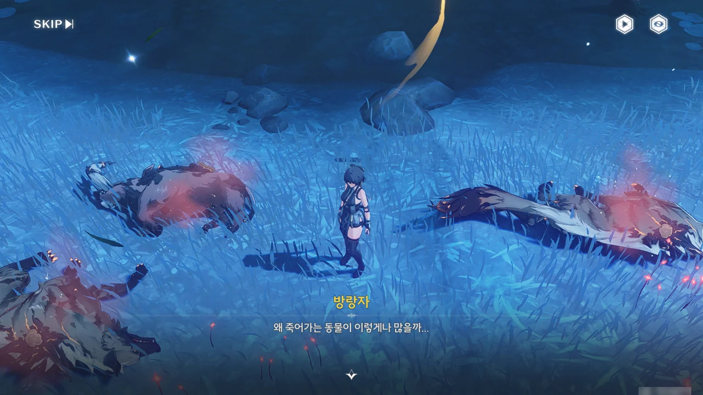

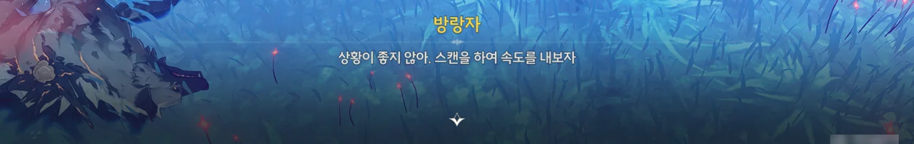

몸에서 붉은 연기 같은 것을 내뿜으며 죽어 있는 동물들이 보인다. 그런데 몸에 난 저거... 설마 버섯인가?

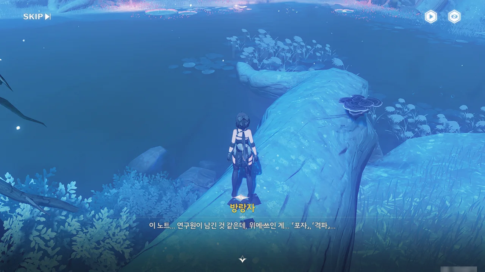

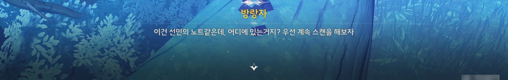

선민의 것으로 보이는 노트를 발견했다.

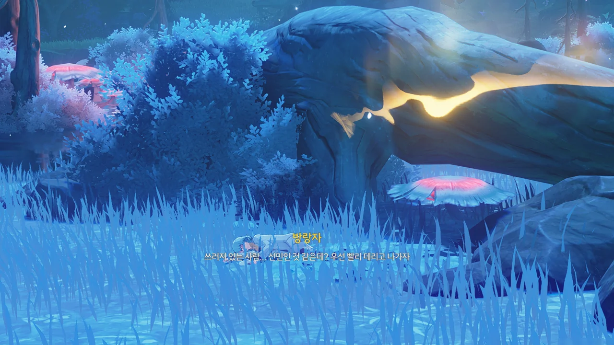

아, 드디어 찾은 것 같네. 소란의 걱정대로, 혼자 암흑 밀림 깊은 곳에 들어갔다가 쓰러진 것 같다.



선민을 데리고 안전한 곳으로 빠져나왔다.

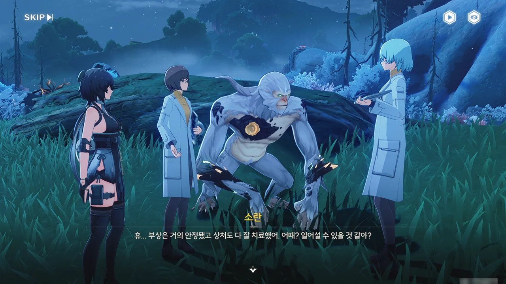





선민이 어쩌다 상처를 입은 건진 잘 모르겠지만, 소란이 선민의 상처를 치료해 주었다.

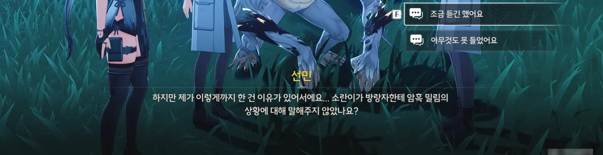

음, 방금 소란이 암흑 밀림의 상황에 대해 이야기해 주긴 했는데...

여기서 무슨 선택지를 고르던, 추가 설명이 나오는 건 똑같더라.





전에 들었다시피, 암흑 밀림에는 독무포자가 퍼져있다. 동물이 포자에 감염되면 점차 죽어가고, 잔상인 까부는 원숭이가 감염되면 매우 난폭해진다고 한다. 인간 역시 마찬가지로, 포자에 오랫동안 노출될 경우 악영향을 받게 된다.

선민과 소란, 그리고 이들의 스승은 이 문제를 해결하기 위해 다방면으로 연구를 진행했다. 선민과 소란은 포자를 맡고, 스승은 까부는 원숭이를 맡았다.

연구 끝에, 선민과 소란은 암흑 밀림의 포자가 확산하는 이유는 포자를 생산하고 퍼트리는 핵심이 있기 때문이며, 이 핵심을 파괴하면 암흑 밀림의 독무포자 문제가 해결될 거라는 사실을 알게 되었다.











하지만 언제나 말이 쉬운 법이다. 가뜩이나 단단한 껍질에 싸여 있어 파괴하기도 어려운 핵심이 핵심을 파괴한 후에도 다시 자라는 문제 때문에 암흑 밀림의 문제를 해결하는 일은 요원해 보인다. 심지어 독무포자는 가만히 놔두면 빠르게 퍼지기 때문에, 정기적으로 핵심을 파괴해야 독무포자가 추가로 퍼지는 걸 막을 수 있다.

이번에도 독무포자의 핵심을 제거하기 위해 암흑 밀림에 들어간 선민은 중앙 거목의 포자 농도가 급증하는 걸 발견하고, 독무포자의 진짜 핵심이 중앙 거목의 뿌리에 숨어 있다 거목 꼭대기에 나타난 걸 확인하게 되었다.

하지만 선민과 소란이 현재 갖고 있는 항체의 성능이 부족해, 원핵에 다가갈 수 없다고 한다. 항체의 성능을 향상하기 위해 자리를 비우면 원핵 분열체가 더 많은 독무포자를 뿜어내 독무포자가 퍼지는 속도가 지금보다 더 빨라질 수 있다.

그야말로 진퇴양난의 상황.







그래서 선민은 캠프로 돌아가 항체 개량 작업에 착수하고, 소란과 우끼, 방랑자는 암흑 밀림을 돌아다니며 원핵 분열체를 제거하기로 했다. 이렇게 하면 두 작업 모두를 동시에 진행할 수 있으니 말이다.











소란의 말에 따르면, 원래 선민은 이렇게 암흑 밀림의 문제 해결에 목을 매다는 성격이 아니었다고 한다.

소란과 선민의 스승이 살아있을 때의 탐사팀의 주된 탐구 대상은 의태 잔상 중 하나인 까부는 원숭이였다. 다들 까부는 원숭이의 천성이 난폭해, 사람과 함께 지낼 수 없다고 생각했지만, 스승은 '현상은 현상일 뿐, 현상의 본질을 탐구해야 한다'라며 까부는 원숭이와의 소통과 치료를 위해 밤낮없이 연구했다.

그러던 어느 날, 원핵 분열체의 확산으로 까부는 원숭이가 독무포자에 감염되어 난폭해졌고, 제자들이 연구소에 도착했을 때에는 이미 너무 늦어, 스승이 까부는 원숭이에게 살해당했다고 한다. 연구소마저 난폭해진 까부는 원숭이에게 점령당해, 이들은 연구 자료와 주요 실험 도구만 가지고 철수할 수밖에 없었다.

그 후, 선민은 스승의 소원과 책임을 이어받아 독무포자 연구를 완성하고 암흑 밀림의 문제를 해결하기 위해 연구에 매진하게 되었다고 한다.

소란 역시 두 번 다시 곁에 있는 사람을 잃고 싶지 않기 때문에 선민의 건강을 굉장히 걱정하고 있다.

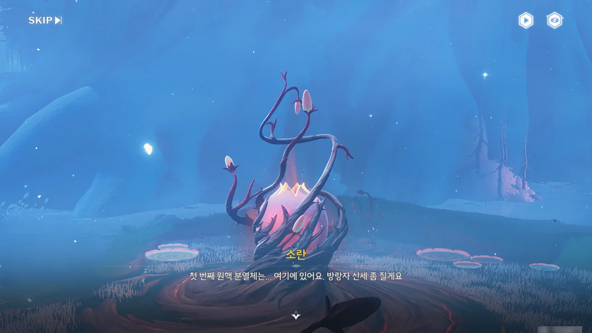



원핵 분열체가 생긴 게 마치 꽃봉오리처럼 생겼다.

비공명자인 소란은 음파 에너지의 흐름을 볼 수 없어, 장치의 세부 조정을 방랑자에게 맡긴다. 그러면 여태껏 원핵 분열체를 어떻게 처리한 거야? 설마 선민이 공명자였던 건가? 그렇다고 하기에는 선민 역시 독무포자 속에서 얼마 버티지 못하고 쓰러졌는데...



설명이 난해해서 어려운 퍼즐인 건가 걱정했는데, 그냥 처음 음파가 나오는 드론은 방향이 고정되어 있고, 나머지 드론의 각도를 조절해 음파가 분열체를 향하도록 만들면 된다.

소란에게 말을 걸면 힌트를 주는 것 같은데, 힌트 없이도 잘만 깼다.



저번에 소란이 파괴했다던 원핵 분열체는 미성숙한 개채였던 건지, 핵심이 온전치 못했다고 한다. 하지만 이번에 방랑자가 파괴한 원핵 분열체에서는 온전한 핵심을 얻을 수 있었다.

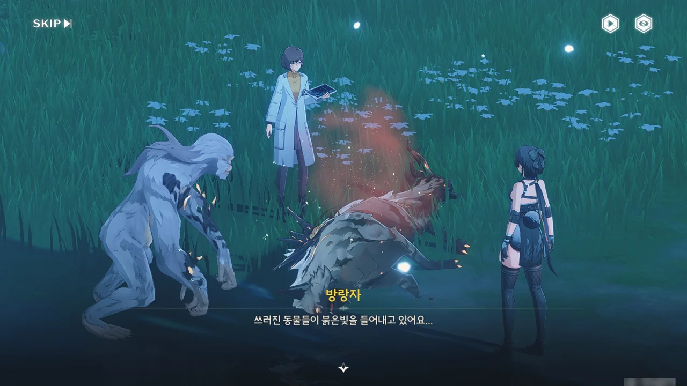

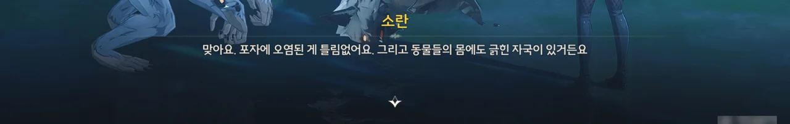

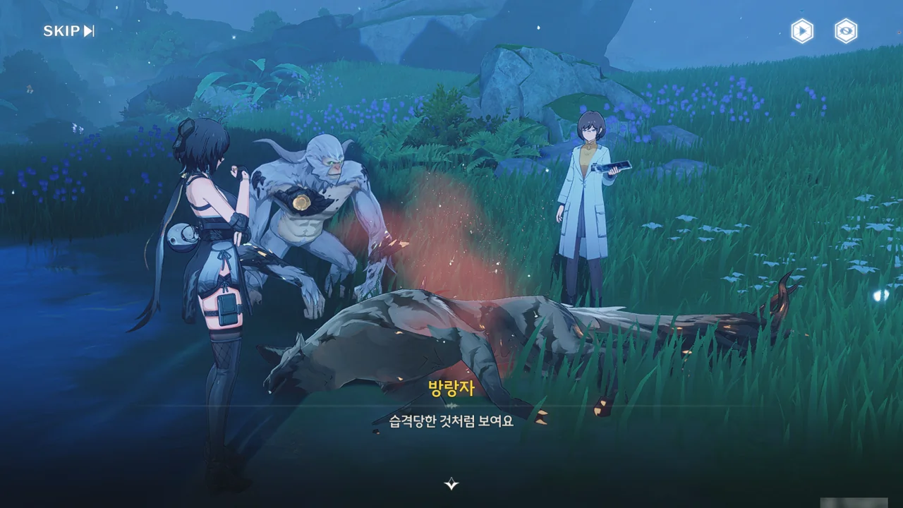



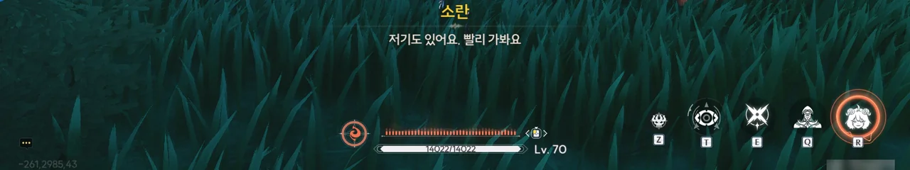





다른 원핵 분열체로 가는 도중, 곳곳에서 포자에 감염되어 죽은 것으로 추정되는 생물의 사체를 발견할 수 있었다. 갈기늑대는 물론, 화살곰의 사체까지 있는 걸 보면, 포자의 독성이 정말 장난 아닌 모양이다.

그리고 원핵 분열체 근처의 포자 농도 역시 아까와 비슷한지, 소란이 기침을 한다.



제가 해결할게요(물리)

압도적인 힘은 마법과 구분할 수 없지.



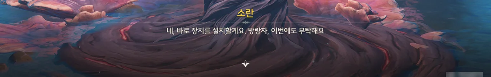

두 번째 원핵 분열체 역시 방랑자가 처리하게 되었다.

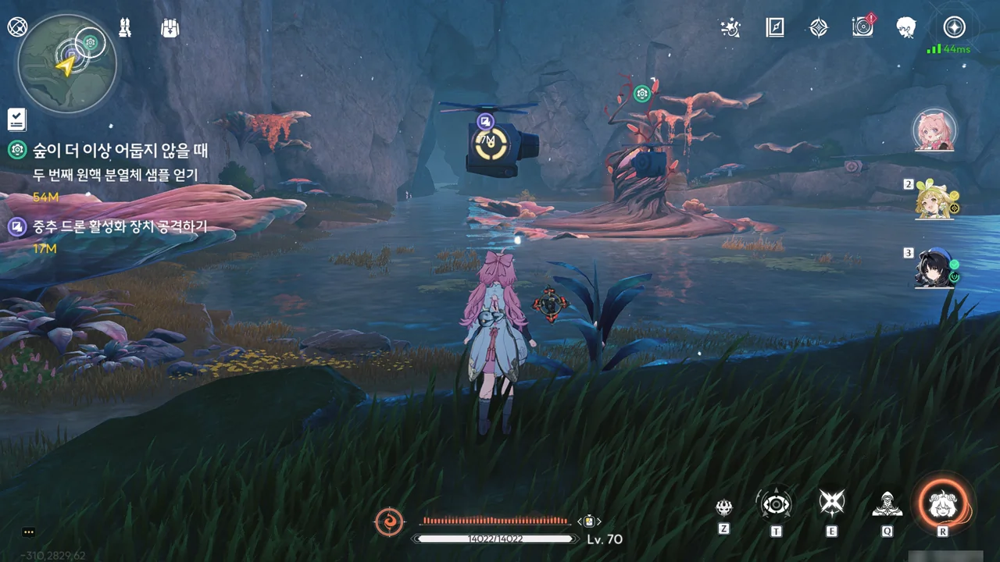

아니, 그런데 이렇게 높이 드론이 떠있는 건 반칙 아냐? 이건 무조건 권총 캐릭터 꺼내 쓰라는 거잖아.

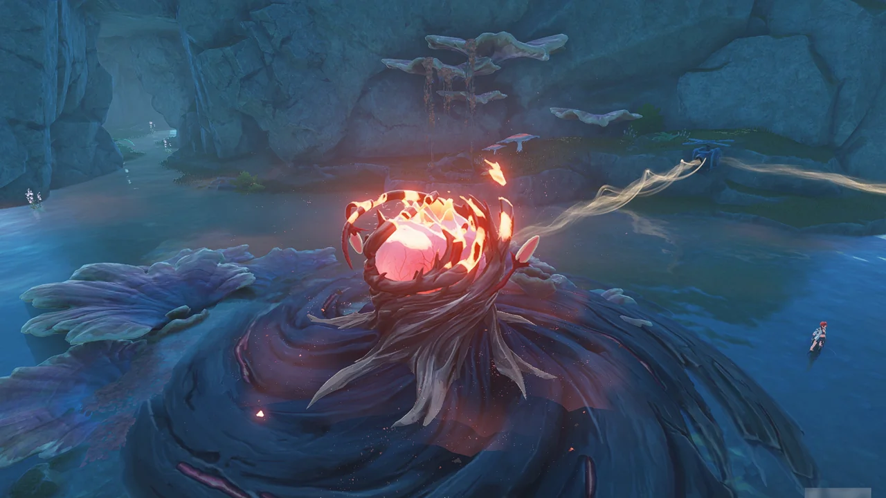

그래서 치샤를 꺼내 처리했다.

아직 두 번째 파티를 키울 역량이 되지 않아 치샤의 레벨이 매우 낮은데, 여기서 전투가 걸리지 않은 게 정말 다행이다.





그런데 다른 까부는 원숭이가 포자에 감염될 때에도 우끼는 혼자 멀쩡하다. 대체 어떻게 된 일일까?







우끼는 소란과 선민의 스승이 구한 까부는 원숭이 중 하나로, 소란과 선민을 난폭해진 까부는 원숭이에게 살해당한 스승에게 안내한 것도 우끼라고 한다.

우끼가 단순한 까부는 원숭이는 아닌 것 같다. 그렇지 않고서야 소란도 힘들어하는 농도의 독무포자 속에서 멀쩡할 리 없잖은가? 다만 소란 역시 이전까지는 독무포자의 농도가 그리 높지 않아, 우끼가 독무포자의 영향을 받지 않는다는 걸 눈치채지 못했다고 한다.

일단 선민에게 돌아가, 항체 연구가 어디까지 진전했는지 알아보기로 했다.
