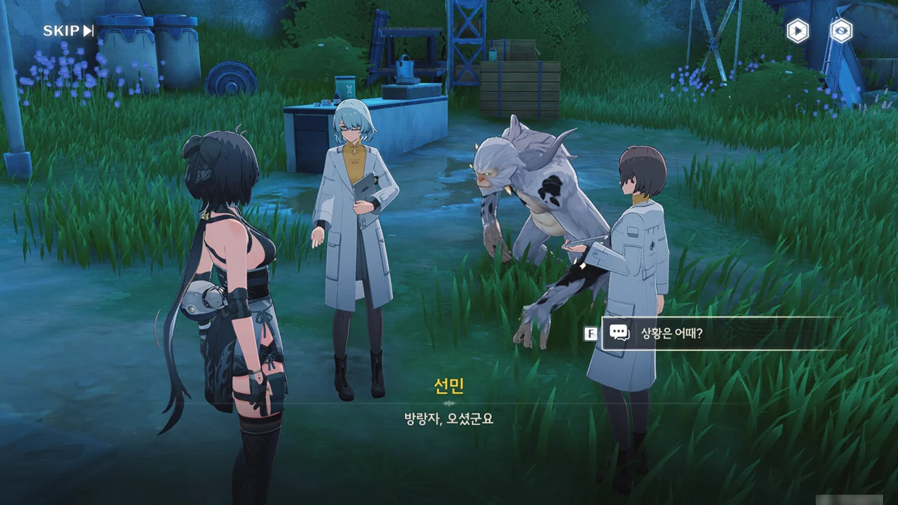





새로운 항체 제작이 벌써 막바지 단계에 들어섰다고 한다. 정말 빠른걸...

다만 마지막 단계를 진행할 때 진행 시간에 한 치의 오차도 있어서는 안 되기에, 방랑자가 도와주기로 했다.

선민이 필요로 하는 재료를 제깍제깍 가져다주면 된다고 한다.

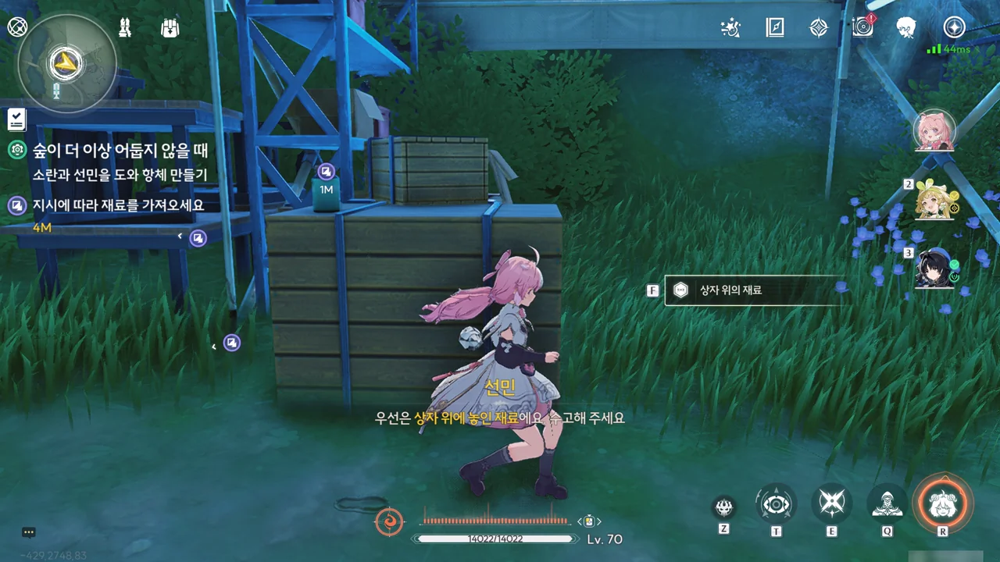

다행스럽게도, 이 재료가 어떤 재료인지 프롬프트로 알려준다. 만약 이걸 다 외워야 했다면 조금 귀찮았을 거야...

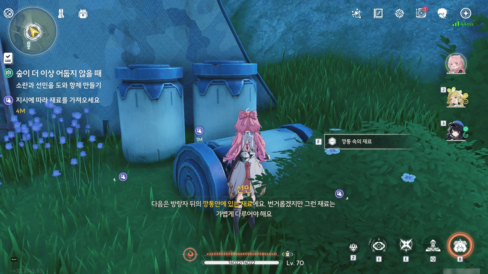

'깡통 안에 있는 재료', '깡통 속의 재료'... 뜻에는 차이가 없지만 명조의 번역이 워낙 막장이라, 조금 불편하다.



'상자 안의 재료', '상자 위의 재료'... 이건 아예 뜻부터가 다르잖아! 상자 안은 In the box고 상자 위는 On the box잖아. 이게 어떻게 같아?



> 번거롭겠지만 탁자 위의 병 좀 가져다주세요

바로 옆에 있는 병조차 방랑자가 가져다줘야 한다니...



'깡통에 있는 그 재료'... 이건 뭐, '그 재료'라고 했으니 별말 않고 넘어가야지.



기껏 새 항체를 만들었지만, 기존 항체에 비해 효과가 조금 더 있는 정도에 그쳐, 포자 오염이 심한 곳에선 별 소용이 없을 거라고 한다.





이들의 스승은 까부는 원숭이를 치료하기 위해 항체 연구에도 손을 댔는데, 당시 스승이 만든 단기간 항체의 성능이 워낙 좋아 포자 오염 지역을 돌아다니기 충분했기에 선민과 소란은 항체 연구가 충분하다고 보고 독무포자 연구에 좀 더 신경을 썼다고 한다.

하지만 독무포자의 농도가 강해진 지금, 이때까지 해왔던 대로는 충분한 성능의 항체를 개발할 수 없다.











이들이 놓친 건 바로 우끼의 존재였다.

증가한 포자 농도 때문에 여러 까부는 원숭이들이 포자에 감염되어 소란과 방랑자를 공격했지만, 우끼는 항체를 사용한 소란조차 버틸 수 없을 정도의 포자 농도에도 아무런 영향을 받지 않았다. 이는 우끼가 독무포자에 강한 저항력, 혹은 내성을 지니게 되었다고 해석할 수 있다.

스승이 남긴 일지에는 감염 증상이 경미했던 우끼가 스승이 개발한 새 항체를 복용한 후 증상이 크게 호전되었다고 적혀 있는데, 당시 복용한 항체 덕분에 독무포자 저항력이 크게 상승했다고 추측할 수 있다.





그런데 우끼가 불안한 듯 울더니, 어디론가 갑자기 뛰쳐나간다. 대체 왜지?

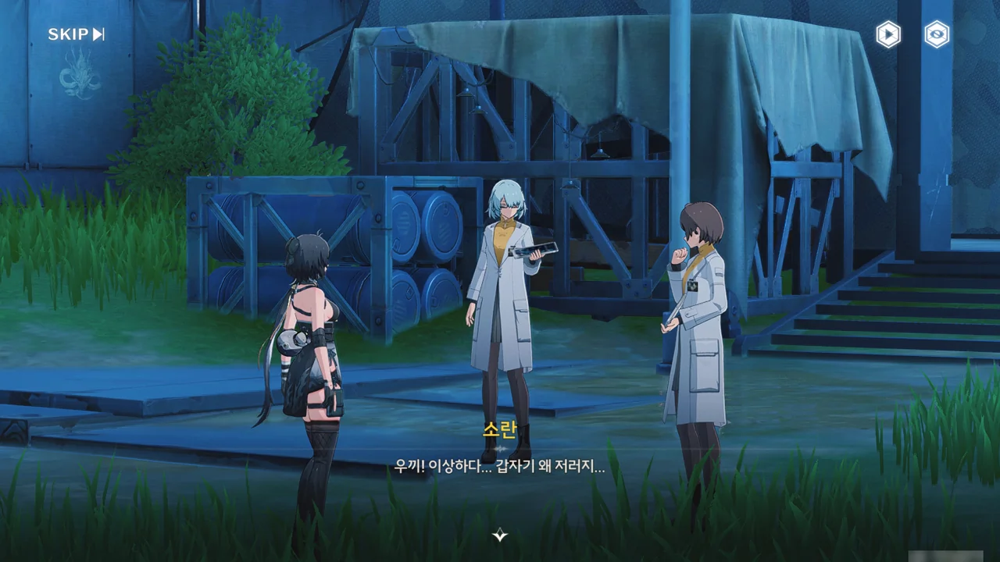

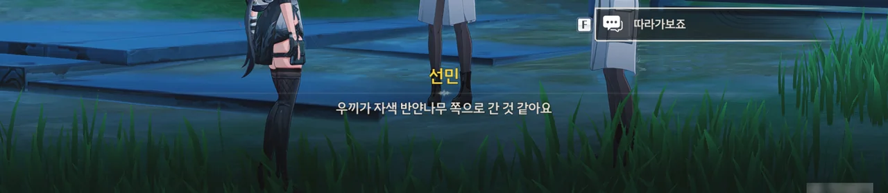

자색 반얀나무 쪽으로 향한 우끼를 뒤쫒아가 본다.

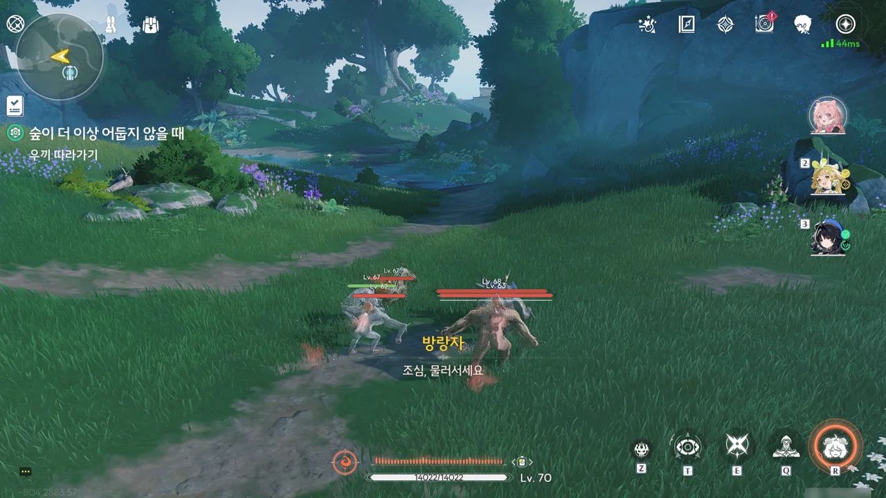



우끼가 포자에 감염된 까부는 원숭이와 대판 싸우고 있다. 대체 왜...?

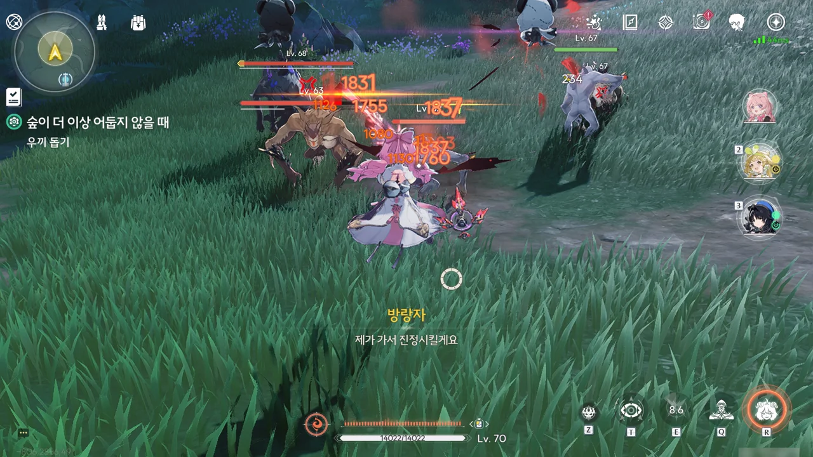



> 제가 가서 진정시킬게요.

진정(물리)

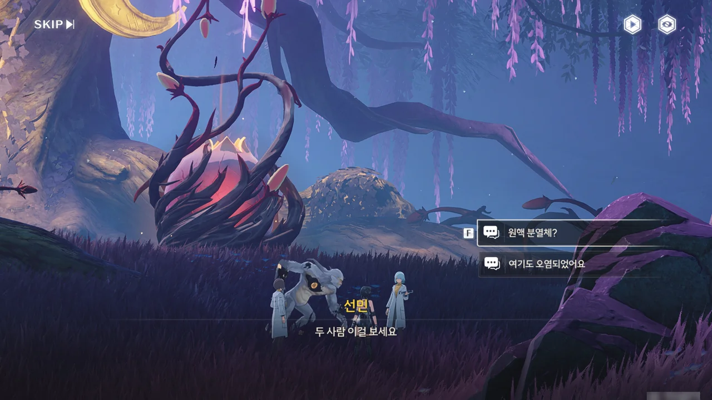





안전구역이라 생각했던 자색 반얀나무 역시 포자에 오염되었다. 이게 다 독무포자의 핵심을 제거하지 못해 원핵 분열체가 퍼져 나가서 그렇다.

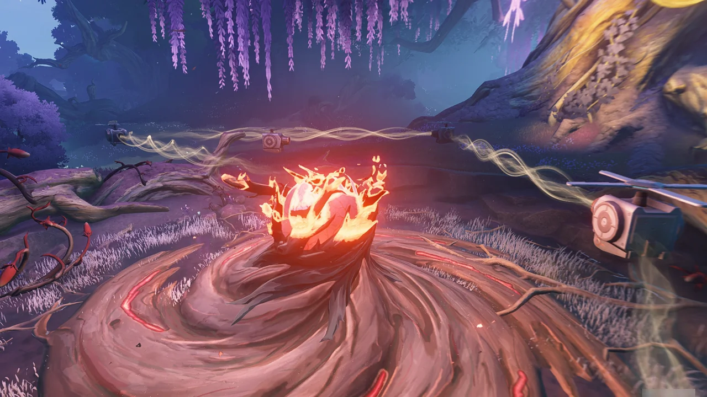

음파 비이이임!







스승이 죽은 후, 선민은 까부는 원숭이를 더 연구해 봤자 아무 결과도 얻지 못할 거라 생각해 까부는 원숭이에 대한 연구를 그만두었고, 그래서 우끼의 특수성에 대해 미처 깨닫지 못하고 있었다.

선민은 연구소에 아직 발표하지 못한 스승의 연구 자료가 남아있을지도 모르니, 당시 연구소로 썼던 곳으로 가겠다고 한다.





아직 그곳에 까부는 원숭이들이 활개치고 있다며 소란이 반대하지만, 문제를 철저히 해결해야 모두가 안전해질 수 있다는 선민의 말에 설득당했다.

설마, 무슨 일 있겠어?



연구소 앞에 까부는 원숭이들이 있었는데요, 없었습니다.

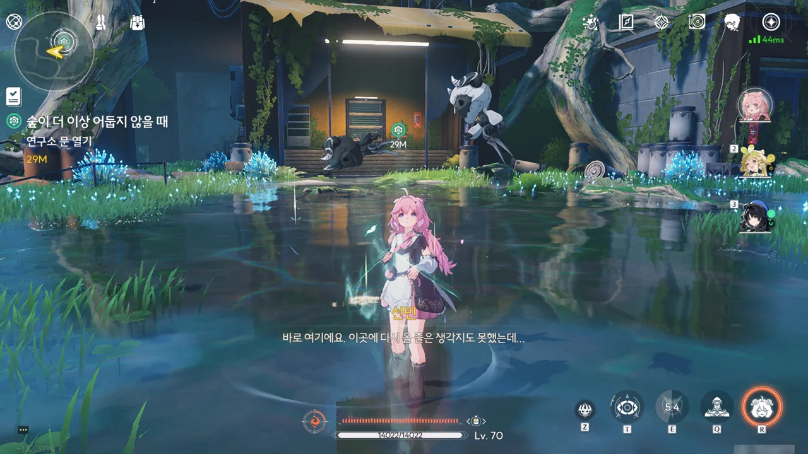



연구소에서 철수할 때 방어 기관을 작동한 후 철수한 탓에, 문이 잠겨있다.



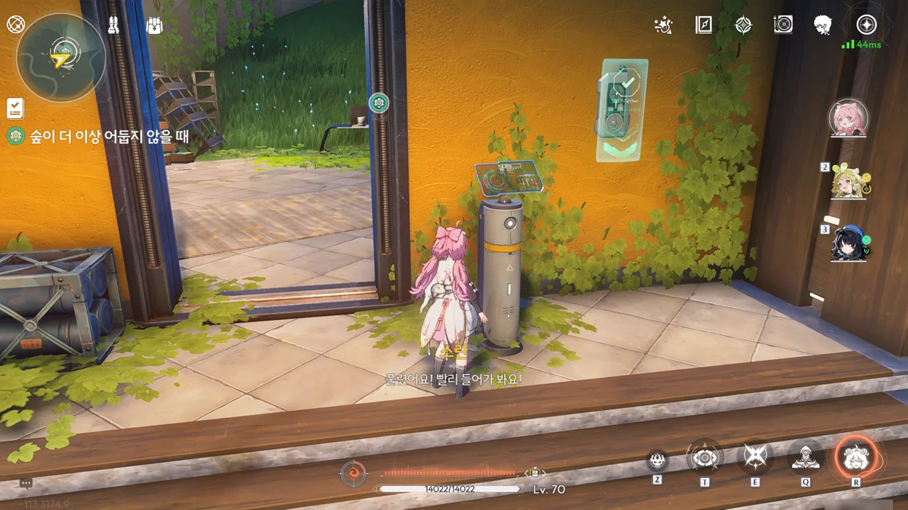

이 정도 퍼즐은 쉽지.

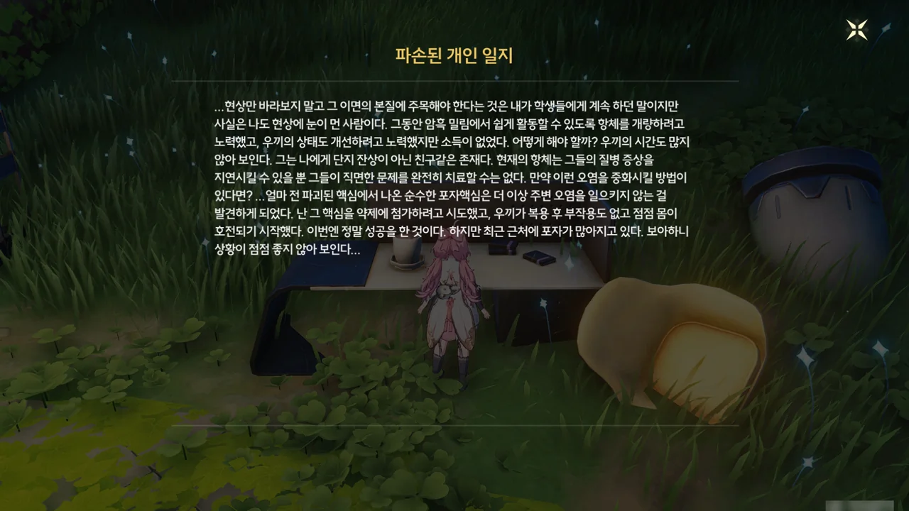

아직 회수하지 못한 스승의 일지에서 순수한 포자핵심을 항체 제작에 사용하면 부작용 없는 완벽한 항체를 만들 수 있다는 정보를 얻었다.

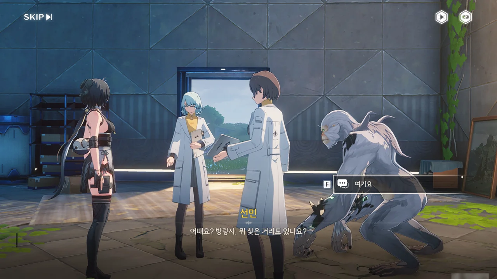









선민은 자신이 독무포자를 제거해야 할 대상으로만 생각해 항체 제작에 쓸 생각을 전혀 하지 못했다며, 곧바로 새로운 항체 연구에 착수하겠다고 한다.

> 빨라야 내일 오후 5, 6시에 결과가 나오겠지.

이 말대로, 정말 다음날 오후 5시까지 기다리라고 하더라.
