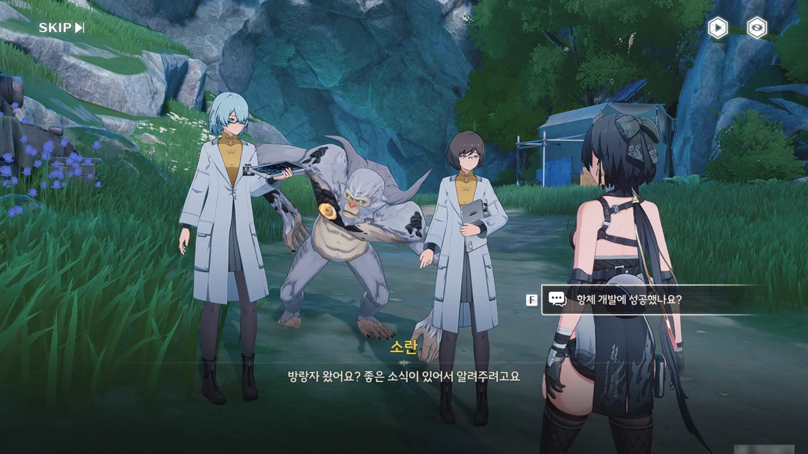





선민이 스승의 연구 결과를 바탕으로 오염이 심한 지역에서도 자유롭게 활동이 가능한 강력한 항체를 개발해 냈다. 그러면 이제 암흑 밀림 지역을 돌아다녀도 중독 디버프에 걸리지 않을 수 있다는 건가?



원핵 핵심이 이 고목 꼭대기에 있다. 독무포자를 견딜 수 있게 해주는 항체도 먹었으니, 단숨에 머리를 치는 것이다.



바로 앞에 '가는 김에 날 깨고 가세요'라고 말하는 듯한 도전이 놓여 있다.

캐릭터의 키가 클수록 빨리 달릴 수 있기 때문에, 양양으로 도전을 완료했다.

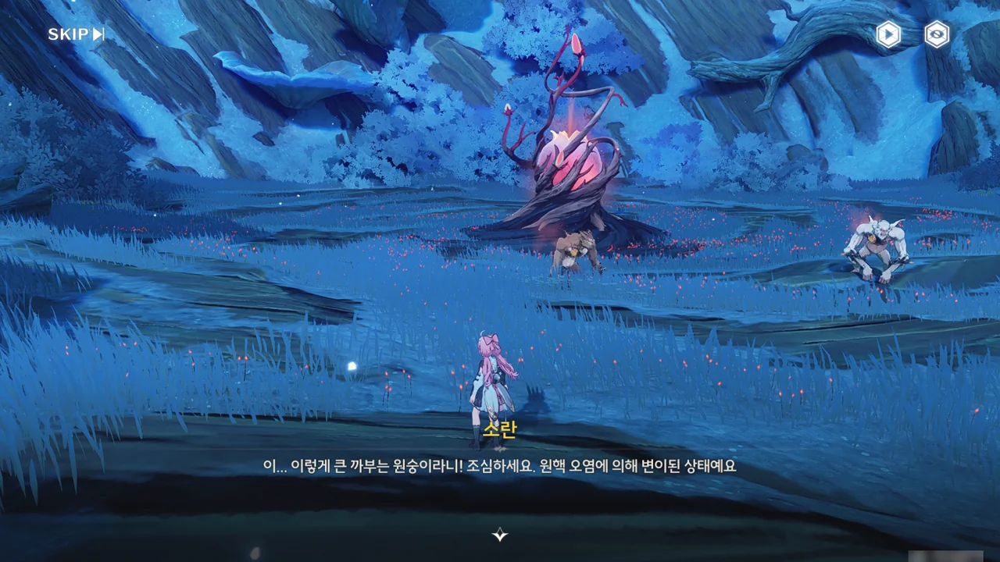

이 녀석은 나름 호위랍시고 커다란 까부는 원숭이 둘을 감염시켜 자신 주변에 배치해 두었다.

단순한 포자는 아니었던 건지, 까부는 원숭이를 변이 시켜 더 강하게 만든 건 덤이다.



하지만 제 밥이죠.



까부는 원숭이 둘이 원핵 핵심의 전력이었는지, 까부는 원숭이 둘을 제거하자마자 원핵 핵심이 사그라든다. 여기서도 음파 퍼즐을 풀 줄 알았는데, 조금 아쉽네.

포자가 사라지자마자 고목에 분홍빛 나뭇잎이 자라난다. 이 반얀나무 고목 역시 포자가 많이 거슬렸나 보다.

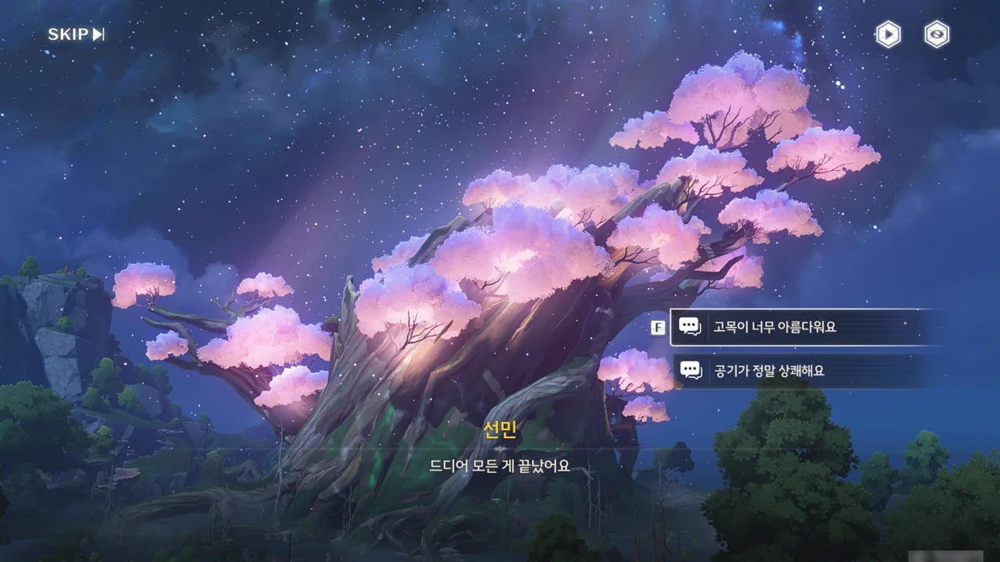



소란의 말처럼, 스승이 바랐던 게 바로 이런 풍경이 아닐까 싶다. 정말 이쁘네.







소란이 휴가 때 성으로 돌아가면 같이 영화를 보러 가자고 선민에게 말하자, 우끼가 '그럼 나는?'이라고 불평하듯이 우는 모습이 귀엽다.









소란과 선민이 준비한 사례금과 함께, 우끼가 특별히 준비한 바나나를 받았다. 이게 그 멸종했다던 「상아 바나나」는 아니겠지?

이로써 암흑 밀림 탐사팀의 임무가 종료되었다. 방랑자의 임무 역시 그러하고.

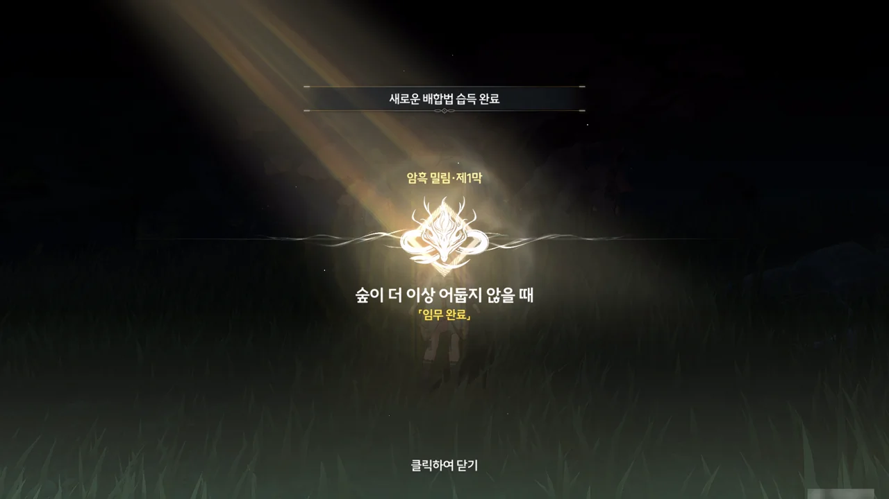

암흑 밀림 제1막 \[숲이 더 이상 어둡지 않을 때\] 완료!

&nbsp;

&nbsp;

가 아니라! 아직 남은 임무가 더 있다. 아까 소란이 앞으로 이 근처를 계속 돌아다닐 거라며, 자색 반얀나무를 언급했지 않은가? 그게 바로 다음 임무에 대한 힌트이다.



아, 자색 반얀나무로 가기 전에 새로 생긴 전망 포인트를 찍는 걸 잊지 말아야 한다.

> 암흑 밀림에 속한 붉은빛의 은하수
{.bq}

오... 꽤나 시적인 문구잖아.

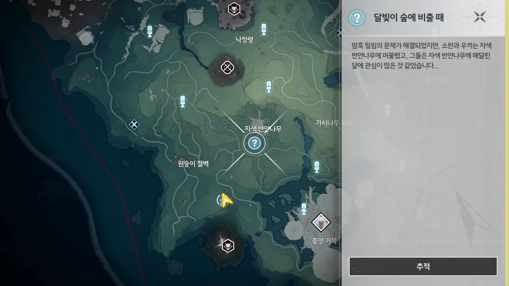

> **달빛이 숲에 비출 때**
> ***
> 암흑 밀림의 문제가 해결되었지만, 소란과 우끼는 자색 반얀나무에 머물렀고, 그들은 자색 반얀나무에 매달린 달에 관심이 많은 것 같았습니다...
{.bq}

거 봐. 새로운 임무라니까?

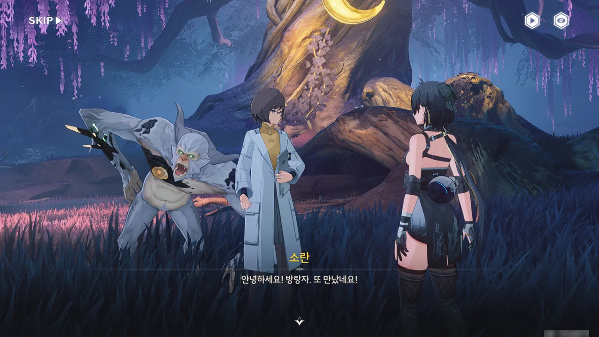





소란과 방랑자는 만나자마자 우끼식 인사법으로 인사한다.



소란이 뜬금없이 달을 보러 가자고 제안한다.

달... 일본에서 '달이 아름답네요'는 '당신을 사랑합니다'라는 뜻을 가진 문장으로 여겨지고 있다. 정작 지금은 너무 촌스럽고 오글거리는 문장이라 생각해 실제로 쓰는 사람이 거의 없지만.

다만 소란이 보러 가자고 한 건 진짜 달이 아닌, 인공 달이다.

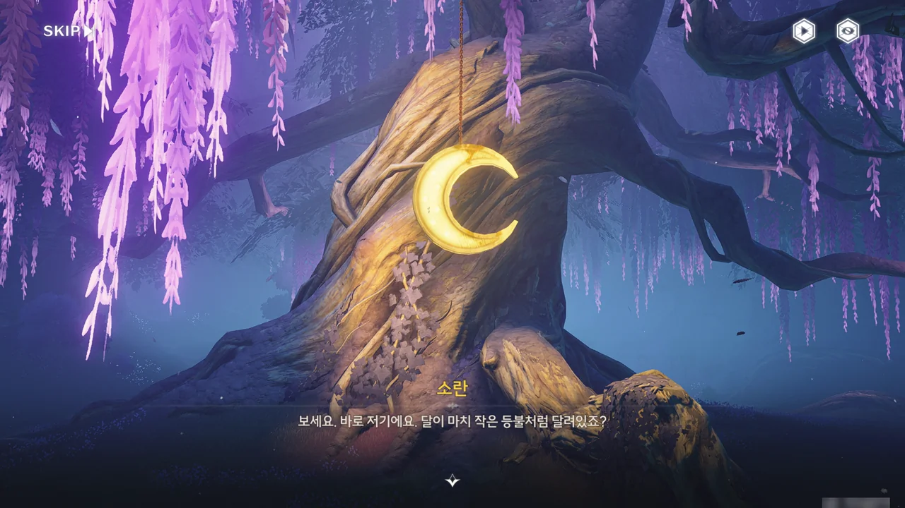







자색 반얀나무에는 마치 작은 등불처럼 달이 걸려있는데, 누가 달았는지는 알지 못한다고 한다.

소란과 우끼는 달 근처를 조사하던 중, 달에서 작은 책자 하나를 찾았다. 책자에는 달과 관련한 동요가 적혀 있었다.

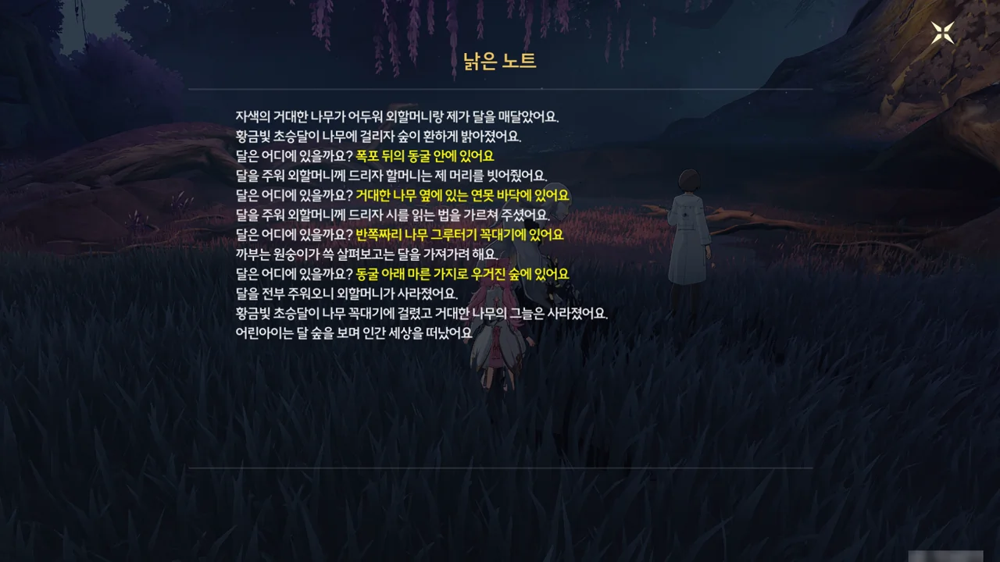





동요에 언급된 '폭포 뒤의 동굴 안', '거대한 나무 옆의 연못 바닥', '반쪽짜리 나무 그루터기 꼭대기', '동굴 아래 마른 가지로 우거진 숲'에 있을 것으로 추측되는 다른 인공 달을 찾아오는 것으로 이야기가 흘러간다.

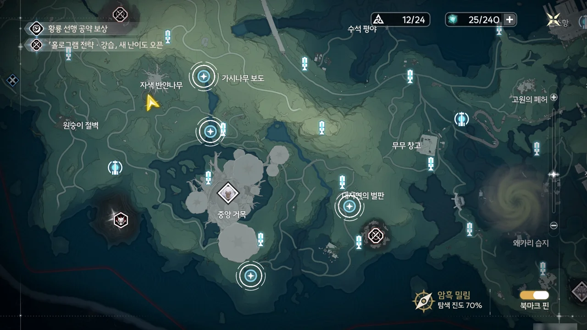

이야, 진짜 온갖 곳에 다 숨겨뒀네.



'거대한 나무 옆의 연못 바닥'에 있는 인공 달을 회수했다.



아, 이게 여기였어? 사운드박스였나, 상자였나 잘 기억은 나지 않지만, 그걸 모으고 다녔을 때 잠시 들렀던 곳인데.

여기 인공 달에는 삐뚤삐뚤한 글자로 '달을 나무에 매달면 마음이 맑아져요'라고 적혀 있다.



'동굴 아래 마른 가지로 우거진 숲'에 있는 인공 달을 회수했다.



'반쪽짜리 나무 그루터기 꼭대기'에 있는 인공 달에는 '모든 일이 잘 풀리길'이란 문장이 비뚤비뚤한 글자로 적혀 있었다.





인공 달에 적혀있던 문장을 합쳐보면 '달을 나무에 매달면 마음이 맑아져요. 모든 일이 잘 풀리길'인데, 글자가 비뚤비뚤한 걸 보면 어린아이가 쓴 글로 추측된다.

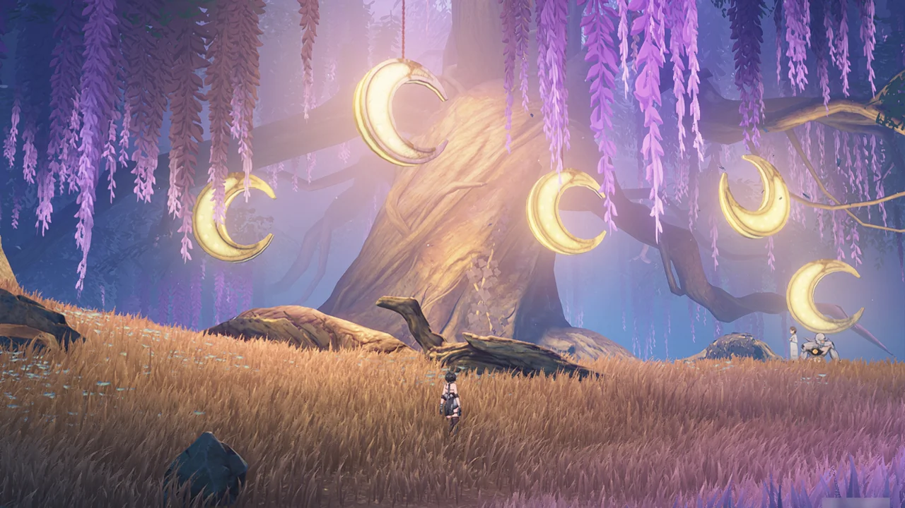

오, 이렇게 다 매다니까 꽤 이쁜데.

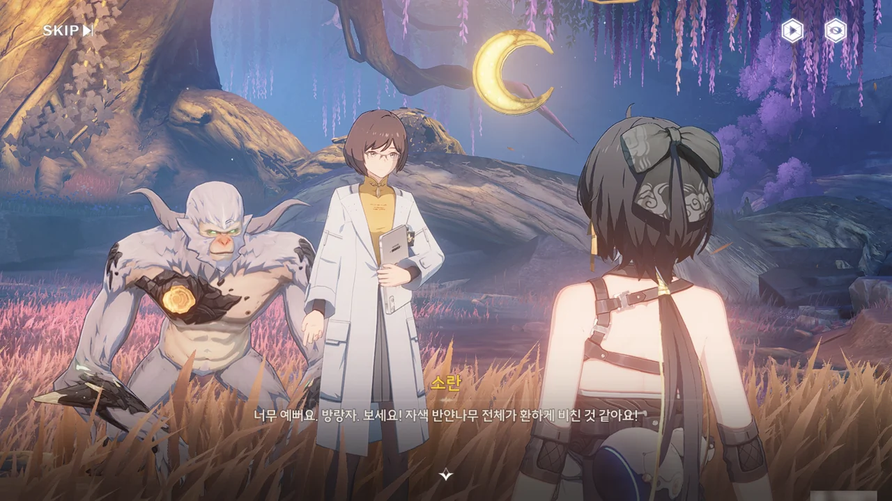







소란이 여기에 한때 「산예」라는 생물이 살았다고 말해주자, 저번에 '자색 반얀나무'라는 단어를 들었을 때 느꼈던 어색함의 정체가 무엇이었는지 알아차릴 수 있었다.

분명, \[야수의 귀환\] 임무에서 능양이 '「산예」가 암흑 밀림 자색 반얀나무 밑에서 살았다'라고 말했지.

소란은 「산예」가 인간의 언어를 할 줄 모른다고 말했지만, 「산예」의 마지막 개체인 능양은 금주성에서 사람들 사이에 섞여 잘 살고 있다.

소란이 하는 말을 들어보면, 이 인공 달을 건 게 바로 능양인 모양이다.

***

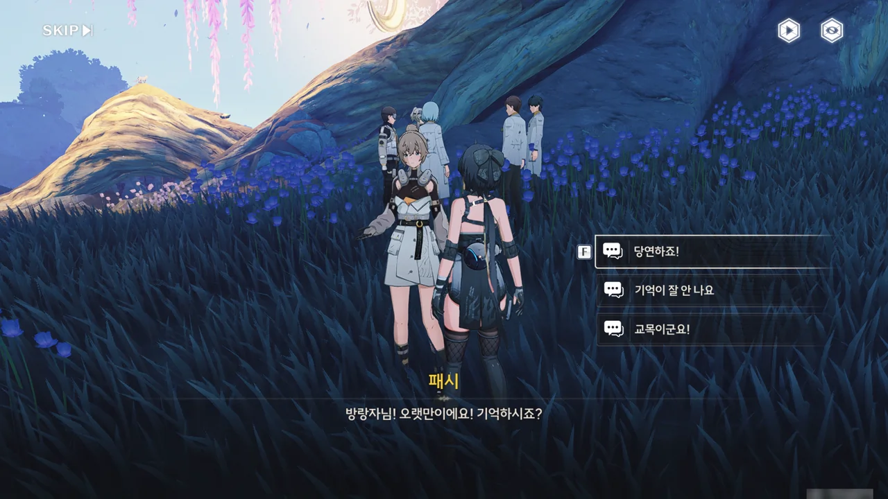

다음 날, 자색 반얀나무 밑에 가보니, 패시가 있었다. 네가 왜 여기서 나와?









선행 공약은 패시가 겪은 일을 알게 되자 「딸랑딸랑 야수」 소문에 대한 현장 조사를 하려 했지만, 독무포자로 오염된 암흑 밀림의 상황 때문에 조사를 시작하지 못하고 계획을 보류하고 있었다. 그러다 연구원에서 암흑 밀림의 독무포자가 모두 제거되었다고 발표하자, 곧바로 암흑 밀림으로 달려와 「딸랑딸랑 야수」 조사를 시작한 것이다.

패시 역시 자신이 마주쳤던 「딸랑딸랑 야수」가 어떤 존재인지 궁금해 여러 고서를 뒤진 끝에 「딸랑딸랑 야수」가 암흑 밀림 자색 반얀나무 일대에서 서식했다는 정보를 얻고 자색 반얀나무에서 조사를 시작하자고 선행 공약에 제안했다.

그리고 이곳에 「딸랑딸랑 야수」로 추측되는 대형 생물이 서식했다는 증거를 찾았다고 한다.

다만 여기에 왜 「덕담대전」이 있는 건지는 이해하지 못하고 있다.

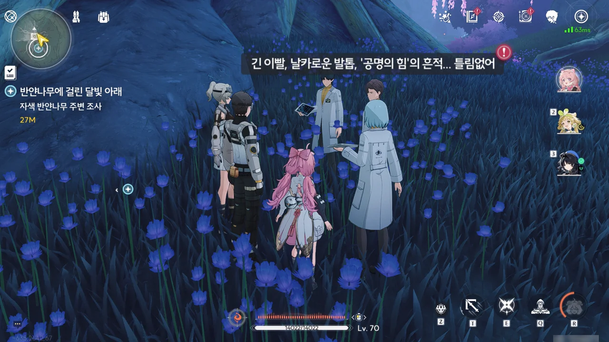

음, 그래. 제대로 짚은 것 맞네.

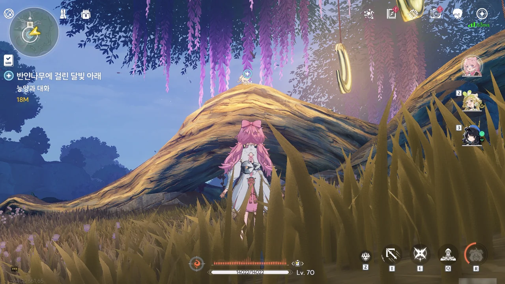

그런데 여기에 왜 능양이 있냐?



능양이 뭔가 소중한 걸 여기서 잃어버린 모양이다.





방랑자가 인사말로 건넨 "「칠성북」 소리가 너무 클까 봐"를 나무 구멍에서 주운 「덕담대전」에서 봤다고 하자, 눈에 띄게 당황스러워하는 능양.

아무리 봐도 선행 공약 사람들이 찾는 「딸랑딸랑 야수」가 능양인 것 같단 말이지...

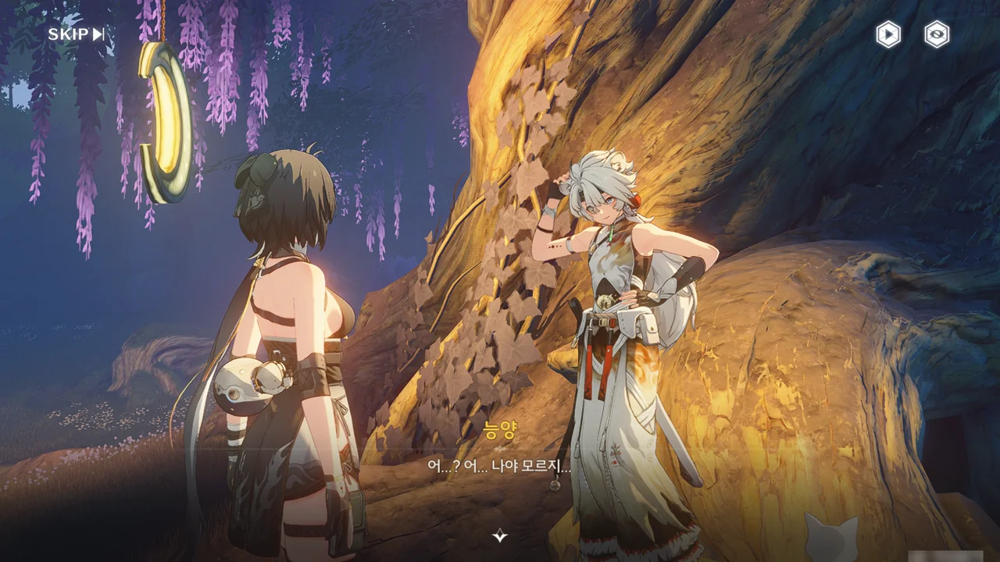



능양이 '난 아무것도 몰라요'라고 말하며 난처한 듯 귀를 쓸어내리는데, 이미 심증 100%이다.

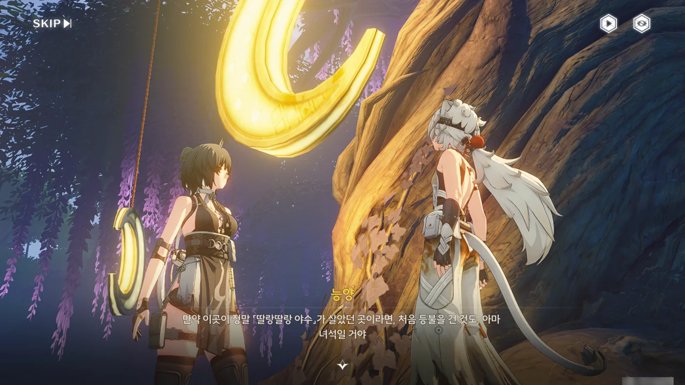



> 만약 이곳이 정말 「딸랑딸랑 야수」가 살았던 곳이라면, 처음 등불을 건 것도 아마 녀석일 거야.
> 이런 어두운 곳에 오래 있으면 자연스럽게 빛을 갈망하게 되겠지... 녀석도 예외는 아닐 거야.
> 가짜로 만든 달 모양 등이라도... 조금은 외로움을 삭일 수 있으니까.

역시나 이 인공 달을 건 게 능양이었구나. 책에서 본 동요에서 외할머니가 느닷없이 사라졌다는 것 역시 동족을 모두 잃은 능양의 처지를 나타낸 것이었나 보다. 어쩌면 마지막에 남았던 것이 능양과 그 외할머니였을지도 모르겠다.



그래도 능양은 이제 외롭지 않을 거다.





해피 엔딩을 갈망하는 건 인간의 본능과 같으니, 이 이야기의 끝 역시 분명 해피 엔딩일 것이다.





패시가 찾았다는 물품이 '돈주머니', '북채', '「사자후 고추다발」'이라는데, 「사자후 고추다발」은 \[야수의 귀환\] 임무에서 순재가 개발한 간식 이름이다.

아마 능양은 금주성으로 간 후, 최근까지도 자주 이곳을 찾아왔던 모양이다.
