어... 내가 언제 이 임무를 받았더라? 심지어 이건 임무가 열렸다는 사진을 찍은 기록도 없어, 진짜 이 임무를 언제 받은 건지 기억이 아예 나지 않는다.

여기서 말하는 '옥 여신'은 바로 단근을 의미한다. 단근의 한자 이름은 丹瑾인데, 여기서 瑾이 '아름다운옥 근'이다. 오역인 줄 알았는데, 중국어 원문에도 玉玉女라고 되어 있더라.

하지만 '제목: 옥 여신, 저 좀 살려주세요!' 부분은 확실한 오역이다. 중국어 원문에선 저 부분이 '发帖人:女侠救我鼠命'으로 되어 있는데, 해석하면 '글쓴이: 여협에게도움받음' 정도라고 한다. 대체 뭘 어떻게 번역해야 글쓴이가 제목으로 번역되는 거야?





야귀군이 지키고 있는 무무물류 창고를 털려고 하다니, 요새 추방자는 간을 배 밖으로 내놓고 다니는 게 기본 소양인가 보다. 수송 지원 때문에 창고 수비 병력의 수가 적은 걸 확인하고 쳐들어온 걸 보면 상황 파악을 전혀 하지 못하는 건 아닌 것 같은데...

야귀군은 금주의 정규군이다. 추방자가 야귀군이 지키고 있는 창고를 습격한 건 산적이 군의 보급 부대를 습격한 것과 다를 바가 없다. 상식적으로, 그런 일이 일어나면 당연히 토벌대가 조직되어 추방자를 대대적으로 수색 및 섬멸할 텐데, 대체 무슨 깡으로 야귀군을 덮치는 거야?

아, 설마 야귀군도 지금 잔상류 때문에 만성 병력 부족에 시달리는 건가?



아무튼 처리 완료.

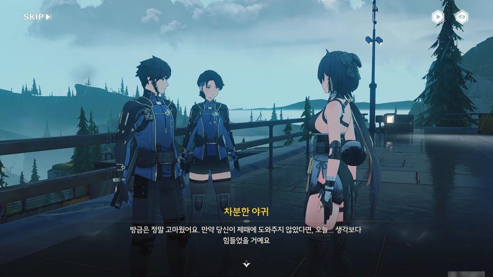



난 추방자가 창고 수비 병력이 적다는 사실을 창고에 미리 잠입시킨 끄나풀을 통해 파악한 거라고 생각했는데, 야귀군의 말을 들어보면 그냥 멀리서 관찰한 게 전부였던 것 같다. 내가 추방자를 너무 과대평가했네.

> 울음새 늪의 환경은 열악하고 일 년 내내 걷잡을 수 없는 안개로 덮여 있는 데다 때때로 천둥번개가 치곤 해요.

아, 이제 알겠네. 저번에 말했던, '안개 때문에 길을 잃었다며 강제로 안전 구역으로 이동되는' 지역이 바로 이 울음새 늪 지역이었다.

개인적으로, 이런 강제 이동식 제약 사항은 별로 좋아하지 않는다. 차라리 바닥에 선을 긋고 '여기부터는 위험 지역입니다'라고 표시하던가... 안개 때문에 길을 잃는 건 츠루미 섬으로 충분하다고.

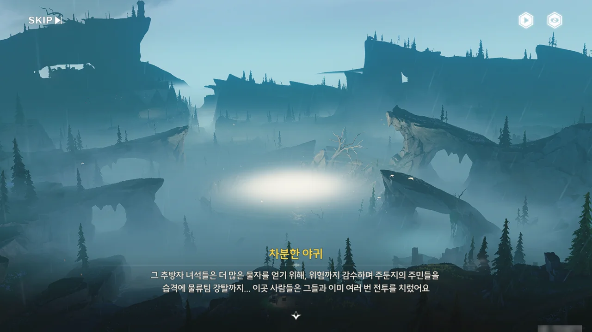

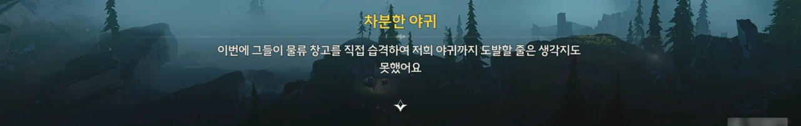

야귀군의 보호를 받는 일반인도 살기 힘든 동네가 울음새 늪이다. 야귀군의 보호를 받지 못하니, 추방자가 울음새 늪에서 살기 더 힘든 건 당연한 일이다. 그래서 부족한 물자를 확보하기 위해 추방자는 일반인이 모여 사는 주둔지는 물론, 울음새 늪을 오가는 야귀군 물자 수송 부대까지 습격한다고 한다.

여기 추방자들은 정말로 간이 배 밖에 나온 게 틀림없다. 민간인을 습격하는 건 그렇다 쳐도, 정규군 물자 수송 부대를 터는 건 정말 죽고 싶어 환장해서 그러는 걸까? 토벌대가 오면 어쩌려고?

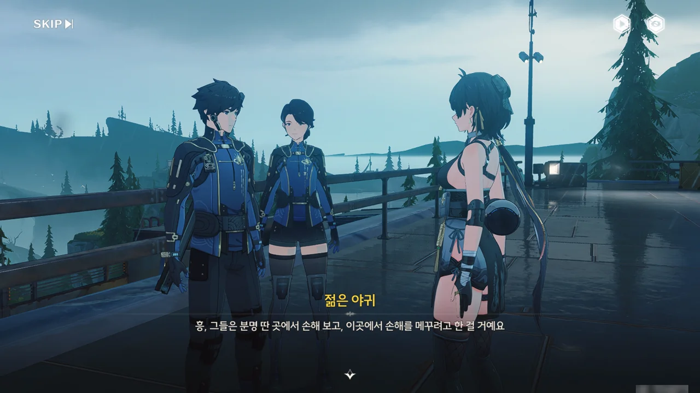





안개 근처에서 유령이 나온다고? 그런데 그 정보의 출처가 '유령을 직접 만난 사람'이라고? 그걸 누가 믿어? 게다가 유령 같은 게 있을 리 없잖아.

앞으로 계속 가고 싶다면 화서연구원에서 온 구월이라는 이름의 연구원을 찾아가 물어보라고 한다.





다만 구월은 지금 여기 없다고 한다. 계속 날뛰는 잔상과 추방자 때문에 혼자 다니기 매우 위험한 상황임에도 불구하고 조사 연구를 위해 안갯속으로 홀로 걸어 들어갔다고 한다. '또'라는 말을 한 걸 보면, 이번이 처음은 아닌 모양이다.

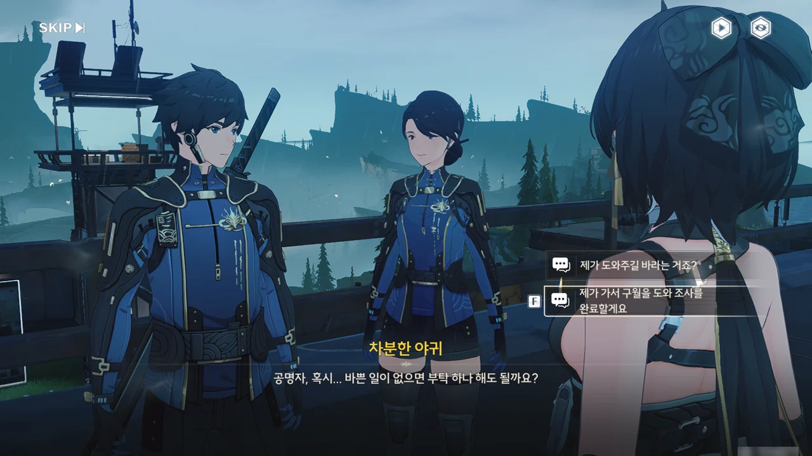







알아, 알아. 구월을 찾아달라고 부탁하려는 거지? 이젠 이야기가 흘러가는 것만 봐도 내 앞에 있는 NPC가 무슨 말을 하게 될지 보지 않아도 알게 되는 경지에 이르렀다.

게다가 돈도 준다고 한다. 요새 캐릭터나 무기, 에코를 키우려면 돈이 상당히 많이 들어서, 돈이 항상 부족한 터라, 돈은 언제나 환영이다.



구월이 '짹짹' 소리를 내는 무언가 앞에 서있다.

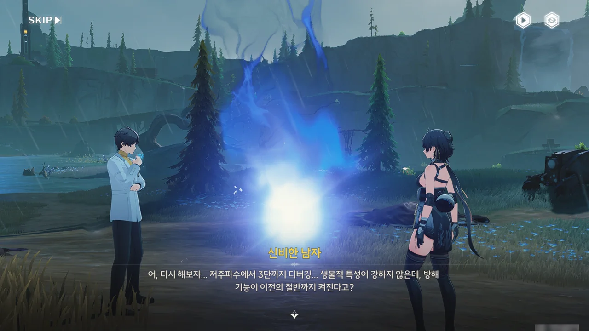





여행자가 구월에게 말을 걸어보지만, 지금 엄청 중요한 단계라며 방랑자의 말을 씹어버린다.

대체 구월은 이 빛나는 무언가와 뭘 하고 있는 거지?





아, 이게 그 '유령'이란 거야? 난 또 유령이라길래 사람 모습을 한 무언가일 줄 알았는데, 알고 보니 그냥 소리 나는 도깨비불 정도에 불과했네.

아까 들은 대로, 구월은 화서연구원에서 울음새 늪으로 파견 온 연구원이며, 울음새 늪의 잔상 성태와 이상 현상을 연구하고 있다고 한다.

안개 때문에 길을 잃는 게 이상하다 생각하고 있었는데, 이것도 이상 현상 중 하나였구나.





구월을 도와 이번 조사 연구를 끝내겠다고 방랑자가 말하자, 구월이 자신은 한동안 다른 사람들과 협력한 적이 없었다며 눈에 띄게 당황해한다. 그게 그렇게 놀랄 정도인가? 설마 다른 사람과 협력하기 힘든 성격인 건 아니겠지?







구월이 방금 했던 건, 처음 마주친 유령이 비명 이상 현상이 아닌, 특정 주파수 단계를 포함한 분석 가능한 정보 에너지라는 걸 알게 되자, 유령이 담고 있는 정보를 추출하기 위한 시도였다고 한다. 그걸 위해 화서연구원에서 쓰는 번역 프로그램을 개조했다는 걸 보면, 실력이 제법 있는 연구원이다.

난 구월이 '연구원' 하면 흔히 생각하는, '능력 하나는 좋지만 특유의 괴짜스러움 때문에 연애를 단 한 번도 해본 적 없는 독신 연구원' 캐릭터라고 생각하고 있었는데, 놀랍게도 다희라는 이름의 아내가 있다고 한다.

죽마고우, 소꿉친구인 아내라고 한 걸 보면, 어릴 적부터 함께 자라다가 끝내 결혼까지 한 사이란 건데... 이런 사이는 정말 창작물에서나 볼 수 있는 사이 아닌가?



아무튼, 구월의 번역 프로그램이 하는 일을 간단히 요약하면 '유령이 하고 싶은 말을 알려주는' 것이다.





구월이 번역 프로그램으로 유령에게서 뽑아낸 정보는 다음과 같다.

> 너, 우리, 함께, 노래, 맑은 하늘, 슬픔과 사랑
{.bq}

이 단어만 봐선 '우리 함께 노래하니 맑은 하늘은 더 이상 슬퍼하지 않는다'라는 구절이 제일 그럴듯해 보인다. '사랑'은 일단 제쳐두고.

일단 여기에 대해선 '그런가?' 정도로만 덮어두고, 안갯속 깊숙이 들어가는 데에 집중하기로 했다.







울음새 늪과 관련한 실험 기록을 뒤져본 구월은 정비소를 찾아 장비를 재부팅하여 안개를 몰아내고 안개의 출처를 조사하기로 조사 순서를 정했다.

방랑자에게 탐사에 필요한 '초음파 펄스 칩'을 건네주려 했지만, 유령을 쫓는 것에 정신이 팔려 가방을 두고 온 걸 이제야 깨달았다.

> 전 너무 충동적인 거 같아요.

그래도 자신의 문제점이 무엇인지 알고 있긴 하네. 아내가 이미 그걸 지적했는데도 여전히 고치지 못한 걸 보면 아직 갈 길이 멀긴 하지만...



다른 동물이나 잔상이 배낭을 가져가서 그 흔적을 추적하는 전개를 기대했는데, 배낭은 얌전히 물가에 놓여있었다.

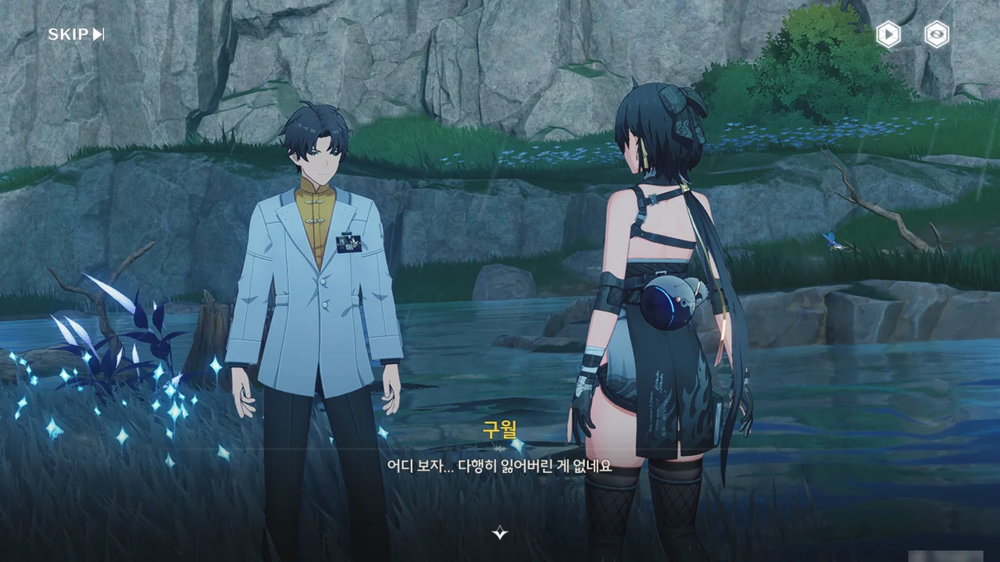



초음파 펄스 칩을 받았다. 이게 정확히 뭘 하는 건진 모르겠지만, 울음새 늪을 통과할 때 도움이 될 거라고 하니, 받아두면 좋을 것이다.

그리고 울음새 늪에 대해 추가로 알려준다고 하니, 귀를 열고 경청하기로 했다.





이곳에 '울음새 늪'이라는 이름이 붙은 까닭은 지형의 생김새가 애곡하는 아익스와 닮았기 때문이라고 한다. 땅과 물 온도차 때문에 토네이도가 종종 발생하는데, 울음새 늪에 비정상적인 안개가 끼기 시작한 이후부터 진흙이 토네이도에 섞여 온 사방에 흩날리는 문제가 생겼다.

초음파 펄스 칩의 진동을 통해 진흙을 제거할 수 있다고 하는데, 그냥 물로 씻어내면 안 되는 걸까? 진흙이 그렇게 끈적거리나?



> **초음파 펄스 칩**
> ***
> 이 칩을 장착하고 활성화하면 소용돌이를 방출할 수 있으며, 초음파 펄스의 진동을 통해 늪 소용돌이중의 탁한 진흙을 흩뜨리고, 잔상의 진흙 실드를 깨트릴 수 있다.
> ***
> 이 칩은 화서연구원이 개발하였으며, 장착 후 사용자가 토네이도 형태의 늪 소용돌이를 처리하고 울음새 늪 수역 부근을 탐색하는 데 도움이 될 수 있다.
{.bq}

정말 신기하네. 어떻게 칩 하나로 소용돌이를 방출할 수 있는 거지?

아무튼 이 칩으로 만들어낸 소용돌이는 늪에 발생한 소용돌이를 상쇄할 수 있고, 잔상 등에 붙은 진흙 실드를 깨트릴 수 있다고 한다. 세상에, 잔상이 진흙을 둘러 실드를 만든다고?



재미는 있어 보이는데, 막상 전투에서 쓰긴 힘들 것 같다. 그래도 진흙이 파삭하고 흩어지는 건 보기 좋다.

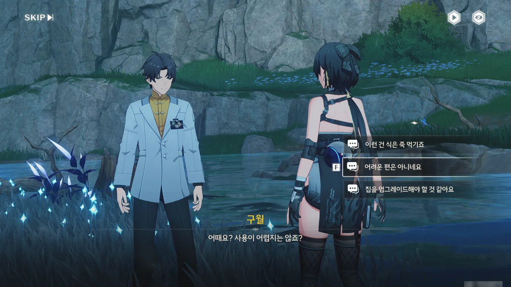

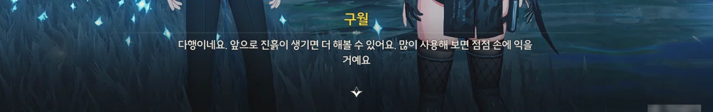

구월 말처럼, 쓰다 보면 손에 익숙해지겠지.











안개, 때아닌 천둥번개, 늪 소용돌이 같은 이상 현상은 갑자기 나타난 게 아니라고 한다. 맨 처음 이상 현상이 나타난 곳은 지금 안개에 싸여 있는 가장 깊은 곳이라고 하니, 거기에 이상 현상의 근원이 있을 거라 추측할 수 있다. 하지만 안개가 너무 짙어, 안갯속으로 그냥 들어갈 수는 없다.

구월은 예전 자료를 살펴보던 중, 직정 학자들이 예전에 안개를 연구하는 전문 정비소와 함께 안개를 흩어지게 하는 억제 장치를 건설했다는 걸 알게 되었다. 정비소가 버려지자, 주기적인 유지 보수를 필요로 하는 억제 장치가 유지 보수를 받지 못해 고장 나 다시 안개가 차올랐고, 결국 정비소와 함께 안갯속에 파묻혔다고 한다.

그래서 구월의 일차적인 목표는 폐기된 정비소를 찾아 억제 장치의 위치를 찾고 재부팅 키를 확보하는 것이다. 억제 장치가 안개를 날려 보내면 안개 가장 깊숙한 곳에 있는 이상 현상의 근원을 확인할 수 있을 거고.





구월은 다희를 제외하면 다른 사람과 팀을 이룬 게 이번이 처음이라고 한다. 왜 이번 연구에 다희와 함께하지 않은 거냐 묻자, 다희와 어쩔 수 없이 오랫동안 떨어져 있다고 답한다.

구월과 다희는 서로 소꿉친구였다가 결혼까지 한 사이이니, 둘의 사이가 나빠졌을 거라 생각하기는 힘들다. 설마 다희가 금주가 아닌 다른 곳으로 출장을 간 건가?



일단 첫 번째로 해야 할 것은 직정의 건물을 발견한 적이 있다는 '계성'이라는 사람을 찾아가는 것이다.

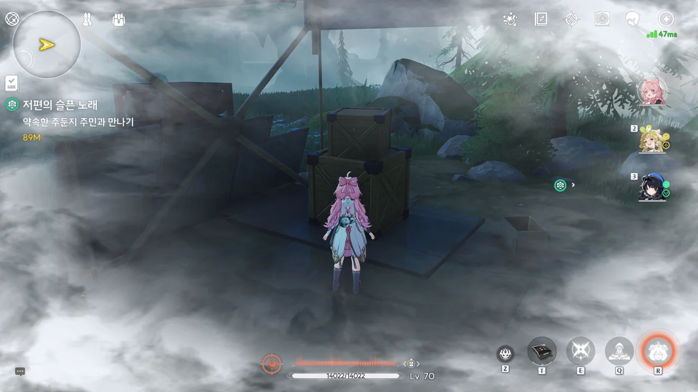

그래. 바로 이 안개. 길에서 조금만 멀어져도 안개 때문에 길을 잃었다며 강제로 가장 가까운 길로 이동된다.

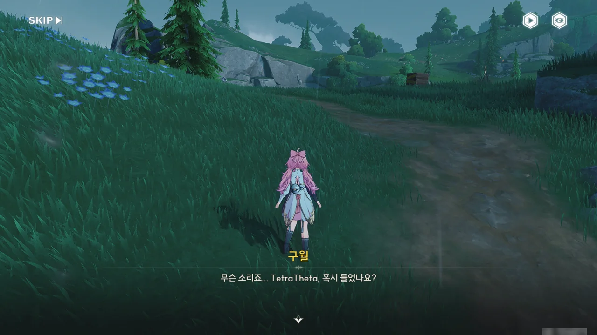

응? 유령?

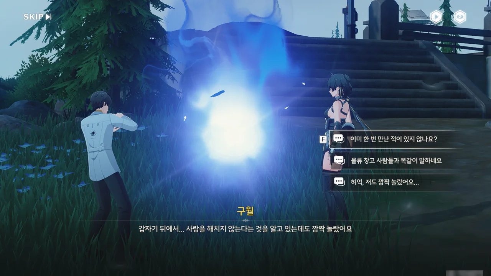





이번 유령은 이전 유령과 마찬가지로, 사람이 있는 걸 알고 의도적으로 다가온 것 같다고 한다. 그런 일이 가능한 건가? 유령은 의지 없이 임의로 나타나는 소리 나는 도깨비불이라 생각하고 있었는데...





이번 유령의 메시지 역시 그 뜻을 알기 어렵다. 아까의 유령이 담은 메시지와는 또 다른데...

대충 '난 이미 죽어 부활할 수 없으니, 날 잊어달라'라고 말하는 것 같긴 한데, 웬 부활?







각 유령마다 담고 있는 정보가 다르고, 안개에 가까워질수록 유령이 담고 있는 정보를 더 많이 추출할 수 있을 것이라는 가설을 세웠다.



계성과 약속한 시간이 거의 다 되어, 서둘러 약속 지점으로 향한다.
