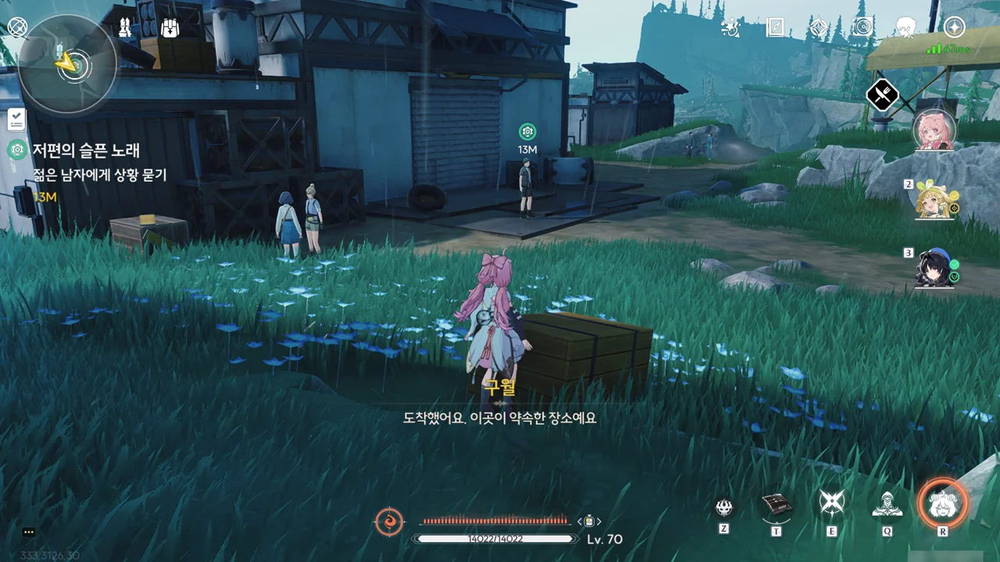

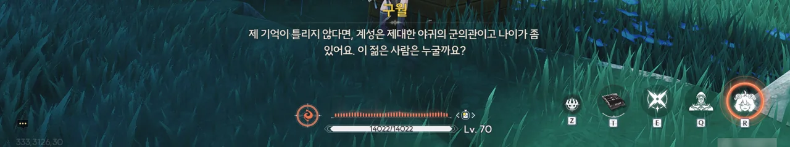

구월과 만나기로 약속한 '계성'은 제대한 야귀군 군의관이며, 나이가 좀 있는 사람이라고 한다. 그런데 왜 약속 장소에 젊은 사람이 나와 있는 거지?







이 사람은 계성의 아들, 계걸이라고 한다. 부상을 입은 주민을 치료하기 위해 자리를 비운 아버지 대신 아들이 대신 약속 장소에 나와 있던 것이었다.

방랑자가 계성을 도와주면 일이 빨리 끝날 것 같아, 혹시 도울 일이 있냐 물었지만, 부상자 치료는 이미 다 끝났으며, 약속 시간도 맞추지 못한 주제에 도움까지 바라는 건 말도 안 된다며 부드럽게 거절당했다.

그래도 한 시간 정도만 기다리면 계성의 일도 다 끝날 거라고 한다.









슬프고 처량한 울음소리를 내며 아무 이유 없이 지나가는 행인을 공격하곤 하는 '애곡하는 아익스'에겐 원래 반려가 있었다. 반려가 있었을 적의 애곡하는 아익스와 그 반려는 사람이 가까이 다가가도 전혀 신경 쓰지 않았다고 한다. 하지만 반려가 죽자, 아익스는 지금의 모습으로 변했고, 그와 더불어 울음새 늪 역시 바뀌었다.

> 혼자 남겨진 자의 슬픔은 엄청 고통스러울 거예요.
> 고통스럽기 때문에 아픔을 털어놓을 방법을 찾으려고...

구월이 마치 애곡하는 아익스에게 공감하는 듯한 말을 하는데... 설마 구월도 비슷한 상실을 겪었던 건가? "애곡하는 아익스라는 이상 현상을 해결하려고 하니, 그에 대해 잘 아는 것이 당연하다"라고 말하지만, 애곡하는 아익스는 이상 현상이 아닌 잔상 아닌가? 잔상도 이상 현상 중 하나로 취급하는 건가? 구월이 뭔갈 숨기고 있는 것 같다는 생각이 든다.

계걸이 애곡하는 아익스에 대해 더 자세히 알고 싶다면 주둔지의 다른 어른들에게 물어보라는 조언을 해준다.

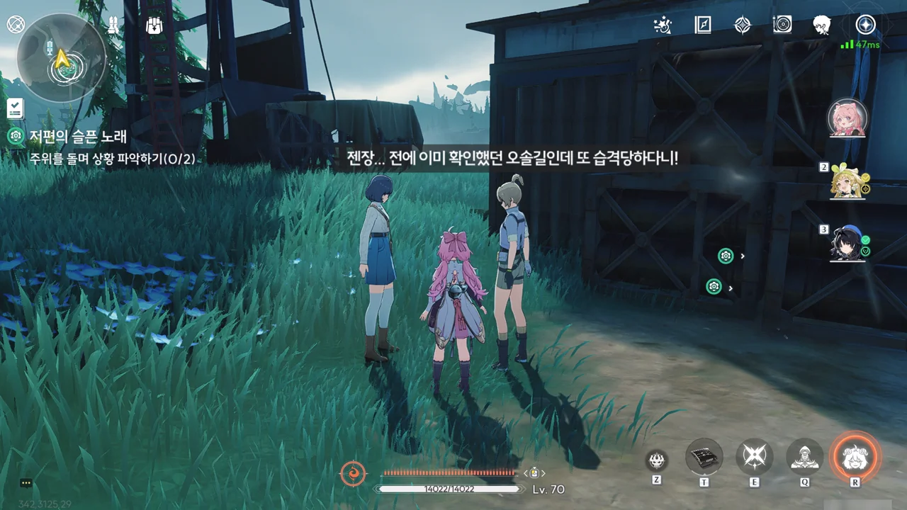

이 둘이 무슨 이야길 하나 잠자코 들어봤는데, 그냥 추방자에게 습격한 걸 갖고 분통을 터트리는 거였다. 내가 필요로 하는 이야기는 아니네.

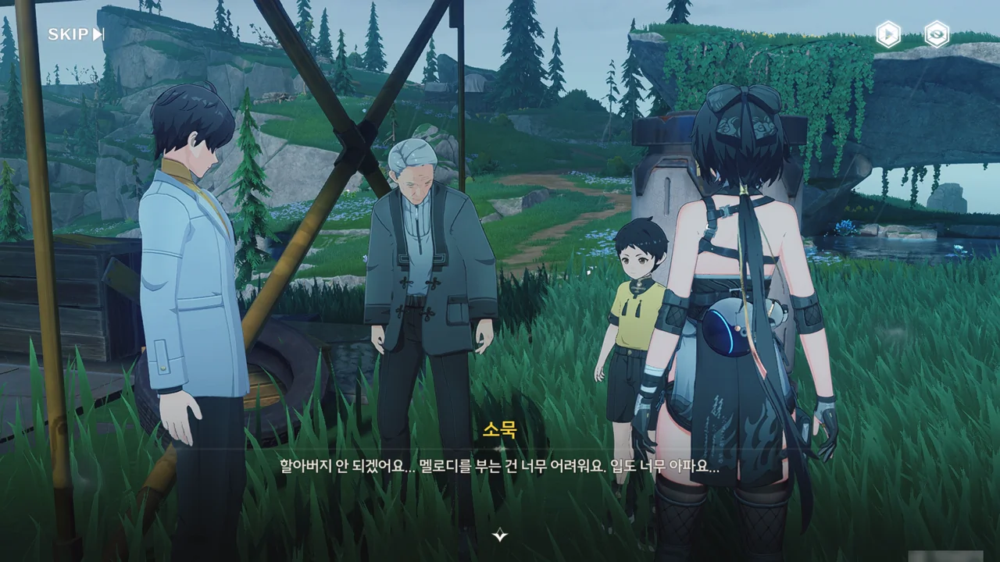









이 마을에는 나뭇잎 피리로 애곡하는 아익스와 함께 노래를 부르는 전통이 있다고 한다. 반려가 아직 살아있을 적의 애곡하는 아익스를 말하는 거겠지?











애곡하는 아익스와 그 반려는 사람을 공격하지 않았으며, 서로가 한 쌍의 그림자처럼 이리저리 날아다니며 서로의 목을 맞대는 모습이 마치 어린 연인 같았다고 한다.

그 모습을 지켜보고 있던 누군가가 그 둘에게 나뭇잎 피리 소리로 인사를 하자, 두 잔상은 노래를 알아들었을 뿐만 아니라 그에 응답해 합주까지 했다고 한다.

하지만 잔상류가 폭주할 때, 애곡하는 아익스의 반려는 애곡하는 아익스를 보호하려다 다른 잔상에게 잡아먹혔고, 홀로 남은 애곡하는 아익스는 슬픔에 미쳐, 가까이 다가온 모든 생명체를 공격하는, 지금과 같은 모습이 되었다고 한다.

구월이 과거의 슬픔을 이겨내고 현실을 받아들여야만 그 아픔에서 빠져나올 수 있다고 하지만, 그게 쉽지는 않지. 구월은 그래도, 이 연구처럼, 쉽지 않아도 계속해야만 한다고 말하며, 자연스럽게 화제를 연구로 되돌린다. 뭔가 의도적으로 말을 돌리는 것 같은데...

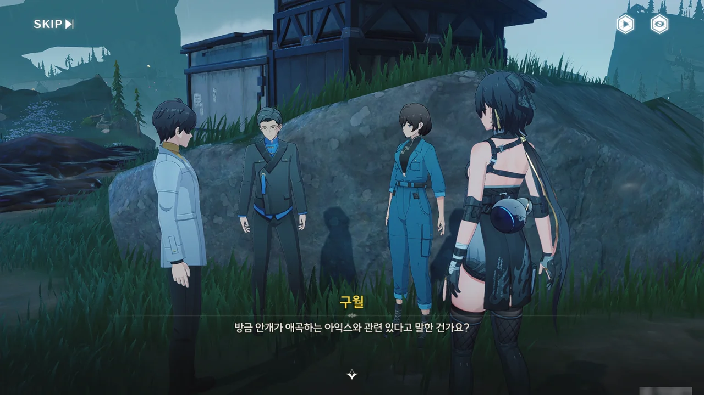







애곡하는 아익스가 안갯속으로 들어가 한참 동안 나오지 않다가, 나온 후에는 주변에 심한 뇌우와 짙은 안개가 생기는 것을 여러 번 봤다는 화연의 목격담을 들었다.

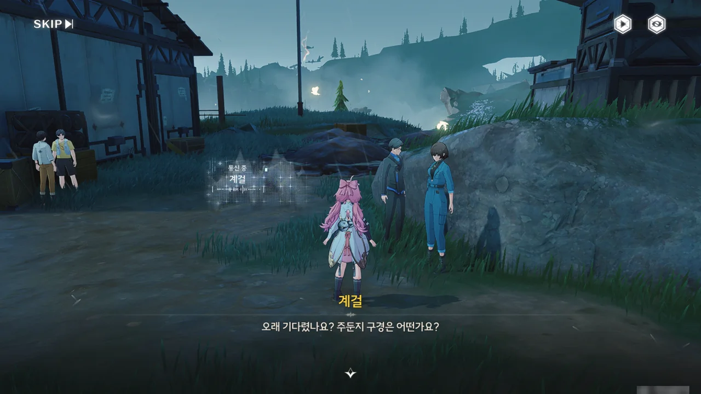

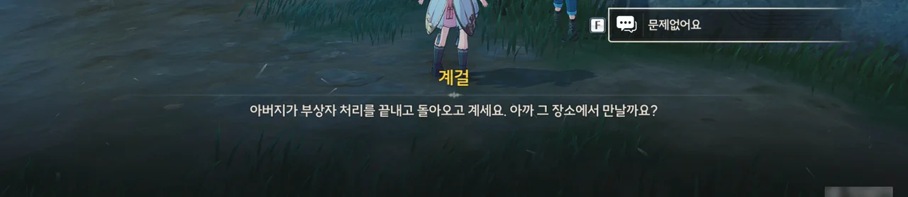

계성의 일이 다 끝났으니, 이제 계성의 이야기를 들으러 가보자.

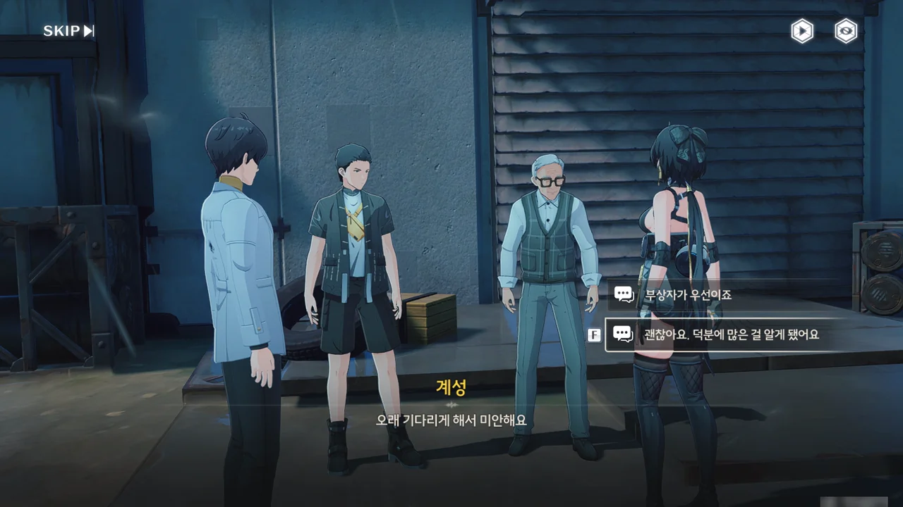









계성이 자신이 발견한 직정 건물에서 관측용으로 추측되는 장비와 비품, 안개가 환경에 어떤 영향을 끼치는지 추론하는 모듈을 보았다고 한다. 정말 거기가 직정의 안개 연구 정비소였던 모양이다.

직정 시설에 접근하기 위해선 권한이나 시스템 식별 같은 게 필요하지만, 이미 구월이 상리요에게서 필요한 걸 받아왔다.

상리요... 조수 임무에서 짤막하게 언급된 사람인데, 여기서 그 이름을 한번 더 듣게 될 줄은 몰랐네.

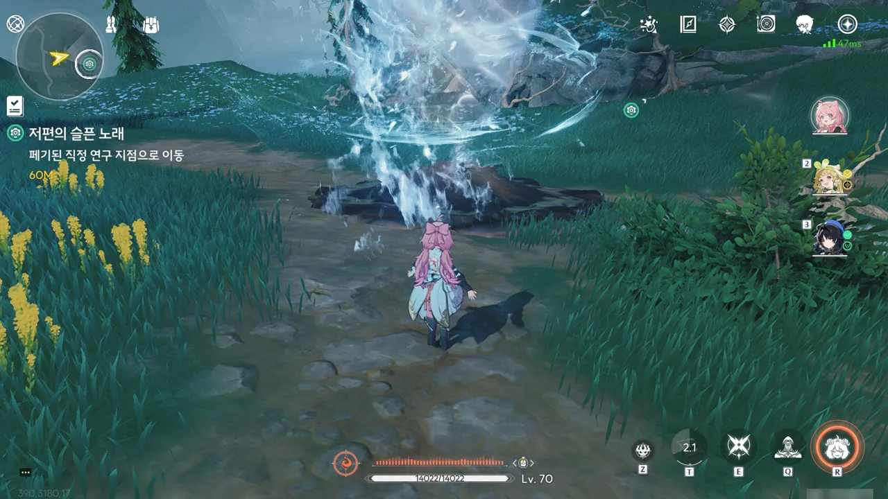

이 초음파 펄스 칩, 은근 바보다!

난 토네이도가 지면을 따라 아래로 내려가며 진흙을 없앨 거라 생각했다. 하지만 토네이도는 플레이어가 서있는 고도를 유지한 채 그저 맥없이 앞으로 나아가기만 한다! 그래서 저 진흙을 제거하려면 일부러 진흙보다 낮은 곳으로 이동한 후, 거기서 토네이도를 쏘아 보내야 한다.

이 뭔 바보 같은...

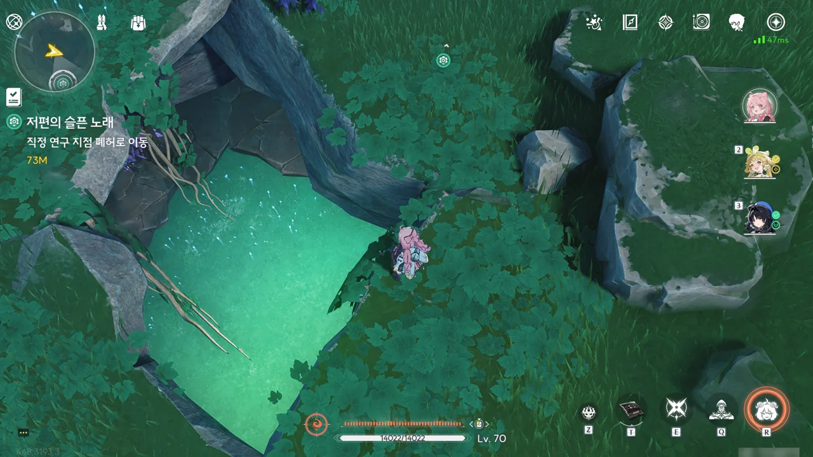

난 계성이 발견했다는 직정 건물이 지상에 세워진 건물이라 생각하고 있었다. 그런데 지면에 있는 구멍을 통해 아래로 내려가라는 걸 보면, 직정 건물은 지하에 있는 모양이다. 그러면 계성은 이 지하에 있는 건물을 대체 어떻게 발견한 거야?

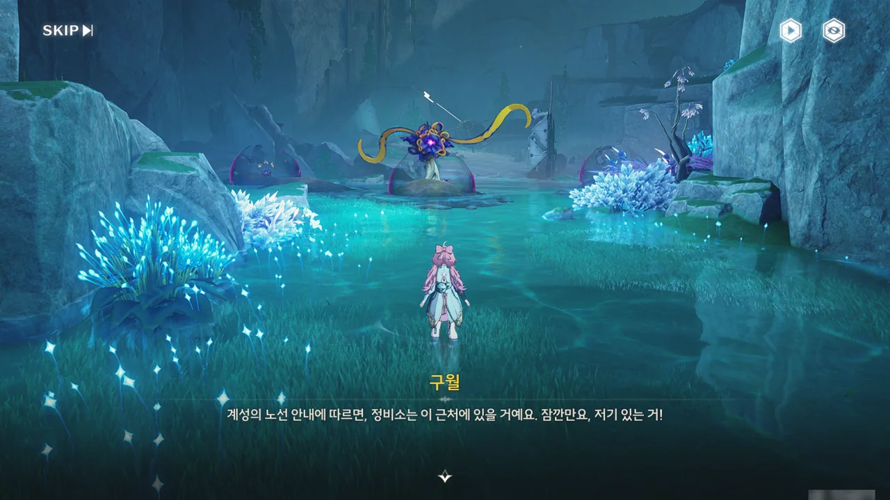



초음파 펄스 칩의 설명에서 예고되었던 것처럼, 잔상이 진흙을 둘러 실드로 쓰고 있다.

토네이도로 진흙을 싸악 벗겨내면 된다.

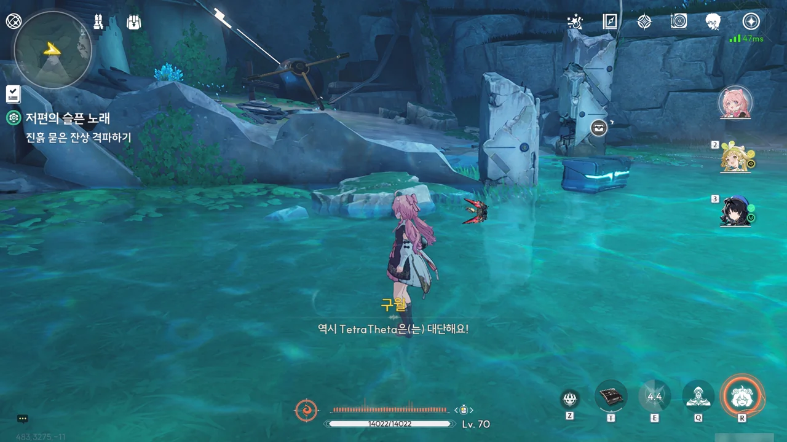

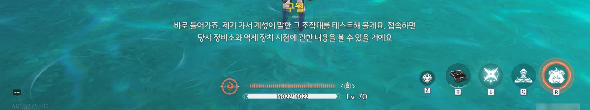





구월 역시 여기가 왜 버려진 걸까 궁금해했지만, 그와 관련한 자료를 찾을 수 없었다고 한다. 그의 추측처럼, 자금 부족이나 외부 압력 등에 의해 연구가 타의로 중단된 게 아니었을까라고 생각할 수밖에.



정비소의 중추 기계로 보이는 조작대에는 직정 461번 팀의 규범 매뉴얼이 일급 기밀로 저장되어 있었다.

규범의 처음은 그럴듯한데, 중간부터는 '이것도 규범이라고?'라는 생각이 들 정도의 항목이 적혀있다. 회의실에서 냄새나는 국수를 먹지 말라는 것, 사무실에서 개그를 하지 말라는 것까지는 이해할 수 있다. 그런데 일일 탄산음료 섭취량, 다리 꼬는 횟수와 시간 등의 통계가 기준을 초과한 사람을 월말 추첨에서 제외한다는 건 대체 뭔 소리야?





일급 기밀이라기에는 이상한 내용이 많은 매뉴얼이었지만, 그래도 거기서 안개 억제 장치의 위치를 알 수 있었으니, 뭐 상관없나.

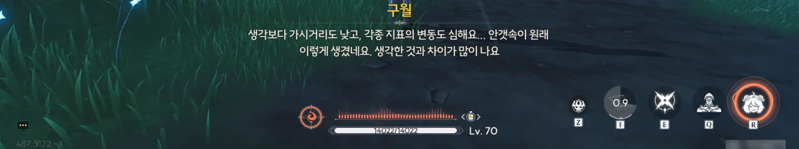





원래 이런 종류의 장치는 원격 모니터링을 통해 점검과 재활성화를 할 수 있어 유지 보수가 필요 없지만, 울음새 늪에선 진흙 때문에 장치가 물리적으로 차단되기 때문에 직접 유지 보수를 해야 한다고 한다.

토네이도 한 방이면 저 진흙도 싹 깔끔하게 정리될 것이다.



장치를 활성화한다고 활성화가 곧바로 완료되는 게 아니라, 근처에 머물면서 진행도를 100%까지 채워야 한다.

그리고 당연하게도 그걸 방해하러 잔상이 몰려온다.



효과가 있는 건지 없는 건지는 잘 모르겠지만, 안개가 조금은 걷힌 것 같다.



안개 억제 장치 안에서 애곡하는 아익스 관찰 일지를 발견했다.

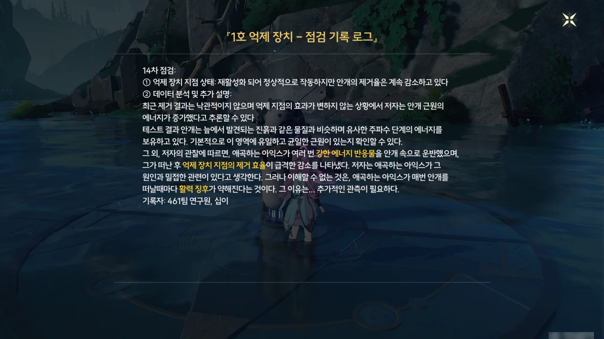



관찰 일지에는 애곡하는 아익스가 안개의 중심지로 고에너지 반응물을 여러 번 운반했으며, 애곡하는 아익스가 중심지를 떠나고 나면 안개 억제 장치의 효율이 급락하는 일이 반복되었다고 적혀 있었다.

주둔지에서 화연이 했던 말과 어느 정도 일치한다.

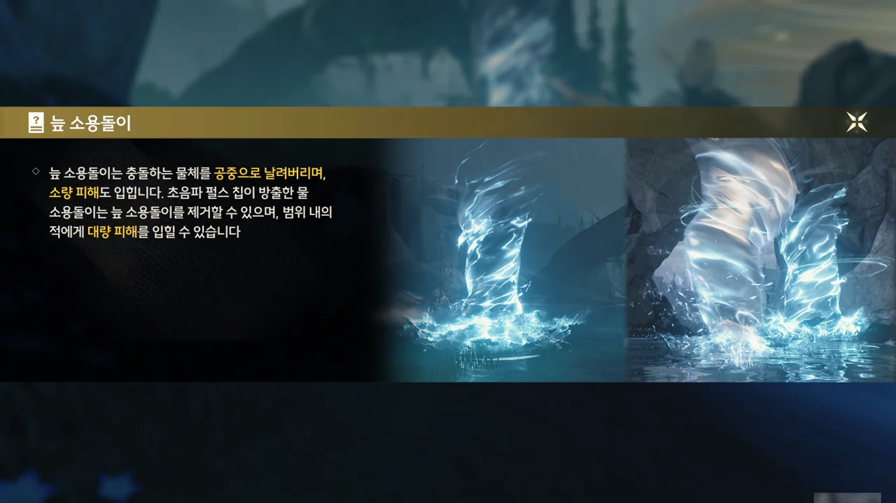

초음파 펄스 칩으로 만든 소용돌이는 적에게 직격 시켜야만 소량의 피해를 줄 수 있지만, 늪에 돌아다니는 소용돌이와 충돌시키면 일정 범위 내의 모든 적에게 대량의 피해를 입힌다. 이런 걸 뭐라고 불러야 하지? 공진?

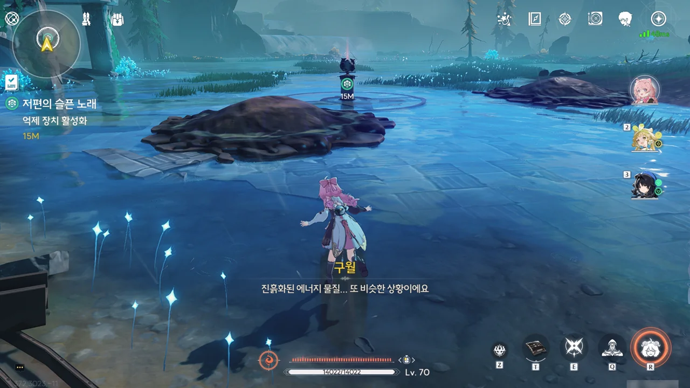

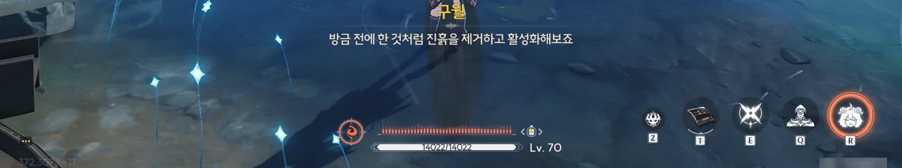

아, 저게 그냥 진흙이 아니라 에너지가 진흙화 한 거였어?

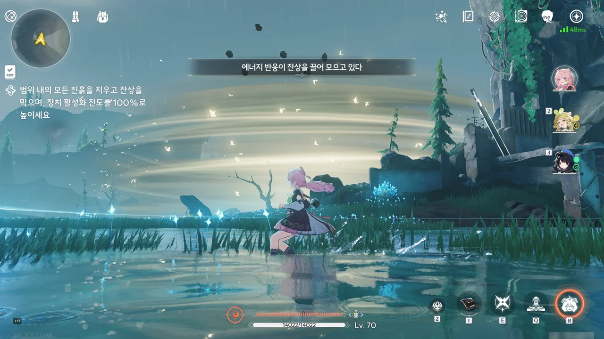

와, 하늘에서 똥이 쏟아져 내려요!

아니, 저기 위에 가시장미버섯을 올려두는 건 반칙이지! 올라가기 귀찮잖아.

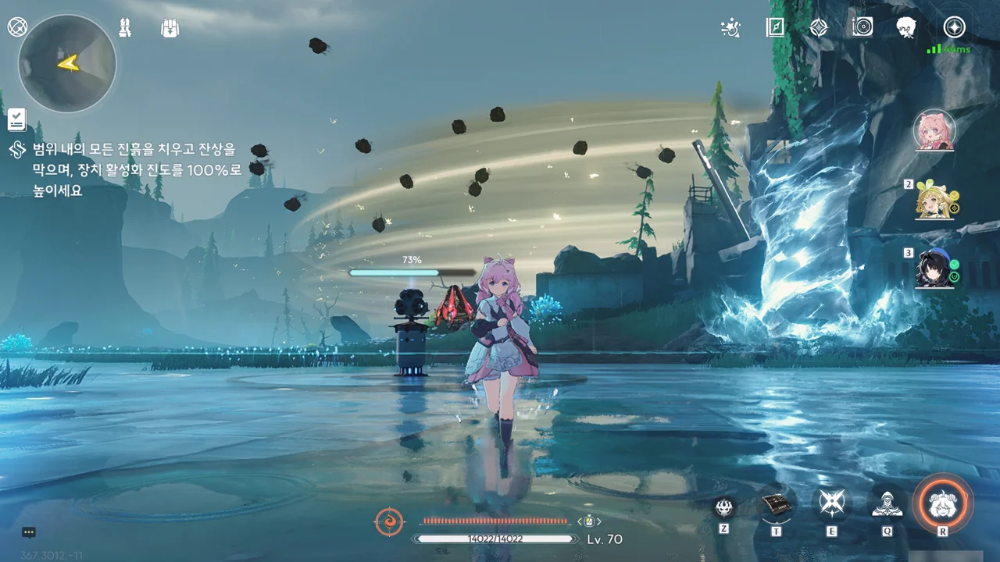

이번엔 하늘에서 똥이 아주 다발로 쏟아진다. 너무한 거 아냐?

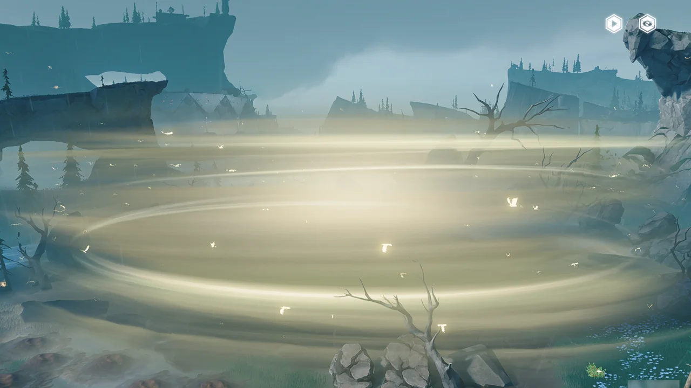

두 번째 안개 억제 장치를 활성화했다. 아까보다는 안개가 걷힌 게 확연히 눈에 보인다.





이번에 기록을 남긴 사람은 앞선 일지의 작성자와는 다른 사람이다.

안개를 일으키는 근원이 시간이 갈수록 강력해져, 안개 제거 장치를 두 번이나 업그레이드했음에도 안개 제거 효율이 점차 떨어지고 있다고 한다.

작성자는 애곡하는 아익스가 죽어가는 반려를 붙잡고 인간을 향해 도와달라는 듯이 비명을 지르는 것과, 반려가 죽은 곳에서 반려를 그리워하듯 끊임없이 빙빙 돌고, 착지하길 반복하는 모습을 봤다고 한다.



그걸 본 구월은 "감정에 치우친 표현에 추론조차 허황된 일지"라며 폄하한다. 그의 태도가 묘하게 아픈 곳을 찔려 괜히 화를 내는 모습처럼 보인다.





안개를 일으키는 근원이 직정 461번 팀과 마치 힘겨루기를 하는 것 같다는 연구원의 가설에 대해, 구월은 아직 근원을 확인하지 못했으니 확실한 판단을 내릴 수 없다고 생각한다. 보통은 그렇게 생각하는 게 맞지.

> 하지만 저는 그의 추론이 사실이었으면 좋겠어요. 불가능이 많아질수록 저희가 아쉬움을 덜게 될 테니까요.

이게 대체 무슨 말일까? 대체 이게 왜 과학 연구의 정신인 건데? 또 번역팀 너야?





다른 잔상들은 「소리」를 갈구해 다른 생명체를 공격하고 그 주파수를 흡수하길 원하는 본능을 갖고 있다. 하지만 애곡하는 아익스와 그 반려는 다른 잔상이나 생명체를 공격하지 않고, 오직 서로 붙어 지내는 것에만 신경 쓰는 기묘한 행태를 보였다. 이를 두고 구월은 그 둘이 서로를 보완하는 한 쌍일지도 모른다는 감상을 남겼다.

잔상이 정확히 무엇인지 완벽하게 파악하지 못한 지금, 그의 말 역시 아직은 옳다 그르다 판단할 수 없는 거겠지.



마지막 안개 억제 장치를 활성화하고 안개의 중심지에 뭐가 있는지 확인하고 나면, 울음새 늪에 이상 현상이 일어나는 원인을 알게 될 것이다. 거기에 대체 뭐가 있는지 정말 궁금하네.
