



'짹짹' 소리가 나더니, 한동안 나타나지 않았던 유령이 또다시 나타났다.

자길 따라오라니... 정말 이 유령은 단순히 정보를 담은 에너지체가 맞긴 한 걸까?



심지어 이 유령은 방랑자와 구월이 어디로 가야 하는지 알려주려는 것처럼 방랑자 일행과 거리를 둔 채 나타났다 사라지기를 반복하고 있다.

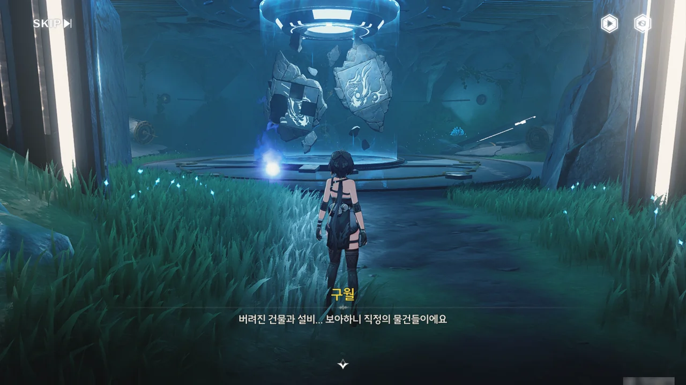





이 유령의 목적은 잘 모르겠지만, 우리가 이 직정의 장치를 작동시키길 원하는 것 같다.

이 장치는 누락된 부분을 채워 넣으면 저장된 그림 자료를 홀로그램으로 볼 수 있다고 한다.

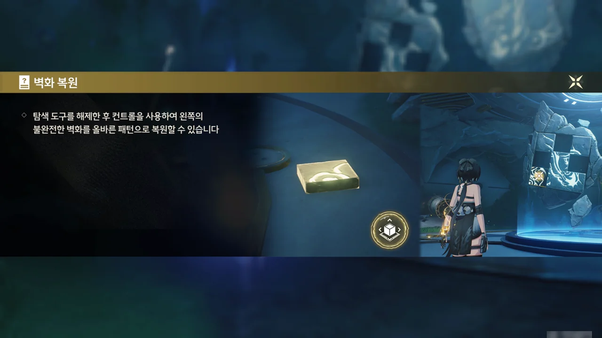

여태껏 필드에서 수도없이 해왔던, 퍼즐 끼워 맞추기이다.

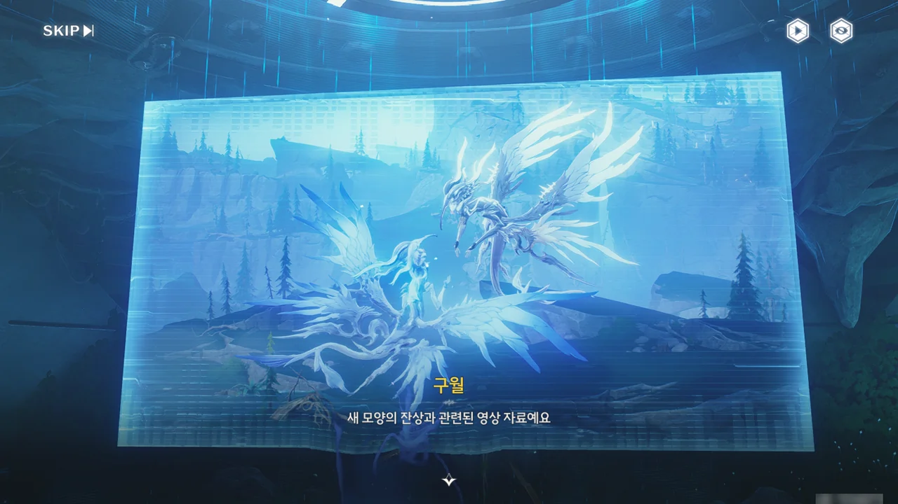



애곡하는 아익스의 반려가 아직 죽지 않았을 때의 모습인지, 새 모양의 두 잔상이 서로 뒤엉켜 날아다니는 모습이 찍혀 있다. 주둔지에서 들었던 증언과, 연구 일지에 적힌 내용과 일치한다.

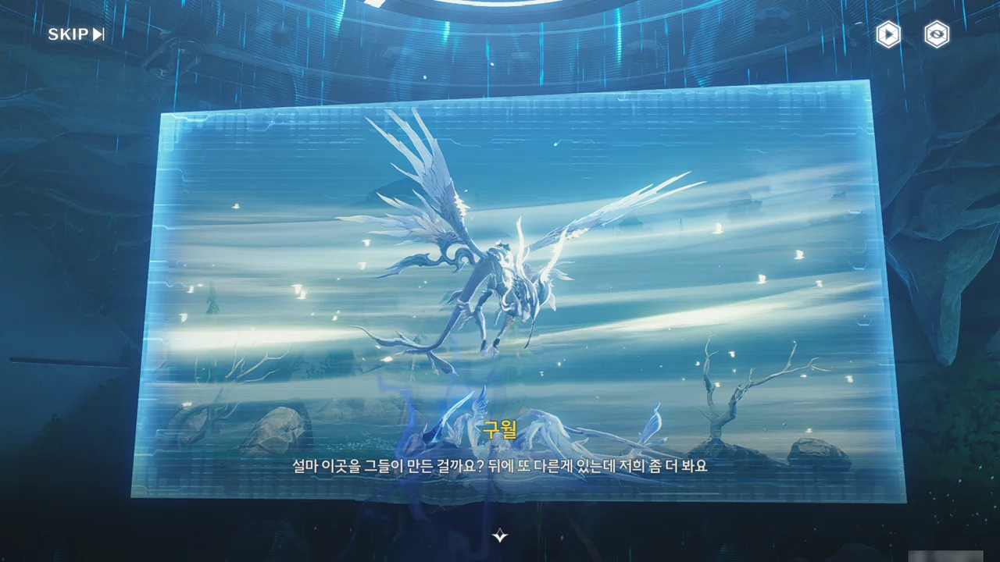



반려가 죽은 이후의 모습인 건지, 주변에 안개가 짙게 끼어있고 바닥에 축 널브러진 푸른색 새 잔상 --- 애곡하는 아익스의 반려 --- 위를 애곡하는 아익스가 앞발에 뭔갈 든 채 날아다니고 있다.

유령이 또다시 뭔갈 말하기 시작한다.

설마 저 짹짹거리는 소리가 새소리였던 거야? 간혹 고주파 노이즈를 짹짹 소리로 표현하는 경우가 있어, 유령이 내는 짹짹 소리도 주파수 노이즈라 생각하고 있었는데...



첫 번째와 두 번째에 유령이 말했던 내용과 거의 비슷하다.





분명 이 유령이 하는 말은 애곡하는 아익스와 그 반려의 이야기와 연관되어 있다. 우릴 여기까지 괜히 데려다 놓고 저 두 사진의 상황과 전혀 관련 없는 이야길 하진 않을 것 아닌가.

메시지의 화자가 제삼자가 아닌, 그 일을 직접 겪은 당사자라고 하면 유령의 정체가 뭔지는 뻔하지.







> 부활은 없어요... 계속해도 소용없어요... 당신이 다칠 수도 있어요...
> 해치지 마세요... 자신을... 멈추세요, 나는. 떠나요...
> 말해요, 안녕... 우리 서로 작별 인사...

유령은 마지막으로 이 말을 남기고 사라졌다.

애곡하는 아익스가 스스로를 해치면서까지 자신을 부활시키려는 걸 만류하며, 서로 작별 인사를 하자는 말로 보인다.











구월 역시 같은 결론에 도달했다.

연구 기록에는 애곡하는 아익스가 안갯속에서 나올 때마다 활력 징후가 약해졌다고 적혀 있었다. 화연은 애곡하는 아익스가 안갯속에서 나올 때마다 주변에 심한 뇌우와 짙은 안개가 생기는 걸 여러 번 봤다고 증언했다.

분명 애곡하는 아익스는 자신의 반려를 되살리기 위해 자신을 해치면서까지 반려의 잔해에 에너지를 공급하고 있었던 게 분명하다. 하지만 애곡하는 아익스의 노력은 헛수고에 불과하다. 사람이 다시 되살아날 수 없는 것처럼, 한 번 소멸한 잔상은 다시 원래대로 돌아올 수 없기 때문이다.

애곡하는 아익스가 끊임없이 불어넣은 에너지가 모여 안개나 진흙 같은 이상 현상이 발생했고, 그중 죽은 반려의 잔해에서 잔향 주파수를 흡수한 에너지가 유령이 되었다.

다만 대체 왜 유령이 아익스에게 직접 가지 않고 땅 위를 걸어 다니는 방랑자 일행에게 나타난 것인지는 정말 모르겠다. 방랑자의 말처럼 연애편지를 잘못 보낸 걸까?



대여섯 살 꼬마가 할아버지가 될 때까지도, 유령의 메시지는 애곡하는 아익스에게 닿지 못했다. 유령의 메시지가 애곡하는 아익스에게 전달될 수 있다면 좋겠지만, 그 메시지를 받은 후, 애곡하는 아익스가 여태껏 해온 반려의 부활 시도를 과연 멈출까?





규정에 따르면, 만약 안개의 원인이 애곡하는 아익스의 반려의 잔해일 경우, 구월은 마지막 안개 억제 장치를 활성화하고 이 일에서 손을 떼면 된다. 애곡하는 아익스는 야귀군에 신고하면 되고, 반려의 잔해 또한 잔상 잔해 처리 전담자가 잘 처리할 것이다.

하지만 애곡하는 아익스가 여태껏 정성스레 모은 잔해를 그냥 치워버릴 경우, 애곡하는 아익스가 사람들에게 더 큰 원한을 품고 지금보다 더 과격하게 사람들을 공격할지도 모른다. 어찌어찌 애곡하는 아익스를 쫓아낸다 해도 애곡하는 아익스는 단념하지 않고 여태껏 그랬던 것처럼 반려의 잔해를 울음새 늪에 모을 것이고, 결국 여태껏 일어난 일이 다시 한번 일어나게 될 것이다.







기록에 묘사된, 반려가 죽어갈 때 애곡하는 아익스가 인류에게 보내던 구조 신호와 반려의 죽음 이후 끊임없이 슬피 우는 애곡하는 아익스의 울음소리가 생각난다며, 구월은 잔상 역시 사람과 같은 감정을 느낄 수 있다 생각한다고 말한다. 그 기록을 보자마자 "감정에 치우친 표현에 추론조차 허황된 일지"라고 폄하한 것과는 대조적이다.

그래서 구월은 반려의 마음을 애곡하는 아익스에게 전해주자고 제안한다.



결과적으로는, 원래 계획에 한 단계가 더 추가된 것뿐이다. 애곡하는 아익스에게 반려의 마음 전달하기.

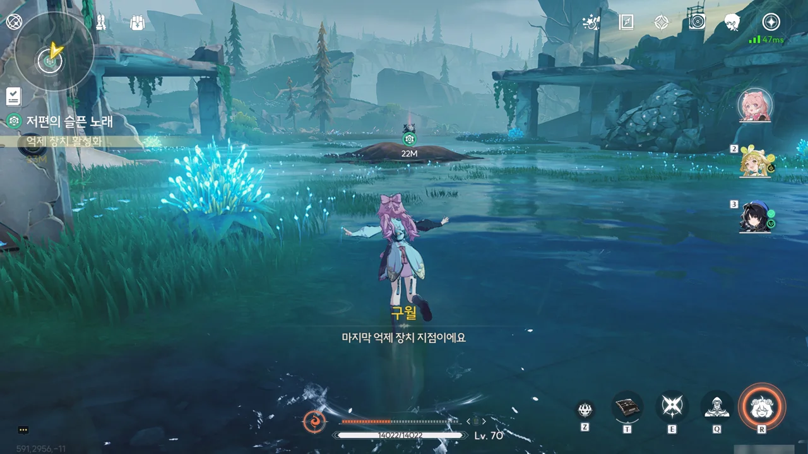

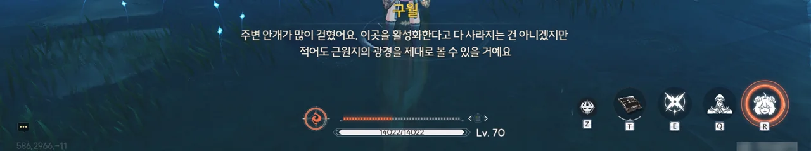

마지막, 세 번째 안개 억제 장치다. 이걸 활성화하면 이 안개의 중심에 뭐가 있는지 확인할 수 있을 것이다.

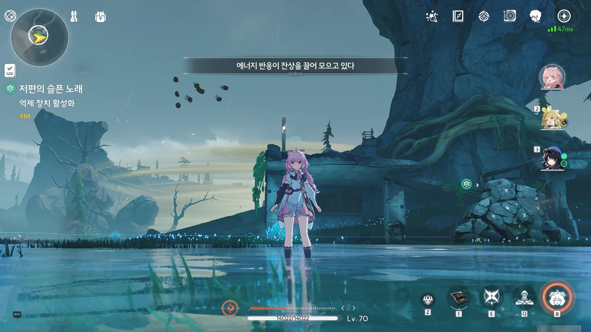

음... 똥덩어리...

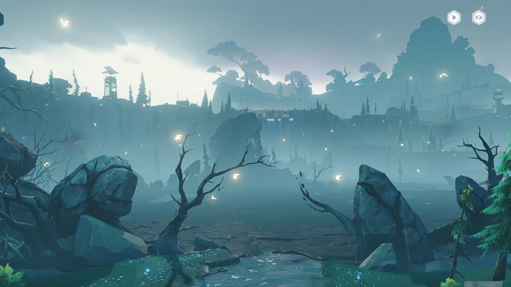

드디어 중심부의 안개가 걷혔다.

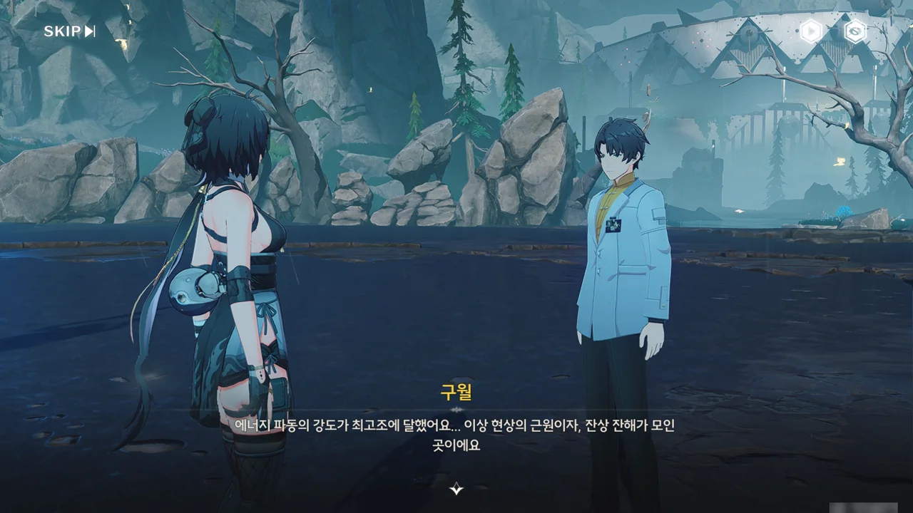







예상대로, 울음새 늪에서 일어나는 이상 현상의 근원은 바로 애곡하는 아익스의 반려의 잔해였다.

구월의 작전은 다음과 같다. 여기 있는 잔해에도 유령과 마찬가지로 애곡하는 아익스의 반려의 의식 일부가 남아있을 테니, 잔해를 단말기로 흡수한 다음, 단말기 에코 기능을 응용하여 반려의 몸과 남은 의식을 재현하는 것이다. 비록 그 지속시간이 1시간밖에 안되지만, 그 정도면 서로 작별 인사를 하기 충분하지 않겠는가.

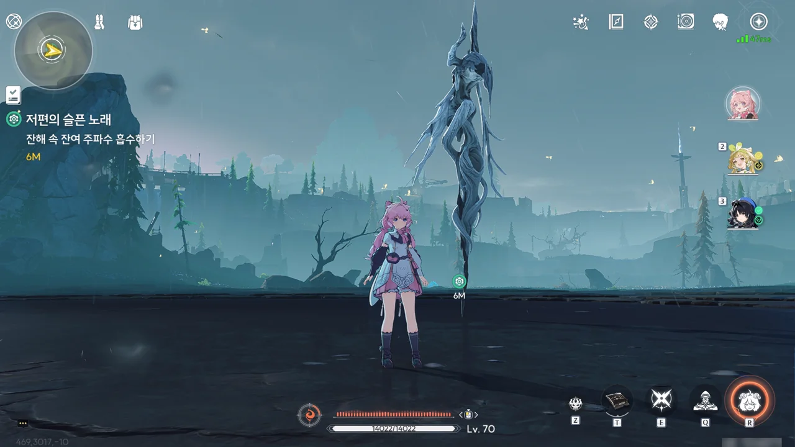

대체 반려의 잔해를 어떻게 보존한 건지, 그 커다랗던 잔상이 완전히 쪼그라들었다. 설마, 그냥 에너지를 쏟아붓기만 하면 반려가 되살아날 거라고 믿은 건 아니겠지?



자기 반려의 잔해가 사라진 걸 눈치챈 애곡하는 아익스가 눈을 까뒤집고 달려든다.

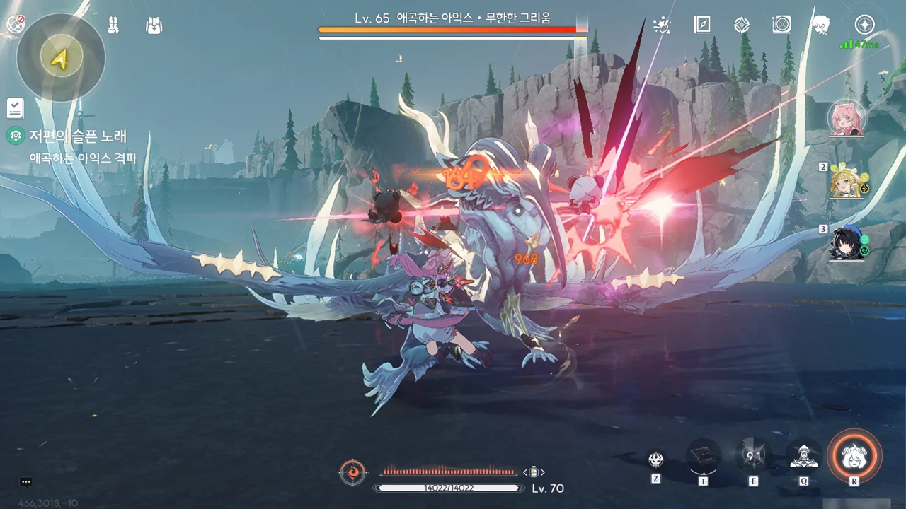

그럼 좀 때려서 진정시켜야지.





실컷 얻어맞은 애곡하는 아익스는 완전히 미쳐 어디론가 날아갔고, 방랑자는 애곡하는 아익스의 반려의 모습으로 변해 애곡하는 아익스를 뒤쫓는다.

아니, 다 너 좋으라고 하는 건데, 왜 이렇게 화를 내는 거야? 이해가 안 되는 건 아니지만, 답답할 노릇이다.



갑자기 이렇게 공중 추격전을 하게 될 줄은 몰랐는데...

평타를 계속 맞추면 스킬 발동을 할 수 있다고 하던데, 정작 평타만으로 애곡하는 아익스의 체력을 다 까버렸다.







공중에서 애곡하는 아익스를 한 번 더 후려친 후에야 애곡하는 아익스의 힘을 다 빼 진정시킬 수 있었다. 땅바닥에 힘없이 널브러져 있던 애곡하는 아익스는 자신의 뒤를 쫓아온 반려의 유령을 보자마자 언제 얻어맞았냐는 듯이 엄청 좋아라 하며 활기차게 반려의 유령과 함께 멀리 떠나버렸다.



그리고 둘이 떠난 자리에는 풀밭과 함께 고치처럼 생긴 무언가가 솟아올랐다.

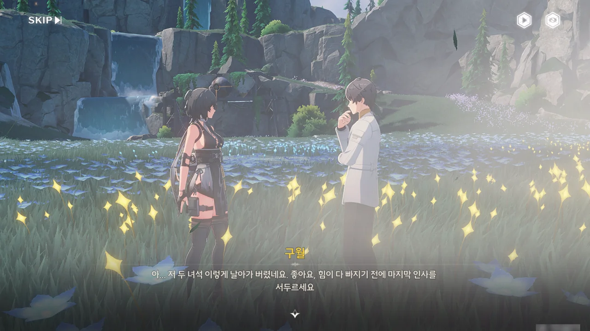













이미 어느 정도 눈치챈 것이지만, 애곡하는 아익스가 그랬던 것처럼, 구월 역시 아내인 다희를 10개월 전에 떠나보내야만 했다. 뛰어난 연구원이었던 그녀는 직접 잔상 데이터를 얻기 위해 무음구역 깊숙한 곳에 들어갔다가 다시는 나오지 못했다.

아직 아내의 죽음을 받아들이고 싶지 않은 구월은 요행이란 환상을 바라며 아내를 다시 데려올 기술을 연구하고 있다. 물론 그걸 본 상리요는 다희가 그걸 바라지 않을 거라고 이야기했지만.

애곡하는 아익스와 그 반려의 모습을 본 구월은 자신 역시 아내와의 추억을 가지고 계속 앞으로 나아가며 잘 살아야겠다고 다짐한다. 애곡하는 아익스의 반려가 바랐던 것처럼, 다희 역시 그럴 테니까.

과연 애곡하는 아익스가 이 일을 계기로 여태껏 해왔던, 반려의 잔해에 에너지를 들이붓는 행동을 멈출까에 대해, 자신을 해치면서까지 상대를 부활시키겠다는 결심을 할 정도였으니, 자신을 그만 놓고 잘 살아달라는 반려의 소원을 무시하진 않을 거라고 말한다. 그 말을 하는 구월의 모습에서 자신 역시 그렇게 하겠다는 의지가 엿보인다.



마지막 안개 억제 장치에서 찾은, 연구 기록이라기보단 발신되지 않은 편지에 더 가깝다는 점검기록 일지를 건네받았다.

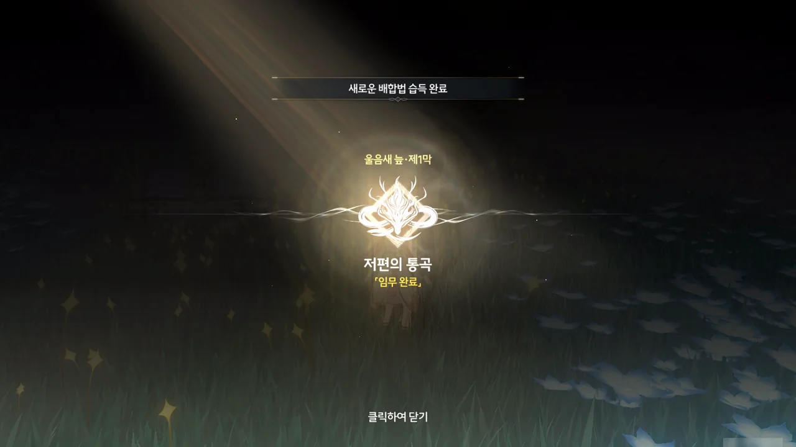

울음새 늪 제1막 \[저편의 통곡\] 완료!



> **보내지지 않은 전자 통신**
> ***
> 461호 연구팀 팀원의 전자 통신
> ***
> 직정 3호 억제 장치의 점검 및 유지 보수 로그로 보이지만, 내용은 연구 기록이 아니라 보내지지 않은 통신처럼 보인다.
{.bq}

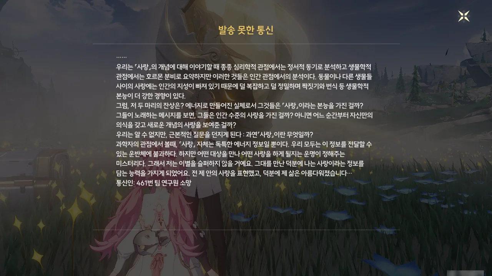

> 그래서 저는 이별을 슬퍼하지 않을 거예요. 그대를 만난 덕분에 나는 사랑이라는 정보를 담는 능력을 가지게 되었어요. 전 제 안의 사랑을 표현했고, 덕분에 제 삶은 아름다워졌습니다...

461번 팀 연구원인 소망 역시 애곡하는 아익스, 구월처럼 사랑하는 사람을 잃은 모양이다. 하지만 앞선 둘과는 달리, 소망은 반려를 잃은 슬픔을 극복해 냈고, 앞으로 나아가는 데 성공한 것으로 보인다.

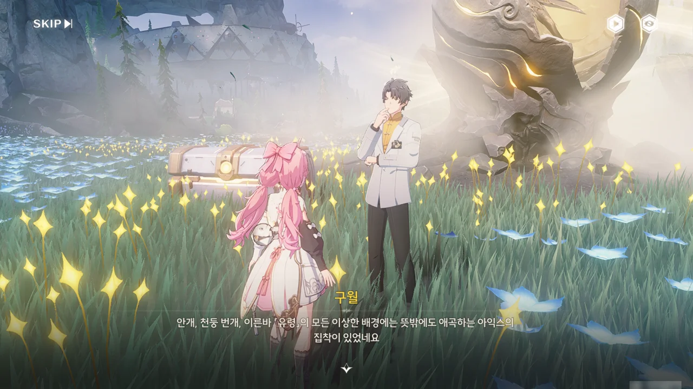



나중에 기회가 되면 화서연구원에서 자신을 찾아달라는 말을 남긴 구월은 잠시 고개를 돌린 사이, 감쪽같이 사라졌다. 금주 화서연구원을 뒤져보았지만, 구월을 찾을 수 없었다.



> 구월이 말하길, 그것은 마치 부화가 끝날 알과 같았고
{.bq}

이 알 모양의 조각 안에는 아까 내가 '쪼그라든 반려의 잔해'라고 생각한 것과 동일한 모양의 조각이 들어있다. 어쩌면 애곡하는 아익스에게 있어, 그건 반려의 잔해가 쪼그라든 게 아니라 알에서 나오기 직전의 반려의 모습이었을지도 모르겠다.

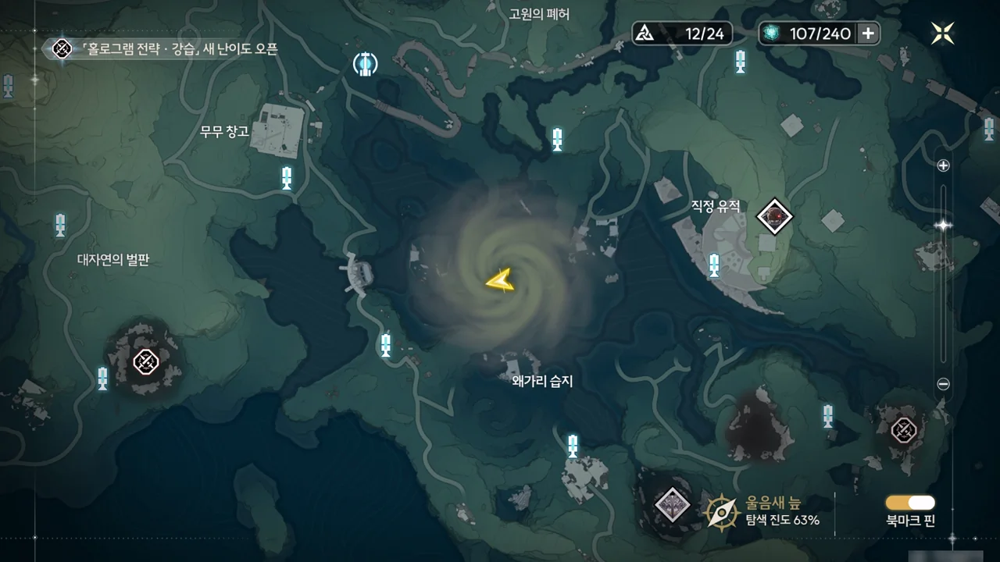

지도의 안개가 완전히 사라질 줄 알았는데, 안개는 여전히 그대로 있다.

게임을 꺼야 안개가 완전히 사라지는 걸까?

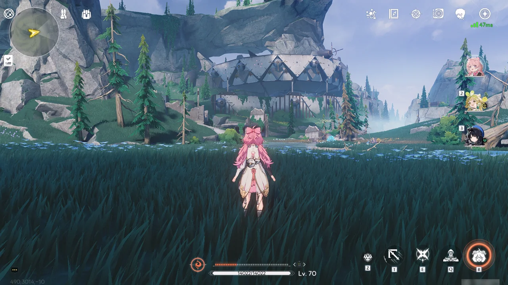

조수 임무에서 방문했던 직정 유적은 여기서 매우 잘 보이는 곳이다. 저 건물을 다시 보게 될 줄은 몰랐는데.
