음... 사진을 찍다 보니 글의 길이가 매우 길어졌지만, 딱히 끊을 수 있는 곳이 보이지 않아 그냥 글 하나에 다 넣기로 했다.

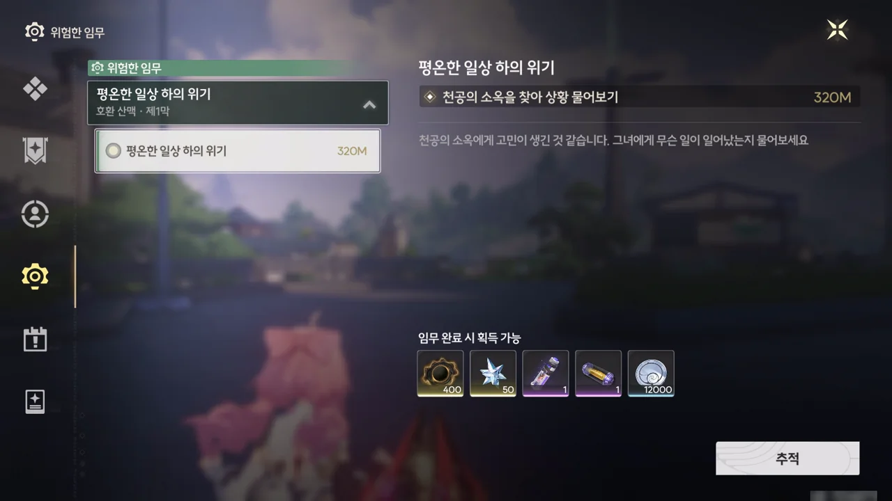

이건 또 언제 받은 임무지? 설마 이 임무도 \[저편의 통곡\]처럼 언제 연 임무인지 까먹은 건 아니겠지...?

임무 제목이 '평온한 일상 하의 위기'라고 했으니, 이번 임무에선 전투가 없을 것 같다.

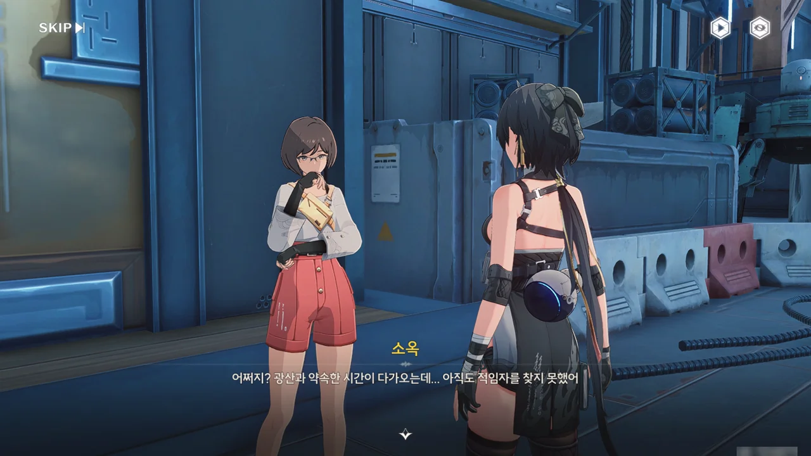





천공부의 소옥이 방랑자의 도움을 필요로 한다.













「블루수정원석」 --- 쿠로게임즈 번역팀의 또 다른 찐빠로, 「반디석」이 올바른 번역이다 --- 은 반도체의 원료가 되는 광물이다. 반디석의 또 다른 사용처를 알아보기 위해 현재 천공부 군무과와 변방 수비과가 서로 협력하여 반디석을 대상으로 한 실험을 진행 중이다.

실험 중, 반디석을 액화하면 새로운 성질을 띄게 된다는 걸 발견하였지만, 반디석을 액화하는 기술과 장비가 호환 광산에 있었기에, 천공부는 호환 광산에 반디석 처리를 맡겼다.

바로 오늘이 천공부에서 호환 광산에 샘플을 전달하기로 한 날인데, 하필이면 천공부에 임시 회의가 잡혀버려 호환 광산에 갈 사람이 없다고 한다. 그래서 소옥은 마침 만난 방랑자에게 샘플을 맡겨, 호환 광산에 대신 전달해 달라고 한다.

별로 어려울 건 없어 보이는 의뢰네.

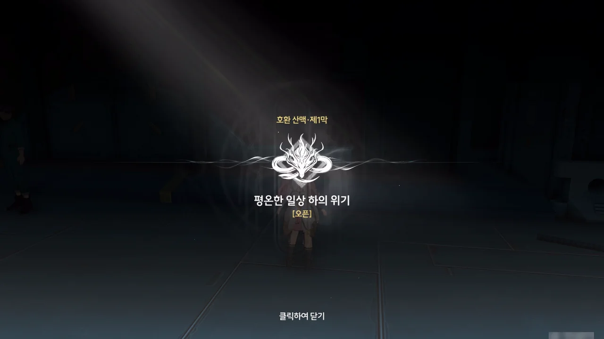

호환 산맥 제1막 \[평온한 일상 하의 위기\] 시작!

다행스럽게도, 이번 임무는 앞선 이야기를 빠트린 것 없이 처음부터 끝까지 찍을 수 있겠네.





천둥, 화우, 모디 세 사람이 홍백이라는 할아버지의 행방을 찾고 있다.







천공부를 대신해 샘플을 가공하러 왔다고 하니, 화우가 홍백에게서 확인한, 천공부에서 보낸 통신 속 사진과 생긴 게 다르다며 방랑자를 의심한다.

소옥이 방랑자에게 천공부 신분 확인 물품을 같이 들려 보내준 이유가 바로 이거였나 보다.









반디석을 포함한, 호환 광산에서 채굴하는 일부 광석은 광산 중앙의 「정련탑」을 이용해 가공해야 하는데, 지금 정련탑이 고장 났다고 한다. 원래라면 광산 엔지니어가 정련탑을 수리했겠지만, 그 엔지니어가 얼마 전 손발에 부상을 입어 금주성으로 후송되었다.

그 빈자리를 채운 사람은 과거 정련탑의 담당자였던 홍백이다. 이전에 정련탑이 고장 났을 때 홍백이 앞장서서 정련탑을 수리했기에, 그의 실력은 확실하다 할 수 있다.

그런데 이번엔 홍백이 어디로 간 것인지 도저히 찾을 수 없다. 그래서 광산 전체가 정련탑 고장으로 인해 혼란에 빠졌다고 한다.





천둥은 홍백이 일이 귀찮아 일부러 숨은 게 분명하다며 짜증을 낸다. 하지만 홍백은 노인이니, 치매가 와서 길을 헤매고 있는 걸 수도 있잖아.

홍백의 행방에 대해 혹시 아는 게 있냐고 묻자, 광부들이 수송차 근처에서 홍백을 만난 적이 있다는 정보를 얻었다. 그러면 수송차 근처에서 홍백의 행방을 찾아보면 되겠네.



수확은 그리 좋지 않다. 소유주를 알 수 없는 일기가 하나, 어머니를 그리워하는 누군가의 편지, 잡지 한 권이 전부이다.

그나저나 잡지의 문구가 조금 위험해 보인다. "우리 함께 길을 잃자!"라고? 광산에서 길을 잃으면 그냥 죽는 건데?

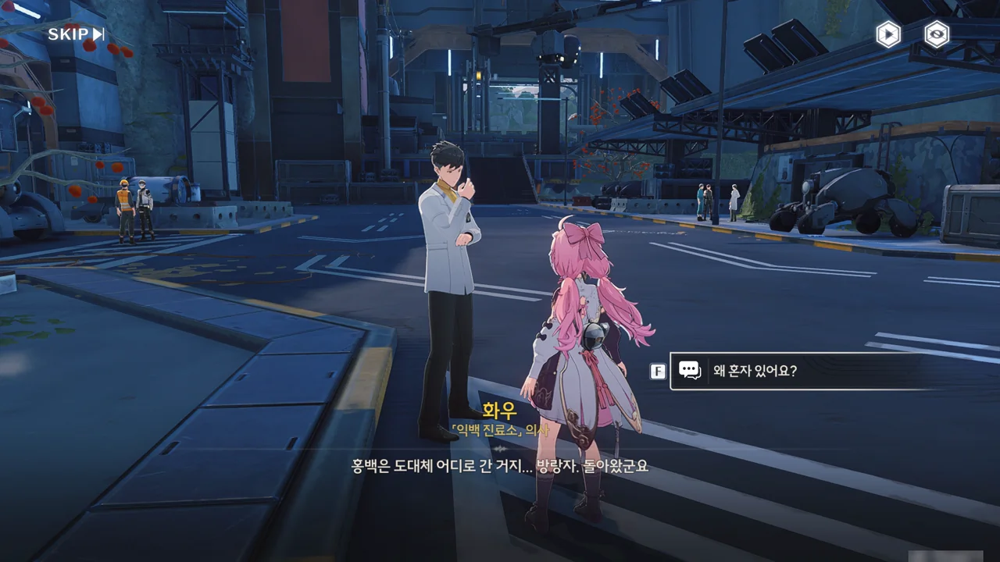







정련탑은 멈췄지만, 광산 대부분의 생산 라인은 여전히 작동 중이기 때문에, 다들 각자 할 일을 하러 먼저 떠났다고 한다.

화우가 일기의 주인이 홍백이라고 확인해 준다. 평소 가지고 다니던 일기마저 잃어버릴 정도면, 홍백의 치매가 꽤 심각한 모양이다.















나이가 들어 노인성 치매에 걸린 홍백에게 기억이 지워지는 속도를 늦출 방안으로 키워드 기억법과 일기 쓰기를 알려준 것이 바로 화우이다.

홍백이 정련탑 유지 보수 방법과 같은 중요한 내용을 일지에 적어놓았을 거라 생각해 일지를 뒤져보았다. 정련탑 유지 보수 방법을 찾은 건 좋은데, 홍백이 평소 점점 늙어가는 자신의 모습을 그리 좋아하지 않았다는 사실도 알게 되었다.

지금 광산에 일손이 부족해, 방랑자가 정련탑 수리까지 맡게 되었다. 광산에 초행인 방랑자를 위해 화우가 조력자를 한 명 붙여준다고 한다.

화우가 말했던 '조력자'는 바로 화우의 동생, 화시였다. 앙코랑 키가 별로 차이 나지 않는 걸 보면, 정말 어린 조력자이다.







그런데 일을 시작하기도 전에 보수를 운운하길래, 곧바로 화우에게 알리겠다고 말했다. 머리에 피도 안 마른 녀석이 싹수가...

알고 보니, 화시가 원하는 건 돈이 아니라 방랑자의 이야기였다. 방랑자는 먼 곳에서 왔으니 분명 재미있는 이야기를 알고 있을 거라 생각해, 이 일을 도와준 후 이야기를 하나 들려달라는 것이었다.

그냥 이야기를 해달라고 부탁해도 좋았을 것을 당당하게 '보수' 운운하며 요구하는 걸 보니, 조금 괘씸하다. 방랑자도 그렇게 생각한 건지, 화시의 요구에 확답하지 않고 대충 얼버무리고 있다.

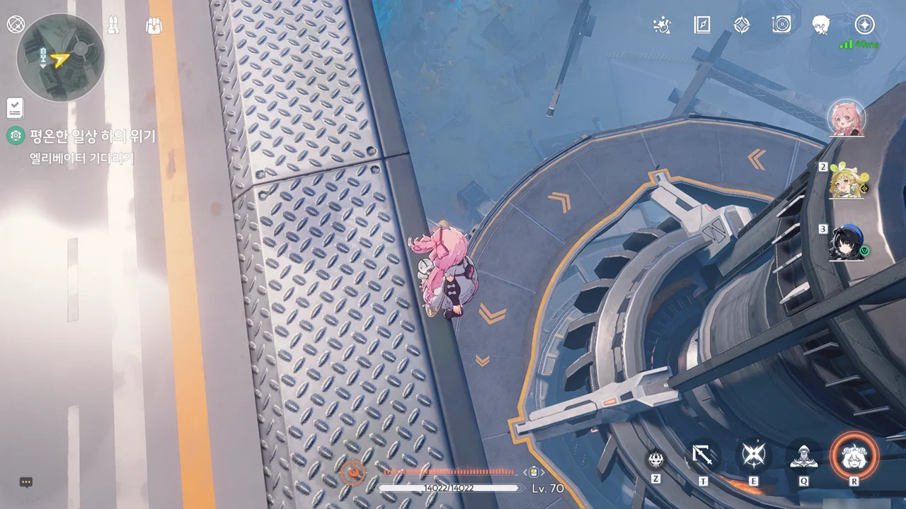

와, 저 큰 원반이 엘리베이터라고? 광산이라서 그런가, 엘리베이터의 크기가 정말 크다.



일지에는 정련탑을 재가동하기 위해선 충분한 전력이 공급되어야 한다고 적혀 있었다. 그 말을 들은 화시는 누굴 찾아야 할지 알겠다며, 방랑자를 안내한다.

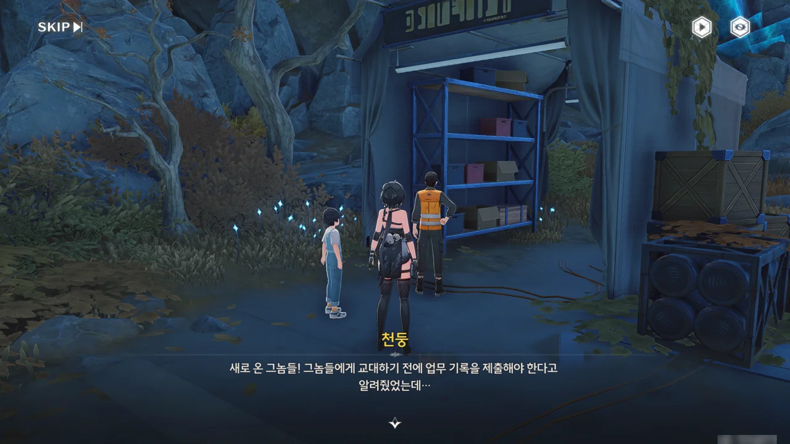



화시가 말한 사람은 바로 천둥이었다. 천둥은 신입이 업무 기록을 제출하지 않은 것에 대해 화를 내고 있었다.

그런데 천둥과 모디가 서로 싸웠다고? 언제? 설마 방랑자가 자릴 비운 그 사이에 서로 싸우고 헤어진 거야?





홍백의 일지에 적힌 내용을 말해주자, 천둥은 영리하고 유능한 홍백에게 그런 연약한 면이 있었을 줄 몰랐다며, 평소 홍백의 뒤를 따라다녔으면서도 왜 그걸 눈치채지 못한 건지 아쉬워한다.





광산 바닥에 있는 「이중 회로 전력 공급 시스템」 덕분에 광산이 평소 필요로 하는 전력을 공급할 수 있지만, 현재 상태에서 정련탑까지 재가동하기에는 시스템에 걸리는 부하가 너무 크다고 한다. 그래서 광산 내부의 일부 설비를 멈추고 광산 외부에서 추가 전력을 끌어온 후에 정련탑을 재가동해야 한다.







천둥과 모디는 잔상과의 공존에 대해 서로 상반된 의견을 갖고 있어, 그것 때문에 서로 자주 싸운다고 한다. 모디는 사람이 잔상과 공존할 수 있는 방법을 찾아야 한다 말하지만, 천둥은 생각만으로는 아무것도 바꿀 수 없다며, 모디의 생각이 비현실적이고 안일하다 비판한다.

내가 봐도 모디의 생각은 너무 낙관적이다. 여태껏 만난 잔상 중, 방랑자를 적대하지 않은 잔상은 말 그대로 한 손에 꼽을 수 있을 정도로 극히 적었다. 잔상과의 공존은 먼저 잔상에게 공격받지 않을 방법을 찾고 나서 의논해야 하는 것 아닐까?

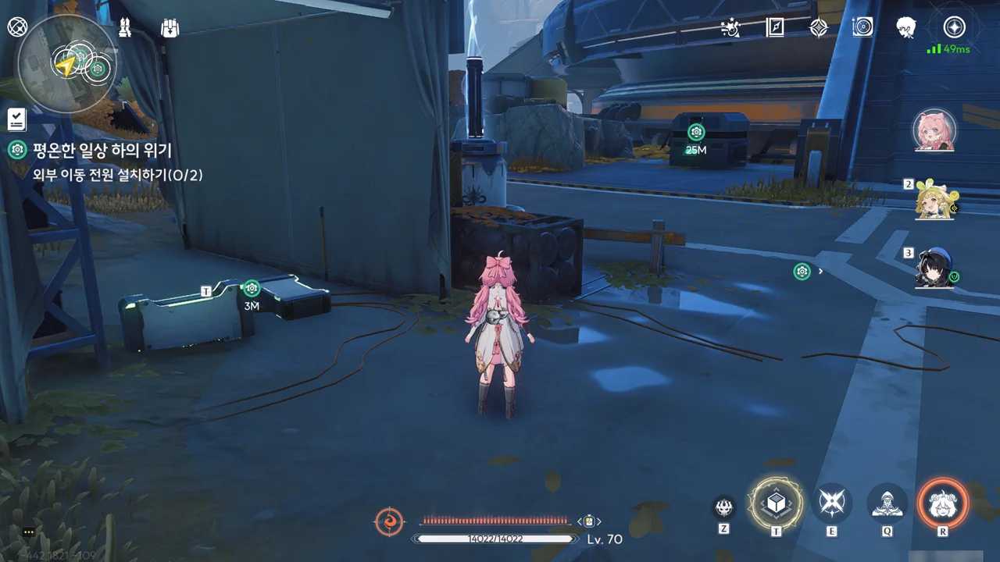

광산 외부라는 게 그냥 비상 발전기를 말하는 거였어? 음, 그것도 외부라고 하면 외부이긴 한데...

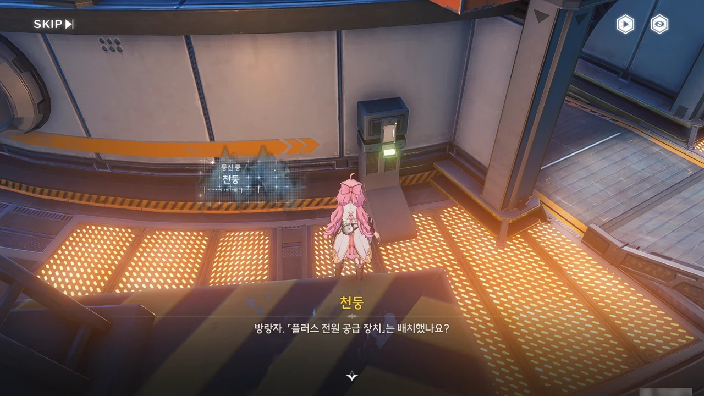



'「플러스 전원 공급 장치」'... 아오, 진짜 번역팀, 일 똑바로 안 할래? 어떻게 된 게 임무에서 오역을 발견하지 않은 적이 단 한 번도 없냐? 한국어 맞춤법은 원어민도 힘들어하니 그렇다 쳐도, 동일한 단어가 다르게 번역되면 안 되는 거 아냐?

쿠로게임즈가 대사의 흐름을 도식화해 보여주는 전문 번역 소프트웨어를 쓰지 않고 엑셀로 대사를 하나하나 번역하는 게 아니냐는 의혹이 제기되었는데, 정말 그런 게 틀림없다.

아무튼, 내부 셧다운 스위치를 두 곳에서 동시에 눌러야 한다고 한다.



내부 셧다운 스위치는 두 곳에서 동시에 눌러야 하는 스위치이다. 여기에 하나가 있으니, 다른 하나는 분명 저기 있는 스위치일 것이다. 그런데 왜 저기에 천둥은커녕 NPC 하나 보이지 않는 거지?

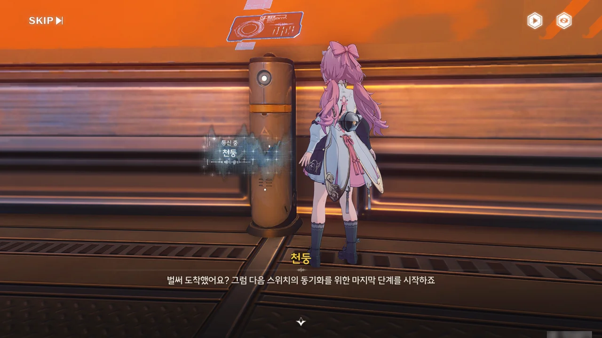



아무튼, 광산 내부 일부 시설의 전원을 내리는 데 성공했다.

> 일부 주변 시설은 꺼지고, 정제탑 전원은 외부 회로로 전환된다.
{.bq}

난 광산 내부 시설의 전원을 내리는 이유가 정련탑을 가동할 때 「이중 회로 전력 공급 시스템」에 걸리는 부하를 낮추기 위해서인 줄 알았다. 그런데 위 서술을 보면, 정련탑은 그냥 외부 전원만으로도 가동이 가능했던 것으로 보인다. 그럼 대체 왜 내부 시설의 전원을 내린 거야?

쿠로야, 대체 뭐가 맞는 거니? 번역 똑바로 안 하니?



아무튼, 정련탑 재가동에 성공했다.

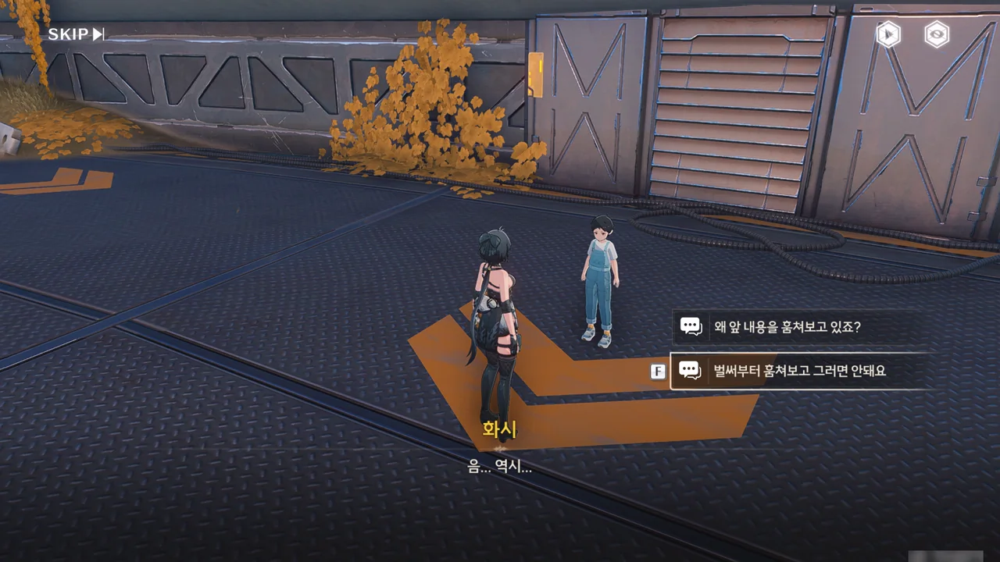

화시는 그동안 홍백의 일지를 훔쳐보고 있었다. 이 녀석, 역시 싹수가 노랬던 거였어...







화시가 변명하길, 사람의 현재 행동의 동기는 과거에 숨겨져 있기 마련이니, 홍백의 이전 일기 내용을 통해 홍백의 행방을 추측하고자 한 거란다.

음, 그러면 내가 또 할 말이 없는데.







하지만 일기 내용에서 유용한 정보를 얻는 데에는 실패했다. 이야기가 중간에 끊긴 것도 있지만, 이야기의 내용에는 홍백의 행방에 대해 추측할 수 있는 단서가 전혀 없었기 때문이다.

방랑자의 말마따나, 저 이야기의 의미는 홍백 본인만이 알고 있을 것이다.



그다음 절차는 정련탑의 매개변수 재설정이다.

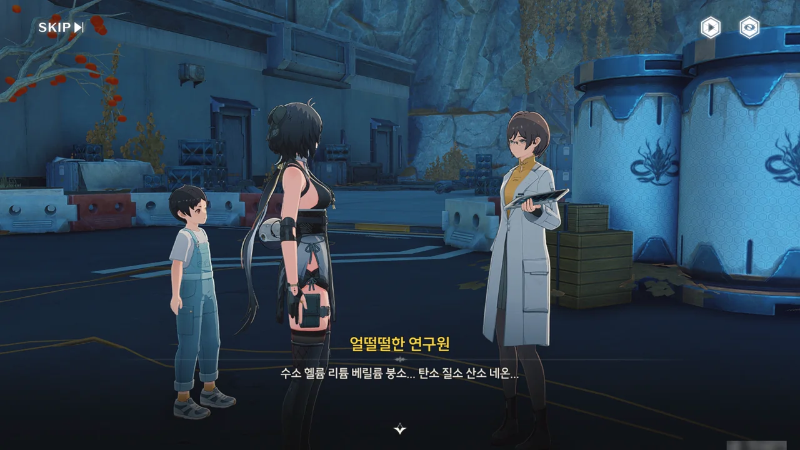







대낮에 밖에 나와 선 채로 실험을 하는 꿈을 꾸는 한 연구원을 만났다. 잠에서 깬 후에도 여전히 비몽사몽 정신을 차리지 못하고 있다.

> 수소 헬륨 리튬 베릴륨 붕소... 탄소 질소 산소 네온...

옛날에 화학 시간에 '수헬리베붕탄질산' 노래로 주기율표를 외웠던 기억이 나네. 지금은 물론 다 까먹었지만.







이 연구원은 밤을 새워 실험을 하다 정련탑이 멈춰 실험이 중단되자, 바람을 쐬러 나왔다가 선채로 잠에 들었다고 한다. 그렇게 피곤하면 지금 당장이라도 자는 게 조금이나마 더 효율적일 텐데, 이 연구원은 실험을 계속하러 다시 안으로 들어가 버렸다.

그래도 정련탑 매개변수 재설정에 필요한 콘솔의 위치는 알아냈다.



콘솔의 생김새를 보고 '또 선긋기 퍼즐은 아니겠지?'라고 생각했는데, 또 선긋기 퍼즐이었다.

뭔가 새로운 퍼즐 없어? 뭐만 하면 선긋기 퍼즐이 나와서 조금 지루해지려고 하는데.

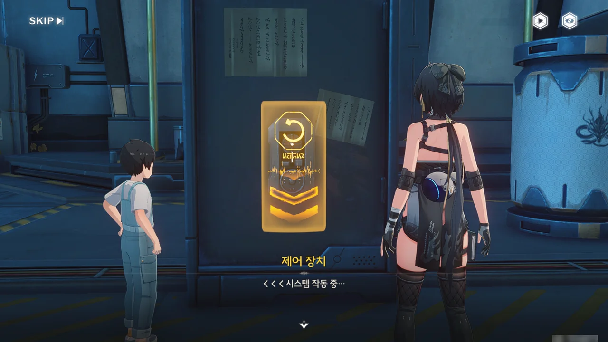



정련탑 시스템이 신분 인증을 요구한다. 어... 일지에 그런 말은 없었는데.

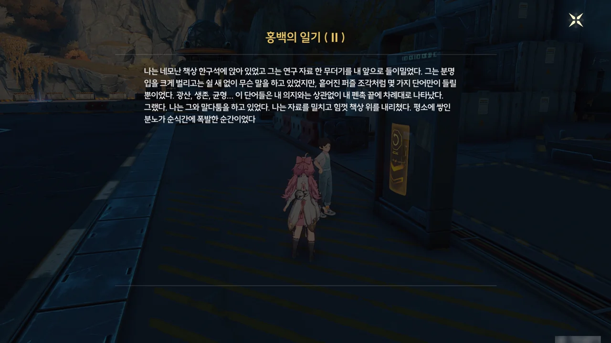





심지어 일지에 적힌 내용의 대부분은 연구원과 다툰 내용이고, 신분 인증에 도움이 될만한 정보는 찾아볼 수 없었다.

꾸준히 하기만 한다면 성공확률 100%를 자랑하는 브루트 포스 방식을 쓰려했으나, 누군가가 다가와 인증에 일정 횟수 이상 실패하면 시스템이 잠길 거라고 말해준다.

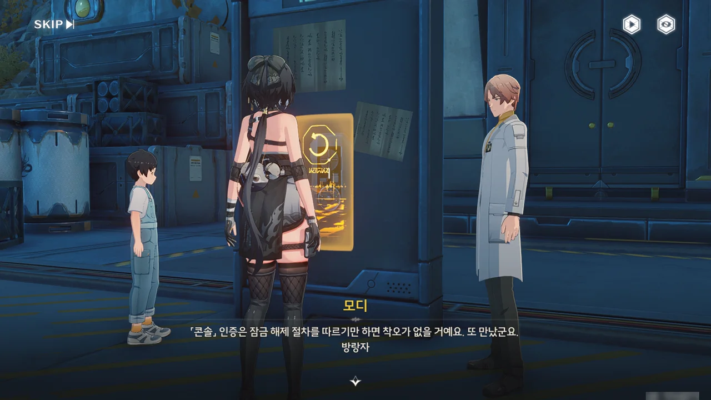



이번엔 모디를 만나네. 아까 들어간 연구원으로부터 소식을 듣고, 인증에 도움을 주려 나왔다고 한다.





화시가 모디를 홍백의 일기 속 연구원으로 오해하는 바람에, 모디에게 홍백의 일지를 보여줄 수밖에 없었다. 일지를 본 모디는 홍백은 자신에게 이치를 가르쳐 준 스승이나 다름없는 사람이라며, 오히려 홍백을 존경한다고 말한다.







모디가 갑자기 ∞ 기호가 평범한 학자에겐 무선 전파 표식으로만 보이겠지만, 어떤 공상 과학 연극에선 새로운 생명에 대한 상징이며 수많은 진리를 탄생시켰다는 말을 한다. 갑자기 왜 이런 말을 하는 거지?



아, 이 말을 하려고 했던 거구나.

모디는 천둥이 '인간과 공존 가능한 잔상'의 존재 가능성이 지나치게 낮다며 헛소리로 치부하는 걸 좋아하지 않는다. 모디는 인간과 공존 가능한 잔상이 존재할 확률이 아주 조금이나마 있다면, 그것만으로도 자신에겐 의미가 있다고 말한다.

매우 희박한 가능성을 없는 셈 치고 완전히 무시하는 건 분명 좋지 않은 태도이다. 하지만 그 가능성에만 매달려 현실에서 눈을 돌리는 것 역시 좋지 않다고 본다.



음... 모디의 설명이 어째 선긋기 퍼즐처럼 들린다? 또 선긋기 퍼즐을 풀라는 건 아니겠지?



이런 젠장맞을.





모디의 도움으로 정련탑 매개변수를 재설정하고 정련탑을 재가동하는 데 성공했다.









이제 남은 건 사라진 홍백을 찾는 거다.

홍백의 일지에서 홍백이 화우의 진료소, 수송 구역 등 몇몇 구역을 자주 들렀음을 알 수 있었다.









광산 지도에 홍백이 자주 들렀던 세 지점을 표시하고, 그 세 점을 중심으로 하는 원을 그려 세 원이 겹치는 장소를 찾았다.

"매일 방랑 지식 하나씩"이라고 드립을 쳐봤는데, 아무도 이해하지 못했다.



세 원이 겹치는 곳은 상층 생활 구역의 구석이다.

정련탑이 다시 가동했으니, 광산에 온 원래 목적인 샘플을 모디에게 맡겼다. 다만 정련탑의 완전한 재가동에는 시간이 걸리기 때문에, 오늘 내로 결과물을 받지는 못한다고 한다.



모디는 천둥과 다투는 것이 마음에 많이 걸렸는지, 최근 불면증으로 잠을 자지 못했다고 한다.

서로 생각이 다름을 인정하고 서로의 생각을 존중하면 될 것 같지만, 아마 쉽진 않겠지...

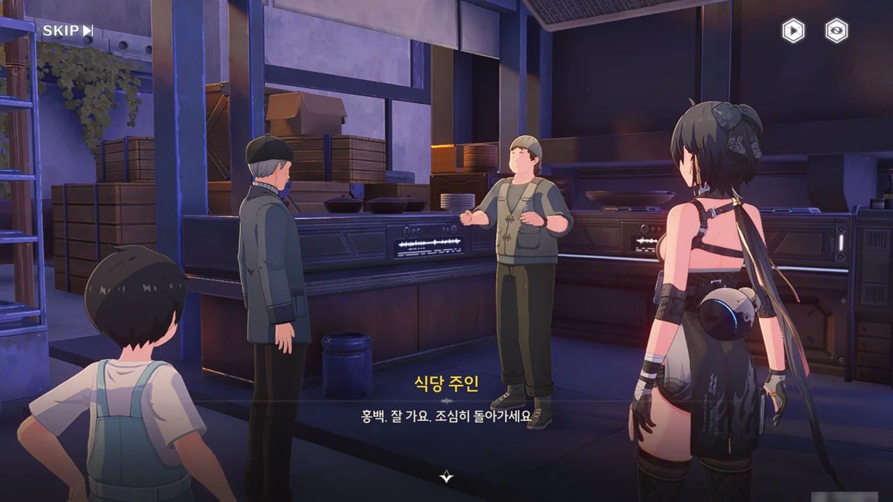



드디어 홍백을 찾았다! 식당에서 식사를 하고 있었던 모양이다.







대체 무슨 상황인지 이해하지 못하는 식당 주인에게 상황을 설명해 준다. 식당 주인 역시 홍백이 정련탑을 수리하고 온 건 줄 알고 있었다고...





금주 잡찜은 오래전부터 홍백이 일을 마치고 동료들과 함께 먹던 음식이다. 하지만 시간이 흐르면서 그의 곁에 있던 동료가 하나둘 사라지거나 다른 사람으로 바뀌었고, 마지막에는 홍백 혼자 남게 되었다.







홍백이 일기의 존재를 아예 잊지는 않았던 건지, 마음속 한편이 텅 빈 이유가 바로 일기 때문이었다며 좋아한다. 다만 아직 홍백의 상태가 정상으로 돌아온 것 같지 않아, 화시가 홍백을 화우에게 데려간다.

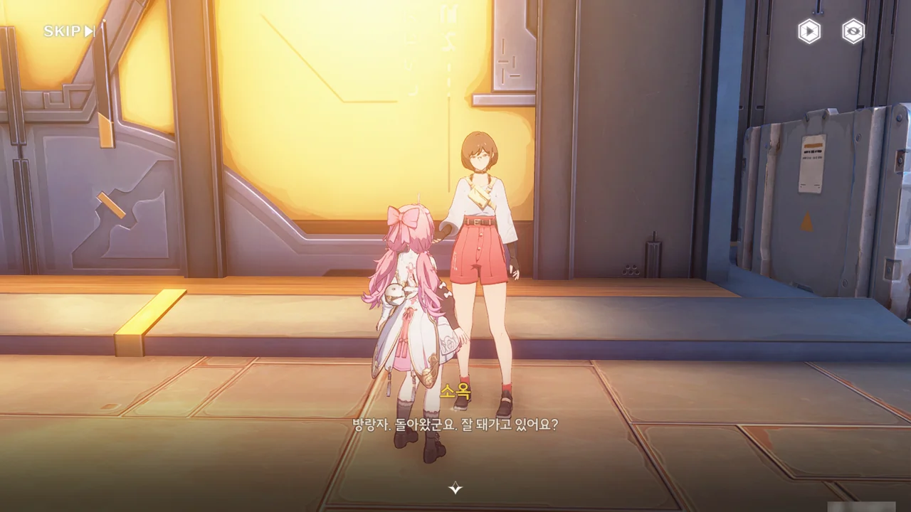

소옥에게 돌아가, 광산에서 있었던 일을 말해준다.





소옥이 말하길, 광산 사람들이 잔상과의 공존에 대해 서로 다투다가 습관적으로 방랑자를 천공부 사람으로 오해하고 무심결에 광산의 비밀까지 폭로한 것 같다고 한다. 비밀? 무슨 비밀?

심지어 그걸 묻자, 몇 년 전 광산에서 잔상과 관련한 위기가 있었다며 운을 띄우더니, 또다시 회의가 잡혔다며 궁금증만 안겨주고 가버린다.

호환 산맥 제1막 \[평온한 일상 하의 위기\] 완료.

그래서 그 비밀이 뭔데?!

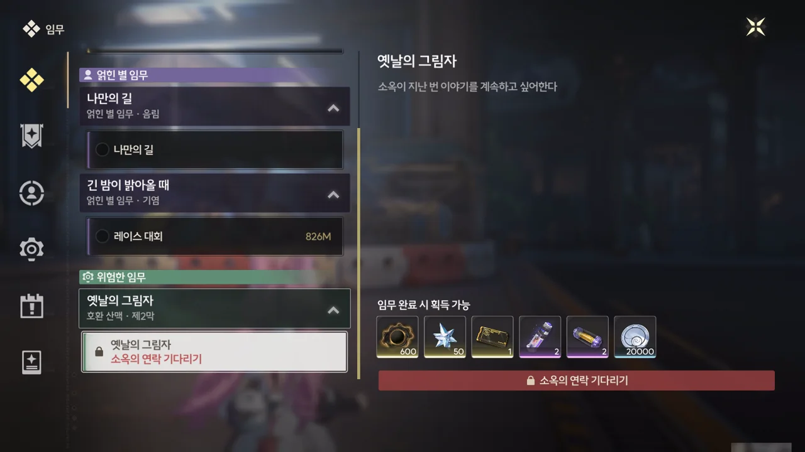

심지어 다음 임무는 실제 시간으로 사흘을 기다려야 열린다고 한다. 크아악!
