저번 임무인 \[평온한 일상 하의 위기\]가 끝난 지 사흘이 채 되지 않았는데 다음 임무가 열렸다. 아무런 전조 없이 스윽 열린 터라, 대체 뭐가 트리거가 된 건지 모르겠다.

일단 게임 시간은 절대 아닐 것이다. 왜냐면 다음 이야기를 빨리 보고 싶어서 내가 게임 시간을 엿새 정도 돌린 적이 있거든. 일반적으로 알려진 조건, '실제 시간으로 사흘' 역시 이번 일을 통해 아니라는 것이 밝혀졌다.

... 대체 뭐지?

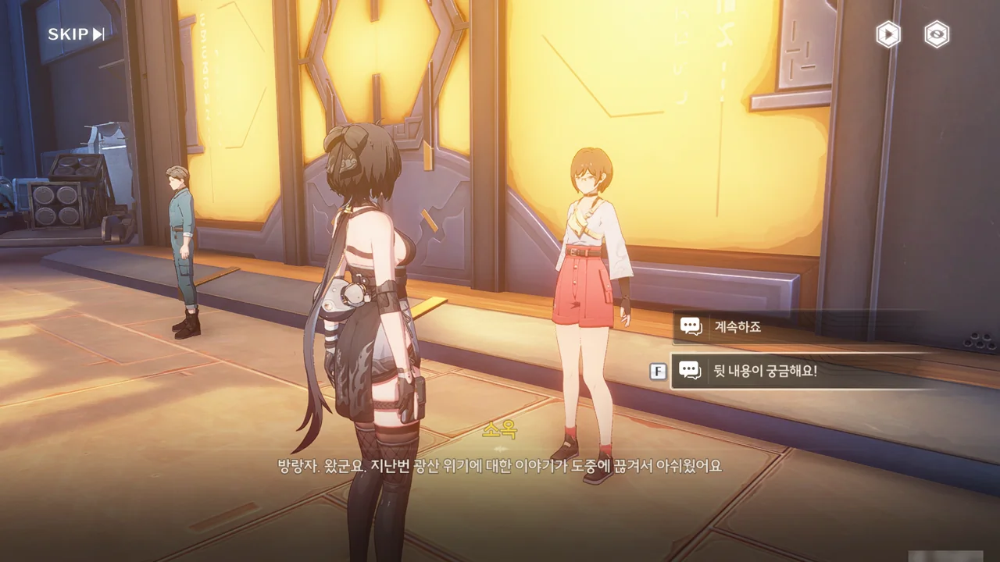









소옥이 지난번에 미처 말해주지 못한 이야기는 다음과 같다.

오래전, 호환 광산 지하에 거대한 잔상이 있음이 확인되었을 때, 이 잔상을 어떻게 처리할 것인지에 대해 광산 내부에서 의견이 갈렸다. 그런데 광산 책임자 중 한 명인 '성문'이 충동적으로 일을 벌여 잔상이 폭주하는 사태가 일어났고, 그 탓에 광산에 심각한 위기가 닥쳤다. 잔상의 폭주로 목숨을 잃은 성문은 그 죄로 기록말살형에 처해졌으며, 잔상과 공존해야 한다 주장한 홍백이 이후 광산을 차근차근 재건해 현재의 모습이 되었다고 한다.

광산 밑에 잔상이 있다는 것이 호환 광산의 비밀이었구나.

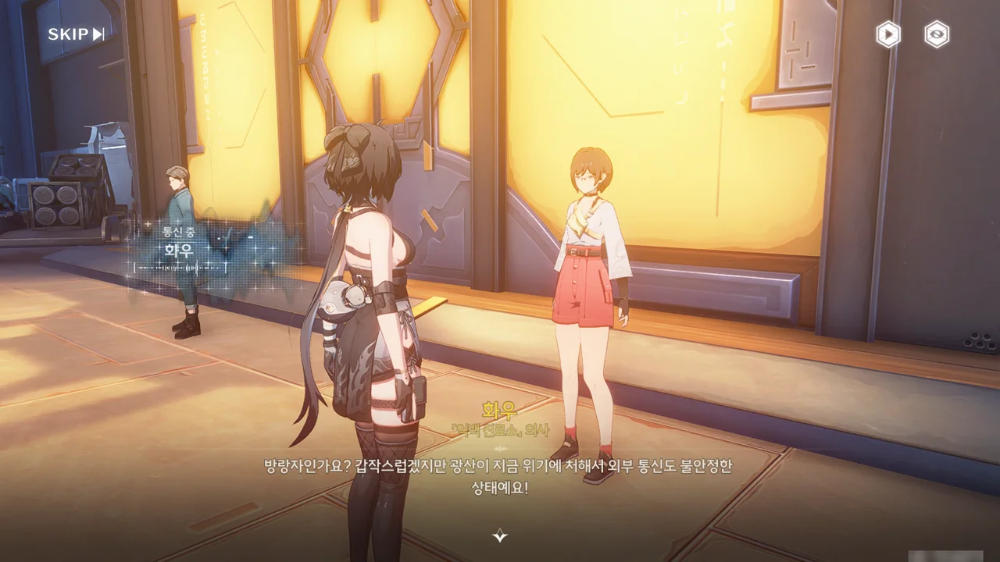





호환 광산의 진료소 의사, 화우가 광산에 큰 위기가 닥쳤다며, 방랑자에게 다급하게 도움을 구한다. 대체 무슨 일이 생겼길래 외부 통신까지 불안정해지는 거야? 그리고 소옥은 광산이 위험하다는데 왜 이렇게 담담한 거지?

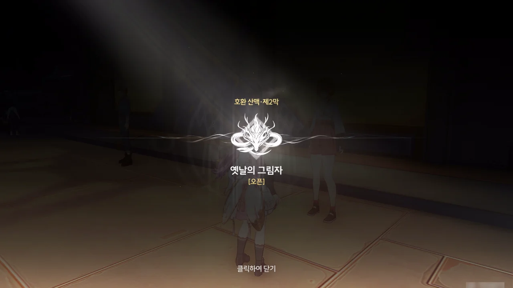

호환 산맥 제2막 \[옛날의 그림자\] 오픈.

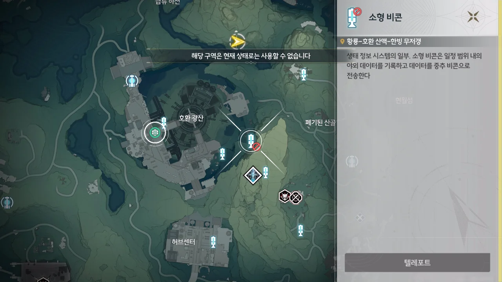

와, 나 이렇게 비콘이 잠긴 거, 처음 봐...

저 비콘이 아마 반디의 군세와 가장 가까운 비콘일 건데... 설마 반디의 군세가 무슨 문제를 일으킨 건가?





호환 광산에 와보니, 아주 난리다.

한 광부는 하마터면 얼어 죽을 뻔했다며 화를 내고 있고, 연구원은 광산 바닥의 측정기가 반응이 없다며, 기록된 자료를 잃어 여태까지의 노력이 물거품이 될까 걱정하고 있다. 게다가 이번 광산의 가동이 멈춘 게 단순한 사고가 아니라는 말까지 한다.

마침 눈앞에 천둥과 모디가 있으니, 무슨 일이 생긴 건지 물어봐야겠다.

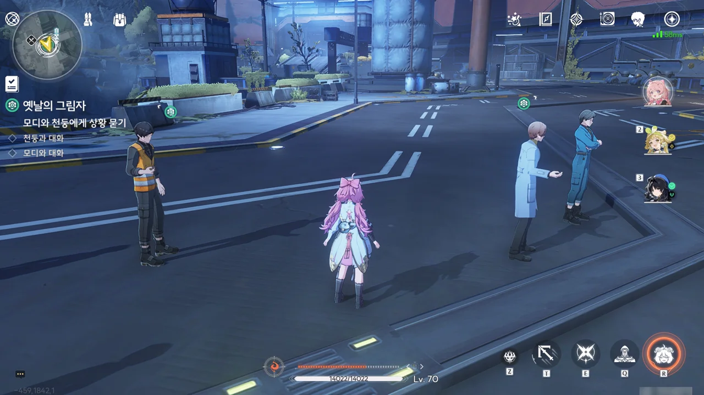

음... 설마 둘 중 누구와 대화할지 선택해야 하는 건 아니겠지? 천둥과 대화를 하면 모디와 대화가 불가능해진다거나 뭐 그런 거 말이다.

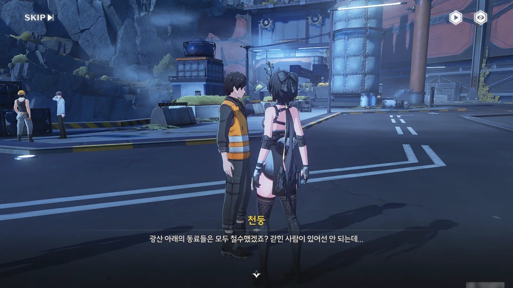

















천둥이 하층부의 한기가 상층부에도 퍼질까 봐 걱정하고 있다.

광산 밑에 있는 잔상, 반디의 군세 때문에 정련탑 재가동이 실패했으며, 아래에서 계속 한기가 올라와 상층부를 침식하고 있다고 한다. 저번에 정련탑 재가동을 완료한 줄 알았는데...

호환 광산이 반디석 등의 특수 광석을 대량으로 생산할 수 있었던 건 광산이 반디의 군세와 공생했기 때문이다. 천공부와 광산은 잔상이 휴면 상태에 있으니, 잔상과 공존할 방법을 적극적으로 모색하라고 명령했지만, 천둥을 비롯한 광부들은 언제 잔상이 깨어날지 몰라 두려움과 공포를 느끼고 있다고 한다.

천둥의 말만 들어보면 광산과 천공부가 반디석 등의 자원에 눈이 멀어 잔상의 위험성을 묵과한 것으로 보이지만, 한쪽의 말만 듣고 판단해서는 안되지.

홍백의 생각을 묻자, 홍백이 예전에 먼저 잔상과의 공존을 제안했다고 하니 그의 생각도 모디와 같을 것이라 얼버무린다.

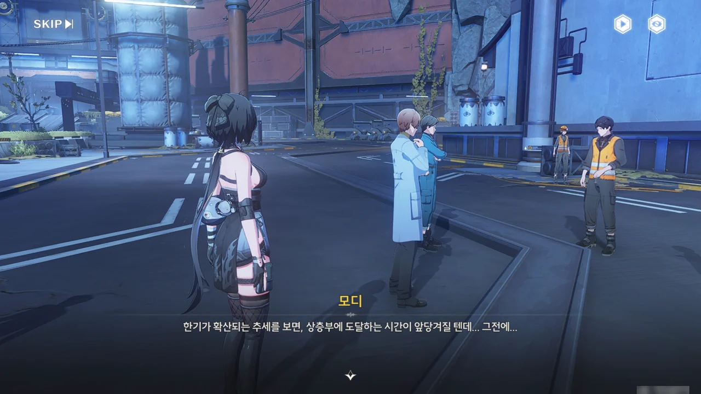









반디석은 자연적으로 형성되기 매우 어려워 극도로 희귀한 광석으로, 인공적으로도 그 형성 조건을 맞추기가 매우 어렵다. 하지만 호환 광산에서는 반디의 군세가 내뿜는 한기와 광산의 지형 때문에 그 조건이 기적적으로 맞춰져, 반디석이 자연 형성된다.

현재 반도체의 주재료가 반디석인만큼, 반디의 군세를 섣불리 제거했다간 반디석의 공급이 끊겨 반도체 생산에 큰 차질이 생길 것이 분명하다. 그런데 여태껏 반디석을 대체할 원료를 찾을 궁리는 단 한 번도 하지 않은 거야? 언제까지고 반디의 군세가 동면할 거라는 보장은 없잖아.

천둥과 모디가 잔상과의 공존을 갖고 서로 다투었다는 게 반디의 군세를 두고 한 이야기라는 건 처음 알았지만, 이번에도 역시 천둥의 의견에 무게가 더 실리는 것 같다. 안전이 최고지.

한 가지 이상한 건, 모디에게 홍백의 의견을 물었을 때, 천둥과 마찬가지로 홍백이 자신의 편일 것이라는 추측만 하고 있다는 거다. 대체 뭐지? 홍백이 천둥, 모디와 대화한 건 확실해 보이는데, 왜 둘 다 홍백의 의견에 대해 확신하지 못하고 있는 거야? 그리고 홍백이 이상했다는 건 또 뭐고?

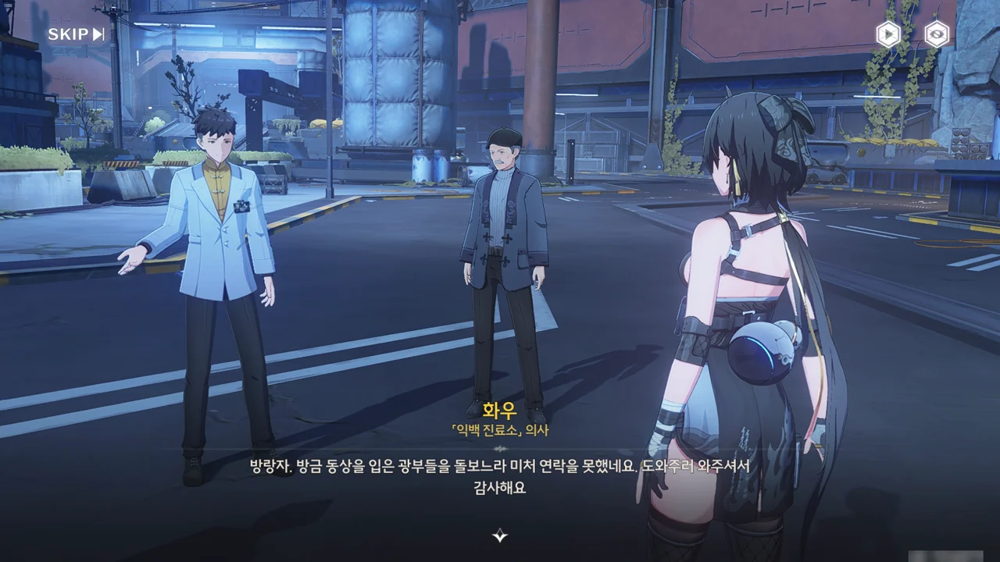



일기장에 적어둔 방랑자의 정보를 본 홍백이 방랑자에게 도움을 요청하라고 했다고 한다. 그런데 홍백이 하는 말이 좀 이상하다.

> 「천공부」 당신네들! 이번엔 드디어 따라잡았군.

대체 이건 무슨 말이지? '이번엔'? 마치 옛날에도 이런 일이 있었다고 말하는 것 같은데... 우리, 이번이 두 번째로 보는 거잖아요.









천둥과 모디, 둘 다 홍백의 의견에 대해 확신하지 못하고 우물쭈물 댄 이유가 여기 있었구나.

천둥과 모디가 서로 싸울 때, 홍백은 천둥을 홍백이라 부르며 그가 자기 생각만 하고 상대 입장은 전혀 생각하지 않는다고 비판했다. 그러면서 두려운 미지의 존재를 소멸하는 것만이 반드시 옳은 일이냐며, 반디의 군세를 제거한 후 반디석의 대체 광석을 찾을 수 있겠냐고 질책했다.

그 후, 홍백은 모디를 성문이라 부르며, 잔상과 공존하는 건 좋지만 잔상으로 인해 재난이 일어났을 때 그에 대응할 방책이 있냐며, 뜬구름 잡는 생각은 추락할 수밖에 없다고 따졌다.

소옥에게 들은 이야기와는 정반대인데? 저 말에 따르면 잔상과의 공존을 주장한 건 홍백이 아니라 성문이었다는 거잖아. 홍백은 오히려 잔상을 제거하자는 의견이었고.

홍백과 성문이 절친한 친구 관계였다는 건 처음 들었다.









화우가 말하길, 과거에도 지금과 비슷한 일이 발생했으며, 홍백이 느끼는 상황은 현재와 과거가 서로 뒤섞여 있다고 한다. 그래서 홍백이 자기 자신은 과거 상황을 방관한 다른 사람으로 여기고, 천둥을 홍백, 모디를 성문으로 생각한 거라고 한다.

현재 이를 해결할 수 있는 방법은 없고, 그냥 홍백이 하라는 대로 하는 수밖에 없다. 어쩌면 이번 기회를 통해 과거에 무슨 일이 있었는지 알 수도 있을 테고...

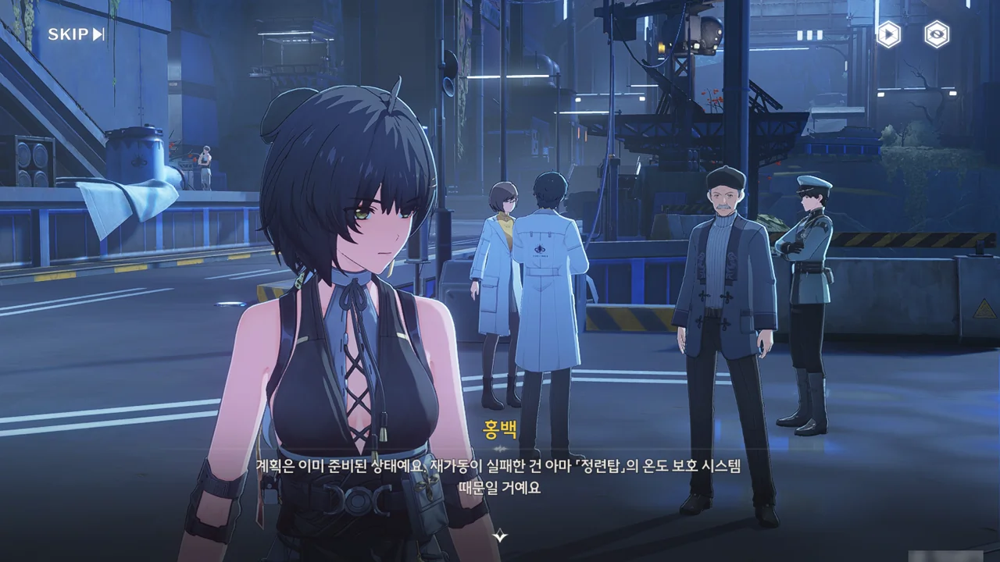







홍백이 이번 정련탑 재기동이 실패한 건 정련탑 온도 보호 시스템 때문일 거라고 말한다. 정련탑 온도 보호 시스템은 정련탑의 온도 변화에 따라 실시간으로 매개 변수를 조정해 정련탑이 정상적으로 작동할 수 있게 하지만, 반디의 군세가 깨어나면서 번진 한기가 정련탑의 온도를 시스템이 처리할 수 있는 범위보다 한참 밑으로 떨어트린 탓에 시스템이 마비되었다고 한다.

정련탑을 가동하려면 온도를 정상 범위 안으로 올려야 하며, 정련탑을 가동하면 정련탑에서 나오는 열기가 반디의 군세가 내뿜는 한기를 억누를 수 있을 거라고 한다.

그러니까 방랑자가 나서, 반디의 군세를 처리해 반디의 군세가 내뿜는 한기의 양을 줄여야 한다. 그래야 정련탑이 가동될 수 있고. 그 이후는 정련탑이 알아서 해줄 것이다.

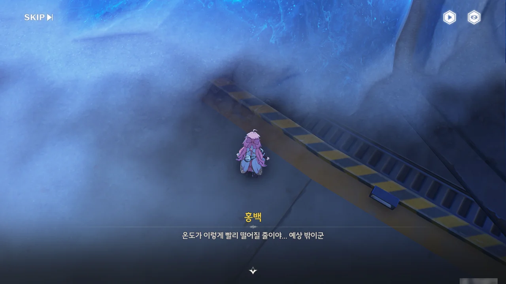



엘리베이터를 타고 내려오는 대신, 위에서 공중 낙하 공격으로 떨어져 내린 탓에 제대로 된 각도의 사진을 찍지 못했지만, 광산 최하증이 그야말로 얼음세상으로 변해버렸다.

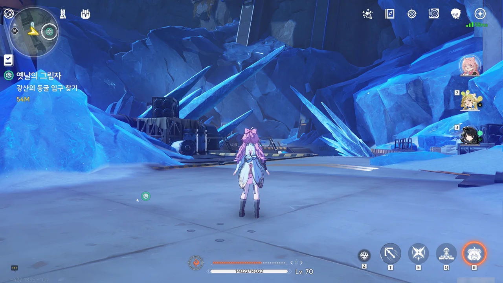

최하층 곳곳에 푸른얼음 같은 것이 자라 있다.

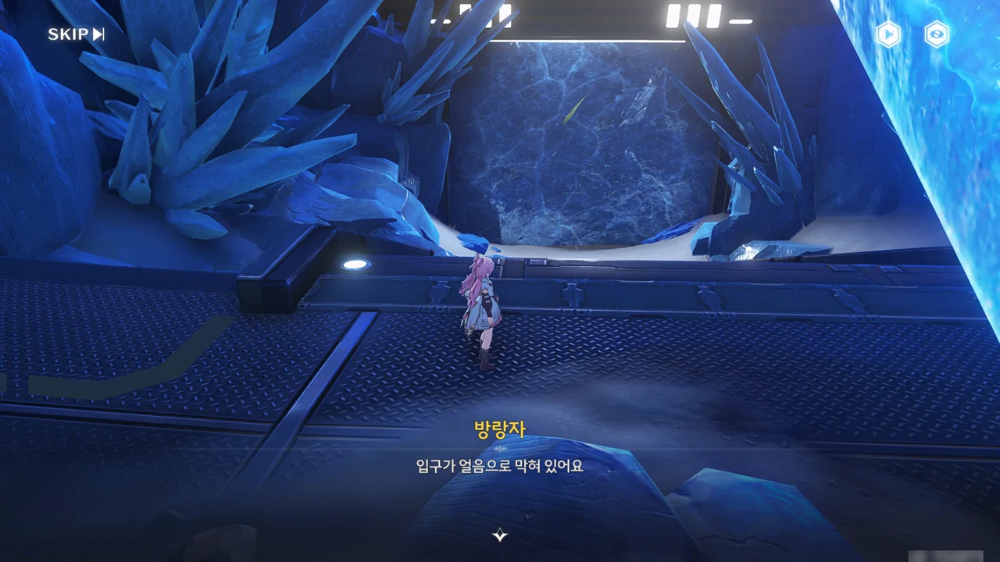



반디의 군세가 깨어나며 생긴 얼음 고치 때문에 광산 입구가 얼음벽으로 막혔다.



얼음 고치를 하나 제거하니, 얼음벽에 균열이 생겼다.

얼음 고치가 하는 일은 두 가지로 나뉜다. 주변에 한기를 방출해 플레이어를 얼리거나, 프리즘처럼 주변 잔상을 강화하는 것이다. 거리를 두고 얼음 고치를 우선해 공격하면 된다.







나머지 두 얼음 고치를 제거하니, 얼음벽이 산산조각 나며 광산으로 가는 길이 열렸다.











홍백이 옛날이야기를 해준다.

홍백과 성문은 일이 끝난 후 금주 잡찜 도시락을 함께 먹었을 정도로 친한 사이였지만, 반디의 군세가 처음 발견되었을 때 잔상의 처리 여부를 두고 심하게 싸웠다. 성문이 여러 자료를 들고 와 홍백을 설득하려 했지만, 홍백은 그저 화를 내며 성문의 말을 묵살하기만 했다.

급기야 성문과 말다툼하기 싫어 문을 걸어 잠그고 그 안에 틀어박힌 건지, 성문은 홍백이 가장 좋아하는 음식을 들고 와 문을 두드리며 사람과 고래에 대한 이야기를 시작했다. 사람과 고래가 처음 만난 이야기는 반디의 군세를 처음 만난 그 당시 상황과 유사했고, 이야기의 나머지 절반을 정하지 못했다는 성문의 말의 속뜻은 잔상과의 공존에 대해 홍백의 생각을 묻는 것이었다.

저번에 홍백의 일지에서 보았던 꿈 이야기가 생각난다. 젊은 신입 선원들은 고대 고래가 자신들을 전혀 해치려 하지 않았음에도 고대 고래를 '해양으로부터 비롯된 재앙', '대자연이 만들어낸 악마의 화신'이라 말하는 선장과 선임 선원들의 말만 듣고 고대 고래를 공격했고, 결국엔 자신들이 왜 고대 고래를 공격하는지조차 잊게 되었다고 적혀 있었다.

성문이 말했다는 사람과 고래 이야기가 바로 이 이야기였을지도 모르겠다.

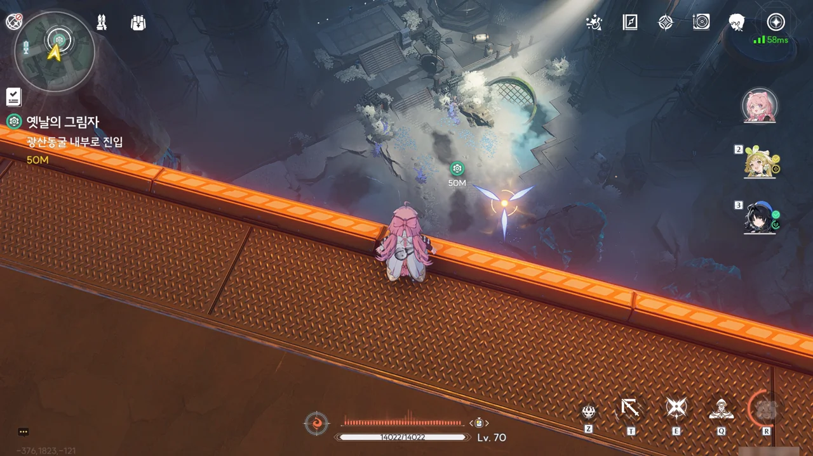

원래 이 아래도 꽁꽁 얼어붙어 있었나?

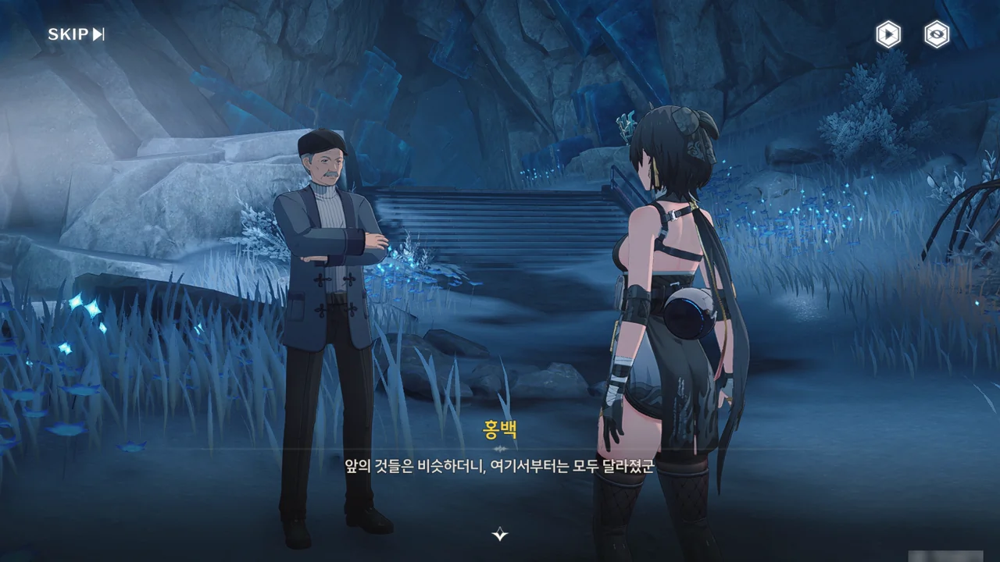







과거 --- 홍백이 여전히 꿈이라 생각하는 --- 홍백은 반디의 군세를 없앨 계획을 세웠지만, 그 계획이 어떤 결과를 가져올지는 전혀 생각하지 못했다. 큰 사고를 치고 돌아온 홍백은 질책을 받기는커녕 광산의 영웅으로 칭송받았다.

> 역시 지금이 좋아. 꿋꿋하게 마주 보고 서서 더 이상 도망가지 않게 됐으니까.

광산을 큰 혼란에 빠트린 건 성문이 아닌 홍백이었던 모양이다. 어쩌다 일이 정반대로 알려진 건진 몰라도, 성문이 받았어야 할 칭송을 자신이 가로챈 것이 홍백에게 있어 여태까지 마음의 짐이 되었던 모양이다.

늙고 힘없는 노인이 반디의 군세와의 전투에서 도움이 될 리 없으니, 홍백은 여기서 헤어지기로 했다.



가는 길에 얼음 고치가 많이 나올 거라 생각했는데, 얼음 고치는 나오지 않고 잔상만 잔뜩 나왔다.

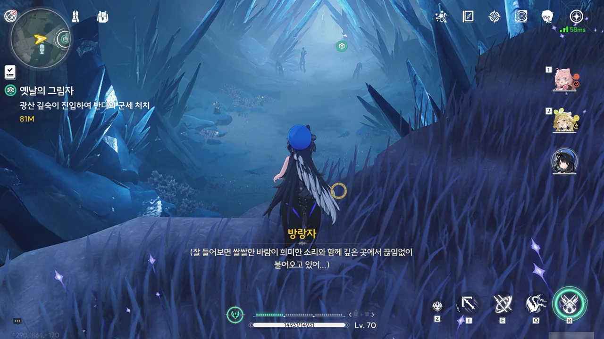

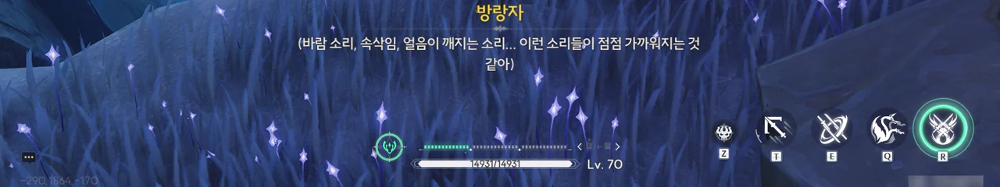

속삭임...? 예전에 반디의 군세에 대해 적은 글을 읽었던 기억이 난다.

지금 반디의 군세는 한기를 내뿜는 게 전부인 잔상으로 보이지만, 그 실상은 매우 위험한 잔상이라고 한다.

> 추운 동굴에 칩거한 포획자는 소리를 수집하고 모방하는 데 열중하고 떨리는 웅성거림으로 인간의 말을 흉내 낼 수 있다. 반디의 군세는 소리를 미끼로 유인된 먹이를 깊은 추위에 얼려 죽인다.
{.bq}

인간의 말을 매우 그럴듯하게 흉내 내어 인간을 꾀어낸 다음 얼려 죽여서 주파수를 흡수하는, 극도로 위험한 잔상이 바로 반디의 군세다.

그래서 호환 광산에서 근무하는 광부들은 도움을 청하는 소리나 자길 부르는 소리가 들리면 상시 휴대하고 다녀야 하는 데시벨 측정기의 수치 변화를 통해 그 소리가 진짜 사람의 소리인지, 아니면 잔상이 보낸 주파수로 인한 환청인지 확인하고 행동해야 한다고 한다. 이미 반디의 군세 때문에 실종자가 여럿 발생했으며, 실종자를 구출하러 파견된 야귀군 역시 반디의 군세에 의해 얼어 죽었다는 기록도 있다.

평안한가. 이제 잘 시간이야.

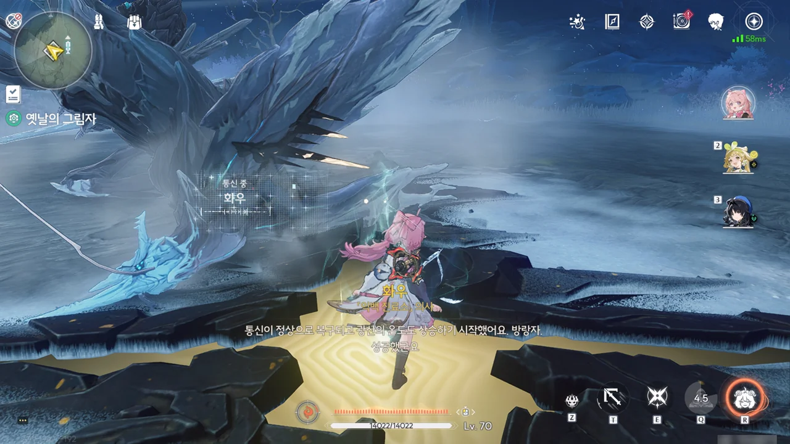

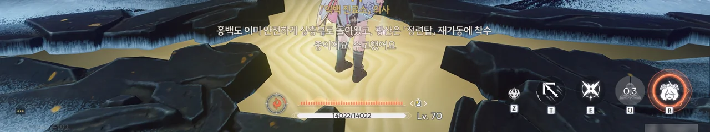

반디의 군세를 처치하자마자 광산의 온도가 상승하며 통신 역시 복구되었다. 이 녀석이 광산의 통신을 막은 원흉이었나 보네.

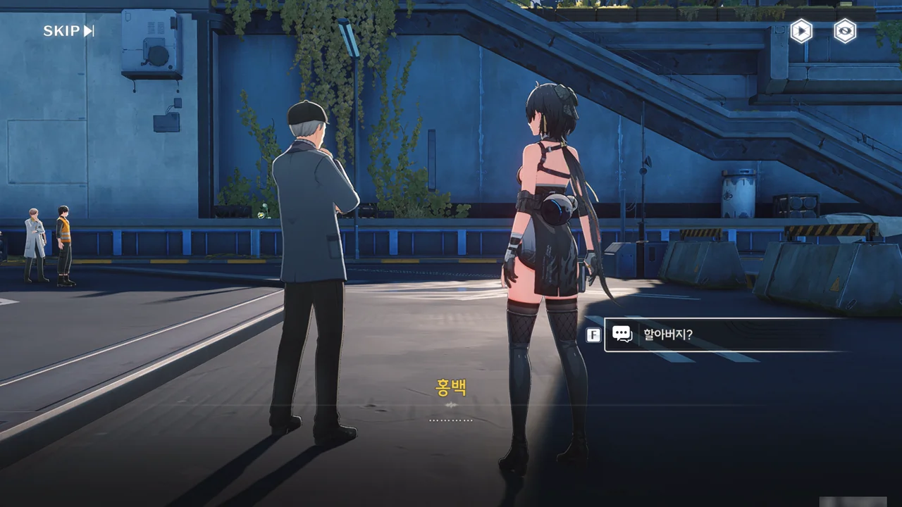







홍백의 꿈에서 나온 성문은 특수 광석으로 만든 명패에 새긴 글자가 몇 년이 지나도 지워지지 않을 거라 했는데, 홍백이 광산 갱도를 나오며 주운 명패에는 그 말처럼 성문의 이름이 온전하게 새겨져 있었다. 그걸 본 홍백은 자신이 꿈이라 생각했던 게 전부 과거에 있었던 일이란 걸 깨달았다.











반디의 군세가 깨어난 후, 홍백과 성문은 금주에서 구조대가 올 때까지 시간을 벌기 위해, 아까 방랑자가 했던 것처럼, 얼음 고치를 부수고 광산 입구의 얼음을 제거하며 반디의 군세의 힘을 억제했다. 그때에는 반디의 군세의 힘을 억누를 정련탑이 존재하지 않았기 때문에, 홍백과 성문이 한 일은 일시적인 억제책에 불과할 뿐이었다. 

반디의 군세와의 전투 중 큰 부상을 입은 성문은 금주에 실려가 치료를 받았지만, 결국 목숨을 잃었다. 홍백이라면 분명 광산을 재건할 수 있을 거라 믿었던 성문은, 광산이 동시에 두 명의 담당자를 잃는 걸 막기 위해 자신이 반디의 군세를 깨웠다며 천공부에 거짓말을 했고, 죽은 후에는 죄인 취급받아 기록말살형에 처해졌다. 문책을 받을 각오를 다졌던 홍백은 성문의 거짓말 때문에 성문이 받았어야 할 박수와 메달을 대신 받게 되었다.

이후 홍백은 성문이 남긴 연구 자료를 진지하게 연구한 끝에, 잔상과 공생하기 위해선 양자택일이 아닌 절충을 해야 한다는 걸 깨닫고, 성문이 남긴 정련탑의 초기 구상을 다듬어 지금의 정련탑을 만들어내었다. 정련탑에는 광물을 정련하는 목적뿐만 아니라, 정련탑의 열기로 반디의 군세의 냉기를 일정량 억눌러 반디의 군세가 깨어나지 못하게 하는 목적도 있었던 것이다.





지금의 호환 광산이 있게 된 데에는 성문의 공로가 매우 크지만, 그가 홍백의 죄를 대신 떠안고 죽은 탓에 광산 자료 그 어디에서도 성문의 이름을 찾을 수 없게 되었다. 진실을 기억하고 있는 홍백조차 나이가 들어 성문에 대한 기억을 점차 잃어가고 있으며, 광산 역시 빠르게 변해가며 과거의 흔적을 지워가고 있다. 그래서 홍백은 화우에게 들은 조언대로, 절대로 잊고 싶지 않은 과거의 일을 일기에 적었다.

이번 일로 인해 홍백이 마음의 짐을 조금이나마 덜었으면 좋겠네.





홍백이 천둥과 모디를 심하게 질책한 이유는 그 둘의 모습에서 과거 자신과 성문의 모습을 겹쳐 보고, 그들이 자신과 같은 길을 걷게 하지 않기 위해서였다.

어쩌면 그의 바람대로, 이번에 서로 협력한 일을 계기로 천둥과 모디는 과거 홍백과 성문이 걸었던 길과는 다른 길을 걷게 될지도 모르겠다.



마지막으로, 홍백은 금주 잡찜을 먹어보라는 말을 남기고 가버렸다.







정련탑이 다시 가동되자, 광산 최하층을 얼렸던 얼음이 녹기 시작한다. 가동이 중단되었던 채굴장비 역시 다시 가동을 시작하며 광물을 캐내기 시작한다.

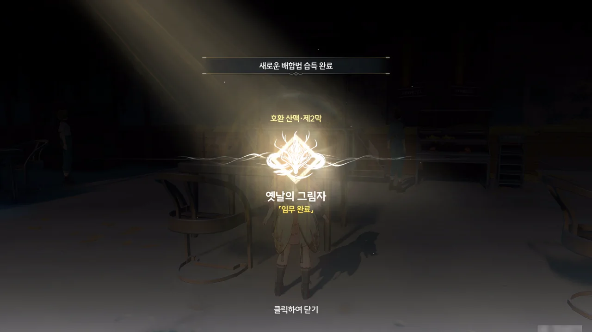

어느새 금주 잡찜을 먹은 건지, 상층부 상가에서 일어나는 것으로 호환 산맥 제2막 \[옛날의 그림자\]가 끝이 난다.
