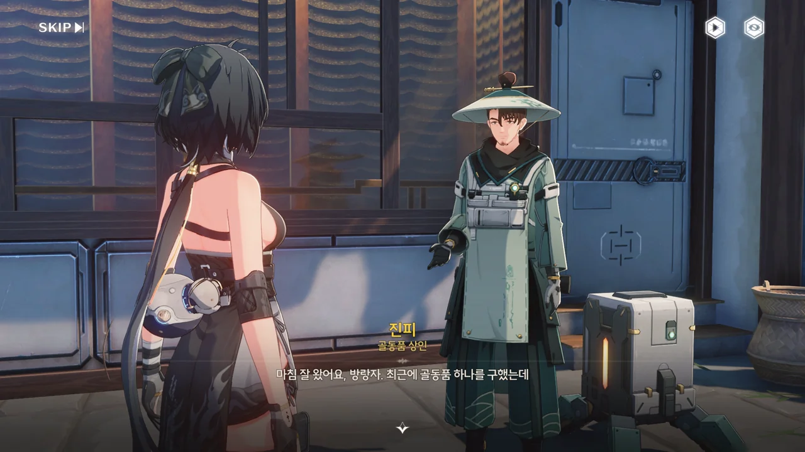
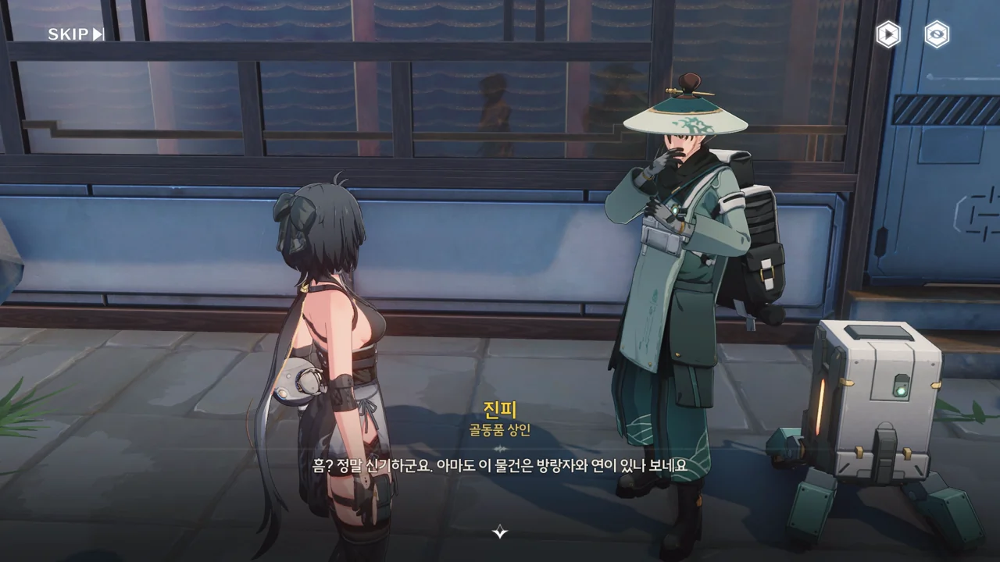
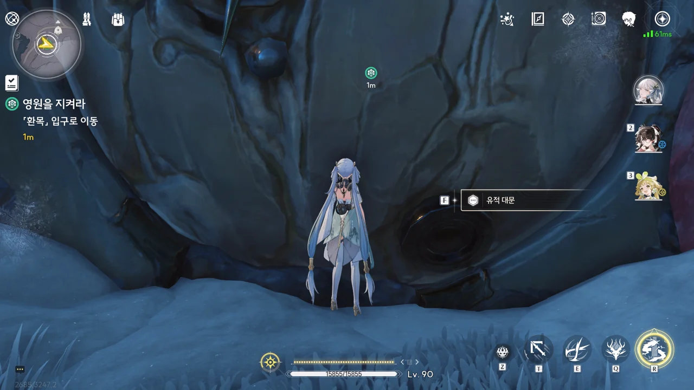
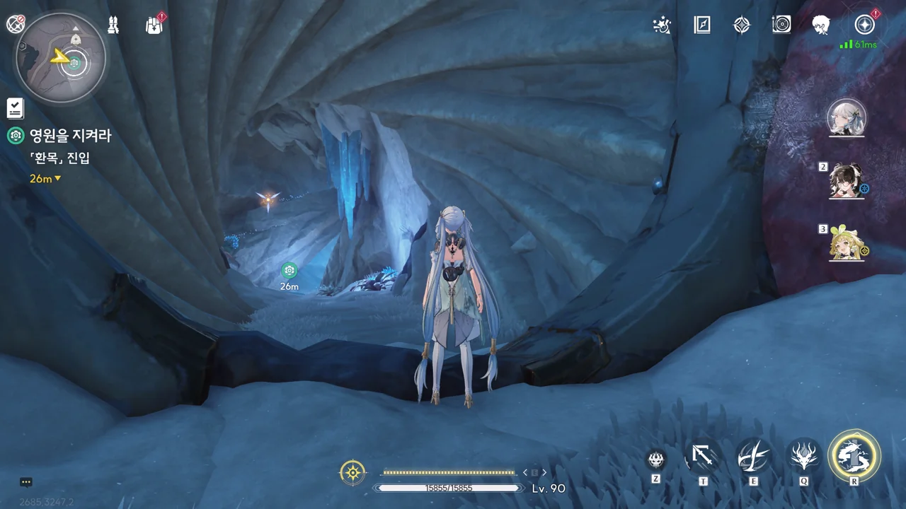
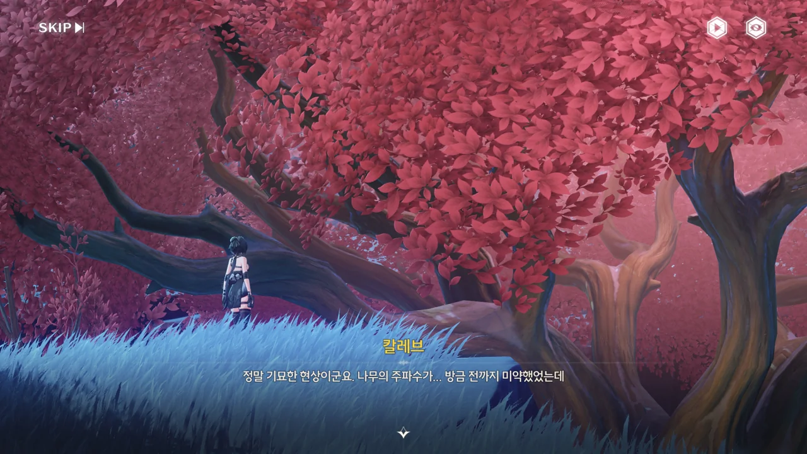

일반적으로 위험한 임무는 해당 임무가 위치한 지역명이 챕터명으로 같이 붙는다.
바로 직전 작성한 '옛날의 그림자' 임무의 챕터명으로 '호환 산맥 제2막'이 붙었듯이 말이다.

하지만 이번 위험한 임무인 '영원을 지켜라'는 승소산에 위치한 위험한 임무임에도 불구하고 챕터명이 아예 붙어있지 않다.
단순한 버그인가 싶어 해외 위키를 확인해 보아도 이번 임무는 챕터명이 존재하지 않는다.

그래서 임의로 챕터명 대신 지역명만 붙였다. 그렇게 마음에 드는 조치는 아니지만, 이게 내가 할 수 있는 전부인 것 같네...





진피가 승소산과 관련한 것으로 추측되는 골동품을 구했다. 직정 유적에서 나온, 무언가를 열 수 있는 열쇠로 보이는 물건이지만 관련한 기록이 모두 소실되는 바람에 이게 정확히 뭔지 모르겠다고 한다.

그런데 진피가 만졌을 때에는 아무런 반응을 보이지 않던 골동품이 방랑자가 만지자마자 온전히 합쳐지더니, 무슨 영상을 비춘다.

설마 이것도 기관 뭐 그런 건가?









열쇠가 비추고 있는 영상은 '환목'이라는 지역을 가리키는 지도였다.

환목에는 '하늘의 나무'라고 불리는, 유구한 역사를 지닌 나무가 있는데, 홍진 마을 사람들은 이를 마을을 지키는 신물로 여겼다고 한다.

하지만 얼마 전 있었던 사건 --- 아마 잔성회의 침입이었을 거다 --- 때문에 하늘의 나무는 점차 말라가고 있다고 한다.





환목 유적은 진피의 말처럼 직정에서 만든 것이 맞았다. 환목 연구실의 연구 보조 AI, 「칼레브」가 방랑자를 인식하고 연구실 최고 권한을 방랑자에게 넘기고 문을 열어주었다. "파일과 관련한 시간 오류"는 방랑자의 특성 때문이겠지. 금주가 생기기 이전부터 있었던 사람이니 말이다.

"██ 문명"이라는 표현을 보니 생각난 건데, 방랑자는 지금의 솔라리스 문명이 세워지기 이전부터 있어온 '고대인' 비슷한 것이라고 하더라. 이 이야기를 어디서 들은 건지, 그 근거는 무엇인지 전혀 기억나지 않지만.



진피에게 받았던 아이템의 이름이 「별을 옮기는 키」였구나. 별은 정말 많은 뜻을 갖고 있기에, 여기서 말하는 '별을 옮긴다'가 무얼 뜻하는 건지는 모르겠다.



칼레브가 제빙을 미처 하지 못한 덕분에 내려가는 길이 지루하지 않게 되었다.





'별을 옮기는 키'를 이용하여 시설 내의 정류계를 작동시켜, 일정 범위 내의 시간을 잠시 멈출 수 있다. 10초의 유지시간이 있는 스테이시스 필드라고 생각하면 편하다.

전투에 쓰지 않을 시에는 이렇게 '스위치 위에 올라가 있어야 열리는 문'을 연 다음, 고정시키는 용도로 쓰면 된다.



수직 통로가 있길래 아무 생각 없이 낙하 공격을 했는데, 용케도 통로를 가로지르는 레이저에 맞지 않고 내려올 수 있었다.

칼레브, 말하는 게 너무 늦어!





위아래로 제멋대로 왔다 갔다 하는 승강기둥을 잠시 얼리면 문을 열 수 있다.

여길 침입한 잔상 때문인지, 칼레브의 기억이 온전치 않다.





여기 내려오기 전, 지상에 말라붙은 나무가 한 그루 있는 걸 보았다. 그게 아마 '하늘의 나무'였을 거다.

'하늘의 나무'는 연구실의 에너지 코어에서 새어 나오는 에너지의 일부를 흡수해 성장했으나, 잔상이 연구실에 침입해 에너지 코어를 파괴하는 바람에 코어에서 누출된 과도한 에너지를 견디지 못하고 역으로 말라가고 있다고 한다.

진피는 하늘의 나무가 이미 죽었을 거라 추측했는데, 아직 가느다란 목숨줄은 남아있었던 모양이다. 하루라도 빨리 에너지 코어를 복구해야 회복할 기회나마 얻겠지만 말이다.



역류계 프로토타입을 이용해 시간을 되돌리려 했으나, 연구실에 침입한 잔상들 때문에 보안 노드가 비활성화된 탓에 이를 먼저 복구해야만 역류계를 작동시킬 수 있다고 한다.





방어 노드를 재가동하자, 기다렸다는 듯이 잔상들이 나타나 방어 노드를 공격한다. 비활성화된 역류계와 달리 아직 잘 작동하는 정류계를 적절히 사용하여 수월하게 잔상을 물리쳤다.



다음 방어 노드에는 잔상이 없었지만, 승강기둥이 고장 나 방어 노드가 가동되지 않고 있었다. 도와줘요, 정류계에몽!



이상하다. 분명 처음 연구실에 들어올 때, 칼레브가 '최고 권한'을 줬다고 하지 않았어? 그런데 왜 '더 높은 등급의 연구원'에게 문의하라고 하는 거지?

데이터베이스뿐만 아니라 칼레브 자체에도 손상이 간 모양이다.



연구실에 마지막으로 남은 칼레브의 창조자, 빅터 크리스토퍼는 자신의 연구를 도운 '그 사람'을 다시 한번 보기 위해, 늙어 죽는 걸 마다하고 언제 풀릴지 모르는 정지된 시간 속에 자신을 밀어 넣었다.

빅터가 말하는 '그 사람'은 분명 방랑자를 말하는 거겠지. 빅터 본인도 '지속적이고 되돌릴 수 없는' 정지장이라 했으니, 빅터를 다시 꺼내는 건 불가능에 가까울 것이다. 방랑자 역시 기억을 잃었으니.

본인도 인정했듯, 저건 영생이라 부를 수 없다. 그냥... 박제되어 멈춘 것이다. 방랑자는 어떻게 생각할지 모르겠지만, 내가 보기에 저건 죽은 것과 다름없다. 이걸 가련하다 해야 할까, 아니면 측은하다 해야 할까. 뭔가 가슴속 한편이 아린데, 이걸 뭐라 표현해야 할지 모르겠다.



세 번째 방어 노드는 살아 있었지만, 그 주변에 있는 잔상을 처리해야만 했다.



칼레브의 자가진단 로그를 발견했다.

빅터가 사라진 후, 그가 마지막으로 남긴 명령에 따라 칼레브는 계속해서 직정의 연구를 이어나갔다. 비록 에너지 부족으로 인해 직정의 연구를 완성하지 못하고 미완성의 단계에서 멈춰야 했지만, 그 대신 자아 비슷한 것을 각성한 모양이다.



마지막 방어 노드를 재기동했다. 이제 역류계를 작동하면 이곳의 시간이 되돌려져 그 많던 손상들이 복구될 것이다.



빅터가 남긴 다른 일지에 따르면, 이 연구실은 대다수 연구원의 철수 --- 아마 시간 보상 문제로 인해 승소산을 벗어나자마자 빠르게 늙거나 죽었을 것이다 --- 로 인해 버려졌지만, 빅터와 그의 스승, 브람 둘만이 남아 연구를 계속했다고 한다.

빅터는 자신을 보조해 줄 AI, 「칼레브」를 만들었다. 처음에는 단순한 가정용 도우미 목적으로 만든 것이었지만, 자신의 가르침을 빠른 속도로 흡수해 나가는 칼레브의 모습을 보고 그 용도를 연구 보조로 변경했다.

시간이 지나 브람이 노환 혹은 질병으로 사망하고 단 둘이 남게 되자, 빅터는 칼레브에게 자신이 죽더라도 연구를 계속해 달라고 부탁했다.





잔상을 잡는다고 끝이 아니었던 모양이다. 이상 주파수 때문에 시설의 방어 시스템인 '용비늘의 기축'이 방랑자를 공격했다.

그래봤자 내가 이기지만.





역류계 프로토타입이 작동하자, 시들었던 '하늘의 나무'가 다시 원래의 모습을 되찾았다. 주변이 온통 하얗게 얼어붙은 와중에 혼자 붉은 걸 보니, 뭔가 신기하게 느껴진다.











역류계 덕분에 손상된 기억 데이터베이스가 복구된 칼레브는 직정 연구원들의 못다 한 연구를 이어나가겠다고 했지만, 방랑자가 완성-미완성된 역류계 덕분에 승소산을 지켜낼 수 있었다고 전해주자, 이루 말할 수 없을 정도로 기뻐한다.





여태 했던 게 연구 밖에 없어서 그런지, 칼레브는 직정의 연구가 끝났음에도 승소산에 남아있는 여러 비밀들 역시 풀고 싶어 한다.

그래도 지금은 잠시 쉬는 게 좋지 않을까. 여태껏 노력한 일에 대한 보상이라 생각해도 좋고.

하늘의 나무가 아직 씨앗이었을 때부터 이렇게 큰 나무가 될 때까지 과연 얼마의 시간이 들었던 걸까.







진피에게 환목 연구소에서 있었던 일에 대해 들려주고 그 기념으로 「별을 옮기는 키」를 받았다.

빅터가 어디에 있는지 보지는 못했지만, 그래도 연구소에서 겪었던 일은 제법 인상 깊었다.



> 제5 과제: 삶을 즐기기
{.bq}

이제는 조금 쉬면서 삶을 즐겨도 되겠지.
