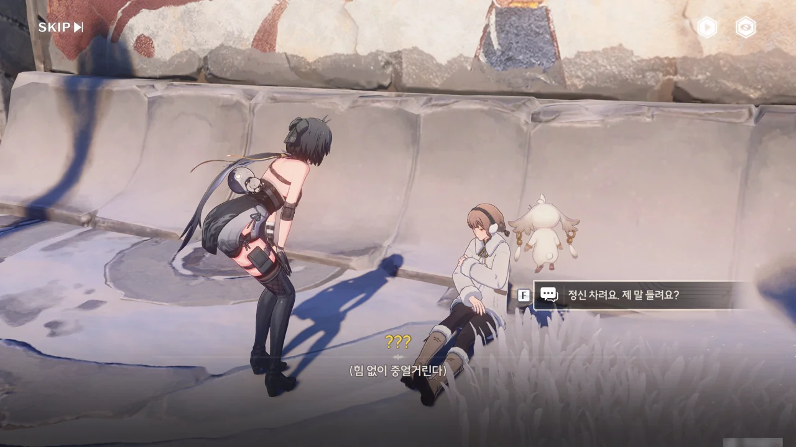







누군가가 벽에 몸을 기댄 채 쓰러져 있다. 별다른 상처가 없고 손이 매우 차가운 것으로 보아, 저체온증으로 보인다.

그나저나 추위를 느끼지 않는다니... 돌이켜 생각해 보면 쪼꼬미 이 녀석, 잔상이었다. 잔상들은 다 이런가?

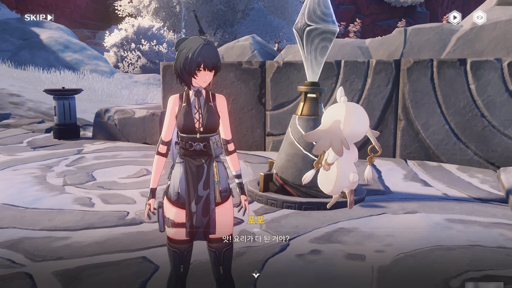



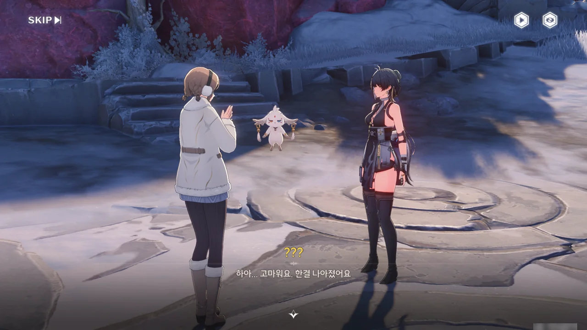





다른 요리도 많은데 왜 하필 청분약선어탕을 줘야 하는지 잘 모르겠다. 아무튼, 뜨끈한 국물이 몸에 들어가자 소녀가 기운을 차렸다.

그 와중에 "우리가 아니었다면 지금쯤 잔상의 배 속에 있었을 거야"라며 겁부터 주는 쪼꼬미 인성 수준...

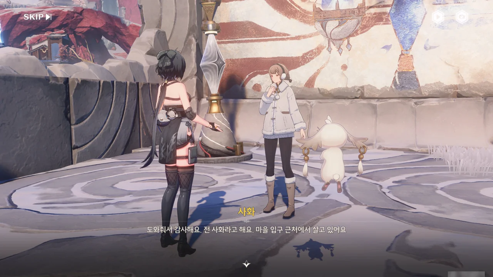











홍진 마을 입구 근처에 살고 있는 '사화'는 잔성회가 마을로 쳐들어오는 걸 보고 다급히 산속 동굴로 도망쳤다고 한다. 잔성회에게 들킬까 봐 숨소리조차 못 내었다고 했으니, 동굴 속에 숨어 있을 동안 뭘 먹었을 리가 없다. 결국 허기와 추위에 지쳐 기절한 사화를 잔상이 동굴 밖으로 끌어낸 것으로 보인다.

잔상이...? 가까이 다가가기만 해도 싸움을 거는 녀석들이 얌전하게 사화를 동굴 밖으로 끄집어내기만 했다고?

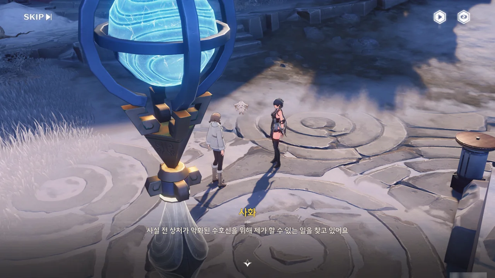







사화가 마을 밖에 있었던 건 상처가 악화된 수호신을 위해 최근 몇 년간 진행되지 않은, 수호신에게 축복을 전달하는 「수호신 의식 · 구슬 바치기」를 치르기 위해서였다.

원래 이 의식은 복 할아버지가 주관했으나, 복 할아버지의 건강이 나빠진 데다 마땅히 의식을 대신 진행할 사람도 구하지 못해 요 몇 년간은 의식이 치러지지 않았다고 한다. 사화가 의식을 대신 진행하려 했으나, 의식의 과정이 너무 복잡한 데다 이에 대해 물어볼 복 할아버지의 건강이 더 악화된 탓에 시작하자마자 막다른 길에 부닥친 것이다.





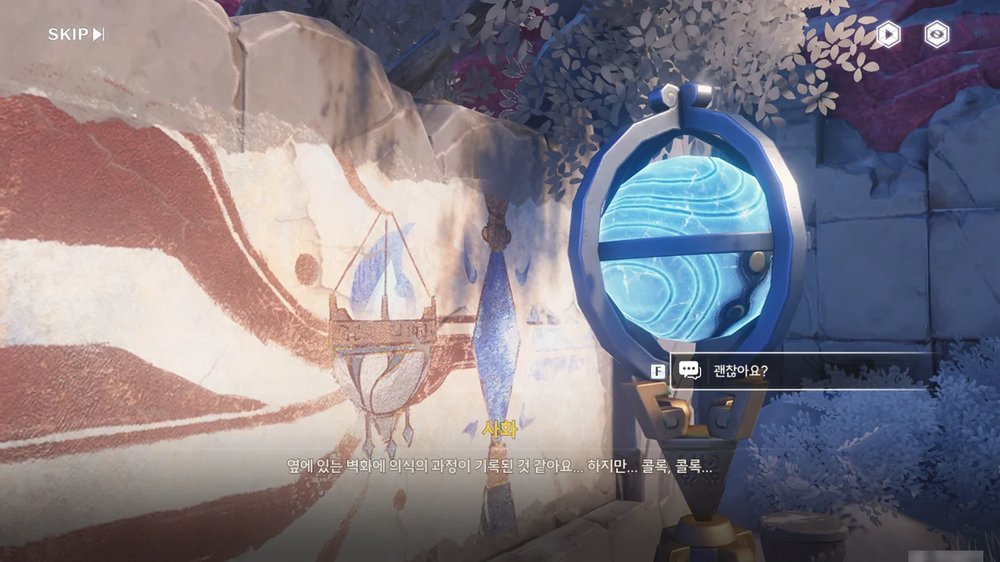



본래 「수호신 의식 · 구슬 바치기」는 수호신이 강림한 이후 계속 이어져 왔으나, 잔상류가 일으킨 혼란으로 한번 맥이 끊겼다가 복 할아버지의 고서 연구로 겨우 다시 이어질 수 있었다.

사화의 건강이 좋지 않아 보여, 일단 유리 등잔이 그려진 벽화가 의식 과정과 연관이 있을 거라는 정보만 얻고 덜 추운 동굴 안으로 들여보냈다.

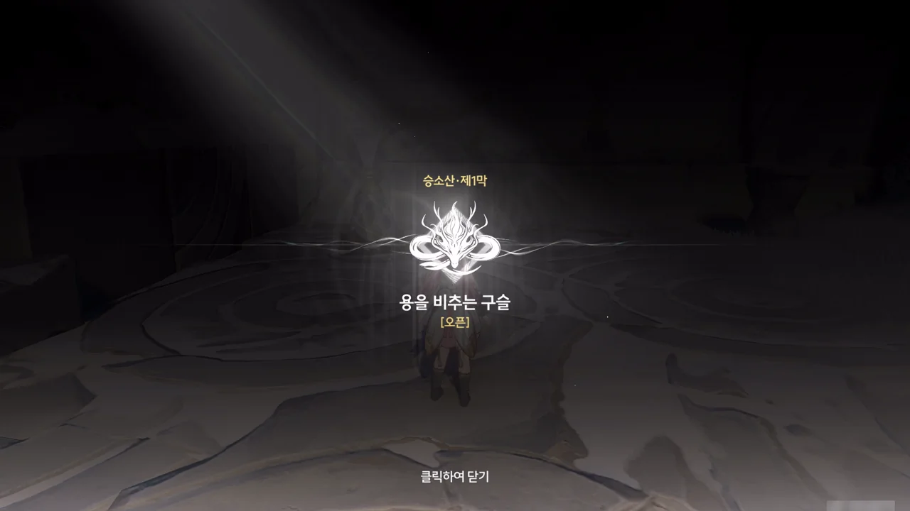

승소산 제1막 \[용을 비추는 구슬\] 오픈!

승소산의 일부 상자는 이 임무를 진행해야만 먹을 수 있다고 하던데...



아까 봤던 수정탑의 이름이 '구슬 시동 장치'인 건가? 벽화에 유리 등잔과 쌍으로 그려져 있던데.





조그만 탑은 '구슬 연결 장치'로 불리나 보다. 이걸 적당히 회전시키면 푸른색 레이저로 서로 연결된다.

벽에 난 창문처럼 생긴 틈새로 들어가는 레이저를 보며 '저 안은 제대로 구현해두지 않았겠지'라고 생각했는데, 반대편에서 보니 안쪽도 제대로 구현해 뒀더라.

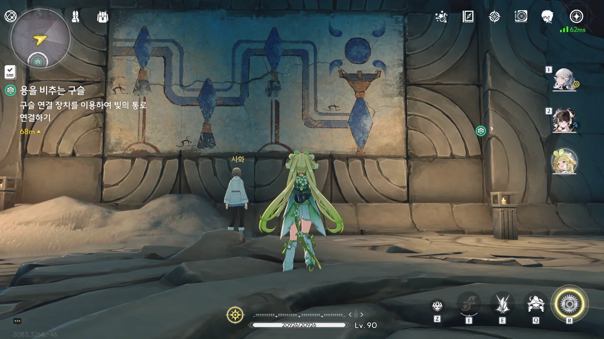

이 벽화 역시 의식과 관련한 것일 테다. 구슬 연결 장치를 적당히 연결하면 마지막에 있는, 구슬 받침대가 있는 수정탑에 뭔가가 생긴다는 의미일까?





아무튼, 하라는 대로 했다. 그러자 처음 자리에 있던 구슬이 받침대 위로 뿅 하고 나타났다.





음... 원신에서 이미 한 번 크게 데인 적이 있어서, 이렇게 시점을 조절하는 퍼즐은 별로 좋아하지 않는다. 그림자니 뭐니 하는 건 좋은데, 퍼즐이 원하는 모습과 내가 보는 모습이 너무 달랐거든.

명조는 과연 제대로 된 시점 퍼즐을 보여줄 수 있을까...?



받침대 위에 있던 구슬이 밝게 빛나더니, 뿅 하고 사라졌다. 용의 입에 물렸다가 사라진 거니, 용에게 먹인 거라고 보면 되는 걸까?

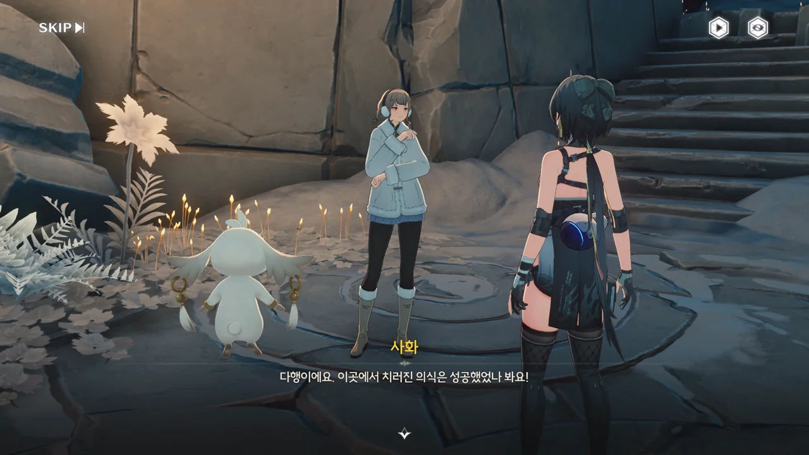





나머지 지역에 있는 네 곳의 의식 장소를 모두 방문해야 한다. 사화가 말해주는 장소가 어디인지는 전혀 모르겠지만, 퀘스트 마커가 잘 알려주겠지, 뭐!



음, 이번 퍼즐은 폭포 뒤의 공간에서 시작하네. 금주성에서도 그렇고, 폭포 뒤에 숨겨진 공간을 정말 많이 보는 것 같다. 게다가 폭포에서 나온 후에는 폭포 양옆의 벽에 설치된 수정탑을 이리저리 돌려가며 레이저를 위로 올려 보내야 했고.





일단 하나 끝.

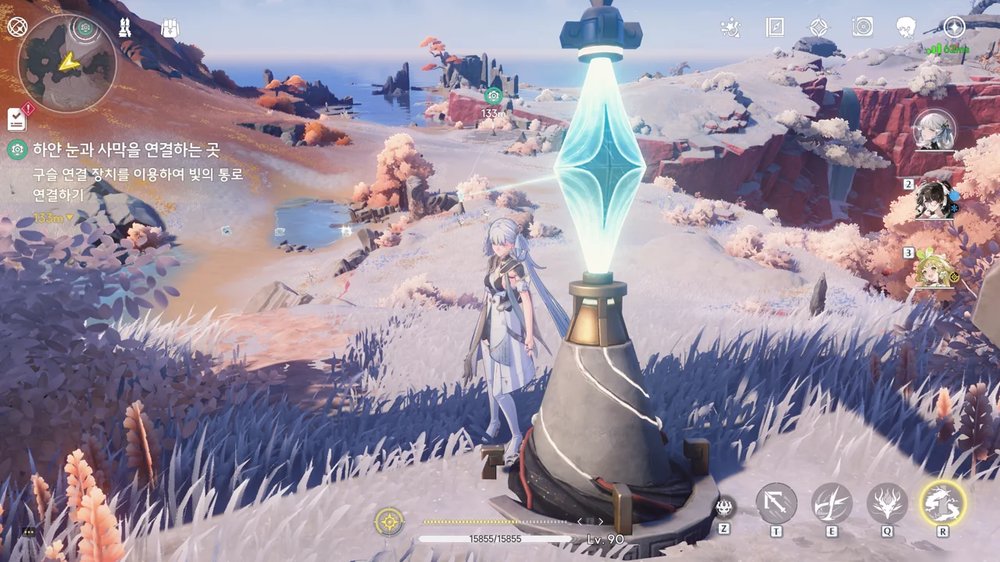

레이저가 정말 멀리까지 뻗어나가네...





아무튼 여기도 끝.



이쪽은 대놓고 잔성회가 진을 친 곳을 가로지르질 않나, 기둥 높낮이를 조절해 레이저를 기둥 너머로 보내야 하질 않나... 그래, 이런 변주가 없어선 안되지.





여긴 제법 시간을 많이 썼다. 역류계로 일단 위쪽에 있는 수정탑에 접근할 수 있게 발판을 만든 다음, 위쪽 수정탑을 먼저 돌려야 한다. 그다음 아래로 내려와 역류계와 아래쪽 수정탑을 돌리는 거지.





여기도 끝! 이제 마지막 하나가 남았다.



여기가 바로 '위험한 임무를 진행해야만 먹을 수 있는 상자'가 있는 곳이었다.

링딩동인지 딩댕동인지 이름이 제대로 기억나지 않는 잔상을 움직여 두 얼음 조각의 모양을 똑같게 만들면 된다.





좋아, 마지막 의식 끝!



엣, 그런데 이게 전부가 아니라고 한다. 마지막 의식이 남아있다고?

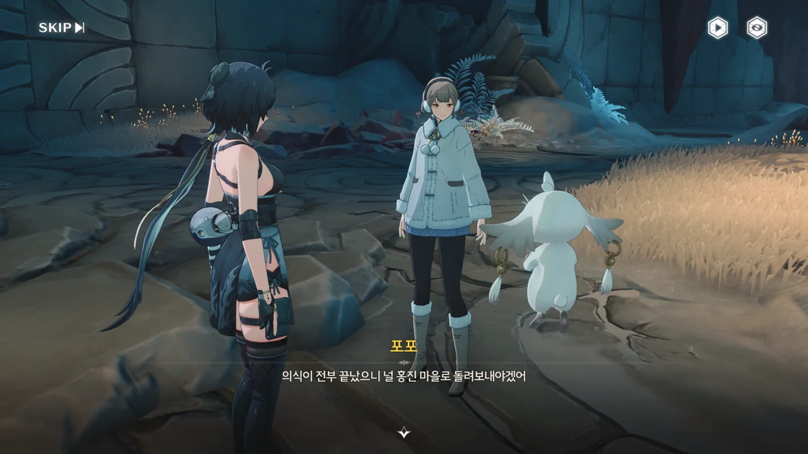







본래 「수호신 의식 · 구슬 바치기」는 승소산 사람들의 성인식을 위한 것이었으나, 시간이 지나며 축복을 기원하고 수호신에게 감사하는 의식으로 변했다고 한다.

본래의 의식에서, 성년이 된 사람은 자신의 지혜와 힘을 증명해 수호신과 홍진 마을을 지켜낼 수 있는 어른임을 증명해야 했다. 여태껏 해온 퍼즐은 '횃불 봉송자'의 지혜를 증명하는 과정이었고, 마지막 남은 의식은 '횃불 봉송자'의 힘을 증명하는 시험이라고 한다.

그러니까 가서 때려 부수면 된다는 이야기지?







모닥불에서 정해진 시간까지 기다리자, 하늘에서 운석이 떨어져 바다에 빠졌다. 그 돌덩이를 앞에 있던 구멍에 끼우자, 「기원의 땅」으로 가는 길이 열렸다.

잠깐만... 그러면 그 옛날에는 성인식을 할 때마다 하늘에서 이렇게 돌덩이가 떨어졌던 거야?





그래서 들어가서 다 때려 부쉈습니다. 금색 상자가 두 개나 나오다니, 너무 행복해!

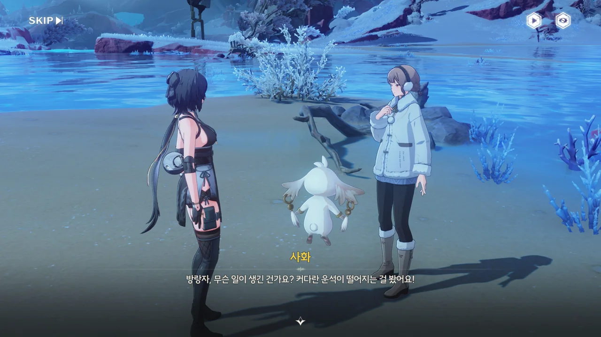





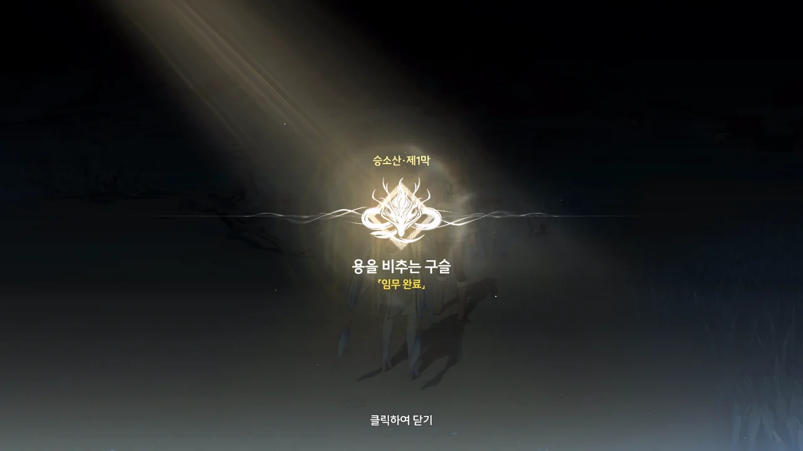

복 할아버지가 여태껏 묵묵히 의식을 치렀다는 사화의 말을 듣고 떠올린 게 하나 있다.

지혜를 시험하는 퍼즐까지는 할아버지가 혼자 할 수 있다고 쳐. 그런데 방금 그 많은 잔상을 처치하는 것까지가 의식의 일부잖아? 그러면 복 할아버지는 매년 그 많은 잔상들을 홀로 처치해 온 거야?

... 그냥 나이 먹은 할아버지라고 생각했었는데, 복 할아버지는 생각보다 더 무서운 사람일지도 모르겠다.

&nbsp;

아무튼, \[용을 비추는 구슬\] 끝!

이제... 조수 임무 글... 써야겠지?
