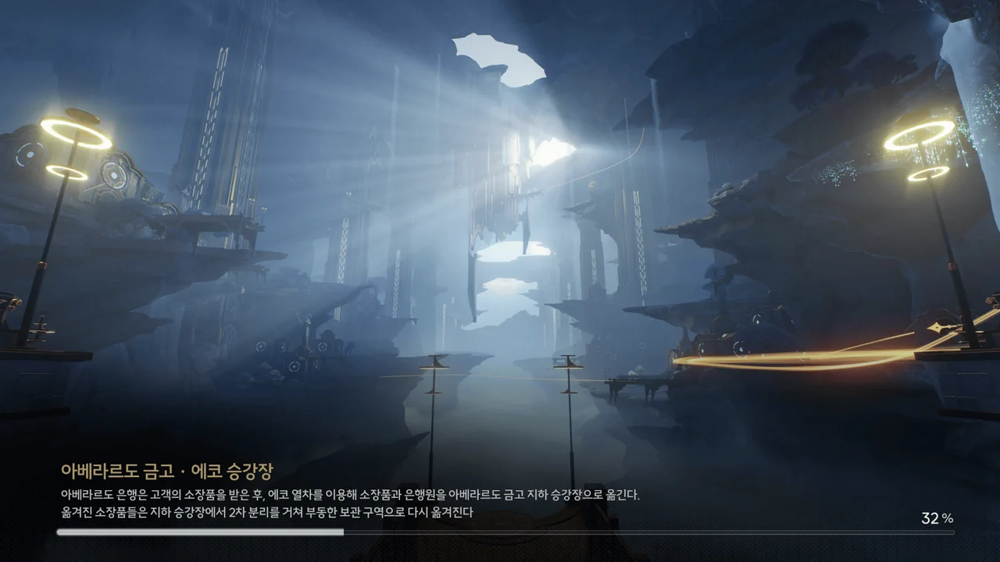
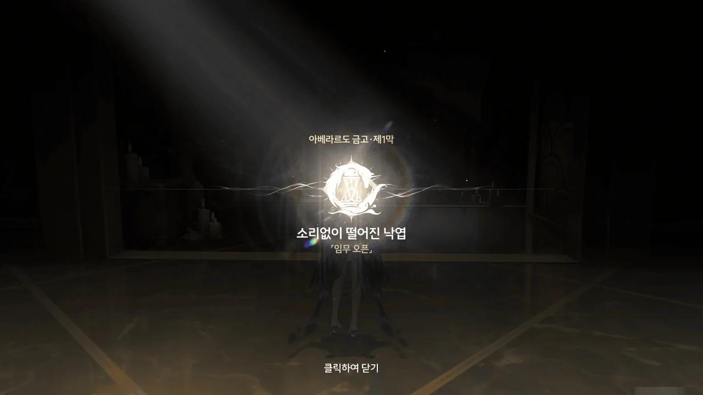
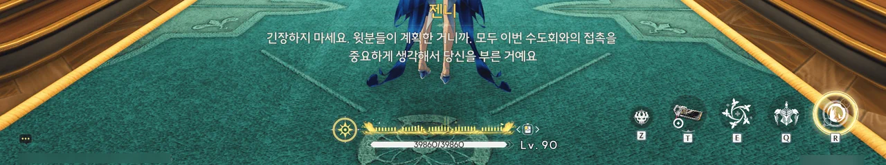
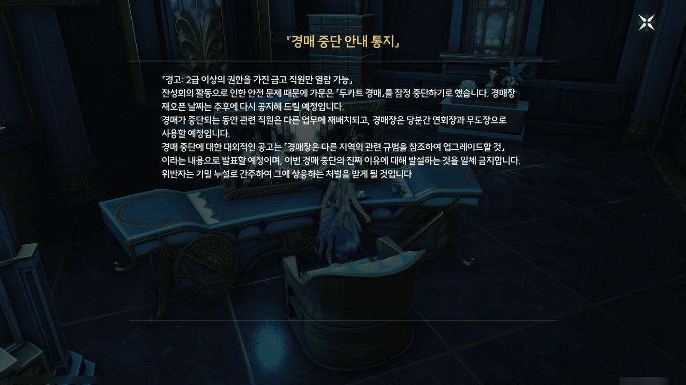



카를로타와 수도회에게서 동시에 편지가 왔다.
수도회가 아베라르도 금고에 「보물」 하나를 보관하려 하니, 중개인으로써 아베라르도 금고에 와달라는 내용이다.

방랑자가 몬텔리 가문의 카를로타와 꽤 친하게 지내고 있다는 걸 모르는 수도회가 아니다. 그런데도 수도회는 방랑자를 수도회와 몬텔리 가문의 중개인으로 선택했다.

수도회가 편지에 '리나시타가 승인한 중개인'이라 적은 걸 보면, 카니발에서 월계관을 쟁취한 사람은 리나시타에 있어 무시할 수 없는 영향력을 갖게 되는 모양이다. 카니발 우승자에게 월계관을 수여하는 게 다름 아닌 수호신이니, 나름 그럴듯하다.
그러고 보니, 펜리코가 방랑자를 머큐리 성당으로 초대한 것도 방랑자가 월계관을 얻은 후였지...

&nbsp;

그나저나 쿠로쿠로야... 또 번역을 엉망진창으로 했느냐...

'~니다'로 끝나는 문체(文體)는 듣는 이를 아주 높이는 '아주높임 격식체'인 '하십시오체/합쇼체'이다.
'~해요'로 끝나는 문체(文體)는 듣는 이를 높이는 '두루높임 비격식체'인 '해요체'이다.

두 문체 모두 듣는 이를 높이는 문체이기에 섞어 쓰는 게 완전히 불가능한 것은 아니다.
하지만 둘을 섞어 쓰는 건 매우 부자연스러운 일이다.

1. 아주높임 vs 두루높임
   듣는 이를 아주 높이는 '하십시오체'를 쓰다가 듣는 이를 그보다 덜 높이는 '해요체'를 쓴다는 건 아무리 봐도 비꼬는 목적으로밖에 보이지 않는다.
   뭐야, 롤러코스터야?
2. 격식체 vs 비격식체
   격식체가 주로 쓰이는 영역은 편지나 문서 같은 문어(文語) 영역이다.
   비격식체가 주로 쓰이는 영역은 말로 하는 구어(口語)이다.
   왜 서로 왔다 갔다 하는 건데?

진짜 보면 볼수록 답답해...









아베라르도 금고에 도착하니, 금고 직원들이 난데없는 퇴근 명령에 당황해하고 있다.
음, 카를로타가 말한 '함께 물건을 옮길 사람'이자 수도회가 말한 '몬텔리 가문 대리인'이 바로 젠니였던 건가?

몬텔리 가문이 방랑자에게 빚지는 일은 돈보다 귀하다라... 잘 모르겠는걸.



> **몬텔리 권한 부품 · Lv.1**
> ***
> 카를로타가 특별히 방랑자에게 부여한 권한 부품으로, 이것이 있으면 아베라르도 금고 내에서 자유롭게 이동할 수 있다.
> ***
> 「여기저기 다니면서 권한을 얻어야 하지만, 내가 얻을 수 있는 최고의 권한이야. 잘 부탁해.」
> 즉, 당신은 아베라르도 금고 내에서 그녀와 동등한 권한을 가지고 있다.
{.bq}

뭐... 뭔가 좀 부담스러운데요...



조수 임무에서 보았던, 절벽 끝에 위치한 아베라르도 금고 건물이 아베라르도 금고의 전부인 줄 알았는데, 그 밑 지하에도 공간이 더 있는 모양이다.

> **아베라르도 금고 · 에코 승강장**
> ***
> 아베라르도 은행은 고객의 소장품을 받은 후, 에코 열차를 이용해 소장품과 은행원을 아베라르도 금고 지하 승강장으로 옮긴다.
> 옮겨진 소장품들은 지하 승강장에서 2차 분리를 거쳐 부동한 보관 구역으로 다시 옮겨진다.
{.bq}



지하라고 해서 온통 돌로 된 풍경을 상상했는데, 엘리베이터 문이 열리자마자 보이는 나무를 보면 그런 건 아닌 모양이다.

\[소리 없이 떨어진 낙엽\] 임무 시작!



아까 금고 입구에서 보았던 퇴근 명령은 금고 내의 모든 직원에게 내려온 것이었나 보다.
다만 오늘 열릴 예정이었던 회의가 갑작스레 취소되고, 일부 직원은 퇴근이 아닌 해고 명령으로 오해하는 걸 보면, 이런 명령이 내려지는 건 매우 이례적인 일이고, 특히나 이번 경우에는 매우 급작스러웠던 모양이다.

대체 수도회가 맡기는 보물이 뭐길래 금고 내의 모든 직원을 다 퇴근시켜야 하는 거야?
금고의 모든 직원을 서둘러 퇴근시키는 걸 보면, 수도회가 금고에 물품을 맡겼다는 사실 자체부터가 이미 기밀에 속하는 게 아닐까 의심이 든다.



> 결론은 쉬라는 게 맞는 것 같은데, 일은 연기가 되지 않잖아.
> 그럼 못 한 부분은 집에 가져가서 해야 하는데, 그럼 이건...?

윽... 이게 바로 직장인의 비애라는 건가?



투어...? 외부 전시...?

일반적으로, 금고 내부에 보관된 물품을 외부에 전시하는 은행은 없다.
하지만 아베라르도 은행은 보안에 정말 자신이 있는 건지, 외부인에게 금고 내부를 구경할 수 있는 '금고 투어'를 제공하거나 비정기적으로 금고 소장품을 외부에 공개 전시한다.

물론 외부에 공개해도 되는 물건만 투어에서 보여주거나 공개 전시하겠지만, 은행이 고객이 맡긴 물건을 그렇게 다뤄도 되는 건지...

















수도회의 대표로 온 건 다름 아닌 페비였다. 원래 다른 사람이 오기로 되어 있었지만, 다른 사정이 있어 페비가 대신 오게 되었다고 한다.
에코를 좋아하는 페비답게, 열차 에코가 외로워할까 봐 같이 이야기하고 있었다.

이게 수도회가 말한 그 「보물」인가 보다.
가짜 「보물」을 호송하는 호송대를 여럿 배치한 걸 보면 저 꺼림칙하게 생긴 물건이 수도회에게 있어 정말 중요한 물건인 것 같다.



꽤 익숙한 방식의 조종 방법이다.
열차는 정해진 경로를 따라 움직이고, 방랑자가 갖고 있는 권한 장치를 궤도 변경 장치나 보안 장치 등에 대고 사격하면 해당 장치의 상태를 변경할 수 있다.

하프라이프/블랙 메사의 '레일 위에서(On A Rail)' 챕터에서 많이 본 방식이네. 거기서도 시간 내에 스위치를 쏘지 않으면 한 자리에서 계속 빙빙 돌도록 트랙이 짜여 있었는데 말이다.



에코 열차라서 그런가, 페비 말처럼 가파른 경사에서도 속도의 변함없이 매끄럽게 움직인다.





열차에서 내려 금고에 들어가려던 찰나, 갑자기 금고에 경보가 울리더니 금고문이 닫히고 경비 에코가 눈앞에 나타난다.

설마 또 수도회나 잔성회가 수작을 부린 거야? 저번 조수 임무 때에도 아베라르도 금고에 문제가 생겨 이성 무장과 한판 해야 했잖아.









앞서 예측한 대로, 금고 직원들이 서둘러 퇴근한 건 은행 상부에서 수도회의 「보물」에 대해 최상급 운송 옵션을 적용했기 때문이었다.

그런데 그 상황에서 누군가가 은행 금고 안에서 무언가를 건드려 안전 모드가 강제로 작동되었고, 그 바람에 금고 외부와 완벽히 격리되고 말았다.
이동 통로가 차단되었기에 밖으로 나갈 수 없고, 통신 채널이 막혔기 때문에 외부에 도움을 요청할 수도 없다.

이 상황을 타개하기 위해선 카를로타가 방랑자에게 준 권한을 안전 통제실에서 사용해야 한다.





카를로타의 「주얼리 세트」와 사용 방법이 동일하다.
장치를 쏘면 나에게 유리한 방향으로 장치가 조정된다.









안내 에코가 있긴 한데, 고장 났다. 자꾸 했던 말을 반복하네.

안내 에코의 말에 따르면 아베라르도 금고를 탈출하기 위해선 비상탈출 증명서를 제출한 후 에코 열차를 타야 한다.
이 구역의 비상탈출 증명서를 발급하는 곳은 이보다 더 깊숙한 곳에 있는 안전 통제실이다. 역설적이게도, 금고에서 탈출하기 위해선 더 깊숙한 곳으로 들어가야 한다는 말이다.
그런데 거기에 가려면 에코 열차를 타야 한다. 비상탈출 증명서를 발급받기 위해선 에코 열차를 타야 하는데 에코 열차를 타려면 비상탈출 증명서가 필요하다.

> 그냥 제가 열차를 가지고 탈출할게요.

음... 그러면 Grand Theft Train이 되는 건가?









이를 보다 못한 페비가 안내 에코가 머리가 아픈 것 같으니 한 대 때려서 도와주겠다고 한다. 깡!
그리고 놀랍게도 페비의 '깡!'은 효과가 있었다.

최고 등급 안전 모드가 발효된 상황이지만 현재 구역의 안전 모듈의 상태가 정상이 아니기 때문에 다음 구역으로 가는 에코 열차에 임시 접근 권한을 부여받았다.

에코가 고장 난 기계도 아니고 때려서 고쳐졌다는 사실에 젠니가 적잖게 당황했다.



자가 진단이 실패한 것도 아니고 거부되었다는 말로 보아, 이 안내 에코는 아직 완벽히 고쳐진 게 아닌 모양이다.

페비가 몇 대 더 때려 보면 완전히 고쳐질 지도...?



젠니가 선호하는 근무 환경은 사람들과 접촉할 일이 없이 그저 일만 하면 되는 환경으로 보인다.
인간관계가 귀찮긴 해...









금고의 안전을 위해 각 안전 통제실은 해당 구역의 전체적인 상황과 다음 구역의 대략적인 상황만 기록한다. 그러니 금고에서 나가기 위해선 각 구역의 안전 통제실을 매번 들러서 권한을 업그레이드해야만 한다.







감시 카메라를 확인하던 중, 금고의 숨겨진 안전 모듈이 '애쉬'라는 사람에 의해 도난당했다는 사실을 발견했다.

아베라르도 금고가 건설될 때 금고 대부분의 안전시설을 만드는 데 도움을 준 사람의 이름이 '애쉬'이긴 했지만, 그 사람은 이미 죽은 지 오래라고 한다.

감시 카메라에 잡힌 저 사람이 설마 '애쉬'인가? 그 '애쉬'의 유령이던, 그 신분을 도용한 도둑이던...







아베라르도 금고가 최고 등급 안전 모드에 돌입한 것은 저 '애쉬'라는 사람이 진열대에 있는 안전 모듈을 가져갔기 때문이다.

대체 그런 중요한 부품을 왜 진열대에 올려둔 건지 잘 이해가 되지 않지만, 안전시설을 만든 '애쉬'에게 어떤 깊은 뜻이 있었을 것이라고 생각할 수밖에...







오, 이건 조금 재미있다. 경비 에코에게 권한 장치를 쏘면 '너, 내 편이 되어라!'를 시전 할 수 있다.
하지만 경비 에코가 아군이 되었다고 갑자기 강해지는 것은 아니기에, 그냥 뛰어 내려서 한번에 휩쓸어버리는 게 더 빠르다.





젠니의 "몬텔리 사람들도 그렇게 생각하기 때문에 가려둔 거예요"라는 대답이 너무나도 신경 쓰인다.
그래서 굳이 말을 한번 더 걸어 두 선택지 모두를 확인해 보았다. 젠니의 대답은 양쪽 모두 동일했다.

그럼 대체 왜 가려둔 건데?



공짜 별소리는 언제나 환영이다.
와! 별소리 20개! 이런 상자를 7개만 더 까면 가챠 한 번을 돌릴 수 있겠어!

... 이렇게 적으니까 갑자기 뭔가 좀 슬퍼지는데.











오래전에 죽은 사람이 지금 살아서 돌아다닐 리 없으니, 안전 모듈을 건드려 금고를 안전 모드에 빠트린 건 분명 '애쉬'의 신분을 도용한 사람일 것이다.

진열대에서 물건을 누가 가져갔는지 확인할 수 있었던 건 지금껏 아베라르도 금고에 침입해 물건을 훔쳐가려 한 간 큰 도둑들 때문이라고 한다.
젠니가 "자신의 지루한 인생에서 벗어나기 위해"라고 말한 걸 보면, 사원증 하나만 훔치면 만사형통일 것이란 안일한 마음으로 금고에 침입한 도둑들은 전부 그 목숨을 잃은 모양이다.

아베라르도 금고에 도둑들이 꼬이게 된 건 아베라르도 금고 가장 깊숙한 곳에 라군나 전체에서 가장 귀한 보물인 「비장」이 보관되어 있다는 풍문 때문이라고 한다.
「비장」의 존재를 긍정하는 건 그냥 미친 짓이고, 그 존재를 부정해도 사람들이 전혀 믿지 않으니, 금고 직원들 입장에선 환장할 지경일 거다.



채소를 절대 먹지 않는 장인이 살고 있는, 동쪽에서 온 신비로운 족자...?

중국 쪽 설화에서 육식주의자 선인이 있었던가?



ㅋㅋㅋㅋㅋㅋ 「비명이 일어나기 전의 공기」 ㅋㅋㅋㅋㅋㅋ

아니, 상식적으로 수도회가 그런 걸 갖고 있을 리가 없잖아... 이건 그냥 수도회가 몬텔리 가문을 엿먹이기 위해 적당히 둘러댄 것이다.













「별하늘의 서사곡」이라는, 양 떼와 초원을 모티브로 한 풍경화는 두꺼운 천으로 가려져 있다.

양치기의 옷에 그려진 무늬는 깊은 바다 수도회의 문양을 거꾸로 뒤집어 놓은 것처럼 보이고, 하늘에 그려진 별의 개수는 임페라토르가 세상에 준 은사의 수와 같다. 양 떼의 숫자 역시 성전에 나오는 임페라토르의 날개 수와 같고.

그래서 이 그림은 일부 극단주의자의 주장처럼, '수호신의 뜻은 모두 인간이 날조한 것'이라는 의미로 보이기 충분하기에, 가려둔 것이라고 한다.



... 가톨릭에 '악마의 대변인'이라는 직책이 괜히 있는 게 아니다.















아까 감시 카메라에 잡혔던 여성의 이름은 '애쉬'가 아닌 '리비'였다.

특수하게 제조되어 위조가 불가능한 그녀의 사원증에는 그녀의 이름이 리비가 맞으며 기밀 연구원 소속 연구원이라고 적혀 있었다.
그런데 왜 기밀 연구원이 안전 통제실에 있는 거지?

혹시 모르니, 리비와 함께 동행하기로 했다.







감시 카메라를 확인하자, 또 다른 남성이 경비 에코 몰래 어디론가 향하는 모습이 잡혔다. 네가 그 '애쉬'구나?







리비에게 애쉬에 대해 묻자, 이미 죽고 없는 노인 애쉬에 대한 이야기를 해준다.

기밀 연구원의 연구원들은 20년 동안 이 금고를 떠난 적이 없다고 하는데... 그러면 저 '애쉬'는 대체 어떻게 애쉬의 사원증을 들고 들어온 거지?



권한 부품을 Lv.2로 업그레이드했다.

플레이버 텍스트는 변함이 없네.

잔성회의 활동량 증가로 인해 「두카트 경매」를 잠정 중단하지만, 외부에는 '다른 지역의 관련 규범을 참조하여 경매장을 업그레이드하는 중'이라는 핑계를 대라는 내부 문서를 발견했다.

잔성회 때문이라는 사실을 숨기는 건 수도회가 잔성회와 결탁했기 때문인가?
