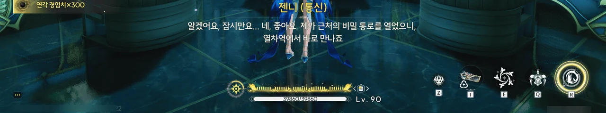
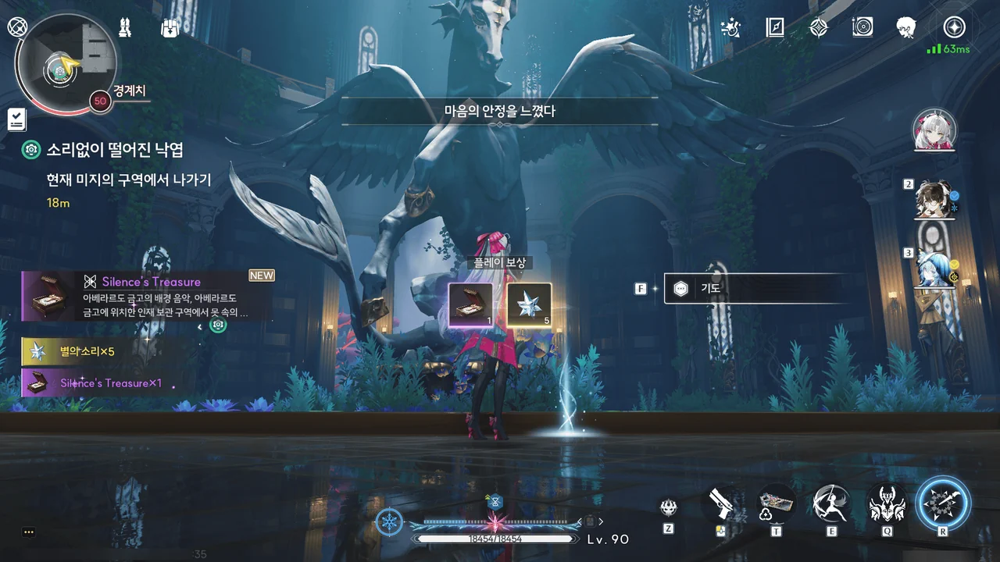
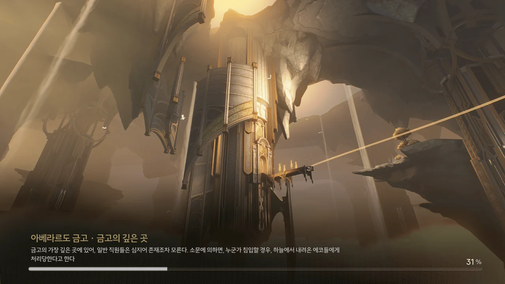



'깡!'의 힘은 정말 대단했다!

아까 젠니의 반응을 볼 때, 에코를 때려서 고친다는 게 정상적인 접근 방법은 아닌 것 같지만...











처음 금고에 들어왔을 때 안전 모드가 활성화된 걸 보고 조수 임무에서 비슷한 이유로 이성 무장과 한 판 했던 걸 떠올렸었는데, 정말로 이성 무장이 나타났다.

뭐야, 'DID YOU MISS ME?'인 거야? 이런 귀찮은 녀석은 질색인데!





다음 구역에 도착해 보니, 풀려난 에코 둘이 서로 신나게 싸우고 있다.

잘 먹었습니다.















어느 책에서 찢어낸 종이에 쓰인 편지에는 이미 죽고 없는 애쉬가 손자에게 보내는 전갈이 적혀 있었다.
애쉬의 손자는 할아버지가 보낸 편지에 적힌 "우리가 소중히 여기는 보물"이 향간에서 떠도는 「비장」일 것이라 생각했고, 그 진상을 확인하기 위해 이 일을 벌인 모양이다.

애쉬가 찢어낸 책의 정체도 비범한데, 그 책은 평범한 책이 아니라 책의 모습을 한 에코라고 한다.
에코가 마음을 연 상대만이 그 책의 내용을 이해할 수 있으며, 애쉬 역시 생전에 그 에코가 알려준 정보를 바탕으로 아베라르도 금고 전용 암호 자물쇠를 만들었다고 한다.

하지만 애쉬는 손자에게 보낼 편지지를 얻기 위해 그 책의 페이지를 찢어내었고, 그 벌로 화장실을 청소하는 벌을 받았다고 한다.
그거... 분명 책 에코도 싫어했을 거 같은데.











서둘러 '애쉬'를 잡아야 하지만, '애쉬'가 계속 뽈뽈뽈 돌아다니며 온갖 안전장치를 활성화시키는 탓에 '애쉬'에게 다가가기가 어렵다.

하지만 발상을 조금 달리 해보면, 방랑자 일행이나 '애쉬' 모두 이 금고에서 탈출하기 위해선 에코 열차 승강장을 이용해야 한다.
그러니 한걸음 먼저 나아가 에코 열차 승강장에서 '애쉬'가 오길 기다리면 '애쉬'를 잡을 수 있을 것이다.









여기 안전장치는 굉장히 독특하다. 안전장치가 활성화되면 문이 잠기고 바닥이 그대로 180도 뒤집힌다.
그러니까 저 체커 무늬 바닥이 있는 방과 전시품이 놓여 있는 방이 동일한 방이라는 거다.

바닥을 그렇게 휙휙 뒤집으면 진열대 안에 놓여 있는 물건이 마구잡이로 흩어지거나 유리를 깨고 진열대 바깥으로 쏟아질 것 같은데...









젠니가 에코들이 다치지 않게 조심해 달라고 하는데... 그게 쉽겠냐!















쉴 새 없이 밀려오는 에코를 보다 못한 페비가 나서서 에코들의 머리를 지팡이로 내리찍었다. 깡!















> | | |
> |:--|:--|
> | 페비 | 적당한 물리적 충격은 마음을 비우고 생각을 멈추게 하거든. 정화의 힘을 발휘하는 데도 도움이 돼. |
> | 젠니 | 하하 농담도 참. |
> | 페비 | ??? 농담 아닌데? |
> {_borderless=true,_thead=false}

ㅋㅋㅋㅋㅋㅋ...

페비 입장에서는 정말로 남들에게 도움을 주고자 '깡!'을 한다는 게 뭔가 두렵고 귀여워...



명조 세계관에서 만물이 주파수로 통한다는 건 이미 알고 있지만, 마치 생물의 유전자를 다루듯이 잔상의 주파수에서 비정상적인 체질을 유발하는 주파수를 뽑아낸다는 게 낯설게만 느껴진다.





하핫! 드디어 처음으로 '애쉬'에게 엿을 먹여보는구나!

'애쉬'가 여태 하던 것처럼 안전장치가 발동되든 말든 아랑곳 않고 앞으로 나아가다, 문이 잠겨 더 이상 나아가지 못하게 되자 황급하게 뒤로 돌아 어디론가 도망간다.



권한 부품을 Lv.3으로 업그레이드했다. 플레이버 텍스트는 여전하다.

부품을 업그레이드할수록 아이템 등급이 높아지고 있네.
가장 높은 아이템 등급이 황금색이니, 권한 부품을 업그레이드할 일은 더 없지 않을까?









'애쉬'를 아주 간발의 차로 놓치고 말았다.
하지만 다음 정거장이 마지막 정거장이니, 거기서 잡으면 될 것이다.

다만 이 너머에 무엇이 있는지는 젠니도 잘 모른다.
젠니가 받은 직원 교육에서 언급된 가장 깊은 에코 열차 정거장은 지금 방랑자 일행이 위치한 '에코 보관 구역'이었고, 그 너머에 뭐가 있는지에 대해서는 가문 내에서도 극비로 취급되었기 때문이다.
저 너머에 대해 무언가 알고 있을 법한 리비 역시 그 안에 아주 위험한 것이 있다는 것만 기억할 뿐, 정확한 내용을 기억하지 못하고 있다.

뭐, 앞으로 가보면 알 수 있겠지.





이성 무장의 공격이 점점 과격해지고 있다. 이제는 에코 열차 선로를 끊어버리기까지 하네.





결국 끊어진 선로로 향한 에코 열차가 선로를 벗어나 그대로 바닥으로 추락하고 말았다.

에코 열차를 포함해 심각한 부상을 입은 사람은 없었지만, 에코 열차가 탈선한 관계로 더 이상 선로를 따라 나아갈 수 없게 되었다.













기억을 어느 정도 되찾은 리비의 말에 따르면, 학자 여럿이 여기에 아주 오랫동안 살아왔다고 한다.

리비가 분명... 아베라르도 금고의 기밀 연구원 소속 연구원이었지? 그러면 아베라르도 금고 가장 깊숙한 곳에 기밀 연구원이라는 부서가 여태껏 존재해 왔다는 말이 된다. 그리고 거기 연구원들은 금고 밖으로 나가는 일 없이 계속 거기서 살아왔다는 거고.

... 금고에 사람도 보관할 수 있는 줄은 몰랐는 걸.



희끄무레한 잔향이 방랑자 일행을 안내하듯 나타났다.



역행자? 그게 대체 뭐지?

리비와 애쉬를 비롯해 수도회로부터 「역행자」로 분류된 사람들은 '역사에서 지워졌다'.
해당 표현의 일반적인 뜻을 생각해 보면, 아마 그 사람들은 아베라르도 금고 가장 깊숙한 곳에 옮겨져 죽을 때까지, 그리고 죽은 후에도 금고 밖으로 나가지 못하게 되었을 거다.







누군가의 일기장에는 '푸른 잎이 붉게 물들면 모든 게 다 잘될 겁니다'라고 적혀 있었다.

앞으로 있을 퍼즐에 대한 힌트인 건가?



앞으로 나아가면 나아갈수록 잔향이 점점 더 늙어가는 것 같다.
맨 처음 보았던 잔향의 연령대는 청소년기로 보였다. 아까 전 잔향은 청년기로 보였고. 그리고 이제는 노년기의 잔향이 보이네.



누군가의 원고가 테이블 위에 놓여있다. 봐도 무엇을 은유하는 것인지 잘 모르겠지만...













여기 갇힌 건 연구원뿐만이 아니었던 모양이다. 예술가를 연구원으로 삼을 리는 없잖아?

애쉬의 잔향이 한 "가족들에게 편지를 전해줄 수 있다"는 말과 '애쉬'가 갖고 들어온 책 에코의 찢어진 페이지-편지를 볼 때, 애쉬가 책 에코의 페이지를 찢어 편지를 썼고, 그 편지를 몬텔리 가문이 '애쉬'에게 전해준 듯하다.

이전에 리비가 말한, 애쉬가 에코의 습성을 파악하기 위해 에코 옆에서 잠을 잤다고 하는 이야기가 바로 이건가 보다. 세상에, 무려 7박 8일 동안 에코랑 함께 지냈다고?

> 젠니, 도대체 수도회에 대해 얼마나 오해하고 있는 거야!

이걸 보니 젠니가 처음 페비를 만났을 때가 떠오르네.
평소 성당에 잘 나가지 않던 젠니가 페비를 처음 만났을 때 의례적인 말로 "존경하는 성직자님"이라고 했다가 젠니를 처음 본다는 페비의 천연스러운 대답에 몹시 당황해했었는데 말이다.

이번엔 "임페라토르님이 진짜 여기 오신다 해도 안돼"라는 불경한 말을 내뱉은 잔향도 수도회 사면원에서 재판을 받는 거냐고 묻는다.

하지만... 수도회가 여태껏 한 악행들을 보면 과거의 메아리에 불과한 잔향이라도 눈 깜짝 않고 사면원에 세워서 '우인' 딱지를 단 다음 순례선에 태울 것 같은 걸...

그런데 페비가 갖고 있던 수도회의 「보물」이 대체 왜 깜빡거리는 거지?
보통 뭔가가 깜빡거린다는 건 폭탄 타이머가 돌아간다는 뜻이잖아.







여기 리비의 잔향도 남아 있다.

여태껏 보아온 잔향의 원주인은 대부분 이미 죽고 없는 사람이다. 그래서 리비 역시 이미 죽은 게 아닐까 생각이 드는데...
하지만 딱 하나 예외가 있다. 바로 수도회 수좌, 펜리코이다. 그는 분명 살아있는 사람이지만, 머큐리 성당에 자신의 잔향을 남겼다.

그래서 확실치가 않네...

임페라토르의 조각상 앞에서 기도를 하면 '마음의 안정을 느꼈다'라고 하는데... 이게 대체 무슨 효과인 걸까?

어쩌면 체력을 회복하는 효과가 있는 걸지도 모른다.
금주성 병정산 꼭대기에 의자가 하나 있는데, 거기 앉으면 체력을 전부 회복시켜 주거든...
어쩌면 이것 역시 같은 효과일지도?



여기 갇힌 모든 사람들이 이 일을 납득하고 받아들인 건 아닌 모양이다.









리비가 했던 말처럼, 에코가 마음을 연 페비만이 에코 책에 적힌 비밀번호를 읽을 수 있었다.

0622가 날짜를 뜻한다는 걸 보면, '진리를 고집하던 한 사람'이 수도회의 *심판*을 받은 날짜가 바로 6월 22일이었던 모양이다.
과연 그 심판의 정확한 내용은 무엇이었을까? 그냥 단순하게 순례선에 태워 추방했을 것 같지는 않은데...



아니, 근데 인간적으로 이건 그냥 키패드를 누르는 방식으로 해주면 안 될까?
무슨 콤비네이션 자물쇠도 아니고 매번 이렇게 마우스로 하나하나 번호를 돌려가며 해야 하는 건 너무 불편해...
제발 키보드 키패드를 쓸 수 있게 해 줘!





본래라면 3급 권한이 없는 직원이나 방문객이 이 구역에 와서는 안된다. 하지만 간혹 고장 난 에코 열차가 권한 없는 사람을 여기에 데려오는 경우가 있었다고 한다.

3급 권한이 없으면 보관 구역에 들어갈 수 없기 때문에 이 구역에 무엇이 있는지 외부에 노출되는 일은 없었지만, 자칫하다간 이 구역이 세간에 퍼진 「비장」과 관련한 곳이라는 소문이 퍼질 수 있기에 은행에서는 이런 유형의 고장에 대한 적절한 대응 방법을 고민하고 있었다.

그러다 직원 중 누군가가 '고장 난 에코 열차를 타면 다시는 돌아오지 못할 곳으로 가게 된다'라는 헛소문을 퍼트려, 열차 이상을 감지한 에코 열차 탑승자가 이를 최대한 빨리 은행 직원에게 보고할 수 있도록 하는 게 어떻겠냐는 제안을 했고, 그 제안은 받아들여져 금고 투어 전단지에 고장 난 에코 열차와 관련한 소문이 실리게 되었다.

꽤 좋은 방법이다. 무언가를 무작정 숨기는 것보다, 거짓 정보를 통해 생각의 방향을 제한하여 진실에 도달하지 못하도록 하는 게 더 효과적이니까.





좋아, 아베라르도 금고의 가장 깊은 곳에 도착했다.

> **아베라르도 금고 · 금고의 깊은 곳**
> ***
> 금고의 가장 깊은 곳에 있어, 일반 직원들은 심지어 존재조차 모른다.
> 소문에 의하면, 누군가 침입할 경우, 하늘에서 내려온 에코들에게 처리당한다고 한다.
{.bq}





> 쳇, 민폐만 끼치는 바보 도둑이군요.

젠니의 말에 100% 동감한다. 저 멍청이가 기어이 이성 무장을 깨워버렸잖아?



물론 그게 방랑자가 이성 무장을 처리하지 못한다는 의미는 아니다.







> 그때 너희는 내 할아버지를 잡아갔어. 지금은 또 어쩌려고, 이제는 나까지 여기에 가둘 생각인가?

차라리 그랬으면 좋겠다만. 이 트롤 하나 때문에 내가 얼마나 고생했는데.

















모든 기억을 되찾은 리비가 밝힌 이곳의 진실은 '애쉬'의 주장과는 달랐다.

여기에 갇힌, 애쉬와 리비를 비롯한 사람들은 본래 각자의 분야에서 선조들의 흔적을 밝혀내던 사람들이었다.
하지만 그 과정에서 그들은 수도회의 불명예스러운 역사를 알게 되었고, 이를 눈치챈 수도회는 자신들의 과거를 알게 된 연구자들과 예술가들을 규범이라는 명목 하에 닥치는 대로 체포한 후, 연구와 창작의 권리를 영구적으로 박탈했다.

이를 알게 된 몬텔리 가문은 지하에 형식적인 감옥을 지은 후, 수도회를 돕는다는 명목으로 수도회에게서 연구자들과 예술가들을 넘겨받아 감옥 안에 살도록 했다.
이들은 연구와 창작의 권리를 박탈당하는 대신 아베라르도 금고 지하 감옥에 갇힌 것이었기에, 감옥 안에서 연구와 창작 활동을 계속할 수는 있어도 금고 밖으로 다시는 나갈 수 없게 되었다.

리비가 기억을 잃은 건 바로 리비가 과거의 메아리, 잔향이었기 때문이다.
진짜 리비는 애쉬와 마찬가지로 이미 죽고 없는 사람이고.

리비는 '애쉬'에게 애쉬의 뜻을 전해준 후, 기회가 된다면 「비장」에 가보라는 말을 남겼다.
그 후, 페비가 들고 있던 수도회의 「보물」에서 뿜어져 나온 빛을 타고 이곳에 남은 다른 잔향들과 함께 하늘로 사라졌다.







'애쉬' 덕분에 아베라르도 금고 가장 깊은 곳에서 무슨 일이 일어났는지 알게 된 건 좋지만, 그의 행동이 아베라르도 은행에 적지 않은 손해를 끼쳤다는 사실을 덮지는 못한다.
뭐, 그건 젠니와 몬텔리 가문이 '애쉬'와 적당히 해결할 문제다. 방랑자는 카를로타가 준비한 보수만 받으면 된다고.

페비가 갖고 있던 수도회의 「보물」은 젠니가 대신 맡아 보관하기로 했다.
저게 정말 보물이 맞긴 한 건지에 대해서는 차치하고...







지하에서 솟아오른 빛과 함께 아베라르도 금고의 '날개'가 펼쳐진다.
완전히 날개를 편 아베라르도 금고에서 빛이 쏟아져 나와 금고 앞 섬을 향해 떨어진다.

\[소리 없이 떨어진 낙엽\] 임무 끝!









빛이 떨어진 섬에 가보자, 젠니와 '애쉬'가 함께 서있다. '애쉬'가 은행에 끼친 손해에 대해서는 이미 이야기를 다 마쳤나 보네?

애쉬와 관련한 모든 자료를 조사한 결과, 정말로 「비장」이 존재함을 확인했다고 한다.
그 단서 중 하나는 이전에 발견한 문구, 「푸른 잎이 붉게 변한 곳」이라고 한다.

당시 아베라르도 금고 지하 감옥으로 이송되던 사람들은 금고 상층부에서 조사를 받은 후 엘리베이터를 타고 지하로 내려갔다고 한다.
그들이 마지막으로 본 지상의 경치는 이 섬의 나무가 유일했기에, 이 나무에 무언가가 있을 것이란 결론을 내렸다고 한다.

푸른 잎이 붉게 변하려면... 해가 질 때를 말하는 걸까? 아직 확인해보지는 않았다.

아, 그리고 아니나 다를까, 수도회가 금고에 보관하려 했던 「보물」은 사실 잔향에 반응해 폭발하는 폭탄이었다고 한다.
그러니까 페비 품 속에서 깜빡깜빡거리던 게 정말로 폭탄 타이머가 돌아가고 있었다는 거다.

이 미친놈들.





페비 역시 이 섬에 와있었다.

'역행자'들의 영혼은 충분히 강해 인도가 필요 없지만, 페비는 그들이 떠나가는 걸 가만히 지켜보고 싶었다고 한다.



카를로타 역시 금고 지하에서 있었던 일을 전해 들었고, 방랑자를 위한 '선물'과 「숨겨진 스테이지」를 남겨두었다는 쪽지를 남겼다.



> **고요한 상자**
> ***
> 수도회가 몬텔리 가문을 모함하는 데 쓰였던 폭탄이었지만, 영혼을 치유하는 페비의 힘에 의해 「사람을 구하는」 도구가 되었다.
> ***
> 그 속에는 약간의 성스러운 기운이 남아 있으며, 마치 누군가 남긴 작은 한숨 같다.
{.bq}



동굴 밑에는 120 레벨 필드 보스가 있었는데... 설마 이게 카를로타가 준비한 선물은 아니겠지.
