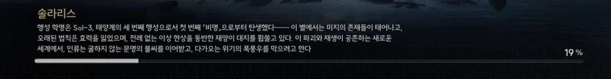
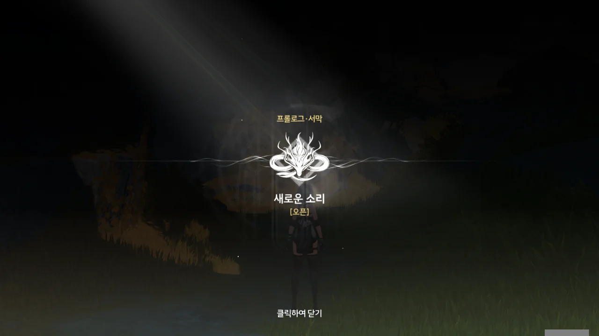
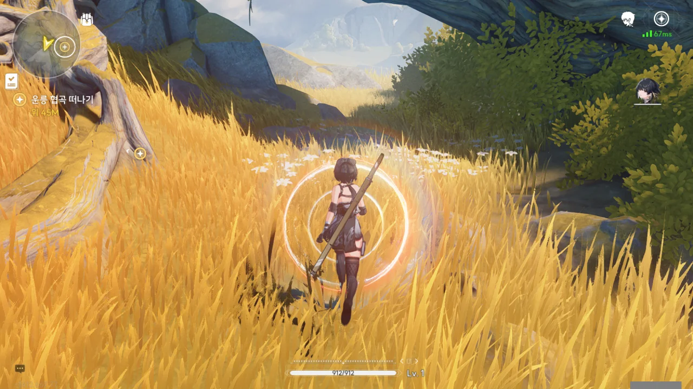
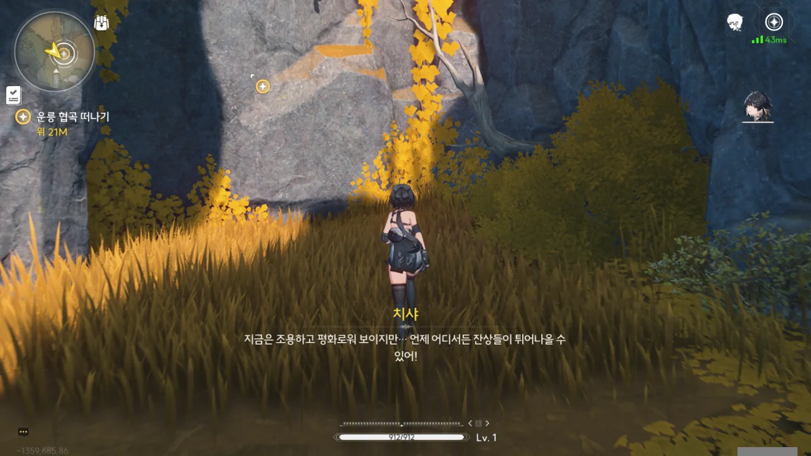
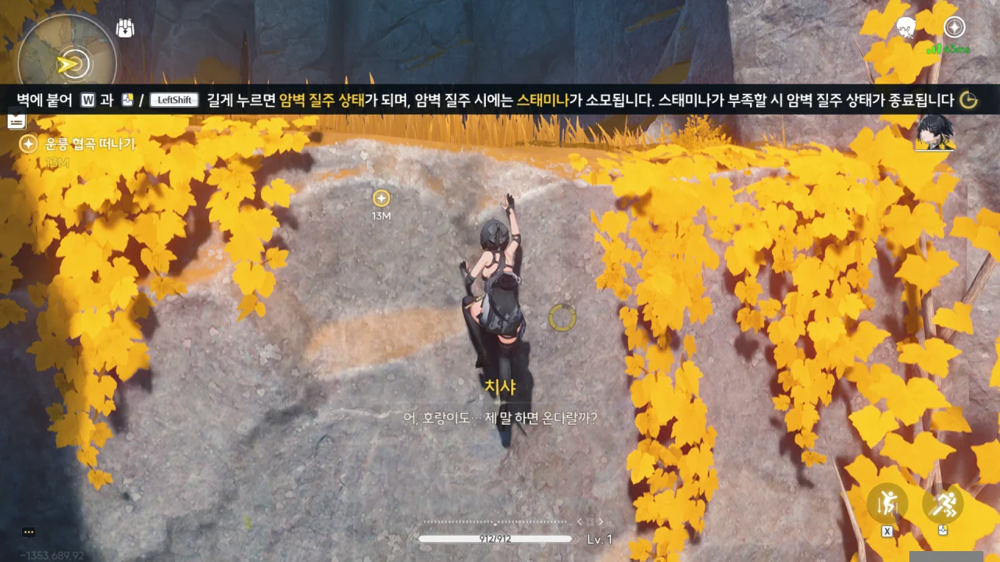
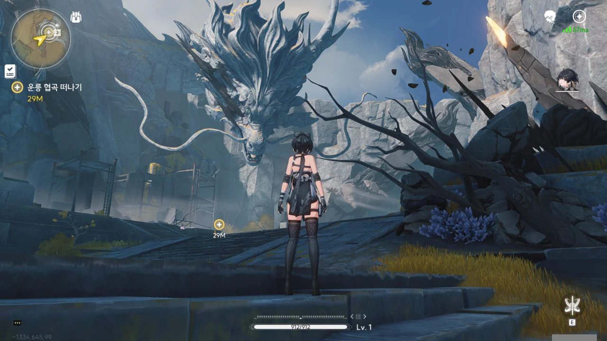
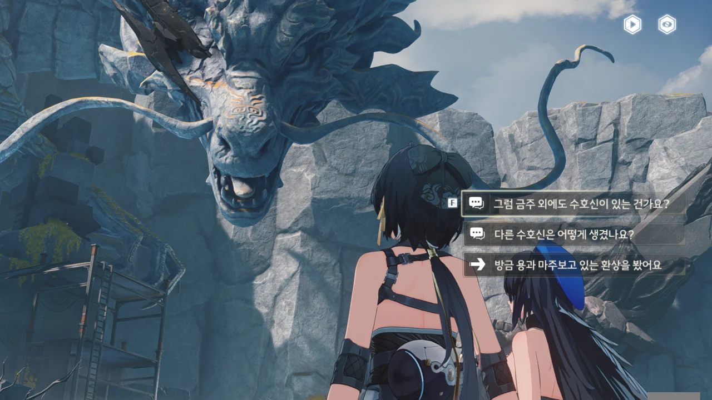
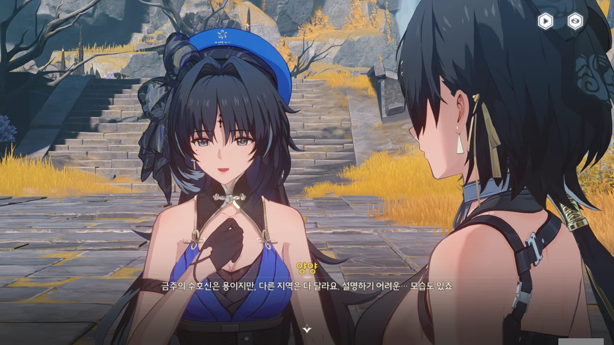
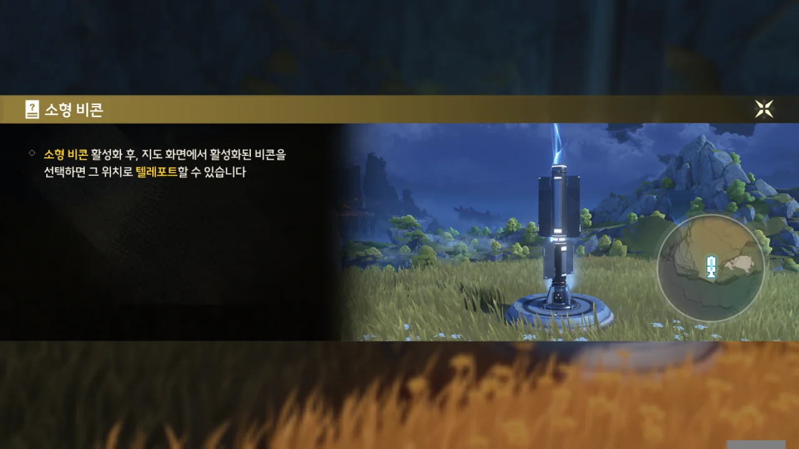
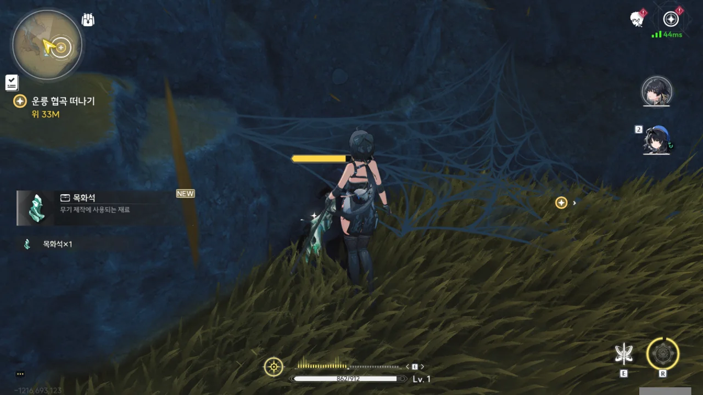

5월 23일 오전 11시, 드디어 명조가 오픈했다.

[예전](https://tetralog.onrender.com/b/game/tower-of-fantasy/quite-good-game)에 원신을 접은 후, 원신을 대체할 게임을 찾아 나선 적이 있다. 그때 '이거 좀 괜찮은데?'라고 생각했던 게임이 바로 '타워 오브 판타지'와 '명조: 워더링 웨이브'였다.

당시 명조는 베타 테스트조차 거치지 않은, 말 그대로 '개발 중인 게임'이었기에, 당장 할 게임이 필요했던 나는 정식 오픈 후 서비스 중인 '타워 오브 판타지'로 발걸음을 향했다.

타워 오브 판타지에 흥미가 떨어진 차에 --- 여기에 대해선 나중에 말할 기회가 있을 것이다 ---, 명조가 5월 23일 오픈할 거라는 이야기를 듣자, 난 일말의 고민조차 하지 않고 곧바로 명조 사전 예약을 신청했다.

다만 스크린샷 촬영 프로그램인 ShareX의 단축키 설정 문제로 23일에는 게임을 켜지 못했다. AutoHotkey와 마우스 키 변경을 통해 어찌어찌 해결하긴 했지만...



> `OS_Windows_Product_1.0.0_1474282_1.0.15_1606058`
{.bq}

1.0.0이라는 이 파릇파릇한 버전 넘버를 보라. 정말 가슴이 웅장해진다.

주인공 캐릭터의 성별은 당연히 여자를 골랐다. 남자 캐릭터를 골랐다가 두고두고 후회하는 건 원신으로 이미 충분하다.

명조의 배경은 지구가 아니라 '솔라리스'라는 외계 행성이다. 'Sol-3', '태양계', '세 번째 행성'이라는 단어로 미루어보아, '정말 공교롭게도 지구와 같은 환경을 지닌, 지구의 인류와 관계없는 행성'이라는 설정인 것 같다.

개발사의 전작, '퍼니싱 그레이 레이븐'은 명조와 같은 우주관을 공유하지만 지구가 배경이다.

***



의식이 없는 듯, 눈을 감은 채 둥둥 떠있는 저 검은 머리는 아까 시작 화면에서 보았듯이, 주인공 캐릭터임이 확실하다. 그런데 저 하얀 머리는 대체 누굴까? 우주 공간에서 멀쩡히 떠있는 걸 보면, 뭔가 신적인 능력을 가졌거나, 그런 존재인 것 같다.





흰머리의 여자는 잠시 주인공과 이마를 맞대나 싶더니, 주인공의 가슴팍에 손을 꽂아 넣는다.

주인공의 가슴팍에 나타난 문양은 「성흔」이라 불리는데, 이걸 통해 「공명 어빌리티」라는 능력을 발휘할 수 있다고 한다.

그러면 주인공의 성흔은 가슴에 위치하게 되는 건가?



어라? 그런데 이번엔 맞잡은 오른손에도 성흔이 생긴다.

뭐지? 주인공은 성흔이 여러 개인 거야?



여전히 미동조차 하지 않는 주인공을 보며 싱긋 웃음 짓는 정체불명의 흰머리 여자.





그러더니 갑자기 주인공을 확 밀쳐버리고, 자기 혼자 다른 공간으로 떠나버린다.

그러면서도 시종일관 입가에 웃음이 떠나지 않는 걸 보아하니, 이게 그 말로만 듣던 '사이코패스'인가 뭔가 하는 그건가 보다.





조금 전까지만 해도 우주 공간 같은 곳에 있던 주인공은 이제 마치 차원 이동이라도 하는 것처럼 알 수 없는 공간 속으로 떨어진다.

아니, 이게 대체 무슨 일이야?





끝을 모르고 추락하던 주인공은 물 같은 곳에 풍덩 하고 빠졌다. 그 충격 덕분에 정신을 차린 걸까, 얼굴을 찡그린 채 깨어난 주인공은 앞에 보이는 빛을 향해 무작정 헤엄쳐 가다 거품 같은 것을 마주치게 된다.



거품에 들어가자, 수면 밖으로 나올 수 있었다.

그런데... 여긴 왜 위아래가 뒤집어져 있냐? 설마 뒤집어진 건 나야?



어느새 또 정신을 잃은 걸까? 다시 눈을 떠보니 누군가의 말소리가 들린다.

익수? 설마 물에 빠졌다는 뜻인 溺水인 건가? 아까 주인공이 거꾸로 뒤집힌 물에 빠졌었는데, 그걸 이야기하는 건가 보다.

목소리의 주인은 주인공의 심장이 빨리 뛰지 않는 게 이상하다고 말한다. 하지만 일반인의 분당 심박수가 60-100 BPM인데 반해, 운동 때문에 심장이 발달해 한번에 보내는 피의 양이 많아진 운동선수들은 분당 심박수가 40 BPM까지도 떨어진다고 한다. 게다가 특별한 병이 없는 한, 심박수가 낮은 게 더 건강에 좋다고 여겨지기도 한다.

주인공은 딱히 운동을 한 것 같지 않아 보이니, 이상하다면 이상하다 할 수도 있겠네.



파란 옷의 여자와 빨간 머리의 여자가 주인공을 둘러싸고 있다.

'초급 순찰관'이라는 말로 미루어 보아, 순찰을 나왔다가 주인공을 발견한 모양이다.



원인을 알 수 없는 두통을 느끼는 주인공.

파란 옷의 여자가 빨간 머리의 여자를 '치샤'라고 부르는 걸 보면, 그게 빨간 머리 여자의 이름이거나 애칭인 모양이다.



두 사람 모두 「성흔」을 갖고 있다. 파란 옷의 여자는 이마에, 빨간 머리 여자는 왼쪽 배에 성흔이 있다.



파란 옷의 여자는 '양양', 빨간 머리 여자는 '치샤'라고 한다. 여기는 「황룡 금주성」의 야외 지역, 운릉 협곡이라고 한다.



전 아무것도 몰라요. 정말 아무것도 몰라요. 모든 게임 주인공이 거의 무조건 겪는 기억 상실에 걸렸어요.





뭔가 처음부터 내가 모르는 고유명사들이 쏟아져 나온다.

순식간에 흐려지는 하늘을 보며 양양이 손을 하늘로 내밀더니, 「바람의 숨결」의 정보, 하늘바다, 「무음구역」 같은 알 수 없는 말을 해댄다.

「무음구역」이 위험한 거라면... 설마 그 공간 안에선 물질의 움직임이 완전히 멈추는 걸까? 소리는 매질의 진동을 통해 전달되는 것이니, 공간 안에 소리가 없으려면 물질의 진동이 아예 없어야 하지 않겠는가.

SCP 재단 이야기에서 '일정 구역의 모든 산화 반응을 정지시키는 무언가'를 작동시키자, 그 안에 있던 생물 역시 ATP 합성이 중단되어 그대로 죽어버렸다는 이야기가 떠오른다. 「무음구역」 역시 비슷한 무언가겠지?



치샤의 허리춤에 매달려 있던, 호리병 같이 생긴 '반고 단말기' 역시 불이 픽하고 꺼져버린다. 「하늘바다」는 전자신호를 차단하는 무언가인가?

'반고 단말기'를 물끄러미 바라보는 주인공의 표정이 마치 '대체 이게 뭐지?'라고 말하는 듯하다.





원래 이름이 기억나기 전까지, 임시로 '방랑자'라고 불리게 되었다.



이곳에서 단독행동은 위험하다며, 당장 계획이 없다면 같이 다니자는 제안을 받았다. 아무것도 아는 게 없으니, 이들을 따라가는 게 좋을 것 같다.

가끔 이렇게 '협곡을 빠져나가는 길은 하나뿐인가요?' 같은, 곁가지로 물을 수 있는 선택지가 보이는데, 분위기에 어느 정도 익숙해지기 전까진 저런 선택지를 고르는 게 좀 꺼려진다.

프롤로그 \[새로운 소리\] 오픈!





방랑자의 손등에 있는 「성흔」과 허리춤의 호리병 --- 반고 단말기라고 했던가? --- 모두가 방랑자가 공명자임을 나타내고 있다고 한다. 「성흔」은 그렇다 쳐도, 왜 단말기가 공명자의 상징인 걸까?

공명자는 모두 특별한 능력을 지니고 있는데, 예를 들면, 양양의 공명 어빌리티, 「바람의 숨결」은 공기를 통해 정보를 감지할 수 있다고 한다.

"공명자가 아니면 애초에 이곳을 이렇게 돌아다니긴 힘들지!"라고 하는 걸 보아, 이 운릉 협곡은 위험한 곳인가 보다.

당연하다면 당연한 말이겠지만, 튜토리얼 중 다른 지역으로 이탈하는 것은 원천적으로 방지되어 있다.

이렇게 가까이 갈 때만, 그것도 드물게 동심원으로 투명벽을 표현해 주기보다는 원신처럼 투명벽에 부딪히기 전부터 시각적인 경고를 해줬으면 좋겠다.

이 투명벽이 튜토리얼 때에만 쓰이는 일회용이라면 상관없지만.

잔상? 명조에서 등장하는 적을 '잔상'이라 부르나 보다.

원래 의도는 '벽을 따라 달려 보세요!'였던 것 같지만, 난 평범하게 벽을 타고 올랐다. 벽을 타고 오를 때에도 스태미나가 소모된다.

벽을 따라 달릴 수 있단 걸, 난 나중에 가서야 알게 되었다.



> 와! 기억은 잃었어도 전투 스킬은 기억하고 있네.

이게 그 '머슬 메모리'라는 걸까? 머리는 잊어도 몸은 기억한다는 그런 것 말이다.

엄청 거대한 용의 조각상이 있다.





양양과 치샤를 따라 이동하던 중, 용 조각상과 마주치자, 거대한 용이 방랑자를 마주 보는 환상을 보게 된다.

이 장면을 처음 볼 때엔 몰랐는데, 용의 몸에도 「성흔」이 있다.



이 조각상은 금주의 수호신, '인도 기추'의 조각상이라고 한다.

황룡 --- 나라 이름이 황룡인 것 같다 --- 에는 수도 하나와 6개의 주(州)가 있으며, 주마다 다른 '솔라리스의 수호신'을 모시고 있다고 한다.





다른 지역 역시 수호신은 있지만, 역사가 오래된 황룡에 가장 많은 수의 수호신이 있다고 한다.

황룡의 수호신은 본래 하나였지만, 지금은 분할되어 각 지역을 수호한다고 한다.





수호신의 모습은 각 지역마다 다르게 생긴 것으로 보인다. 그중에는 말로 설명하기 어려운 형태도 있다고 한다.







방금 용과 마주 보는 환상을 봤다고 하자, 수호신을 마주하는 건 대리인을 임명하는 의식에서나 가능한 일이며, 그조차도 수호신의 공명자가 아니면 수호신을 마주하는 게 불가능하다고 한다.

현재 수호신의 공명자는 최고 집정관, 영윤 대인이라는데, 대체 어찌 된 일일까?

게임 뇌를 살짝 굴려 보면, 주인공은 특이 체질이라, 여러 수호신과 공명할 수 있는 것 아닐까?



그때 갑자기 치샤가 '(최소) 「거랑급」 잔상'을 피해 어디론가 도망치는 모습이 보인다.

치샤가 위험한 상황인 것과 별개로, 치샤가 도망치는 모습이 아무 이유 없이 웃겼다. 이런 구도를 내가 어디서 봤더라?



각 캐릭터는 '협주 에너지' 게이지를 갖고 있으며, 이 게이지가 완충된 상태에서 캐릭터를 교체하면 교체되는 캐릭터는 협주 에너지를 모두 소모해 '반주 스킬'을 발동하고, 교체한 캐릭터는 '변주 스킬'을 발동한다. 그러니까 '협주 에너지' 게이지를 다 채우고 캐릭터를 교체해야 교대기를 쓸 수 있다는 말이다.

'공명 해방'은 원신의 '원소 폭발'과 비슷한 것이며, 쉽게 말해 '궁'이다.



여긴 대체 뭐길래 아무것도 없는 땅에서 검은 연기 같은 게 올라오는 걸까?







플레이어의 전투와 별개로, 양양이 방랑자보다 먼저 나서, 적들을 쓸어버린 모양이다.

아까 언급되었던 '설지'의 공명 어빌리티는 치료계여서, 잠시 떠나기 전 방랑자를 간단히 치료해줬다고 한다.

방랑자가 처음 발견되었을 때, 방랑자의 상태는 익수 증상과 많이 비슷했지만, 입안에 이물질도 없고, 옷 역시 젖은 곳 없이 깨끗했다고 한다.

'익수 증상'의 묘사가 마치 익사 혹은 질식사와 비슷해서 뭔가 기분이 찜찜하다. 숨을 쉬지 못해 죽은 사람들은 마지막 순간, 반사적으로 입을 열어, 이물질이 있건 말건 숨을 들이쉬기 때문에, 익사한 사람이나 생매장당한 사람의 폐를 열어보면 그때 들이킨 물이나 흙이 나온다고 한다.

양양의 '숨결 감지'... 엄청 쑥스러워하며 정신을 잃은 방랑자에게 계속 미안하다고 하였다... 설마 인공호흡을 한 건가? 오... 오우...



뭔가 번역이 되다 말았는데? 설마 보고서를 쓴 사람이 보고서를 다 끝마치기 전에 습격을 당해 죽었다거나 뭐 그런 이야기는 아닐 거 아냐.

나중에 다시 확인해 보면 빠진 내용이 뭔지 알 수 있을 것이다.



여기 상자는 큼직큼직해서 마음에 드네.





비콘 주변 5미터에 보호 효과가 있어 안전 구역이라고? 나중에 몹에게 쫓길 때 비콘으로 도망치면 안전하다는 건가?

첫 묘사를 보면 방랑자는 완전 별세계에서 온 사람으로 보이는데, 그런 것치곤 갖고 있는 장비가 여기 것과 호환이 되나 보다.

아, 그냥 원신의 '워프 포인트' 같은 거였네.

식물이나 동물뿐만 아니라, 광물도 채집할 수 있었다.

그래, 오픈 월드 게임에 채집이 없을 수는 없지.
