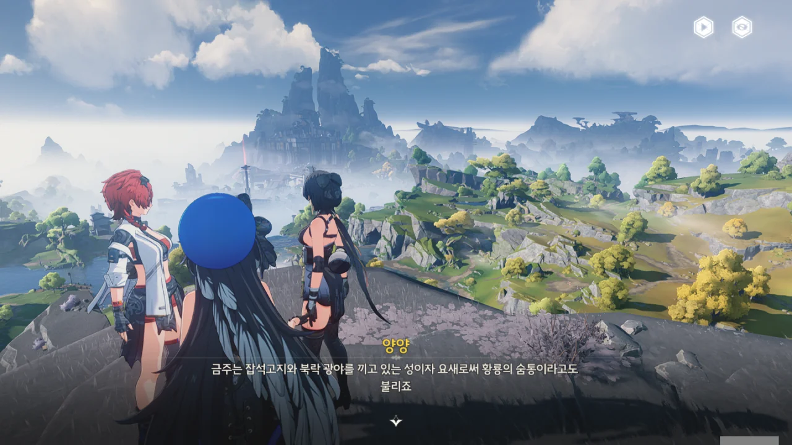
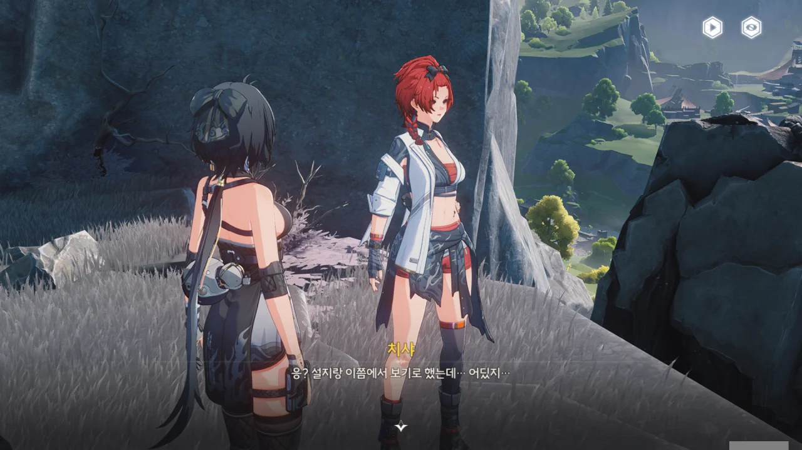
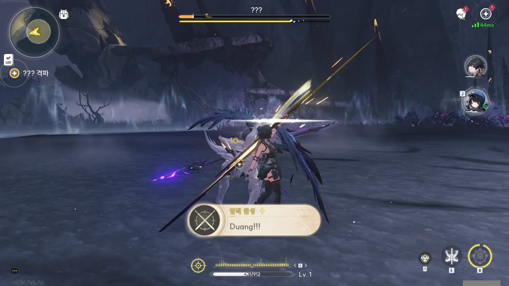
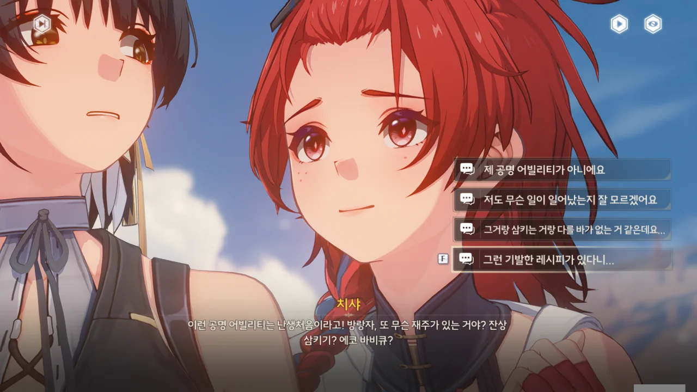
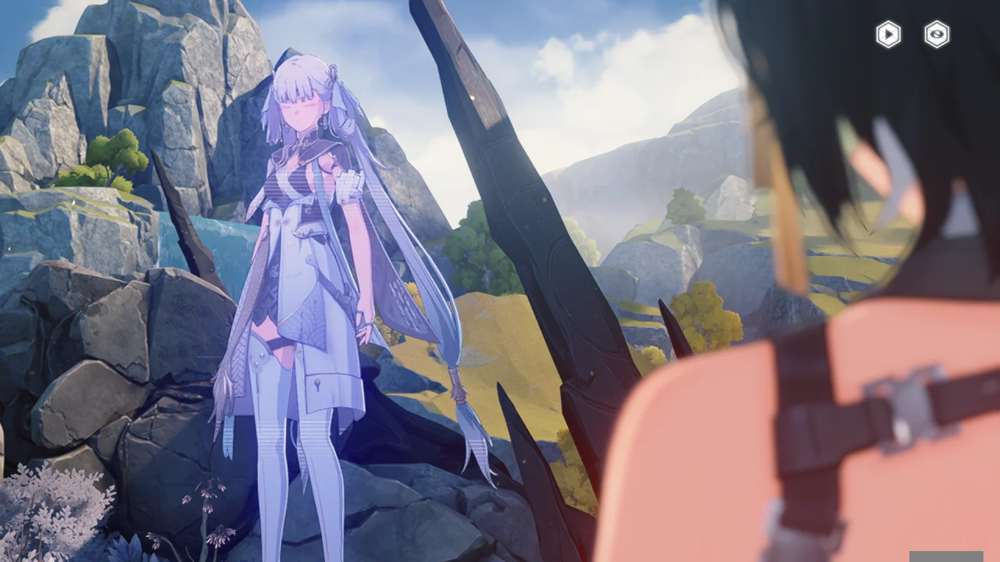
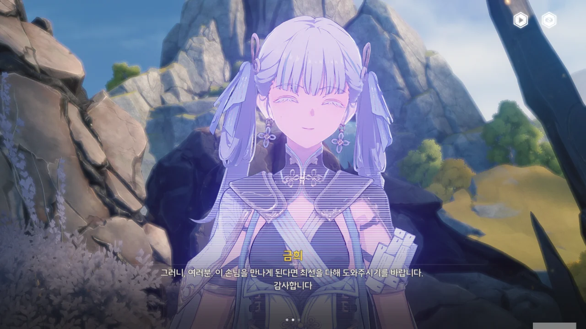
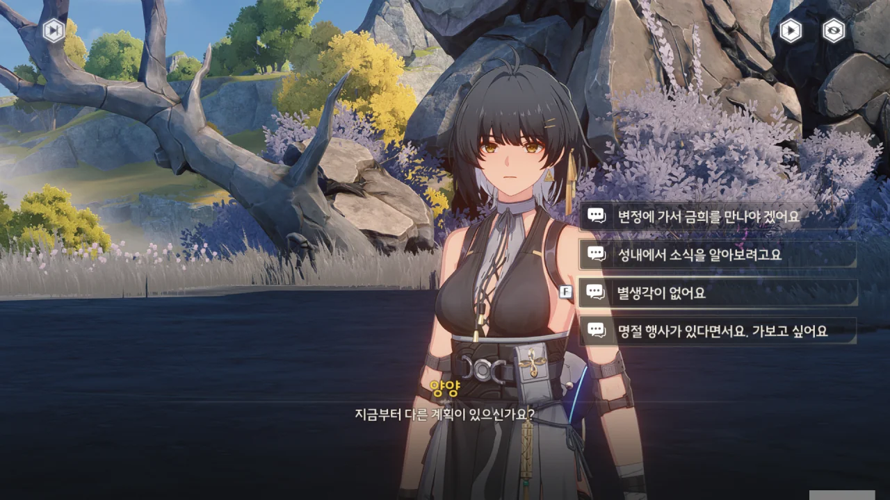
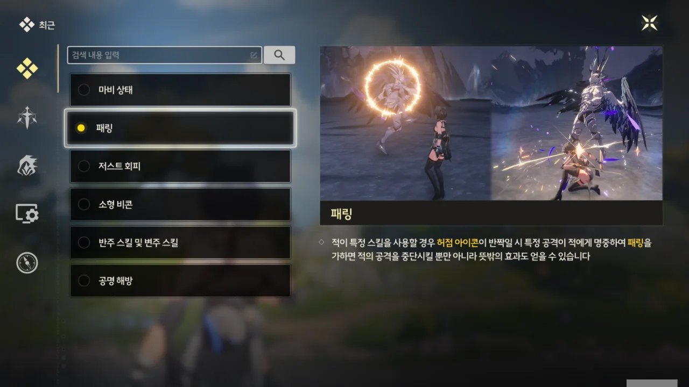
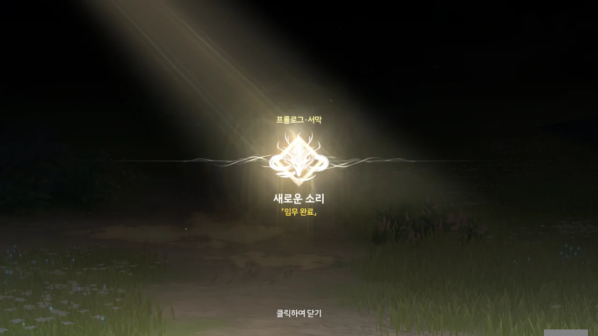



단말기의 「글라이딩 날개」 모듈? 그건 또 뭐야?

아무튼, 곧 금주성이라고 한다. 거기가 아마 우리의 목적지겠지?



오, 저 멀리 도시가 하나 보인다. 「중추 비콘」의 보호막과 「천공부」의 방어 진지로 보호받는 도시라고 한다. 도시에 방어시설을 세워야 할 정도로 이 세상은 위험한가 보다.

그나저나 정말 풍경 보기 좋네. 역시 사람의 손길이 닿지 않아야 이쁜 건가...

잡석고지? 북락 광야? 또 내가 모르는 지명이 나오고 있어...

기본적으로 모든 성은 방어시설이다. 그 높은 벽을 왜 쌓았겠는가. 하지만 그 성을 요새라 부를 정도로 견고하게 쌓았다는 건, 그만큼 저 금주성이 지정학적으로 중요하다는 의미일 것이다. 금주성의 별명인 '황룡의 숨통' 역시 이를 뒷받침하고.

오, 이제 그 '설지'라는 사람을 볼 수 있는 건가.



또 갑자기 날씨가 안 좋아진다. 대체 「하늘바다」가 뭐길래?



저게 「무음구역」이라고? 땅에 생긴 균열의 모습이 공명자의 「성흔」과 매우 비슷한데.



심지어 저 무음구역은 빠른 시간 안에 생성된 것이라고 한다. 보통 뭔가가 갑자기 생기면 그건 위험한 거라는 의미인데...

대체 하늘바다가 뭔지 알지 못하니, 하늘바다와 관련한 말은 도통 무슨 말인지 알 수가 없다.



무음구역 가운데에 웬 사람이 있다. 저게 설지라고?



치샤가 설지를 불러보지만, 거리가 너무 멀어서일까, 들리지 않는 듯하다.

그런데 위험하다는 무음구역에 설지는 왜 들어간 걸까?



막 형성된 무음구역에는 잠복기가 있으며, 무음구역이 빨리 형성될수록 잠복기가 길어진다고 한다. 하지만 반대급부로 잠복기가 길어질수록 거기서 생성되는 잔상 역시 강해진다고 한다.



음, 이거 굉장히 불안한데. 보통 이런 안 좋은 이야기가 나오면 반드시라고 해도 좋을 정도로 그 일이 일어나거든.

저기에 설지가 서있는 것 자체가 뭔가 미끼인 것 같지만, 초면에 그런 말을 하는 건 실례인 것 같아 다른 선택지를 골랐다. 왜, 미믹처럼 사람으로 변장해서 사람을 낚는 몹이 있을 수도 있잖아.



가능하면 전투는 피하고 싶지만, 이야기를 들어보면 뭘 어떻게 해도 무음구역 안으로 들어갈 수밖에 없는 것 같다.

글라이딩 날개는 원신의 '바람의 날개'처럼 공중에서 활강할 수 있게 해주는 기능이다. 절벽 근처에 가도 뭘 누르라는 말이 없어서 그냥 무작정 스페이스 바를 눌렀는데, 바로 그게 정답이었다. 이런 편리한 기능을 기본으로 풀어주다니, 기분이 좋다.





방랑자가 귀에 손을 가져다 대는 걸 보고, 난 방랑자가 뭔가 이상을 느낀 게 아닐까 생각했다. 역시 우리 눈앞에 있는 설지는 무음구역이 만들어낸 미끼인 걸까?



아무 말 없이 방랑자에게 곧바로 다가오는 설지. 여... 역시 저건 무음구역이 만들어낸 미끼였던 거야!



대뜸 방랑자의 앞에 서서 검지를 위로 치켜세우는 설지.

> 이런이런~ 소방차는 빨간불에도 멈추지 않아 BOY♂
{.bq}

나만 이 생각을 한 건 아니었을 거다.



...??? 대체 이게 무슨 일이야? 이 흰색 생물은 뭐지? 그리고 저 "문젠 없네요"는 대체 무슨 말이고?



양양과 치샤는 이런 일이 이미 익숙한 듯, 자연스럽게 대화를 이어나간다.

잠시 '이건 무슨 독심술 대회인가요?'라는 선택지를 골라야 하나 고민해야 했다.



아무리 방랑자를 걱정해서 한 행동이었다지만, 그래도 먼저 말은 좀 하고 했으면 더 좋았을 텐데...

농담 따먹기 할 분위기는 아닌 것 같아, 평범한 대답을 골랐다.



갑자기 땅에서 기둥이 솟아오르기 시작하더니, 뭔가 영역 같은 게 퍼지기 시작한다. 이게 그 「무음구역」이라는 건가?



허리춤의 단말기도 붉게 빛나다가 다시 파란색으로 돌아간다. 보통은 붉은색이 오류나 위험을 뜻하지 않아?





방랑자를 제외한 사람들이 두통을 호소하며 제정신을 차리지 못하고 있다. 그런데 왜 방랑자 혼자만 멀쩡한 걸까?





웬 해골바가지가 얼굴을 들이대길래 한 대 맞받아쳐줬다.



그리고 갑자기 시작된 보스전. 치샤와 설지는 어디로 사라진 건지 보이지 않는다.

이 보스, 짜증 나는 것이, 패턴 파악을 위해 주위를 빙빙 돌아다니며 시간을 끌자 '고작 그 정도밖에 안 되냐?'라고 조롱하듯 두 팔을 벌리고 어깨를 으쓱한다.

오냐, 원하는 대로 한 대 쳐주마.





튜토리얼 보스이기 때문에 패턴 자체는 굉장히 간단하다. 그런데 난 그것도 제대로 파악하지 못하고 다 얻어맞고 있다.

공격 전에 뭔가가 보이는 건 알겠는데, 그걸 보고 어떻게 해야 할지를 모르겠다. 패링으로 받아치는 건지, 회피로 피하는 건지, 뭐 그런 거 말이다.

치샤와 설지는 잔상이 만든 결계 안으로 들어오지 못했기에, 방랑자와 양양을 도울 수 없다.





보스를 조금 어루만져줬더니, 보스가 갑자기 변신하며 망토를 두른다.

여유롭게 뚜벅뚜벅 걸어오는 모습이 묘하게 짜증 난다.





아니, 이런 미친. 3단 변신은 양심이 있는 거냐, 없는 거냐?!

심지어 제대로 빡친 건지, 보스가 창까지 뽑아 들었다.

여기서 패링을 어떻게 하는 건지 설명을 제대로 읽지 못해 조금 고생했다. 보스 공격을 피해야 하는데 밑의 글씨를 읽을 시간이 있겠냐고!

난 처음에 패링을 회피 키로 하는 건 줄 알았는데, 공격 키로 하는 거였더라.



보스가 4단 변신이라도 하려는 건 줄 알았는데, 그대로 노란색 반투명 조각상이 되어버렸다.



원래라면 '전 괜찮아요' 선택지를 골랐겠지만, 뭔가 장난기가 동해 '(절레절레)'를 골랐다. 그대로 절레절레 고개를 젓는 방랑자를 보고 피식했다. 이러니까 내가 방금 때려눕힌 그 보스 같잖아.

치샤는 방랑자와 양양을 돕기 위해 결계 안으로 들어가려 했지만, 결계를 만질 수도, 부술 수도 없었어서 그저 지켜보고만 있어야 했다고 한다.



아뇨, 겁나 얻어맞았는데요. 사실 아까 '아잇 ■■ 무슨 튜토리얼 보스가 이래!'라면서 살짝 욕했어요.



음... 그런 거로 합시다.



이 반투명한 조각상을 '잔향'이라고 부르는구나. 그런데 이런 게 남는 게 왜 운이 좋다고 하는 거지?





만물은 주파수로 되어 있으며, 각기 울림이 존재한다고 한다.

잔상이 쓰러지고 남은 울림을 「잔향」이라 부르며, 잔향은 모든 공명자가 휴대하고 다니는 「반고 단말기」의 「데이터 스테이션」으로 회수할 수 있다고 한다.

「데이터 스테이션」 레벨이 높을수록 잔향이 온전히 남아 회수할 수 있게 될 확률이 높아지며, 이렇게 흡수한 잔향은 「에코」로 바꾸어 전투에서 쓸 수 있다.





아까 단말기가 붉게 변했던 게 위험 경보였구나. 위험 경보가 울렸다는 건 해당 잔상이 「노도급」 이상이라는 의미라고 한다. 잘은 모르겠지만, 센 녀석이란 거지?

방랑자의 단말기로 잔향 흡수를 시도해 본다.



당연하게도 실패했다. 뭐, 방랑자는 이제 막 게임을 시작한 응애니까, 이런 강력한 에코는 절대 공짜로 받아갈 수 없다.

「아즈즈」라는 귀여운 걸 잡아서 전투에 쓴다고 하니, 무슨 포켓몬 같다는 생각이 든다.



설지가 운릉 협곡에 생긴 이상 현상에 대해 연구원과 변정에 알려야 한다고 말한다.

변정이 뭔지는 잘 모르겠지만, 금주성의 행정 조직 이름인 것 같다.



방랑자가 뒤돌아 잔향으로부터 멀어지려 하자, 갑자기 방랑자 손등의 「성흔」이 밝게 빛나기 시작하면서 강제로 팔이 잔향 쪽으로 젖혀진다.

"우...", "배고파..."... 설마 방랑자의 「성흔」은 살아있는 거야? 잔향을 먹고 자라는 거야?



그러더니 정말로 방랑자의 성흔이 잔향을 흡수해 버렸다. 잔향을 흡수하자, 방랑자의 뒤에 흡수된 잔향의 모습이 잠시 나타났다 사라진다.



잔향을 흡수하자, 방랑자의 성흔은 제 할 일을 다 했다는 듯이 빛을 잃었다.



그게 대체 무슨 소리니, 치샤야. 방랑자는 응애 애기라고.



방랑자의 시야에 이상한 장면이 들어온다. 대체 이건 뭘 의미하는 거지?

ㅋㅋㅋㅋㅋㅋ '잔상 삼키기', '에코 바비큐' ㅋㅋㅋㅋㅋㅋ 죄다 먹을 거 이야기잖아.

처음엔 별 생각이 없었는데, 치샤를 보면 볼수록 그녀가 마음에 든다. 뭐랄까, 마치 골든 레트리버를 보는 느낌이야.

방랑자는 눈매 때문인지, 아니면 무표정 위주의 얼굴 때문인지, 뭔가 '사납다'라는 인상을 주는데, 그런 인상을 풀어주는 게 바로 이런 상황이다. 가까이 달라붙는 치샤를 보고 당황해하는 방랑자의 표정을 보라. 원래의 무표정보다 훨씬 낫지 않은가?



레시피 선택지를 고르자, 꾹꾹복어 이야기로 자연스럽게 이야기가 흘러간다. 그런데 잔상을 먹을 수도 있어?



양양이 방랑자에게 잔상의 영향이 남아있는 게 아닐까 걱정하며, 화서연구원 공명 의료과에서 검사를 받아보길 권유한다.







그런데 사람이 잔향을 직접 몸으로 흡수한 전례가 없는 건 아니라고 한다.

「기세통감」 황룡 편 서두에 적힌 내용은 다음과 같다.

> ... 천인(天人)은 태어나, 건곤을 쥐며, 잔향을 흡수하고, 숨결을 응축해 반고를 만들었다.
> 천지가 울리고, 음양이 만나며, 빛이 비치었다.
> 황룡의 역사는, 여기서 시작된다.
{.bq}

모든 내용을 이해한 건 아니지만, 황룡이라는 나라가 건국되기 전 나타난 사람이 단말기 없이 직접 몸으로 잔향을 흡수했다는 부분만은 이해했다.



워낙 유명한 이야기였는지, 공부를 잘하지 못하는 치샤도 그 이야기는 달달 외울 정도라고 한다.

공부를 잘 못하는 치샤와 달리, 양양은 책 내용을 통째로 기억한다고 한다. 그건 좀 부럽네...



설지 말처럼, 단순히 책에 적힌 옛날이야기 하나만으로 상황을 판단할 수는 없다. 양양 말대로, 나중에 검사를 받아보는 게 좋겠다.

> 설마, 방랑자가 우리들 조조조조조조상님인 거야?

에이, 설마.



단말기가 노랗게 빛나다가 다시 파란색으로 돌아온다.



변정에서 영상 메시지를 보냈다고 한다.

여기 있는 사람들에게 보내는 메시지일까, 아니면 금주성 인근의 모든 사람들에게 뿌린 메시지일까?

오, 홀로그램이네.

이렇게 별다른 보조 기기 없이 3차원 홀로그램을 허공에 표시하는 게 가능해질 날이 올까?





금주의 영윤, 금희가 인사말을 꺼낸다.

저번에 양양이 '영윤 대인'이 '수호자의 공명자'라고 말했을 때, 혹시 영윤 대인도 공명자인 게 아닐까 추측했었는데, 금희의 등 뒤에 난 성흔을 보아하니, 영윤 대인, 금희 역시 공명자가 맞았다.

금주는 「잔상류」를 막는 최전선 요새이며, 지금 「달맞이 축제」라는 명절을 맞아 분주한 모양이다.

> 그렇기에, 한 가지 부탁드리겠습니다.

응, 여기서 본론이군.







> 금주에 오신 손님 중, 저와 금주, 그리고 황룡에게 소중한 분이 계십니다. 오랫동안 기다려 왔죠.
> 손님께서는 깨어난 후부터 모든 일이 막막하실 겁니다. 자신과 관련된 이상한 일도 느끼셨겠지요.
> 지금 금주 경내에 머무르신다면 잠시 시간을 내어 「금주 변정」에서 저를 만나주시겠습니까?
> 모든 의문을 풀어드릴 순 없지만, 최대한의 협조와, 자유롭게 움직일 수 있는 권한을 드리고 싶습니다.
> 강요는 아닙니다. 부탁일 뿐이에요. 선택은 당신의 자유입니다.

> 그러니 여러분. 이 손님을 만나게 된다면 최선을 다해 도와주시기를 바랍니다. 감사합니다.

이유를 뭐라 딱 잘라 말할 수 없지만, '앞으로 여러모로 곤란해지겠네'라는 생각이 본능적으로 들었다.

내용으로 미루어보아, 이 메시지는 금주 인근에 있는 모든 사람들에게 발송된 메시지이다. 주인공을 찾아 살살 꼬셔 한몫하려는 사람이 분명 있을 것이고, 자기가 금희가 찾던 '손님'이라고 주장하는 날파리도 있을 것이다.

뭐라 정확히 말할 수는 없지만, 방랑자는 물론이요, 금희 본인도 상당히 앞으로 귀찮아질 것 같다 생각이 들었다.



방랑자는 게임 주인공이니까, 금희가 말한 '손님'이 방랑자일 확률이 매우 높다. 하지만 작중 인물의 관점에서 생각해 볼 때, '설마 내가 금희가 말한 손님인가?'라고 생각하는 건 오만한 생각처럼 보이지 않을까?

그래서 금희에 대해 물어, 말을 돌렸다.



'금희'라는 이름은 그녀가 '영윤'이라는 직책을 받을 때, 금주와 하나가 되라는 뜻에서 받은 '금'씨 성과 그녀의 본명인 '희'를 합쳐 만든 이름이라고 한다.

대체 얼마나 높은 직책이기에, 성씨까지 갈아치우는 걸까? 성씨를 하사 받는 건 보통 군주의 최측근인데 말이다.



와, 머리를 긁적이는 양양, 너무 귀엽다!

저는 아무런 생각이 없습니다.

사실 눈 뜨자마자 어버버 하는 사이에 여기까지 온 거라, 정확히 뭘 해야 할지도 잘 모르겠다. 그냥 상황이 흐르는 대로 따라가는 중이다.





일단 다 같이 금주성으로 가기로 했다.





음, 그러면 앞으로 할 일이...

1. 금주성에서 건강검진받기
2. 금주성에서 금희 만나보기
3. 금주성 변정에 이상 현상 보고하기
4. (선택) 다른 잔향 흡수해 보기

아, 패링은 노란 원이 나오면 특정 공격을 적에게 명중하여 발동하는 거구나.

아까는 워낙 경황이 없었던 터라, 도움말을 제대로 읽을 수 없었다.



마침 길 가던 잔상을 발견했다. 잡몹 수준의 잔상이었던 건지, 이번에도 잔향이 남았다.



잔향이 흡수가 되지 않는다. 아까는 강제로 끌어당기는 느낌이 있었는데, 지금은 아무런 반응이 없다.

치샤 말처럼, 방랑자가 흡수 가능한 잔향의 종류가 따로 있는 걸지도 모른다.



갖고 있던 단말기로 잔향을 흡수했다. 데이터 스테이션의 경험치가 올라가는 게 보인다.



와, 이거 정말 구린 것 같은데요. 이걸 전투에서 어떻게 써야 할지 잘 모르겠다.



축음나비는 원신의 선령과 비슷한 거라고 보면 될 것 같다. 다만 그 목적지에 도착해도 별다른 보상이 보이지 않는다.

설마 내가 중간 목적지에 도착해 놓고 '왜 보상이 없지?'라고 생각한 건가?



사운드박스라는 걸 얻었다. 이건 전망 포인트 같은 건가? 사운드박스가 있던 장소가 딱 그런 느낌이던데.



일행과 함께 금주성으로 들어간다. 누군가의 시선을 느낀 건지, 방랑자가 잠시 뒤를 돌아본다.

프롤로그 \[새로운 소리\] 완료!





뒤에서 방랑자를 관음하고 있던 게 바로 너였구나.

얼굴의 하관만 나와 잘은 모르겠지만, 뭔가 금희와 닮았다는 느낌을 준다.
