



설지는 연구원으로 돌아가 협곡의 변화, 무음구역 부활, 비명 이상 현상 등을 보고하기로 했다.

양양은 변정에 이상 현상을 보고하고, 면회 수속 절차도 같이 진행하기로 했다. 절차 자체는 복잡하지 않지만, 시간이 좀 걸린다고 한다.



그래서 자연스럽게 방랑자 안내는 치샤가 맡게 되었다. 일단 방랑자를 '중추 비콘'에 데려가겠다고 한다.





이야기하는 걸 들어보니, 방랑자의 일정은 대충 이렇게 될 것 같다.

1. 치샤와 '중추 비콘' 방문
2. 변정에서 금희 면회
3. 연구원에서 신체검사



신체검사에서 과연 뭘 검사할지 궁금해 물어보았는데, 신체검사는 덤이고 방랑자의 신체 정보를 분석하고 연구하는 게 주목적인 것 같다. 뭐, 방랑자의 동의를 얻어서 진행한다고 하니, 별 이견은 없지만.

사실, 방랑자의 신체가 어떤지 나도 궁금하긴 해.



그래서 잠시 양양, 설지와 헤어지게 되었다.







금주의 모습을 천천히 보여준다.

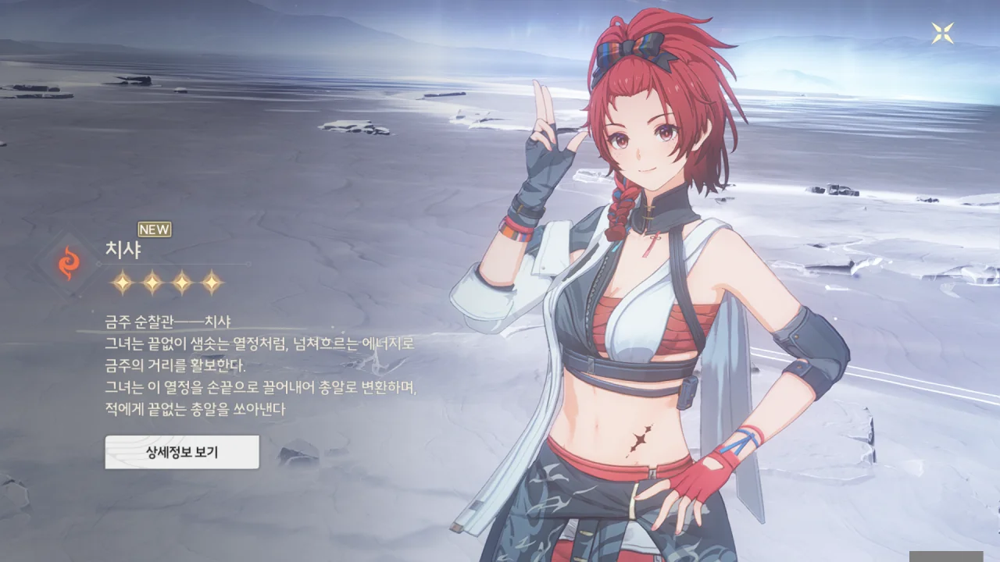

치샤가 합류했다. 총알? 설마 여기엔 총이 있는 거야?

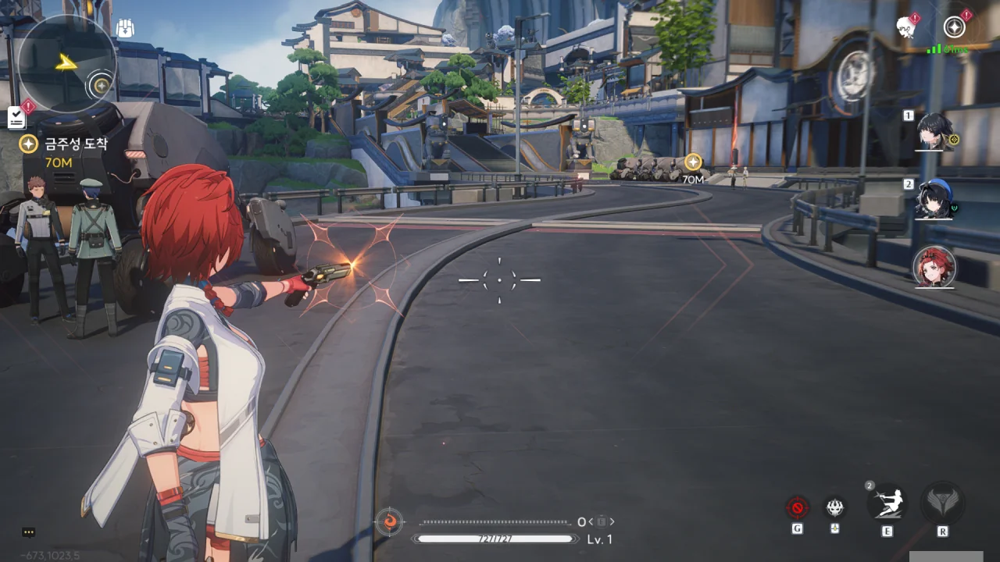

오, 진짜네? 다만 조작법에 대해선 조금 배워야 할 것 같다.

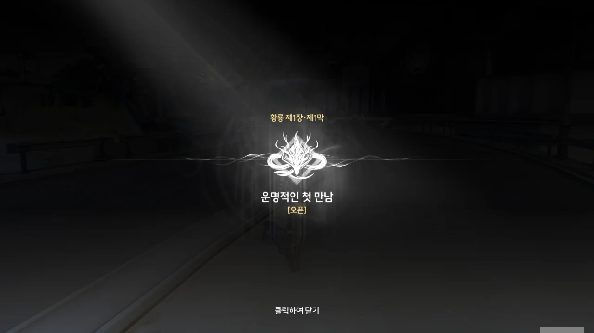

제1장 황룡 제1막 \[운명적인 첫 만남\] 오픈!

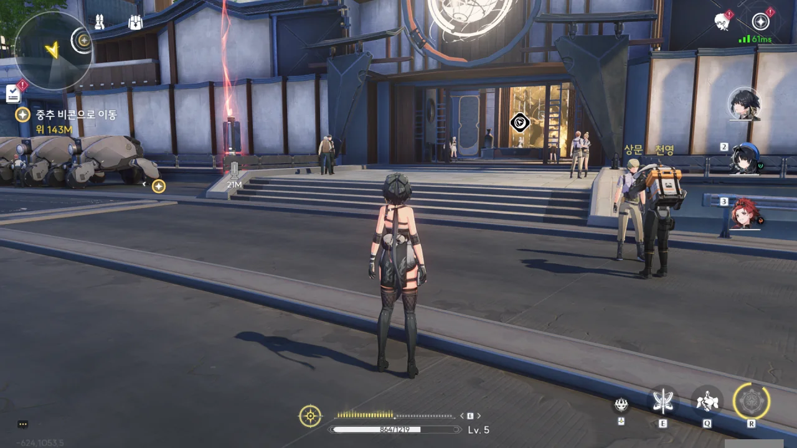

당연하다면 당연한 말이겠지만, 도시 곳곳에 소형 비콘이 놓여 있다.

저 건물 안은 무슨 가게처럼 보이는데, 나중에 갈 일이 생기겠지?

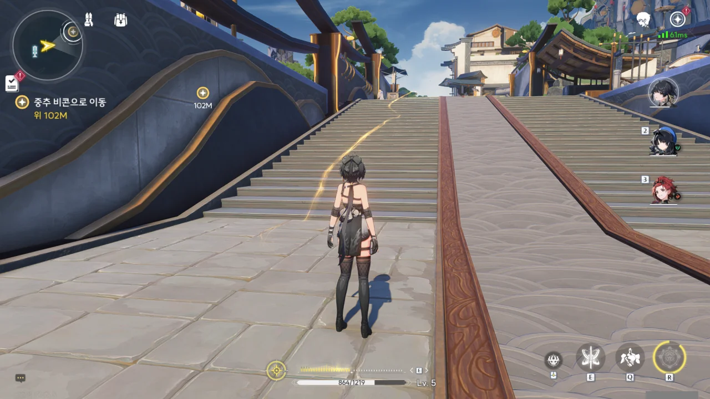

임무 목표로 가는 길은 이렇게 엷은 노란색 선으로 표시해 준다. 그런데 이걸 표시하는 키가 따로 있는 건가?





치샤의 설명을 들어보면, 중추 비콘은 도시에 보호막을 제공하는 동시에, 각지에 놓인 소형 비콘을 통해 각종 서비스를 제공하는 메인프레임으로 보인다. 소형 비콘은 터미널 역할이라 보면 되겠네.

지도를 쓰려면 중추 비콘에 연결해 지도 정보를 받아야 하는 것 같다.

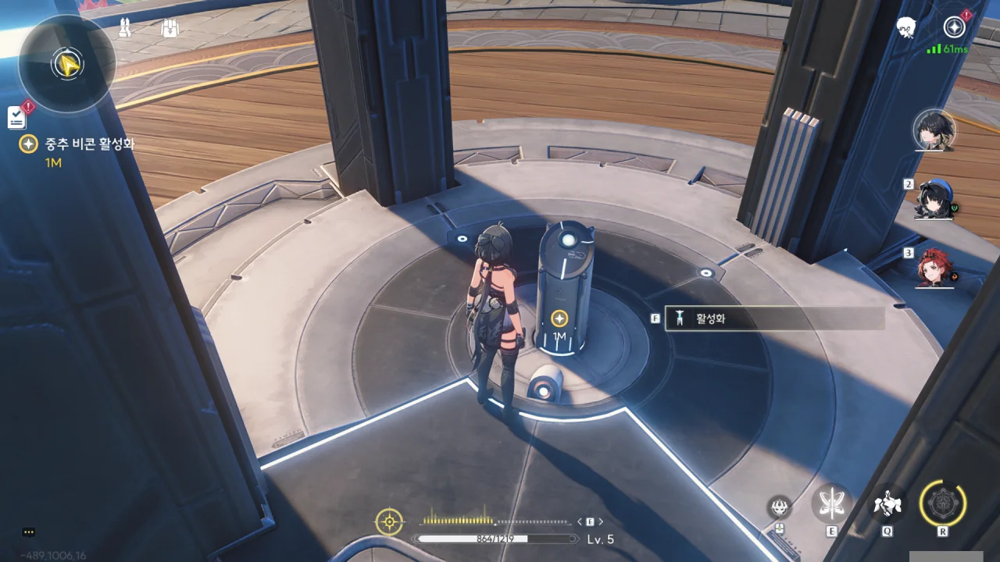

여기다 단말기를 올리면 된다고?





잘은 모르겠지만, 중추 비콘의 색이 붉은색에서 푸른색으로 변한 걸 보면, 제대로 된 것 같다.

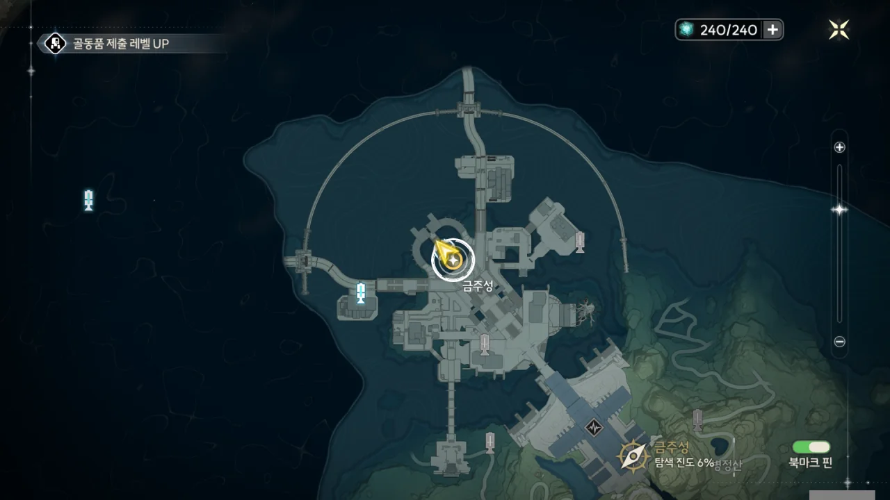

오, 지도가 이렇게 열리는구나. 탐색 진도 6%... 언젠간 저것도 100%가 되겠지?



역시 내 예상이 맞았어. 어떤 지역의 지도 정보를 얻으려면 그 지역의 중추 비콘을 활성화해야 한다.

중추 비콘에는 힐 기능도 달려있다. 원신의 일곱 신상과 매우 비슷한데, 설마 여기에도 회복 제한이 있을까?



시간이 걸릴 거라더니, 의외로 금방 수속이 끝났다.

그나저나 단말기에 1:1 통신 기능도 있었구나. 금희의 영상 메시지를 받았을 때 눈치챘어야 했는데...

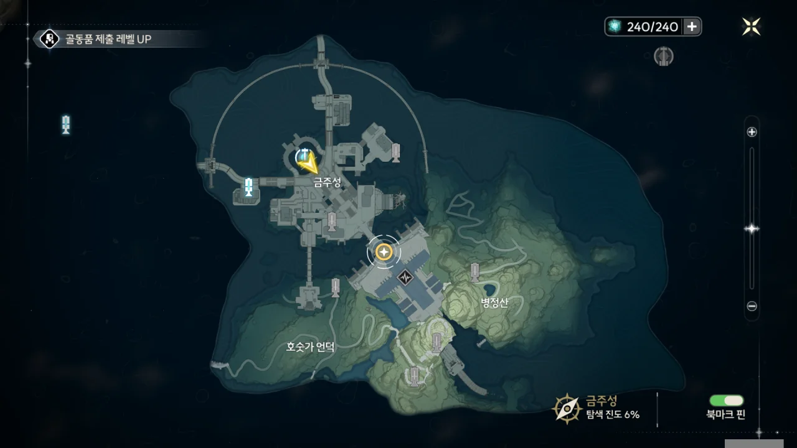

그냥 이 앞으로 쭉 가면 된다.

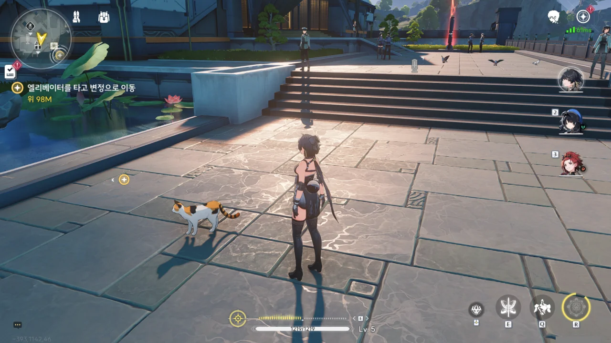

변정으로 가던 중 발견한 소형 비콘을 찍기 위해 이동하던 중, 문워크를 하는 고양이를 발견했다.



아니, 이 녀석이 정말로 문워크를 하고 있었다니까?



변정은 도시의 높은 곳에 위치했다.

처음 금주의 모습을 보여줄 때, 엘리베이터 같은 것이 내려오는 모습이 보이길래, 도시의 2층에도 뭔가 거주 구역이나 행정 구역, 혹은 상업 구역이 있을 거라 생각했다. 아무래도 도시의 2층엔 변정을 비롯한 행정 구역이 있는 모양이다.





당연한 일이다. 금희가 '손님'을 찾고 있다는 걸 전체 공지로 내보냈으니, 당연히 '내가 바로 그 손님이요'라고 주장하는 날파리가 모여들지 않겠는가.

그런데 그들은 왜 하필이면 '이런저런 이유'로 거절당한 걸까? 그들이 금희가 찾던 손님이 아니라는 이유 하나만으론 충분하지 않은 건가?





금주의 리더는 금주와 하나가 되기 위해 금주를 떠나선 안되므로, 금희는 변정에 없어도 금주 어딘가에 있을 거라고 한다. 예외가 있다면 출장이나 비상사태 정도라고 한다.

금희가 지금 출장 중일 거라고 생각하긴 힘들다. 기껏 '손님'을 초대했는데, 정작 자신은 자리를 비운다고?

금주 수호신의 공명자인 금희가 위험에 빠졌을 거라고 상상하기도 힘들다.







대부분의 면회 신청자는 '산화'라는 이름을 가진, 금희의 최측근 「호위」의 매서운 눈빛과 말 한마디에 발걸음을 돌렸다고 한다.

사람들은 그녀를 「매서운 눈빛과 엄청난 힘을 가진 만능 냉미녀 호위」라고 부르는 모양이다. '매서운 눈빛'은 그렇다 쳐도, '엄청난 힘'은 대체 뭘까?

쳐다보는 것만으로도 돌 석상을 만든다는 '메두사'... 솔라리스에도 그리스 로마 신화가 있다고 하기에는 너무 공교로운데? 설마 솔라리스도 지구 출신 이민자들이 개척한 행성인 건 아니겠지?



> 왜냐, 금희가 기다리고 있는 사람이 저이니까요.

와, 이 대사만큼은 선택하기 싫었는데! 너무 나르시시즘이 심한 거 아냐?

물론, 방랑자의 상황이 금희가 말했던 것에 너무 잘 들어맞기는 하다.



전역 통신 메시지는 미리 녹화한 후, 송출할 수 있다.

그렇다면 이 메시지는 방금 보낸 게 아니라, 예전에 녹화한 후 지금 송출한 것일 가능성이 있다. 즉, 금희가 지금 변정에 없을 수도 있다는 말이다.





금희가 사칭과 같은 상황이 발생할 걸 고려하지 않고 전역 통신 메시지를 내보냈을 리 없다. 정치란 건 그렇게 단순하게 굴러가지 않으니까. 그러니 금희가 전역 통신 메시지를 내보낸 데에는 뭔가 다른 숨은 뜻이 있는 게 아닐까?

하지만 양양과 치샤는 일단 금희를 만나보라는 말만 한다. 음, 틀린 말은 아니다. 금희에게 무슨 속셈이 있건, 지금 그녀와 만나면 끝나는 일이니 말이다.





치샤와 양양에게 이 상황에 대해 어떻게 생각하냐 물었다.

치샤는 방랑자의 말을 '지금 무슨 생각해?'라고 이해한 건지, 다 같이 「판화반점」에 모여 밥 먹을 생각만 하고 있었다고 한다.

양양은 자신이 방랑자를 금주에 데려왔으니, 금주에서만큼은 방랑자와 함께 하겠다고 한다.





결국 답정너구나. 뭔 짓을 해도 '일단 금희와 만나봐!'라는 결론이 된다.

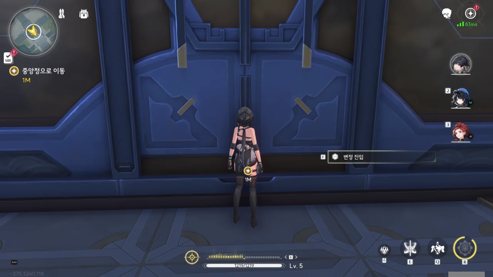

그렇다면 들어가야겠지.



안은 생각보다 깨끗한데?

사실, 이 장면을 보고 든 생각이 '오' 하나밖에 없었다. 다른 감상도 아니고, 그냥 '오'.



잠시 ESC 메뉴를 열어, 아직 확인하지 못한 것을 확인한다.

데이터 스테이션의 레벨을 올리면 스태미나의 최대치도 증가하는 것으로 보인다.

데이터 스테이션의 경험치는 에코를 처음으로 흡수할 때에만 얻을 수 있으므로, 데이터 스테이션의 레벨을 올리기 위해선 다양한 잔상을 격파해야 한다.



뭔가 사무실 같기도, 접객실 같기도 한 방으로 안내받았다.

처음엔 여기가 금희의 집무실이라고 생각했다. 하지만 눈앞에 놓인 네 쌍의 의자와 탁자를 보아하니, 여긴 집무실이라기보다 접객실일 확률이 더 높아 보인다.

다른 면회 신청자들이 산화의 매서운 눈빛을 받고 발걸음을 돌렸다고 하길래, 난 그들이 접객실에 오기도 전에 산화의 선별을 받았다 생각했다. 그런데 그건 아니었던 모양이네. 난 아직 산화를 만나지도 못했잖아.

그나저나 이렇게 깊숙하게 들어왔는데도 아직 접객실이라니, 금희는 구중궁궐의 공주님이 따로 없구나. 뭐, 직책이 직책이니, 당연한 말이겠지만 말이다.



접대원이 의자에 앉아 잠시만 기다려달라고 한다.



접대원이 차를 내려놓는 걸 보고, 조금 오래 기다려야 할 것 같다 생각했는데, 접대원이 차를 내려놓고 돌아서자마자 누군가가 접객실로 들어왔다.

아까 영상에서 본 금희의 옷차림이 아닌 걸 보면, 이 사람이 금희의 호위, 산화인 걸까?



그녀의 공명 어빌리티는 눈과 관련한 건지, 능력을 발동해 방랑자를 관찰한다.





뭐지? 산화의 선별을 통과한 건가? 다른 면회 신청인들과는 다른 반응이다.

금희는 지금 부재중이며, 방랑자를 위해 미리 선물과 「신물」을 남겼다고 한다. 금희가 없는 동안 「신물」이 가리키는 것과 만나면 방랑자가 알고 싶어 하는 정보를 미리 알 수 있을 거라고 한다.

정식으로 금희를 만나는 건 사흘 후가 될 거라고 한다.

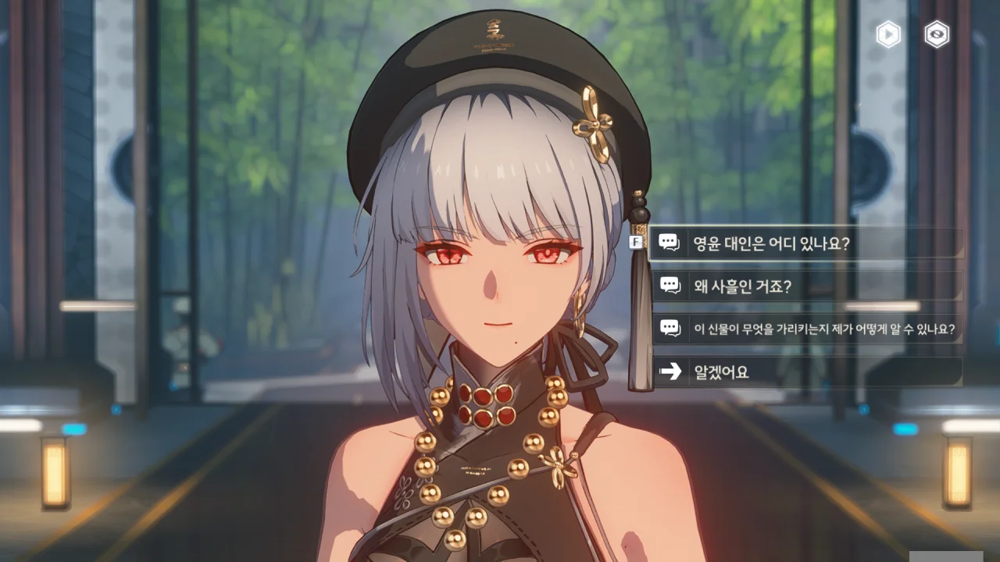





산화의 말을 들어보면, 금희에게는 미래를 예측할 수 있는 능력이 있는 것 같다.

자신은 달리 볼 일이 있어 자리를 비우지만, 방랑자에게 줄 선물과 「신물」은 산화에게 맡겨, 대신 전달하도록 하였다.









사흘이 '버틸 수 있는 한계'라고? 뭔가 금희에게 곤란한 상황이 들이닥친 것 같은데...

산화에게 금희를 도울 방법이 있냐고 묻자, 지금 곧바로 결정할 필요는 없다며, 모든 걸 알고 나서 직접 판단하고 움직여 달라고 말한다.

'일단 날 도와줘!'라고 말하지 않는 점이 마음에 든다. 여러 게임을 하며 '사정 판단은 나중에 하고, 일단 지금 날 먼저 도와줘!'라고 말하는 캐릭터들을 너무 많이 봤거든.







「신물」은 수수께끼가 아니라 증거이자 신호라고 한다. 이건 무슨 말인지 잘 모르겠는 걸. 나중에 한번 확인해 봐야겠다.





그런데 산화는 어떻게 방랑자가 금희가 찾던 '손님'이란 걸 안 걸까? 여태껏 많은 사람들의 면회 신청을 거절한 걸 보면, 뭔가 산화만의 선별 방식이 있는 것처럼 보이는데.

방랑자가 특별하다고?



아, 산화와 처음 만났을 때 산화가 방랑자를 관찰한 게, 바로 방랑자의 주파수를 본 거였구나.



방랑자와 금희의 주파수는 왜곡되지 않고 순수한, 본연 그대로의 모습이라는 점에서 같다고 한다.

양양이 이전에 '만물은 주파수로 되어 있으며, 각기 울림이 존재한다'라고 했는데, 이것과 연관이 있는 걸까?



다만 다른 사람의 주파수에 대해 묻자, '모두 다르다'라는 말만 하고 더 이상의 언급을 피하는 걸 보면, 산화의 눈에 보이는 다른 사람의 주파수는 그리 보기 좋지 않은 모양이다.

산화 눈에 보이는 다른 사람의 주파수는 어쩌면 그 사람 내면의 본질일 지도 모르겠는걸.





금희가 부탁한 거라며, 단말기에 통행 권한 인증 추가와 최신 탐색 시스템 모듈 업그레이드를 해주겠다고 한다.

클리셰 대로라면, 이렇게 이런저런 업그레이드를 하면서 GPS나 추적 모듈 같은 걸 몰래 같이 끼워 넣을 테니, 나중에 금희가 방랑자의 위치를 알게 되어도 그런가 보다 해야겠다.





감지, 컨트롤, 로프 등의 기능이 탐색 모듈에 추가되었으며, 통행 권한 인증 덕분에 변정 내부를 포함한 모든 곳에서의 통행이 자유롭게 되었다.





당장 묵을 곳이 없었는데, 숙소도 제공해주겠다고 한다.

너무 많이 퍼주는 것 같아 조금 꺼림칙하지만, 혈혈단신으로 이곳에 떨어진 이상, 일단은 감사히 받아먹어야겠다.

일단 숙소의 위치를 알고 나서 다음 장소로 이동하고 싶었는데, 방랑자가 그걸 거절해 버렸다.

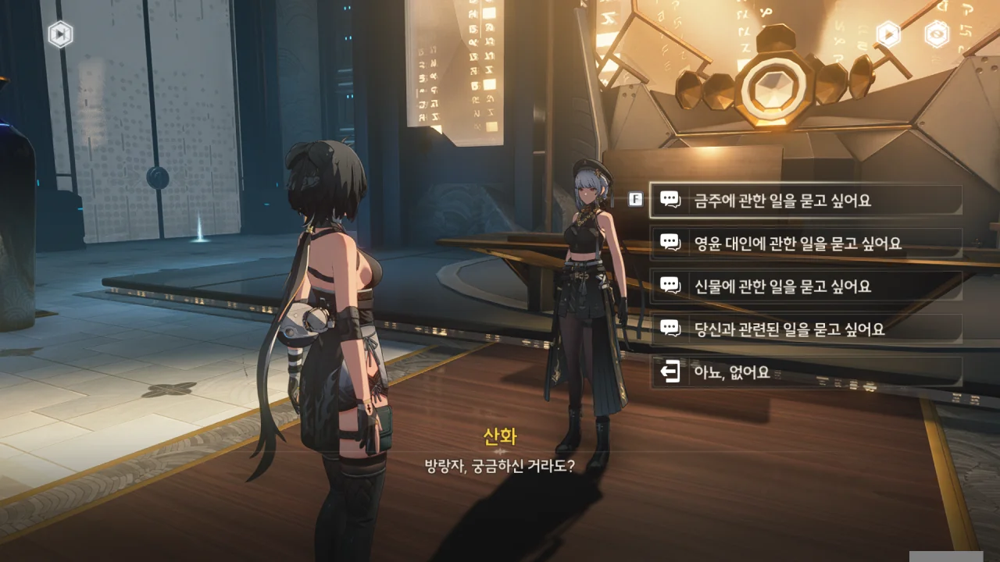

그래, 이런 게 있을 줄 알았지. 이대로 그냥 변정을 나갔으면 이 질문을 하지 못하게 되었을 것 아닌가.







「야귀」는 기염 장군이 이끄는 국경 수비군이며, 선봉부대인 「파진」, 후방부대인 「복파」, 행정부대인 「답백」으로 나뉘어 있다고 한다. 「답백」은 「야귀」 소속이긴 하지만, 대부분 예비역이나 자원봉사자로 이루어져 있어, 전투가 아닌 척후 역할을 수행한다고 한다.

군인 --- 「야귀」를 말하는 거겠지? --- 대부분은 공명자라고 한다.









산화 개인의 입장에서 금주를 소개해달라 하자, '정 붙이기 쉬운 곳'이라고 말한다.

산화에게 특별한 사람이 있다고 하는데, 내 장담컨대, 바로 금희일 것이다.







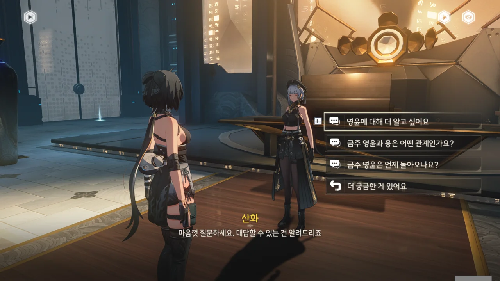





이전에 들었던 대로, 금희의 원래 이름은 '희'지만, 영윤으로 취임하고 나서 '금희'가 되었다고 한다.

'영윤 대인'이라 불리는 경우가 많은 건 그게 금희의 직책이니까, 당연한 일일테고.







「영윤 대인」 금희는 「용녀」라고도 불리는데, 이는 금주의 수호신과 공명하면서 생긴 거라고 한다.

수호신과 영윤의 관계는 주마다 다른데, 금희와 금주의 수호신은 친척 같은 관계라고 한다.

다만 이건 금희가 산화에게 알려준 정보를 통해 추측한 거라, 확실하진 않다고 한다.







흠, 방랑자가 어떻게 하냐에 따라 금희가 돌아올 시간이 달라진다는 건가?

잘은 모르겠지만, 금희가 본인만으로는 완벽히 통제할 수 없는 상황에 빠진 모양이다.







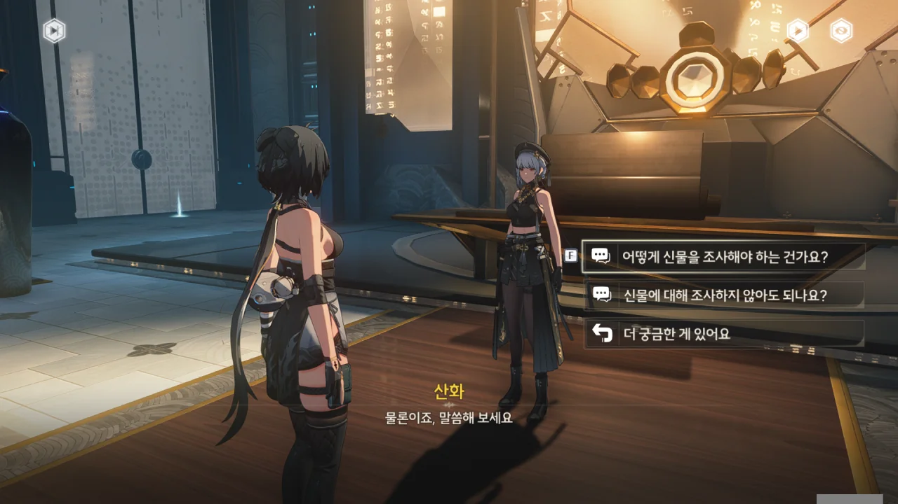





신물이 담고 있는 메시지는 출처와 관련이 있으며, 신물의 출처와 가리키는 장소, 사건을 알아내면 방랑자가 알고 싶어 하는 정보와 금희가 전하는 정보를 찾을 수 있을 거라고 한다.





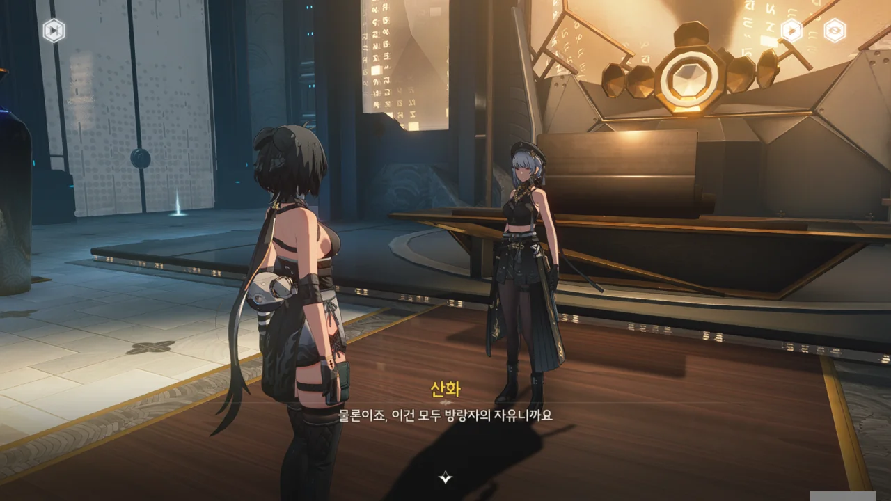

신물을 받기만 하고, 신물에 대해 조사하지 않아도 되냐고 물어보았는데, 그것마저도 방랑자의 자유라고 한다.

그렇게 말하니까 더 궁금한데. 이것마저도 금희의 노림수라면 정말 훌륭하다고밖에 말할 수 없다.









산화는 이전에 방랑자와 만난 적이 없으며, 만났더라면 잊었을 리 없다고 말한다.

뭐... 금희처럼 왜곡되지 않고 순수한, 본연 그대로의 주파수를 지닌 사람을 산화가 잊었을 리 없긴 하겠다.







> **검은 열매**
> ***
> 금희가 주는 신물 1
> ***
> 무겁고 어두운 과일. 한 손으로 잡을 수 있고, 은은한 향기를 풍기며, 그냥 평범한 과일처럼 보인다.
{.bq}

> **나뭇잎**
> ***
> 금희가 주는 신물 2
> ***
> 희귀한 보라색 나뭇잎. 약간의 이상한 기운을 느낄 수 있다.
{.bq}

> **소형 장치**
> ***
> 금희가 주는 신물 3
> ***
> 정교하게 만들어진 소형 장치.
> 위에는 고풍스러운 문자가 새겨져 있고, 안쪽 문자는 황룡 사대신수를 대표하여, 위치 정보가 내포되어 있는 것 같다.
> 「동 청룡, 서 백호, 남 주작, 북 현무」
> 바깥쪽 문자는 십이지지로, 시간 정보가 내포되어 있는 것 같다.
> 「자, 축, 인, 묘, 진, 사, 오, 미, 신, 유, 술, 해」
{.bq}

> **캡슐 사탕**
> ***
> 금희가 주는 신물 4
> ***
> 작고 둥글며 진주 모양을 띤 사탕인 것 같다. 포장은 소박하고 심플하다.
{.bq}

이것만 봐선 이게 뭘 뜻하는지 잘 모르겠는걸.

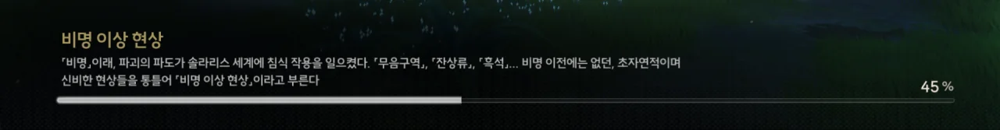

> **비명 이상 현상**
> ***
> 「비명」 이래, 파괴의 파도가 솔라리스 세계에 침식 작용을 일으켰다. 「무음구역」, 「잔상류」, 「흑석」... 비명 이전에는 없던, 초자연적이며 신비한 현상들을 통틀어 「비명 이상 현상」이라고 부른다.
{.bq}

로딩 화면에서 풀어주는 배경 설정 역시 꽤 된다.
