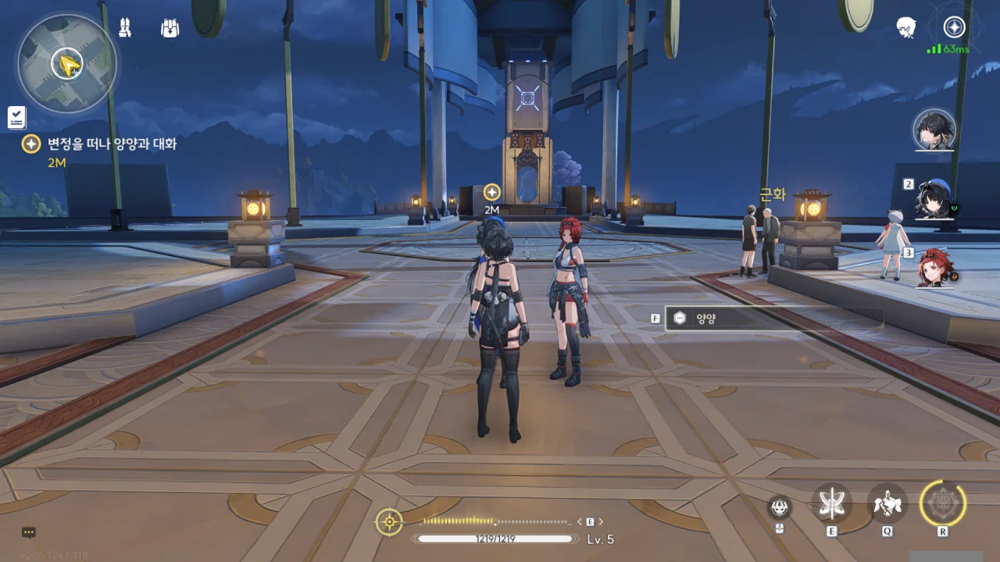
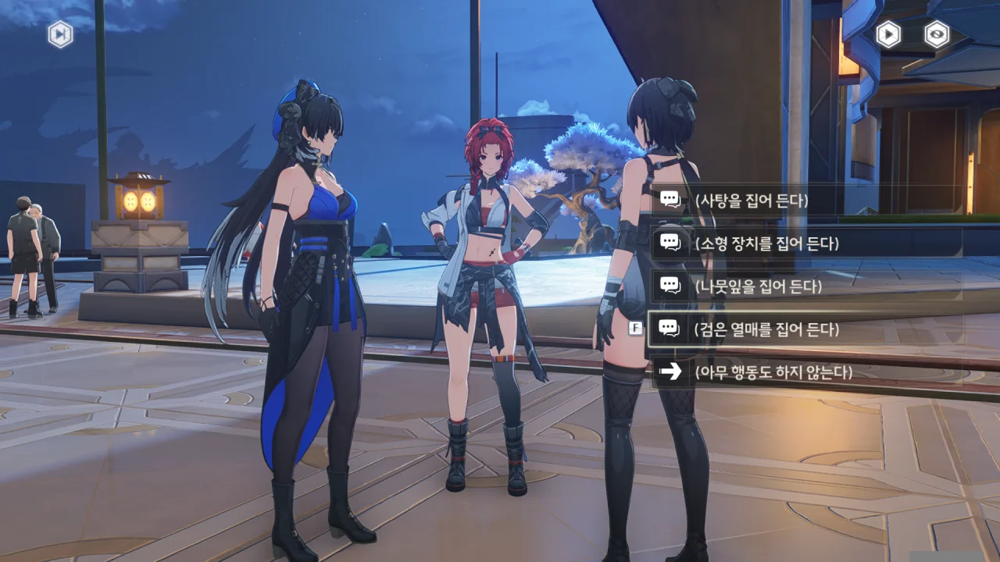
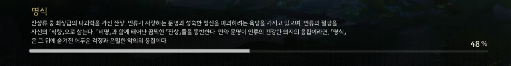

변정을 나왔다.



양양과 치샤에게 변정에서 있었던 일을 이야기해 준다.





양양이 '바람에 불안하게 요동치는 숨결이 담겨있다'며 불안해한다.





맞아. 일단 당장 할 수 있는 일은 다 했잖아.

뭔가 이상한 일을 목격했다면, 직접 해결하려들기보다, 변정이나 연구원 같은 공공기관에 알리는 것이 좋다. 애당초 그런 일을 처리하라고 공공기관이 있는 것 아니겠는가!





그러니까 방랑자는 금희가 준 신물에 대해 알아볼 거다.

양양이 신물을 보여달라기에 보여주었다. 보여준다고 닳는 것도 아닐 테니.





이 열매는 금주에서 자라지 않아, 수로를 통해 들여와 파는 '망고스틴'이라고 한다.

다만 잔상류로 인해 일어나는 전투 때문에 교통이 종종 끊겨, 항상 볼 수 있는 열매는 아니라고 한다.









양양이 착각처럼 느낄 만큼 미미한 뭔가를 느꼈지만, 이게 뭔지는 잘 모르겠다고 한다.









플레이버 텍스트에서 본 내용 그대로이다.



해시계는 햇빛이 없으면 아무 쓸모가 없다... 이것도 어떤 힌트인 걸까?









양양과 치샤는 어릴 적 종종 캡슐 사탕을 먹었다고 한다. 다만 이 사탕은 지금은 나오지 않는 사탕이라고 한다.





이 사탕도 설지에게 물어보면 뭔가 답이 나오지 않을까?

하지만 그 선택지를 고르자, 화면 왼쪽에 나오는 임무 설명에 선택 임무가 나오는 걸 보고, 주변의 아이들에게 사탕에 대해 먼저 물어봐야 했다는 걸 깨달았다.



아니, 뺏어 먹으려는 게 아닌데...



금희가 손님을 잘 대접하라고 했다는 이유 하나만으로 자기가 아끼는 사탕을 방랑자에게 주다니... 금희는 대체 금주 사람들에게 어떤 존재이길래 이렇게까지 하는 걸까?



> **사탕 한 알**
> ***
> 「금주의 손님, 여기서 달달하게 지내시길 바래!」
> 어린이가 주는 작은 선물
> ***
> 금주 어린이들이 좋아하는 사탕. 사탕 봉지가 좀 주름져 있어, 작은 손안에 꽉 쥐어져 소중하게 보관했던 것이 보인다.
{.bq}

사용할 수 있는 소모성 아이템이지만, 이걸 홀랑 까먹기에는 뭔가 양심의 가책이 느껴진다.

별다른 효과가 없으면 그냥 소중하게 보관해야지.





로프 기능이 해금되었다. 원신 수메르부터 볼 수 있는 클로버 인장과 비슷하지만, 로프 포인트가 보이지 않아도 로프를 사용해 위로 짧게 도약할 수 있다.

> 단말기에 탑재된 탐색 보조 모듈은 사용자가 환경에 따라 기능을 전환할 수 있습니다.
{.bq}

이 말은 상황에 따라 탐색 보조 모듈을 바꿔 써야 한다는 말 같은데... 설마 로프 기능을 쓴 다음 글라이더 모듈로 바꾸고 활강해야 한다는, 그런 이야긴 아니겠지?



여긴 합성대의 크기가 좀 크네.

처음 봤을 땐 벽에 달린 모니터만 합성대인 줄 알았는데, 지금 다시 보니 양 옆의 출입구를 포함한 기계 전체가 합성대인 것으로 보인다.







치샤는 당직 일 때문에 먼저 떠나게 되었다.

그나저나 누가 실종되었다고? 이것도 앞으로 있을 일에 대한 떡밥은 아니겠지?

&nbsp;

대체 '마소방'이 무슨 뜻인지 궁금해 찾아보았다. [네이버 라운지 글](https://game.naver.com/lounge/WutheringWaves/board/detail/1884240)에 따르면 '마소방'은 치샤의 본명이라는 모양이다.

개발 중일 당시 '치샤'의 이름은 '치하'였으며, '치하'는 '마소방'이 스스로에게 붙인 별명이라고 한다. 아마 이 설정은 '치하'가 '치샤'가 된 지금도 유효할 것이다.

다행스럽게도, 탐색 도구의 글라이더 기능은 해제할 수 없는 기본 기능인가 보다. 로프 외에 어떤 도구가 추가될지 궁금해지는 걸.

> **명식**
> ***
> 잔상류 중 최상급의 파괴력을 가진 잔상. 인류가 자랑하는 문명과 성숙한 정신을 파괴하려는 욕망을 가지고 있으며, 인류의 절망을 자신의 「식량」으로 삼는다. 「비명」과 함께 태어난 「잔상」들을 동반한다. 만약 문명이 인류의 건강한 의지의 응집이라면, 「명식」은 그 뒤에 숨겨진 어두운 걱정과 은밀한 악의의 응집이다.
{.bq}

그러니까 앞으로 마주칠 보스들은 전부 이 「명식」이라는 건가?
