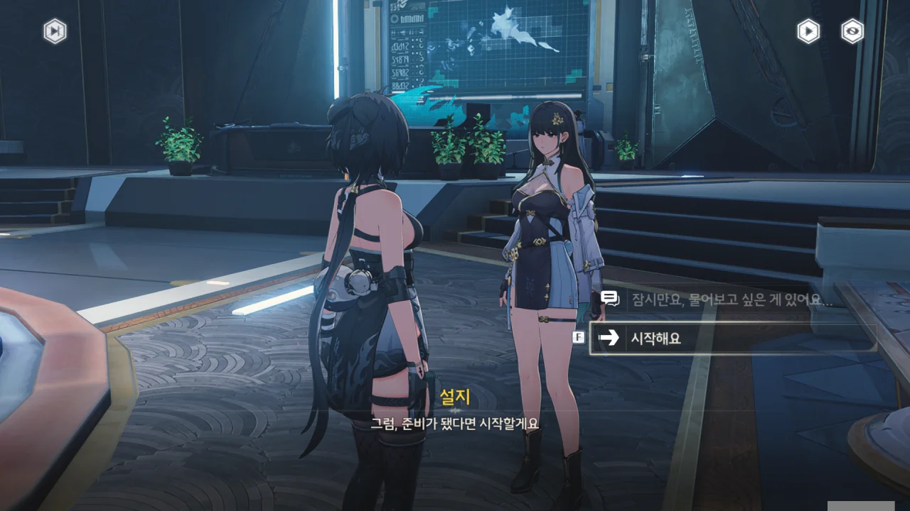
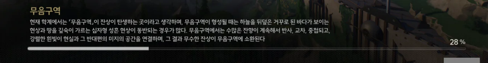
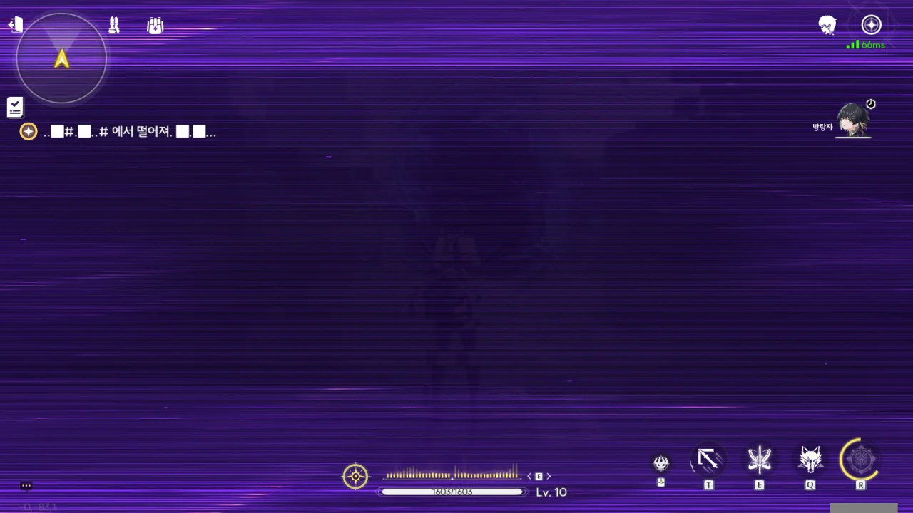
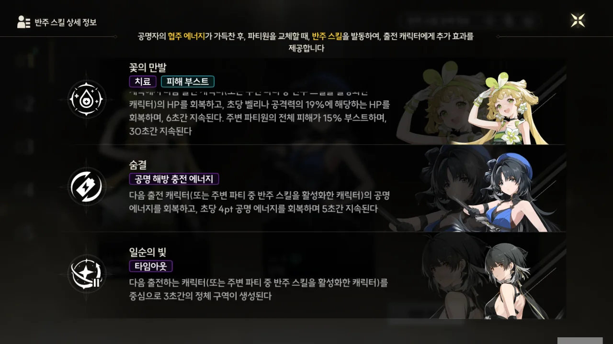



연구원에 들어왔지만 여태 설지로부터 답이 없는 걸 보면, 설지는 지금 눈코 뜰 새 없이 바쁜 모양이다.

마침 눈앞에 있는, 설지와 연락이 닿을 거라는 안전과의 '모르테피'와 대화하기로 했다.

















"예산은 지금보다 줄이면서도 재료는 지금보다 더 좋은 재료를 쓴다"와 같은 말도 안 되는 소리를 내뱉는 투자자에게 보기 좋게 엿을 먹이고 있다.

그 와중에 투자자는 추하게 "나중 가서 후회하지 마시죠!"라며, 잡몹 대사 138번을 내뱉는다.





방금 멋졌다고 하니, "사람을 착취하는 자본가들의 썩어빠진 생각을 묵인할 생각이 없는 것뿐이다"라고 한다. 오... 멋진 말이다.





아차, 자기소개가 늦었다.

모르테피는 설지가 데이터 분석실에 있을 테니, 자기가 가서 말해주겠다고 말한 후, 떠났다.



'신연방' 출신의 실력 좋은 연구원인 모르테피는 전형적인 '차도남'인 것 같다.

모르테피는 차갑고 쌀쌀한 도시 남자. 하지만 아이들에게는 따뜻하지.



설지를 처음 봤을 때, 무음구역 안에서 설지가 하던 게 바로 '샘플링 데이터 정보 수집'이었나 보다. 수집한 정보 분석 결과는 오늘 중으로 나올 거라고 하는데, 그게 얼마나 빠른 건진 잘 모르겠다.

방랑자의 건강검진 준비는 이미 마쳤다고 한다.



신물에 대해 설명하자, 설지가 캡슐 사탕에 대해 짚이는 게 있지만 검증이 필요하다며, 모든 신물에 비파괴 검사를 시행해보고 싶다고 말한다.

비파괴 검사라는 말이 나올 줄은 전혀 예상하지 못했다. 뭐, 여긴 연구소니까 이런저런 검사를 진행할 수 있는 장비가 이미 다 마련되어 있겠지.



해시계 이외의 물품은 울림과 실험실에서 검사할 수 있지만, 해시계는 내부 구조를 파악하기 위함인지, 방사선 검출 장비가 필요해 안전과 흑석 관련 부서 담당자에게 신청을 해야 한다고 한다.

모르테피가 안전과 흑석 관련 부서 담당자라는 것도 놀라운데, 안전과 흑석무기 개발 특별 프로젝트의 책임자이기도 하다고 한다. 와...



설지가 모르테피를 데려왔다.

검사에는 약 20분이 소요되고, 분석 결과는 검사가 끝나고 5분 후에 볼 수 있을 거라고 한다.

방사선 검사가 필요한 물품이 해시계이니, 해시계를 모르테피에게 건넸다.



이 해시계가 모르테피가 아는 사람의 초기작과 비슷하다고? 나중에 모르테피에게 물어볼 게 하나 생긴 것 같다.

해시계 신물은 해시계치곤 가볍고, 일반적인 해시계와도 다르다고 한다. 해시계에 뭔가가 빠진 것 같다고 하는데, 빠진 부품을 찾아 금주를 돌아다녀야 하는 걸까?



밖에서 별달리 둘러볼 것도 없으니, 그냥 연구원 안에서 기다리기로 했다.



'오늘 포럼에 오르면, 세상을 알게 될 거야'라는 말이 무슨 말인진 모르겠지만, 한 스레드에서 누군가가 임상 실험 중인 제품을 사적으로 판매하려다 밴해머에 얻어맞은 건 잘 알겠다.





방랑자의 건강 상태와 공명 주파수에 비정상적인 변동이 있는지 확인하기 위한 검사 준비가 끝났다.





무음구역에서 방랑자가 마주쳤던 잔상은 노도급 이상이며, 그 잔상의 주파수 에너지를 그대로 몸으로 흡수한 방랑자의 몸에 어떤 이상이 생겼을지 알지 못한다고 한다.

잔상이 특정 주파수를 얼마나 갖고 있냐에 따라 위험도와 등급을 매기는데, 낮은 등급에서 높은 등급 순으로 「경파급」, 「거랑급」, 「노도급」, 「해일급」, 「명식」으로 부른다고 한다. 특수한 분류인 「명식」을 제외하면 전부 파도와 관련한 단어들이다.







잔상을 격파할 때 확률적으로 남는 잔향을 단말기에 기록하면 공명자의 명령에 따르는 에코로 만들 수 있다.



단말기의 기능 모듈을 통해 원본 잔상의 모습으로 변해 잔상의 능력을 사용할 수도 있다.

여기서 변한다는 건, 진짜로 몸이 잔상의 몸으로 변하는 느낌인가 보다. 단순히 잔상의 모습을 취하는 건 줄로만 알았는데... 잔상으로 변하면 어떤 느낌이 들까?







방랑자와 비슷한 사례는 역사 속 전설에 적힌 것이 전부이기 때문에, 방랑자에게 정확히 무슨 일이 생긴 건지 알아낼 수만 있다면, 그 전설이 진짜인지 아닌지 증명할 수 있다고 한다.

더 단순하게 말하면, 정확히 기록된 건 아직 없다.





그때 만났던 녀석 이름이 '크라운리스'였구나.

방랑자의 단말기에 크라운리스의 주파수 데이터는 없으며, 방랑자의 몸에서도 크라운피스의 주파수를 찾아볼 수 없다고 한다.



이렇게 직접 몸으로 잔상의 주파수를 흡수한 것이 방랑자에게 어떤 영향을 끼칠지 전혀 모른다고 한다.



'방랑자의 몸에 다른 공간이나 생물이 있는 것 같다'는 시적인 표현을 설지가 할 줄은 몰랐는데. 설지라면 늘 정확하고 명료한 표현만 쓸 것 같았거든.

설지는 그게 단순한 비유나 추측에 불과하다고 말하지만, 혹시 누가 알겠는가? 그게 제일 정확한 답일지? 마침 프롤로그에서 그 흰머리 여자가 방랑자의 가슴팍에 뭔갈 하지 않았던가.



결국 '실전 테스트'를 빙자한 싸움을 해야 알겠다는 거구나.

> **무음구역**
> 현재 학계에서는 「무음구역」이 잔상이 탄생하는 곳이라고 생각하며, 무음구역이 형성될 때에는 하늘을 뒤덮은 거꾸로 된 바다가 보이는 현상과 땅을 깊숙이 가르는 십자형 성흔 현상이 동반되는 경우가 많다. 무음구역에서는 수많은 잔향이 계속해서 반사, 교차, 중첩되고, 강렬한 흰빛이 현실과 그 반대편의 미지의 공간을 연결하며, 그 결과 무수한 잔상이 무음구역에 소환된다.
{.bq}

프롤로그에서 방랑자가 빠졌던 곳이 바로 '하늘을 뒤덮은 거꾸로 된 바다'였구나.

'강렬한 흰빛이 현실과 그 반대편의 미지의 공간을 연결'이라는 말을 보면, 방랑자가 원래 있던 곳은 흰빛 너머의 미지의 공간이었던 모양이다.



시뮬레이션 영역에 들어왔다. 단말기를 붙잡고 있었을 뿐인데, 이런 공간에 들어오다니, 정말 신기하네...



이 연구원에서 방랑자의 존재에 대해 알고 있는 건 설지 하나뿐이 아니었던 모양이다. "우담의 결론이 맞네요"라는 말은 설지 말고도 다른 연구원, '우담'이라는 사람이 방랑자의 신체에 대해 어떤 추측을 내놓았다는 말이잖아. 졸지에 모르모트가 된 기분이다.

방랑자의 신체기능은 잔상의 영향 없이 모두 정상이라고 한다. 방랑자의 공명 어빌리티의 주파수에도 별다른 이상은 없다고 한다.



테스트 끝!



설지와의 통신이 끊어지고 화면에 보랏빛 얼룩이 생겼다. 임무 내용 역시 '시뮬레이션 영역 떠나기'에서 '..나#.가..# 세요.█.█\.\.\.'로 변했다.

뭣. 임무 내용의 글자가 더 심각하게 바뀌었다. '..█#.█..#에서 떨어져.█.█\.\.\.'라니, 대체 무슨 말이지?



앞에 거대한 달이 뜬, 뭔가 이상하게 변한 시뮬레이션 영역에 들어왔다.

저 달에는 대기가 있는 것처럼 보이는데, LOCAL58의 Skywatching 영상이 떠오른다.



여기서 나온 '달'도 대기를 갖고 있거든...





앞에 쪼그려 앉아 손 안의 보랏빛 무언가를 보고 있던 여성체 모양의 잔상이 방랑자를 발견하더니, "우리 엄마 곁에서 떨어져"라고 외치며 방랑자에게 달려든다.

저 그림자, 어디서 본 것 같다 생각했는데, 크라운리스의 잔향을 흡수했을 때 본 그림자와 똑같이 생겼다.

아니, 그래서 네 엄마가 누군데요. 이놈이고 저놈이고 죄다 모르는 말만 해대고 있잖아? 누굴 놀리는 것도 아니고...



두통과 함께 정신을 차려보니, 양양이 방랑자 옆에 있었다.

시뮬레이션 영역 안에서 통신이 끊어진 건 확실히 이상하다. 시뮬레이션 영역은 연구원의 온전한 통제 안에 있어야 하는 거 아냐?



아무튼, 방금 있었던 일을 설지에게 이야기해 준다.



이런 일은 시뮬레이션 영역을 구축한 이래로 처음이라고 한다.

아, 뭐 그러시겠죠... 게임 주인공은 어딜 가나 '세계 최초', '역사상 최초'의 타이틀을 따내는데 전문가 아닌가.



음의 영역, 소노라는 좋은 일, 나쁜 일을 가리지 않고 과거에 일어난 일을 재현한다고 한다.

그리고 연구원의 시뮬레이션 영역은 그 소노라를 본떠 만든 것이라고 한다.



시뮬레이션 영역은 가능한 한 최대로 순수한 에코 에너지를 추출하지만, 이상 주파수를 100% 걸러낸다고 할 수는 없다고 한다.



시뮬레이션 영역의 원본은 과거의 일을 재현할 수 있으니, 이를 본떠 만든 시뮬레이션 영역 역시 과거의 일을 재현할 수 있다고 볼 수 있다.

방랑자가 시뮬레이션 영역 안에서 겪었던 건, 어쩌면 방랑자가 잃어버려 잠재의식에만 남아 있는 기억과 관련이 있을 수도 있다는 말이다.





시뮬레이션 영역의 문제와는 별개로, 검사 결과, 방랑자의 신체는 매우 건강하다고 한다. 그건 그래도 좋은 소식이네.

***



튜닝 기능이 열렸다. 쉽게 말하면 가챠다.

게임이 안내하는 건 상시 캐릭터 가챠인 '캐릭터 레귤러 튜닝'이지만, 상시 가챠에 재화를 쓰지 말고 '초보자 튜닝'에 재화를 쓰는 게 더 경제적이다.

딱 한 번만 쓸 수 있긴 하지만, 초보자 튜닝은 천장이 50회로 굉장히 낮기 때문에, 같은 재화를 써도 5성 캐릭터를 볼 확률이 더 높다고 할 수 있다.



10 연차와 20 연차에는 별다른 게 나오지 않았다. 양양이 1돌이 된 건 좋다고 해야 할까?



30 연차에는 산화가, 40 연차에는 모르테피가 나왔다.



5성은 연출부터가 아예 다르구나.

힐러, 벨리나가 나왔다. 벨리나의 영어 명칭은 Verina인데, 이걸 그대로 읽으면...

아무튼 첫 5성 캐릭터로 농ㅋㅋ 캐릭터가 나와서 기분이 좋다. 귀여운 게 최고지, 암.

만약 여기서 능양 같은 캐릭터가 나왔다면 리세마라를 심각하게 고민했을 것이다.



다음 열리는 튜닝인 '초보자 자유 선택 튜닝'은 앙코를 골랐다. 감심과 앙코 중 조금 고민했는데, 딜러를 데려가는 게 아무래도 더 좋지 않을까 해서이다.

일단은 파티를 이렇게 짜보았다. 이렇게 파티를 짜는 게 맞는 건가 싶긴 한데...
