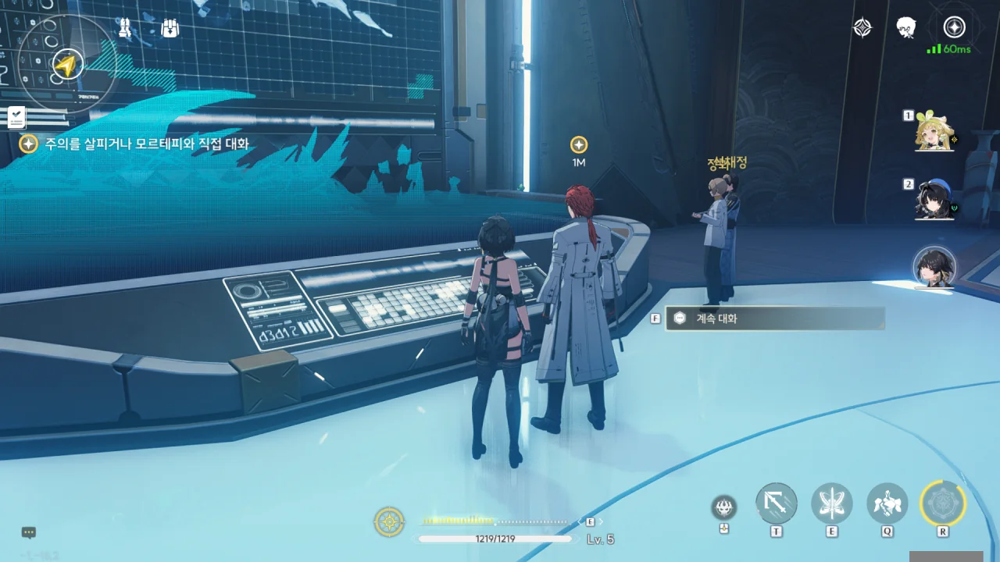
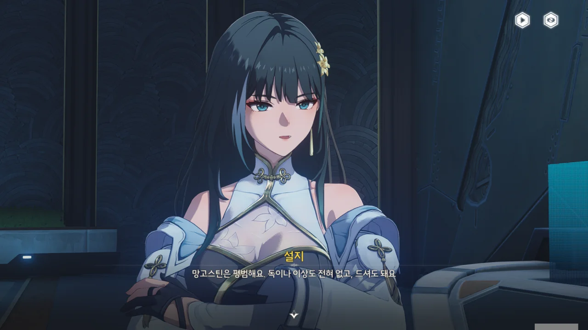
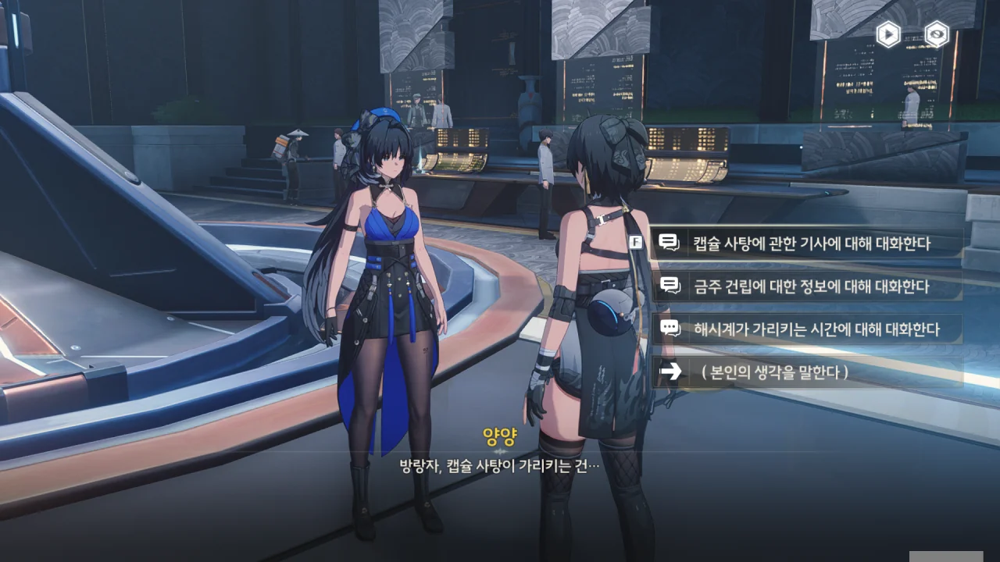
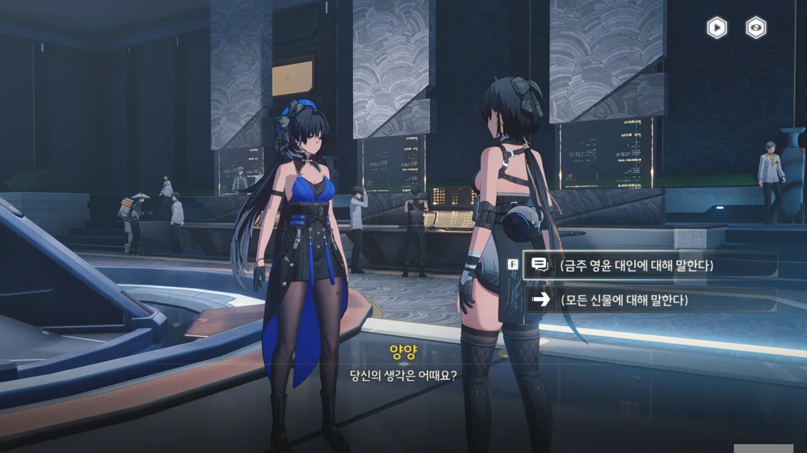



드디어 해시계의 검사가 끝났다.



이 해시계는 그냥 해시계가 아니라, 내부에 빈 공간이 있어 거기에 작은 종이 두루마리를 보관하고 있는 기관장치라고 한다.

분명 이 장치는 「다빈치코드」에 나온 '크립텍스'와 비슷한 장치일 것이다. 장치를 힘으로 열려고 하면 안에 든 종이를 읽을 수 없게 파괴하는 장치가 같이 달려 있겠지.

그러니 장치의 암호를 알아내어 종이를 무사히 꺼내 읽는 게 일차적인 목표가 될 것이다.



이 해시계에는 핵심 부품이 하나 부족해, 기관장치를 해제할 수 없다고 한다. 그러면 다른 신물은 그 빠진 부품이 어디에 있는지 알려주는 역할인 걸까?



모르테피를 칭찬하자, 자신은 그저 기관장치에 대해 조금 알고 있을 뿐이며, 연구원에는 자신보다 뛰어난 기관술 전문가가 있다고 겸손하게 말한다.





그럼 그 기관술 전문가를 찾아가면 되지 않을까?

하지만 모르테피는 괜히 그럴 필요 없다며, 아주 조금 시간이 필요한 것뿐이니, 자기가 하겠다고 한다.





모르테피가 갑작스레 걸려온 전화를 받는다.

소식이 빠르다... 데이터가 좋다... 대체 무슨 말일까? 설마 우리 일과 관련한 일일까?



'말 잘 듣는 고양이'라니 ㅋㅋㅋㅋㅋㅋ 이 선택지는 너무 무례한 것 같아, 그나마 멀쩡해 보이는 선택지를 골랐다. 그런 비유는 모르테피에게 좀 더 익숙해진 후에...

그나저나 방랑자가 모르테피에게 부탁한 건 해시계의 분석뿐이었는데, 어느샌가 해시계 기관장치의 해제까지 나서서 처리하고 있다. 굉장히 열정적이네.

모르테피가 이해되지 않는 건 아니다. 나 같아도 누가 이런 흥미로운 *장난감*을 가져오면 궁금해서라도 뜯어볼걸?



모르테피가 지금은 좀 바쁜 듯하니, 조금 있다 오기로 했다.



방랑자의 존재가 예상외로 연구원에 널리 퍼져 있었다.

방랑자가 신체로 에코를 흡수했다는 사실, 금희에게 지목된 금주의 손님이란 사실, 오늘 화서연구원에 올 거란 사실 등이 연구원에 널리 퍼져있다. 보통 그런 건 기밀로 처리하지 않아...?

> 그럼요, 이 걸어 다니는 소중한 소재를 자발적으로 실험대에 올라가게 할 거야! 반드시!

이 사람, 미친 거 같아요... 살려줘... 방랑자를 원숭이에 비유한 것도 너무하긴 하지만, 이건 진짜 무서울 정도야...

그나저나 전설 속 이야기 말고도, 약 100년 전, 흑발에 금안을 가진 사람이 나타나 에코를 흡수한 적이 있었다고 한다. 방랑자 역시 흑발에 금안이니, 이 정보는 나중에 도움이 될 수도 있겠다.

조사해 볼 수 있는 건 다 해본 것 같은데도 여전히 모르테피가 통화 중이라, 실례를 무릅쓰고 모르테피에게 말을 걸기로 했다.





상대방의 작업실을 '개판 오 분 전'이라고 하면서도 상대방의 실력을 인정하는 걸 보면, 모르테피와 통화 상대는 악우 관계인 것 같다.



해시계를 복구하기 위해선, 채워 넣은 부품이 두 부분에 동시에 맞아떨어져야 한다고 한다. 매립형 바늘, 하향 자동 버클이 뭔지는 잘 모르겠지만.





'상리요'의 작업실에 조립 부품이 든 상자가 있으니, 그걸 가져와 달라고 한다. 직접 가지 않고 우리에게 가져다 달라는 이유는, 뭐, 사이가 안 좋아서이겠지.

설마 했는데, 상리요가 모르테피가 말한 그 기관술 전문가라고 한다.



모르테피가 상리요의 작업실을 '깔끔한 현대 문명인에게는 치명적'이라고 하는데... 설마 그 정도겠어? 그냥 잡동사니가 어지러이 널려있는 정도겠지.



모르테피의 말과는 달리, 상리요의 작업실은 깨끗하기 그지없었다. 이게 난장판, 개판 오 분 전이라면, 이 세상에 말끔하게 정돈된 곳은 없다.





대놓고 '여기에 팔을 넣어주세요'라고 외치는 기계가 있길래 팔을 넣었더니 대미지를 입었다.

농담이 아니라, 진짜로 체력이 닳았다.





신문에서 오려낸, 아기를 바라보는 여성 연구원의 사진이 있다. 상리요는 여성인 건가?





선반에서 떨어진 나뭇조각에 대미지를 입었다.



이게 모르테피가 말한 그 부품 상자인가 보다.



상리요의 부품 상자를 모르테피에게 건네주었다. 마침 신물의 분석 결과도 나왔다.

일단 망고스틴은 평범한 망고스틴 열매라고 한다. 독도 없고, 그냥 먹어도 된다고 한다.





잔상 주파수 변동이니 뭐니 하는데, 결론만 말하면, 이 보라색 나뭇잎은 「비명 이상」의 영향으로 인해 이렇게 된 거라고 한다.



「비명 이상」은 「비명」 이후 발생한, 무음구역, 하늘바다, 역행비 등의 다양한 이상 현상을 일컫는 말이다.



캡슐 사탕은 사탕이 아니라, 먹는 형태의 백신 혈청이라고 한다. 저온에서 2년간 보관할 수 있지만, 유통기한은 20년 전에 끝났다.

그 이야길 들은 양양이 이 사탕이 20년 전 있었던 어린이 전염병과 연관 있을 것 같다고 말한다.



다행스럽게도 캡슐 사탕에 대한 정보는 연구원 공공 기록 보관소에 있다고 한다.

보관소의 파일 보관 방법이 특이해, 키워드를 검색하면 자료를 직접 보여주는 게 아니라, 자료가 보관된 진열대의 좌표를 얻는다고 한다.



모르테피가 누락된 부품을 해시계에 장착했다. 정확한 방위 정보와 시간을 바늘 버클의 방향에 맞추면 기관함이 열릴 거라고 한다.

방위와 시간을 각각 맞춰야 할 거라고 생각했는데, 부품의 생김새를 보니 둘 중 하나만 맞추면 될 것 같다. 아니면 내가 부품을 잘못 본 것이거나.







십이지와 사상 이야길 들은 양양이 잠시 고민하더니, 십이간지를 바탕으로 만든 황룡의 기록법, 「간지 기법」을 떠올린다. 달력이나 명칭 분류에 쓰였지만, 지금은 복잡해 잘 쓰이지 않는다고 한다.

하지만 황룡의 대형 데이터베이스, 「황룡 아카이브」는 간지 기법을 사용했고, 이에 따라 대부분의 데이터 자료관 역시 간지 기법을 여전히 사용하고 있다고 한다. 연구원의 기록 보관소 역시 간지 기법을 사용하고 있고.

사건의 시간에 따라 파일을 분류하고 나열하는 게 「간지 기법」이라는데... 그거 그냥 편년체잖아.

그나저나 「황룡 아카이브」라니, 뭔가 좀 깨는 이름인걸.



> **해시계**
> ***
> 금희가 주는 신물 3
> ***
> 완전한 해시계 스타일의 기관함. 안에는 복층이 있으며, 무언가를 숨길 것 같다.
> 이제 해시계의 양륜 룰렛이 돌아갈 수 있고, 올바른 방향과 시간 정보를 찾으면 기관함을 열 수 있을 것 같다.
{.bq}



터미널에서 캡슐 사탕 백신과 관련한 정보를 찾았다. '미'열이라고 한다.





바이러스성 질환인 '피열'의 백신, '캡슐 사탕'이 3상 임상실험을 통과한 건 '6월 16일 오후 3시'라고 한다. 질병이 처음 확인되었거나 유행할 때가 4월이었으니, 고작 2개월 만에 안정적인 백신을 개발한 것이다.

백신의 1상 임상실험에는 놀랍게도 상리요의 이름이 있었다. 백신 연구팀 총책임자였던 그의 어머니, 상리효가 백신을 제일 먼저 자신과 아이에게 실험한 것이다. 상리요의 작업실에 있던 사진에 나온 여성 연구원은 상리효였던 것 같다.

피열 바이러스가 맹위를 떨치던 와중, 엎친데 덮친 격으로 잔상류까지 폭발해 운송 노선이 중단되는 일이 발생했다. 백신을 수송하기 위해 일곱 팀을 파견했으나, 백신의 유효기간 내 목적지에 도착한 팀은 단 하나였으며, 거기에 동행한 공명자가 하나 있었다.

고강도의 전투를 겪었음에도 안정적인 파형을 유지한 그 공명자의 데이터는 「제1호 공명자 보고서」에 적힌 데이터와 매우 유사했다. 하지만 그 공명자와 제1호 공명자의 시간 간격은 상당히 길었던 모양이다. 정황상 제1호 공명자가 등장한 건 '미년 건주'라고 하는데, 여기서도 '미'가 나온다.



두 번째 사진은 아마 상리효와 그녀의 아들, 상리요겠지?



제1호 공명자는 금주가 성립되기 전 발견된 공명자라고 한다.

방랑자와 마찬가지로, 그의 성흔은 오른손 손등에 위치해 있었으며, 운릉 협곡에서 크라운리스와 전투를 벌여 이겼다.

다만 제1호 공명자는 공명 어빌리티에 대한 기억만 잃은 것으로 보이는데, 방랑자는 거의 모든 기억을 잃었다.

「용의 별자리」가 뭘 뜻하는 건진 모르겠지만, 아마 금주의 수호신과 연관이 있는 게 아닐까 생각된다.



운릉 협곡 전쟁이 일어나고, 금주가 행정구역으로 설립되었으며, 변정과 화서연구원이 설립된 것도 모두 같은 해, 미년이었다. 그리고 그 해, 금주가 설립되기 전, 제1호 공명자가 발견되었고.

방랑자가 지금 나타난 것은 단순한 우연이 아닌 걸까? 제1호 공명자, 20년 전 나타난 공명자, 방랑자 셋이 서로 비슷한 점이 있다는 건 단순한 우연이 아닐 것 같은데...





그 옆에는 잔상과 연구원에 대한 문서가 있었다.





공명자이건 아니건 피열 바이러스에 걸린 아이는 죽거나 다른 문제 --- 아마 영구적 후유증일 것이다 --- 가 생겼다고 한다. 게다가 잔상류 때문에 다른 지역과의 연락이 끊겨, 자원마저 한정된 상황이었다. 그 악조건 속에서 백신을 만들어내고, 자신의 아이마저 실험체로 쓴 사람들이야말로 영웅이 아닐까?



이 캡슐 사탕을 통해 금희가 방랑자에게 알리려는 게 대체 뭘까? 방랑자는 그 백신 덕분에 목숨을 구한 아이 중 하나였던 걸까?



어쩌면 금희가 알리고자 했던 건 보고서 속 「제1호 공명자」였을지도 모른다. 방랑자와 닮은 점이 있잖아? 20년 전 공명자는 제1호 공명자와 방랑자를 이어주는 연결고리고.







금주는 황룡에서 가장 늦게 건립된 주(州)이며, 운릉 산맥 너머에 있는 유일한 주이다.

잔상류는 북락 광야에서 생겨나 그 이동 경로를 추적 가능했지만, 전사자들의 원한과 생존자들의 공포가 만들어낸 잔상, '크라운리스' 때문에 행진 경로가 바뀌어 추적이 힘들어졌다고 한다.





방랑자가 마주한 잔상 역시 기록상의 크라운리스와 비슷한데, 크라운리스는 가장 위험한 잔상, 「명식」과 관련이 있을 거라 여겨진다고 한다.

운릉 협곡 전쟁 이전에 명식 전쟁이란 것도 있었나 보다.







일단 해시계를 여는 데 필요한 시간 정보가 '미'라는 것은 확인했다. 아직 방위 정보는 모르지만.







금희가 내놓은 정책 중, 나이에 맞지 않게 심오한 정책 대부분에 「장리」 참사가 관여했다고 한다. 장리 참사는 금희의 스승인데, 중정성 장사였지만 자청하여 금희의 보좌 참모가 되었다고 한다. 하지만 속이 검고 심보가 나빠, 간신 이미지가 붙었다.

이 사람에 대해 뭐라 섣불리 판단할 수가 없다. 최근 들어 종종 '겉보기에는 간신이지만 그 실상은 더할 나위 없는 충신'인 캐릭터가 보이거든. 이유도 다양한 것이, 주군의 이미지를 위해 일부러 욕받이를 자처하거나, 나라의 썩은 부분을 도려내기 위해 일부러 역모를 꾸미기도 한다. 장리 참사 역시 그런 캐릭터라면, 지금 여기서 내가 욕을 했다간 굉장히 미안해지게 되지 않겠는가.

에이, 설마 그렇게 일차원적으로 해 먹겠어?



방랑자가 드디어 입을 열었다! 여태껏 더빙 없이 선택지로만 말하던 방랑자가 드디어 성대를 쓰기 시작했다! 와, 나 조금 감격스러워.

방랑자는 하나의 신물이 하나의 목표만이 아닌, 여러 개의 목표를 가리킬 수도, 하나의 목표가 어려 정보를 포함할 수도 있다고 생각한다.

그리고 지금 확실한 건, 캡슐 사탕이 주는 정보에 해시계를 열 단서가 있다는 거다.



신물을 통해 금희가 제공하고자 하는 정보는 두 분류로 나눌 수 있다.

1. 방랑자가 알고 싶어 하는 정보
2. 금희가 방랑자에게 알려주고 싶은 정보

지금 지나친 정보로 인해 혼란이 오는 이유는 이 두 정보가 서로 섞여 있기 때문이다. 어느 게 방랑자가 알고 싶어 하는 정보인지, 금희가 알려주고 싶은 정보인지 알기 어려우니까.



이렇게 보니 지금까지의 상황이 어느 정도 이해가 되네.

분명 산화는 '금희가 버틸 수 있는 시간'이라고 말했다. 금희가 도움을 필요로 한다고도 말했고. 따라서 금희는 현재 위급한 상황에 처했다고 추측할 수 있다.

위급한 상황에 처한 금희는 방랑자의 도움이 필요하다. 상황이 급하기 때문에, 방랑자를 몰래 찾을 시간은 없을 것이다. 따라서 혼란을 감수하고 금주 전체에 녹화 방송을 뿌려, 방랑자가 변정으로 찾아오도록 만든다. 어차피 선별은 산화가 할 수 있을 테니까.

방랑자가 변정으로 찾아왔다고 하더라도, 방랑자를 완전히 믿을 수는 없다. 금주성에 들어갈 때 보여주었던, "사랑하는 운명의 씨앗" 운운하던 흰옷의 여자의 존재로 미루어 추측하건대, 금희와 적대하는 세력이 있는 게 아닐까 생각된다. 그렇다면 방랑자가 이들과 먼저 접촉해, 포섭되었을 확률도 간과할 수는 없겠지.

그렇기에 금희는 신물에 정보를 과다하게 담았다. 어느 정보가 진짜 핵심이 되는 정보인지 알기 어렵게 만들어 시간을 끌고, 그동안 방랑자가 신물에 담긴 수수께끼를 어떻게 푸는지 관찰하기 위해서겠지. 장담할 수는 없지만, 분명 방랑자에게 미행이 붙었을 것이다. '「야귀」에 척후 역할을 하는 부대가 있다'라고 산화가 말해주었지 않았는가.



나머지 신물에 담긴 수수께끼를 풀면 어떤 정보가 어느 분류에 속하는지 알 수 있을 것 같다.



> **캡슐 사탕**
> ***
> 금희가 주는 신물 4
> ***
> 캡슐 사탕 모양의 경구 백신 제제. 어릴 때의 달콤함이, 한 세대의 금주 사람들이 함께 시험을 극복하는 공통의 기억이 되었다.
{.bq}
