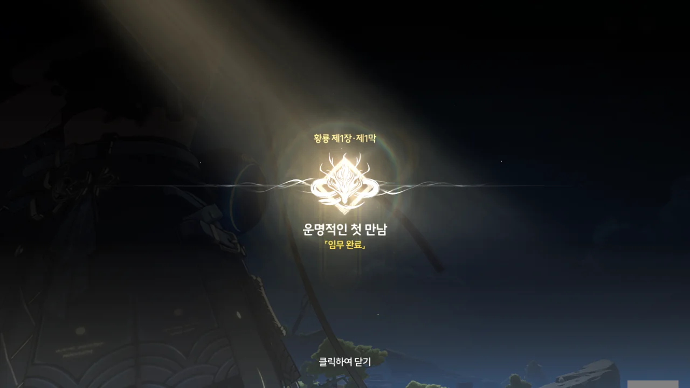
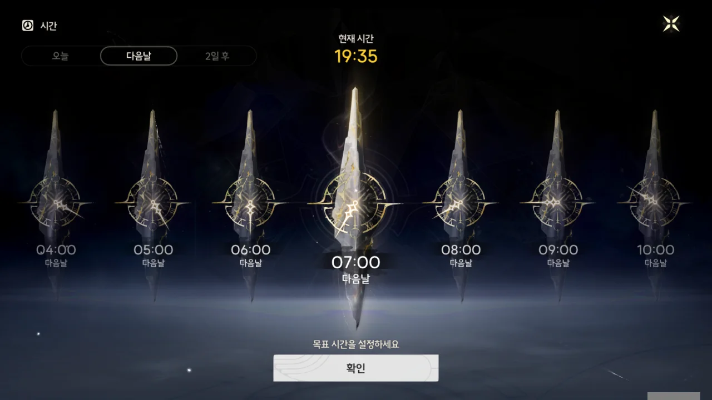
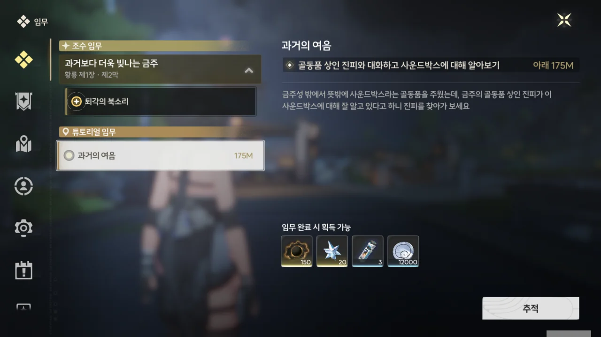
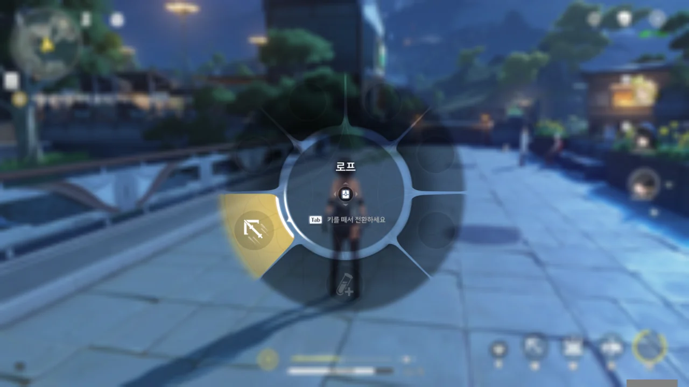
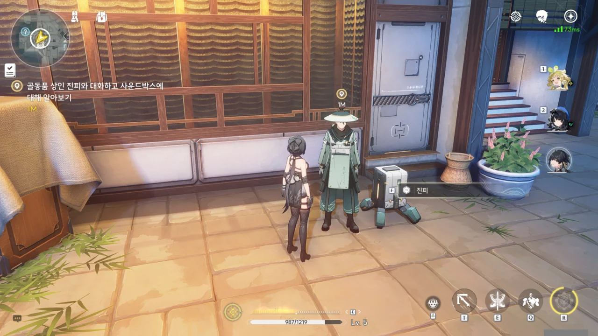
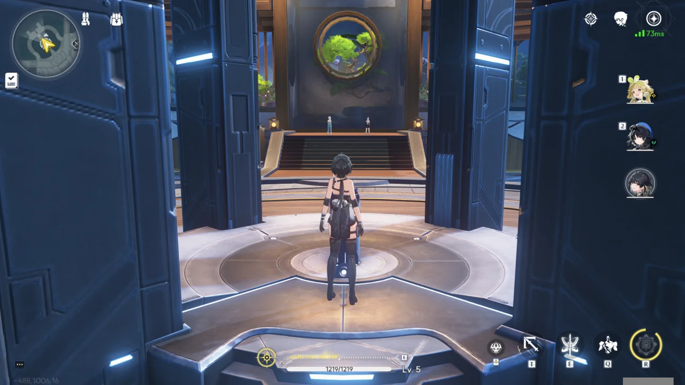
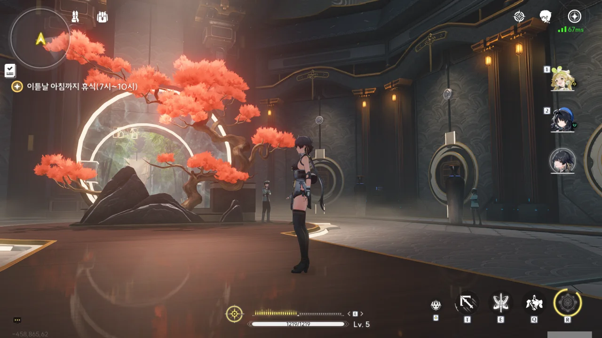



머리 아픈 이야기만 하다, 치샤를 보니 괜스레 반갑다.



'민원 내용치곤 죄다 시시한 것뿐이네'라고 생각하던 찰나, 실종 신고가 있다는 말이 눈에 들어왔다.

방랑자와 관계없다고는 하지만, 앞으로 방랑자와 관계가 생길 수도 있지 않겠는가?



그래서 '내일 저도 함께 가볼까요?'라는 선택지를 골랐다. 정보는 정리하기가 어려워서 그렇지, 많을수록 좋은 거다.

그리고 곧바로 치샤에게 "그럼, 신물 조사는 누가 해?"라는 답변을 들었다. 음...



오늘은 너무 늦었으니, 내일 아침에 「판화반점」에서 모이기로 했다.

방랑자는 산화가 변정에 숙소를 마련해 주었으니, 거기서 묵을 생각이다.



어... 그렇게 좋은 것만은 아닐걸? 변정에 묵으면 그만큼 저쪽이 감시하기 쉬울 거 아냐.

다른 곳에 묵는다고 해도 감시가 떨어질 것 같진 않지만...





방랑자 뒤를 붉은 옷의 두 사람이 멀리서 지켜보고 있고, 그 둘을 산화가 지켜보고 있다.

이거, 나 트위터에서 봤어!



제1장 황룡 제1막 \[운명적인 첫 만남\] 완료!

이제 제1장 제1막이라고...? 글 쓰는 데 걸린 시간이 이렇게 길었는데?

시간을 돌릴 수 있지만, 변정 숙소에서 묵어보고 싶었기 때문에, 시간을 돌리지 않았다.

아, 이 튜토리얼 임무도 해야 하고. 대체 사운드박스가 뭘까?

탐색 모듈의 변경은 <kbd>Tab</kbd>키였다.

이 사람이 골동품 상인 진피구나. 뭔가 수수하게 생겼네.





치샤의 본명이 '마소방'이라는 설정은 여전히 유효한가 보다.



사운드박스를 찾기 위해 진피가 산도 넘고 물도 건넜다고 하는데, 정말 그랬을 것 같지는 않고, 그냥 미사여구인 것 같다.





사운드박스는 실체가 없는 에너지이며, 비명 이전의 문명화된 광경이나 큰 재난에 직면했을 때의 인간의 가장 강렬한 감정 같은, 과거의 소리를 담고 있다고 한다.





사운드박스에 금전적 가치는 없지만, 자신 같은 골동품 상인은 사운드박스에 담긴 옛날 울림을 수집하길 원하므로, 사운드박스를 가져다주면 클램 코인과 교환해주겠다고 한다.

사운드박스에 금전적 가치가 없는 게 확실해...? 세상 사정에 어두운 방랑자를 등쳐먹으려고 하는 것처럼 들리는데...



치샤가 진피는 사기를 칠 사람이 아니라고 하니, 치샤를 믿고 진피에게 사운드박스를 주기로 했다.

만약 진피가 방랑자에게 사기를 친 거라면, 치샤가 잘 처리해 줄 것이다.



> 음... 세상의 모든 것은 제 자리에 있을 때 빛이 나는 것...

거 참, 정말 좋아하네...



갖고 있던 사운드박스를 제출하자, 진피 옆에 있던 로봇이 미친 듯이 좋아라 하며 난리법석이다.

왜 진피가 아니라 네가 좋아하는 거냐 ㅋㅋㅋ...

중추 비콘과 상호작용할 수 없는 걸 보면, 중추 비콘의 회복 기능에는 상한선 같은 게 없나 보다. 이건 좋네.

그런데 대체 변정 숙소는 어디야? 금주 곳곳을 돌아다닌 것 같은데, 숙소처럼 생긴 곳을 단 한 번도 보질 못했다.

산화야, 혹시 날 속인 거니?
