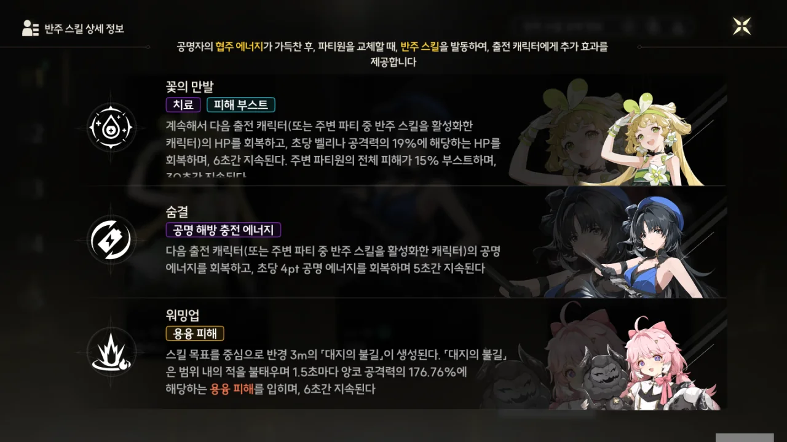
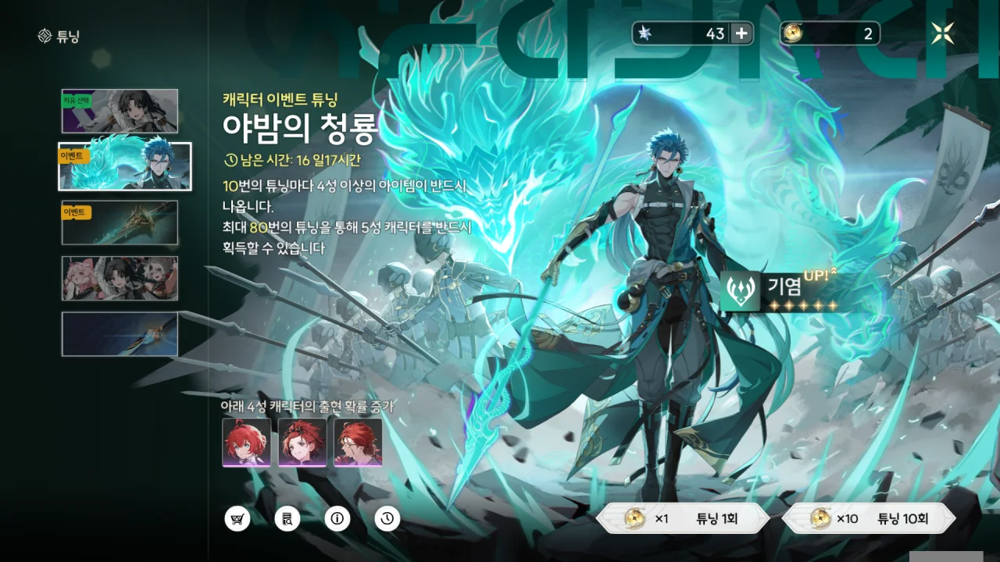
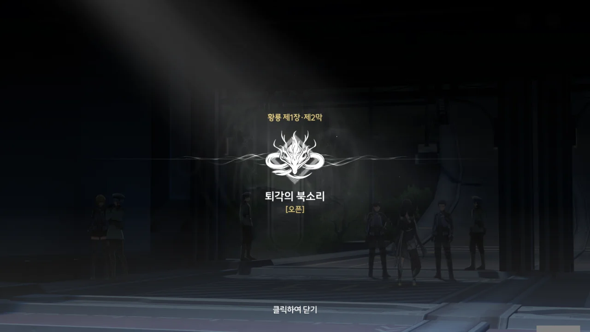
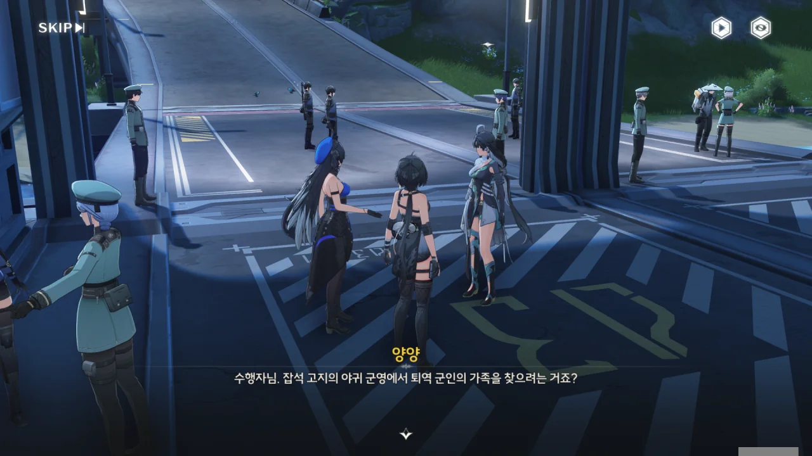
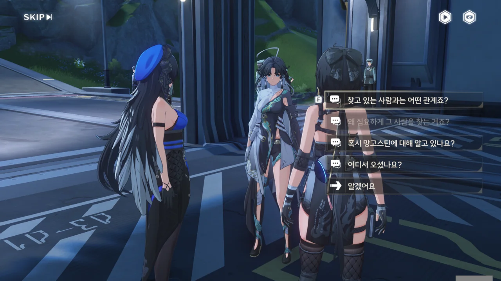



쿠로게임즈에서 성원에 대한 감사의 의미라며 레큘러 5성 캐릭터를 마음대로 하나 뽑을 수 있는 「조수의 감사 쿠폰」을 하나 뿌렸다.

그래서 저번에 '초보자 자유 선택 튜닝' 대상으로 선택한 앙코를 감사 쿠폰으로 뽑고, 그다음 순위였던 감심을 '초보자 자유 선택 튜닝' 대상으로 선택했다.

아, 앙코 귀여워라.

파티 구성도 바꾸어서, 방랑자 대신 앙코가 딜러로 들어가게 되었다. 이래도 스토리 진행엔 문제없겠지?

「금빛 파도의 무늬」가 좀 쌓였는데... 기염을 한 번 돌려볼까?



단 10 연차만에 기염이 나왔다. 아... 아니, 이렇게 운이 좋을 수가!



이렇게 운이 좋은 날이라면, 무기 튜닝에서도 단번에 5성 무기를 뽑을 수 있을 것 같아 무기 튜닝을 시도했다. 4성 무기가 아니라 4성 캐릭터인 '도기'가 나왔다.

왜 무기 튜닝에서 4성 캐릭터가 나오는 거야...? 이거, 무기 튜닝 아니었어?



남은 금빛 파도의 무늬를 전부 써보았지만, 설지와 치샤만 나왔다. 뭐, 그래도 게임 초반에 만난 캐릭터는 다 모였네.

기염을 10 연차만에 뽑은 걸 제외하면 죄다 꽝인 셈이다. 뭐, 기염을 뽑았으니 만족해야겠지.

***



가게 이름이 왜 「판화반점」인가 했는데, 가게 주인 이름이 '판화'여서였다.

그런데 아침부터 매운 탕면이라고? 그렇게 먹으면 속에서 탈 안나? 어우, 생각만 해도 속이 아파온다.



판화 이모가 음식을 가져다주는 장면 다음에 곧바로 맛을 묻는 건 무슨 의미인 걸까? 방랑자는 아직 음식을 먹지도 못했는데. 설마, 대충 먹었다고 치는 건가?

이를 지적하는 선택지를 골랐지만, 깔끔하게 무시당했다.



설지는 어제부터 계속 연구원에 틀어박혀 있다고 한다. 대체 뭘 수집했기에 그러는 걸까? 아, 설마 방랑자의 데이터를 연구하고 있는 거야?

치샤가 방랑자를 연구원 입구에 묶어두면 연구원 사람들을 전부 밖으로 끌어낼 수 있지 않겠냐는 농담을 한다.

... 그저 웃지요 하하하하 ㅋㅋㅋㅋㅋㅋ



워낙 정신이 없어서 몰랐는데, 치샤의 말대로, 금희가 준 네 개의 신물 중 두 개의 수수께끼를 풀었다.

캡슐 사탕은 사실 경구 투약 백신이었으며, 거기서 방랑자와 비슷한 특징을 가진, 과거의 공명자에 대한 정보를 얻었다.

모르테피 덕분에 누락된 부품을 채워 넣은 해시계는 해시계를 여는데 필요한 두 암호 중 하나인 '미'를 알아냈으며, 이제 남은 건 방위와 관련한 나머지 암호를 알아내는 것뿐이다.





남은 두 신물은 망고스틴과 이상한 나뭇잎. 둘 중, 망고스틴을 먼저 조사해 보기로 했다. 그 선택지가 가장 위에 있었기 때문이다.

망고스틴은 금주에서 나지 않기 때문에 항구를 통해 들여온다. 그럼 이 망고스틴이 어디서 온 건지 알아내야겠네.



'제일 처음의 꿈'이 뭔지 몰랐는데, 정황상 게임을 시작하자마자 본 바로 그 장면인 것 같다.

거기에 방랑자 말고 다른 흑발 소녀가 있었나 하고 찾아보니, 흑발이라면 흑발이라고 할 수 있는 머리색을 가진 소녀가 있긴 했다. 아니, 솔직히 그 색은 검은색이 아니라 회색이라고 불러야 하는 거 아냐?

그런데 방랑자의 손등에 있는 성흔에서 빛의 선이 뻗어 나왔다고? 정말? 왜 난 처음 듣는 이야기지? 게다가 그게 떨어진 곳이 운릉 협곡과 북락 광야인 건 어떻게 안 거야?



아, 이제야 하늘바다가 뭔지 알겠다. 하늘바다는 말 그대로, 하늘에 있는 바다였다. 처음 방랑자가 물속에 떨어졌다가 수면 위로 올라왔을 때, 방랑자는 하늘에 떠있는 바다에 거꾸로 매달려 있었다. 바로 그게 하늘바다였던 거야... 하늘에 바다가 거꾸로 떠있다니, 무음구역 이상현상 중 하나인 게 전혀 이상하지 않네.

방랑자의 손등에서 나왔다던 빛의 선은 아직도 뭔지 모르겠다.





그 소녀를 과연 찾을 수 있을까? 아예 이곳과는 다른 공간에 있는 것 같던데.

금희가 준 신물이 없었어도 방랑자의 기억을 찾기 위해, 방랑자의 성흔에서 나온 빛이 떨어진 곳, 북락 광야로 가야 했겠네. 북락 광야는 과거 명식 전쟁이 일어난 곳이며, 지금은 잔상류가 생겨나는 곳이자 야귀군의 최전선 주둔지이다.

아쉽게도 치샤는 일 때문에 방랑자와 함께하지 못하게 되었다. 약방의 감초처럼 딱딱한 분위기를 풀어주는 치샤가 없다니, 안타깝다.



성을 나가기 전에, 능력치를 향상하고 가라는 튜토리얼이 나온다.



'결정 웨이브 플레이트', 즉 피로도를 소모해 캐릭터 성장 재화, 무기 성장 재화, 클램 코인을 얻을 수 있다.

클램 코인에 피로도를 쓰는 건 낭비이니, 나머지 둘을 골고루 했다. 오늘 AP 다 뺐네!



성문의 경계와 방어가 강화되었다고 한다. 어차피 우린 나갈 건데, 상관없는 거 아냐?

제1장 황룡 제2막 \[퇴각의 북소리\] 오픈!

'퇴각'이라고 하니, 뭔가 여기서 좋지 않은 일이 일어날 것만 같다.



어이쿠, 경계가 강화되었다는 게 들어오는 것뿐만 아니라 나가는 것도 막는 거였어? 게다가 통행 권한이 없으면 오갈 수도 없고?

이 '수행자'라는 사람은 보초가 몇 번이고 교대할 동안 버티고 서있었던 모양이다. 고집이 참 세네...



어제 정오에 본 사람을 기억할 정도로 기억력도 좋다. 보통 그런 건 잘 기억하지 않잖아?

실종자 할아버지...? 전에 치샤가 실종 신고가 하나 들어왔다고 하지 않았어? 와, 그때 지나가며 말했던, '앞으로 방랑자와 관계가 생길 수도 있지 않겠냐'라고 했던 게 정말 사실이 된 모양인데? 이 정도면 게임 스토리 점쟁이를 해도 되지 않을까?



이 봉쇄는 공명 어빌리티를 통해 잔상과 싸울 수 있는 공명자라고 해도 통과할 수 없다고 한다.

> 다 백성들의 안전을 위해 필요한 절차입니다.

'백성'이라는 단어가 중국에서는 '인민' --- 시민(市民)과 비슷한 뜻이다 --- 과 별다른 차이가 없는 단어이지만, 한국에서는 과거 '골품제의 하위에 위치한 사람', '양인'을 이르던 말이라, 뭔가 비교적 낮은 위치에 있는 사람을 지칭하는 단어로 들린다.

여기선 백성이라 하지 말고, 주민(州民), 국민(國民) 등의 단어를 썼으면 좋았을 텐데... 하다못해 공민(公民)이라 해도 좋았을 것이다.



병사의 말을 들어 보니, 병사들은 무턱대고 수행자를 통과시키지 않은 게 아니라, 수행자가 찾고 있는 사람에 대한 정보를 이미 북락 광야 쪽으로 보내, 거기 부대에서 자체적으로 사람을 찾도록 했다고 한다.

그러면 일단 소식이 올 때까지 기다리면 되는 거 아냐? 이 사람은 왜 자꾸만 성문 밖으로 나가겠다고 하는 걸까?



"약속을 한 이상, 최선을 다해야 한다"라고...? 아무리 그래도 그렇지, 이건 좀 과한 것 같은데.

> 제가 여기 있는 게 방해가 되신다면, 다섯 걸음 물러나서 숨어있을 수 있어요.

수행자가 이 말을 하며 정말 다섯 걸음 뒤로 물러나더라.



그래. 언제 소식이 올지 모르는데, 무턱대고 여기에 서서 버티는 건 많이 이상하게 보인다.

> 통행권이 갑자기 하늘에서 떨어지는 일도 없을 겁니다.

'어... 그거 난가?'라고 하는 듯 볼을 긁적이는 방랑자. 방랑자는 저번에 금희에게서 '금주에서 통행이 자유로운' 통행 권한을 얻었거든.



단말기를 내밀자, 떨떠름한 표정으로 권한에 이상이 없다고 말하는 병사.

본인도 자기가 그 말을 하자마자 통행권이 하늘에서 떨어질 줄은 몰랐을 거야.







나가는 김에, 이 '감심'이라는 이름의 수행자도 같이 데리고 나가기로 했다.

이야, 방랑자가 받은 게 군대조차 데리고 나갈 수 있는 '최상급 통행권'이라고? 아직 만나지도 못한 사람에게 이렇게 많이 줘도 되는 건가 싶다.

감심은 잡석 고지의 야귀 군영에서 퇴역 군인의 가족을 찾기 위해 성문 밖으로 나가려고 했던 거였다.







감심이 찾고 있는 사람의 이름은 '치원'인 것 같다.

하산 도중, 사라진 손자를 찾던 치원의 할아버지를 만난 감심이 할아버지를 금주성에 모신 후, 할아버지 대신 치원을 찾아 나선 것 같다.

생판 모르는 사람을 친절하게 안전한 곳까지 모셔다 드렸다니, 양양 말처럼 참 좋은 사람이다. 보통은 그런 사람을 봐도 모른 척하고 지나가거든.







치원의 할아버지는 정신이 온전치 않아, 이미 입대한 손자를 자꾸 찾아 헤맨다고 한다. 치매에 걸린 걸까? 

치샤에게 들어온 실종 신고는 감심이 한 것이었다.







신물이라며 받은 망고스틴에 대해 아는 게 있냐고 물으니, 좋은 과일이라는 답변이 돌아왔다.

어, 음... 그런 답변을 바란 게 아니었는데.





질문할 수 있는 기회는 단 세 번이었던 건지, '어디서 오셨나요?'라는 질문은 하지도 못하고 다음 대화로 넘어가버렸다.



양양이 야귀군 행정부대원이었구나...

&nbsp;

운릉 협곡에서 방랑자를 발견한 건 양양, 치샤, 설지이다. 양양은 야귀군 행정부대원이며, 설지는 화서연구원 소속 연구원이다. 치샤의 소속은 잘 모르겠지만, 당직 내용으로 추측해 볼 때, 경찰같이, 금주성 성내의 치안을 담당하는 관청 소속일 것이다.

서로 다른 부서 사람들이 이렇게 한 팀을 짜서 움직인 이유가 있는 걸까? 처음엔 다 같은 곳에 소속된 건 줄 알았는데, 지금 이렇게 다시 짚어보니 이상하네.





공명자가 아닌 일반인인 치원은 작년부터 야귀군 복무 --- 야귀군 전투부대는 공명자만을 받는다 --- 를 원하며 행군을 몰래 따라다녔는데, 그를 쫓아내는 데에는 실패했다고 한다.

군인은 저 앞 후방 부대 너머는 전쟁터라 일반인인 치원을 내보내지는 않았을 테니, 성 안에 없다면 후방 부대에서 치원을 찾을 수 있을 거라고 말한다.



가는 김에 연락이 끊긴 정찰탑 두 개를 살펴봐달라고 한다. 못할 것 없지.



탐색 도구의 '스캔' 기능을 사용해 나온 인영을 따라가 보니, 정찰탑이 나온다.

원신의 '원소 시야'와 비슷한 기능이지만, 쿨타임이 없는 원소 시야와 달리, 스캔에는 쿨타임이 있다. 그 대신 몬스터의 약점 같은, 더 많은 정보를 보여주지만.





사람들이 망가진 정찰탑 아래에 모여 뭔갈 하고 있다. 정찰탑을 수리 중인 군인은 아닌 것 같은데, 정찰탑에 대해 추궁하자 도망치려는 모습을 보인다.



이 사람들은 생활이 궁핍해 도둑질을 하려던 것 같다.



아니, 아무리 그래도 그건 아니지.

듣자 하니 여긴 잔상이 출몰하는 곳이다. 그럼 거기에 군대가 설치한 장비는 딱 봐도 잔상에 대비하기 위한 장비일 게 틀림없잖아. 그런데 왜 그걸 고장 낸 거야?



양양 말처럼, 정찰탑이 망가지면 잔상의 대비가 힘들어져, 다른 사람들이 위험해질 수 있다.

> 걱정해 줄 여유도 없어요! 잔상류가 아직 오지도 않았잖아요. 그전에 우리가 굶어 죽겠다고요.

그렇게 말하며 방어 시설을 망가트린 사람이, 그 탓에 제일 먼저 죽는 게 클리셰 아니었던가?





감심이 식량과 돈을 챙겨주어, 이들이 금주성까지 갈 수 있게 도와준다.

얼마나 좋았던 건지, 체면도 차리지 않고 달려드네.



그래, 이런 일이 없었으면 오히려 '신기한 일이 다 있네'라고 생각했을 거야. 역시 물에 빠진 사람은 돕지 말아야 한다니까? 괜히 도와주니 이렇게 보따리는 물론, 목숨까지 내놓으라며 칼을 휘두르지 않는가. 옛말에, 머리 검은 짐승은 거두는 게 아니라고 했다.





그... 실컷 얻어터지면서 그런 말 해도, 전혀 와닿지 않는 걸.





조금 어루만져주자, 곧바로 꼬리를 내리고 "제발 용서해 주세요"라고 말하는 불한당.

전부 합심해서 달려든 걸 보면, 이들은 절대로 평범한 사람이 아니다. 강도단 같은 거 아냐?





와, 진짜 뻔뻔해서 경멸스럽기까지 할 정도야. 이쪽에 칼을 휘둘러 놓고, 더 달라고? 방금 준 걸 도로 가져가도 뭐라 못할 텐데? 게다가 다친 건 네놈들이 덤벼서 다친 거잖아. 그런 걸 뭐라 하더라? 자업자득?

마음 같아선 꽁꽁 묶어서 아무 데나 방치하고 가고 싶다. 그러다 죽어도 그건 본인들 업보인 거겠지.





그냥 무르기만 한 게 아니었던지, 감심은 방금 준 물자로 금주성까지 가기 충분할 거라고 말한다.

"탐욕을 부리면 궁핍해진다"... 아이러니한 말이네.



게다가 직접 산에서 금주성까지 맨몸으로 간 후, 거기서 정착한 사람의 말이라, "당신은 몰라요"같은 소리를 하는 불한당들이 웃기기까지 하다.





어딜 부품을 갖고 도망가려고. 부품은 놓고 가셔야지.





이들이 파괴한 정찰탑은 이게 전부인 것 같다. 나머지 파괴된 정찰탑은 원래부터 저랬다고 한다.



그래서 일단 이쪽 정찰탑을 고쳤다.



가던 중 만난 강적을 처리하자, 그 녀석이 '특수 몬스터'라고 말하는 튜토리얼이 나왔다. 레벨 고정 필드 보스인 것 같다.

바로 직전까지 하던 게임, 타워 오브 판타지에서는 필드 보스가 월드 공유였기에, 누군가가 먼저 필드 보스를 잡으면 최대 1시간이나 되는 재생성 시간을 꼼짝없이 기다려야 했다. 그래서 길드 채팅으로 아직 필드 보스가 살아있는 채널을 찾기 위해 'X 채널인 사람 있음?'이라는 채팅이 자주 올라왔지...



나머지 정찰탑도 무사히 수리를 마쳤다.
