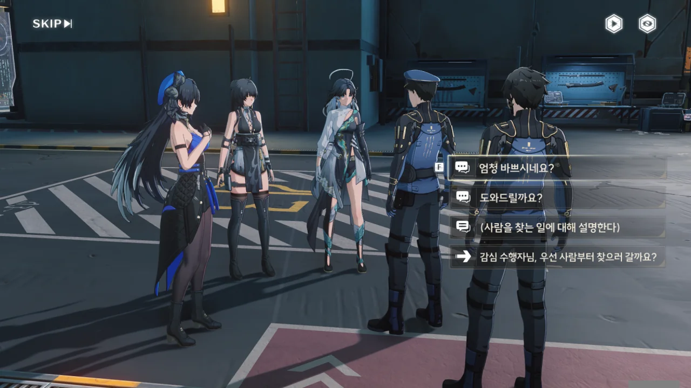
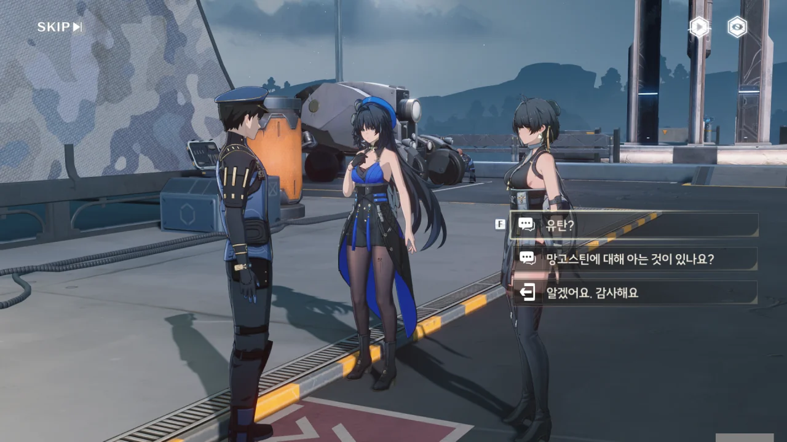
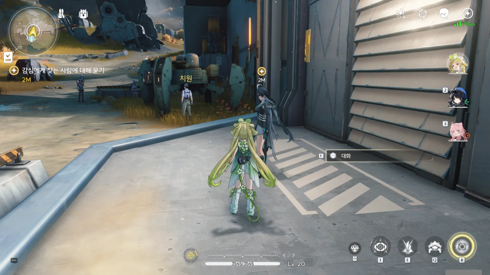
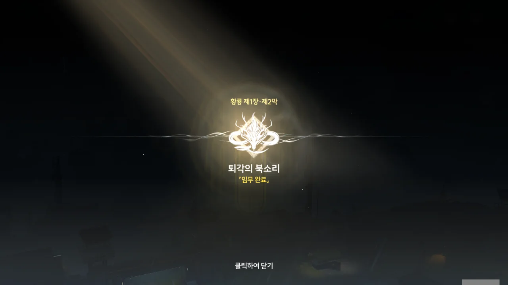



감심이 전장에 온 건 이번이 처음이라고 한다. 평화롭기만 한 성 안과 달리, 여긴 공기부터가 다를걸?





전쟁이란 기본적으로 소모성 활동이다. 생산되는 건 하나도 없는 주제에, 물적 자원과 인적 자원은 아귀같이 빨아먹는 게 바로 전쟁이다.







처음에는 방랑자 일행을 지원자로, 그다음에는 지원 대원으로 오해하는 휴란.





부상자들을 후방으로 호송해야 하는데, 공명자가 오버클럭을 일으킨 사건 때문에 일손이 부족해진 휴란이 도움을 요청한다. 못할 것 없지.

오버클럭... 공명자가 공명 어빌리티를 너무 과도하게 써, 공명 어빌리티가 폭주한 것을 일컫는 용어 같다.





그래, 군인들이 보이지 않는 곳에서 적을 막고 있기에 국민들이 안심하고 일상을 영위할 수 있는 것이다.

그래서 미국에서 군인을 만나면 하는 말이 "Thank you for your service"이고, 군인이 이에 화답하는 말이 "Thank you for your support"이다. 군인을 말로만 대접하는 게 아니라, 군인은 비행기 탑승 시 제일 먼저 탑승할 수 있으며, 승무원은 기내에 군인이 탑승했음을 알리고 승객들은 박수로 감사를 표한다. 군인이 식당에 가면 생판 모르는 사람이 그 군인의 식사비를 대신 지불하기도 하고.





숨을 제대로 쉬기 힘든 거면, 폐 쪽에 문제가 생긴 거 아냐?





아니, 팔 하나가 없는데 어떻게 그게 별 일 아니야?



꽉 잡으라고 한 건, 치료의 고통 때문에 몸부림치는 것 때문이었겠지?





옛날, 군대에 일반인이 많았을 적엔 지금보다 더 많은 사람들이 죽어나갔다고 한다.

기염 장군이 제도를 바꿔, 공명자 위주의 야귀군을 창설한 이후, 이전보다 사상자가 확연히 줄었다.



야귀군 공명자들은 홀로 백 명을 상대할 수 있는데, 이들이 다쳤다는 건 그 이상의 잔상을 상대했다는 의미란다. 그런 상처가 쌓이고 쌓인 것 자체가, 이들이 수천 마리의 잔상을 격파했다는 증표가 된다.





우리가 찾는 군수관은 여기가 아니라 위쪽에 있다고 한다.



감심이 원기 회복 처방전을 건네준다. 말이 처방전이지, 아마 약을 만드는 데 필요한 재료와 배합법 등이 상세히 적혀있는 문서일 거다.





슬슬 체력이 떨어져 가기에, 중추 비콘이 언제 나오나 했는데, 바로 여기 있었다.

맵이 꽤 넓은 것 같기도 하고, 아닌 것 같기도 하고...



이 사람이 군수관이구나. 어딜 가나 바쁜 군인들밖에 보이지 않는다.





> 금주는 황룡의 관문, 잡석 고지는 두 번째 관문입니다. 여기가 함락될 위험이 있다면, 그건 금주만의 일이 아니죠.

분명 저번에 듣기로, 금주는 운릉 산맥 너머에 있는 유일한 주라고 하던데... 그러면 잡석 고지는 금주와 나머지 주 사이에 있는 걸까? '두 번째 관문'이라는 말이 잘 이해가 되지 않는다.

> 끝없는 전쟁 앞에서 보급은 군대의 피와 다름없고, 저는 군을 위해 그 피를 공급해줘야 하는데... 마침 보급이 부족한 시기입니다...

말만 들어도 막막함이 화면 너머로 전해져 온다.







음, 그 마음, 잘 알 것 같다. 그럼 어쩔 수 없지.











치원이 하도 달라붙는 바람에, 하는 수없이 후방 지원을 맡겼다고 한다. 하지만 전선이 위험해지자, 핑계를 대어 치원을 다시 돌려보내려 하고 있었다고 한다.





감심은 치원을 찾으러 먼저 올라갔다.



망고스틴을 꺼내자, 유탄인 줄 알고 군수관이 화들짝 놀란다. 망고스틴과 유탄이 비슷하게 생겼나 보다.





「비명」의 영향으로 전 세계가 기술 소실과 자원 부족에 허덕였다. 새로 발견된 흑석을 이용해 무기를 만들려는 시도가 있었지만, 흑석에 대한 이해가 충분치 않아, 흑석 기술과 기존 기술을 불안정하게 결합한 무기가 만들어졌고, 그중 하나가 바로 '유탄'이라고 한다.

우리가 아는 그 '유탄'과 비슷하지만, 매우 불안정한 폭발물 같다. 니트로글리세린 유탄이라고 이해하면 되는 걸까?







망고스틴은 금주에서 나지 않는 과일이라, 100% 수입에 의존하고 있다. 하지만 최근 잔상류 때문에 수입하는 건 대부분 생필품 위주라, 지금은 잘 수입되지 않는다고 한다.

망고스틴이 들어오는 항구는 금주성 남쪽, '울음새 늪 곤소항'인가 보다.

앞서 말했다시피, 유탄과 혼동하기 쉬운 생김새 때문에, 군용 보급품에는 들어가지 않는다고 한다. 보존기간이 짧은 것도 한몫하겠지만.





> **망고스틴**
> ***
> 금희가 주는 신물 1
> ***
> 옛날 흑석 수류탄 무기와 모양이 비슷하지만 사실은 평범한 과일이다.
> 조사 결과에 따라 수입 과일의 일종으로 확인되었다.
> 변경 지역에 위치한 금주의 기후는 이러한 과일의 성장에 적합하지 않으므로 「남부」에 위치한 곤소항에서 수운을 통해 수입해야 한다.
{.bq}

여기 있었구만, 치원이. 나 방랑자야. 왜 왔는지 알겠나?



감심이 치원을 설득하는 데 성공한 모양이다. 치원은 물자 수송 부대를 따라 성으로 돌아가, 할아버지께 안부를 전할 거라고 한다.





원래 순박한 사람이던 치원은 퇴역 군인인 할아버지의 영향 때문에 전장에 나가 싸우는 데에 집착하게 되었다고 한다.

치원은 어느 누구나 적을 상대할 수 있고, 전장에서 할 일이 있다고 생각하지만, 이는 잘못된 생각이다. 아무나 적과 맞서 싸울 수 있는 건 아니고, 설사 전 국민을 전쟁에 동원하는 총력전이라 하더라도 전방이 아닌 후방에서 지원에 힘쓰는 게 더 효율적인 사람이 있을 수 있다.

야귀군 전투부대는 전부 공명자라고 하던데, 일반인인 치원이 일반인과 공명자의 차이를 쉽게 뛰어넘을 수 있을 거라 생각하진 않는다.





이를 깨닫게 하기 위해, 공명자인 감심은 치원과 대련을 하여 일부러 져줬다. 안 봐도 눈에 뻔하다. 치원이 안간힘을 써서 감심을 공격하려 해도, 치원을 봐주고 있다는 게 눈에 훤하게 보이는 감심을 맞출 수조차 없었겠지.

공명자와의 싸움에서 일반인과 공명자의 차이를 몸으로 깨닫게 된 치원은 자신이 의욕만 앞서 전쟁터에 나서려 했단 걸 인정하게 되었다. 전장에 나가기 위해선 더 노력하고 준비해야 한다는 것도.



볼일을 다 본 감심은 수송 부대와 함께 떠나기로 했다. 우린 아직 할 일이 남았으니, 여기서 헤어질 시간이다.

감심이 통행증 없이 다시 성 안으로 들어갈 수 있을까 순간 걱정했지만, 수송 부대와 함께 갈 테니, 문제는 없겠지.





금희가 망고스틴을 통해 전하려 했던 내용이 뭔지 잘 모르겠다. 그저 망고스틴의 수송경로를 따라가게 만드는 계기인 걸까? 잔상류가 어떤 건지 직접 보여주고 싶었던 걸까?







"먹을 거... 먹을 거..."라는 말이 들려와 정신을 집중하자, 마치 블랙홀과 같은 파동이 보이더니, 땅속에서 솟아나는 잔상과 이를 조종하는 붉은 옷의 여자, 그리고 잔상에게 쫓기는 병사의 모습이 보인다.





병사가 잔상에게 잡히려는 순간, '장군'이라 불린 남자가 나타나 병사를 구해준다.





> 청룡의 인도를 따라서, 가자!

주변에 있던 잔상을 여유롭게 쓸어버린 그는 어느새 모인 병사들과 함께 진격한다.



그리고 갑자기 기염 체험 시간.

대책 스킬을 써보라고 하던데, 처음이라 그런지 쓰기 힘들더라.



붉은 옷의 여자, 푸른 옷의 남자. 참 대비되는 배치네.



붉은 옷을 입고 잔상류를 제어하는 집단은 '잔성회'라고 한다. 분명 이 집단과 앞으로 대립하겠네.



잘 모르겠다. 양양 말처럼, 이번 전투는 어떤 이변의 징후인 걸까?





방랑자가 들은 소리를 양양은 듣지 못했다고 한다.



그래도 방금 전 경험에서 뭔가 깨달은 건지, 방랑자가 뭔가를 감지하기 시작한다. 이전에는 보여주지 않았던 모습이다.





방랑자의 동공이 이상하게 빛나는 것으로 보아, 공명 어빌리티와는 다른 능력을 쓴 모양이다.

산화가 공명 어빌리티를 쓸 때에는 그녀의 동공이 성흔처럼 빛났는데, 이번 방랑자의 동공 모습은 좀 다르다.

아무튼, 다음 목적지는 '소원 연못 마을'이다.

제1장 황룡 제2막 \[퇴각의 북소리\] 완료!



전투 튜토리얼이라고 해야 할까? 게임 전투 시스템을 보다 더 잘 이해할 수 있도록 기술 훈련이 열렸다.

직접 해봤는데, 저스트 회피는 여전히 어렵더라고. 패링 역시 어렵긴 마찬가지지만.



> **「비명 이상 현상」의 영향을 받은 나뭇잎**
> ***
> 금희가 주는 신물 2
> ***
> 두 개의 잔상 주파수 변동이 감지된 보라색 잎사귀.
> 주파수 변동이 서로 겹쳐서 오히려 서로의 정보를 가려서 더 감지하고 잡기 어려워졌다.
> 나무가 자라는 곳에 두 개의 무음구역이 있는 건가?
{.bq}
