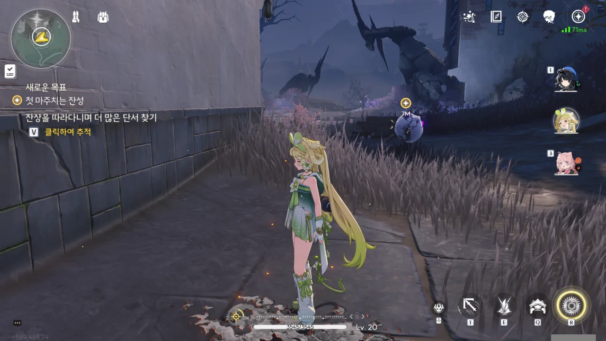
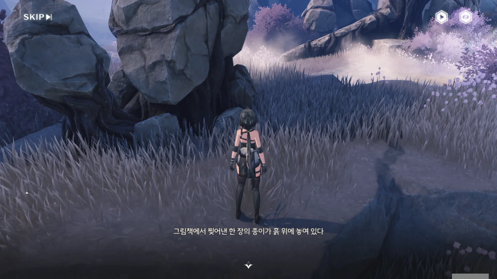
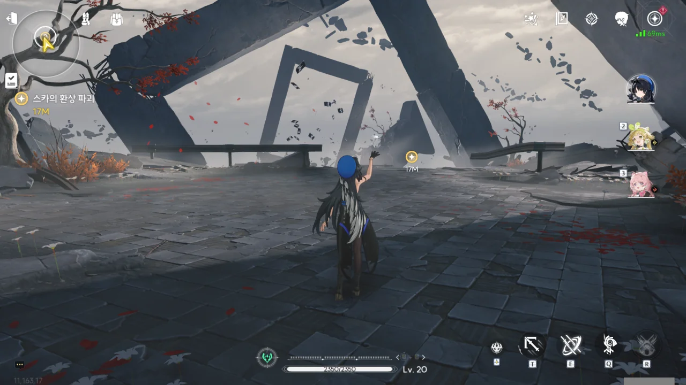
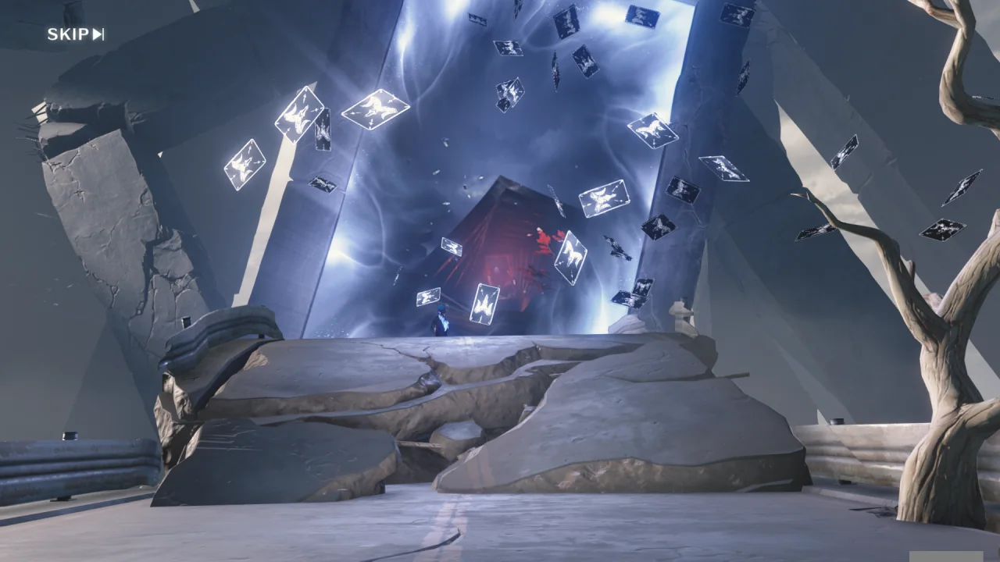

곧바로 스카와 대화해 다음 장면으로 넘어갈 수 있을 것처럼 보이지만, 그러면 재미없지. 직접 단서를 찾아보기로 했다.



잔상을 피해 '소원 연못 마을'에 피난 온 소녀. 부모를 일찍 여의었지만 아직 그 사실을 깨닫진 못한 모양이다. 그녀에게 잔상의 접근을 막는 능력이 있었던 것 때문일까, 마을에 온 지 4년 후, 촌장의 딸로 입양되었다.



스카가 단서 곳곳에 그림책 종이를 뿌려놓았다.







갑자기 우화를 꺼내드는 스카. 실제 있었던 일이 이야기꾼에 의해 가공되어 우화가 된 뒤, 구전되어 내려오는 일이 아예 없는 건 아니니, 스카의 말이 틀린 건 아니다.

스카와 금주 사이의 악연이 이 마을에서 시작되었다는 걸 보면, 스카는 이 마을 출신이었던 걸까? 그리고 금희는 왜 방랑자를 이 마을에 오게 한 걸까?



아까 본 잔상이 뽈뽈거리며 돌아다녀 다음 단서의 위치를 알려준다.



소원을 빈 사람들이 그리 행복한 결말을 맞은 것 같지는 않다.

> 이 ██이 정말 ███, 모두 ██이 원하는 건가?
{.bq}

이걸 보면, 소원의 대가가 제법 컸던 모양이다.





이야기가 거기서 끝날 리가 없지.







> 사람과 사람은 평등하고 등급의 구분이 없어요.

나도 처음엔 그렇게 생각했는데, 요새는 생각이 조금 바뀌었다.

계급이 인간의 본능이라면, 레볼루숑 역시 인간의 본능 아니겠는가? 높은 곳에 앉았으면 엉덩이에 말뚝이 찔릴 각오도 해야지.



'이상적인 세계'는 개뿔이. 세계 곳곳에 테러를 저지르고 다니면서 그런 걸 만들 수 있겠냐?



여긴 다른 단서가 없던 건지, 그냥 그림책 종이만 놓여 있다.







> 나도 전에는 충분한 대가를 치르면 그에 맞는 결과를 얻을 수 있을 줄 알았어.

등가교환을 시도했다가 사기라도 당한 걸까?





벌써부터 이 이야기의 끝이 보이기 시작하는 걸. 너무 뻔하기에, 너무 자주 일어났던 일이다.





> 「이종」, 「그녀를 쫓아내라」, 「괴물」, 「모두 그녀 때문」
{.bq}

음... 설마 잔상의 접근을 막는 능력을 지닌 소녀를 말하는 걸까?













모든 단서를 다 본 것인지, 스카에게 칭찬까지 들었다.





양치기가 밤마다 어린양을 사라지게 만들었다는 건 누가 봐도 뻔한 이야기이다.



소원 성취의 대가가 목숨이란 것 역시 뻔하다면 뻔한 이야기다. 스카의 이야기에서 그 대가를 치른 건 소원을 빈 사람이 아닌, 다른 마을 사람이었겠지만.





자신이 지키려 했던 사람들에게 배신당해 되려 죽임 당하는 이야기 역시 흔해빠졌다.















> 어린양들은 마을에서 서로를 보호하며 야생 늑대의 위협을 피했지.
> 그러다 양치기가 마을에 오면서 그들에게 소원을 이룰 수 있는 힘을 가져다주며, 피난처와 먹이까지 제공해 주었어.
> 양치기는 점점 양 무리를 다스려 갔고, 어린양들은 행복하고 안정된 삶을 살았지. 하지만 이야기는 이제부터가 시작이야.
> 양 무리에 있는 유일한 검은 양을 발견한 양치기는 검은 양에게 "너의 소원을 들어줄 테니 대신 양 무리에 있는 다른 양을 대가로 넘겨라"라고 말했지.
> 검은 양은 양치기의 제안을 거절했고, 그로 인해 양 무리에게 따돌림을 당하여 피난처와 먹이를 잃었어.
> 양치기는 양 무리에게 규칙을 깨고 양들의 실종을 일으킨 범인이 검은 양이라고 말하며, 더 이상 어린양의 소원을 들어주지 않을 것이라고 말했어.
> 어린양들은 자신의 소원을 빌기 위해선, 다른 양을 제물로 바쳐야 한다는 것을 이미 알고 있었지.
> 하지만 그들은 항상 이번에 희생될 「그 양」이 자신이 아닐 거라고 생각했어.
> 동시에 일부 어린양은 자신이 「희생」의 대상이 될 수 있다는 걸 알았고.
> 그들은 또 똑같은 방식으로 다른 양에게 그 희생의 화살을 돌려 소원을 이룰 수 있는 기회를 얻었지.
> 모두가 진실을 알고 있으면서도 아무도 입을 열지 않은 거야.
> 매번 겁을 먹으면서도 욕심에 눈이 멀어 새로운 소원을 빌고, 그렇게 양치기의 규칙에 순응하며 살게 된 거지...
> 어린양들은 계속 「피해자」와 「가해자」 사이를 오가며 이 「아름다운 평화」를 지속했지. 검은 양에 의해 규칙이 깨질 때까지 말이야.
> 이 평화는 검은 양으로 인해 양 무리와 양치기의 거래가 차단되면서 끝나버렸고, 양들은 증오의 불길에 휩싸였어.
> 그렇게 풀밭에 남은 잿더미와 핏자국은 더 이상 숨길 수 없게 되었지.
{.bq}





이 모든 게 그들의 자업자득이라고 말하는 스카.

마을이 알아서 자멸했다고 하기에는 여전히 풀리지 않는 증거가 있다. 다른 증거는 그렇다 쳐도, 불에 탄 카드 잔해와 누군가가 끌려간 자국은 그럼 왜 있는 걸까?

난 아직도 잔성회가 이 마을에 뭔가 수작을 부렸을 거라 의심하고 있다.



방랑자와 자신 모두 기존 규칙을 깬 '검은 양'이라고 말하지만 방랑자와 스카는 어딘가 근본적으로 다르다고 생각한다.



화를 내며 끝끝내 자신이 '검은 양'이라고 주장하는 스카. 그런데 방랑자는 스카에게 '쉽게 무너져 내릴 사람'이라고 말한 적이 없다. 뭔가 스카의 트라우마를 건드린 모양인데... 대체 스카의 과거에 무슨 일이 있었던 걸까?





카드로 결계 같은 걸 펼치는 스카. 지금 보니, 카드에 그려진 문양이 검은 양이다. 허, 끝까지 자기가 '검은 양'이라고 믿고 있는 거구나.

들어와 보니, 이상한 공간 안이다.



> 무궁무진한 혼돈에 빠져... 자! 생각해 봐. 도대체 뭐가 올바른 방향인지.

무슨 말을 하려는 건지 도저히 모르겠는걸.



이게 양양이 말하던 '사이보그'인가?

> 머리를 흔들고 눈을 깜빡이면서, 아기 양 떼가 나타났다. 아기 양 인형, 귀엽지 않아? 검은색, 빨간색 그리고 꽃무늬도 있어.

"그 「끔찍하고 잔인한 미치광이」 말이야"에서 적어도 '미치광이' 부분은 맞는 것 같다. 제대로 미친 것 같네.

'끔찍한' 부분은... 유머 감각?



> 네 발밑에 쓰러진 사람들은 진리를 향해 나아가던 용감한 선구자들이야.

허, 퍽이나 그렇겠다.



> 냉철하고, 무자비하고... 알다시피 우리는 공통점이 너무 많아...

아, 그 말이 하고 싶었던 거였어? 그러니까 방랑자도 잔성회에 합류하라고?

이렇게 회전하는 통로는 은근 자주 보인단 말이지...





> 넌 규칙을 만드는 양치기와 규칙을 깨는 검은 양 중에 어느 쪽이 되고 싶어?
> 만약 한 정상인이 미치광이 사이에 산다면, 그는 정상인일까, 아니면 미치광이일까?
> 잘 생각해 봐. 양치기는 진리의 화신이 아니야. 그가 완전히 사라지고 검은 양이 신뢰를 얻게 된다면... 이 세상은 더 이상 가해자와 피해자를 구분할 필요가 없어질 거야!

1. 그 '정상인'이 정말로 정상인지 아닌지 판단할 기준은 어디서 구할 거냐?
2. 검은 양이 없어도 이미 가해자와 피해자를 구분할 수 없는 사회 아니었어?

기껏 우화를 잘 만들어 놨으면서, 정작 거기서 이끌어내는 논리와 결론이 빵점이다.



양양이 스카의 결계에 간섭한 모양이다. 그 말인즉슨, 양양이 돌아왔다는 소리다.





눈을 떠보니, 양양이 방랑자에게 무릎베개를 해주고 있었다.

스카가 몰래 카드로 뭔가를 하려 했지만, 양양에 의해 저지당했다.



저 멀리 있는 건물 뒤에서 또 다른 빨간 옷의 여자가 나온다. 분명 저 녀석도 잔상회 소속이겠지?





스카는 더 싸우고 싶었던 모양이지만, 여자가 나타나 말리는 탓에, "내가 뭘 하지 말아야 하는지 정도는 알아서 구분할 수 있다"라며 얼버무리고 물러서려는 것 같다.





> 난 그저 네가 하늘의 선물과 솔직한 거래, 천금을 건 도박 중에서 뭘 선택할지 궁금할 뿐이지만...

스카 넌 그냥 얌전히 우화만 쓰는 게 제일 좋을 것 같다. 좋은 선생은 절대 못 되겠네. 무슨 말을 하는 건지 도통 알아들을 수가 없잖아?!



상대방의 실력을 알 수 없으니, 그냥 얌전히 보내는 게 안전하다.

양양은 여태껏 그리 멀지 않은 곳의 폐쇄된 공간에 갇혀 있었다며, 스카의 공명 어빌리티가 이공간 생성과 공간이동인 것 같다고 말한다.

그나저나 방금 전 있었던 공간은 그냥 환상이었구나. 이거, 까딱하다간 환상 속에 영원히 갇힐 뻔한 거였던 거네?
