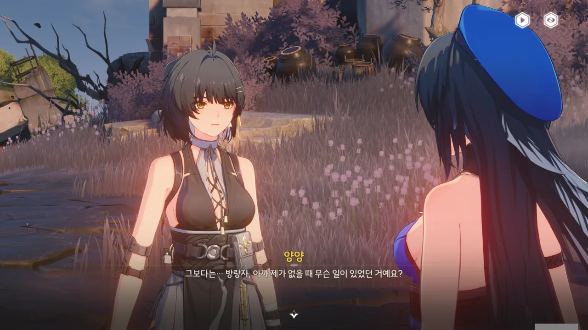
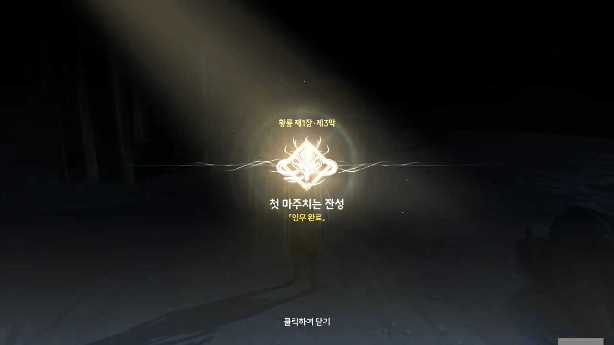





이 잔상에 먹힌 소녀가 말하던 '오빠'는 정말 스카였던 걸까? 스카와 금주의 악연이 이 마을에서 시작되었다고 했으니, 충분히 가능성 있는 추측이다.



뭐, 그렇겠지. 스카의 우화나, 여기 있는 단서만으로는 진상 파악에 큰 도움이 안 된다.

그런데 난 자신이 하고자 하는 말을 우화 형식으로 간접적으로 전달하는 게 꽤 재미있다고 생각하는데. 자신의 이념과 입장을 미화하는 거야, 다들 하는 거니까.



누군가의 시선을 느낀 건지, 방랑자가 어딘가를 쳐다본 후, '남쪽'을 속으로 중얼거리며 떠난다.





스카가 말했던 대로, 방랑자는 인기가 참 많다. 연구원 앞에서도 그러더니, 여기서도 산화가 방랑자를 지켜보고 있네. 방랑자가 느꼈던 건, 산화의 시선이었던 모양이다.

금희가 모습을 감춘 건 처음부터 의도되었던 사항 같다. 대체 뭘 위해서 그런 건진 아직 정확히 잘 모르지만...



마을에서 찾은 반쪽짜리 나무패의 나머지 반쪽을 찾았다.



> **완전한 나무패**
> ***
> 두 조각의 나무판을 완전한 나무판으로 조립
> ***
> 두 조각의 나무판을 완전한 나무판으로 조립. 새겨진 무늬는 여전히 알아볼 수 없어. 어디서 이 나무판을 끼울 수 있는 홈을 본 적이 있는 것 같다.
{.bq}

그 말대로, 근처 물가에 있던 돌에 나무패를 끼울 수 있었다.



마을 한가운데에도 무음구역이 있었는데, 그 근처의 호수 밑바닥에도 무음구역이 있다.

게다가 여긴 물 밑인데도 불구하고 젖은 곳 없이 건조하다. 이게 바로 무음구역의 이상현상인 걸까?

이런 걸 스카가 만들었을 것 같지는 않다. 별 근거는 없지만...

금희가 준 보라색 나뭇잎이 바로 여기서 나온 게 아닐까? 두 잔상 주파수 변동이 겹쳤다고 했잖아. 인근에 두 무음구역이 있으니, 충분히 가능성이 있다.



아까 봤던 잔상이 어느새 여기로 내려왔다. 계속해서 단서를 알려주는 걸 보면, 단순한 잔상이 아니라 마치 유령이라고 해야 할까, 잔류사념이라 해야 할까, 그런 부류의 존재 같은데.

곳곳에 이렇게 사람 모양 돌조각이 있다. 보통 이런 건 진짜로 사람이 변해 만들어진 것일 확률이 높던데...





소녀의 일기장 뒷부분인 것 같다.

단순히 잔상의 접근을 막는 줄 알았던 소녀의 능력은 죽은 사람을 잔상으로 만들고 조종하는 능력이었던 모양이다.

일기에 '양아버지'와 '그'라는 단어가 혼용되어 있어, '그'가 '양아버지'인지, 아니면 다른 사람인 건지 구분하기 어렵다. '그'가 '양아버지'가 아니라면, 왠지 스카일 것 같은데...

마지막에 적힌, "보아하니, 너는 행운이 많은 것 같아"는 분명 스카가 적은 것일 테다.



> **일기**
> ***
> 이상한 일기
> ***
> 이상한 일기. 일기의 주인의 필촉이 어린것 같다. 공명자와 잔상의 기운을 느낄 수 있다.
{.bq}

아이템으로 들어온 이상, 나중에라도 다시 읽어볼 수 있을 것이다.



희생된 소녀는 마을 사람들의 구원을 바랐지만, 그 구원은 이루어지지 않았다.

여태껏 우리가 본 그 조그마한 잔상은 어쩌면 소녀의 시체를 먹은 잔상이 아닌, 소녀의 마지막 소원이 잔상의 형태로 나타난 게 아닐까?



양양이 여기가 너무 춥다며, 올라가자고 한다.





양양은 「바람의 숨결」 공명 어빌리티를 통해 공기에 담긴 정보를 읽을 수 있으니, 분명 이 공기에 서린 다양한 감정 역시 느낄 수 있을 것이다.

그러니 이렇게 감성적으로 될 수도 있지.





이런 비극이 더는 일어나지 않게 하고 싶지만, 그럴 용기와 자신감이 부족해 야귀군에 들어왔다는 양양.

이 세상의 모든 비극은 막을 수 없겠지만, 양양은 분명 자기 주변에 일어나는 '비명' --- 혹은 「비명」 --- 을 막을 수 있을 것이다.



그래, 이미 일어난 일에 대해 후회하는 건 별 도움이 안 된다.

제1장 황룡 제3막 \[첫 마주치는 잔성\] 완료!



다음 이야기인 '제1장 황룡 제4막 \[변정에서 울리는 칼날의 소리\]'는 연각 레벨 14가 되어야 열린다고 한다.

연각 레벨을 올리려면 열심히 게임을 하면 된다. 으으, 하지만 먼저 여태껏 찍은 사진을 정리해서 글로 써야만 하겠지...
