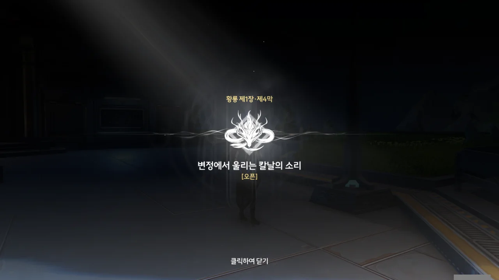



방랑자가 "너무 오버하는 것 같아요"라고 말하지만, 이번 건 조금 오버를 해도 될 것 같다.

그야, 세계구급 테러조직인 잔성회의 간부, 스카와 한 판 싸운 거잖아? 물론 스카에게 방랑자를 해칠 의도가 없었던 것으로 보이지만, 그렇다고 스카가 마냥 샌드백처럼 맞아주기만 한 건 아니라서, 나도 살짝 아프게 맞았다.



'잔성회에 근접한 졸개'가 아마 그 '사이보그'겠지?



잔성회가 왜 인간과 기계의 결합체인 사이보그를 만드는 건가 궁금했는데, 사람을 기계적으로 개조한 잔상과 결합해 공명을 얻게 하기 위해서라고 한다.

'공명의 힘은 공평해야 한다'라는 잔상회의 말에 어느 정도 동의할 수는 있지만, '모든 사람이 공명 어빌리티를 쓸 수 있으면 좋겠네' 정도일 뿐이라, '절대복종 코드'같은 걸 대놓고 같이 끼워 넣었을 기계를 사람에 박아 넣는 것에는 동의할 수 없다. 그건 선을 넘은 거지.



> 머리카락 한 올도... 건들지 않았죠.

건드렸어.

솔직히 잘 모르겠다. 여태껏 방랑자를 미행만 하던 스카가 왜 갑자기 소원 연못 마을에서 방랑자 앞에 나타난 건지, 왜 방랑자를 해칠 의도가 없었던 건지 --- 방랑자가 잔성회에 합류하길 원해서라는 이유를 대긴 했지만, 믿을 수가 있어야지 --- 잘 모르겠다.

그리고 이게 금희가 전하는 메시지 중 하나인 게 아닐까 추측하는 양양의 말은 더더욱 모르겠다.





치샤가 소원 연못 마을에서 일어난 일에 관한 자료를 조사해 보았는데, 거기 있었던 일은 금희가 취임하기 전 이미 처리 완료된 사건이라고 한다. 범죄자는 사형당했고, 나머지 마을 사람들은 새로운 곳으로 이주했다고 한다.

하지만 일기의 주인인 '소녀'가 자료에 없었다는 것으로 보아, 양양 말처럼 스카가 그녀를 데려갔거나, 일기의 마지막 내용이 암시한 것처럼 마을 사람들에게 잡혀 죽은 것 같다.

만약 스카가 그녀를 잔성회에 데려간 거라면, 저번에 만났던 그 빨간 옷의 여자의 정체가 그 소녀라는, 진부한 전개는 보지 않았으면 한다. 너무... 뻔하잖아, 그런 건.

그나저나, 스카가 말한 우화의 내용이 소원 연못 마을의 일을 제대로 반영하지 않았다는 걸 알게 되었다. 거기 있었던 일을 적당히 왜곡해 자기 하고 싶은 말만 한 것 같은데... 역시 혓바닥이 매끄러운 놈의 말은 믿는 게 아냐.







스카가 방랑자 앞에 나타날 것까지 금희가 예상한 게 아닐까 추측하는 방랑자. 난 잘 모르겠던데...

> 잔성회가 방랑자를 끌어들여 사건을 통해 정보를 전달하려는 걸 영윤 대인이 미리 파악했고, 잔성회가 위험하다는 걸 알리려고... 했단 거죠?

> 그 정보들은 스카의 「설교」에 더 가까웠어요.

어우, 머리가 조금 복잡해지려 하는데.

금희의 "저와 금주, 그리고 황룡에게 소중한 분"이란 말, 스카의 "네가 깨어난 후에 보여준 나약한 모습"이란 말은 두 사람이 방랑자의 정체에 대해 어느 정도 알고 있음을 의미한다.

금희와 잔성회 모두 방랑자를 포섭하고 싶어 한다. 잔성회는 대놓고 '너, 잔성회에 들어와라!' --- 스카는 "너의 선택을 기대하고 있지"라고 말했지만, 방랑자가 잔성회에 오길 바란다는 말을 부정하지는 않았다 --- 라고 말한다면, 금희는 '도와주셨으면 좋겠지만, 잘 생각해 보고 결정해 주세요'라고 말한다는 게 차이점이다.

방랑자를 포섭하려면 일단 얼굴을 맞대고 대화를 해야 하니, 잔성회가 방랑자 앞에 나타날 것은 분명하다. 그래서 금희는 산화를 시켜 방랑자를 미행하는 자가 있는지 살피고, 그들과 방랑자 모두를 미행하도록 했다.

스카가 말해준 우화는 소원 연못 마을에 있었던 일을 교묘하게 왜곡해 자기주장을 담는 데 썼던 것으로 판명 났다. 치샤가 말해준 사건의 결말이 우화의 결말과 조금 다르잖아.

그래, 여기까지는 이해했다.

> 이건 금주의 손님 접대 방법이 아니니까요. 그렇지 않나요?

정말 그럴듯한 말이네 ㅋㅋㅋ... 방랑자는 일단 금희의 손님으로 금주에 온 것이니, 손님이 금주에 와 다치게 만든다면 금희 체면이 말이 아니게 되지 않겠는가.



아까부터 백돌 흑돌 선택지가 나오길래, '이게 정말 방랑자가 하고 싶은 말인가?'라고 생각하며 그 선택지를 골라보았다.

치샤가 방랑자의 말을 이해하지 못해, 방랑자가 "별거 아니에요"라고 얼버무리는 상황만 나왔다.

이럴 거면 왜 이런 선택지를 강조한 거야 ㅋㅋㅋㅋㅋㅋ





명식이 되살아나려 한다고? 이전에 그런 이야기가 내가 들은 적이 있었나? 스포일러에서 들은 적은 있는 것 같지만, 여태껏 본 명조 스토리에선 본 적이 없는 것 같은데...

명조의 전반적 설정이나 스토리에 고유명사가 너무 많아, 스토리의 거대한 흐름은 대강 파악할 수 있어도, 이런 세부적인 사항은 제대로 기억하기 어렵다.

심지어 CBT 때 지적된 사항을 개선한 게 이거라고 한다. 예를 들자면, 지금은 '야귀군 행정부대'라는 표현을 주로 쓰지만, CBT 때에는 해당 부대의 정식 명칭인 '답백'이 주로 쓰였다고 한다. '그래서 답백이 뭔데?'라고 사람들이 생각한 건 당연한 이야기.

이런 고유명사 떡칠은 시급히 개선되어야 한다고 생각한다. 스토리 이해도를 떨어트리는 주범이라고. 한때 '아카식 레코드'를 '아카시아 기록'이라 오역한 붕괴: 스타레일보단 낫지만...

> 당연히 잔상을 집어삼키고 에코를 요리하는 방랑자지.

너, 그 표현, 굉장히 마음에 들었나 보구나.

잔상 중 하나인 '꾹꾹복어'를 재료로 한 요리가 있다는 것으로 보아, 잔상을 먹을 수 있을 것 같은데... 과연 무슨 맛일까?





잡석 고지의 후방 부대와 소원 연못 마을에서 얻은 방위 정보는 '남쪽'이다.





시간은 '미시', 방위는 '주작'.

해시계 안에 있던 두루마리에는 「황룡 아카이브」가 어디에 있는지 알려주는 그림이 그려져 있었다.

해시계를 이렇게 화면 한가운데에서 조작하는 걸 보니, 바이오하자드 RE:2가 생각나네.

> 영윤 대인이 보내는 최종 메시지, 이건... 「황룡 아카이브」가 있는 위치예요.
{.bq}

이 번역은 화자를 오해한 것 같다. 그 이유에 대해서는 바로 밑에서 설명하겠다.



양양과 치샤는 금희가 복잡한 방식으로 보낸 소식이니, 매우 큰 기밀일 거라 생각해 두루마리의 내용을 보지 않으려 한다.

그러니 위에서 마치 양양이 방랑자에게 두루마리의 내용을 설명하는 듯한 서술은 잘못된 것이라 보는 게 옳겠지.





「황룡 아카이브」는 각 수호신이 담당하는 황룡의 DB 명칭인데, 해당 지역의 중요 데이터를 담고 있기 때문에 황룡 아카이브가 어디에 있는지는 비밀이라고 한다. 개방 권한은 지역 영윤만이 갖고 있지만, 평소 개방되는 일은 드물다.





방랑자의 신원을 중요 정보를 보관한 황룡 아카이브에서 찾을 수 있다는 말은

1. 방랑자의 과거는 금주와 관련 있다
2. 방랑자의 신원은 간단하지 않다

이 둘을 의미한다고 한다. 왠지 그럴 것 같다고는 계속 생각해 왔지만, 진짜 본격적이네...



방랑자가 갑자기 '변정은 금주의 중심지인가요?'라고 묻자, 금주는 정치적으로도, 지리적으로도 금주의 중심지라는 답변이 돌아왔다.

> 변정은... 가장 먼저 세워졌고, 모든 방위의 시작점이죠.

'정동진'이라는 지명이 한성 광화문을 기준으로 정동 쪽에 위치해 붙여진 이름이라는 이야기 --- 사실이 아니라고 하더라 --- 가 널리 퍼져 있는데, 변정 역시 금주 방위의 기준점이 되나 보다.





그러더니, 뭔갈 깨달은 듯, 금희가 방랑자와 단둘이 만나길 원한다는 말을 꺼낸다. 대체 방랑자는 뭘 본 걸까?

제1장 황룡 제4막 \[변정에서 울리는 칼날의 소리\] 오픈!



> **해제된 해시계**
> ***
> 금희가 주는 신물 3
> ***
> 해독된 해시계 스타일의 기계 장치. 해시계의 방향, 시간 정보가 흐트러져 재구성되며, 그 속에 담긴 영윤의 핵심 메시지를 이미 얻었다. 이제 그곳은 평범한 작은 해시계처럼 보인다.
> 세심히 살펴보면 꼭대기에서 작은 광원이 쏟아져 나오고, 해시계 바늘에 의해 형성된 그림자가 어둡고 불분명해져, 마치 누군가의 낮은 속삭임처럼 보인다.
{.bq}

정말 그런가 싶어 다시 확인해 보니, 꼭대기에 광원은 없었지만, 시곗바늘 반대편에 그림자가 생겼다.

> **「황룡 아카이브」 노선도**
> ***
> 노선도의 「왼쪽 상단」에는 빨간 동그라미로 표시되어 있는데, 아마도 장치가 있는 곳일 것이다
> ***
> 해시계 기관함에서 꺼낸 작은 두루마리. 변정의 대형 데이터베이스 중추인 「황룡 아카이브」의 노선도이다. 노선도의 「왼쪽 상단」에는 빨간 동그라미로 표시되어 있는데, 아마도 장치가 있는 곳일 것이다.
> 빙빙 돌며 겹겹이 쌓으며, 약속대로 약속의 땅에 도착했다.
{.bq}

노선도...? 황룡 아카이브는 열차를 타고 가야 하는 곳인가?
