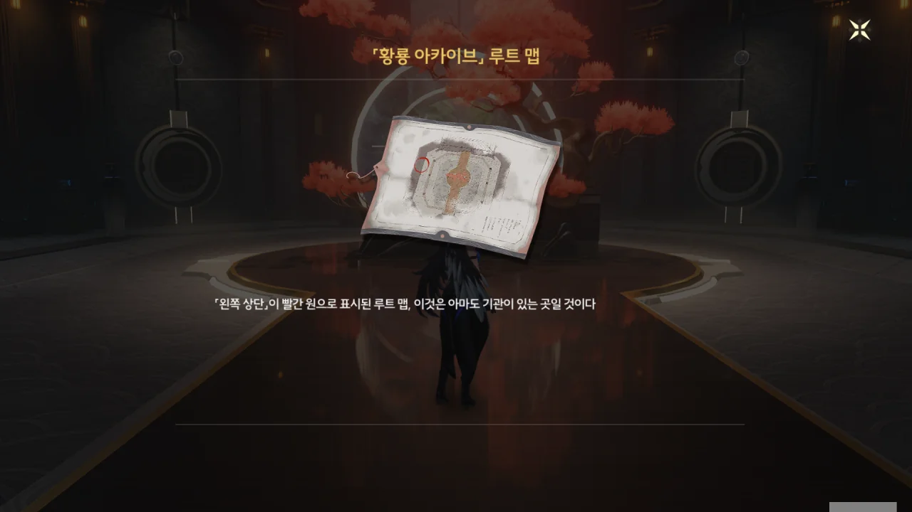
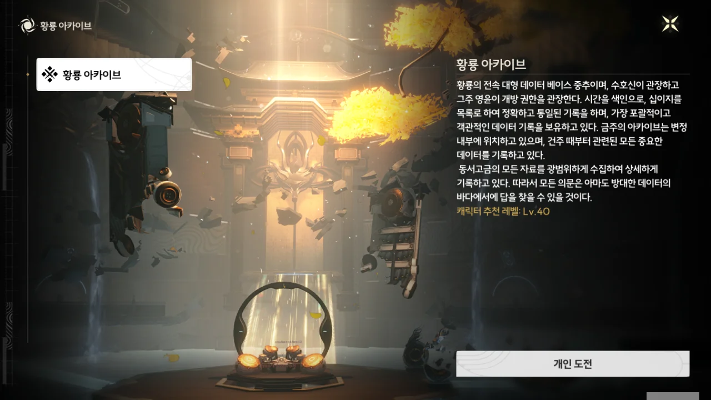

변정에 들어오자, 「황룡 아카이브」로 가는 지도가 자동으로 눈앞에 펼쳐진다.

아까는 '노선도'라고 하더니, 이번엔 '루트 맵'이라고 한다. 대체 어느 장단에 맞춰줘야 하는 걸까?



커다란 꽃병을 만지자, 벽 한쪽이 열리며 통로가 드러난다.

「황룡 아카이브」는 인스턴스 던전 취급이다.

> **황룡 아카이브**
> ***
> 황룡의 전속 대형 데이터베이스 중추이며, 수호신이 관장하고 그 주 영윤이 개방 권한을 관장한다. 시간을 색인으로, 십이지를 목록으로 하여 정확하고 통일된 기록을 하며, 가장 포괄적이고 객관적인 데이터 기록을 보유하고 있다. 금주의 아카이브는 변정 내부에 위치하고 있으며, 건주 때부터 관련된 모든 중요한 데이터를 기록하고 있다.
> 동서고금의 모든 자료를 광범위하게 수집하여 상세하게 기록하고 있다. 따라서 모든 의문은 아마도 방대한 데이터의 바다에서 답을 찾을 수 있을 것이다.
{.bq}

'건주'가 주(州) 이름이 아니라, '금주 건립년'을 뜻하는 建州였어? 이래서 한자어는 안돼... 동음이의어가 너무 많잖아!



연각 레벨을 올리기 위해 곳곳을 돌아다니다, 투명벽에 둘러싸인 시설 하나를 발견한 적이 있다. 난 거기가 황룡 아카이브인 줄 알고 '이야, 여긴 탱크인지 대포인지 모를 것까지 가져다 놓았네'라고 생각했거든. 그런데 변정 안에 황룡 아카이브가 있을 줄은 정말 예상조차 못했다.

뭐, 중요한 건 그만큼 가까이 두는 것이 좋으니, 변정 안에 황룡 아카이브가 있는 것 자체는 전혀 이상하지 않다.



건물 안쪽이 물에 잠겨있다. 처음엔 '데이터베이스 메인프레임의 열을 식히기 위해 메인프레임을 통째로 물에 담가두었나 보다'라고 생각했는데, 그냥 장애물에 불과했다.

지금 글을 쓰며 다시 생각해 보니, 물을 냉각수로 쓰는 건 전혀 좋은 선택이 아니다. 아무리 순수한 증류수를 쓴다고 해도, 불순물이 조금이라도 섞이는 순간 전도성을 띄게 되어 합선을 일으키니, 물은 절대로 냉각수로 쓸 수 없다.





여기가 황룡 아카이브이고, 눈앞에 놓인 콘솔이 황룡 아카이브 터미널인 줄 알았는데, 여긴 그저 황룡 아카이브로 가는 길목이라고 한다. 무슨 길목에 이런 정성을 들여놨나 생각했지만, 국가중요시설 앞에 있는 보안시설이라 생각하니, 납득이 된다.

다섯 개의 음률을 찾아 콘솔에 넣으면 되는 건가...





콘솔 뒤에서 음률 하나를 찾아 콘솔에 넣자, 잠겨있던 북의 잠금이 해제되었다.





북은 가까이 다가가 <kbd>F</kbd>를 누르면 되고, 종은 공격하면 된다.



음률에 가까이 다가가자, 잔상이 나타났다. 실제 잔상은 아니고, 실제 잔상을 투영해 만든 가짜 잔상이다.

경비원 역할을 하는 것이 분명한 잔상을 쓰러트렸지만, 경보가 울리지 않는다. 원래 이렇게 접근하는 건가?



다음 음률의 위치에 대한 힌트도 나온다.

황룡... 황종... 용의 북... 이 녀석들, 노란색이랑 용을 너무 좋아하는 거 아냐?





두 번째 음률을 콘솔에 넣자, 수위가 낮아져 아래층에 접근할 수 있게 되었다.



> 정확하면서도 신속한 안내... 역시, 영윤다워.

갑자기 금희를 칭찬하는 방랑자를 보며 작위적인 칭찬이라는 생각을 했는데, 오히려 이렇게 금희를 칭찬하는 게 당연한 거였다.

황룡 아카이브는 국가중요시설이며, 여긴 황룡 아카이브를 지키는 보안시설이다. 상식적으로 생각해, 이런 곳에 '다음 문의 비밀번호는 어쩌고 저쩌고'하는 힌트를 놓아둘 리 없다. 그러니 이 모든 힌트는 금희가 방랑자를 위해 일부러 놓아둔 것일 수밖에 없다.

그러니 직관적인 힌트를 보고 방랑자가 금희를 칭찬할 수밖에.



다음 목표는 엘리베이터를 타고 위층으로 올라가는 것이다.

하지만 저번에 듣기로, 이 던전에는 총 네 개의 상자가 있다고 한다. 상자 하나에 별의 소리를 10개씩 주니, 별의 소리를 40개나 획득할 수 있는 기회이다. 그럼 당장 찾아야지.





아무리 종을 울려 다리를 회전시켜도 상자가 있는 플랫폼으로 다리가 연결되지 않아, 그냥 헤엄쳐 가 상자를 열었다. 보통 이렇게 길을 물로 막을 경우, 물에 닿으면 게임 오버 처리되어 안전한 지역으로 강제로 이동될 텐데, 여기선 멀쩡하게 헤엄 칠 수 있다. 여기만 그런 건가?

나머지 상자 역시 큰 어려움 없이 찾을 수 있었다. 별소리 40개 우마이~



위층으로 올라가니 또 다른 음률의 소리가 들린다.



아까도 말했다시피, 황룡 아카이브는 국가중요시설이다. 그런데 그곳의 보안이 이렇게 허술하다는 건 도저히 이해할 수 없다.

설마 금희가 일부러 보안 수준을 낮춘 걸까? 대체 뭘 위해서?



이번엔 땅에서 새 플랫폼이 솟아오른다.



네 번째 음률의 소리와 함께, 누군가의 시선을 느꼈다. 방랑자의 뒤를 밟는 건 대체 누굴까?



네 번째 음률을 콘솔에 넣자, 가장 맨 밑바닥이 드러났다.



그곳으로 내려가자 시작되는 성대한 「환영」. 반갑게 맞아주는 歡迎인지 허깨비 幻影인지 잘 모르겠다.





마지막 음률을 콘솔에 넣자, 드디어 황룡 아카이브로 가는 길이 열렸다.



황룡 아카이브로 가는 길은 변정 접객실로 가는 길과 매우 똑같이 생겼다. 심지어 그 안쪽도 네 쌍의 의자와 탁자 대신 거대한 컴퓨터가 있다는 걸 제외하면 접객실과 별로 다를 것이 없다.



금희가 여기 있어야 할 것 같은데... 일단 방랑자 자신에 대한 정보를 DB에서 찾아보기로 했다.





방랑자가 황룡 아카이브에 접속하려는 순간, 난데없이 스카가 나타났다. 설마, 아까 느꼈던 '누군가의 시선'이 설마 스카의 것이었나!



스카를 보고도 별로 놀라워하지 않는 방랑자를 보며 "왜 그런 걸까?"라는 말을 내뱉자마자 꽁꽁 얼어버린 스카.

손이 시려워, 꽁! 발이 시려워, 꽁! 실소가 나오지 않을 수 없다.





스카의 뒤에서 산화와 금희가 나타나자, 이 모든 게 함정이었단 걸 깨달은 스카가 금희가 불러낸 푸른 용에 맞서기 시작한다.



금희가 소환한 푸른 용을 하나하나 자신의 카드로 없애며 연신 웃어대는 걸 보면, 스카는 싸우는 걸 정말 좋아하나 보다. 그래... 가끔 저런 전투광이 있긴 하지...





달려드는 용은 여럿인데 비해 스카의 팔은 단 두 짝이라, 스카는 결국 용에게 물려 그대로 구속당할 수밖에 없었다.

그런데 저렇게 무는 것만으로 움직임을 막을 수 있나?





당연히 불가능했다. 스카가 힘껏 박수를 치자, 구속이 풀려버린다.



잽싸게 도망치려 하는 스카를 방랑자가 뒤쫓는다. 어 딜도 망가!

> 건방진 빨간 옷을 입은 남자 격파
{.bq}

ㅋㅋㅋㅋㅋㅋ 임무 목표, 너 말 참 잘한다 ㅋㅋㅋㅋㅋㅋ

이전과 다르게, 스카가 빨간 카드를 던지며 공격해 온다. 별로 아프진 않다.





조금 어루만져주니, 엄청 행복해하며 검은 양 --- 양인지 염소인지 잘 모르겠지만 --- 괴물의 모습으로 변한다.

설마 하긴 했는데, 정말 자신을 우화 속 '검은 양'이라 생각하나 보다. 저런, 불쌍하게도...







> 보인다고 다 진실이 아냐. 남의 말을 쉽게 믿고, 모든 걸 섣불리 결론짓지 마라.

그거, 스카 너 자신의 말에도 적용되는 거 맞지? '공명의 힘은 공평해야 한다'라고 생각하니, 그 말도 마찬가지로 공평하게 적용해야지.

> 왜 이렇게 집착하는 거지? 왜 날 믿지 않는 거야?

방랑자에게 집착하는 건 스카 자신이고, 방랑자가 스카를 믿지 못하는 건 다 스카 본인의 잘못이다.

오히려 그 말, 내가 해주고 싶은 걸.

&nbsp;

괴물의 모습으로 변한 스카의 패턴에 붙잡기 기술이 두 개 추가되었다.

하나는 방랑자를 붙잡고 땅바닥에 이리저리 패대기치는 기술이다. 이건 그리 아프지 않다.





다른 하나는 이렇게 방랑자를 붙잡아 하늘로 던져 카드로 만든 육방체에 가둔 후, 아래에서 검기를 쏴 육방체 채로 터트리는 것이다. 이건 좀 아프다.

그나저나 육방체 모양을 볼 때, 스카가 쓰는 카드의 비율은 일반적인 금강비(1:1.41)가 아닌 1:2인가 보다.

&nbsp;

스카의 공격이 아프긴 하지만, 내게는 힐러 벨리나가 있다. 에베베벱 약 오르지?





스카가 마지막 발악으로 방랑자를 후려치려 하자, 방랑자가 칼로 맞받아친다.





방랑자와 힘겨루기에서 진 스카는 볼품없게 뒤로 날아가나 싶더니, 손톱으로 바닥에 고랑을 만든다. 하지만 거기서 힘이 다한 건지, 그대로 변신이 풀리며 제자리에 풀썩 쓰러진다.



스카가 만든 환상이 사라진다.





오, 스카의 환상은 안팎에서 같이 깨야만 부서지는구나. 그래서 저번에 양양이 방랑자를 구할 수 있었던 거였네. 이번엔 산화와 금희가 도와줬고.

> 왜 네 주변은 처리해도 끊임없이... 조력자가 나타나는 거냐?
> 넌 인기가 너무 많아.

방랑자와 처음 만났을 때, 방랑자더러 "알 수 없는 존재가 나타났고, 그걸 가지려는 사람들이 여럿 몰려들었거든"이라고 말한 주제에 그런 말을 하니, 헛웃음이 절로 나온다.

스카의 계획은 처음부터 '방랑자가 비협조적으로 나오면 힘으로 누른다'였구나.



> 이번 실패는 내 선물이다. 성의를 표했으니, 우리가 나눈 대화들을 잊지 마라.

싸움에서 진 주제에 혓바닥이 길다. 게다가 너, 육방체에 가둬서 패는 패턴, 여섯 번이나 했어! 그게 어떻게 선물이냐?



응? 방랑자가 이미 모든 걸 다 알고 있다고? 그것도 금희가 다 말해준 거라고? 왜 난 그걸 이제 안 건데?

> 흠... 이 계획들을 언제부터 세워놨던 건지... 정말 궁금해서 미칠 것 같군.

그래, 나도 궁금해서 미칠 것 같다.
