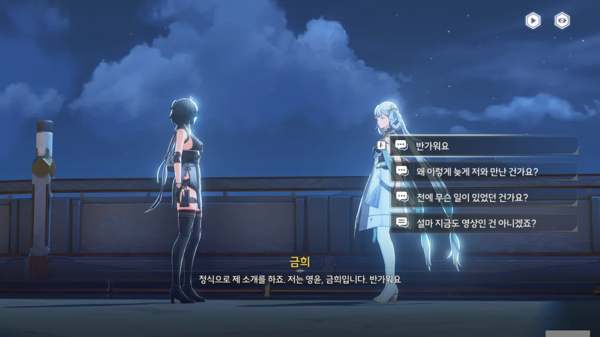
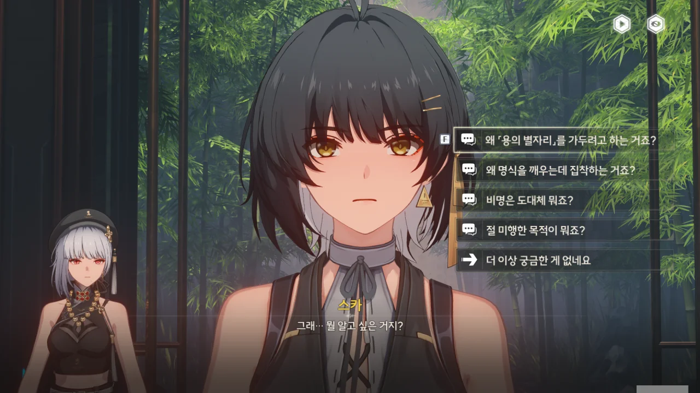
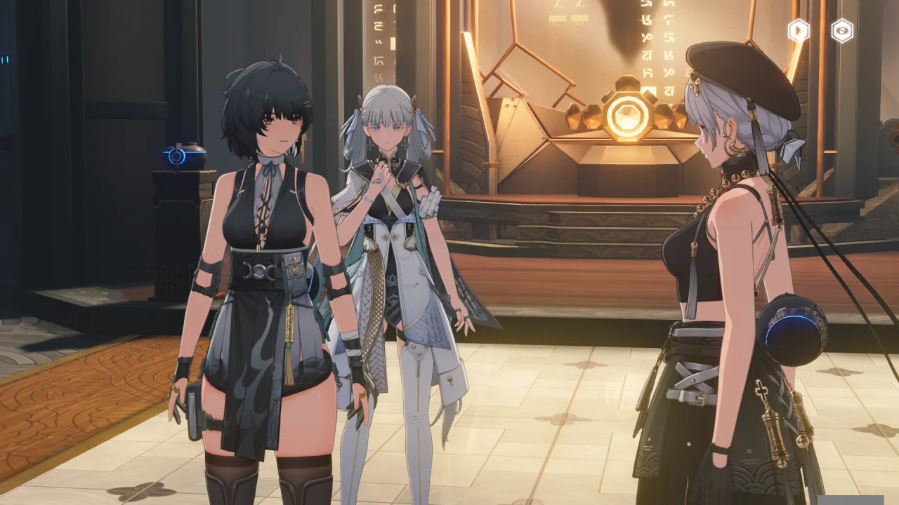
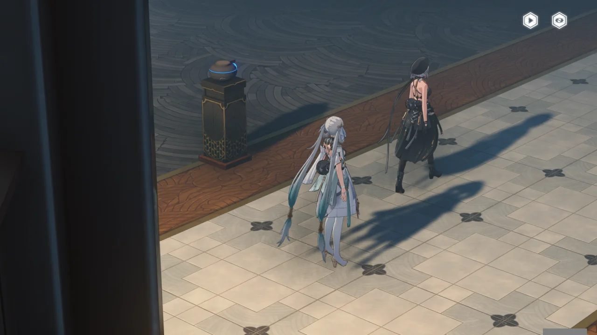
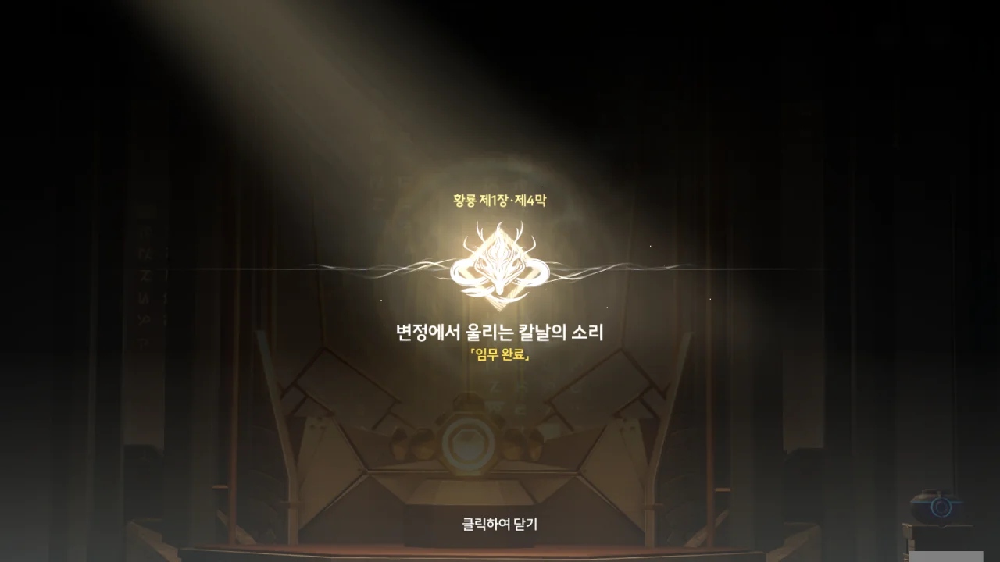
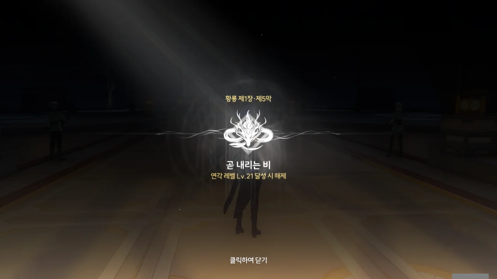
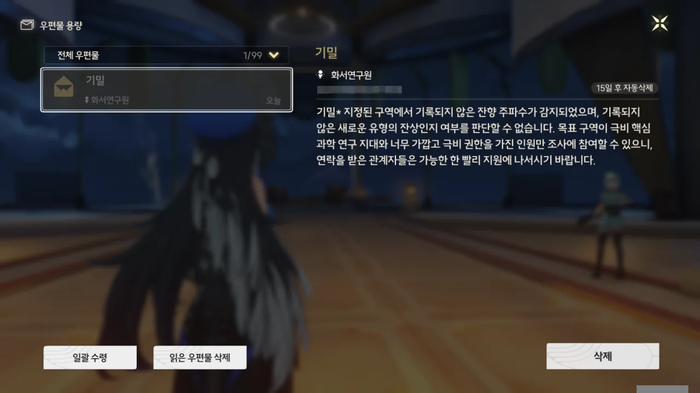

> 며칠 전, 첫 만남
{.bq}

뭐? 방랑자와 금희가 이미 만났다고? 그것도 '며칠 전'에? 그러면 게임은 왜 그 장면을 미리 보여주지 않은 거야?

이건 너무 억울하다. 차라리 변정에 들어갈 때 '며칠 후'라는 내용의 컷신이라도 있었으면 '아, 그 며칠 사이에 방랑자와 금희가 만났구나'라고 납득할 수 있을 텐데, 이건 그냥 질 나쁜 서술 트릭이잖아! 방랑자가 「황룡 아카이브」로 통하는 지도를 얻고 곧바로 변정으로 들어간 것처럼 만들어두고, '짜잔! 사실 방랑자와 금희는 이전에 만난 사이였답니다!'라고 사기 친 거잖아!

명조 스토리 점수가 오늘도 하락하고 있다. 앞으로의 명조 스토리가 계속 이런 식으로 고유명사 남발에 기분 나쁜 서술 트릭으로 점철된다면, 난 명조의 스토리를 쓰레기라고 평가할 수밖에 없을 것이다. 지금 명조의 스토리는 원신은커녕 타워 오브 판타지조차 제대로 따라가지 못하고 있는 것으로 보인다. 이건 굉장한 혹평이다.



워낙 '기행의 호타'라고 불리지만, 타워 오브 판타지의 경우는 정말 이례적이라고 할 수 있다.

타워 오브 판타지의 v1.X의 스토리가 플레이어 이탈 요소의 주요 원인으로 파악되자, 개발사인 호타는 v2.0 판올림에서 중대한 결정을 했다. 바로 v1.X의 모든 메인 스토리를 생략해 선택 임무로 만든 것이다. 새 플레이어가 게임을 시작하면 v1.X의 스토리의 극초반부만 진행하게 되고, 이후의 스토리를 무려 **요약 영상**으로 간접 경험한 후, 곧바로 v2.0의 스토리로 안내받게 된다.

심지어 v1.X의 스토리를 흑역사 취급이라도 하려는 건지, 이후 어떻게 해야 v1.X의 스토리를 볼 수 있는지 따로 알려주지 않기 때문에, v1.X의 스토리를 보려면 커뮤니티 등에서 공략을 찾아봐야 한다.

호타가 v1.X 스토리를 흑역사 취급하려는 정황이 더 있다. 이후 공개된 타워 오브 판타지의 스토리는 v2.0 이후 공개된 스토리와만 연결되며, v1.X의 이야기와의 연결점은 거의 없다시피 하다. 새로 등장하는 적이나 설정 역시 v2.0 이후의 것과 연관되어 있어, 정말 v1.X의 이야기와 설정을 몰라도 게임 스토리를 즐기는 데 큰 지장이 없다.



한국어 대사 녹음까지 다 마친 이상, 명조의 스토리가 빠른 시일 내에 개선될 것 같지 않아, 안타깝기만 하다.





방랑자는 해시계의 가운데 바늘이 만든 그림자를 통해, 금희가 변정 북쪽에서 새벽 동이 틀 무렵에 만나고 싶어 한다는 걸 깨달았다.

아니, 이런 발상은 대체 어떻게 한 거야?





그리고 정말 변정에서 금희가 방랑자를 기다리고 있었다.



> 3일... 약속을 지켰네요. 정식으로 제 소개를 하죠. 저는 영윤, 금희입니다. 반가워요.

드디어 금희를 만났다.

금희가 산화를 통해 전한 '사흘'이란 기한은 '금희가 방랑자를 찾아갈 시기'를 의미한다기보다, '금희가 신물을 통해 방랑자를 평가할 시간'을 의미한 것 같다. 만약 방랑자가 사흘 안에 여기 오지 않았다면, 방랑자의 점수가 대폭 깎였을지도 모르겠네.

다른 질문을 하고 싶었지만, 일단 맨 위의 '반가워요'를 먼저 골랐다. 그런데 이 선택지, 알고 보니 '다시 되돌아오는 선택지'가 아니라서 다른 선택지는 영영 선택할 수 없게 되어버렸다.





금희는 '금주의 수호신 용이 금주를 떠났다'라는 뜻밖의 일 때문에 직접 방랑자와 만나지 못하고, 산화를 시켜 신물만을 건네줄 수밖에 없었다고 한다.

수호신은 문명을 이끌고 수호하며, 그 문명을 대표하는 상징이다. 그런데 그 수호신이 금주를 떠났으니, 당연히 촌각을 다투는 일이라 할 수밖에.



잔성회가 「용의 별자리」를 찾기 위해 용을 가두었다고 한다. 그런데 금희의 말을 들어보면, '「용의 별자리」'와 '용'은 같은 걸 지칭하는 단어로 보인다. 그러면 대체 저게 무슨 소리가 되는 거지? 잔성회가 용의 별자리를 찾기 위해 용의 별자리를 가두고 있다는 말이잖아.

아무튼, 잔성회가 「용의 별자리」를 가둔 초유의 사태에서, 금희는 수호신과의 공감을 통해 금주의 수호신이 위험에 처했음을 알게 되었다.



잔성회 간부인 스카가 금주에 온 목적은 다음과 같다.

1. 방랑자를 미행한 후, 잔성회에 끌어들인다.
2. 「용의 별자리」를 가둬, 「비명」의 회복을 유도한다.

그런데 스카는 왜 방랑자를 잔성회에 끌어들이려 하는 걸까?



잔성회의 본래 계획은 용의 별자리를 가두는 것뿐이었지만, 용의 별자리를 통해 방랑자의 특별한 점에 대해 알게 되자, 방랑자를 잔성회에 끌어들일 계획 역시 세운 모양이다.

스카가 그러했듯, 잔성회는 방랑자가 잔성회 가입을 거부하면 방랑자를 죽여서라도 자신의 계획을 막지 못하게 할 작정이다.



자신에게 스카를 잡을 방법이 있다며, 방랑자의 협조를 구하는 금희.





그 말을 들은 방랑자는 한숨을 깊게 내쉬더니, 금희와 협조하겠다고 말한다.

분명 한숨을 쉬며 '내 팔자야...'라고 생각했을 것이다.



금희가 준 신물을 통해 여러 정보를 얻긴 했지만, 방랑자가 누구인지에 대한 명확한 답은 아직 찾지 못했다.

> 망고스틴은 지금의 전쟁과 백성을 가리키고 있어요.
> 캡슐 사탕은 역병과 역사적 재앙을 가리키고 있어요.
> 나뭇잎은 잔성회를 가리키고 있어요.
> 해시계는 영윤 대인과의 만남을 약속한 거예요.

아, 그게 다 그런 뜻이었어? 해시계의 본래 뜻은 금희와의 만남이었구나. 「황룡 아카이브」로 가는 지도는 일종의 덤이었던 모양이다.





문명의 적, 인류의 근심, 숨은 악, 없애야만 할 강적인 「명식」이 다시 살아나려 하고 있다고 한다. 그걸 어떻게든 막으려 했지만, 잔성회가 「명식」의 부활을 부추기고 있어, 상황이 좋지 않다고 한다.



방랑자가 흡수했던 잔상, 크라운리스는 「명식」의 힘을 지닌 잔상이기에, 크라운리스를 흡수한 방랑자가 주목받게 되었다고 한다.





잔상을 흡수하고 잔상과 교감할 수 있는 방랑자. 방랑자처럼 '맨몸으로 잔향을 흡수한 사람'은 「명식 전쟁」에서 한 번, 금주 건립 기록에서 한 번 등장했다. 금희는 방랑자가 그들과 관련이 있을 거라 생각한다.



이건 단순히 금희 혼자만의 추측이 아니라, 용의 별자리가 이야기해 준 것이기도 하다.





금희가 용의 별자리와 공명하며 본 용의 별자리가 겪은 일과 방랑자가 본 기억이 비슷하다고 하니, 방랑자가 본 건 진짜 있었던 일일 가능성이 높다.

어... 그러니까... 방랑자가 과거 기록 속 그 공명자라고?



아무리 공명자가 일반인보다 오래 산다고 하지만, 이렇게 100년이 넘는 긴 시간 동안 외모의 변화 없이 살아왔다는 건 말도 안 되는 이야기이다. 대체 방랑자의 정체가 뭐지?

용의 공명자인 금희가 용의 별자리와 조카-삼촌 사이로 지내는 정도인데, 과거 방랑자와 용의 별자리는 서로 격의 없이 지냈다고 한다. 말하자면 찐친인 셈이었단 건데...



용의 별자리가 방랑자에게 마지막으로 전한 내용은 '북락 광야로 가 「명식」을 찾으라'는 말이었다.

다음 목적지는 북락 광야가 되겠네.





방랑자가 금희에게 자신이 금주를 구해주길 원하는 거냐 묻자, 금희는 자신이 방랑자에게 원하는 건 방랑자가 잃어버린 자신의 기억을 되찾길 바라는 것뿐이라고 말한다.

금주인 들은 자기 사람이니, 자신이 직접 지켜야 한다고 당돌하게 말하는 금희.





와, 약간 머뭇거리듯 "이건... 비밀로 해주셨으면 해요. 알겠죠?"라고 말하는 금희가 너무 귀엽다!

이런 데서 금희와 잔성회의 차이가 나오는 거다. 잔성회는 뭐랄까, '야, 안 올 거야? 콱! 맞는다?!'라고 방랑자를 윽박지르는 느낌이라면, 금희는 나긋나긋하게 '꼭 안 오셔도 돼요. 그냥 하시는 일이 다 잘 되길 바랄 뿐이에요'라고 말하는 느낌이다. 이러면 누구라도 당연히 금희 손을 들걸? 잔성회 녀석들, 「명식」 꽁무니만 쫓아다니느라 사람 마음을 전혀 모른다.





> 할 말이라고? 차라리 다른 얘기를 해주고 싶군. 너희들이 원하는... 그런 답은 아니겠지만.

스카가 뭔가 더 할 말이 남은 모양이다.

금희가 스카를 추궁하려던 찰나, 방랑자가 먼저 나서 스카에게 질문을 던진다. 방랑자가 직접 미끼가 되어 스카를 잡았으니, 먼저 질문할 권리 정도는 있을 거 아냐.





「용의 별자리」가 미래를 예언해 바꿀 수 있으니, 「용의 별자리」를 가둬 「명식」을 수월하게 부활시키기 위함이라고 한다.







명식을 모아 세상에 「진정한 비명」을 가져와, 새로운 세상을 여는 게 잔성회의 목적이라고 한다.







무슨 말인지 잘 이해하기 힘들지만, 여러 생명체가 비명 안에서 해체되고 융합되어 재조립되는 것을 '새로운 생명', '새로운 문명'이라고 보는 모양이다.

제대로 미친 게 틀림없다.









잔성회의 목적은 스카의 말 그대로, 방랑자가 잔성회에 합류하는 것이다. 그러고 보니, 이 녀석, 처음에도 '방랑자가 잔성회에 합류하길 바라는 거냐?'라고 물었을 때, 그 말을 부정하진 않았지.

이번 한 번 만으로는 잔성회가 방랑자에 대한 관심을 끊을 것 같지 않다. 좀 포기해 줬으면 좋겠는데. 이 정도면 중증 스토킹 아닐까?







잔성회는 이미 세계 곳곳에서 테러를 저지르고 다니는 조직인데, 거기에 '인류의 적' 타이틀 하나 더 붙는다고 해도 개의치 않을 것 같다. 이미 '인류의 적'이지 않은가.

금주성 안에 있는 다른 잔성회 간부는... 그때 만난 그 붉은 옷의 여자인 걸까?





> 너희들은 항상 「용의 별자리」 실종이 우리가 한 거라고 생각하지. 하지만, 그 너머의 진실은... 궁금하지 않은 건가?

그동안 「용의 별자리」와 교감하며 여러 정보를 얻었을 금희를 상대로 저런 말을 하는 걸 보면, 잔성회가 「용의 별자리」에서 뽑아먹은 정보가 꽤 되나 보다.



금희가 산화의 걱정을 뒤로하고 스카의 입에 귀를 가져다 댄다.



무슨 이야기를 들은 건진 모르겠지만, 금희가 화들짝 놀라 뒤로 물러날 정도로 충격적인 말을 들은 모양이다.



뭐? 용의 별자리가 금주를 버렸다고?





방랑자를 "우리와 동행할 수 있는 「검은 양」", "새로운 세계에 발을 들이고 바꿔버릴 권리가 있는 자"라고 부르는 스카. 자신의 카드를 방랑자 발치에 던져두고 광소한다.



금희에게 스카가 무슨 말을 한 거냐고 묻자, "사람을 이간질하려는 속임수일 뿐"이라며, "용의 별자리는 금주 명맥과 관련 있는 것 같다"라고 말을 돌린다.

직접 용의 별자리를 찾아 확인하는 것이 제일 확실하다는 건 알겠는데, 그래도 스카가 뭐라 했는지 정도는 말해주는 게 서로 간의 신뢰에 있어 도움이 되지 않을까? 난 이렇게 정보를 숨기는 걸 별로 좋아하지 않는데 말이다.





용의 별자리는 미래를 보기 때문에, 용의 별자리가 내린 결정은 항상 올바른 건 아니었어도 황룡에 가장 이익이 되는 결정이었다고 한다. 답안지를 보고 치르는 시험 같은 느낌이었겠네.

용의 별자리가 만약 자의로 금주를 떠난 거라면, 그것 역시 금주와 황룡에 있어 최선의 선택일 것이기에 그렇게 했을 것 같다.





용의 별자리가 방랑자에게 남긴 말은 다음과 같았다.

> 폭우가 역류할 때 깨어난 자는 북락 광야에서 기염 장군을 찾아라. 반드시.

기염 장군은 명식에 맞서는 최전선인 북락 광야에서 잔상류와 싸우는 중이라고 한다.

> 「폭우가 역류할 때」라고 말했으니까... 아직 북락 광야로 갈 때는 아니에요. 적어도 지금은요.

그럴 거면 위에서 '폭우가 역류할 때 깨어난 자는,'이 아니라 '폭우가 역류할 때, 깨어난 자는'이라고 번역했어야 하는 거 아냐?





「검은 해안」은 비명의 법칙을 예측할 수 있는 시스템을 갖추고 있으며, 이를 활용해 각국과 협력하는 비밀 조직이라고 한다. 그런데 이 조직이 방랑자가 깨어난 날, 금희에게 방랑자의 정보를 물은 적이 있다고 한다. 대체 왜?



해시계는 금희 혼자만의 작품이 아니라, 「검은 해안」이 제공했거나, 「검은 해안」의 도움을 받아 만든 작품인가 보다. 모르테피가 해시계를 보고 자신이 아는 사람의 초기작과 비슷하다고 한 걸 보면, 모르테피의 지인이 「검은 해안」에 있을지도 모르겠네.

아무튼, 방랑자에 관심이 많은 「검은 해안」이 지금 금주에 있다고 한다.

「검은 해안」 사람이라면 검은 꽃을 반드시 착용해야 한다고 하는데, 그러면 조직을 비밀스럽게 운영하는 의미가 없지 않나? 길을 가다 마주친 사람이 검은 꽃을 차고 있으면 그 사람이 바로 「검은 해안」 사람일 테니 말이다.

금희와 잔성회만 방랑자에 관심을 가진 줄 알았는데, 「검은 해안」까지 방랑자에 관심을 가지다니... 방랑자는 평온하게 살고 싶다...





다들 방랑자에게 지대한 관심을 갖는 이유가 바로 기억을 잃기 전 방랑자가 한 일 때문이란 거잖아. 이런 걸 업보라고 부를 수 있나?

금희가 검은 꽃 사진을 건네주며 「용의 별자리」가 돌아오기 전에 「검은 해안」을 먼저 알아보라는 조언을 해준다.



또다시 용의 별자리를 만났을 때의 장면이 떠오른다. 그런데 방랑자가 왜 그 검은 꽃을 가슴에 차고 있는 거야?



네... 그럼 그렇겠죠...



잔성회에서 방랑자를 감시하려고 보낸 사람이 스카 단 하나뿐은 아닐 것이다. 스카가 체포된 이상, 방랑자와 잔성회가 적대하는 것은 당연한 일이 되어버렸으니, 하루라도 빨리 「검은 해안」과 접촉해 그들의 비호를 받는 게 좋을 것 같다.

방랑자가 황룡 아카이브를 떠난다.





방랑자가 떠난 후, 금희가 산화에게 변정을 잠시 맡아달라고 한다. 이번엔 금희뿐만 아니라 장리까지 금주를 비울 예정이라, 산화는 변정 일로 바빠 방랑자를 이전처럼 몰래 보호해주진 못할 거라고 한다.

중부 평원 습격...? 설마 내가 모르는 또 다른 일이 있었던 건가?



'중부 평원 습격'은 아마 잔성회가 금희를 습격한 사건을 말하나 보다. 금희가 그 일을 계기로 방랑자에게 잔성회의 위험성을 알리려고 하게 되었다고 했으니 말이다.

아까 말했다시피, 산화는 변정의 일을 혼자 도맡아 처리해야 하기 때문에, 이전처럼 방랑자를 몰래 보호해 줄 수 없다. 잔성회가 방랑자를 습격하면, 이젠 방랑자 혼자만의 힘으로 헤쳐나가야 한다.



산화가 황룡 아카이브를 떠난다.



모두가 떠난 「황룡 아카이브」에서 금희가 누군가와 통화를 한다.

금희가 말한 '심문'은 스카의 심문일 거고, '만남'은 방랑자와의 만남일 것이다.

> 스카가 원하는 사람은 금주의 영윤과 귀한 손님뿐. 그의 목적은 알았으니, 그 뜻대로 하시죠.

대체 이게 무슨 말일까? 스카가 금희 역시 노렸다고? 용의 별자리를 가둔 것만으로는 부족했던 걸까?

게다가 화면 너머에 있는 여자 말은 금희가 스카의 의도대로 움직여야 한다는 말처럼 들리는데... 대체 이게 무슨 말이야?





방랑자가 신물에 담긴 의도를 읽었다며, 방랑자와 책사로서 만나야 한다고 주장한다.

인내심... 이리 꼬고 저리 꼬아서 풀기 짜증 나긴 했지.







스카는 용의 별자리와 금주가 서로 전쟁을 벌이게 될 것이라 말했다고 한다. 금희 역시 예전에 용의 별자리와 나눈 이야기, 용의 별자리가 남긴 메시지 등을 통해 앞으로 전쟁이 있을 거라 어렴풋이 예상하고 있었다고 한다.

용의 별자리가 마지막으로 감지된 곳은 '승소산'. 아마 거기가 용의 별자리가 금주에 처음 나타난 곳인가 보다.



> 큰일이군요... 영윤이 우유부단하니. 그리고... 영윤 대인, 더 중요한 게 있을 텐데요.

하... 슬슬 짜증이 나려고 하는데. 자기들끼리만 아는 이야기를 하니, 도저히 따라갈 수가 없다.







금희는 스카가 말한 '전쟁'이 금주와 수호신 사이의 전쟁이 아니라, 금주의 미래가 달린 전쟁이라고 생각하기에, 스카의 말에 흔들리지 않고 원래 하려던 계획을 계속 진행하려는 모양이다. 아무래도 그 계획은 다른 사람의 도움 없이 금희 혼자서 해야만 하는 일인가 보다.

그나저나, 이 사람이 그 '장리'였어? 금희의 선생이자, 「간신」이라 불린다는 그 사람? 이름만 듣고 남자인 줄 알았는데, 여자였네.





장리가 지금껏 '바둑을 두는 자' 역할이었다고 말하는 걸 보면, 장리는 여태껏 배후에서 사건을 꾸미고 일이 흘러가는 방향을 조절하는 역할을 맡은 모양이다. 그런데 이번에는 장리가 직접 나서겠다고 한다.

제1장 황룡 제4막 \[변정에서 울리는 칼날의 소리\] 완료...

이번 이야기는 피곤하기 그지없다.

아잇, 진짜! 다음 조수 임무는 또 연각 레벨 21에 열려? 그만해!!

화서연구원에서 이상한 편지가 도착했다.

> 기밀*
> 지정된 구역에서 기록되지 않은 잔향 주파수가 감지되었으며, 기록되지 않은 새로운 유형의 잔상인지 판단할 수 없습니다. 목표 구역이 극비 핵심 과학 연구 지대와 너무 가깝고 극비 권한을 가진 인원만 조사에 참여할 수 있으니, 연락을 받은 관계자들은 가능한 한 빨리 지원에 나서시기 바랍니다.
{.bq}

이건 대체 무슨 말이지? 설마 다음 조수 임무와 연관 있는 편지인 건가?
