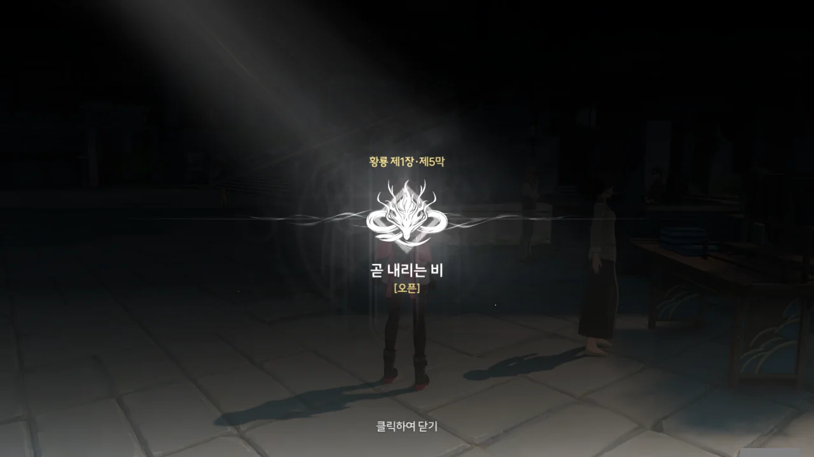
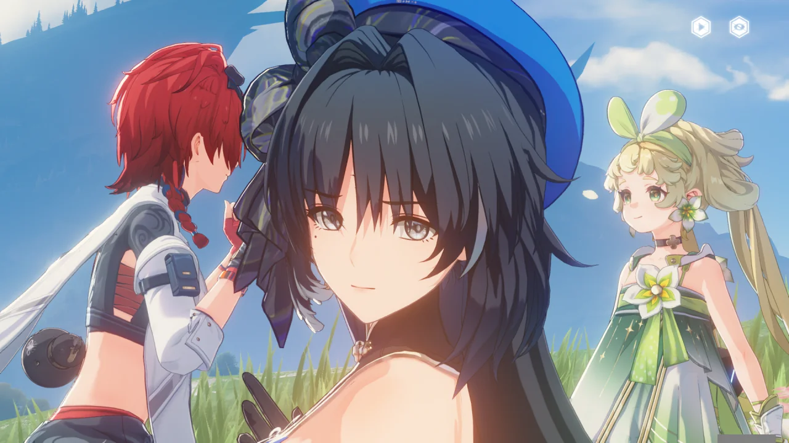

제4막을 마친 후, 한동안 조수 임무에 손을 대지 않았다.

오역도 오역이었지만, 앞으로 남은 이야기에서도 등장인물들이 자기만 아는 이야기를 할까 봐 두려워서였다. 지금 명조가 어떤 꼬락서니인지 [저번](https://tetralog.onrender.com/b/game/wuthering-waves/lots-of-mistranslations)에 살펴보니, 조수 임무는 손대기가 싫어지더라고.

그래서 조수 임무를 하지 않는 대신, 연각 레벨을 올리고 에코를 수집하며 열심히 내실을 다지고 있었다. 하지만 아직 조수 임무를 완료하지 않아 갈 수 없는 지역에 목표한 잔상이 있는 걸 보고, 조수 임무를 하긴 해야겠다 생각했다.

그리고 오늘 드디어 마음을 다잡고 조수 임무를 마저 하기로 했다.



아, 그러고 보니 변정 --- 그리고 「황룡 아카이브」 --- 에서 스카를 잡은 게 저번 이야기였지.

바깥에서 기다리고 있던 양양이 뭔가 불길한 기운을 느꼈나 보다.





설지가 최근 무음구역의 이상한 주파수를 여러 번 감지했다며, 성 밖으로 나갈 거라면 단말기 통신은 원활한지, 보호장치를 제대로 착용했는지 확인하고 가라는 조언을 해준다.

"요즘 연구는 잘 되고 있나요?"라고 물었는데, 선택지별로 다른 대사가 나오는 건 아니었던 건지, 그 위 대사를 선택한 것과 별반 다를 바 없는 대답이 돌아왔다. 방랑자가 "자동 응답 멘트 아니죠..."라고 물은 건 당연한 일이다.

저게 다 설지가 관심을 표현하는 방식이 서툴러서 그렇다고는 하지만, 이건 좀 심하지 않나?





방랑자가 기염, 금희, 「용의 뿔」 --- 누가 뭐래도 난 앞으로 계속 이렇게 부를 거다 --- 사이에 특별한 관계가 있냐 묻자, 기염이 한때 군의관이었다는 정보를 얻었다.

그리고 양양이 또다시 이야기보따리를 풀어놓기 시작했다.





금주에서만 이러는 건진 잘 모르겠지만, 영윤은 중앙 정부에서 임명하는 것이 아니라 그 주의 수호신이 직접 뽑는다. 하지만 그중 극히 일부분만이 수호신의 공명자가 되었다고 한다. 즉, 모든 영윤이 금희처럼 수호신의 공명자는 아니었다는 말이다.

금주의 경우, 전임 영윤이 퇴임한 이후, 「용의 뿔」이 오랫동안 다음 영윤을 선택하지 않아, 영윤 자리가 한동안 공백이었다.

정황상, 영윤은 종신직인 것으로 보이며, 본인이 원한다면 퇴임도 가능한 것으로 보인다. 보통 이렇게 *신적 존재*가 뽑는 직책은 은퇴하고 싶어도 할 수 없는 종신직임을 생각하면, 신기한 제도이다.



여기서 말하는 「병기」가 뭔진 모르겠지만, 「무상선주」 --- 이것 역시 마찬가지로 앞으로 계속 이렇게 부를 거다 --- 는 두 가지 능력을 갖고 있다.

1. 「병기」의 주파수를 흡수해 자신의 힘을 증강
2. 죽은 사람의 잔향을 잔상으로 바꿈

즉, 아군 무기의 힘을 빼앗고, 죽은 아군을 적군으로 바꾸는 능력이다. 이건... 그냥 답이 없는데?

이런 적을 상대하려면 이쪽도 마찬가지로 자원과 인력을 갈아 넣는 물량전으로 가야 한다. 하지만 저번에 만난 군수관이 '보급이 부족하다'라고 했으니, 현재 금주는 물량마저 무상선주에 밀리고 있는 것으로 보인다.







> 두 개의 달이 뜨는 날, 재앙이 일어날 것이다

저번에 시뮬레이션 영역에서 보라색 달이 뜬 걸 봤는데, 설마 그걸 말하는 건 아니겠지? 하지만 여기선 '핏빛 달'이라 했으니, 확실치는 않다.

무상선주를 신나게 밀어붙이던 와중, 무상선주에 의해 --- 정황상 --- 「역류하는 폭우」가 내리자, 전세가 순식간에 뒤바뀌었다고 한다.

당시 야귀군 장군이었던 가서림 장군은 무상선주와 사투를 벌이다 그대로 전장 속에서 행방불명이 되어버렸다.



그때 한 소년 --- 분명 기염이겠지 --- 이 황룡의 깃발을 높이 들어 야귀군을 이끌었고, 잔상의 포위망을 뚫고 전장에서 탈출하는 데 성공했다. 이후 세운 여러 공을 사 「용의 뿔」은 그 소년을 새 선봉장군으로 임명했다.

전임 장군인 가서림 장군은 잘못된 군령을 내려 야귀군을 거의 전멸시킨 죄를 물어 대역죄인이 되었다고 한다.

지금 야귀군의 구성원 대부분이 공명자인 건 현 장군인 기염이 제도를 바꾼 이후라 했으니, 이때의 야귀군의 피해는 그야말로 시산혈해라고 해도 과언이 아닐 것이다.

전쟁에 동원되는 군인은 사회에서는 우수한 노동력이다. 그 많은 노동력을 전투 한 번에 모조리 말아먹었으니, 가서림 장군이 대역죄인 취급받는 건 당연하다면 당연한 소리일 것이다.



노동력의 급감으로 인해 황폐화된 금주였지만, 무조건 손해만 본 것은 아니었다. 오랫동안 활동이 없던 「용의 뿔」이 새 영윤 --- 금희 --- 을 뽑고 활동을 재개했기 때문이다.





「용의 뿔」이 왜 하필이면 금희를 영윤으로 뽑았을까를 물어보자, 그게 바로 신과 인간의 차이점이라는 대답이 나왔다. 음, 이런 식의 대답은 별로 좋아하지 않는데...





「용의 뿔」이 금희를 영윤으로 뽑기 전, 그녀의 의사를 물어봤을까를 물어보았다. 돌아온 대답은 '어린 데다 경력이 짧은 것 때문에 금희를 부정적으로 보는 사람이라도 그녀 뒤에 있는 「용의 뿔」의 선택을 믿고 그녀를 존중한다'였다. 뭔가 앞뒤가 안 맞는데?

금주 사람들은 뭔가 이해하기 힘들다. 어린 데다 경력이 짧아 금희를 의심하는 건 충분히 이해할 수 있지만, 명백한 실적을 보여줘도 완전한 인정은 할 수 없다는 건 대체 무슨 말인지 모르겠네. 그건 그냥 답정너잖아. '네가 아무리 잘해봤자 난 널 싫어할 거다'와 뭐가 달라?





아무튼, 「용의 뿔」이 여태껏 고른 영윤들은 모두 수완이 좋고 지략이 뛰어났으며, 이번 영윤인 금희가 짧은 시간 안에 금주를 질서 있게 다스리게 된 것 역시 그녀의 수완과 지략이 뛰어남을 증명하는 것이라는 말을 들었다.

미래를 볼 수 있다는 건 정답지를 바로 옆에 펼쳐 놓고 보는 것과 다를 바 없다. 「용의 뿔」과 공명하여 소통할 수 있는 영윤은 정답지를 원할 때마다 볼 수 있었을 것이고, 정답지를 볼 수 없는 영윤은 「용의 뿔」이 수완과 지략을 보고 뽑은 사람인만큼, 자신의 힘으로 위기를 헤쳐나갔을 것이다.

뭔가 대단하네... 이게 바로 미래를 보는 힘인 걸까?





「용의 뿔」의 말에 따라 북락 광야로 가야 한다고 말하자, 거긴 명식과 싸우는 최전선이라 너무 위험하니, 신중하게 생각해야 한다고 말한다.







어둠 속에 숨어있는 잔성회를 섣불리 찾다가 공연히 그들의 먹잇감만 될 수 있다며, 잔성회를 찾는 것 역시 만류한다.







금희가 「검은 해안」을 비밀 조직이라 했으니, 들어본 적 없는 게 당연하겠지.

북락 광야는 너무 위험하고, 잔성회 간부를 찾는 것 역시 마찬가지로 위험하니, 「검은 해안」을 찾는 게 제일 낫다는 결론이 나왔다.







「검은 해안」 사람들이 착용하고 다닌다는 「검은 꽃」에 대해선 꽃집을 운영하고 있는 '린 할머니'에게 도움을 구하기로 했다.

제1장 황룡 제5막 \[곧 내리는 비\] 오픈!

이번엔 제발 자기들만 아는 이야기로 도배되지 않았으면 좋겠다.





아, 성이 '린'이고 이름이 '수'라서 '린 할머니'라고 불리는 거였구나.

> 맨손으로 잔상을 찢고, 에코를 숯불에 굽고, 발로 지옥불 기사를 차버리고, 한방에 폭주 고릴라도 쓰러트리는

조수 임무를 하지 않을 동안, 열심히 에코를 모아 데이터 스테이션의 레벨을 올리고 다녔기 때문에, 지옥불 기사도 폭주 고릴라도 최소 한 번씩 잡은 적이 있어 뜨끔했다.

> 이렇게 젊으신데 할머니라고 부르면 안 되겠죠?

입에 버터를 바르고 한 말이 아니라, 진짜 주름이 별로 안 보여서 한 말이었다. 나머지 두 선택지는 별로 내키지 않더라고.





린 할머니도 이 검은 꽃은 처음 본다는 반응이다. 그럼 이제 누구에게 물어야 하지?





린 할머니 말고도 식물에 정통한 공명자가 있다고 한다. 멀리서 --- 아마 황룡이 아닌 다른 나라에서 --- 온 아가씨인데, 부지런한 데다 다양한 식물의 습성을 잘 알고 있어 린 할머니 역시 많은 도움을 받았다고 한다.

> 조그맣고 하얗고 보송보송한 게... 웃는 건 또 얼마나 사랑스러운지. 눈은 사슴같이 크고 반짝거리는데, 별꽃을 보는 것 같다니까.
> 가끔은 내가 「작은 별꽃아! 밥 먹으러 오너라」하고 부르면, 항상 흔쾌히 와주는데, 얼마나 귀엽던지.

'작은 별꽃'이라니, 정말 묘한 비유이다. 웃긴 건, 저 비유를 듣고 그게 누구인지 대번에 알아챘다는 거다.





예전에 린 할머니가 지나가는 말로 뒷산에 꽃밭을 가꾸고 싶다고 하자, 이후 그녀는 쉬지도 않고 뒷산 생태 조사 연구를 하고 있다고 한다. 마음씨가 참 곱네. 린 할머니가 손녀 삼고 싶다고 하는 말이 이해가 되네...

뒷산으로 가려면 광장에 있는 폭포를 지나가면 된다고 한다.



말 그대로 '폭포를 지나가' 곳곳에 난 꽃의 인도를 따라 꽃으로 만들어진 다리를 건넌다.





응... 벨리나일 것 같더라. 벨리나, 참 귀엽지. 나도 좋아해. 지금 내 파티 힐러로 잘 쓰고 있기도 하다.





그녀를 부르는 칭호에 대해 린 할머니에게 들은 건 '작은 별꽃'이 전부였으니, "당신이 별꽃인가요?"라고 묻는 건 당연한 거다. 암, 그렇고 말고.

그냥 무난하게 "대부분 「반가워요」라고 해요" 선택지를 골랐는데, 벨리나를 꼽준 모양새가 되어버렸다. 음, 이건 내가 의도한 게 아닌데.

예상했던 대로, 벨리나는 모르테피처럼 신 연방에서 온 사람이다. 서양식 이름을 가진 사람은 신 연방 출신이라 생각하면 대부분 들어맞더라고. 아직 공개된 나라가 황룡 아니면 신 연방 둘 뿐이니, 당연한 말이겠지만.

갑자기 든 의문점인데, '신 연방'은 '新 연방'인 걸까, 아니면 다른 '신'인 걸까?



아, 그 꽃과 다리는 린 할머니에게 길을 안내해 주려고 남겨둔 거였구나. 난 벨리나가 방랑자가 올 걸 알고 의도적으로 그렇게 길을 만든 건 줄 알았는데... 이게 바로 자의식 과잉이라는 건가 보다.



검은 꽃을 보여주자, 자연에 순수한 검은색 꽃이 없다는 점을 들어 인공 염색을 한 꽃일 가능성을 제시하는 벨리나. 린 할머니가 인정한 전문가답게, 형태와 구조가 유사한 꽃을 벌써 몇 가지 생각해 냈다.







잎이 곁잎임을 들어 붓꽃이 아닐 거라고 말하는 걸 보아, 사진엔 잎의 모습도 나와있는 것 같다. 내가 본 사진엔 잎이 없던데.

그 밖에도 여러 꽃을 예시로 들지만, 다들 하나씩 이 검은 꽃과 불일치하는 부분이 있다.





벨리나는 검은 꽃의 특이한 생김새와 사진에 보이는 미세한 주파수 파동의 흔적을 통해, 검은 꽃은 공명의 힘과 연관된, 인공적으로 재배된 매우 특별한 울림 식물이라는 추측을 내놓는다.

나머지 정보는 이 사진 한 장만으로는 판단하기 어렵다고 하니, 검은 꽃에 대한 정보는 이게 최선인 것 같다.







'「검은 해안」 사람들은 검은 꽃을 몸에 달고 다닌다'를 뒤집어 '검은 꽃을 몸에 달고 다니면 「검은 해안」 사람으로 오해받을 수 있다'라는 말을 이끌어냈다.

아무것도 모르는 사람에겐 그냥 단순한 꽃 장식이겠지만, 「검은 해안」 사람이라면 이걸 보고 흠칫할 거란 말이지.





벨리나가 공명의 힘으로 겉모습만은 사진과 똑같은 검은 꽃을 만들어 주었다. 대체 공명의 힘이란 뭘까? 거의 만능인 것 같은데.

아무튼 생긋 웃는 벨리나가 귀여웠다.

양양이 뭔갈 느낀 듯, 뒤를 돌아본다.



> | | |
> |:--|:--|
> | 치샤 | 우와! 진짜랑 완전 똑같은데... |
> | 벨리나 | 아, 아니에요. 그렇게 대단하지 않아요... |
> {_borderless=true,_thead=false}

대단한 거 맞는데? 자신감이 부족한 건지, 그저 겸손한 것일 뿐인지 잘 모르겠다.





치샤는 검은 꽃을 엄청 좋아하네. 「검은 해안」 역시 그녀가 동경하는 '영웅'의 모습과 어느 정도 맞닿아 있어 그런 것일지도 모르겠다.

그래도 초면에 그렇게 들이대는 건 실례가 아닐까 싶지만.





양양이 주변에 떨어져 있던 검은 꽃잎과 바람의 숨결을 통해 방랑자가 미행당하고 있다는 걸 눈치챘다. 검은 꽃잎이라 했으니, 보나 마나 「검은 해안」일 것이다. 그쪽에서 알아서 찾아와 줄 줄은 몰랐는데.





'불길한 기운'이란 말을 듣고 '설마 「검은 해안」도 잔성회와 다를 바 없는 조직이었던 건가?'라고 생각했는데, 불길한 기운은 바로 잔성회를 가리키는 것이었다. 대체 잔성회가 왜 여기에 있는 거야? 게다가 '그 여자'는 또 뭐고?

방랑자는 여전히 미행당하는 중이다.



그래서 재빠르게 정상으로 올라가, 미행자를 역으로 매복해 기다리기로 했다.

아니, 느긋하게 걷고 있었는데 난데없이 시간제한을 걸어버리니, 당황스럽기 짝이 없더라고.



방랑자의 발자국을 따라온 누군가.

이 여자, 방랑자가 처음 금주성에 왔을 때 뒤에서 "여기 있었네. 사랑하는... 운명의... 씨앗..."이라는 변태 같은 말을 한 사람이다.





뒤에 잔상이 나타나자, 뒤도 돌아보지 않고 넝쿨 같은 무언가로 잔상을 꿰뚫어버린 후, 그대로 가던 길을 간다.

흠... 붉은색... 잔성회 사람이 아니었으면 좋겠는데.



머리에 검은 꽃을 달고 있는 걸 보면, 「검은 해안」 사람인 건 맞는 것 같다.

누군진 잘 모르겠지만, 볼을 살짝 부풀린 모습이 귀엽네.









방랑자를 보자마자 대뜸 공격부터 하는 여자. 아까까지만 해도 하얀 머리에 검은 눈동자였는데, 갑자기 붉은 머리에 붉은 꽃모양 눈동자로 변했다. 가슴팍에 달려있던 꽃 역시 만개했다.

환영 인사가 너무 과한데, 이거.

방랑자가 달려들자 '어?'라고 말하는 듯 얼빠진 표정이 귀엽다. Gotcha, bitch!





방랑자가 완벽하게 이 여자를 쓰러트리고 목에 칼을 들이댄 줄 알았는데, 방랑자의 팔이 넝쿨에 묶여, 더는 움직이지 못하고 있다. 저렇게 실실 쪼개는 데에는 다 이유가 있었던 거다.





> 설마 화났어? 화난 걸 보니... 나도 모르게 흥분이 되는데!

이 여자의 이름은 아직 모르지만, 첫인상 하나는 확실하게 박아준다. '미친 변태'.





「검은 해안」의 구성원은 「흑화집사」라고 부르며, 그들이 달고 다니는 검은 꽃은 그들의 사명인 '세상을 구하자'를 뜻한다고 한다. '규칙'을 언급한 걸 보면, 검은 꽃을 달고 다니는 게 그들의 규칙인 모양이다.





> 검은 해안의 목적? 뭐였더라...
> 확실히 난 목표는 별로 관심 없어.
> 마음껏 권력을 추구하고, 먹이를 쫓고, 사냥감을 사냥하고, 본능을 따라야지. 쾌락도 좇고.

말하는 걸 보면 검은 해안이 아니라 잔성회 쪽 사람인 것처럼 보이는데. 방랑자 역시 그렇게 생각한 건지, "잔성회와 무슨 차이가 있는 거죠?"라고 묻는다.





그녀의 가치관은 검은 해안보다 잔성회에 더 가까워 보이지만, 그럼에도 그녀가 검은 해안에서 활동하는 이유는 방랑자가 검은 해안에서 가장 특별한 「씨앗」 --- 저번에 말했던 '운명의 씨앗'인가 보다 --- 이며, 그녀는 「씨앗」을 보호하고 길러 번성시킬 사명이 있기 때문이라고 한다.

다만 "과일이 익을 때까지 기다렸다가 직접 딴 다음 단맛을 느낄 수 있거든"이라고 말하는 걸 보면, 단순히 「씨앗」을 번성시키는 것만이 그녀의 목적은 아닌 모양이다. 이런 수상한 사람까지 구성원으로 넣어도 되는 거야, 검은 해안?





이 여자의 인상이 바뀌었다. 이건 그냥 '미친 변태'가 아니라 '크싸레'였어... 조금 무서울 정도다.





그래도 자신을 잔성회와 비교하는 건 조금 기분 나빴나 보다. 하지만 이 녀석과 잔성회 둘 다, 방랑자에 눈독 들이고 있잖아, 지금.

> 그저 「사소한 속임수」에 그들의 사람을 옭아매다니.

이건 대체 무슨 말이지? 방랑자와 금희가 순조롭게 만날 수 있도록 '잔성회의 그 녀석'을 잡았다고 하는데...

설마, 스카가 말한, 잔성회의 또 다른 간부를 이 녀석이 이미 잡았다는 거야? 그런데 스카는 그걸 알고도 '지금 금주에 다른 잔성회 간부가 있지롱'이라고 허풍 떤 거고? 스카 이 녀석, 인상이 조금이라도 좋아지려고 하면 금방 까먹는다니까.



지금까지는 그냥 어울려준 것뿐이라는 듯이, 방랑자의 팔을 묶고 있던 넝쿨을 잡아당겨 방랑자의 칼날을 자신의 목에서 떼어낸다.



> | | |
> |:--|:--|
> | ??? | 많은 대답을 했으니... 이제는 내 차례겠지? |
> | 방랑자 | 무엇이 궁금한 거죠? |
> | ??? | 난 별로 궁금한 게 없는데 |
> {_borderless=true,_thead=false}

지금 장난하는 것도 아니고...



> 그냥 네가 이런 눈빛으로 날...

설마... 매도당하는 게 취향인 건가...?

> 그리고... 너한테서 익숙한 기운이...

이건 대체 무슨 말일까?







자신의 이름을 '카멜리아'라고 밝힌 그녀는 방랑자의 단말기가 깜빡이는 틈을 타 방랑자를 공격하는 척하면서 도망쳤다.

> 다음번엔 이렇게 빨리 잡히지 말라고.

내가 할 소리다, 그건.





아까 방랑자의 단말기가 깜빡였던 이유가 양양이 건 통신 때문이었나 보다.

치샤가 수상한 사람을 발견했다고 하니, 상가 쪽으로 가야겠다.
