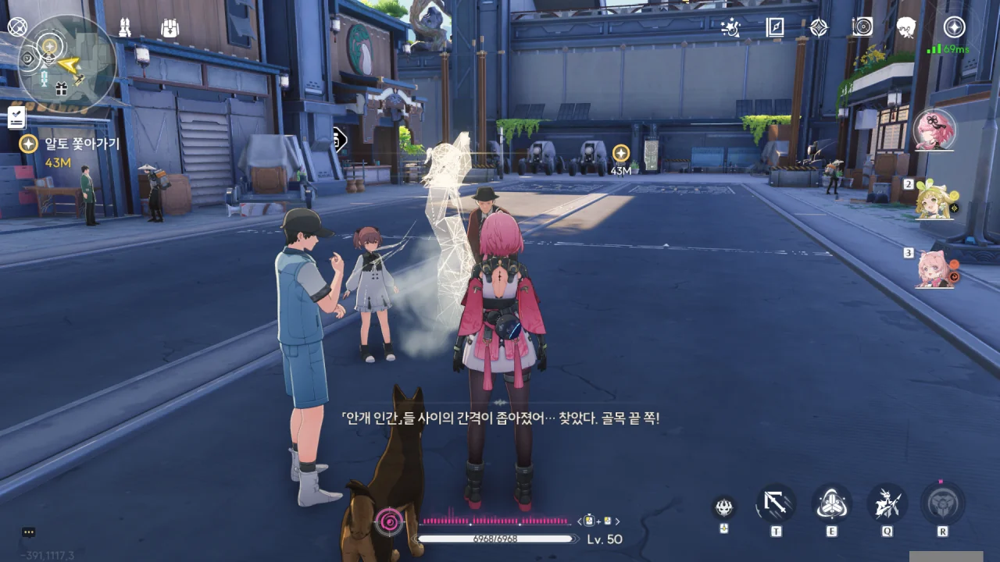





흠... 검은 꽃... 꽃의 안쪽을 보지 못해 확신할 수는 없지만, 아마 저 사람은 「검은 해안」 소속일 것이다. 누가 저렇게 검은 꽃을 괜히 들고 다녀?

이 사람이 상가를 기웃거리며 쓸데없이 사람들에게 말을 걸고 다니는 모습을 치샤가 보았다고 한다. 그 옆에 있었다는 조그만 여자애는 어디 간 건지 모르지만.







* 영업 허가증: 없음
* 고정된 사업장: 없음
* 조직 인증서: 없음
* 명확히 규정된 업무 내용: 없음

불법 여부를 떠나, 그냥 '수상함' 그 자체이다.







> 우리의 별과 함께 태어난 존재이며, 별의 의지의 화신, 그리고 세상 만물의 울림...

조직 책임자가 누구냐 묻자, 헛소리를 대신 잔뜩 늘어놓는다. 음... 본인이 주장하는 '정보 상인'보다는 '사이비 신도'에 더 가까워 보이는데?

그러니까 알토 --- 이름을 들은 적이 없는데, 그냥 이 사람의 이름이 '알토'라는 걸 곧바로 알려준다 --- 가 치샤에게 임의동행을 요구받는 건 당연한 결과이다.



알토가 자신은 그저 '사람들 사이에 있어도 제일 눈에 띄는 쪼끄만 여자애'를 찾고 있었을 뿐이라고 주장한다.



그 여자애에 대해 방랑자가 들은 건 '조그만 여자애'가 전부라, "작은 키?"를 골랐다. 어떻게 알았긴, 방금 치샤에게 들었는데.

정황상 '작은 키', '핑크 머리', '깡충깡충 뛰어다니는' 전부가 그 여자애에 해당하는 말인가 보다.

음... 내가 아는 명조 캐릭터 중 그 조건에 부합하는 건 딱 한 명밖에 없는데...





다리 건너에서 벨리나와 앙코가 나타났다. 이 둘은 대체 언제 만난 거지?

'내가 바로 그 여자애예요!'라고 주장하듯, '작은 키', '핑크 머리', '깡충깡충 뛰어다니는' 전부 나왔다.





방랑자를 발견한 앙코가 이게 정말이냐는 듯 눈을 비비더니, 여전히 눈앞에 서있는 방랑자를 보고 엄청 좋아한다. 눈비비는 앙코, 너무 귀여워!





앙코가 방랑자에게 우다다 달려온다.



"찾았다"라고? 앙코가 방랑자를 찾고 있었다고? 왜?



알토가 앙코에게 다가가려 하자, 치샤가 알토 앞을 가로막는다. 그야, 알토는 지금 잔뜩 의심받는 중이잖아.



여태껏 계속 앙코를 찾고 있었다는 알토의 말에, 치샤가 앙코에게 알토를 아냐고 묻는다. 아는 사람은 맞았던 모양이다.



> 허가도 안 받고 사업을 하고, 브로커 노릇도 하고, 영업 비밀 도청도 잘하고, 어린애를 놀리는 것도 좋아하지만...

이 말을 들은 치샤와 방랑자가 알토를 흘겨보자, 알토가 애써 상황을 무마하려는 듯 씨익 난처한 웃음을 짓는다.

그리고 입을 앙다문 앙코는 귀엽다.



거기에 대해 알토가 따지는 부분은 앙코가 자신을 삼촌이라 불렀다는 것이다. 지금 그게 중요한 게 아닐 텐데? 지금 중요한 건 알토가 무허가 영업, 브로커, 도청 등의 혐의를 부정하지 않았다는 거다.





그런데 대체 벨리나와 앙코는 어떻게 만난 걸까? 벨리나가 말하길, 뒷산에서 돌아오는 와중, 독버섯을 생으로 먹고 있던 앙코를 만나, 다급히 약을 만들어주었다고 한다.

> 앙코 걱정은 하지 마. 이런 버섯들은 전에도 많이 먹어봤어.

아니, 대체 무슨 삶을 살아야 독버섯을 생으로 많이 먹어봤다고 말할 수 있는 거야? 그것도 저렇게 해맑게?



> 그런데... 앙코, 왜 혼자 그런 위험한 곳에 간 거죠?

그러게. 알토가 앙코를 잘 보살폈다면 앙코가 그런 위험한 곳에 가 독버섯을 먹을 일도 없었을 텐데 말이다. 알토도 그걸 아는지, 난처한 듯 머리를 긁적인다.





> 왜냐하면... 앙코는 이 언니를 감시해야 하니까!

그리고 이어지는 앙코의 폭탄발언. 감시? 방랑자를?

> | | |
> |:--|:--|
> | 알토 | 아하하하... 애들이 다 그렇지. 평소에도 이상한 말 하는 걸 좋아하잖아. 너무 신경 쓰지 마... |
> | 앙코 | 뭐야, 알토! 알토가 앙코한테 이렇게 하라고 했잖아. |
> {_borderless=true,_thead=false}

알토가 앙코의 말을 '애들이 하는 이상한 말'이라며 애써 무마하려 했지만, 곧바로 이어지는 앙코의 항의에 다 들통났다.

그러니까... 알토가 앙코를 시켜 방랑자를 감시하려 했다는 건가? 사람들의 눈빛이 차갑게 식는 것도 이해가 된다.





알토가 드디어 본심을 말하는 건가 싶었는데, 연막을 뿌리고는 그대로 앙코와 함께 도망쳐버렸다.



일행과 흩어져, 벨리나는 거주 단지 쪽으로 가보기로 했다.





> *날개를 펴고 비상하는 듯한 모습*
> 어린이와 노인은 안개에 속지 않는다. 신규 고객 20% 할인.
{.bq}

이야, 이 집, 도발 잘하네.

치샤는 순찰소 쪽으로 향했다.





> *반갑게 인사하는 모습*
> 만남은 인연. 우리의 우정이 오래가기를!
{.bq}

양양이 광장 쪽으로 향했다. 이거, 의도적으로 방랑자만 따로 떼놓으려는 것 같은데?



> *하트를 만드는 이상한 포즈*
> 조급해하지 마!
{.bq}

알토, 묘하게 사람을 꼴받게 만드는 데 재능이 있다.

정말 알토가 노렸던 게 방랑자를 다른 일행과 떨어트리는 것이었던 모양이다. 저기 골목 끝에 대놓고 '나 여기 있소' 하고 서있네.





> 도망친 거라고 생각해? 우리 목표는, 처음부터 너였는데.

이들이 노리는 게 방랑자라는 건 사람들을 하나씩 떼놓는 걸 보고 이미 눈치챘다. 얄밉게 웃는 알토를 보니, 한 대만 때려주고 싶다. 

> 따단! 앙코랑 알토 삼촌은 어떻게 하려는 게 아니야...

아니, 뒤에서 슬쩍 나타나서 "언니, 도망가지 마"라고 하면 당연히 놀라지...



음, 알겠다. 알토는 온갖 부끄러운 짓을 전부 앙코에게 시켜놓고, 정작 본인은 점잖은 체하는 사람이구나? 글러먹었네.





알토의 말을 들어보면, 알토와 앙코는 모두 「검은 해안」 사람인 것 같다. 그렇지 않고서야 저렇게 말할 리 없잖아.

이들이 알고 있는 다른 식물계 공명자라는 게 설마... 그 '카멜리아'라는 미친 변태는 아니겠지?





> 네가 찾고자 하는 사람... 멀리 있는 것 같았겠지만, 사실은 코앞에 있었다고!

그렇게 말하기에는 우리, 방금 만난 거 아냐? 뭐, 아무튼, 이들이 「검은 해안」 소속이라는 확답을 들었다.

그리고 앙코는 귀엽다.





맨입으로 방랑자에 대한 정보를 알려줄 수 없으니, 직정 유적지에 함께 가 「데이터 비콘」을 회수하는 걸 도와달라고 한다. 그러면 방랑자에 대해 알고 있는 모든 정보를 알려주겠다고 한다.

벌써부터 의심이 드는데. 회수 작업이 끝나면 입을 싹 씻고 몰래 도망치거나, 알맹이 없는 정보만 알려줄 것만 같다.





아, 알토는 검은 해안의 초청 멤버였구나. 앙코도 마찬가지로 초청 멤버인지는 잘 모르겠다.

알토가 새로운 고객에게 주는 추가 선물이라며 방랑자의 옷에 검은 꽃을 달아준다. 알토의 옷에도 어느샌가 검은 꽃이 달려있다. 알토의 말처럼, 나중에 벨리나에게 이 꽃에 대해 물어보면 이 꽃이 진짜인지 아닌지 알 수 있을 것이다.

앙코가 마치 '나는?'이라고 말하듯 고개를 갸웃거리는 건 알토가 앙코에게 검은 꽃을 달아주지 않아서인가?





알토가 "애교라도 부려봐"라고 말하자, 짓궂은 표정을 짓더니 곧바로 애교를 부리는 앙코. 크윽, 비겁하게 미인계 --- 귀여운 것도 미인이라 해야 할지는 잘 모르겠지만 --- 를 쓰다니!



울음새 늪 비콘 옆에서 기다리겠다는 말을 남기고, 아까의 안개쇼 대신 평범하게 달려서 퇴장하는 알토와 앙코.





알토가 준 검은 꽃이 진짜임을 벨리나가 확인해 줬다. 이 검은 꽃은 다른 울림 식물과는 비교할 수 없을 정도로 울림 에너지가 많다고 한다.



그들과 거래를 했어, 양양...





직정 유적지는 '수년' 동안 방치된 과학 연구 기관이라고 한다. 유적인데 고작 '수년'이라고?

그곳에 발길이 끊긴 이유는 울음새 늪의 이상기후 때문인 것으로 보인다.

> 제가 연구원에 연락해서 방랑자의 데이터를 중추 비콘으로 전송해 울음새 늪 근처 비콘의 잠금을 해제할게요.

이미 직접 가서 해제한 지 오래다.



> **기이한 모양의 검은 꽃**
> ***
> 기이한 모양의 검은 꽃
> ***
> 이 기이한 모양의 검은 꽃은 검은 해안 멤버의 신원 표시다. 손에 쥐면 그 안에 담긴 엄청난 양의 울림 에너지를 느낄 수 있다.
{.bq}
